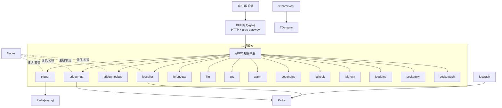
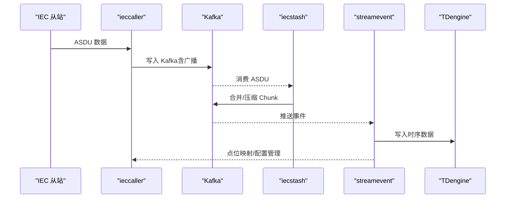
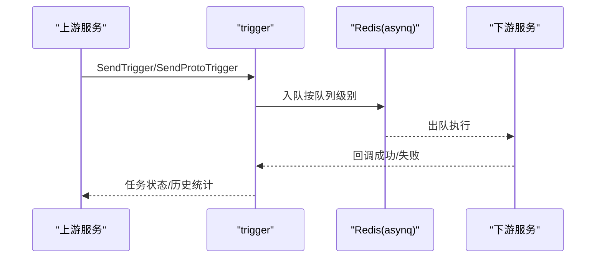
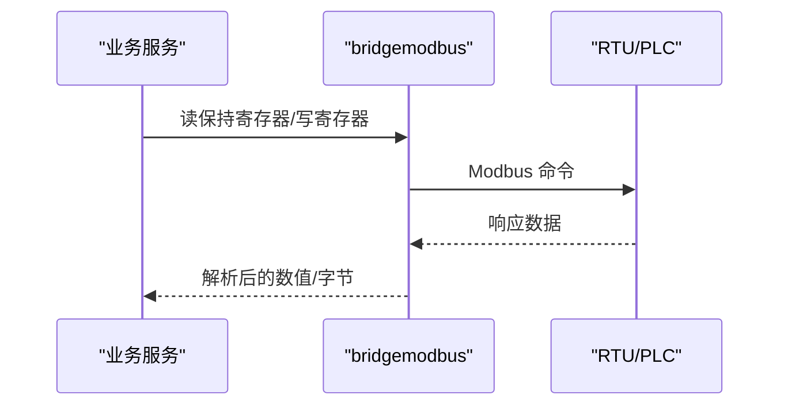
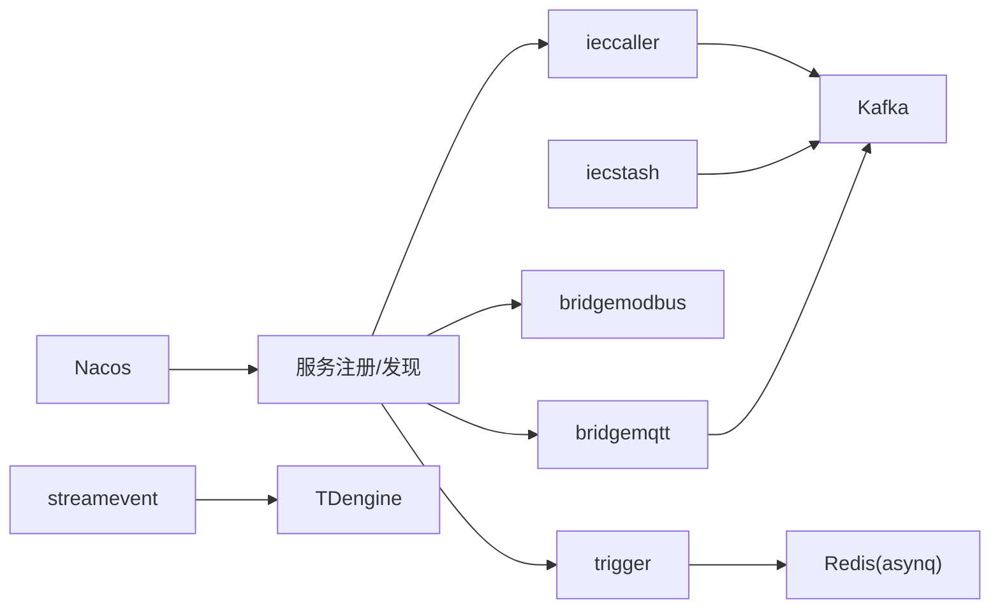

# 架构设计原则

<cite>
**本文引用的文件**
- [README.md](file://README.md)
- [trigger.proto](file://app/trigger/trigger.proto)
- [ieccaller.proto](file://app/ieccaller/ieccaller.proto)
- [bridgemodbus.proto](file://app/bridgemodbus/bridgemodbus.proto)
- [bridgemqtt.proto](file://app/bridgemqtt/bridgemqtt.proto)
- [register.go](file://common/nacosx/register.go)
- [resolver.go](file://common/nacosx/resolver.go)
- [options.go](file://common/nacosx/options.go)
- [asynqClient.go](file://common/asynqx/asynqClient.go)
- [asynqTaskServer.go](file://common/asynqx/asynqTaskServer.go)
- [tasktype.go](file://common/asynqx/tasktype.go)
- [trigger 配置 config.go](file://app/trigger/internal/config/config.go)
- [ieccaller 配置 config.go](file://app/ieccaller/internal/config/config.go)
- [bridgemodbus 配置 config.go](file://app/bridgemodbus/internal/config/config.go)
- [bridgemqtt 配置 config.go](file://app/bridgemqtt/internal/config/config.go)
- [resilience-patterns.md](file://.trae/skills/zero-skills/references/resilience-patterns.md)
- [rpc-patterns.md](file://.trae/skills/zero-skills/references/rpc-patterns.md)
- [plan-architecture.md](file://.trae/skills/zero-skills/skill-patterns/plan-architecture.md)
</cite>

## 目录
1. [引言](#引言)
2. [项目结构](#项目结构)
3. [核心组件](#核心组件)
4. [架构总览](#架构总览)
5. [详细组件分析](#详细组件分析)
6. [依赖分析](#依赖分析)
7. [性能考量](#性能考量)
8. [故障排查指南](#故障排查指南)
9. [结论](#结论)
10. [附录](#附录)

## 引言
本指南围绕 zero-service 的微服务架构，系统总结“架构设计原则”的最佳实践，重点覆盖以下方面：
- 微服务拆分策略与边界设计：服务粒度划分、领域驱动设计（DDD）与聚合根定义
- 服务间通信设计模式：同步调用、异步消息传递、事件驱动架构、CQRS
- 数据一致性保障：分布式事务、Saga 模式、最终一致与强一致的权衡
- 服务发现与负载均衡：客户端与服务端负载均衡、熔断与降级
- 分布式系统容错：超时控制、重试、隔离与故障转移
- 架构演进与重构：演进策略、技术债管理与架构治理

本指南结合仓库中实际的服务划分、协议定义、公共组件与运行配置，给出可落地的设计建议与实施路径。

## 项目结构
zero-service 采用 go-zero 微服务脚手架，围绕工业物联网场景（IEC 104 数采、异步任务调度、实时通信、协议桥接、容器管理、地理信息等）进行模块化组织。整体结构如下：

```mermaid
graph TB
subgraph "应用层"
IECCALLER["ieccaller<br/>IEC 104 主站"]
IECSTASH["iecstash<br/>数据合并"]
STREAMEVENT["streamevent<br/>统一流事件协议"]
TRIGGER["trigger<br/>异步任务调度"]
BRIDGEMODBUS["bridgemodbus<br/>Modbus 桥接"]
BRIDGEMQTT["bridgemqtt<br/>MQTT 桥接"]
BRIDGEDUMP["bridgedump<br/>文件生成"]
FILE["file<br/>文件服务"]
GIS["gis<br/>地理信息"]
ALARM["alarm<br/>告警服务"]
PODENGINE["podengine<br/>容器管理"]
BRIDGEGTW["bridgegtw<br/>HTTP 代理网关"]
LALHOOK["lalhook<br/>流媒体回调"]
LALPROXY["lalproxy<br/>流媒体代理"]
LOGDUMP["logdump<br/>日志导出"]
SOCKETGTW["socketgtw<br/>SocketIO 网关"]
SOCKETPUSH["socketpush<br/>SocketIO 推送"]
end
subgraph "公共组件"
NACOSX["nacosx<br/>服务注册/发现"]
ASYNQX["asynqx<br/>任务队列"]
INTERCEPTORS["Interceptor<br/>gRPC 拦截器"]
IEC104["iec104<br/>IEC 104 协议实现"]
MODBUSX["modbusx<br/>Modbus 扩展"]
MQTTPKG["mqttx<br/>MQTT 扩展"]
OSSX["ossx<br/>对象存储"]
DBX["dbx<br/>数据库扩展"]
GISX["gisx<br/>地理信息处理"]
DOCKERX["dockerx<br/>Docker 封装"]
IMAGEX["imagex<br/>图像处理"]
end
subgraph "基础设施"
KAFKA["Kafka"]
REDIS["Redis"]
TDENGINE["TDengine"]
MYSQL["MySQL/PostgreSQL"]
MINIO["MinIO/OSS/COS"]
NACOS["Nacos"]
end
IECCALLER --> KAFKA
IECSTASH --> KAFKA
BRIDGEMQTT --> KAFKA
TRIGGER --> REDIS
TRIGGER --> ASYNQX
STREAMEVENT --> TDENGINE
BRIDGEMODBUS --> IECCALLER
BRIDGEMQTT --> STREAMEVENT
SOCKETGTW --> SOCKETPUSH
NACOSX -. 注册/发现 .- IECCALLER
NACOSX -. 注册/发现 .- TRIGGER
NACOSX -. 注册/发现 .- BRIDGEMODBUS
NACOSX -. 注册/发现 .- BRIDGEMQTT
```

图表来源
- [README.md](file://README.md)
- [trigger.proto](file://app/trigger/trigger.proto)
- [ieccaller.proto](file://app/ieccaller/ieccaller.proto)
- [bridgemodbus.proto](file://app/bridgemodbus/bridgemodbus.proto)
- [bridgemqtt.proto](file://app/bridgemqtt/bridgemqtt.proto)

章节来源
- [README.md](file://README.md)

## 核心组件
- 服务边界与职责
  - IEC 104 数采平台：ieccaller（主站）、iecstash（合并）、streamevent（落库），形成“采集-聚合-存储”的闭环
  - 异步任务调度：trigger（基于 asynq 的任务队列 + 计划任务引擎）
  - 协议桥接：bridgemodbus（Modbus）、bridgemqtt（MQTT）、bridgegtw（HTTP 代理）
  - 实时通信：socketgtw（连接/房间/路由）、socketpush（推送）
  - 文件与地理：file（分片上传/OSS）、gis（H3/GeoHash/围栏/坐标）
  - 容器管理：podengine（Docker 生命周期）
  - 告警与日志：alarm（多级告警）、logdump（日志导出）
  - 流媒体：lalhook（回调）、lalproxy（代理）

- 通信与协议
  - gRPC + grpc-gateway + Protocol Buffers
  - Kafka（go-queue）作为异步消息总线
  - asynq + Redis 作为分布式任务队列
  - SocketIO（fork）用于实时通信
  - IEC 60870-5-104（go-iecp5）、Modbus（grid-x/modbus）、MQTT（paho.mqtt）

- 服务发现与治理
  - Nacos 用于服务注册与发现
  - go-zero 提供自动熔断、限流、负载均衡与自适应限流（生产模式）

章节来源
- [README.md](file://README.md)
- [trigger 配置 config.go](file://app/trigger/internal/config/config.go)
- [ieccaller 配置 config.go](file://app/ieccaller/internal/config/config.go)
- [bridgemodbus 配置 config.go](file://app/bridgemodbus/internal/config/config.go)
- [bridgemqtt 配置 config.go](file://app/bridgemqtt/internal/config/config.go)

## 架构总览
下图展示 zero-service 的总体架构与关键数据流，体现“同步 RPC + 异步消息 + 事件驱动”的混合模式，并强调服务发现与任务队列在系统中的中枢作用。

图表来源
- [README.md](file://README.md)
- [trigger 配置 config.go](file://app/trigger/internal/config/config.go)
- [ieccaller 配置 config.go](file://app/ieccaller/internal/config/config.go)
- [bridgemodbus 配置 config.go](file://app/bridgemodbus/internal/config/config.go)
- [bridgemqtt 配置 config.go](file://app/bridgemqtt/internal/config/config.go)

## 详细组件分析

### IEC 104 数采平台（ieccaller/iecstash/streamevent）
- 设计要点
  - 服务拆分：采集（ieccaller）- 聚合（iecstash）- 落库（streamevent），职责清晰、边界明确
  - 数据流：IEC 从站 -> ieccaller -> Kafka -> iecstash -> streamevent -> TDengine；同时支持 gRPC/MQTT 推送
  - 配置与并发：支持多主站并发、批量配置、广播推送、Chunk 批量处理
- 一致性与可靠性
  - Kafka 作为事件总线，提供最终一致性；streamevent 负责事件聚合与入库
  - ieccaller 的 GracePeriod 与 PushAsduChunkBytes 控制吞吐与稳定性
- 通信模式
  - 同步：ieccaller 与 IEC 从站的命令交互
  - 异步：Kafka/MQTT/gRPC 的事件推送
- 事件驱动与 CQRS
  - streamevent 作为事件接收端，负责事件聚合与存储；对外暴露 gRPC 接口供下游消费

图表来源
- [README.md](file://README.md)
- [ieccaller 配置 config.go](file://app/ieccaller/internal/config/config.go)
- [ieccaller.proto](file://app/ieccaller/ieccaller.proto)

章节来源
- [README.md](file://README.md)
- [ieccaller 配置 config.go](file://app/ieccaller/internal/config/config.go)
- [ieccaller.proto](file://app/ieccaller/ieccaller.proto)

### 异步任务调度（trigger）
- 设计要点
  - 两类模式：基于 asynq 的分布式任务队列（Redis 存储）与自研计划任务引擎（数据库扫描）
  - 队列分级：critical/default/low；并发与队列权重配置
  - 回调：HTTP POST JSON 与 gRPC 两种回调方式；指数退避重试
- 通信与一致性
  - 同步 RPC：触发任务、查询队列、归档/删除任务
  - 异步回调：下游服务通过回调上报执行结果
- CQRS 与事件驱动
  - 任务执行与结果上报解耦；通过回调事件驱动后续动作

图表来源
- [trigger.proto](file://app/trigger/trigger.proto)
- [asynqClient.go](file://common/asynqx/asynqClient.go)
- [asynqTaskServer.go](file://common/asynqx/asynqTaskServer.go)
- [tasktype.go](file://common/asynqx/tasktype.go)

章节来源
- [trigger.proto](file://app/trigger/trigger.proto)
- [asynqClient.go](file://common/asynqx/asynqClient.go)
- [asynqTaskServer.go](file://common/asynqx/asynqTaskServer.go)
- [tasktype.go](file://common/asynqx/tasktype.go)
- [trigger 配置 config.go](file://app/trigger/internal/config/config.go)

### 协议桥接（bridgemodbus/bridgemqtt）
- 设计要点
  - bridgemodbus：提供 Modbus TCP/RTU 的读写、设备识别、批量转换等完整能力
  - bridgemqtt：提供发布/带 traceId 的发布能力，便于链路追踪
- 通信模式
  - 同步 RPC：读写寄存器、线圈、设备识别等
  - 异步：MQTT 消息发布
- 边界设计
  - 以“协议桥接”为核心边界，避免与业务域耦合；业务通过 streamevent 或其他服务间接消费桥接数据

图表来源
- [bridgemodbus.proto](file://app/bridgemodbus/bridgemodbus.proto)
- [bridgemqtt.proto](file://app/bridgemqtt/bridgemqtt.proto)

章节来源
- [bridgemodbus.proto](file://app/bridgemodbus/bridgemodbus.proto)
- [bridgemqtt.proto](file://app/bridgemqtt/bridgemqtt.proto)
- [bridgemodbus 配置 config.go](file://app/bridgemodbus/internal/config/config.go)
- [bridgemqtt 配置 config.go](file://app/bridgemqtt/internal/config/config.go)

### 实时通信（socketgtw/socketpush）
- 设计要点
  - socketgtw：连接管理、房间管理、消息路由、Token 认证
  - socketpush：Token 生成/验证、gRPC 推送接口、后端服务调用入口
- 通信模式
  - 同步：gRPC 推送
  - 异步：SocketIO 事件
- 边界设计
  - 将实时通信抽象为“网关 + 推送”两个服务，降低耦合

章节来源
- [README.md](file://README.md)

### 文件与地理（file/gis）
- 设计要点
  - file：分片流上传、OSS 集成（MinIO/阿里/腾讯）
  - gis：H3/GeoHash/围栏/坐标转换
- 边界设计
  - 以“能力服务”定位，避免与具体业务耦合

章节来源
- [README.md](file://README.md)

### 容器管理（podengine）
- 设计要点
  - Docker 容器生命周期管理，提供 Pod 抽象模型
- 边界设计
  - 与业务解耦，提供标准化接口

章节来源
- [README.md](file://README.md)

### 告警与日志（alarm/logdump）
- 设计要点
  - alarm：多级告警（P0-P3）、钉钉/飞书集成
  - logdump：日志导出
- 边界设计
  - 作为支撑服务，提供标准化输出

章节来源
- [README.md](file://README.md)

## 依赖分析
- 服务发现与负载均衡
  - Nacos 用于服务注册与发现，支持客户端侧解析与健康实例提取
  - go-zero 提供内置熔断、限流、负载均衡与自适应限流（生产模式）
- 任务与消息
  - asynq + Redis 作为任务队列；Kafka 作为事件总线
- 协议与扩展
  - gRPC + grpc-gateway；IEC 104、Modbus、MQTT 协议扩展
- 数据存储
  - TDengine（时序）、MySQL/PostgreSQL（关系）、MinIO/OSS/COS（对象存储）

图表来源
- [register.go](file://common/nacosx/register.go)
- [resolver.go](file://common/nacosx/resolver.go)
- [options.go](file://common/nacosx/options.go)
- [asynqTaskServer.go](file://common/asynqx/asynqTaskServer.go)

章节来源
- [register.go](file://common/nacosx/register.go)
- [resolver.go](file://common/nacosx/resolver.go)
- [options.go](file://common/nacosx/options.go)
- [asynqTaskServer.go](file://common/asynqx/asynqTaskServer.go)
- [resilience-patterns.md](file://.trae/skills/zero-skills/references/resilience-patterns.md)

## 性能考量
- 任务队列与并发
  - asynq 队列分级与并发配置，合理分配 critical/default/low 队列权重
  - 任务处理耗时可观测，结合日志中间件记录处理时长
- I/O 与吞吐
  - ieccaller 的 PushAsduChunkBytes 与 GracePeriod 控制吞吐与稳定性
  - bridgemodbus 的 ModbusPool 控制并发访问
- 缓存与热点
  - Redis 用于任务队列与限流；需关注热点键与过期策略
- 监控与指标
  - go-zero 提供熔断、限流、负载均衡、自适应限流等指标，建议结合 Prometheus/Grafana 监控

章节来源
- [asynqTaskServer.go](file://common/asynqx/asynqTaskServer.go)
- [trigger 配置 config.go](file://app/trigger/internal/config/config.go)
- [ieccaller 配置 config.go](file://app/ieccaller/internal/config/config.go)
- [bridgemodbus 配置 config.go](file://app/bridgemodbus/internal/config/config.go)
- [resilience-patterns.md](file://.trae/skills/zero-skills/references/resilience-patterns.md)

## 故障排查指南
- 熔断与限流
  - go-zero 自动熔断与自适应限流在生产模式下默认开启，可通过配置调整阈值
  - 关注熔断器状态变化与拒绝请求日志
- 超时与重试
  - 为外部调用设置合理超时；对幂等操作采用指数退避重试
- 任务队列
  - 使用 Inspector 查看队列状态、堆积与失败任务；按队列级别与任务类型分类排查
- 服务发现
  - 确认 Nacos 注册状态与健康实例列表；检查监听地址与集群/分组配置
- 日志与追踪
  - 结合 OpenTelemetry 与 asynq Span，定位生产问题

章节来源
- [resilience-patterns.md](file://.trae/skills/zero-skills/references/resilience-patterns.md)
- [rpc-patterns.md](file://.trae/skills/zero-skills/references/rpc-patterns.md)
- [asynqClient.go](file://common/asynqx/asynqClient.go)
- [asynqTaskServer.go](file://common/asynqx/asynqTaskServer.go)
- [register.go](file://common/nacosx/register.go)
- [resolver.go](file://common/nacosx/resolver.go)

## 结论
zero-service 以 go-zero 为基础，结合 Kafka、asynq、Nacos 等组件，形成了“同步 RPC + 异步消息 + 事件驱动”的混合架构。通过清晰的服务边界、事件总线与任务队列，系统在工业物联网场景下实现了高吞吐、可扩展与可运维的目标。建议在后续演进中持续完善 DDD 边界建模、强化事件一致性设计、优化任务与消息的可观测性，并加强架构治理与技术债管理。

## 附录
- 架构规划与演进
  - 使用“规划技能”生成多服务架构草案，再细化为 go-zero 文件结构与实现步骤
- 最佳实践参考
  - RPC 与 REST 的选择、熔断/限流/自适应限流、超时与重试策略、可观测性与监控

章节来源
- [plan-architecture.md](file://.trae/skills/zero-skills/skill-patterns/plan-architecture.md)
- [rpc-patterns.md](file://.trae/skills/zero-skills/references/rpc-patterns.md)
- [resilience-patterns.md](file://.trae/skills/zero-skills/references/resilience-patterns.md)