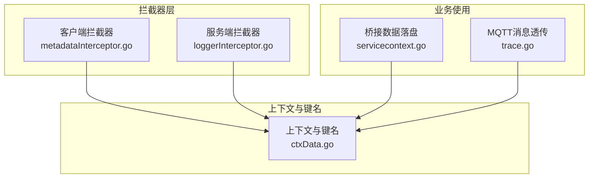
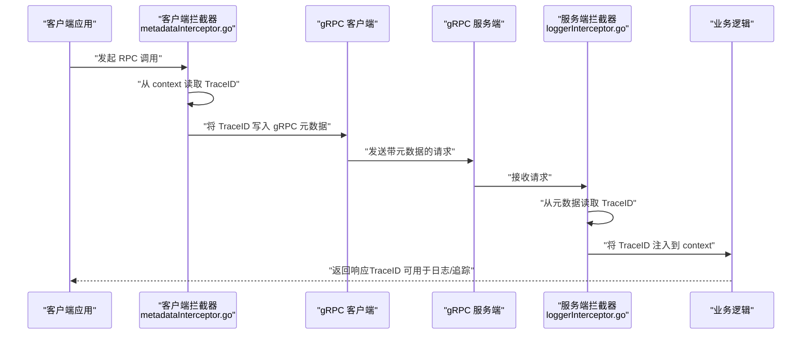
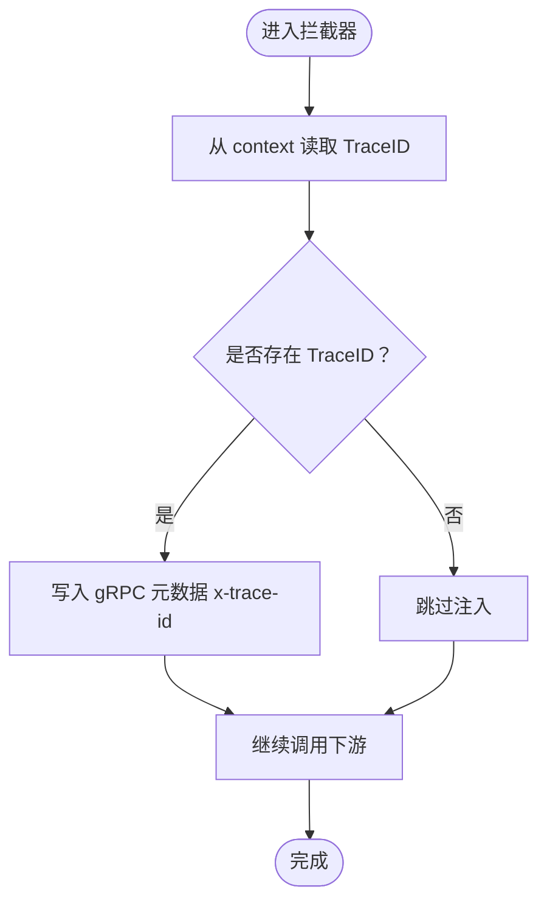
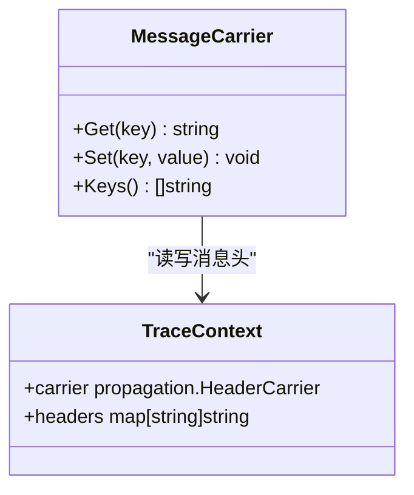
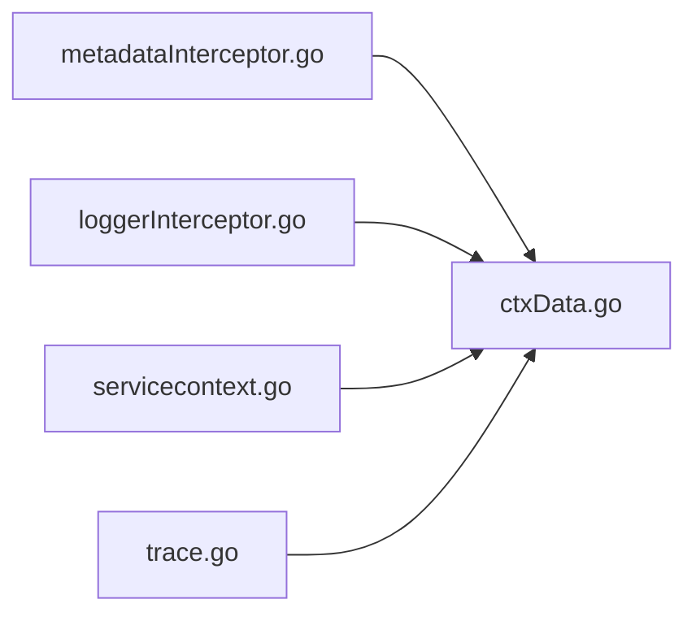

# TraceID传播机制

<cite>
**本文引用的文件**
- [metadataInterceptor.go](file://common/Interceptor/rpcclient/metadataInterceptor.go)
- [loggerInterceptor.go](file://common/Interceptor/rpcserver/loggerInterceptor.go)
- [ctxData.go](file://common/ctxdata/ctxData.go)
- [servicecontext.go](file://app/bridgedump/internal/svc/servicecontext.go)
- [servicecontext.go](file://app/bridgemqtt/internal/svc/servicecontext.go)
- [trace.go](file://common/mqttx/trace.go)
</cite>

## 目录
1. [引言](#引言)
2. [项目结构](#项目结构)
3. [核心组件](#核心组件)
4. [架构总览](#架构总览)
5. [组件详解](#组件详解)
6. [依赖关系分析](#依赖关系分析)
7. [性能考量](#性能考量)
8. [故障排查指南](#故障排查指南)
9. [结论](#结论)
10. [附录](#附录)

## 引言
本文件系统性阐述 zero-service 中的 TraceID 传播机制，覆盖 TraceID 与 SpanID 的设计原则、唯一标识生成与使用、gRPC 元数据中的提取/注入与传播、LoggerInterceptor 与 MetadataInterceptor 的工作原理、跨服务调用的自动传递、错误处理策略，以及在 HTTP、WebSocket、消息队列等多协议场景下的兼容性处理思路。文档以代码为依据，辅以图示帮助读者快速理解与落地。

## 项目结构
围绕 TraceID 的相关代码主要分布在以下模块：
- RPC 客户端拦截器：负责在出站请求中注入 TraceID 等上下文信息到 gRPC 元数据。
- RPC 服务端拦截器：负责从入站请求的 gRPC 元数据中提取 TraceID，并注入到请求上下文中。
- 上下文数据封装：定义 TraceID 在 gRPC 头部的键名、在 context 中的键名，以及读取方法。
- 业务侧使用：部分服务在日志或落盘时直接从 context 或 trace 库获取 TraceID。
- 协议扩展：消息队列（MQTT）通过 OpenTelemetry HeaderCarrier 将 Trace 上下文随消息传递。

图表来源
- [metadataInterceptor.go:11-32](file://common/Interceptor/rpcclient/metadataInterceptor.go#L11-L32)
- [loggerInterceptor.go:12-28](file://common/Interceptor/rpcserver/loggerInterceptor.go#L12-L28)
- [ctxData.go:9-24](file://common/ctxdata/ctxData.go#L9-L24)
- [servicecontext.go:26-47](file://app/bridgedump/internal/svc/servicecontext.go#L26-L47)
- [trace.go:8-30](file://common/mqttx/trace.go#L8-L30)

章节来源
- [metadataInterceptor.go:11-32](file://common/Interceptor/rpcclient/metadataInterceptor.go#L11-L32)
- [loggerInterceptor.go:12-28](file://common/Interceptor/rpcserver/loggerInterceptor.go#L12-L28)
- [ctxData.go:9-24](file://common/ctxdata/ctxData.go#L9-L24)
- [servicecontext.go:26-47](file://app/bridgedump/internal/svc/servicecontext.go#L26-L47)
- [trace.go:8-30](file://common/mqttx/trace.go#L8-L30)

## 核心组件
- TraceID 键名与读取
  - gRPC 元数据键名：x-trace-id
  - context 中的键名：trace-id
  - 提供 GetTraceId(ctx) 方法从 context 中读取 TraceID
- 客户端拦截器
  - 在出站请求中，将 TraceID（以及用户、部门、授权等信息）写入 gRPC 元数据
  - 支持 Unary 和 Stream 两种调用方式
- 服务端拦截器
  - 在入站请求中，从 gRPC 元数据读取 TraceID 并注入到 context
  - 同时处理用户、部门、授权等头部
- 业务侧使用
  - 部分服务直接从 context 或 trace 库获取 TraceID，用于日志、落盘、事件标记等

章节来源
- [ctxData.go:9-24](file://common/ctxdata/ctxData.go#L9-L24)
- [ctxData.go:63-68](file://common/ctxdata/ctxData.go#L63-L68)
- [metadataInterceptor.go:11-32](file://common/Interceptor/rpcclient/metadataInterceptor.go#L11-L32)
- [metadataInterceptor.go:34-55](file://common/Interceptor/rpcclient/metadataInterceptor.go#L34-L55)
- [loggerInterceptor.go:12-28](file://common/Interceptor/rpcserver/loggerInterceptor.go#L12-L28)

## 架构总览
下图展示了 TraceID 在一次典型的 gRPC 调用中的传播路径：客户端出站时注入 TraceID 到元数据；服务端入站时从元数据提取并注入到 context；后续业务逻辑可直接读取 TraceID。

图表来源
- [metadataInterceptor.go:11-32](file://common/Interceptor/rpcclient/metadataInterceptor.go#L11-L32)
- [loggerInterceptor.go:12-28](file://common/Interceptor/rpcserver/loggerInterceptor.go#L12-L28)

## 组件详解

### TraceID 设计与唯一标识
- 键名约定
  - gRPC 元数据键名采用小写形式，避免大小写不一致导致的匹配失败
  - context 中的键名用于内部传递，便于业务侧统一读取
- 唯一标识生成
  - 本仓库未发现显式的 TraceID 生成逻辑，通常由上游系统或中间件（如网关、代理、OpenTelemetry SDK）生成并注入
  - 业务侧通过 GetTraceId(ctx) 获取已存在的 TraceID，确保链路一致性

章节来源
- [ctxData.go:9-24](file://common/ctxdata/ctxData.go#L9-L24)
- [ctxData.go:63-68](file://common/ctxdata/ctxData.go#L63-L68)

### gRPC 元数据中的 TraceID 注入与提取
- 注入流程（客户端）
  - 从 context 读取 TraceID
  - 将 TraceID 写入 gRPC 出站元数据（x-trace-id）
  - 同时写入用户、部门、授权等头部，保证上下文完整性
- 提取流程（服务端）
  - 从入站 gRPC 元数据读取 x-trace-id
  - 将其注入到 context，供后续处理使用
  - 同时处理用户、部门、授权等头部

图表来源
- [metadataInterceptor.go:11-32](file://common/Interceptor/rpcclient/metadataInterceptor.go#L11-L32)
- [loggerInterceptor.go:12-28](file://common/Interceptor/rpcserver/loggerInterceptor.go#L12-L28)

章节来源
- [metadataInterceptor.go:11-32](file://common/Interceptor/rpcclient/metadataInterceptor.go#L11-L32)
- [metadataInterceptor.go:34-55](file://common/Interceptor/rpcclient/metadataInterceptor.go#L34-L55)
- [loggerInterceptor.go:12-28](file://common/Interceptor/rpcserver/loggerInterceptor.go#L12-L28)

### LoggerInterceptor 工作原理
- 入站请求处理
  - 从 gRPC 元数据读取 x-trace-id、x-user-id、x-user-name、x-dept-code、authorization
  - 将这些值注入到 context，供业务逻辑使用
- 错误处理
  - 捕获业务 handler 抛出的错误，并记录包含 TraceID 的错误日志，便于定位问题

章节来源
- [loggerInterceptor.go:12-28](file://common/Interceptor/rpcserver/loggerInterceptor.go#L12-L28)
- [loggerInterceptor.go:40-42](file://common/Interceptor/rpcserver/loggerInterceptor.go#L40-L42)

### MetadataInterceptor 工作原理
- 出站请求处理
  - 从 context 读取用户、部门、授权、TraceID 等信息
  - 将其写入 gRPC 元数据，确保下游服务可感知
- 流式与非流式支持
  - 同时支持 Unary 和 Stream 调用，保持行为一致

章节来源
- [metadataInterceptor.go:11-32](file://common/Interceptor/rpcclient/metadataInterceptor.go#L11-L32)
- [metadataInterceptor.go:34-55](file://common/Interceptor/rpcclient/metadataInterceptor.go#L34-L55)

### 跨服务调用的自动传递机制
- Header 传递
  - 客户端拦截器将 TraceID 写入 gRPC 元数据；服务端拦截器从元数据读取并注入 context
- Context 传递
  - 业务侧通过 context.WithValue(ctx, key, value) 将 TraceID 与其他上下文信息传递给后续处理
- 错误处理
  - 服务端拦截器捕获异常并记录，结合 TraceID 快速定位问题

章节来源
- [metadataInterceptor.go:11-32](file://common/Interceptor/rpcclient/metadataInterceptor.go#L11-L32)
- [loggerInterceptor.go:12-28](file://common/Interceptor/rpcserver/loggerInterceptor.go#L12-L28)
- [loggerInterceptor.go:40-42](file://common/Interceptor/rpcserver/loggerInterceptor.go#L40-L42)

### TraceID 在不同协议间的兼容性处理
- gRPC
  - 使用 gRPC 元数据头 x-trace-id 传递 TraceID
- HTTP（REST）
  - 可参考中间件模式：在 HTTP 层从请求头读取 TraceID，注入到 context；在响应头回传（如需），或在日志中携带
  - 与 gRPC 的键名保持一致，便于跨协议统一
- WebSocket
  - 在握手阶段从连接参数（如查询参数或自定义头）读取 TraceID，注入到会话上下文
  - 业务消息中可复用该上下文
- 消息队列（MQTT）
  - 使用 OpenTelemetry HeaderCarrier 将 Trace 上下文随消息头传递
  - 通过 TextMapCarrier 接口读写消息头，实现与 gRPC 元数据一致的传播语义

图表来源
- [trace.go:8-30](file://common/mqttx/trace.go#L8-L30)

章节来源
- [trace.go:8-30](file://common/mqttx/trace.go#L8-L30)

### 业务侧对 TraceID 的使用
- 日志与落盘
  - 服务在处理请求时，可直接从 context 或 trace 库获取 TraceID，用于日志标记、文件命名、事件关联等
- 示例
  - 桥接数据落盘时，使用 TraceID 作为文件名的一部分，便于按请求聚合日志与数据

章节来源
- [servicecontext.go:26-47](file://app/bridgedump/internal/svc/servicecontext.go#L26-L47)

## 依赖关系分析
- 客户端拦截器依赖 ctxData 模块提供的键名与读取方法
- 服务端拦截器同样依赖 ctxData 模块进行元数据读取与 context 注入
- 业务侧（如 bridgedump）直接使用 trace 库或 ctxData 读取 TraceID
- MQTT 模块通过 OpenTelemetry HeaderCarrier 实现跨协议传播

图表来源
- [metadataInterceptor.go:11-32](file://common/Interceptor/rpcclient/metadataInterceptor.go#L11-L32)
- [loggerInterceptor.go:12-28](file://common/Interceptor/rpcserver/loggerInterceptor.go#L12-L28)
- [ctxData.go:9-24](file://common/ctxdata/ctxData.go#L9-L24)
- [servicecontext.go:26-47](file://app/bridgedump/internal/svc/servicecontext.go#L26-L47)
- [trace.go:8-30](file://common/mqttx/trace.go#L8-L30)

章节来源
- [metadataInterceptor.go:11-32](file://common/Interceptor/rpcclient/metadataInterceptor.go#L11-L32)
- [loggerInterceptor.go:12-28](file://common/Interceptor/rpcserver/loggerInterceptor.go#L12-L28)
- [ctxData.go:9-24](file://common/ctxdata/ctxData.go#L9-L24)
- [servicecontext.go:26-47](file://app/bridgedump/internal/svc/servicecontext.go#L26-L47)
- [trace.go:8-30](file://common/mqttx/trace.go#L8-L30)

## 性能考量
- 元数据读写开销
  - 注入/提取 TraceID 为轻量操作，对整体延迟影响较小
- 上下文传递
  - 通过 context.WithValue 注入 TraceID，成本极低，建议在所有关键处理点保留
- 跨协议传播
  - gRPC 元数据与 MQTT HeaderCarrier 的实现复杂度相近，选择取决于协议特性
- 最佳实践
  - 在拦截器中统一处理 TraceID 的注入与提取，避免重复代码
  - 对于高并发场景，尽量减少不必要的元数据写入，仅在需要时注入

## 故障排查指南
- TraceID 丢失
  - 检查客户端是否正确注册了 metadataInterceptor
  - 确认服务端是否正确注册了 loggerInterceptor
  - 核对 gRPC 元数据键名是否为 x-trace-id
- TraceID 不一致
  - 确保上游系统正确生成并注入 TraceID
  - 检查中间层（如网关、代理）是否修改或丢弃了元数据
- 日志定位
  - 服务端拦截器会在错误发生时记录包含 TraceID 的错误日志，优先据此排查
- MQTT 场景
  - 确认消息头中包含 Trace 上下文，且消费者端正确读取

章节来源
- [loggerInterceptor.go:40-42](file://common/Interceptor/rpcserver/loggerInterceptor.go#L40-L42)
- [metadataInterceptor.go:11-32](file://common/Interceptor/rpcclient/metadataInterceptor.go#L11-L32)
- [loggerInterceptor.go:12-28](file://common/Interceptor/rpcserver/loggerInterceptor.go#L12-L28)

## 结论
zero-service 通过拦截器层实现了 TraceID 在 gRPC 调用中的标准化注入与提取，并在业务侧提供了统一的读取入口。配合 OpenTelemetry HeaderCarrier，可在 MQTT 等消息协议中实现一致的上下文传播。建议在所有新服务中默认启用拦截器，确保 TraceID 的自动传递与可观测性。

## 附录
- 关键实现位置
  - 客户端拦截器：[metadataInterceptor.go:11-32](file://common/Interceptor/rpcclient/metadataInterceptor.go#L11-L32)，[metadataInterceptor.go:34-55](file://common/Interceptor/rpcclient/metadataInterceptor.go#L34-L55)
  - 服务端拦截器：[loggerInterceptor.go:12-28](file://common/Interceptor/rpcserver/loggerInterceptor.go#L12-L28)
  - 上下文与键名：[ctxData.go:9-24](file://common/ctxdata/ctxData.go#L9-L24)，[ctxData.go:63-68](file://common/ctxdata/ctxData.go#L63-L68)
  - 业务侧使用：[servicecontext.go:26-47](file://app/bridgedump/internal/svc/servicecontext.go#L26-L47)
  - MQTT 透传：[trace.go:8-30](file://common/mqttx/trace.go#L8-L30)