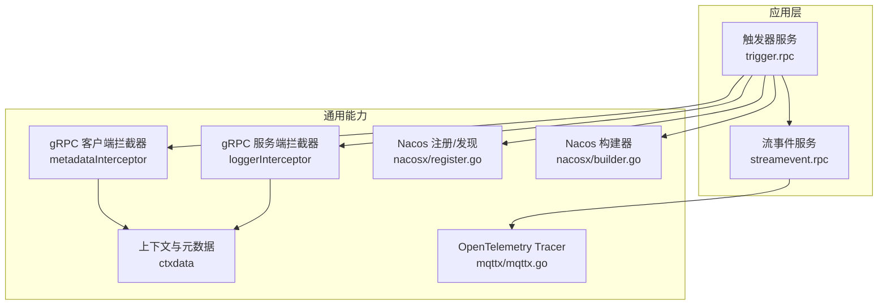
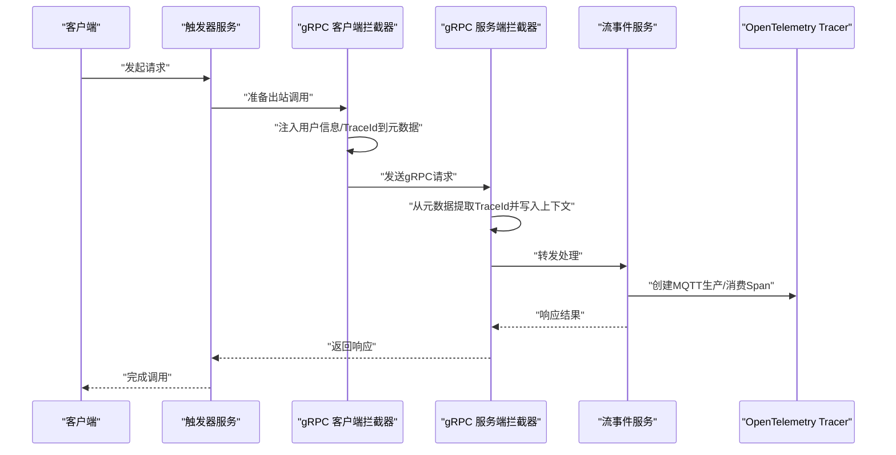
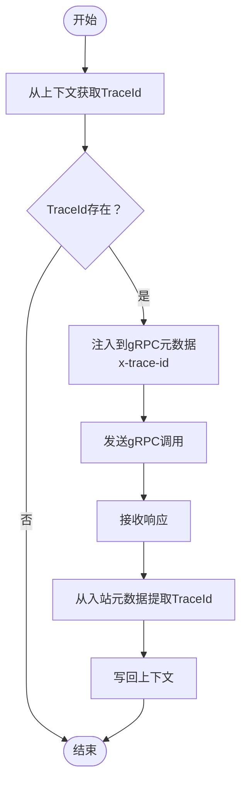
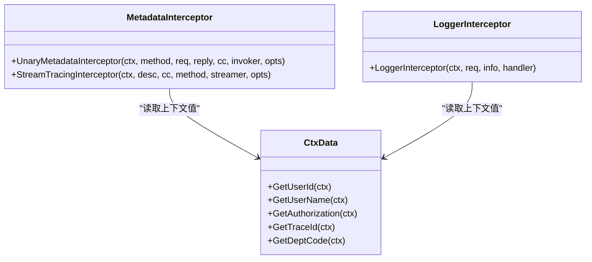
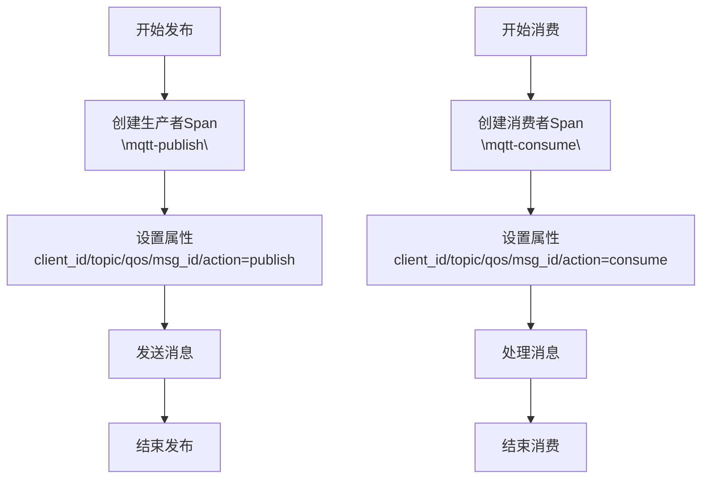
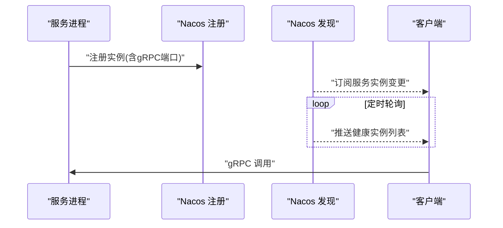
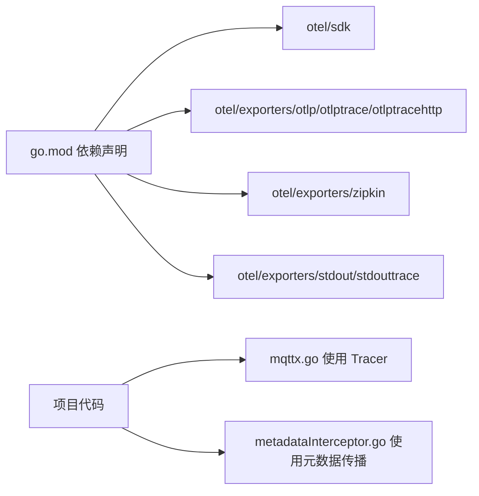

# 分布式追踪与链路监控

<cite>
**本文引用的文件**
- [ctxData.go](file://common/ctxdata/ctxData.go)
- [metadataInterceptor.go](file://common/Interceptor/rpcclient/metadataInterceptor.go)
- [loggerInterceptor.go](file://common/Interceptor/rpcserver/loggerInterceptor.go)
- [mqttx.go](file://common/mqttx/mqttx.go)
- [trace.go](file://common/mqttx/trace.go)
- [trigger.yaml](file://app/trigger/etc/trigger.yaml)
- [streamevent.yaml](file://facade/streamevent/etc/streamevent.yaml)
- [register.go](file://common/nacosx/register.go)
- [builder.go](file://common/nacosx/builder.go)
- [container.go](file://common/socketiox/container.go)
- [go.mod](file://go.mod)
- [go.sum](file://go.sum)
</cite>

## 目录
1. [引言](#引言)
2. [项目结构](#项目结构)
3. [核心组件](#核心组件)
4. [架构总览](#架构总览)
5. [详细组件分析](#详细组件分析)
6. [依赖分析](#依赖分析)
7. [性能考虑](#性能考虑)
8. [故障排查指南](#故障排查指南)
9. [结论](#结论)
10. [附录](#附录)

## 引言
本指南面向 zero-service 的分布式追踪与链路监控实践，系统性讲解 TraceID、SpanID 的设计与传播机制，覆盖 gRPC 调用链、HTTP 请求链、消息队列链路等多协议链路监控；并提供性能瓶颈定位、错误根因分析、工具集成方案以及链路数据采集与存储优化策略。文档以仓库现有实现为基础，结合可视化图示帮助读者快速落地。

## 项目结构
围绕分布式追踪，项目中涉及的关键模块包括：
- 上下文与元数据：统一在上下文与 gRPC 元数据中携带 TraceId、用户信息等
- gRPC 追踪拦截器：客户端与服务端分别负责注入与提取 TraceId
- OpenTelemetry 集成：MQTT 客户端基于 OpenTelemetry 进行生产/消费 Span 记录
- 配置与注册中心：通过 Nacos 注册与发现，支撑服务间调用链路拓扑
- 配置文件：各服务的日志、中间件统计、外部依赖等配置

图表来源
- [trigger.yaml:1-37](file://app/trigger/etc/trigger.yaml#L1-L37)
- [streamevent.yaml:1-28](file://facade/streamevent/etc/streamevent.yaml#L1-L28)
- [ctxData.go:1-76](file://common/ctxdata/ctxData.go#L1-L76)
- [metadataInterceptor.go:1-56](file://common/Interceptor/rpcclient/metadataInterceptor.go#L1-L56)
- [loggerInterceptor.go:1-45](file://common/Interceptor/rpcserver/loggerInterceptor.go#L1-L45)
- [mqttx.go:1-200](file://common/mqttx/mqttx.go#L1-L200)
- [register.go:1-99](file://common/nacosx/register.go#L1-L99)
- [builder.go:41-138](file://common/nacosx/builder.go#L41-L138)

章节来源
- [trigger.yaml:1-37](file://app/trigger/etc/trigger.yaml#L1-L37)
- [streamevent.yaml:1-28](file://facade/streamevent/etc/streamevent.yaml#L1-L28)

## 核心组件
- 上下文与元数据
  - 统一键名：用户标识、授权令牌、部门编码、TraceId
  - gRPC 头部键名：x-user-id、x-user-name、x-dept-code、authorization、x-trace-id
  - 提供从上下文获取上述值的工具函数
- gRPC 客户端拦截器
  - 在出站请求中复制并注入用户信息与 TraceId 至 gRPC 元数据
- gRPC 服务端拦截器
  - 从入站元数据提取用户信息与 TraceId，并写回上下文
- OpenTelemetry MQTT 追踪
  - 基于 OpenTelemetry Tracer 为 MQTT 生产/消费动作创建 Span
  - 使用自定义 MessageCarrier 实现消息头与 TextMap 的互操作
- Nacos 注册与发现
  - 服务注册、注销、实例健康检查与 gRPC 端口解析
  - 客户端侧构建器与容器化订阅流程

章节来源
- [ctxData.go:1-76](file://common/ctxdata/ctxData.go#L1-L76)
- [metadataInterceptor.go:1-56](file://common/Interceptor/rpcclient/metadataInterceptor.go#L1-L56)
- [loggerInterceptor.go:1-45](file://common/Interceptor/rpcserver/loggerInterceptor.go#L1-L45)
- [mqttx.go:1-200](file://common/mqttx/mqttx.go#L1-L200)
- [trace.go:1-31](file://common/mqttx/trace.go#L1-L31)
- [register.go:1-99](file://common/nacosx/register.go#L1-L99)
- [builder.go:41-138](file://common/nacosx/builder.go#L41-L138)

## 架构总览
下图展示一次典型跨服务调用的链路：客户端触发器服务通过 gRPC 调用流事件服务，期间 TraceId 在 gRPC 元数据中传递；流事件服务内部可能产生 MQTT 生产/消费 Span，最终形成完整的调用链。

图表来源
- [metadataInterceptor.go:1-56](file://common/Interceptor/rpcclient/metadataInterceptor.go#L1-L56)
- [loggerInterceptor.go:1-45](file://common/Interceptor/rpcserver/loggerInterceptor.go#L1-L45)
- [mqttx.go:361-388](file://common/mqttx/mqttx.go#L361-L388)

## 详细组件分析

### TraceID 与 SpanID 设计及传播机制
- TraceID 与 SpanID 的承载
  - gRPC 元数据：通过 x-trace-id 键在客户端注入、服务端提取
  - 上下文键：在服务端拦截器中写回上下文，便于后续日志与指标关联
- 传播路径
  - 客户端拦截器：读取上下文中的 TraceId 并设置到出站元数据
  - 服务端拦截器：从入站元数据读取 TraceId 并写回上下文
- 关键实现位置
  - 元数据键与上下文键定义
  - 客户端拦截器注入逻辑
  - 服务端拦截器提取与写回逻辑

图表来源
- [ctxData.go:63-68](file://common/ctxdata/ctxData.go#L63-L68)
- [metadataInterceptor.go:27-30](file://common/Interceptor/rpcclient/metadataInterceptor.go#L27-L30)
- [loggerInterceptor.go:26-28](file://common/Interceptor/rpcserver/loggerInterceptor.go#L26-L28)

章节来源
- [ctxData.go:1-76](file://common/ctxdata/ctxData.go#L1-L76)
- [metadataInterceptor.go:1-56](file://common/Interceptor/rpcclient/metadataInterceptor.go#L1-L56)
- [loggerInterceptor.go:1-45](file://common/Interceptor/rpcserver/loggerInterceptor.go#L1-L45)

### gRPC 调用链路追踪
- 客户端拦截器
  - 复制出站元数据，注入用户信息与 TraceId
  - 支持 Unary 与 Stream 调用
- 服务端拦截器
  - 从入站元数据提取用户信息与 TraceId
  - 写回上下文，便于日志与指标使用
- 与 OpenTelemetry 的关系
  - 本项目未直接使用 OpenTelemetry 的 Propagator 注入/提取，而是通过 gRPC 元数据手动传播 TraceId

图表来源
- [metadataInterceptor.go:1-56](file://common/Interceptor/rpcclient/metadataInterceptor.go#L1-L56)
- [loggerInterceptor.go:1-45](file://common/Interceptor/rpcserver/loggerInterceptor.go#L1-L45)
- [ctxData.go:1-76](file://common/ctxdata/ctxData.go#L1-L76)

章节来源
- [metadataInterceptor.go:1-56](file://common/Interceptor/rpcclient/metadataInterceptor.go#L1-L56)
- [loggerInterceptor.go:1-45](file://common/Interceptor/rpcserver/loggerInterceptor.go#L1-L45)
- [ctxData.go:1-76](file://common/ctxdata/ctxData.go#L1-L76)

### HTTP 请求链路追踪
- 中间件模式
  - 可参考 REST 中间件模式，在进入路由处理前从请求头提取或生成 TraceId，并写入上下文
  - 与 gRPC 拦截器类似，确保 TraceId 在整个请求生命周期内可用
- 日志与指标
  - 将 TraceId 写入日志上下文，便于跨服务串联日志

章节来源
- [.trae/skills/zero-skills/references/rest-api-patterns.md:197-262](file://.trae/skills/zero-skills/references/rest-api-patterns.md#L197-L262)

### 消息队列链路监控（MQTT）
- Span 创建
  - 生产者：创建“mqtt-publish”Span，记录客户端ID、主题、QoS、消息ID等属性
  - 消费者：创建“mqtt-consume”Span，记录相同属性
- 文本映射
  - 使用自定义 MessageCarrier 实现消息头与 TextMap 的互操作，支持 OpenTelemetry 的 Propagation
- 与 OpenTelemetry 的集成
  - 基于全局 Tracer 创建 Span，并设置属性

图表来源
- [mqttx.go:361-388](file://common/mqttx/mqttx.go#L361-L388)
- [trace.go:1-31](file://common/mqttx/trace.go#L1-L31)

章节来源
- [mqttx.go:1-200](file://common/mqttx/mqttx.go#L1-L200)
- [trace.go:1-31](file://common/mqttx/trace.go#L1-L31)

### 服务间调用链路与注册中心
- Nacos 注册
  - 服务启动时向 Nacos 注册实例，包含健康状态、权重、gRPC 端口等元数据
  - 优雅停机时注销实例
- Nacos 发现
  - 客户端侧通过构建器订阅服务实例变更，周期性拉取健康实例列表
  - 容器化场景下，订阅回调与定时任务协同更新可用地址列表

图表来源
- [register.go:21-76](file://common/nacosx/register.go#L21-L76)
- [builder.go:78-112](file://common/nacosx/builder.go#L78-L112)
- [container.go:209-242](file://common/socketiox/container.go#L209-L242)

章节来源
- [register.go:1-99](file://common/nacosx/register.go#L1-L99)
- [builder.go:41-138](file://common/nacosx/builder.go#L41-L138)
- [container.go:172-265](file://common/socketiox/container.go#L172-L265)

### 配置与部署要点
- 触发器服务配置
  - 包含日志、Nacos、Redis、数据库、StreamEvent 服务端点等配置项
- 流事件服务配置
  - 包含日志、Nacos、中间件统计忽略特定方法、数据库与 TaosDB 等配置项

章节来源
- [trigger.yaml:1-37](file://app/trigger/etc/trigger.yaml#L1-L37)
- [streamevent.yaml:1-28](file://facade/streamevent/etc/streamevent.yaml#L1-L28)

## 依赖分析
- OpenTelemetry 相关依赖
  - SDK、HTTP/GRPC 导出器、Zipkin 导出器、stdout 导出器等
- 项目中对 OpenTelemetry 的使用现状
  - 已引入依赖但未在 gRPC 元数据拦截器中直接使用 Propagator 注入/提取 TraceId
  - MQTT 客户端基于 Tracer 手工创建 Span 并设置属性

图表来源
- [go.mod:200-208](file://go.mod#L200-L208)
- [go.sum:573-586](file://go.sum#L573-L586)
- [mqttx.go:1-200](file://common/mqttx/mqttx.go#L1-L200)
- [metadataInterceptor.go:1-56](file://common/Interceptor/rpcclient/metadataInterceptor.go#L1-L56)

章节来源
- [go.mod:184-208](file://go.mod#L184-L208)
- [go.sum:573-586](file://go.sum#L573-L586)

## 性能考虑
- 慢调用识别
  - 在 gRPC 服务端拦截器中记录请求耗时与 TraceId，结合日志聚合进行慢查询分析
  - 对关键业务方法开启中间件统计（如 StreamEvent 配置中的 StatConf）
- 热点服务发现
  - 通过 Nacos 实时实例列表与健康状态，结合指标观察流量分布
- 依赖关系分析
  - 借助 TraceId 在链路中串联 gRPC 调用与 MQTT 生产/消费，绘制依赖拓扑
- 数据采集与存储优化
  - 采样策略：在高并发场景下采用概率采样或动态采样
  - 数据压缩：导出前对 Span 数据进行压缩
  - 存储生命周期：按天/周滚动，设置过期清理策略

章节来源
- [streamevent.yaml:11-13](file://facade/streamevent/etc/streamevent.yaml#L11-L13)

## 故障排查指南
- TraceId 缺失
  - 检查客户端拦截器是否正确注入 x-trace-id
  - 检查服务端拦截器是否从元数据提取并写回上下文
- 日志关联失败
  - 确认日志上下文中包含 TraceId
  - 检查中间件是否正确设置忽略内容的方法列表
- MQTT 链路异常
  - 查看 Span 属性是否完整（topic、client_id、qos、message_id）
  - 确认 MessageCarrier 的头部读写正常
- 服务发现异常
  - 检查 Nacos 注册与注销流程
  - 核对 gRPC 端口元数据字段是否正确

章节来源
- [loggerInterceptor.go:1-45](file://common/Interceptor/rpcserver/loggerInterceptor.go#L1-L45)
- [metadataInterceptor.go:1-56](file://common/Interceptor/rpcclient/metadataInterceptor.go#L1-L56)
- [mqttx.go:361-388](file://common/mqttx/mqttx.go#L361-L388)
- [trace.go:1-31](file://common/mqttx/trace.go#L1-L31)
- [register.go:1-99](file://common/nacosx/register.go#L1-L99)

## 结论
本项目已具备完善的 TraceId 传播与 OpenTelemetry MQTT 追踪能力，并通过 Nacos 实现服务注册与发现。建议在后续工作中：
- 在 gRPC 元数据拦截器中引入 OpenTelemetry Propagator，实现标准 W3C TraceContext 自动传播
- 在 HTTP 中间件中同样注入/提取 TraceId，统一全链路追踪
- 集成 Zipkin 或 OTLP 导出器，完善链路数据采集与可视化
- 结合采样策略与存储生命周期管理，持续优化性能与成本

## 附录
- OpenTelemetry 工具集成建议
  - Zipkin：使用 Zipkin 导出器，配置 endpoint
  - OTLP：使用 OTLP HTTP/GRPC 导出器，对接兼容 Collector 的平台
  - stdout：用于开发调试阶段的快速验证
- 配置示例参考
  - 触发器服务与流事件服务的配置文件路径

章节来源
- [go.mod:200-208](file://go.mod#L200-L208)
- [trigger.yaml:1-37](file://app/trigger/etc/trigger.yaml#L1-L37)
- [streamevent.yaml:1-28](file://facade/streamevent/etc/streamevent.yaml#L1-L28)