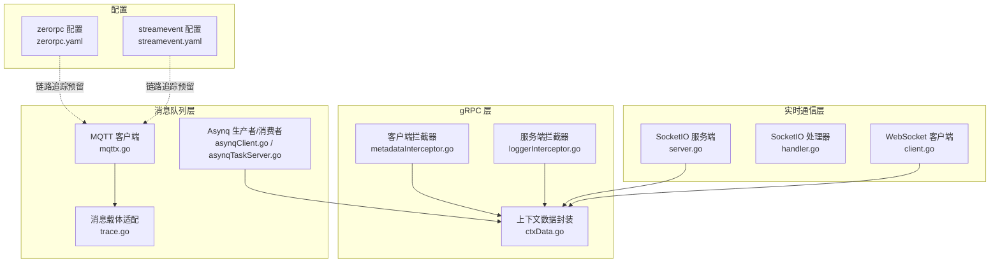
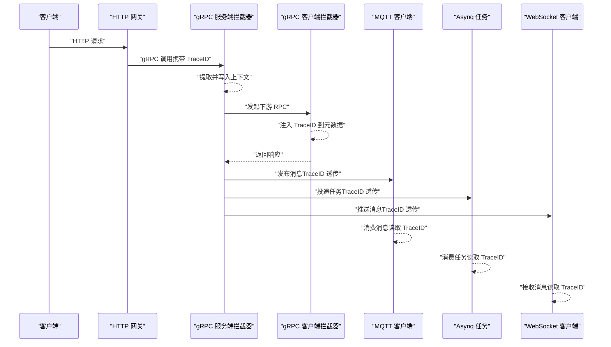
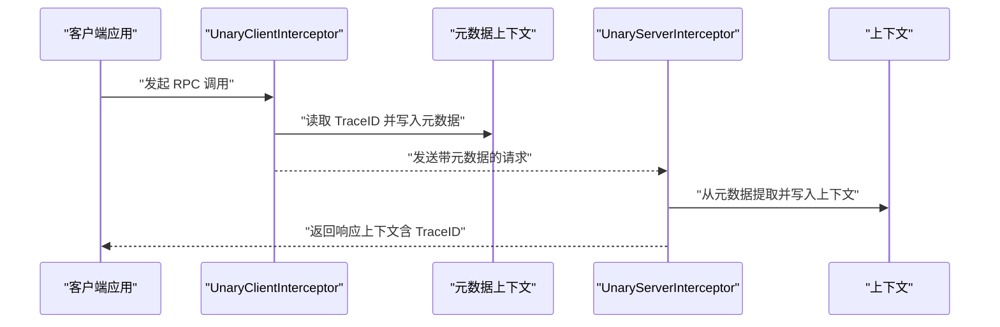
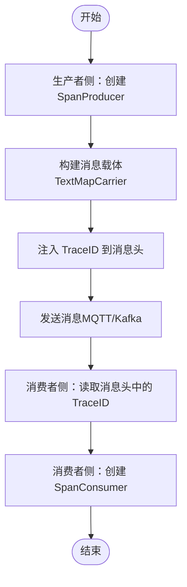
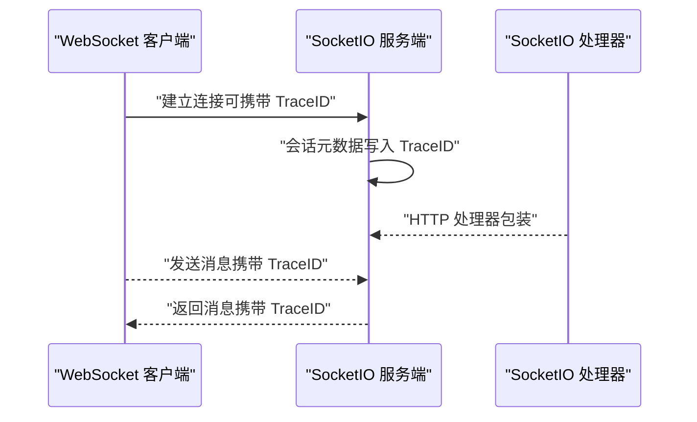
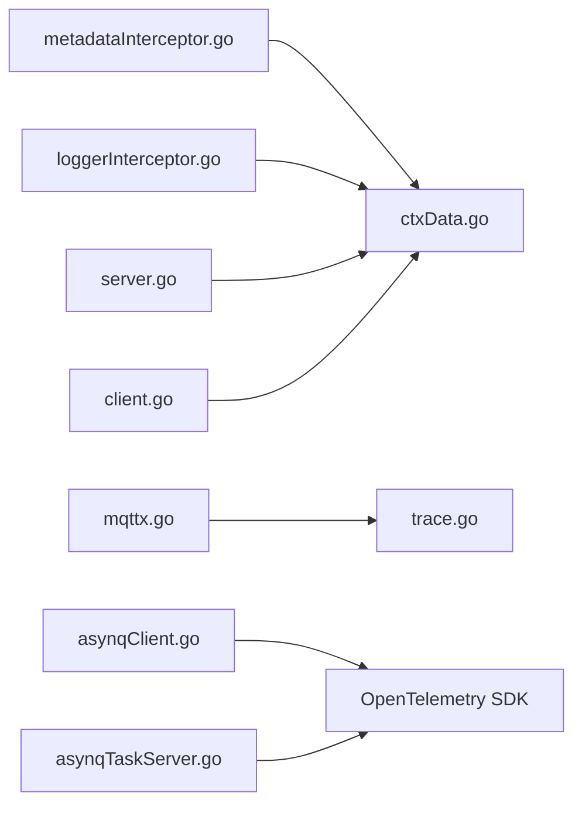

# 多协议链路追踪

<cite>
**本文引用的文件**   
- [metadataInterceptor.go](file://common/Interceptor/rpcclient/metadataInterceptor.go)
- [loggerInterceptor.go](file://common/Interceptor/rpcserver/loggerInterceptor.go)
- [ctxData.go](file://common/ctxdata/ctxData.go)
- [trace.go](file://common/mqttx/trace.go)
- [mqttx.go](file://common/mqttx/mqttx.go)
- [asynqClient.go](file://common/asynqx/asynqClient.go)
- [asynqTaskServer.go](file://common/asynqx/asynqTaskServer.go)
- [server.go](file://common/socketiox/server.go)
- [handler.go](file://common/socketiox/handler.go)
- [client.go](file://common/wsx/client.go)
- [trigger.yaml](file://zerorpc/etc/zerorpc.yaml)
- [streamevent.yaml](file://facade/streamevent/etc/streamevent.yaml)
- [zerorpc.go](file://zerorpc/zerorpc.go)
- [trigger.go](file://app/trigger/trigger.go)
- [streamevent.go](file://facade/streamevent/streamevent.go)
- [receivekafkamessagelogic.go](file://facade/streamevent/internal/logic/receivekafkamessagelogic.go)
- [asynqClient.go](file://zerorpc/internal/svc/asynqClient.go)
- [asynqTaskServer.go](file://zerorpc/internal/svc/asynqTaskServer.go)
</cite>

## 目录
1. [简介](#简介)
2. [项目结构](#项目结构)
3. [核心组件](#核心组件)
4. [架构总览](#架构总览)
5. [详细组件分析](#详细组件分析)
6. [依赖分析](#依赖分析)
7. [性能考虑](#性能考虑)
8. [故障排查指南](#故障排查指南)
9. [结论](#结论)
10. [附录](#附录)

## 简介
本指南面向 zero-service 的多协议链路追踪场景，系统性覆盖以下能力：
- gRPC 调用链路追踪：基于 UnaryServerInfo、UnaryClientInfo 的拦截器注入与传播，服务间调用链完整记录。
- HTTP 请求链路追踪：grpc-gateway 的链路传播与 HTTP 中间件集成方案。
- 消息队列链路追踪：Kafka 消息的 TraceID 传递、Asynq 任务的链路关联。
- WebSocket 实时通信链路追踪：SocketIO 连接的链路标识与消息传播。
- 不同协议间的链路合并与关联：统一 TraceID 在 gRPC、HTTP、MQ、WebSocket 之间的贯通。

## 项目结构
围绕链路追踪的关键模块分布如下：
- gRPC 客户端/服务端拦截器：在客户端注入 TraceID，在服务端提取并写入上下文。
- 上下文数据封装：统一的 Header 键名与上下文键值管理。
- MQ 链路传播：通过 TextMapCarrier 将 TraceID 注入 MQTT 消息头。
- Asynq 任务链路：生产者/消费者侧分别开启 Producer/Consumer Span。
- SocketIO/WebSocket：会话元数据存储与消息发送。
- 配置文件：各服务的链路追踪开关与导出配置预留。

图表来源
- [metadataInterceptor.go:1-55](file://common/Interceptor/rpcclient/metadataInterceptor.go#L1-L55)
- [loggerInterceptor.go:1-45](file://common/Interceptor/rpcserver/loggerInterceptor.go#L1-L45)
- [ctxData.go:1-76](file://common/ctxdata/ctxData.go#L1-L76)
- [trace.go:1-31](file://common/mqttx/trace.go#L1-L31)
- [mqttx.go:361-388](file://common/mqttx/mqttx.go#L361-L388)
- [asynqClient.go:1-30](file://common/asynqx/asynqClient.go#L1-L30)
- [asynqTaskServer.go:66-86](file://common/asynqx/asynqTaskServer.go#L66-L86)
- [server.go:119-178](file://common/socketiox/server.go#L119-L178)
- [handler.go:1-41](file://common/socketiox/handler.go#L1-L41)
- [client.go:489-535](file://common/wsx/client.go#L489-L535)
- [zerorpc.yaml:22-27](file://zerorpc/etc/zerorpc.yaml#L22-L27)
- [streamevent.yaml:1-28](file://facade/streamevent/etc/streamevent.yaml#L1-L28)

章节来源
- [metadataInterceptor.go:1-55](file://common/Interceptor/rpcclient/metadataInterceptor.go#L1-L55)
- [loggerInterceptor.go:1-45](file://common/Interceptor/rpcserver/loggerInterceptor.go#L1-L45)
- [ctxData.go:1-76](file://common/ctxdata/ctxData.go#L1-L76)
- [trace.go:1-31](file://common/mqttx/trace.go#L1-L31)
- [mqttx.go:361-388](file://common/mqttx/mqttx.go#L361-L388)
- [asynqClient.go:1-30](file://common/asynqx/asynqClient.go#L1-L30)
- [asynqTaskServer.go:66-86](file://common/asynqx/asynqTaskServer.go#L66-L86)
- [server.go:119-178](file://common/socketiox/server.go#L119-L178)
- [handler.go:1-41](file://common/socketiox/handler.go#L1-L41)
- [client.go:489-535](file://common/wsx/client.go#L489-L535)
- [zerorpc.yaml:22-27](file://zerorpc/etc/zerorpc.yaml#L22-L27)
- [streamevent.yaml:1-28](file://facade/streamevent/etc/streamevent.yaml#L1-L28)

## 核心组件
- gRPC 客户端拦截器：在发起 RPC 前，从上下文读取用户信息与 TraceID，并写入 gRPC 元数据，确保下游服务可感知。
- gRPC 服务端拦截器：从 gRPC 元数据中提取用户信息与 TraceID，注入到请求上下文中，便于日志与后续处理。
- 上下文数据封装：定义统一的 Header 键名（如 x-trace-id）与上下文键值，保证跨协议一致。
- MQTT 链路传播：通过 TextMapCarrier 将 TraceID 写入消息头；消费侧同样以 carrier 读取。
- Asynq 任务链路：生产者侧开启 Producer Span，消费者侧开启 Consumer Span，并设置任务类型属性。
- SocketIO/WebSocket：会话元数据支持字符串键值存储，便于记录 TraceID 或会话标识；WebSocket 客户端负责连接与心跳维护。
- 配置预留：zerorpc 与 streamevent 配置文件中预留链路追踪相关字段，便于接入 Jaeger/Zipkin/OTLP 导出器。

章节来源
- [metadataInterceptor.go:11-32](file://common/Interceptor/rpcclient/metadataInterceptor.go#L11-L32)
- [loggerInterceptor.go:12-44](file://common/Interceptor/rpcserver/loggerInterceptor.go#L12-L44)
- [ctxData.go:9-31](file://common/ctxdata/ctxData.go#L9-L31)
- [trace.go:8-31](file://common/mqttx/trace.go#L8-L31)
- [mqttx.go:361-388](file://common/mqttx/mqttx.go#L361-L388)
- [asynqClient.go:25-30](file://common/asynqx/asynqClient.go#L25-L30)
- [asynqTaskServer.go:66-71](file://common/asynqx/asynqTaskServer.go#L66-L71)
- [server.go:135-162](file://common/socketiox/server.go#L135-L162)
- [client.go:489-535](file://common/wsx/client.go#L489-L535)
- [zerorpc.yaml:22-27](file://zerorpc/etc/zerorpc.yaml#L22-L27)
- [streamevent.yaml:1-28](file://facade/streamevent/etc/streamevent.yaml#L1-L28)

## 架构总览
下图展示一次典型调用从 HTTP 到 gRPC、再到 MQ/Asynq/WebSocket 的链路传播与关联：

图表来源
- [loggerInterceptor.go:12-44](file://common/Interceptor/rpcserver/loggerInterceptor.go#L12-L44)
- [metadataInterceptor.go:11-32](file://common/Interceptor/rpcclient/metadataInterceptor.go#L11-L32)
- [trace.go:16-22](file://common/mqttx/trace.go#L16-L22)
- [mqttx.go:361-388](file://common/mqttx/mqttx.go#L361-L388)
- [asynqClient.go:25-30](file://common/asynqx/asynqClient.go#L25-L30)
- [asynqTaskServer.go:66-71](file://common/asynqx/asynqTaskServer.go#L66-L71)
- [client.go:489-535](file://common/wsx/client.go#L489-L535)

## 详细组件分析

### gRPC 调用链路追踪
- 客户端拦截器：在 Unary/Stream 调用前，从上下文读取用户标识与 TraceID，并写入 gRPC 元数据，确保下游可见。
- 服务端拦截器：从 gRPC 元数据中提取上述键值，写回上下文，供业务逻辑与日志使用。
- 上下文数据封装：统一 Header 键名与上下文键值，避免大小写与命名差异导致的丢失。

图表来源
- [metadataInterceptor.go:11-32](file://common/Interceptor/rpcclient/metadataInterceptor.go#L11-L32)
- [loggerInterceptor.go:12-28](file://common/Interceptor/rpcserver/loggerInterceptor.go#L12-L28)
- [ctxData.go:18-24](file://common/ctxdata/ctxData.go#L18-L24)

章节来源
- [metadataInterceptor.go:11-32](file://common/Interceptor/rpcclient/metadataInterceptor.go#L11-L32)
- [loggerInterceptor.go:12-28](file://common/Interceptor/rpcserver/loggerInterceptor.go#L12-L28)
- [ctxData.go:18-24](file://common/ctxdata/ctxData.go#L18-L24)

### HTTP 请求链路追踪（grpc-gateway）
- grpc-gateway 作为 HTTP 到 gRPC 的桥接层，可通过中间件或自定义处理器将 HTTP 请求头转换为 gRPC 元数据，从而实现链路传播。
- 建议在网关层对关键请求头（如 x-trace-id、authorization）进行标准化处理，并在 gRPC 调用时注入到元数据中。
- 可结合服务端拦截器自动提取并写入上下文，保证链路一致性。

章节来源
- [loggerInterceptor.go:12-28](file://common/Interceptor/rpcserver/loggerInterceptor.go#L12-L28)
- [ctxData.go:18-24](file://common/ctxdata/ctxData.go#L18-L24)

### 消息队列链路追踪（Kafka/Asynq/MQTT）
- MQTT：通过 TextMapCarrier 将 TraceID 写入消息头；消费侧以相同方式读取，保持链路连续。
- Asynq：生产者侧开启 Producer Span，消费者侧开启 Consumer Span，并设置任务类型属性，便于在链路系统中区分角色与类型。
- Kafka：消息体包含 sessionId、topic、group、key、value、sendTime 等字段，可在业务处理时将 TraceID 作为消息头或上下文字段传递。

图表来源
- [trace.go:16-22](file://common/mqttx/trace.go#L16-L22)
- [mqttx.go:361-388](file://common/mqttx/mqttx.go#L361-L388)
- [asynqClient.go:25-30](file://common/asynqx/asynqClient.go#L25-L30)
- [asynqTaskServer.go:66-71](file://common/asynqx/asynqTaskServer.go#L66-L71)
- [streamevent.pb.go:435-445](file://facade/streamevent/streamevent/streamevent.pb.go#L435-L445)

章节来源
- [trace.go:16-22](file://common/mqttx/trace.go#L16-L22)
- [mqttx.go:361-388](file://common/mqttx/mqttx.go#L361-L388)
- [asynqClient.go:25-30](file://common/asynqx/asynqClient.go#L25-L30)
- [asynqTaskServer.go:66-71](file://common/asynqx/asynqTaskServer.go#L66-L71)
- [streamevent.pb.go:435-445](file://facade/streamevent/streamevent/streamevent.pb.go#L435-L445)

### WebSocket 实时通信链路追踪
- SocketIO：会话对象支持元数据存储，可将 TraceID 写入会话元数据；处理器将 SocketIO 服务包装为 HTTP 处理器，便于与网关集成。
- WebSocket：客户端负责连接建立、心跳维护与消息收发，可在握手阶段或首包中携带 TraceID，确保端到端链路可追踪。

图表来源
- [server.go:135-162](file://common/socketiox/server.go#L135-L162)
- [handler.go:33-35](file://common/socketiox/handler.go#L33-L35)
- [client.go:489-535](file://common/wsx/client.go#L489-L535)

章节来源
- [server.go:135-162](file://common/socketiox/server.go#L135-L162)
- [handler.go:33-35](file://common/socketiox/handler.go#L33-L35)
- [client.go:489-535](file://common/wsx/client.go#L489-L535)

### 不同协议间的链路合并与关联
- 统一 TraceID：在 HTTP 网关层生成或接收 TraceID，随后通过 gRPC 元数据、MQTT 消息头、Asynq 任务属性、WebSocket 消息等方式传递。
- 上下文键值：通过 ctxData 提供统一的 Header 键名与上下文键值，减少跨协议差异带来的传播失败。
- 配置预留：zerorpc 与 streamevent 配置中预留链路追踪相关字段，便于接入外部链路系统（Jaeger/Zipkin/OTLP）。

章节来源
- [ctxData.go:18-24](file://common/ctxdata/ctxData.go#L18-L24)
- [zerorpc.yaml:22-27](file://zerorpc/etc/zerorpc.yaml#L22-L27)
- [streamevent.yaml:1-28](file://facade/streamevent/etc/streamevent.yaml#L1-L28)

## 依赖分析
- 组件耦合：拦截器与上下文数据封装低耦合，便于在不同服务复用；MQ 与 Asynq 通过 carrier 与 Span 角色解耦。
- 外部依赖：OpenTelemetry SDK、grpc-gateway、Asynq、SocketIO、WebSocket 等第三方库。
- 潜在风险：若 HTTP 网关未正确注入元数据，可能导致下游链路断点；MQ 消息头未正确读取也会造成断链。

图表来源
- [metadataInterceptor.go:1-55](file://common/Interceptor/rpcclient/metadataInterceptor.go#L1-L55)
- [loggerInterceptor.go:1-45](file://common/Interceptor/rpcserver/loggerInterceptor.go#L1-L45)
- [ctxData.go:1-76](file://common/ctxdata/ctxData.go#L1-L76)
- [trace.go:1-31](file://common/mqttx/trace.go#L1-L31)
- [mqttx.go:361-388](file://common/mqttx/mqttx.go#L361-L388)
- [asynqClient.go:1-30](file://common/asynqx/asynqClient.go#L1-L30)
- [asynqTaskServer.go:66-86](file://common/asynqx/asynqTaskServer.go#L66-L86)
- [server.go:119-178](file://common/socketiox/server.go#L119-L178)
- [client.go:489-535](file://common/wsx/client.go#L489-L535)

## 性能考虑
- 拦截器开销：元数据读写与上下文写入为轻量操作，通常对延迟影响可忽略。
- Span 数量：Asynq 生产者/消费者各创建一个 Span，建议按需采样或批量导出以降低开销。
- 消息头大小：MQTT 消息头中仅存放必要键值，避免过大的 TraceID 或额外字段。
- 心跳与连接：WebSocket 心跳间隔与超时应合理配置，防止频繁重建连接影响链路稳定性。

## 故障排查指南
- TraceID 丢失
  - 检查 gRPC 客户端/服务端拦截器是否正确读取与写入元数据。
  - 确认 ctxData 中 Header 键名与上下文键值一致。
- HTTP 到 gRPC 断链
  - 确认网关层已将 HTTP 请求头转换为 gRPC 元数据。
  - 核对服务端拦截器是否成功提取并写入上下文。
- MQTT 消息断链
  - 确认消息头中已注入 TraceID，消费侧正确读取。
- Asynq 任务断链
  - 确认生产者/消费者侧分别开启 Producer/Consumer Span，并设置任务类型属性。
- WebSocket 断链
  - 确认握手或首包中携带 TraceID，客户端连接与心跳正常。

章节来源
- [metadataInterceptor.go:11-32](file://common/Interceptor/rpcclient/metadataInterceptor.go#L11-L32)
- [loggerInterceptor.go:12-28](file://common/Interceptor/rpcserver/loggerInterceptor.go#L12-L28)
- [ctxData.go:18-24](file://common/ctxdata/ctxData.go#L18-L24)
- [trace.go:16-22](file://common/mqttx/trace.go#L16-L22)
- [asynqClient.go:25-30](file://common/asynqx/asynqClient.go#L25-L30)
- [asynqTaskServer.go:66-71](file://common/asynqx/asynqTaskServer.go#L66-L71)
- [client.go:489-535](file://common/wsx/client.go#L489-L535)

## 结论
通过统一的上下文数据封装与多协议拦截器/适配器，zero-service 能够在 gRPC、HTTP、MQ、Asynq、WebSocket 等多种协议间实现 TraceID 的一致传递与链路可视化。建议在生产环境启用链路追踪导出配置，并结合采样策略与日志埋点，持续优化可观测性体验。

## 附录
- 配置参考
  - zerorpc 配置中预留链路追踪相关字段，便于接入外部链路系统。
  - streamevent 配置中包含中间件统计忽略内容的方法，有助于减少噪声日志。
- 代码路径参考
  - gRPC 客户端拦截器：[metadataInterceptor.go:11-32](file://common/Interceptor/rpcclient/metadataInterceptor.go#L11-L32)
  - gRPC 服务端拦截器：[loggerInterceptor.go:12-28](file://common/Interceptor/rpcserver/loggerInterceptor.go#L12-L28)
  - 上下文数据封装：[ctxData.go:18-24](file://common/ctxdata/ctxData.go#L18-L24)
  - MQTT 链路传播：[trace.go:16-22](file://common/mqttx/trace.go#L16-L22)、[mqttx.go:361-388](file://common/mqttx/mqttx.go#L361-L388)
  - Asynq 任务链路：[asynqClient.go:25-30](file://common/asynqx/asynqClient.go#L25-L30)、[asynqTaskServer.go:66-71](file://common/asynqx/asynqTaskServer.go#L66-L71)
  - SocketIO/WebSocket：[server.go:135-162](file://common/socketiox/server.go#L135-L162)、[handler.go:33-35](file://common/socketiox/handler.go#L33-L35)、[client.go:489-535](file://common/wsx/client.go#L489-L535)
  - 配置文件：[zerorpc.yaml:22-27](file://zerorpc/etc/zerorpc.yaml#L22-L27)、[streamevent.yaml:1-28](file://facade/streamevent/etc/streamevent.yaml#L1-L28)