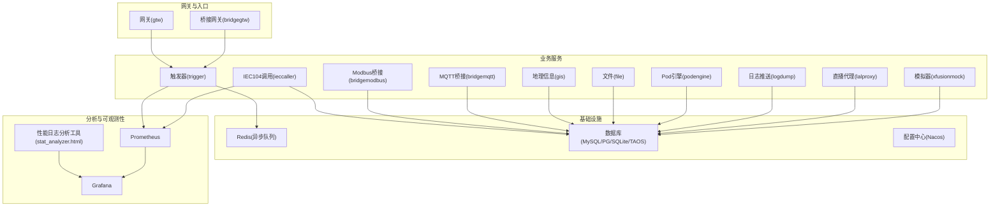
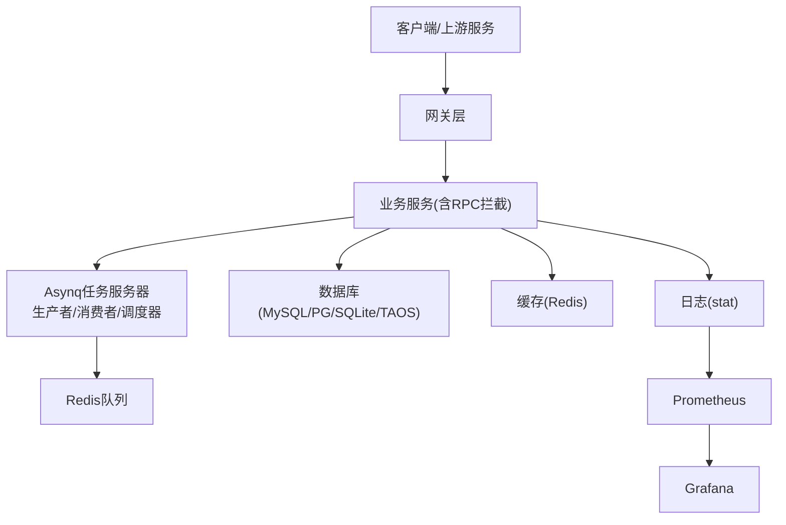
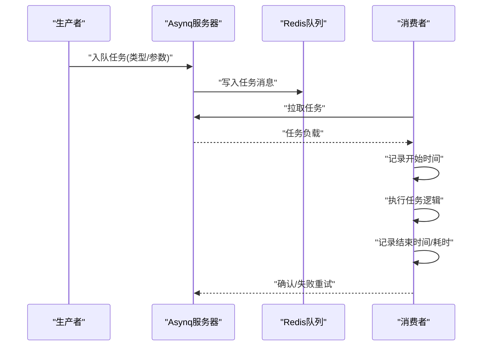
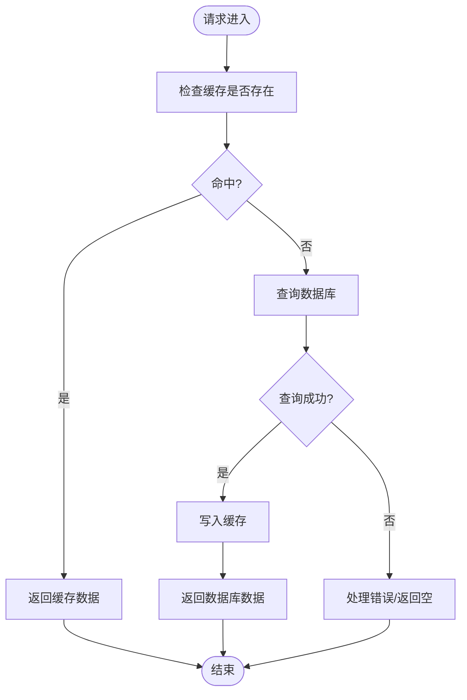
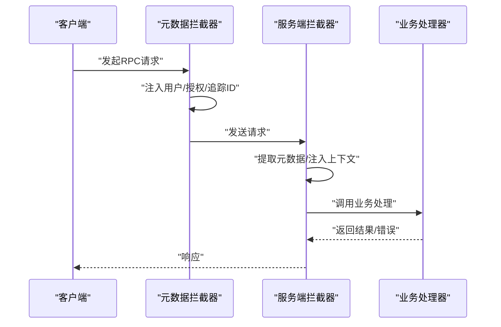
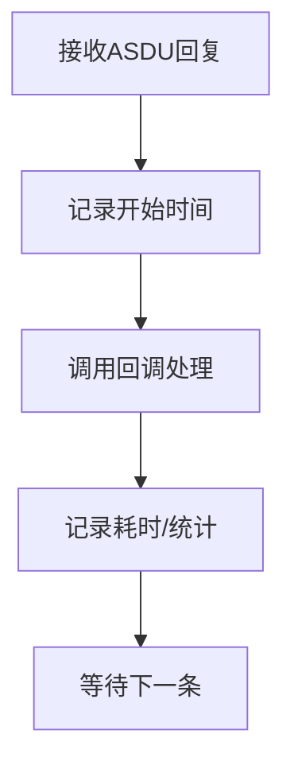
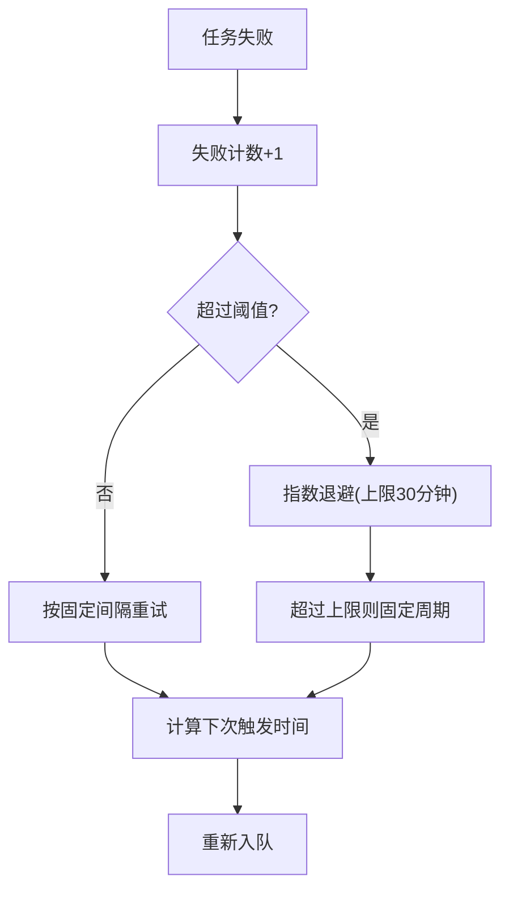
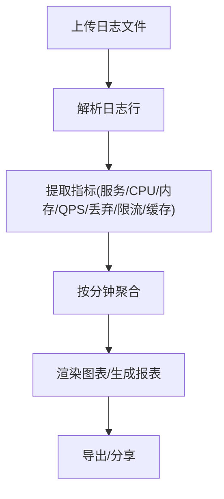
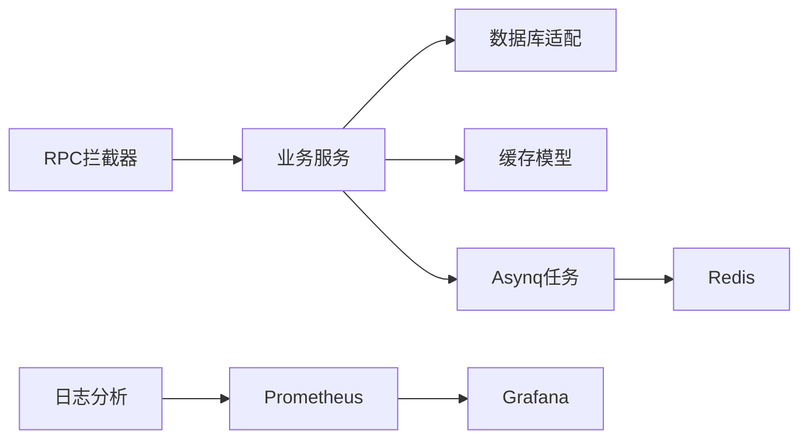

# 性能瓶颈分析

<cite>
**本文档引用的文件**
- [deploy/stat_analyzer.html](file://deploy/stat_analyzer.html)
- [common/asynqx/asynqClient.go](file://common/asynqx/asynqClient.go)
- [common/asynqx/asynqTaskServer.go](file://common/asynqx/asynqTaskServer.go)
- [common/asynqx/asynqSchedulerServer.go](file://common/asynqx/asynqSchedulerServer.go)
- [common/asynqx/tasktype.go](file://common/asynqx/tasktype.go)
- [.trae/skills/zero-skills/references/resilience-patterns.md](file://.trae/skills/zero-skills/references/resilience-patterns.md)
- [common/Interceptor/rpcserver/loggerInterceptor.go](file://common/Interceptor/rpcserver/loggerInterceptor.go)
- [common/Interceptor/rpcclient/metadataInterceptor.go](file://common/Interceptor/rpcclient/metadataInterceptor.go)
- [common/tool/backoff.go](file://common/tool/backoff.go)
- [common/dbx/dbx.go](file://common/dbx/dbx.go)
- [common/dbx/sqlitesql.go](file://common/dbx/sqlitesql.go)
- [app/trigger/trigger.proto](file://app/trigger/trigger.proto)
- [app/trigger/trigger/trigger.pb.go](file://app/trigger/trigger/trigger.pb.go)
- [app/trigger/internal/logic/getexecitemdashboardlogic.go](file://app/trigger/internal/logic/getexecitemdashboardlogic.go)
- [app/trigger/internal/logic/callbackplanexecitemlogic.go](file://app/trigger/internal/logic/callbackplanexecitemlogic.go)
- [app/ieccaller/ieccaller/ieccaller.pb.go](file://app/ieccaller/ieccaller/ieccaller.pb.go)
- [app/ieccaller/cron/cronservice.go](file://app/ieccaller/cron/cronservice.go)
- [common/iec104/client/handle.go](file://common/iec104/client/handle.go)
- [model/devicepointmappingmodel.go](file://model/devicepointmappingmodel.go)
- [app/ieccaller/internal/logic/clearpointmappingcachelogic.go](file://app/ieccaller/internal/logic/clearpointmappingcachelogic.go)
- [model/sql/test.sql](file://model/sql/test.sql)
</cite>

## 目录
1. [简介](#简介)
2. [项目结构](#项目结构)
3. [核心组件](#核心组件)
4. [架构总览](#架构总览)
5. [详细组件分析](#详细组件分析)
6. [依赖关系分析](#依赖关系分析)
7. [性能考量](#性能考量)
8. [故障排查指南](#故障排查指南)
9. [结论](#结论)
10. [附录](#附录)

## 简介
本指南面向 zero-service 的性能瓶颈分析与优化，聚焦以下目标：
- 慢调用识别：响应时间阈值设置、慢查询检测、异常调用告警
- 热点服务发现：调用频率统计、资源消耗分析、并发度监控
- 依赖关系分析：服务依赖图构建、循环依赖检测、关键路径识别
- 异步任务性能：任务执行时间统计、队列积压监控、调度延迟分析
- 指标采集与可视化：Prometheus 集成、Grafana 可视化方案

## 项目结构
zero-service 采用多模块微服务架构，围绕 go-zero 框架组织，包含网关层、业务服务、异步任务、缓存与数据库适配、IEC104 协议桥接、以及性能日志分析工具。

**图表来源**
- [deploy/stat_analyzer.html](file://deploy/stat_analyzer.html)
- [common/asynqx/asynqTaskServer.go](file://common/asynqx/asynqTaskServer.go)
- [common/dbx/dbx.go](file://common/dbx/dbx.go)

**章节来源**
- [deploy/stat_analyzer.html](file://deploy/stat_analyzer.html)
- [common/dbx/dbx.go](file://common/dbx/dbx.go)

## 核心组件
- 异步任务框架：基于 Asynq 的生产者/消费者/调度器封装，提供任务类型、并发控制、队列优先级与中间件日志统计。
- 性能日志分析：前端工具可解析 Go-Zero stat 日志，提取 CPU、内存、QPS、丢弃、限流状态、缓存命中率等指标并可视化。
- 缓存与数据库：统一数据库连接适配与方言注册，支持 SQLite、TAOS、MySQL、PostgreSQL；模型层具备缓存读写与失效能力。
- RPC 拦截与元数据：服务端日志拦截器与客户端元数据注入，便于链路追踪与上下文传递。
- 触发器与计划任务：基于 Asynq 的计划任务与队列信息模型，支持队列积压、延迟任务、调度延迟统计。
- IEC104 协议桥接：客户端处理器对各类 ASDU 回复进行耗时统计，便于慢调用识别。

**章节来源**
- [common/asynqx/asynqClient.go](file://common/asynqx/asynqClient.go)
- [common/asynqx/asynqTaskServer.go](file://common/asynqx/asynqTaskServer.go)
- [common/asynqx/asynqSchedulerServer.go](file://common/asynqx/asynqSchedulerServer.go)
- [deploy/stat_analyzer.html](file://deploy/stat_analyzer.html)
- [common/dbx/dbx.go](file://common/dbx/dbx.go)
- [common/Interceptor/rpcserver/loggerInterceptor.go](file://common/Interceptor/rpcserver/loggerInterceptor.go)
- [common/Interceptor/rpcclient/metadataInterceptor.go](file://common/Interceptor/rpcclient/metadataInterceptor.go)
- [app/trigger/trigger.proto](file://app/trigger/trigger.proto)
- [app/trigger/trigger/trigger.pb.go](file://app/trigger/trigger/trigger.pb.go)
- [common/iec104/client/handle.go](file://common/iec104/client/handle.go)

## 架构总览
下图展示性能相关组件在系统中的交互关系，包括异步任务、缓存/数据库、RPC 拦截、日志分析与指标采集。

**图表来源**
- [common/asynqx/asynqTaskServer.go](file://common/asynqx/asynqTaskServer.go)
- [common/dbx/dbx.go](file://common/dbx/dbx.go)
- [deploy/stat_analyzer.html](file://deploy/stat_analyzer.html)

## 详细组件分析

### 异步任务性能分析
- 任务执行时间统计：消费者中间件记录任务开始时间、结束时间与耗时，并输出带持续时间的日志，便于定位慢任务。
- 队列积压监控：通过队列信息模型获取 pending/active/scheduled/retry/aggregating/archived/completed 等指标，结合 processed/failed 统计评估积压与失败率。
- 调度延迟分析：调度器注册周期任务，记录入队错误与任务保留策略，结合任务类型标签进行延迟分析。
- 任务类型与优先级：定义任务类型常量，按 critical/default/low 设置队列权重，便于差异化处理与资源分配。

**图表来源**
- [common/asynqx/asynqTaskServer.go](file://common/asynqx/asynqTaskServer.go)
- [common/asynqx/asynqSchedulerServer.go](file://common/asynqx/asynqSchedulerServer.go)
- [common/asynqx/asynqClient.go](file://common/asynqx/asynqClient.go)
- [common/asynqx/tasktype.go](file://common/asynqx/tasktype.go)
- [app/trigger/trigger.proto](file://app/trigger/trigger.proto)
- [app/trigger/trigger/trigger.pb.go](file://app/trigger/trigger/trigger.pb.go)

**章节来源**
- [common/asynqx/asynqTaskServer.go](file://common/asynqx/asynqTaskServer.go)
- [common/asynqx/asynqSchedulerServer.go](file://common/asynqx/asynqSchedulerServer.go)
- [common/asynqx/asynqClient.go](file://common/asynqx/asynqClient.go)
- [common/asynqx/tasktype.go](file://common/asynqx/tasktype.go)
- [app/trigger/trigger.proto](file://app/trigger/trigger.proto)
- [app/trigger/trigger/trigger.pb.go](file://app/trigger/trigger/trigger.pb.go)

### 缓存与数据库性能
- 数据库适配：根据数据源自动识别数据库类型并创建连接，注册方言，支持日志输出与 SQL 构建。
- 模型缓存：设备点位映射模型提供缓存读取、失效与键生成，减少数据库压力；支持批量清除缓存广播。
- 缓存命中率：前端日志分析工具可提取缓存命中率、QPM、命中/缺失计数与数据库失败次数，用于评估缓存策略有效性。

**图表来源**
- [model/devicepointmappingmodel.go](file://model/devicepointmappingmodel.go)
- [app/ieccaller/internal/logic/clearpointmappingcachelogic.go](file://app/ieccaller/internal/logic/clearpointmappingcachelogic.go)
- [common/dbx/dbx.go](file://common/dbx/dbx.go)
- [deploy/stat_analyzer.html](file://deploy/stat_analyzer.html)

**章节来源**
- [model/devicepointmappingmodel.go](file://model/devicepointmappingmodel.go)
- [app/ieccaller/internal/logic/clearpointmappingcachelogic.go](file://app/ieccaller/internal/logic/clearpointmappingcachelogic.go)
- [common/dbx/dbx.go](file://common/dbx/dbx.go)
- [common/dbx/sqlitesql.go](file://common/dbx/sqlitesql.go)
- [deploy/stat_analyzer.html](file://deploy/stat_analyzer.html)

### RPC 拦截与链路追踪
- 服务端拦截：从入站元数据提取用户、部门、授权与追踪 ID，注入上下文，统一记录错误日志，便于定位慢调用与异常。
- 客户端拦截：在出站请求中注入相同元数据，确保跨服务链路一致，便于端到端性能分析。

**图表来源**
- [common/Interceptor/rpcserver/loggerInterceptor.go](file://common/Interceptor/rpcserver/loggerInterceptor.go)
- [common/Interceptor/rpcclient/metadataInterceptor.go](file://common/Interceptor/rpcclient/metadataInterceptor.go)

**章节来源**
- [common/Interceptor/rpcserver/loggerInterceptor.go](file://common/Interceptor/rpcserver/loggerInterceptor.go)
- [common/Interceptor/rpcclient/metadataInterceptor.go](file://common/Interceptor/rpcclient/metadataInterceptor.go)

### IEC104 协议慢调用识别
- 客户端处理器：对总召唤、计数器、读定值、测试命令、时钟同步等 ASDU 回复分别统计耗时，便于识别慢响应与异常调用。

**图表来源**
- [common/iec104/client/handle.go](file://common/iec104/client/handle.go)

**章节来源**
- [common/iec104/client/handle.go](file://common/iec104/client/handle.go)

### 触发器与计划任务性能
- 队列信息：包含 pending/active/scheduled/retry/aggregating/archived/completed/processTotal/failedTotal 等字段，用于评估队列健康度与积压。
- 延迟与回退：提供延迟触发与指数退避策略，结合失败计数计算下次触发时间，避免雪崩。
- 仪表盘统计：通过 SQL 查询统计计划/批次/执行项状态，辅助识别延期与终止任务占比。

**图表来源**
- [common/tool/backoff.go](file://common/tool/backoff.go)
- [app/trigger/trigger.proto](file://app/trigger/trigger.proto)
- [app/trigger/trigger/trigger.pb.go](file://app/trigger/trigger/trigger.pb.go)
- [app/trigger/internal/logic/callbackplanexecitemlogic.go](file://app/trigger/internal/logic/callbackplanexecitemlogic.go)
- [app/trigger/internal/logic/getexecitemdashboardlogic.go](file://app/trigger/internal/logic/getexecitemdashboardlogic.go)
- [model/sql/test.sql](file://model/sql/test.sql)

**章节来源**
- [common/tool/backoff.go](file://common/tool/backoff.go)
- [app/trigger/trigger.proto](file://app/trigger/trigger.proto)
- [app/trigger/trigger/trigger.pb.go](file://app/trigger/trigger/trigger.pb.go)
- [app/trigger/internal/logic/callbackplanexecitemlogic.go](file://app/trigger/internal/logic/callbackplanexecitemlogic.go)
- [app/trigger/internal/logic/getexecitemdashboardlogic.go](file://app/trigger/internal/logic/getexecitemdashboardlogic.go)
- [model/sql/test.sql](file://model/sql/test.sql)

### 性能日志分析与可视化
- 日志解析：支持内存使用、限流状态、性能指标等多类 stat 日志，提取服务名、CPU、内存、QPS、丢弃、限流状态、缓存命中率等。
- 指标聚合：按分钟粒度聚合，计算各类型 QPS、响应时间分位数（avg/med/p90/p99/p999），并生成图表。
- 可视化：提供 QPS 趋势、内存趋势、系统指标综合图、服务分布、限流状态分析、缓存命中率趋势等图表。

**图表来源**
- [deploy/stat_analyzer.html](file://deploy/stat_analyzer.html)

**章节来源**
- [deploy/stat_analyzer.html](file://deploy/stat_analyzer.html)

## 依赖关系分析
- 组件耦合：异步任务依赖 Redis；业务服务依赖数据库与缓存；RPC 拦截器贯穿服务端与客户端；日志分析工具独立于业务，仅消费日志。
- 循环依赖检测：代码中未见直接循环导入；Asynq 生产者/消费者/调度器相互协作但无循环依赖。
- 关键路径识别：RPC 请求经网关进入服务，若涉及数据库/缓存/异步队列，需关注这些环节的耗时占比。

**图表来源**
- [common/Interceptor/rpcserver/loggerInterceptor.go](file://common/Interceptor/rpcserver/loggerInterceptor.go)
- [common/Interceptor/rpcclient/metadataInterceptor.go](file://common/Interceptor/rpcclient/metadataInterceptor.go)
- [common/dbx/dbx.go](file://common/dbx/dbx.go)
- [common/asynqx/asynqTaskServer.go](file://common/asynqx/asynqTaskServer.go)
- [deploy/stat_analyzer.html](file://deploy/stat_analyzer.html)

**章节来源**
- [common/Interceptor/rpcserver/loggerInterceptor.go](file://common/Interceptor/rpcserver/loggerInterceptor.go)
- [common/Interceptor/rpcclient/metadataInterceptor.go](file://common/Interceptor/rpcclient/metadataInterceptor.go)
- [common/dbx/dbx.go](file://common/dbx/dbx.go)
- [common/asynqx/asynqTaskServer.go](file://common/asynqx/asynqTaskServer.go)
- [deploy/stat_analyzer.html](file://deploy/stat_analyzer.html)

## 性能考量
- 响应时间阈值：建议在网关与服务端分别设置阈值，超阈告警；结合日志分析工具的分位数指标（p90/p99/p999）设定基线。
- 慢查询检测：开启数据库日志与慢查询日志，结合模型缓存与连接池配置优化；定期审查 SQL 查询计划。
- 并发度与限流：合理设置 Asynq 并发度与队列优先级；启用 go-zero 自动负载削峰与速率限制，避免过载。
- 缓存策略：提升缓存命中率，降低数据库压力；对热点数据设置短 TTL，配合失效广播保证一致性。
- 监控与告警：Prometheus 抓取指标，Grafana 展示 CPU/内存/QPS/丢弃/队列长度/缓存命中率/任务耗时等；建立阈值告警与根因分析流程。

[本节为通用指导，无需特定文件引用]

## 故障排查指南
- 慢调用定位：结合 RPC 拦截器日志与 IEC104 处理器耗时统计，定位具体服务与方法；使用日志分析工具筛选高耗时时间段。
- 队列积压：观察队列信息中的 pending/active/scheduled/retry/aggregating 指标，必要时扩容消费者或调整队列优先级。
- 缓存异常：检查缓存命中率与 QPM，核对缓存键生成与失效逻辑；必要时批量清理缓存并验证下游数据库。
- 数据库压力：审查慢查询日志与连接池配置，优化热点查询与索引；评估分库分表策略。
- 负载削峰：确认生产模式下的负载削峰开关与阈值，避免误判导致的拒绝服务。

**章节来源**
- [common/Interceptor/rpcserver/loggerInterceptor.go](file://common/Interceptor/rpcserver/loggerInterceptor.go)
- [common/iec104/client/handle.go](file://common/iec104/client/handle.go)
- [app/trigger/trigger/trigger.pb.go](file://app/trigger/trigger/trigger.pb.go)
- [deploy/stat_analyzer.html](file://deploy/stat_analyzer.html)

## 结论
通过对异步任务、缓存/数据库、RPC 拦截、日志分析与指标可视化的协同治理，zero-service 能够有效识别与缓解性能瓶颈。建议以“阈值告警 + 分位数分析 + 队列监控 + 缓存命中率”为核心，持续迭代优化关键路径与资源配置。

[本节为总结，无需特定文件引用]

## 附录
- Prometheus 集成要点
  - 暴露指标：在服务中注册自定义指标（如任务耗时、队列长度、缓存命中率），并与 Prometheus 抓取端口对接。
  - 抓取配置：在 Prometheus 中配置 job，指定抓取目标与间隔，确保覆盖所有业务服务与基础设施组件。
  - 告警规则：基于 p95/p99 响应时间、队列积压、CPU/内存阈值、丢弃率等设置告警规则。
- Grafana 可视化
  - 数据源：添加 Prometheus 作为数据源，配置查询面板。
  - 关键看板：CPU/内存趋势、QPS/丢弃、队列积压、缓存命中率、任务耗时分布、慢调用 TopN。
  - 仪表盘：按服务/队列/任务类型维度拆分，支持时间范围与服务筛选。

[本节为通用指导，无需特定文件引用]