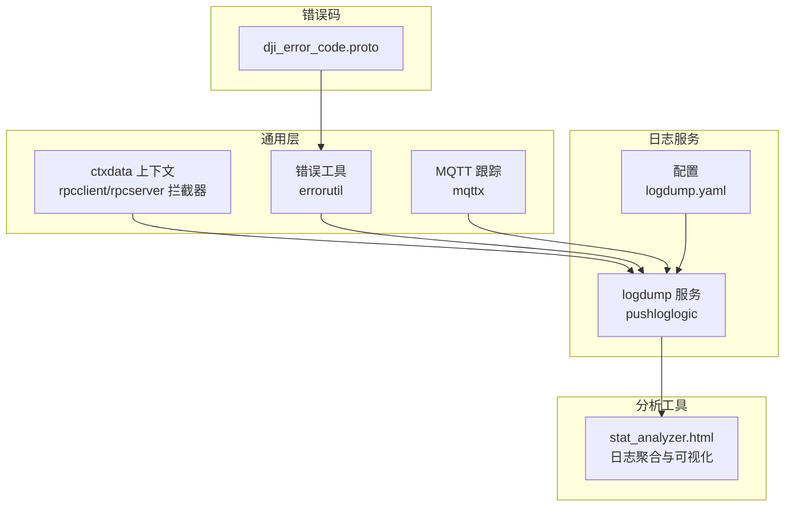
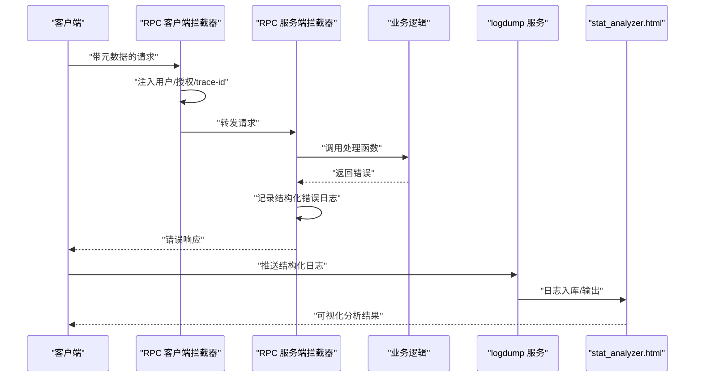
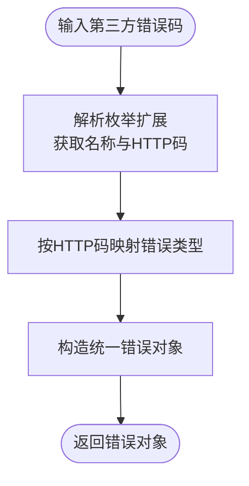
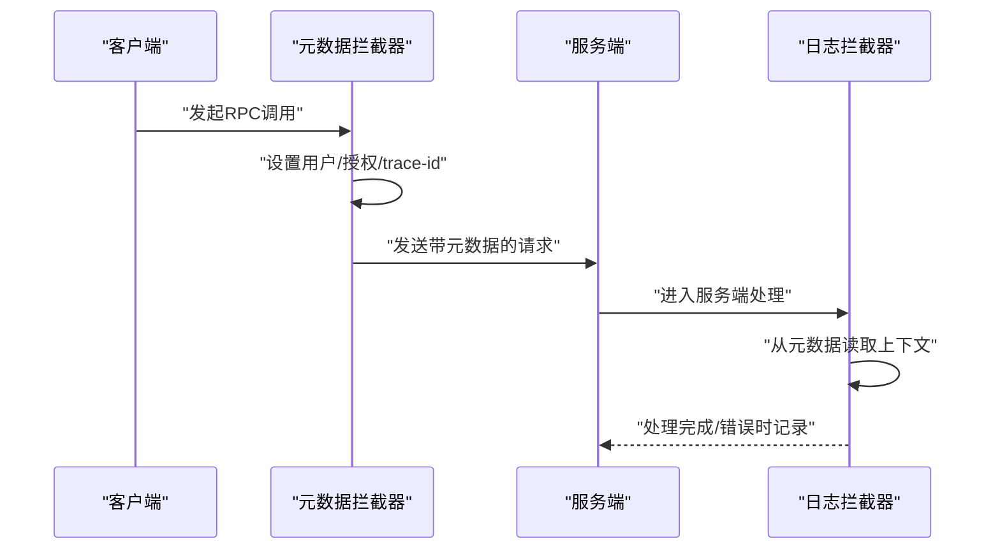
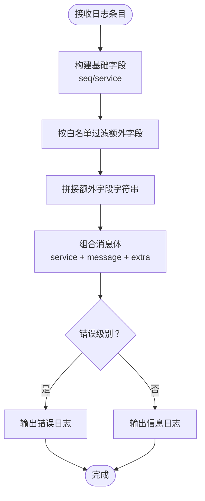
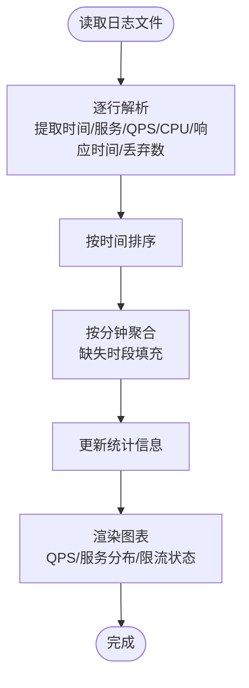
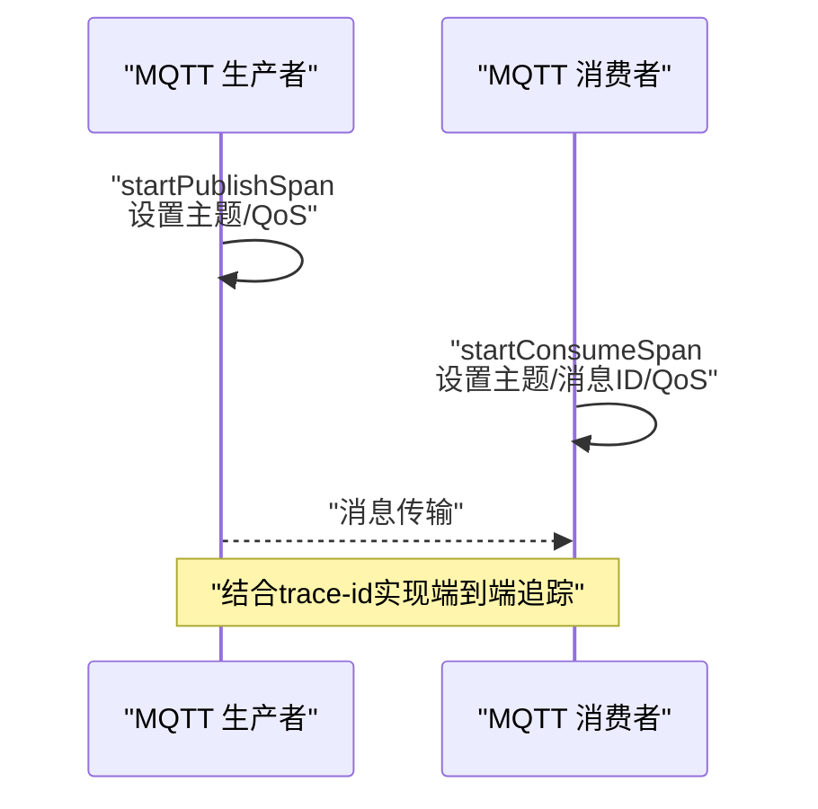
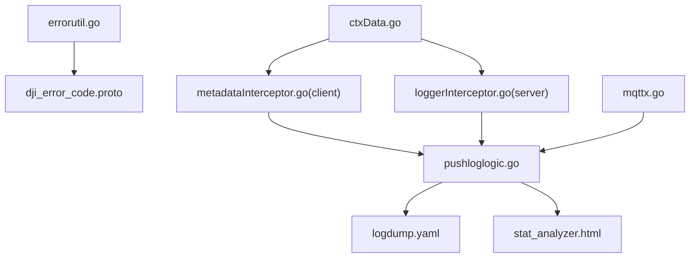

# 错误根因分析

<cite>
**本文引用的文件**
- [common/tool/errorutil.go](file://common/tool/errorutil.go)
- [common/ctxdata/ctxData.go](file://common/ctxdata/ctxData.go)
- [common/Interceptor/rpcserver/loggerInterceptor.go](file://common/Interceptor/rpcserver/loggerInterceptor.go)
- [common/Interceptor/rpcclient/metadataInterceptor.go](file://common/Interceptor/rpcclient/metadataInterceptor.go)
- [app/logdump/internal/logic/pushloglogic.go](file://app/logdump/internal/logic/pushloglogic.go)
- [app/logdump/etc/logdump.yaml](file://app/logdump/etc/logdump.yaml)
- [deploy/stat_analyzer.html](file://deploy/stat_analyzer.html)
- [third_party/dji_error_code.proto](file://third_party/dji_error_code.proto)
- [.trae/skills/zero-skills/references/resilience-patterns.md](file://.trae/skills/zero-skills/references/resilience-patterns.md)
- [common/mqttx/mqttx.go](file://common/mqttx/mqttx.go)
</cite>

## 目录
1. [简介](#简介)
2. [项目结构](#项目结构)
3. [核心组件](#核心组件)
4. [架构总览](#架构总览)
5. [详细组件分析](#详细组件分析)
6. [依赖关系分析](#依赖关系分析)
7. [性能考量](#性能考量)
8. [故障排查指南](#故障排查指南)
9. [结论](#结论)
10. [附录](#附录)

## 简介
本技术文档围绕 zero-service 的错误根因分析能力，系统性梳理异常传播路径追踪、错误聚合与分类、故障定位方法、错误日志结构化处理以及常见错误模式的识别与处置策略。重点覆盖：
- 异常传播链路：基于 gRPC 元数据透传与拦截器，确保错误上下文在服务间传递。
- 错误聚合与分类：通过统一错误码映射与日志结构化，实现错误类型识别、重复过滤与趋势分析。
- 故障定位：结合时间线分析、调用链回溯与影响范围评估，快速定位根因。
- 日志结构化：规范日志字段、提取关键指标、进行关联分析与可视化。
- 常见错误模式：网络异常、数据库超时、外部服务不可用等场景的根因分析方法。

## 项目结构
本项目采用多服务微架构，围绕日志采集与分析、RPC 服务、拦截器与上下文传递、错误码映射等模块构建错误根因分析能力。关键目录与文件如下：
- common：通用工具与拦截器，包含错误工具、上下文数据、RPC 客户端/服务端拦截器。
- app/logdump：日志接收服务，负责结构化日志入库与输出。
- deploy：前端静态分析工具 stat_analyzer.html，用于日志聚合与可视化。
- third_party：第三方错误码定义，如 DJI 错误码。
- .trae/skills：技能与最佳实践参考，包含弹性与容错模式。

**图表来源**
- [common/ctxdata/ctxData.go:1-76](file://common/ctxdata/ctxData.go#L1-L76)
- [common/Interceptor/rpcclient/metadataInterceptor.go:1-56](file://common/Interceptor/rpcclient/metadataInterceptor.go#L1-L56)
- [common/Interceptor/rpcserver/loggerInterceptor.go:1-45](file://common/Interceptor/rpcserver/loggerInterceptor.go#L1-L45)
- [app/logdump/internal/logic/pushloglogic.go:1-68](file://app/logdump/internal/logic/pushloglogic.go#L1-L68)
- [app/logdump/etc/logdump.yaml:1-26](file://app/logdump/etc/logdump.yaml#L1-L26)
- [deploy/stat_analyzer.html:785-1146](file://deploy/stat_analyzer.html#L785-L1146)
- [third_party/dji_error_code.proto:1-513](file://third_party/dji_error_code.proto#L1-L513)

**章节来源**
- [common/ctxdata/ctxData.go:1-76](file://common/ctxdata/ctxData.go#L1-L76)
- [common/Interceptor/rpcclient/metadataInterceptor.go:1-56](file://common/Interceptor/rpcclient/metadataInterceptor.go#L1-L56)
- [common/Interceptor/rpcserver/loggerInterceptor.go:1-45](file://common/Interceptor/rpcserver/loggerInterceptor.go#L1-L45)
- [app/logdump/internal/logic/pushloglogic.go:1-68](file://app/logdump/internal/logic/pushloglogic.go#L1-L68)
- [app/logdump/etc/logdump.yaml:1-26](file://app/logdump/etc/logdump.yaml#L1-L26)
- [deploy/stat_analyzer.html:785-1146](file://deploy/stat_analyzer.html#L785-L1146)
- [third_party/dji_error_code.proto:1-513](file://third_party/dji_error_code.proto#L1-L513)

## 核心组件
- 错误工具与错误码映射：将第三方错误码映射为统一错误对象，支持按原因码判断与 HTTP 状态转换。
- 上下文与元数据：通过 gRPC 元数据在客户端/服务端之间传递 trace-id、用户信息等上下文，支撑链路追踪。
- RPC 拦截器：服务端拦截器在出错时输出结构化错误日志；客户端拦截器在请求中注入上下文。
- 日志服务：接收结构化日志，按配置过滤与输出，并支持额外字段白名单。
- 日志分析工具：前端 HTML 工具解析日志、提取关键指标、按分钟聚合、绘制趋势图与分布图。
- MQTT 跟踪：在 MQTT 生产/消费场景中创建 Span，记录主题、消息 ID、QoS 等关键属性。

**章节来源**
- [common/tool/errorutil.go:1-91](file://common/tool/errorutil.go#L1-L91)
- [common/ctxdata/ctxData.go:1-76](file://common/ctxdata/ctxData.go#L1-L76)
- [common/Interceptor/rpcserver/loggerInterceptor.go:1-45](file://common/Interceptor/rpcserver/loggerInterceptor.go#L1-L45)
- [common/Interceptor/rpcclient/metadataInterceptor.go:1-56](file://common/Interceptor/rpcclient/metadataInterceptor.go#L1-L56)
- [app/logdump/internal/logic/pushloglogic.go:1-68](file://app/logdump/internal/logic/pushloglogic.go#L1-L68)
- [deploy/stat_analyzer.html:785-1146](file://deploy/stat_analyzer.html#L785-L1146)
- [common/mqttx/mqttx.go:361-388](file://common/mqttx/mqttx.go#L361-L388)

## 架构总览
下图展示错误根因分析的关键流程：客户端发起请求，元数据携带上下文；服务端拦截器记录错误；日志服务接收结构化日志；前端工具进行聚合与可视化。

**图表来源**
- [common/Interceptor/rpcclient/metadataInterceptor.go:1-56](file://common/Interceptor/rpcclient/metadataInterceptor.go#L1-L56)
- [common/Interceptor/rpcserver/loggerInterceptor.go:1-45](file://common/Interceptor/rpcserver/loggerInterceptor.go#L1-L45)
- [app/logdump/internal/logic/pushloglogic.go:1-68](file://app/logdump/internal/logic/pushloglogic.go#L1-L68)
- [deploy/stat_analyzer.html:785-1146](file://deploy/stat_analyzer.html#L785-L1146)

## 详细组件分析

### 组件一：错误工具与错误码映射
- 功能要点
  - 将第三方错误码映射为统一错误对象，支持格式化消息与 HTTP 状态码转换。
  - 提供按原因码判断的工具函数，便于在业务层进行条件分支与错误分类。
- 关键实现
  - 错误码解析：从枚举扩展中读取名称与 HTTP 码。
  - 错误构造：根据 HTTP 码映射到对应错误类型。
  - 原因码匹配：通过原因码字符串比较进行错误类型判定。
- 适用场景
  - 统一对外错误响应、错误分类与告警。
  - 与第三方错误码（如 DJI 错误码）集成。

**图表来源**
- [common/tool/errorutil.go:61-81](file://common/tool/errorutil.go#L61-L81)
- [common/tool/errorutil.go:12-59](file://common/tool/errorutil.go#L12-L59)
- [common/tool/errorutil.go:83-90](file://common/tool/errorutil.go#L83-L90)

**章节来源**
- [common/tool/errorutil.go:1-91](file://common/tool/errorutil.go#L1-L91)
- [third_party/dji_error_code.proto:1-513](file://third_party/dji_error_code.proto#L1-L513)

### 组件二：上下文与元数据传递
- 功能要点
  - 在 gRPC 元数据中注入用户标识、授权信息、trace-id 等上下文。
  - 服务端拦截器从入站元数据提取上下文并写入日志，便于链路追踪。
- 关键实现
  - 客户端拦截器：复制并设置元数据键值。
  - 服务端拦截器：从入站元数据读取并写入上下文。
  - 上下文工具：提供键常量与读取函数。
- 适用场景
  - 跨服务调用时保持 trace-id 一致，支持端到端链路追踪。

**图表来源**
- [common/Interceptor/rpcclient/metadataInterceptor.go:11-32](file://common/Interceptor/rpcclient/metadataInterceptor.go#L11-L32)
- [common/Interceptor/rpcserver/loggerInterceptor.go:12-42](file://common/Interceptor/rpcserver/loggerInterceptor.go#L12-L42)
- [common/ctxdata/ctxData.go:9-24](file://common/ctxdata/ctxData.go#L9-L24)

**章节来源**
- [common/Interceptor/rpcclient/metadataInterceptor.go:1-56](file://common/Interceptor/rpcclient/metadataInterceptor.go#L1-L56)
- [common/Interceptor/rpcserver/loggerInterceptor.go:1-45](file://common/Interceptor/rpcserver/loggerInterceptor.go#L1-L45)
- [common/ctxdata/ctxData.go:1-76](file://common/ctxdata/ctxData.go#L1-L76)

### 组件三：日志服务与结构化输出
- 功能要点
  - 接收结构化日志条目，按配置允许的额外字段白名单输出。
  - 对错误级别进行区分输出，支持后续分析工具解析。
- 关键实现
  - 白名单过滤：仅允许配置中的额外字段参与结构化输出。
  - 字段拼接：将服务名、消息与额外字段拼接为统一格式。
  - 级别区分：错误级别走错误输出，其他级别走信息输出。
- 适用场景
  - 统一日志格式，便于前端分析工具解析与可视化。

**图表来源**
- [app/logdump/internal/logic/pushloglogic.go:28-67](file://app/logdump/internal/logic/pushloglogic.go#L28-L67)
- [app/logdump/etc/logdump.yaml:21-26](file://app/logdump/etc/logdump.yaml#L21-L26)

**章节来源**
- [app/logdump/internal/logic/pushloglogic.go:1-68](file://app/logdump/internal/logic/pushloglogic.go#L1-L68)
- [app/logdump/etc/logdump.yaml:1-26](file://app/logdump/etc/logdump.yaml#L1-L26)

### 组件四：日志分析与可视化
- 功能要点
  - 解析日志文件，提取时间、服务、QPS、丢弃数、响应时间等指标。
  - 按分钟聚合数据，计算趋势与分布，渲染图表。
- 关键实现
  - 文件读取与进度提示：逐行解析并显示进度。
  - 指标提取：正则匹配时间戳、QPS、CPU、响应时间、丢弃数等。
  - 聚合策略：以分钟为粒度聚合，缺失时段用上一分钟数据填充。
  - 图表渲染：QPS 趋势、服务分布、限流状态分析等。
- 适用场景
  - 快速定位异常时段、识别热点服务与异常模式。

**图表来源**
- [deploy/stat_analyzer.html:785-839](file://deploy/stat_analyzer.html#L785-L839)
- [deploy/stat_analyzer.html:842-1015](file://deploy/stat_analyzer.html#L842-L1015)
- [deploy/stat_analyzer.html:1118-1146](file://deploy/stat_analyzer.html#L1118-L1146)
- [deploy/stat_analyzer.html:1618-1694](file://deploy/stat_analyzer.html#L1618-L1694)
- [deploy/stat_analyzer.html:1994-2024](file://deploy/stat_analyzer.html#L1994-L2024)
- [deploy/stat_analyzer.html:2415-2437](file://deploy/stat_analyzer.html#L2415-L2437)

**章节来源**
- [deploy/stat_analyzer.html:785-1146](file://deploy/stat_analyzer.html#L785-L1146)
- [deploy/stat_analyzer.html:1118-1146](file://deploy/stat_analyzer.html#L1118-L1146)
- [deploy/stat_analyzer.html:1618-1694](file://deploy/stat_analyzer.html#L1618-L1694)
- [deploy/stat_analyzer.html:1994-2024](file://deploy/stat_analyzer.html#L1994-L2024)
- [deploy/stat_analyzer.html:2415-2437](file://deploy/stat_analyzer.html#L2415-L2437)

### 组件五：MQTT 跟踪与调用链
- 功能要点
  - 在 MQTT 消费/发布场景中创建 Span，记录客户端 ID、主题、消息 ID、QoS 等属性。
  - 结合 trace-id 实现端到端链路追踪。
- 关键实现
  - 消费 Span：消费者端创建消费 Span，设置主题、消息 ID、QoS 等。
  - 发布 Span：生产者端创建发布 Span，设置主题、QoS 等。
- 适用场景
  - MQTT 场景下的根因分析与调用链回溯。

**图表来源**
- [common/mqttx/mqttx.go:361-388](file://common/mqttx/mqttx.go#L361-L388)

**章节来源**
- [common/mqttx/mqttx.go:361-388](file://common/mqttx/mqttx.go#L361-L388)

## 依赖关系分析
- 组件耦合
  - 错误工具与第三方错误码：通过枚举扩展读取名称与 HTTP 码，形成松耦合映射。
  - 拦截器与上下文：拦截器依赖上下文键常量，确保元数据一致性。
  - 日志服务与配置：日志服务依赖配置中的额外字段白名单，实现灵活的结构化输出。
  - 分析工具与日志：前端工具依赖日志格式规范，实现稳定的解析与可视化。
- 外部依赖
  - gRPC 元数据与拦截器：用于上下文传递与错误日志记录。
  - OpenTelemetry：用于 MQTT 跟踪与 Span 属性设置。
- 循环依赖
  - 未发现直接循环依赖；模块职责清晰，接口边界明确。

**图表来源**
- [common/tool/errorutil.go:1-91](file://common/tool/errorutil.go#L1-L91)
- [third_party/dji_error_code.proto:1-513](file://third_party/dji_error_code.proto#L1-L513)
- [common/ctxdata/ctxData.go:1-76](file://common/ctxdata/ctxData.go#L1-L76)
- [common/Interceptor/rpcclient/metadataInterceptor.go:1-56](file://common/Interceptor/rpcclient/metadataInterceptor.go#L1-L56)
- [common/Interceptor/rpcserver/loggerInterceptor.go:1-45](file://common/Interceptor/rpcserver/loggerInterceptor.go#L1-L45)
- [app/logdump/internal/logic/pushloglogic.go:1-68](file://app/logdump/internal/logic/pushloglogic.go#L1-L68)
- [app/logdump/etc/logdump.yaml:1-26](file://app/logdump/etc/logdump.yaml#L1-L26)
- [deploy/stat_analyzer.html:785-1146](file://deploy/stat_analyzer.html#L785-L1146)
- [common/mqttx/mqttx.go:361-388](file://common/mqttx/mqttx.go#L361-L388)

**章节来源**
- [common/tool/errorutil.go:1-91](file://common/tool/errorutil.go#L1-L91)
- [common/ctxdata/ctxData.go:1-76](file://common/ctxdata/ctxData.go#L1-L76)
- [common/Interceptor/rpcclient/metadataInterceptor.go:1-56](file://common/Interceptor/rpcclient/metadataInterceptor.go#L1-L56)
- [common/Interceptor/rpcserver/loggerInterceptor.go:1-45](file://common/Interceptor/rpcserver/loggerInterceptor.go#L1-L45)
- [app/logdump/internal/logic/pushloglogic.go:1-68](file://app/logdump/internal/logic/pushloglogic.go#L1-L68)
- [app/logdump/etc/logdump.yaml:1-26](file://app/logdump/etc/logdump.yaml#L1-L26)
- [deploy/stat_analyzer.html:785-1146](file://deploy/stat_analyzer.html#L785-L1146)
- [common/mqttx/mqttx.go:361-388](file://common/mqttx/mqttx.go#L361-L388)

## 性能考量
- 日志解析与聚合
  - 建议分批处理日志文件，避免一次性加载过大文件导致内存压力。
  - 聚合策略采用分钟级窗口，缺失时段用上一分钟数据填充，降低波动影响。
- 错误映射与拦截器
  - 错误码映射为常量查找，开销极低；拦截器仅在错误发生时输出日志，避免高频写入。
- 可视化渲染
  - 图表渲染采用增量更新与动画优化，提升用户体验。

[本节为通用指导，无需具体文件分析]

## 故障排查指南
- 异常传播路径追踪
  - 检查 gRPC 元数据是否正确注入与透传，确保 trace-id 一致。
  - 查看服务端拦截器日志，定位首个错误发生点。
- 错误聚合与分类
  - 使用错误工具按原因码进行分类，结合第三方错误码映射进行统一处理。
  - 在日志服务中启用必要的额外字段白名单，确保关键上下文可被分析工具识别。
- 故障定位
  - 使用 stat_analyzer.html 对异常时段进行聚合分析，识别 QPS 与丢弃数异常。
  - 结合 MQTT 跟踪与 trace-id，回溯消息消费/发布的调用链。
- 常见错误模式
  - 网络异常：关注连接断开、请求超时、证书错误等指标。
  - 数据库超时：结合服务端日志与数据库监控，定位慢查询与锁等待。
  - 外部服务不可用：通过错误码映射与告警，快速识别外部依赖故障。

**章节来源**
- [common/Interceptor/rpcserver/loggerInterceptor.go:40-42](file://common/Interceptor/rpcserver/loggerInterceptor.go#L40-L42)
- [app/logdump/etc/logdump.yaml:21-26](file://app/logdump/etc/logdump.yaml#L21-L26)
- [deploy/stat_analyzer.html:1618-1694](file://deploy/stat_analyzer.html#L1618-L1694)
- [.trae/skills/zero-skills/references/resilience-patterns.md:342-401](file://.trae/skills/zero-skills/references/resilience-patterns.md#L342-L401)

## 结论
通过统一的错误码映射、上下文透传与结构化日志输出，配合前端日志分析工具与 MQTT 跟踪，zero-service 形成了完整的错误根因分析闭环。该方案能够有效追踪异常传播路径、聚合与分类错误、定位故障并评估影响范围，为生产环境的稳定性保障提供了坚实基础。

[本节为总结，无需具体文件分析]

## 附录
- 最佳实践参考
  - 容错与弹性设计：在各层设置合理超时、熔断与降载策略，避免级联故障。
  - 错误处理：定义清晰的错误类型与包装策略，便于统一响应与分类。
- 常见错误模式与处置
  - 网络异常：检查证书、DNS、防火墙与负载均衡；必要时启用重试与退避。
  - 数据库超时：优化索引、拆分查询、引入缓存；必要时扩容或迁移。
  - 外部服务不可用：通过熔断与降级保护内部系统，同时建立 SLA 与应急流程。

**章节来源**
- [.trae/skills/zero-skills/references/resilience-patterns.md:342-401](file://.trae/skills/zero-skills/references/resilience-patterns.md#L342-L401)
- [.trae/skills/zero-skills/references/resilience-patterns.md:565-590](file://.trae/skills/zero-skills/references/resilience-patterns.md#L565-L590)