# 仪表板设计与布局

<cite>
**本文档引用的文件**
- [deploy/stat_analyzer.html](file://deploy/stat_analyzer.html)
- [app/lalhook/start.html](file://app/lalhook/start.html)
- [common/socketiox/test-socketio.html](file://common/socketiox/test-socketio.html)
- [gtw/upload_demo.html](file://gtw/upload_demo.html)
- [app/trigger/etc/trigger.yaml](file://app/trigger/etc/trigger.yaml)
- [app/bridgegtw/etc/bridgegtw.yaml](file://app/bridgegtw/etc/bridgegtw.yaml)
</cite>

## 目录
1. [引言](#引言)
2. [项目结构](#项目结构)
3. [核心组件](#核心组件)
4. [架构概览](#架构概览)
5. [详细组件分析](#详细组件分析)
6. [依赖关系分析](#依赖关系分析)
7. [性能考虑](#性能考虑)
8. [故障排除指南](#故障排除指南)
9. [结论](#结论)
10. [附录](#附录)

## 引言

zero-service 项目提供了多个仪表板和可视化界面，涵盖了日志分析、文件上传、实时通信等多种应用场景。本文档旨在为开发者和设计师提供一套完整的仪表板设计与布局指南，深入讲解信息架构设计原则、布局设计规范、交互体验设计以及主题配置方案。

## 项目结构

该项目包含多个独立的前端仪表板应用，每个都有其特定的功能和设计特点：

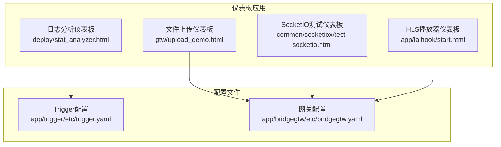

**图表来源**
- [deploy/stat_analyzer.html:1-50](file://deploy/stat_analyzer.html#L1-L50)
- [gtw/upload_demo.html:1-50](file://gtw/upload_demo.html#L1-L50)
- [common/socketiox/test-socketio.html:1-50](file://common/socketiox/test-socketio.html#L1-L50)
- [app/lalhook/start.html:1-50](file://app/lalhook/start.html#L1-L50)

**章节来源**
- [deploy/stat_analyzer.html:1-100](file://deploy/stat_analyzer.html#L1-L100)
- [gtw/upload_demo.html:1-100](file://gtw/upload_demo.html#L1-L100)
- [common/socketiox/test-socketio.html:1-100](file://common/socketiox/test-socketio.html#L1-L100)
- [app/lalhook/start.html:1-100](file://app/lalhook/start.html#L1-L100)

## 核心组件

### 设计系统基础

项目采用了统一的设计系统，包括颜色体系、字体规范和组件规范：

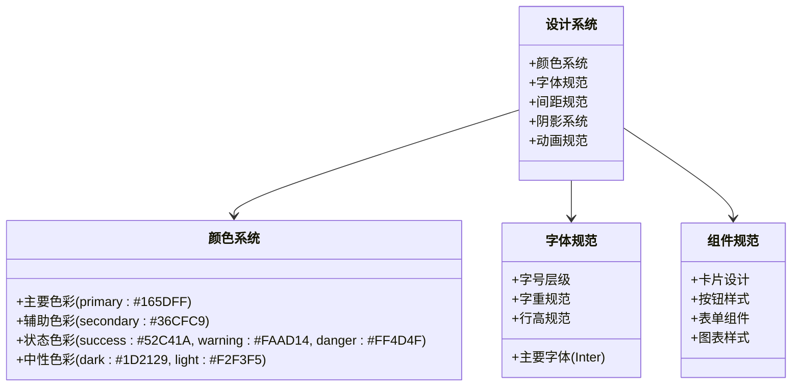

**图表来源**
- [deploy/stat_analyzer.html:14-37](file://deploy/stat_analyzer.html#L14-L37)
- [gtw/upload_demo.html:10-27](file://gtw/upload_demo.html#L10-L27)

### 响应式布局架构

所有仪表板都采用了响应式设计原则，确保在不同设备上的良好体验：

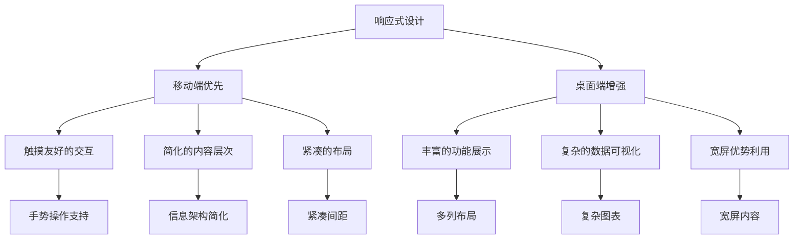

**章节来源**
- [deploy/stat_analyzer.html:257-295](file://deploy/stat_analyzer.html#L257-L295)
- [gtw/upload_demo.html:59-92](file://gtw/upload_demo.html#L59-L92)
- [common/socketiox/test-socketio.html:255-266](file://common/socketiox/test-socketio.html#L255-L266)

## 架构概览

### 信息架构设计原则

项目遵循以下信息架构设计原则：

1. **数据分层**：将信息按照重要性和使用频率进行分层
2. **信息优先级**：通过视觉权重突出关键信息
3. **视觉层次**：运用尺寸、颜色、间距建立清晰的信息层次
4. **一致性**：在整个应用中保持设计语言的一致性

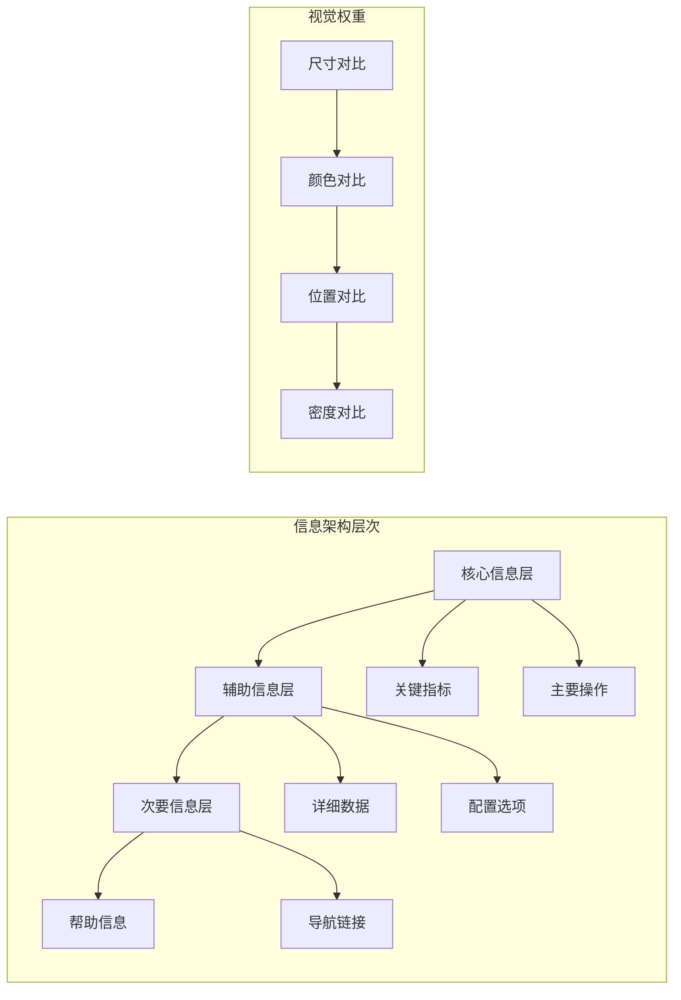

### 布局系统设计

项目采用灵活的网格系统和弹性布局：

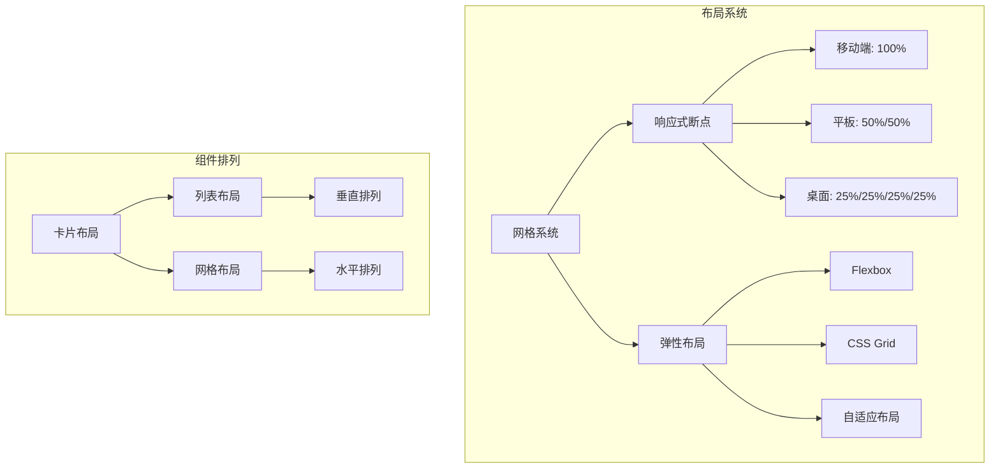

**图表来源**
- [deploy/stat_analyzer.html:257-276](file://deploy/stat_analyzer.html#L257-L276)
- [gtw/upload_demo.html:59-171](file://gtw/upload_demo.html#L59-L171)

## 详细组件分析

### 日志分析仪表板

#### 设计特点

日志分析仪表板是项目中最复杂的可视化界面，采用了现代化的设计理念：

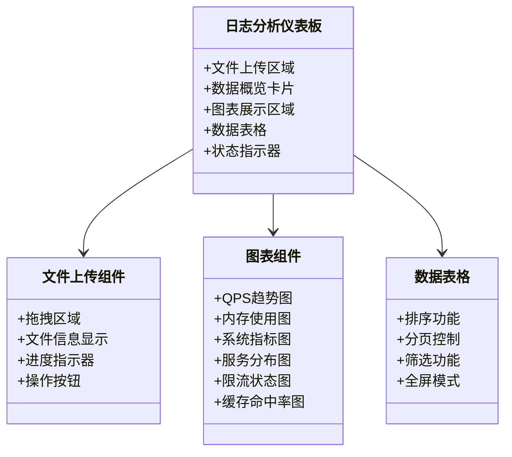

**图表来源**
- [deploy/stat_analyzer.html:206-486](file://deploy/stat_analyzer.html#L206-L486)

#### 交互设计

该仪表板实现了丰富的交互功能：

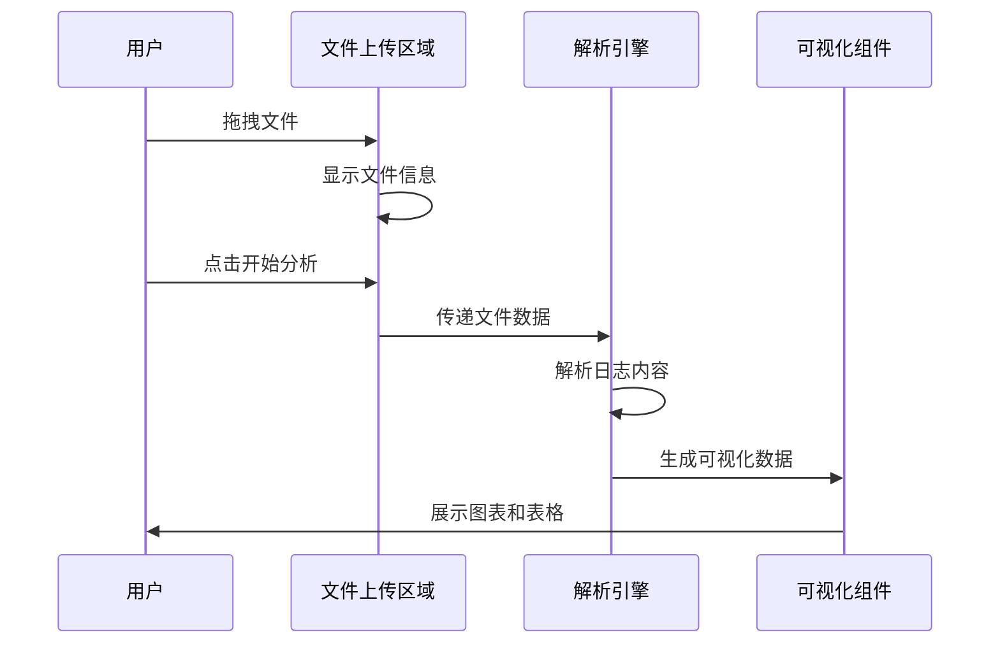

**图表来源**
- [deploy/stat_analyzer.html:774-800](file://deploy/stat_analyzer.html#L774-L800)

**章节来源**
- [deploy/stat_analyzer.html:196-533](file://deploy/stat_analyzer.html#L196-L533)

### 文件上传仪表板

#### 设计特色

文件上传仪表板专注于提供直观的文件管理体验：

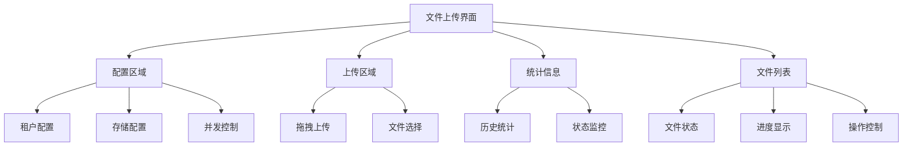

**图表来源**
- [gtw/upload_demo.html:58-202](file://gtw/upload_demo.html#L58-L202)

#### 并发管理机制

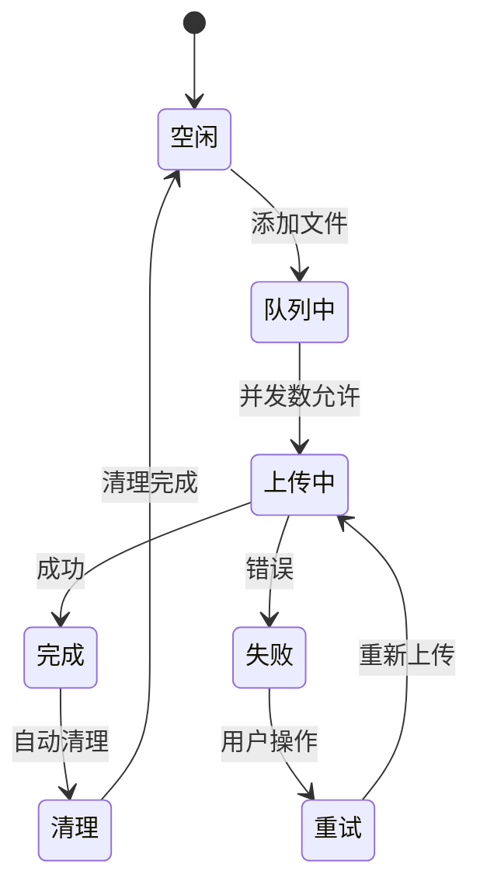

**图表来源**
- [gtw/upload_demo.html:336-438](file://gtw/upload_demo.html#L336-L438)

**章节来源**
- [gtw/upload_demo.html:1-790](file://gtw/upload_demo.html#L1-L790)

### SocketIO测试仪表板

#### 实时通信设计

SocketIO测试仪表板展示了实时通信界面的最佳实践：

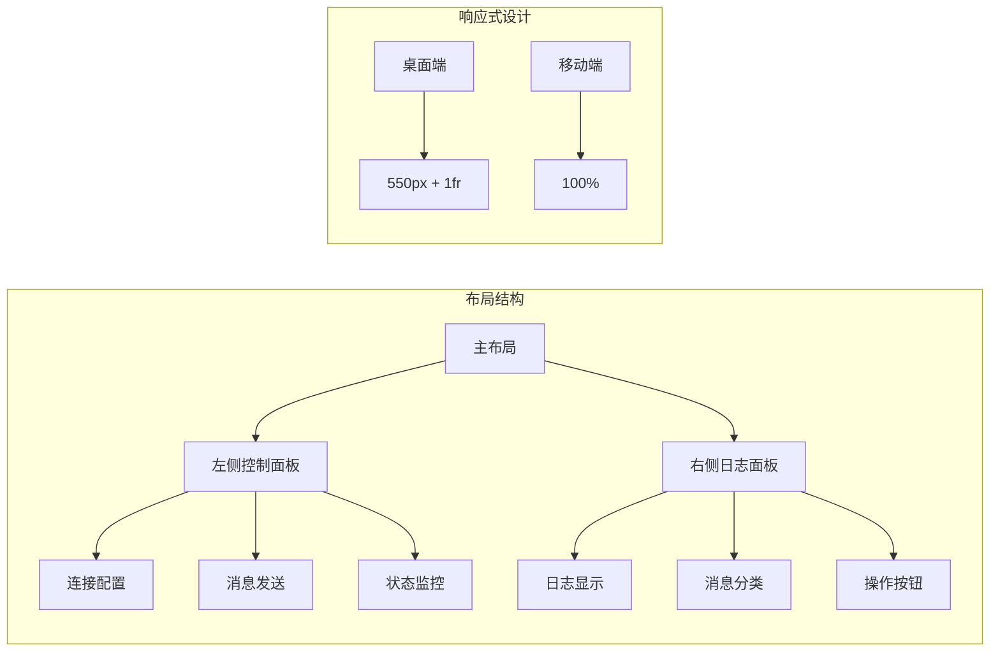

**图表来源**
- [common/socketiox/test-socketio.html:78-121](file://common/socketiox/test-socketio.html#L78-L121)

**章节来源**
- [common/socketiox/test-socketio.html:1-800](file://common/socketiox/test-socketio.html#L1-L800)

### HLS播放器仪表板

#### 媒体播放器设计

HLS播放器仪表板体现了多媒体应用的特殊需求：

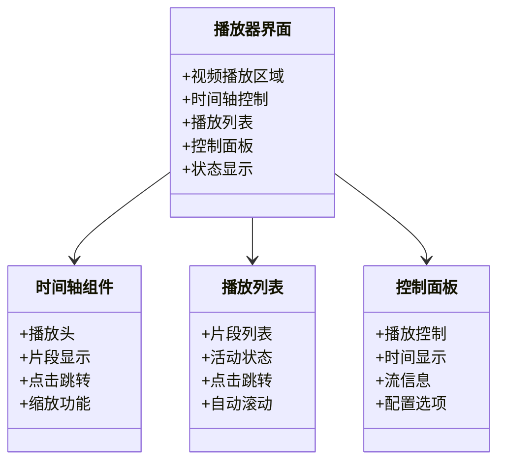

**图表来源**
- [app/lalhook/start.html:337-406](file://app/lalhook/start.html#L337-L406)

**章节来源**
- [app/lalhook/start.html:1-800](file://app/lalhook/start.html#L1-L800)

## 依赖关系分析

### 技术栈依赖

项目中的仪表板应用依赖于多种技术和库：

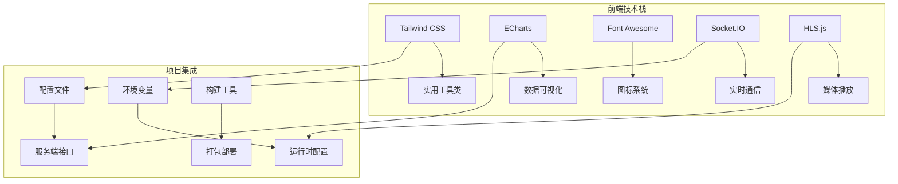

**图表来源**
- [deploy/stat_analyzer.html:8-10](file://deploy/stat_analyzer.html#L8-L10)
- [gtw/upload_demo.html:7-8](file://gtw/upload_demo.html#L7-L8)

### 配置文件集成

各仪表板通过配置文件与后端服务集成：

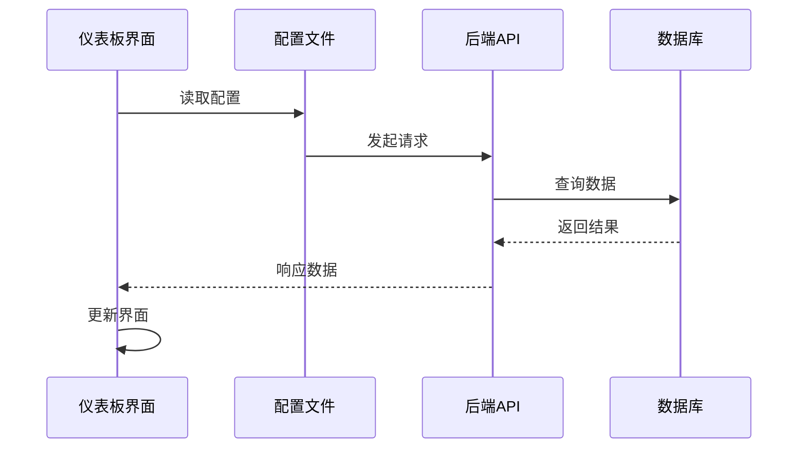

**图表来源**
- [app/trigger/etc/trigger.yaml:1-37](file://app/trigger/etc/trigger.yaml#L1-L37)
- [app/bridgegtw/etc/bridgegtw.yaml:1-40](file://app/bridgegtw/etc/bridgegtw.yaml#L1-L40)

**章节来源**
- [app/trigger/etc/trigger.yaml:1-37](file://app/trigger/etc/trigger.yaml#L1-L37)
- [app/bridgegtw/etc/bridgegtw.yaml:1-40](file://app/bridgegtw/etc/bridgegtw.yaml#L1-L40)

## 性能考虑

### 加载性能优化

项目中的仪表板应用采用了多种性能优化策略：

1. **懒加载机制**：图表和大数据集按需加载
2. **虚拟滚动**：大量数据项的高效渲染
3. **缓存策略**：重复数据的本地缓存
4. **资源压缩**：CSS和JavaScript的压缩优化

### 交互性能优化

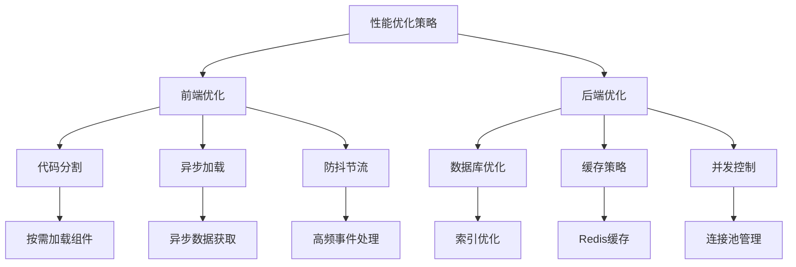

## 故障排除指南

### 常见问题诊断

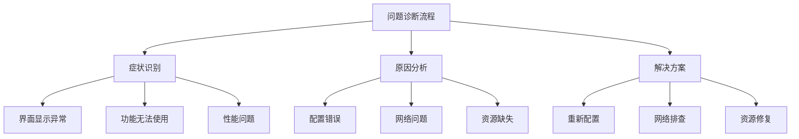

### 错误处理机制

各仪表板应用都实现了相应的错误处理机制：

**章节来源**
- [deploy/stat_analyzer.html:240-247](file://deploy/stat_analyzer.html#L240-L247)
- [gtw/upload_demo.html:417-427](file://gtw/upload_demo.html#L417-L427)

## 结论

zero-service 项目提供了完整的仪表板设计与布局解决方案，涵盖了从简单的文件上传到复杂的数据分析等多种场景。通过统一的设计系统、响应式的布局架构和丰富的交互功能，这些仪表板为用户提供了优秀的使用体验。

项目的核心优势在于：
1. **设计一致性**：统一的颜色系统和组件规范
2. **响应式设计**：适配各种设备和屏幕尺寸
3. **性能优化**：针对大数据量的优化处理
4. **可扩展性**：模块化的架构便于功能扩展

## 附录

### 设计规范速查

| 设计元素 | 规范值 | 用途 |
|---------|--------|------|
| 主色调 | #165DFF | 强调和行动按钮 |
| 辅助色 | #36CFC9 | 支持功能 |
| 成功色 | #52C41A | 正常状态 |
| 警告色 | #FAAD14 | 注意事项 |
| 危险色 | #FF4D4F | 错误状态 |
| 主字体 | Inter | 正文和界面文字 |
| 字号层级 | 12px-24px | 标题到正文 |
| 间距单位 | 4px网格 | 统一的布局间距 |

### 最佳实践建议

1. **信息架构**：始终以用户目标为导向组织信息
2. **视觉层次**：使用颜色、尺寸和间距建立清晰的层次关系
3. **交互一致性**：保持相同功能的操作方式一致
4. **性能优先**：在保证功能的前提下优化加载速度
5. **可访问性**：确保颜色对比度和键盘导航支持