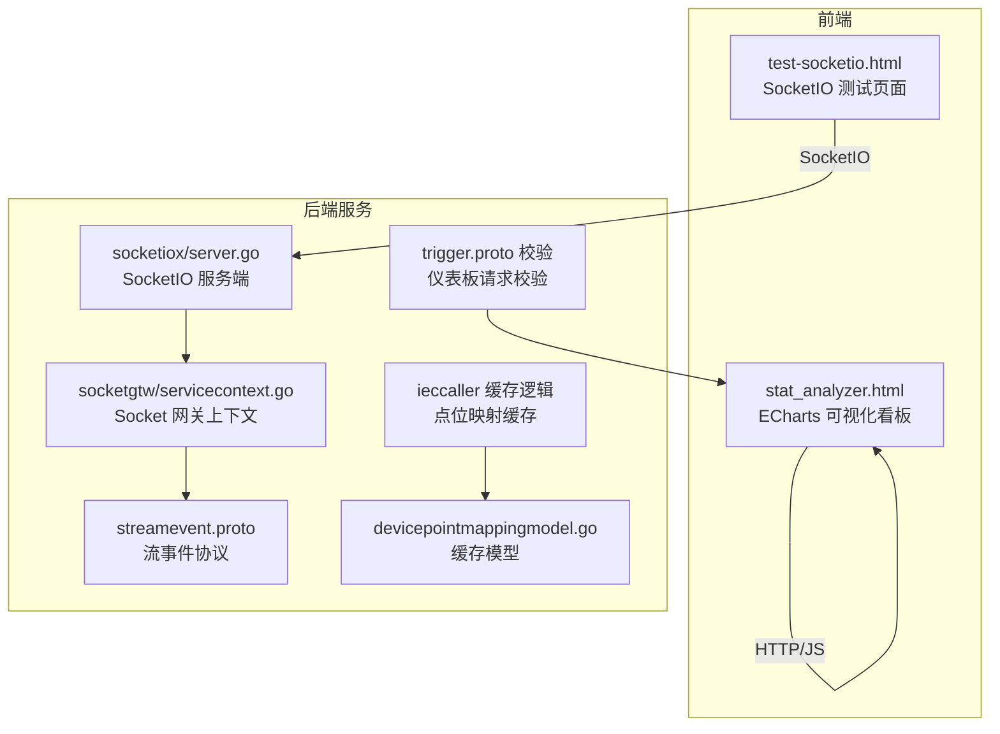
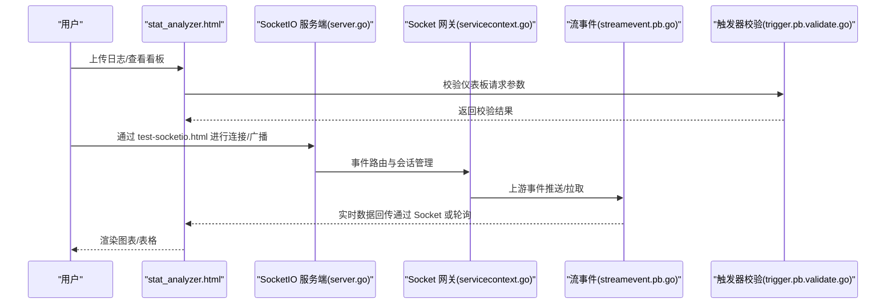
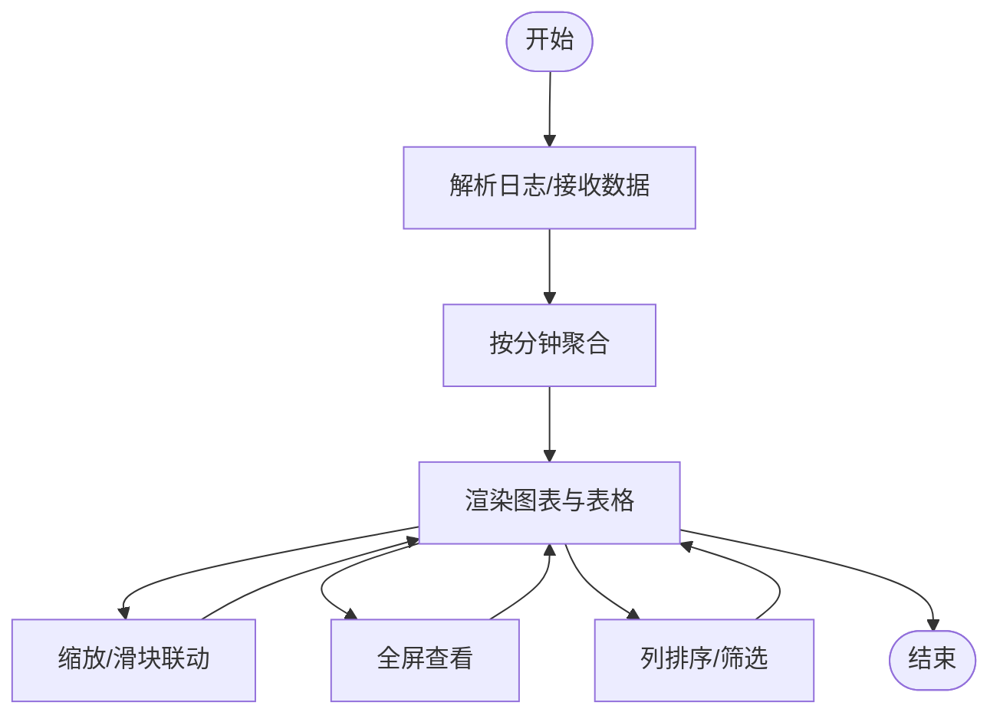
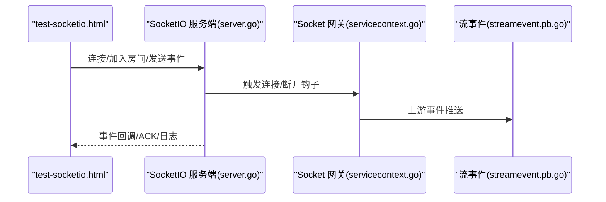
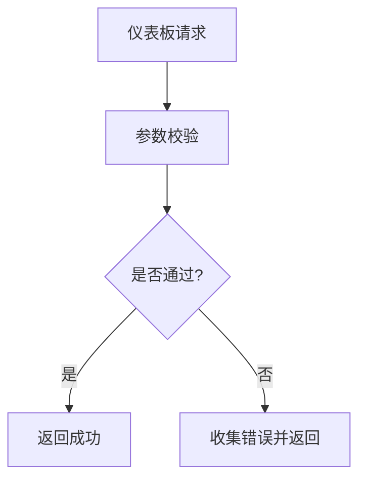
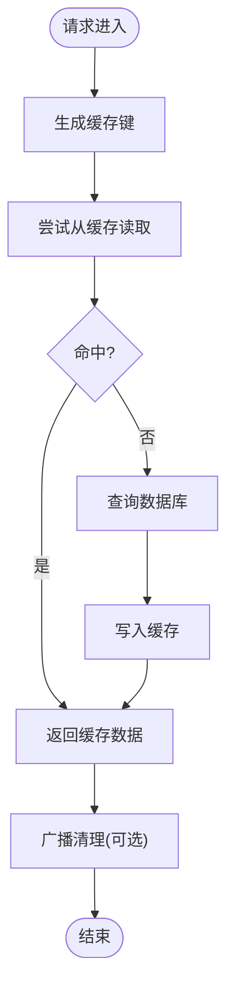
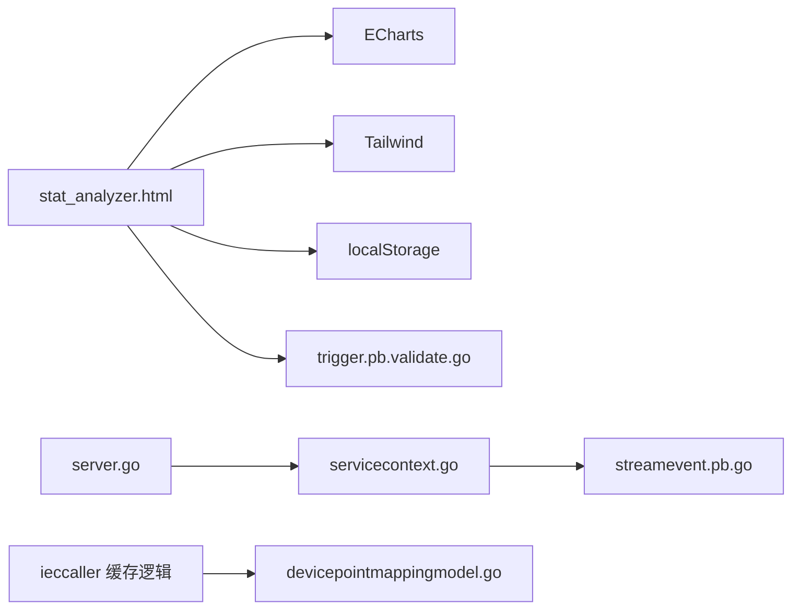

# 可视化与仪表板

<cite>
**本文档引用的文件**
- [deploy/stat_analyzer.html](file://deploy/stat_analyzer.html)
- [common/socketiox/test-socketio.html](file://common/socketiox/test-socketio.html)
- [common/socketiox/server.go](file://common/socketiox/server.go)
- [facade/streamevent/streamevent/streamevent.pb.go](file://facade/streamevent/streamevent/streamevent.pb.go)
- [socketapp/socketgtw/internal/svc/servicecontext.go](file://socketapp/socketgtw/internal/svc/servicecontext.go)
- [.trae/skills/zero-skills/references/rest-api-patterns.md](file://.trae/skills/zero-skills/references/rest-api-patterns.md)
- [app/trigger/trigger/trigger.pb.validate.go](file://app/trigger/trigger/trigger.pb.validate.go)
- [app/ieccaller/internal/logic/clearpointmappingcachelogic.go](file://app/ieccaller/internal/logic/clearpointmappingcachelogic.go)
- [app/ieccaller/ieccaller/ieccaller.pb.go](file://app/ieccaller/ieccaller/ieccaller.pb.go)
- [model/devicepointmappingmodel.go](file://model/devicepointmappingmodel.go)
</cite>

## 目录
1. [引言](#引言)
2. [项目结构](#项目结构)
3. [核心组件](#核心组件)
4. [架构总览](#架构总览)
5. [详细组件分析](#详细组件分析)
6. [依赖关系分析](#依赖关系分析)
7. [性能考虑](#性能考虑)
8. [故障排查指南](#故障排查指南)
9. [结论](#结论)
10. [附录](#附录)

## 引言
本指南面向 zero-service 的可视化与仪表板建设，围绕监控看板设计原则、实时图表与历史趋势分析、报表生成、仪表板定制化以及可视化性能优化等方面，结合仓库中的前端可视化页面与后端服务，给出可落地的设计与实现建议。目标是帮助读者快速理解并扩展现有可视化能力，构建稳定、易用、高性能的监控与运营仪表板。

## 项目结构
本项目中与可视化直接相关的核心文件集中在以下位置：
- 前端可视化页面：deploy/stat_analyzer.html（基于 ECharts 的 Go-Zero Stats 日志分析看板）
- SocketIO 测试与演示页面：common/socketiox/test-socketio.html
- SocketIO 服务端逻辑：common/socketiox/server.go
- Socket 网关与会话管理：socketapp/socketgtw/internal/svc/servicecontext.go
- Stream 事件协议定义：facade/streamevent/streamevent/streamevent.pb.go
- 触发器仪表板请求校验：app/trigger/trigger/trigger.pb.validate.go
- 缓存与点位映射示例：app/ieccaller/* 与 model/devicepointmappingmodel.go

**图表来源**
- [deploy/stat_analyzer.html:1-533](file://deploy/stat_analyzer.html#L1-L533)
- [common/socketiox/test-socketio.html:1-800](file://common/socketiox/test-socketio.html#L1-L800)
- [common/socketiox/server.go:643-676](file://common/socketiox/server.go#L643-L676)
- [socketapp/socketgtw/internal/svc/servicecontext.go:59-102](file://socketapp/socketgtw/internal/svc/servicecontext.go#L59-L102)
- [facade/streamevent/streamevent/streamevent.pb.go:435-470](file://facade/streamevent/streamevent/streamevent.pb.go#L435-L470)
- [app/trigger/trigger/trigger.pb.validate.go:11961-12004](file://app/trigger/trigger/trigger.pb.validate.go#L11961-L12004)
- [app/ieccaller/internal/logic/clearpointmappingcachelogic.go:26-60](file://app/ieccaller/internal/logic/clearpointmappingcachelogic.go#L26-L60)
- [model/devicepointmappingmodel.go:66-107](file://model/devicepointmappingmodel.go#L66-L107)

**章节来源**
- [deploy/stat_analyzer.html:1-533](file://deploy/stat_analyzer.html#L1-L533)
- [common/socketiox/test-socketio.html:1-800](file://common/socketiox/test-socketio.html#L1-L800)

## 核心组件
- 可视化看板（stat_analyzer.html）
  - 基于 ECharts 的折线图、柱状图、饼图等组合展示，覆盖 QPS、内存、CPU、限流状态、缓存命中率等关键指标。
  - 支持时间轴缩放、全屏查看、数据钻取、排序与分页等交互。
- SocketIO 测试页面（test-socketio.html）
  - 展示连接、加入房间、全局广播、事件监听等交互流程，便于验证实时通信链路。
- SocketIO 服务端（server.go）
  - 统一事件路由与处理，支持动态事件注册、异步处理与日志记录。
- Socket 网关上下文（servicecontext.go）
  - 将 Socket 会话与后端服务打通，建立房间、下发元数据、触发事件回调。
- 流事件协议（streamevent.pb.go）
  - 定义 Kafka 消息等事件载体，支撑跨服务事件传递。
- 触发器仪表板校验（trigger.pb.validate.go）
  - 对仪表板相关请求参数进行校验，保障数据一致性与安全性。
- 缓存与点位映射（ieccaller 与 devicepointmappingmodel.go）
  - 展示缓存键生成、缓存读取与广播清理的典型模式，为高并发场景提供参考。

**章节来源**
- [deploy/stat_analyzer.html:248-486](file://deploy/stat_analyzer.html#L248-L486)
- [common/socketiox/test-socketio.html:973-1430](file://common/socketiox/test-socketio.html#L973-L1430)
- [common/socketiox/server.go:643-676](file://common/socketiox/server.go#L643-L676)
- [socketapp/socketgtw/internal/svc/servicecontext.go:59-102](file://socketapp/socketgtw/internal/svc/servicecontext.go#L59-L102)
- [facade/streamevent/streamevent/streamevent.pb.go:435-470](file://facade/streamevent/streamevent/streamevent.pb.go#L435-L470)
- [app/trigger/trigger/trigger.pb.validate.go:11961-12004](file://app/trigger/trigger/trigger.pb.validate.go#L11961-L12004)
- [app/ieccaller/internal/logic/clearpointmappingcachelogic.go:26-60](file://app/ieccaller/internal/logic/clearpointmappingcachelogic.go#L26-L60)
- [model/devicepointmappingmodel.go:66-107](file://model/devicepointmappingmodel.go#L66-L107)

## 架构总览
下图展示了从数据采集、事件处理到可视化呈现的整体路径，以及与 SocketIO 实时通道的衔接。

**图表来源**
- [deploy/stat_analyzer.html:1329-1352](file://deploy/stat_analyzer.html#L1329-L1352)
- [common/socketiox/server.go:643-676](file://common/socketiox/server.go#L643-L676)
- [socketapp/socketgtw/internal/svc/servicecontext.go:59-102](file://socketapp/socketgtw/internal/svc/servicecontext.go#L59-L102)
- [facade/streamevent/streamevent/streamevent.pb.go:435-470](file://facade/streamevent/streamevent/streamevent.pb.go#L435-L470)
- [app/trigger/trigger/trigger.pb.validate.go:11961-12004](file://app/trigger/trigger/trigger.pb.validate.go#L11961-L12004)

## 详细组件分析

### 组件A：可视化看板（stat_analyzer.html）
- 设计原则
  - 信息架构：以“概览—趋势—详情”三层结构组织，先总后分；关键指标卡片化，突出重点。
  - 布局设计：卡片式网格布局，支持响应式与全屏查看；时间轴缩放与滑块联动。
  - 交互体验：支持排序、筛选、分页、全屏放大、刷新重绘、模态框查看等。
- 图表类型与使用场景
  - 折线图：QPS、内存、CPU、缓存命中率等连续趋势。
  - 柱状图：命中/未命中次数对比、服务分布。
  - 饼图：服务分布占比。
- 关键实现要点
  - 数据聚合：按分钟聚合，减少大数据量渲染压力。
  - 缩放策略：内置缩放与滑块缩放双通道，自适应初始缩放比例。
  - 全屏查看：复制原图表配置，优化标题、图例、网格与 Tooltip 样式。
  - 表格：支持列排序、分页、服务筛选、丢弃数高亮等。

**图表来源**
- [deploy/stat_analyzer.html:1329-1352](file://deploy/stat_analyzer.html#L1329-L1352)
- [deploy/stat_analyzer.html:2717-2968](file://deploy/stat_analyzer.html#L2717-L2968)
- [deploy/stat_analyzer.html:3039-3201](file://deploy/stat_analyzer.html#L3039-L3201)

**章节来源**
- [deploy/stat_analyzer.html:248-486](file://deploy/stat_analyzer.html#L248-L486)
- [deploy/stat_analyzer.html:1329-1352](file://deploy/stat_analyzer.html#L1329-L1352)
- [deploy/stat_analyzer.html:2717-2968](file://deploy/stat_analyzer.html#L2717-L2968)
- [deploy/stat_analyzer.html:3039-3201](file://deploy/stat_analyzer.html#L3039-L3201)

### 组件B：SocketIO 实时通道（test-socketio.html + server.go + servicecontext.go）
- 设计原则
  - 低耦合：前端测试页面独立运行，后端服务统一事件处理。
  - 可观测：连接状态、事件列表、日志面板清晰可见。
  - 可扩展：动态事件注册、房间管理、广播与 ACK 回调。
- 关键实现要点
  - 事件路由：统一 On 事件注册，区分系统事件与业务事件。
  - 会话管理：连接/断开钩子，房间加入/离开，元数据透传。
  - 安全与鉴权：在网关层注入令牌与上下文，便于后续鉴权扩展。

**图表来源**
- [common/socketiox/test-socketio.html:973-1430](file://common/socketiox/test-socketio.html#L973-L1430)
- [common/socketiox/server.go:643-676](file://common/socketiox/server.go#L643-L676)
- [socketapp/socketgtw/internal/svc/servicecontext.go:59-102](file://socketapp/socketgtw/internal/svc/servicecontext.go#L59-L102)
- [facade/streamevent/streamevent/streamevent.pb.go:435-470](file://facade/streamevent/streamevent/streamevent.pb.go#L435-L470)

**章节来源**
- [common/socketiox/test-socketio.html:1-800](file://common/socketiox/test-socketio.html#L1-L800)
- [common/socketiox/server.go:643-676](file://common/socketiox/server.go#L643-L676)
- [socketapp/socketgtw/internal/svc/servicecontext.go:59-102](file://socketapp/socketgtw/internal/svc/servicecontext.go#L59-L102)

### 组件C：仪表板请求校验（trigger.pb.validate.go）
- 设计原则
  - 参数约束：对分页、用户信息等关键字段进行校验，避免非法请求。
  - 可维护性：集中校验逻辑，便于扩展与统一错误返回。
- 关键实现要点
  - 嵌套消息校验：支持嵌套结构的 ValidateAll/Validate。
  - 错误聚合：将多个字段的校验错误合并返回，提升可观测性。

**图表来源**
- [app/trigger/trigger/trigger.pb.validate.go:3647-3703](file://app/trigger/trigger/trigger.pb.validate.go#L3647-L3703)
- [app/trigger/trigger/trigger.pb.validate.go:11961-12004](file://app/trigger/trigger/trigger.pb.validate.go#L11961-L12004)

**章节来源**
- [app/trigger/trigger/trigger.pb.validate.go:3647-3703](file://app/trigger/trigger/trigger.pb.validate.go#L3647-L3703)
- [app/trigger/trigger/trigger.pb.validate.go:11961-12004](file://app/trigger/trigger/trigger.pb.validate.go#L11961-L12004)

### 组件D：缓存与点位映射（ieccaller + devicepointmappingmodel.go）
- 设计原则
  - 高性能：热点数据本地缓存，降低数据库压力。
  - 一致性：广播清理缓存，保证多节点一致性。
- 关键实现要点
  - 缓存键生成：基于站点、COA、IOA 组合生成稳定键。
  - 缓存读取：带过期策略的 Take 回调，避免并发竞争。
  - 广播清理：跨节点广播清除，确保全局一致。

**图表来源**
- [model/devicepointmappingmodel.go:66-107](file://model/devicepointmappingmodel.go#L66-L107)
- [app/ieccaller/internal/logic/clearpointmappingcachelogic.go:26-60](file://app/ieccaller/internal/logic/clearpointmappingcachelogic.go#L26-L60)
- [app/ieccaller/ieccaller/ieccaller.pb.go:1152-1228](file://app/ieccaller/ieccaller/ieccaller.pb.go#L1152-L1228)

**章节来源**
- [model/devicepointmappingmodel.go:66-107](file://model/devicepointmappingmodel.go#L66-L107)
- [app/ieccaller/internal/logic/clearpointmappingcachelogic.go:26-60](file://app/ieccaller/internal/logic/clearpointmappingcachelogic.go#L26-L60)
- [app/ieccaller/ieccaller/ieccaller.pb.go:1152-1228](file://app/ieccaller/ieccaller/ieccaller.pb.go#L1152-L1228)

## 依赖关系分析
- 前端看板依赖
  - ECharts：图表渲染与交互。
  - Tailwind：UI 样式与响应式布局。
  - 本地存储：持久化事件监听器与用户偏好。
- 后端服务依赖
  - SocketIO 服务端：事件路由与处理。
  - Socket 网关：会话管理与房间控制。
  - 流事件协议：跨服务事件载体。
  - 触发器校验：仪表板请求参数校验。
- 缓存依赖
  - 点位映射缓存模型：统一缓存接口与键生成策略。

**图表来源**
- [deploy/stat_analyzer.html:1-142](file://deploy/stat_analyzer.html#L1-L142)
- [common/socketiox/server.go:643-676](file://common/socketiox/server.go#L643-L676)
- [socketapp/socketgtw/internal/svc/servicecontext.go:59-102](file://socketapp/socketgtw/internal/svc/servicecontext.go#L59-L102)
- [facade/streamevent/streamevent/streamevent.pb.go:435-470](file://facade/streamevent/streamevent/streamevent.pb.go#L435-L470)
- [app/trigger/trigger/trigger.pb.validate.go:11961-12004](file://app/trigger/trigger/trigger.pb.validate.go#L11961-L12004)
- [app/ieccaller/internal/logic/clearpointmappingcachelogic.go:26-60](file://app/ieccaller/internal/logic/clearpointmappingcachelogic.go#L26-L60)
- [model/devicepointmappingmodel.go:66-107](file://model/devicepointmappingmodel.go#L66-L107)

**章节来源**
- [deploy/stat_analyzer.html:1-142](file://deploy/stat_analyzer.html#L1-L142)
- [common/socketiox/server.go:643-676](file://common/socketiox/server.go#L643-L676)
- [socketapp/socketgtw/internal/svc/servicecontext.go:59-102](file://socketapp/socketgtw/internal/svc/servicecontext.go#L59-L102)

## 性能考虑
- 大数据量渲染优化
  - 数据聚合：按分钟聚合，减少点数与重绘频率。
  - 自适应标签间隔：根据时间跨度动态调整 X 轴标签密度。
  - 惰性渲染：表格分页与延迟渲染，避免一次性插入大量 DOM。
- 图表刷新策略
  - 内置缩放与滑块联动，避免全量重绘。
  - 全屏查看采用深拷贝配置，避免污染原图表实例。
- 缓存机制
  - 本地缓存 + 广播清理，降低数据库与上游依赖压力。
  - 缓存键稳定且可预测，便于定位与运维。
- 交互性能
  - 窗口尺寸变化采用节流，避免频繁 resize。
  - 表格排序与分页使用 requestAnimationFrame 优化动画帧。

**章节来源**
- [deploy/stat_analyzer.html:2988-3014](file://deploy/stat_analyzer.html#L2988-L3014)
- [deploy/stat_analyzer.html:3459-3466](file://deploy/stat_analyzer.html#L3459-L3466)
- [deploy/stat_analyzer.html:3245-3327](file://deploy/stat_analyzer.html#L3245-L3327)
- [app/ieccaller/internal/logic/clearpointmappingcachelogic.go:26-60](file://app/ieccaller/internal/logic/clearpointmappingcachelogic.go#L26-L60)
- [model/devicepointmappingmodel.go:66-107](file://model/devicepointmappingmodel.go#L66-L107)

## 故障排查指南
- 可视化看板常见问题
  - 图表空白或渲染异常：检查数据聚合与时间格式，确认 ECharts 实例存在。
  - 缩放失效：确认 dataZoom 配置与初始比例计算。
  - 全屏查看失败：检查模态框事件绑定与实例销毁。
- SocketIO 通道常见问题
  - 无法连接：检查服务端路由与握手流程，确认事件处理器注册。
  - 房间加入失败：核对房间名与会话元数据下发。
  - 事件未触发：确认事件名与 payload 结构，查看日志输出。
- 仪表板请求校验
  - 参数校验失败：检查分页与用户信息字段，关注嵌套消息校验。
- 缓存一致性
  - 缓存未生效：检查键生成规则与缓存读取逻辑。
  - 多节点不一致：确认广播清理是否成功执行。

**章节来源**
- [deploy/stat_analyzer.html:3039-3201](file://deploy/stat_analyzer.html#L3039-L3201)
- [common/socketiox/server.go:643-676](file://common/socketiox/server.go#L643-L676)
- [socketapp/socketgtw/internal/svc/servicecontext.go:59-102](file://socketapp/socketgtw/internal/svc/servicecontext.go#L59-L102)
- [app/trigger/trigger/trigger.pb.validate.go:3647-3703](file://app/trigger/trigger/trigger.pb.validate.go#L3647-L3703)
- [app/ieccaller/internal/logic/clearpointmappingcachelogic.go:26-60](file://app/ieccaller/internal/logic/clearpointmappingcachelogic.go#L26-L60)

## 结论
本指南基于 zero-service 中现有的可视化与实时通信组件，总结了监控看板的设计原则、图表类型与交互策略，并提供了缓存与一致性、请求校验、性能优化等方面的实践建议。读者可在此基础上扩展更多指标与图表类型，完善报表与权限体系，持续提升可观测性与用户体验。

## 附录
- 相关最佳实践参考
  - 中间件与服务上下文模式：统一鉴权、日志与依赖注入。
  - 分页模式：数据库分页与总数统计，保障大表性能。
- 建议的后续工作
  - 增加更多图表类型（热力图、散点图）与交互维度。
  - 引入报表模板与定时导出能力（PDF/Excel）。
  - 完善主题与权限控制，支持多租户与个性化设置。

**章节来源**
- [.trae/skills/zero-skills/references/rest-api-patterns.md:197-419](file://.trae/skills/zero-skills/references/rest-api-patterns.md#L197-L419)
- [.trae/skills/zero-skills/references/rest-api-patterns.md:382-419](file://.trae/skills/zero-skills/references/rest-api-patterns.md#L382-L419)
- [.trae/skills/zero-skills/references/database-patterns.md:246-269](file://.trae/skills/zero-skills/references/database-patterns.md#L246-L269)