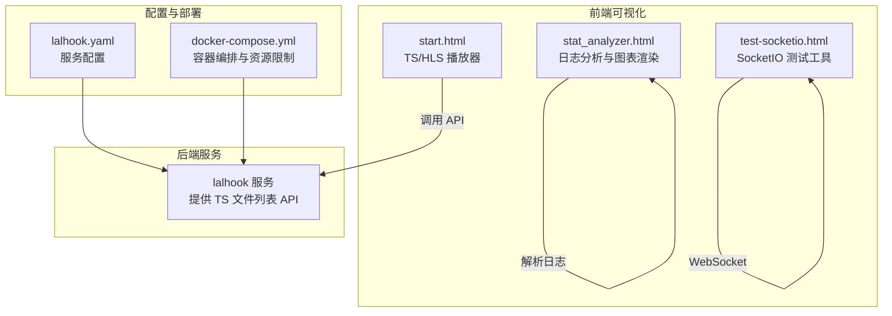
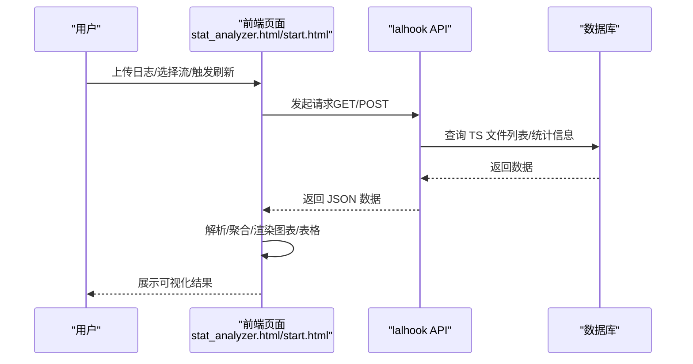
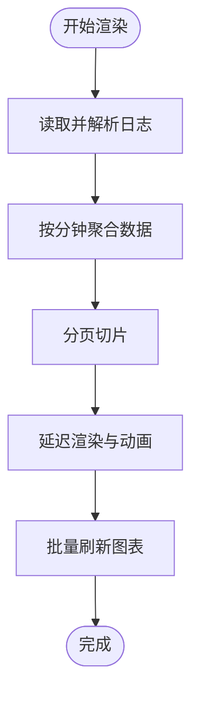
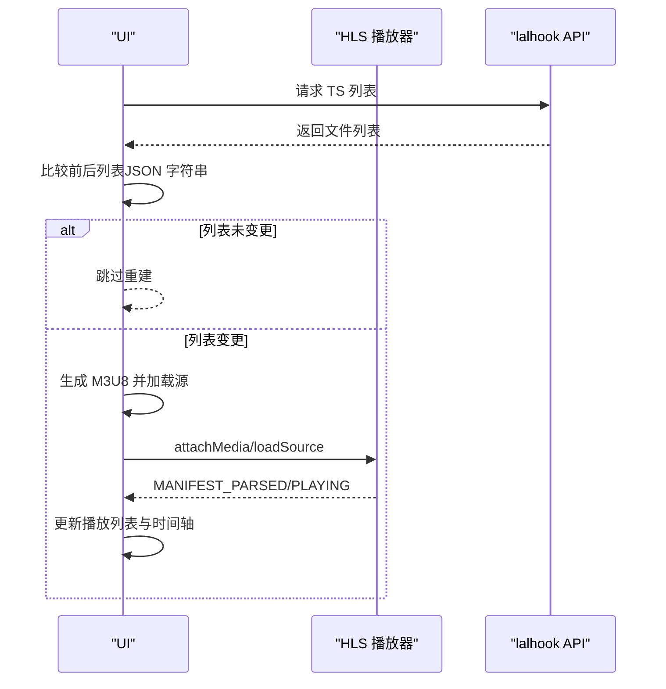
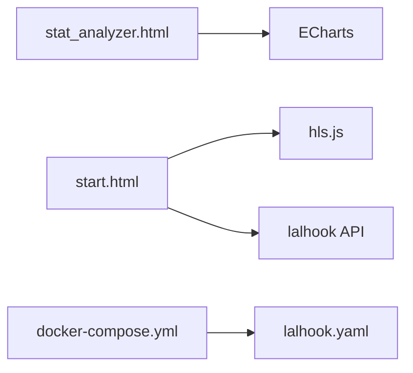

# 可视化性能优化

<cite>
**本文档引用的文件**
- [deploy/stat_analyzer.html](file://deploy/stat_analyzer.html)
- [app/lalhook/start.html](file://app/lalhook/start.html)
- [common/socketiox/test-socketio.html](file://common/socketiox/test-socketio.html)
- [app/lalhook/etc/lalhook.yaml](file://app/lalhook/etc/lalhook.yaml)
- [deploy/docker-compose.yml](file://deploy/docker-compose.yml)
</cite>

## 目录
1. [简介](#简介)
2. [项目结构](#项目结构)
3. [核心组件](#核心组件)
4. [架构总览](#架构总览)
5. [详细组件分析](#详细组件分析)
6. [依赖关系分析](#依赖关系分析)
7. [性能考量](#性能考量)
8. [故障排查指南](#故障排查指南)
9. [结论](#结论)
10. [附录](#附录)

## 简介
本指南聚焦于 zero-service 中的可视化性能优化实践，围绕大数据量渲染优化（虚拟滚动、数据分页、增量加载）、图表刷新策略（更新频率控制、批量更新、智能缓存）、缓存机制（数据缓存、图表缓存、浏览器缓存）、内存管理（对象池、垃圾回收、内存泄漏预防）、性能监控（加载时间统计、资源使用监控、性能瓶颈分析）等维度，结合项目中的 HTML 模板与配置文件，给出可落地的优化方案与最佳实践。

## 项目结构
本项目包含多个可视化与数据采集场景：
- 日志分析与可视化：通过前端 HTML 页面解析 Go-Zero 微服务 stat 日志，实时渲染内存、QPS、限流、缓存命中率等指标图表。
- TS/HLS 播放器：基于 hls.js 的播放器，支持时间轴、播放列表、自动刷新与错误恢复。
- SocketIO 测试工具：用于 WebSocket 通信测试与日志展示，具备响应式布局与动画优化。
- 配置与部署：通过 YAML 配置与 docker-compose 控制服务运行与资源限制。

**图表来源**
- [deploy/stat_analyzer.html](file://deploy/stat_analyzer.html)
- [app/lalhook/start.html](file://app/lalhook/start.html)
- [common/socketiox/test-socketio.html](file://common/socketiox/test-socketio.html)
- [app/lalhook/etc/lalhook.yaml](file://app/lalhook/etc/lalhook.yaml)
- [deploy/docker-compose.yml](file://deploy/docker-compose.yml)

**章节来源**
- [deploy/stat_analyzer.html](file://deploy/stat_analyzer.html)
- [app/lalhook/start.html](file://app/lalhook/start.html)
- [common/socketiox/test-socketio.html](file://common/socketiox/test-socketio.html)
- [app/lalhook/etc/lalhook.yaml](file://app/lalhook/etc/lalhook.yaml)
- [deploy/docker-compose.yml](file://deploy/docker-compose.yml)

## 核心组件
- 日志分析与图表渲染（stat_analyzer.html）
  - 支持拖拽上传、进度条与状态提示、分页表格、服务筛选、排序与全屏图表。
  - ECharts 图表：内存趋势、QPS 趋势、系统指标、服务分布、限流状态、缓存命中率。
  - 数据聚合：按分钟聚合，自适应标签间隔与初始缩放，减少渲染压力。
- TS/HLS 播放器（start.html）
  - 基于 hls.js 的播放器，支持自动刷新、错误恢复、时间轴与播放列表联动。
  - 通过 API 获取 TS 片段列表，拼接 M3U8 并按时间戳排序，避免重复重建。
- SocketIO 测试工具（test-socketio.html）
  - 响应式布局、日志条目动画、状态指示器、表格样式优化，提升交互体验。
- 服务配置与部署（lalhook.yaml、docker-compose.yml）
  - lalhook.yaml 定义服务端口、超时与数据库连接；docker-compose 限制内存并声明依赖。

**章节来源**
- [deploy/stat_analyzer.html](file://deploy/stat_analyzer.html)
- [app/lalhook/start.html](file://app/lalhook/start.html)
- [common/socketiox/test-socketio.html](file://common/socketiox/test-socketio.html)
- [app/lalhook/etc/lalhook.yaml](file://app/lalhook/etc/lalhook.yaml)
- [deploy/docker-compose.yml](file://deploy/docker-compose.yml)

## 架构总览
前端通过 AJAX 与 WebSocket 与后端交互，后端提供 API 与数据源，前端负责数据解析、聚合与可视化渲染。

**图表来源**
- [deploy/stat_analyzer.html](file://deploy/stat_analyzer.html)
- [app/lalhook/start.html](file://app/lalhook/start.html)
- [app/lalhook/etc/lalhook.yaml](file://app/lalhook/etc/lalhook.yaml)

## 详细组件分析

### 组件A：日志分析与图表渲染（大数据量渲染优化）
- 虚拟滚动与分页
  - 表格采用分页渲染，避免一次性渲染大量行节点，降低 DOM 压力与首屏时间。
  - 分页控件支持 20/50/100 条/页切换，配合“当前范围”与“总条数”提示，提升可感知性能。
- 增量加载与懒渲染
  - 表格渲染前添加“加载中”遮罩与 300ms 延迟，保证动画与滚动位置恢复的稳定性。
  - 使用 requestAnimationFrame 逐步显示行，减少主线程阻塞。
- 图表刷新策略
  - 窗口 resize 采用防抖（setTimeout），批量触发图表 resize。
  - 图表操作（刷新/全屏）通过事件委托与深拷贝配置，避免重复实例化与内存泄漏。
  - 自适应标签间隔与初始缩放，根据数据长度与时间跨度动态调整，减少密集标签渲染。
- 智能缓存与数据聚合
  - 按分钟聚合日志，减少数据点数量，提升图表渲染效率。
  - 对缓存命中率与限流状态进行聚合与累加，避免重复计算。
- 内存管理
  - 渲染前销毁旧图表实例，避免内存泄漏。
  - 全屏图表在关闭时显式 dispose，移除 resize 监听。

**图表来源**
- [deploy/stat_analyzer.html](file://deploy/stat_analyzer.html)

**章节来源**
- [deploy/stat_analyzer.html](file://deploy/stat_analyzer.html)

### 组件B：TS/HLS 播放器（播放列表与时间轴联动）
- 增量更新与去重
  - 通过 JSON 字符串比较前后 TS 列表，仅在变更时重建 M3U8 与播放器，避免重复初始化。
  - 播放列表与时间轴片段按需更新宽度与 title，减少 DOM 操作。
- 自动刷新与错误恢复
  - 支持自动刷新开关，定时拉取最新 TS 列表；播放过程中跳转时暂停定时刷新，避免冲突。
  - HLS 错误分类处理：网络错误销毁并重建实例，媒体错误尝试 recover，其他致命错误重新加载源。
- 播放列表与时间轴联动
  - 使用 requestAnimationFrame 确保 DOM 更新后再滚动到活动项，避免滚动冲突。
  - 滚动停止后重置 isDragging 标记，避免自动滚动干扰用户操作。

**图表来源**
- [app/lalhook/start.html](file://app/lalhook/start.html)

**章节来源**
- [app/lalhook/start.html](file://app/lalhook/start.html)

### 组件C：SocketIO 测试工具（交互体验优化）
- 响应式布局与动画
  - 使用 CSS Grid 与粘性定位，提升在不同设备上的可用性。
  - 日志条目与表格行采用过渡动画与 hover 效果，增强反馈。
- 状态指示与日志分类
  - 通过状态类名区分系统、连接、断开、消息、接收、错误等日志类型，便于快速定位问题。

**章节来源**
- [common/socketiox/test-socketio.html](file://common/socketiox/test-socketio.html)

## 依赖关系分析
- 前端依赖
  - ECharts：图表渲染与交互（缩放、全屏、tooltip、legend、grid）。
  - hls.js：HLS 播放与错误恢复。
  - TailwindCSS：样式与响应式布局。
- 后端依赖
  - lalhook：提供 TS 文件列表 API，支持时间范围查询与排序。
  - docker-compose：统一编排与资源限制（mem_limit）。

**图表来源**
- [deploy/stat_analyzer.html](file://deploy/stat_analyzer.html)
- [app/lalhook/start.html](file://app/lalhook/start.html)
- [app/lalhook/etc/lalhook.yaml](file://app/lalhook/etc/lalhook.yaml)
- [deploy/docker-compose.yml](file://deploy/docker-compose.yml)

**章节来源**
- [deploy/stat_analyzer.html](file://deploy/stat_analyzer.html)
- [app/lalhook/start.html](file://app/lalhook/start.html)
- [app/lalhook/etc/lalhook.yaml](file://app/lalhook/etc/lalhook.yaml)
- [deploy/docker-compose.yml](file://deploy/docker-compose.yml)

## 性能考量
- 渲染优化
  - 分页与懒渲染：减少一次性 DOM 节点数量，降低主线程阻塞。
  - 防抖与批处理：窗口 resize 与图表刷新合并触发，避免频繁重绘。
  - 自适应标签：根据数据规模与时间跨度动态调整标签密度，避免拥挤渲染。
- 缓存策略
  - 数据缓存：按分钟聚合日志，减少图表数据点；缓存命中率与限流状态按时间聚合。
  - 图表缓存：全屏图表深拷贝配置，避免引用污染；关闭时及时释放。
  - 浏览器缓存：合理设置静态资源缓存策略（由服务器配置决定）。
- 内存管理
  - 图表实例销毁：渲染前销毁旧实例，关闭全屏图表时 dispose。
  - 播放器生命周期：错误恢复时销毁并重建，避免悬挂实例。
- 监控与分析
  - 加载时间统计：上传进度条与加载状态提示，结合浏览器开发者工具分析首屏与交互延迟。
  - 资源使用监控：docker-compose 设置 mem_limit，观察容器内存使用情况。
  - 性能瓶颈分析：利用浏览器性能面板（如 FPS、内存、网络、JS CPU）定位热点。

[本节为通用指导，无需特定文件引用]

## 故障排查指南
- 图表不刷新或显示异常
  - 检查窗口 resize 防抖是否生效，确认批量刷新逻辑。
  - 确认全屏图表关闭时是否 dispose，避免残留实例影响后续渲染。
- 播放器无法播放或频繁报错
  - 确认 TS 列表是否变更，避免重复重建播放器。
  - 检查自动刷新与跳转标记（isSeeking）是否冲突。
  - 分类处理 HLS 错误类型，必要时销毁并重建实例。
- 表格卡顿或滚动异常
  - 检查分页与懒渲染逻辑，确认 requestAnimationFrame 使用是否正确。
  - 避免在滚动过程中频繁更新 DOM，使用 isDragging 标记控制自动滚动。

**章节来源**
- [deploy/stat_analyzer.html](file://deploy/stat_analyzer.html)
- [app/lalhook/start.html](file://app/lalhook/start.html)

## 结论
通过分页与懒渲染、数据聚合与自适应标签、批量刷新与实例管理等策略，zero-service 的可视化组件在大数据量场景下实现了稳定高效的渲染表现。结合合理的缓存与内存管理、以及容器层面的资源限制，能够进一步提升系统的可靠性与用户体验。建议在实际部署中持续关注浏览器性能面板与容器资源使用情况，针对具体瓶颈进行迭代优化。

[本节为总结性内容，无需特定文件引用]

## 附录
- 相关配置参考
  - lalhook 服务配置：端口、超时、数据库连接等。
  - docker-compose 资源限制：mem_limit 等，确保容器稳定运行。

**章节来源**
- [app/lalhook/etc/lalhook.yaml](file://app/lalhook/etc/lalhook.yaml)
- [deploy/docker-compose.yml](file://deploy/docker-compose.yml)