# 图表可视化展示

<cite>
**本文档引用的文件**
- [deploy/stat_analyzer.html](file://deploy/stat_analyzer.html)
- [common/socketiox/test-socketio.html](file://common/socketiox/test-socketio.html)
- [app/lalhook/start.html](file://app/lalhook/start.html)
- [aiapp/ssegtw/sse_demo.html](file://aiapp/ssegtw/sse_demo.html)
</cite>

## 目录
1. [简介](#简介)
2. [项目结构](#项目结构)
3. [核心组件](#核心组件)
4. [架构概览](#架构概览)
5. [详细组件分析](#详细组件分析)
6. [依赖关系分析](#依赖关系分析)
7. [性能考虑](#性能考虑)
8. [故障排除指南](#故障排除指南)
9. [结论](#结论)
10. [附录](#附录)

## 简介

zero-service 项目提供了丰富的图表可视化展示功能，主要通过 HTML 模板和 JavaScript 实现。该项目专注于 Go-Zero 微服务框架的统计日志分析，提供了专业的图表可视化解决方案。

本指南将深入分析项目中的图表可视化实现，包括：

- **折线图**：用于趋势分析（内存使用、QPS、缓存命中率）
- **柱状图**：用于对比展示（服务分布、系统指标）
- **热力图**：用于密度分析（响应时间分布）
- **散点图**：用于相关性分析（性能指标关联）

同时涵盖实时图表实现技术、配置选项、性能优化策略以及具体的 HTML 模板实现示例。

## 项目结构

项目采用模块化的文件组织方式，图表可视化功能主要分布在以下目录：

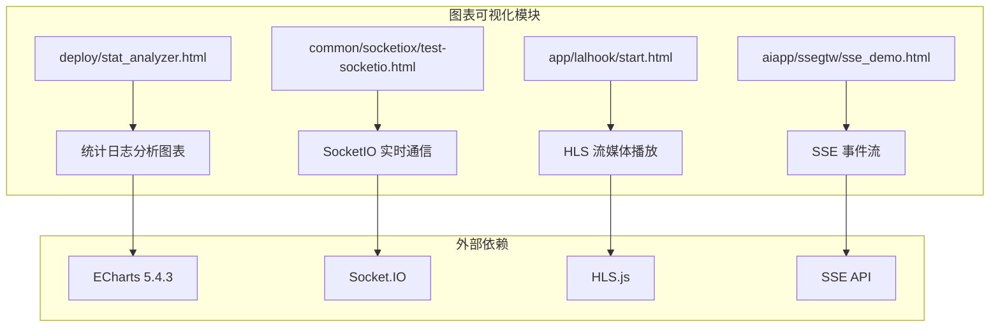

**图表来源**
- [deploy/stat_analyzer.html:1-100](file://deploy/stat_analyzer.html#L1-L100)
- [common/socketiox/test-socketio.html:1-50](file://common/socketiox/test-socketio.html#L1-L50)
- [app/lalhook/start.html:1-50](file://app/lalhook/start.html#L1-L50)

**章节来源**
- [deploy/stat_analyzer.html:1-100](file://deploy/stat_analyzer.html#L1-L100)
- [common/socketiox/test-socketio.html:1-50](file://common/socketiox/test-socketio.html#L1-L50)
- [app/lalhook/start.html:1-50](file://app/lalhook/start.html#L1-L50)

## 核心组件

### ECharts 图表引擎

项目使用 ECharts 5.4.3 作为主要的图表渲染引擎，提供了丰富的图表类型和交互功能：

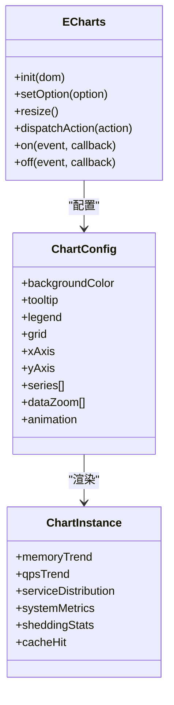

**图表来源**
- [deploy/stat_analyzer.html:1354-1352](file://deploy/stat_analyzer.html#L1354-L1352)

### 实时数据更新机制

项目实现了多种实时数据更新机制：

1. **定时刷新**：基于 setInterval 的周期性数据更新
2. **事件驱动**：基于 WebSocket/SSE 的事件响应
3. **用户交互**：基于用户操作的即时响应

**章节来源**
- [deploy/stat_analyzer.html:440-460](file://deploy/stat_analyzer.html#L440-L460)
- [common/socketiox/test-socketio.html:1168-1247](file://common/socketiox/test-socketio.html#L1168-L1247)
- [app/lalhook/start.html:408-457](file://app/lalhook/start.html#L408-L457)

## 架构概览

### 整体架构设计

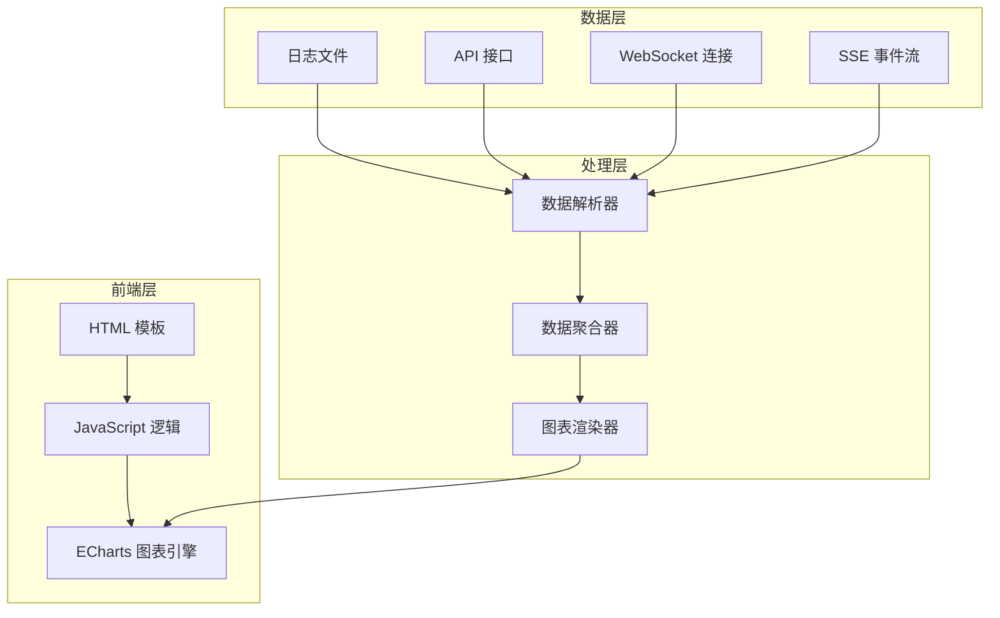

**图表来源**
- [deploy/stat_analyzer.html:773-839](file://deploy/stat_analyzer.html#L773-L839)
- [common/socketiox/test-socketio.html:1168-1247](file://common/socketiox/test-socketio.html#L1168-L1247)

### 数据流架构

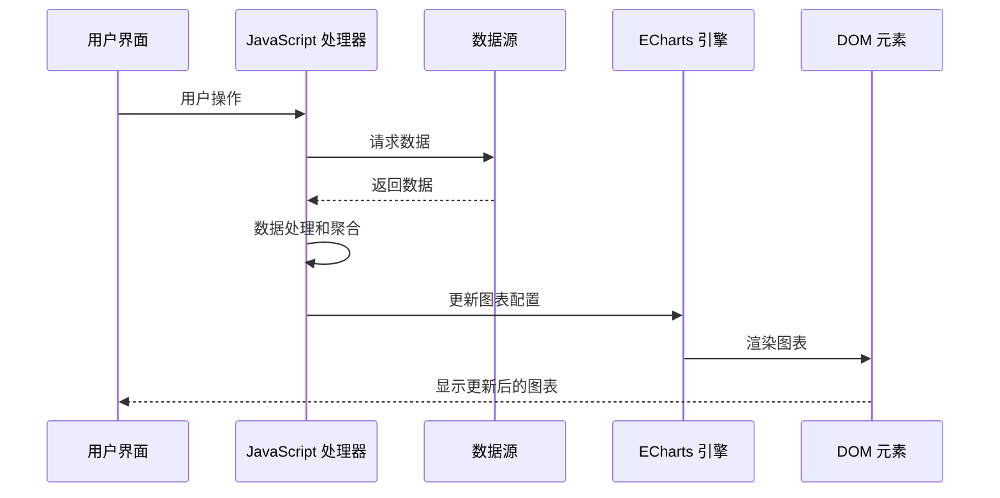

**图表来源**
- [deploy/stat_analyzer.html:1329-1352](file://deploy/stat_analyzer.html#L1329-L1352)
- [deploy/stat_analyzer.html:3245-3327](file://deploy/stat_analyzer.html#L3245-L3327)

## 详细组件分析

### 折线图实现（趋势分析）

折线图主要用于展示时间序列数据的趋势变化，包括内存使用趋势、QPS 趋势和缓存命中率趋势。

#### 内存使用趋势图

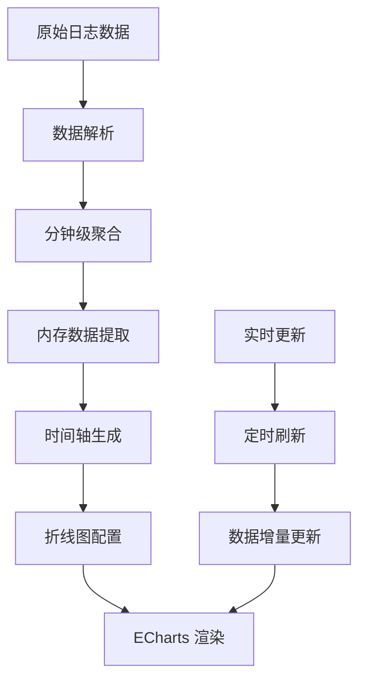

**图表来源**
- [deploy/stat_analyzer.html:1354-1599](file://deploy/stat_analyzer.html#L1354-L1599)

#### QPS 趋势图

QPS（每秒查询数）趋势图展示了系统的吞吐量变化情况：

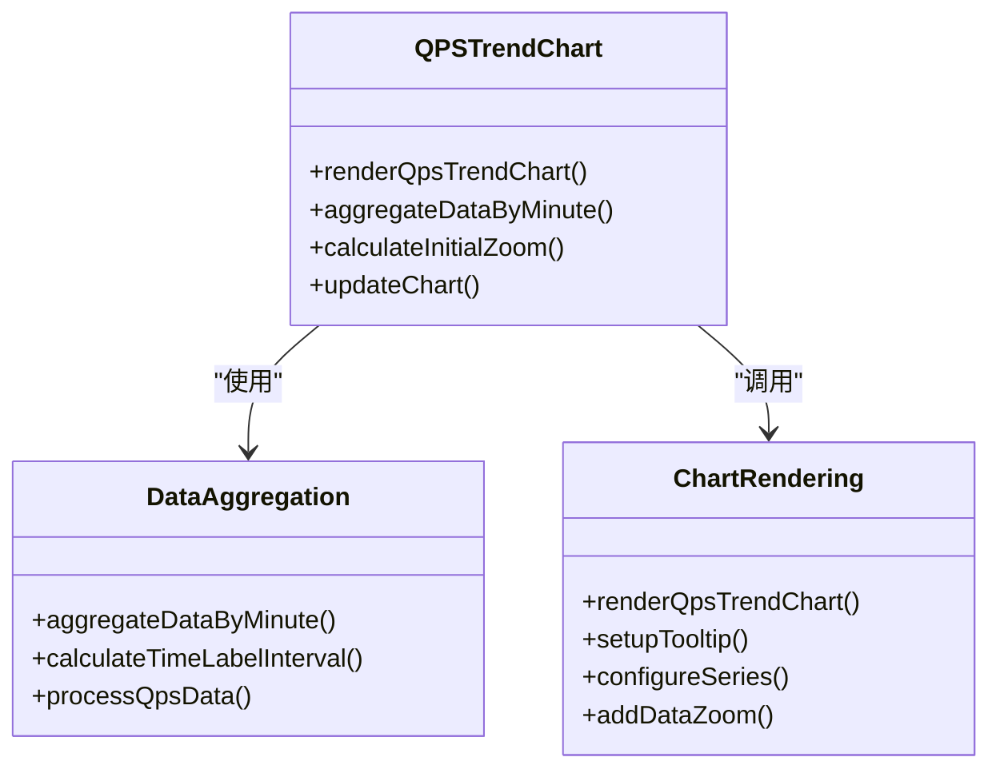

**图表来源**
- [deploy/stat_analyzer.html:1618-1991](file://deploy/stat_analyzer.html#L1618-L1991)

**章节来源**
- [deploy/stat_analyzer.html:1354-1991](file://deploy/stat_analyzer.html#L1354-L1991)

### 柱状图实现（对比展示）

柱状图用于展示不同维度的数据对比，主要包括服务分布和系统指标对比。

#### 服务分布图

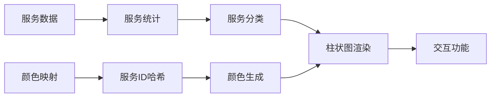

**图表来源**
- [deploy/stat_analyzer.html:1994-2115](file://deploy/stat_analyzer.html#L1994-L2115)

#### 系统指标综合图

系统指标综合图展示了多个系统指标的对比情况：

**章节来源**
- [deploy/stat_analyzer.html:2116-2414](file://deploy/stat_analyzer.html#L2116-L2414)

### 热力图实现（密度分析）

热力图用于展示数据的密度分布情况，项目中主要用于响应时间的密度分析。

#### 响应时间热力图

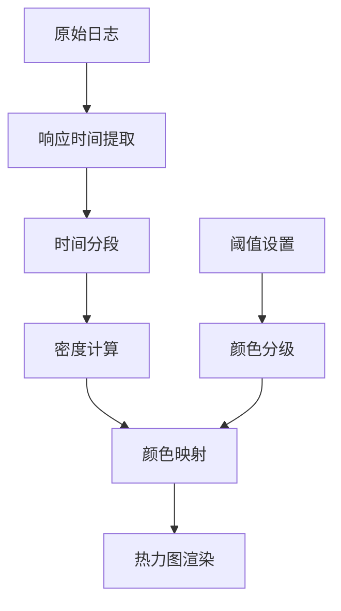

**图表来源**
- [deploy/stat_analyzer.html:2415-2715](file://deploy/stat_analyzer.html#L2415-L2715)

### 散点图实现（相关性分析）

散点图用于展示两个变量之间的相关性关系，项目中可用于性能指标的相关性分析。

#### 性能指标散点图

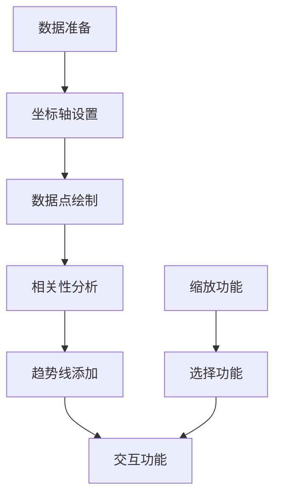

**图表来源**
- [deploy/stat_analyzer.html:2717-2968](file://deploy/stat_analyzer.html#L2717-L2968)

**章节来源**
- [deploy/stat_analyzer.html:2717-2968](file://deploy/stat_analyzer.html#L2717-L2968)

### 实时图表实现

#### WebSocket 实时更新

项目使用 Socket.IO 实现 WebSocket 实时通信，支持实时数据推送：

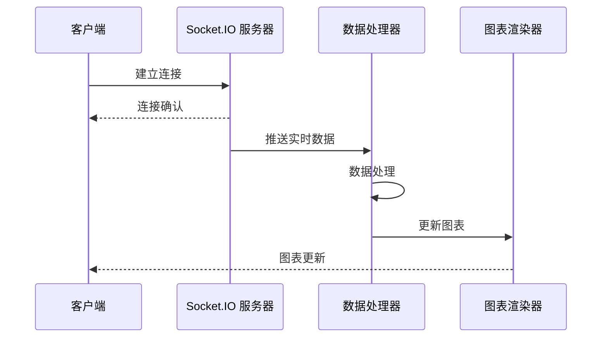

**图表来源**
- [common/socketiox/test-socketio.html:1168-1247](file://common/socketiox/test-socketio.html#L1168-L1247)

#### SSE 事件流

项目还支持 Server-Sent Events (SSE) 实时事件流：

**章节来源**
- [common/socketiox/test-socketio.html:1168-1247](file://common/socketiox/test-socketio.html#L1168-L1247)
- [aiapp/ssegtw/sse_demo.html:558-566](file://aiapp/ssegtw/sse_demo.html#L558-L566)

### 图表配置选项

#### 样式定制

项目提供了丰富的样式定制选项：

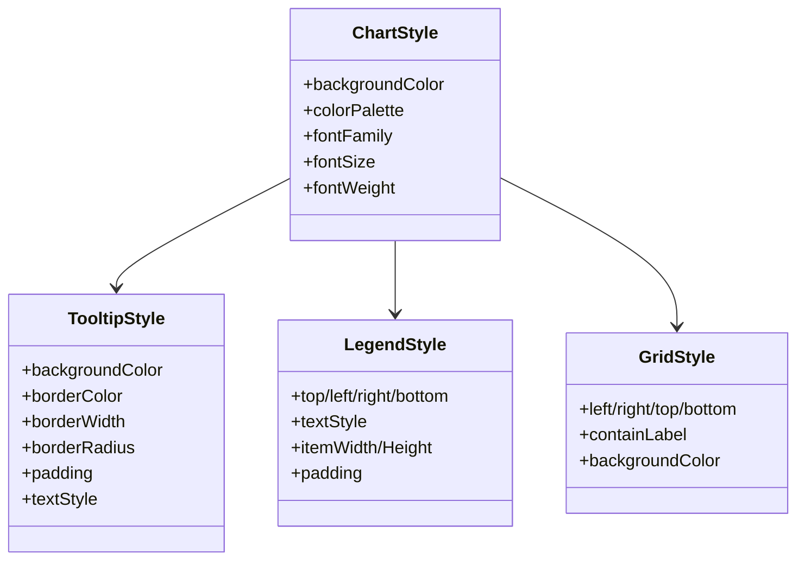

**图表来源**
- [deploy/stat_analyzer.html:1374-1403](file://deploy/stat_analyzer.html#L1374-L1403)

#### 数据绑定

数据绑定机制支持动态数据更新：

**章节来源**
- [deploy/stat_analyzer.html:1374-1403](file://deploy/stat_analyzer.html#L1374-L1403)

### 交互功能

#### 图表操作

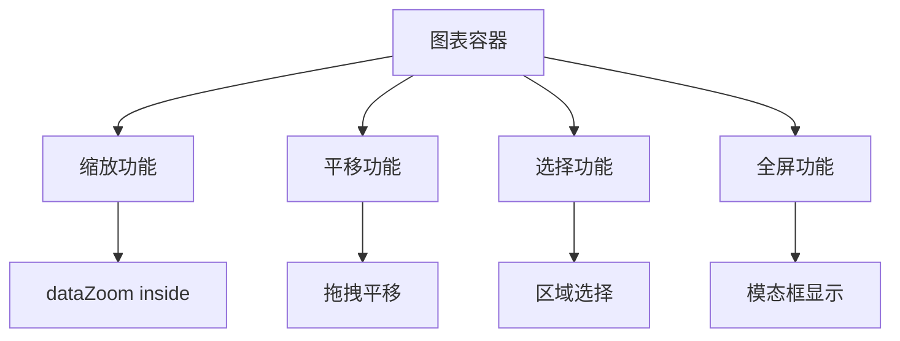

**图表来源**
- [deploy/stat_analyzer.html:1971-1985](file://deploy/stat_analyzer.html#L1971-L1985)

#### 用户交互

**章节来源**
- [deploy/stat_analyzer.html:3016-3037](file://deploy/stat_analyzer.html#L3016-L3037)

## 依赖关系分析

### 外部依赖

项目的主要外部依赖包括：

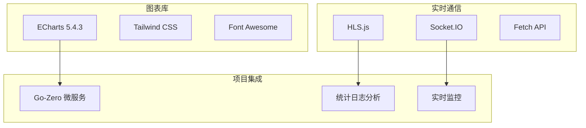

**图表来源**
- [deploy/stat_analyzer.html:8-10](file://deploy/stat_analyzer.html#L8-L10)

### 内部模块依赖

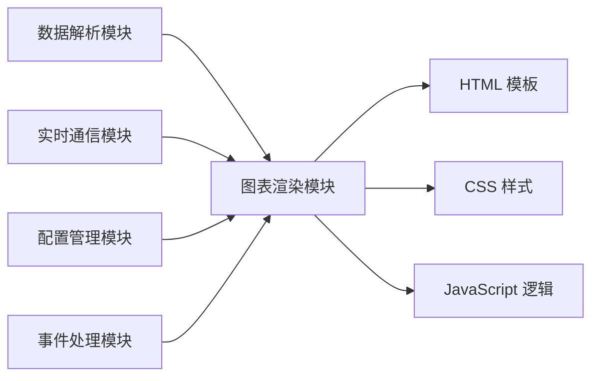

**图表来源**
- [deploy/stat_analyzer.html:535-572](file://deploy/stat_analyzer.html#L535-L572)

**章节来源**
- [deploy/stat_analyzer.html:8-10](file://deploy/stat_analyzer.html#L8-L10)
- [deploy/stat_analyzer.html:535-572](file://deploy/stat_analyzer.html#L535-L572)

## 性能考虑

### 大数据量渲染优化

项目针对大数据量渲染实现了多项优化策略：

#### 数据聚合优化

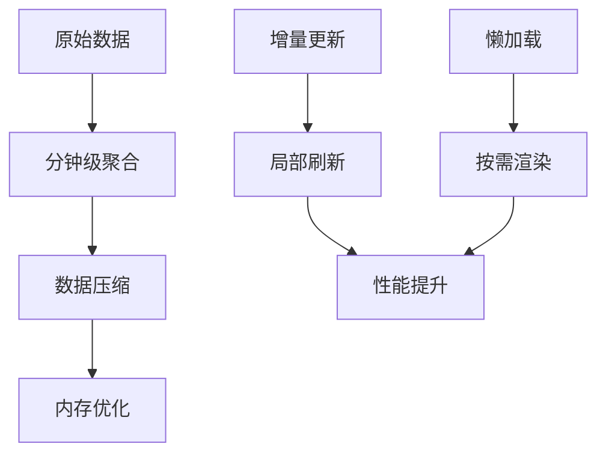

**图表来源**
- [deploy/stat_analyzer.html:1118-1327](file://deploy/stat_analyzer.html#L1118-L1327)

#### 渲染性能优化

**章节来源**
- [deploy/stat_analyzer.html:1118-1327](file://deploy/stat_analyzer.html#L1118-L1327)

### 实时更新优化

#### WebSocket 连接管理

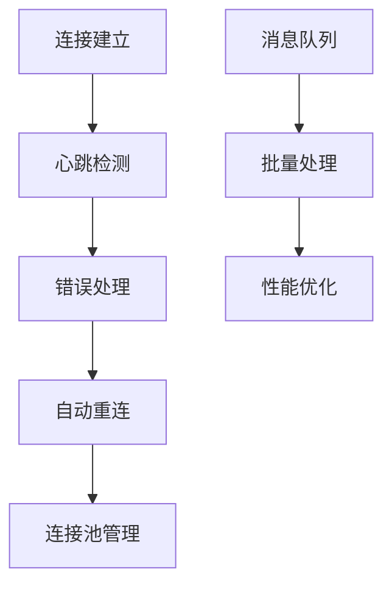

**图表来源**
- [common/socketiox/test-socketio.html:1168-1247](file://common/socketiox/test-socketio.html#L1168-L1247)

#### SSE 事件流优化

**章节来源**
- [common/socketiox/test-socketio.html:1168-1247](file://common/socketiox/test-socketio.html#L1168-L1247)

### 缓存机制

项目实现了多层缓存机制：

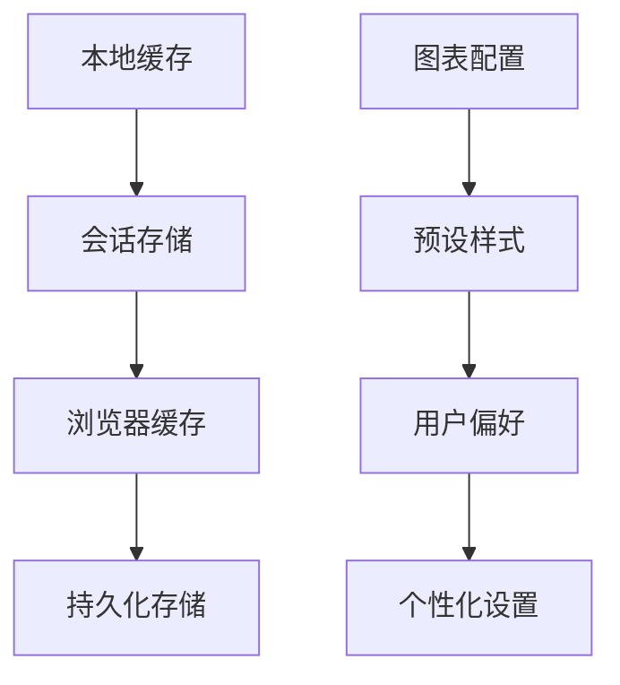

**图表来源**
- [common/socketiox/test-socketio.html:997-1020](file://common/socketiox/test-socketio.html#L997-L1020)

## 故障排除指南

### 常见问题及解决方案

#### 图表渲染问题

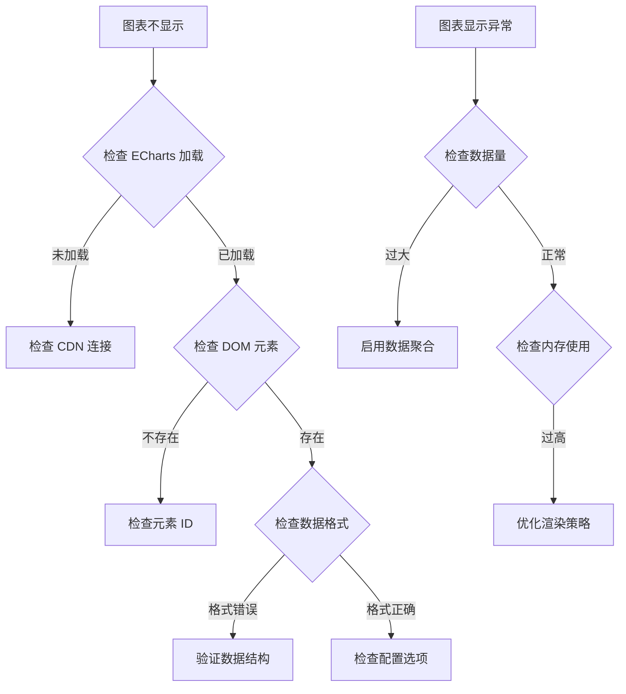

**图表来源**
- [deploy/stat_analyzer.html:3428-3457](file://deploy/stat_analyzer.html#L3428-L3457)

#### 实时通信问题

**章节来源**
- [deploy/stat_analyzer.html:3428-3457](file://deploy/stat_analyzer.html#L3428-L3457)

### 调试工具

项目提供了完善的调试工具：

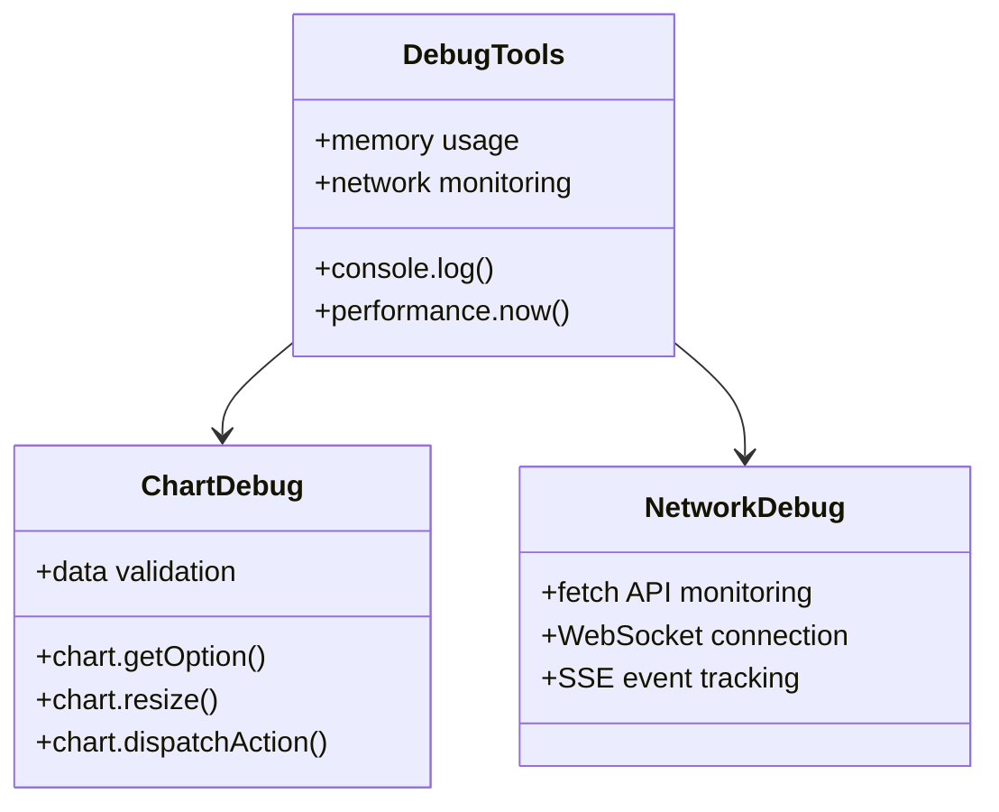

**图表来源**
- [deploy/stat_analyzer.html:3459-3466](file://deploy/stat_analyzer.html#L3459-L3466)

**章节来源**
- [deploy/stat_analyzer.html:3459-3466](file://deploy/stat_analyzer.html#L3459-L3466)

## 结论

zero-service 项目提供了完整的图表可视化解决方案，具有以下特点：

### 技术优势

1. **丰富的图表类型**：支持折线图、柱状图、热力图、散点图等多种图表类型
2. **实时更新能力**：通过 WebSocket 和 SSE 实现实时数据推送
3. **高性能优化**：针对大数据量进行了专门的优化处理
4. **交互性强**：提供缩放、平移、选择等丰富的交互功能
5. **样式定制**：支持全面的样式定制和主题配置

### 应用价值

1. **监控分析**：适用于微服务系统的性能监控和分析
2. **实时仪表板**：适合构建实时数据展示面板
3. **趋势分析**：支持长期趋势数据的可视化分析
4. **多维度对比**：支持多维度数据的对比展示

### 发展方向

1. **移动端适配**：进一步优化移动端的图表展示体验
2. **深度学习集成**：集成机器学习算法进行预测分析
3. **云原生支持**：增强对 Kubernetes 环境的支持
4. **国际化支持**：扩展多语言界面支持

## 附录

### 配置选项参考

#### 图表基础配置

| 配置项 | 类型 | 描述 | 默认值 |
|--------|------|------|--------|
| backgroundColor | string | 背景颜色 | 'transparent' |
| animation | boolean | 是否启用动画 | true |
| animationDuration | number | 动画持续时间(ms) | 1000 |
| tooltip.trigger | string | 提示框触发方式 | 'axis' |

#### 数据配置

| 配置项 | 类型 | 描述 | 示例 |
|--------|------|------|------|
| series[].type | string | 图表类型 | 'line', 'bar', 'heatmap' |
| series[].data | array | 数据数组 | [1, 2, 3, 4, 5] |
| xAxis.type | string | X轴类型 | 'category', 'value' |
| yAxis.type | string | Y轴类型 | 'value', 'log' |

### API 接口参考

#### 图表操作接口

```javascript
// 初始化图表
const chart = echarts.init(dom);

// 设置图表配置
chart.setOption(option);

// 更新图表尺寸
chart.resize();

// 刷新图表
chart.dispatchAction({ type: 'takeGlobalCursor', key: 'dataZoomSelect', dataZoomSelectActive: true });

// 销毁图表
chart.dispose();
```

#### 数据处理接口

```javascript
// 数据聚合
function aggregateDataByMinute() {
    // 实现数据聚合逻辑
}

// 数据过滤
function getFilteredData() {
    // 实现数据过滤逻辑
}

// 数据排序
function handleHeaderClick(e) {
    // 实现数据排序逻辑
}
```

### 最佳实践

1. **性能优化**
   - 启用数据聚合减少渲染压力
   - 使用懒加载避免一次性渲染大量数据
   - 合理设置动画效果

2. **用户体验**
   - 提供清晰的加载状态提示
   - 支持全屏查看大图
   - 保持图表响应速度

3. **代码维护**
   - 模块化组织图表代码
   - 提供完善的错误处理
   - 保持代码注释和文档更新