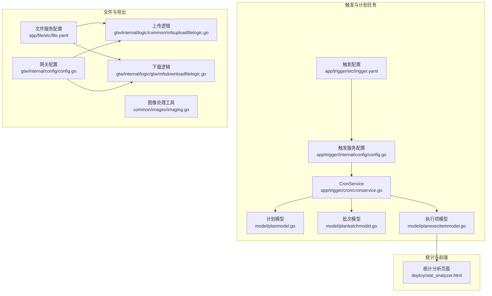
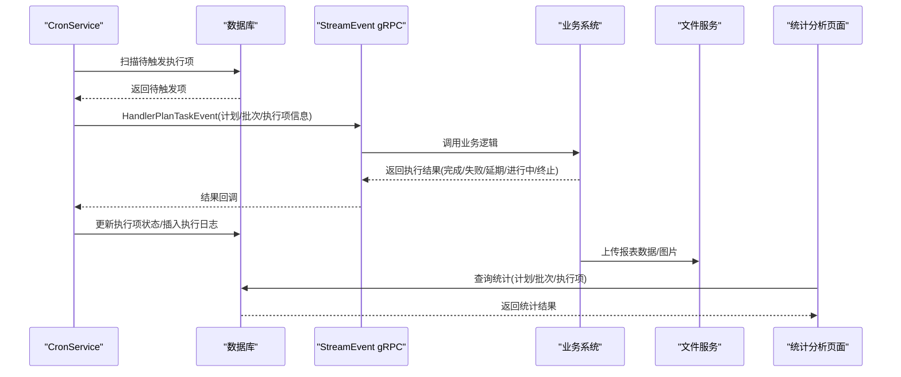
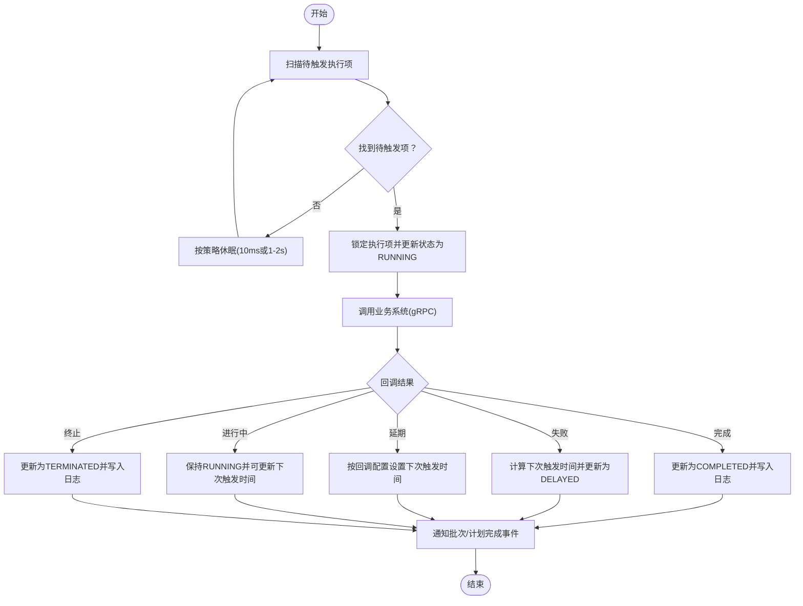
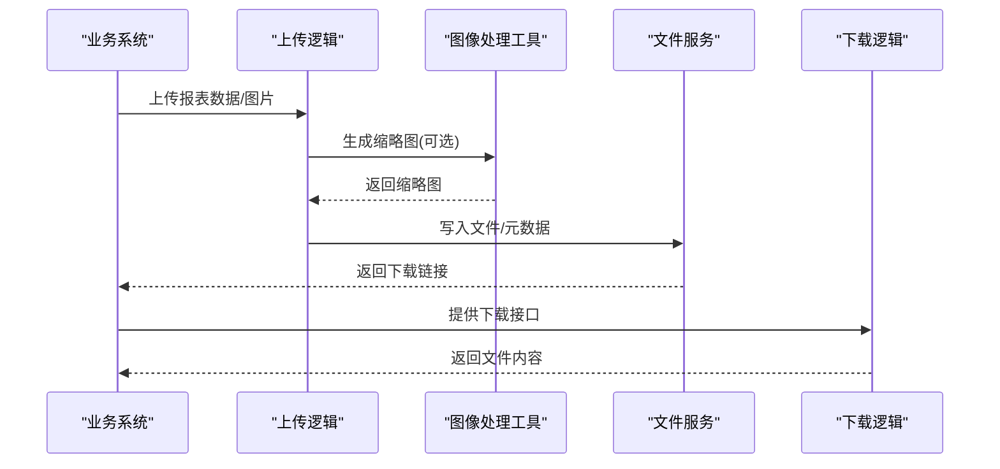
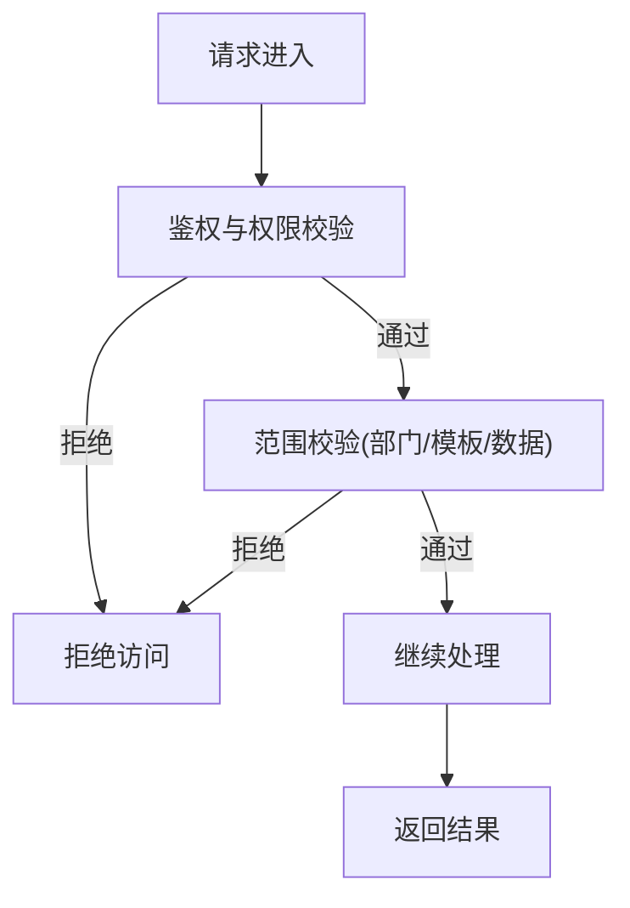
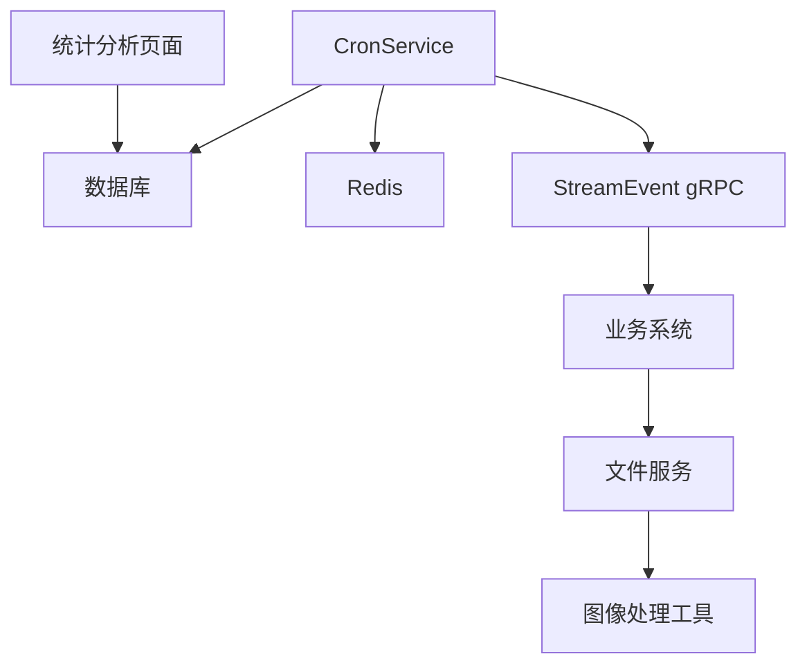

# 报表生成与导出

<cite>
**本文引用的文件**
- [trigger.yaml](file://app/trigger/etc/trigger.yaml)
- [trigger 配置](file://app/trigger/internal/config/config.go)
- [CronService](file://app/trigger/cron/cronservice.go)
- [计划模型](file://model/planmodel.go)
- [批次模型](file://model/planbatchmodel.go)
- [执行项模型](file://model/planexecitemmodel.go)
- [测试统计 SQL](file://model/sql/test.sql)
- [触发文档](file://docs/trigger.md)
- [文件 RPC 配置](file://app/file/etc/file.yaml)
- [图像处理工具](file://common/imagex/imaging.go)
- [上传文件逻辑](file://gtw/internal/logic/common/mfsuploadfilelogic.go)
- [下载文件逻辑](file://gtw/internal/logic/gtw/mfsdownloadfilelogic.go)
- [网关配置](file://gtw/internal/config/config.go)
- [统计分析页面](file://deploy/stat_analyzer.html)
</cite>

## 目录
1. [简介](#简介)
2. [项目结构](#项目结构)
3. [核心组件](#核心组件)
4. [架构总览](#架构总览)
5. [详细组件分析](#详细组件分析)
6. [依赖分析](#依赖分析)
7. [性能考量](#性能考量)
8. [故障排查指南](#故障排查指南)
9. [结论](#结论)
10. [附录](#附录)

## 简介
本指南围绕 zero-service 的报表生成与导出能力展开，重点覆盖以下方面：
- 自定义报表模板设计：模板结构、字段配置、样式设置等模板定制方法
- 定时报表生成：调度配置、数据收集、格式转换等自动化流程
- 报表导出：PDF、Excel、图片等多格式支持
- 报表权限控制：数据访问限制、模板使用权限、导出范围控制等安全机制
- 实际配置示例：结合项目中的配置文件展示报表系统的具体实现方案

说明：在当前仓库中，报表生成与导出并非独立模块，而是依托“计划任务”（触发器）与“文件存储/下载”能力实现。因此，本指南将以“计划任务驱动的数据采集与导出”为主线，结合现有组件给出可落地的实现建议与最佳实践。

## 项目结构
与报表相关的关键目录与文件如下：
- 触发与计划任务：app/trigger/*（配置、服务、模型）
- 报表数据来源：model/*（计划、批次、执行项模型）
- 文件上传/下载：app/file/*、gtw/internal/logic/*
- 图像处理：common/imagex/imaging.go
- 统计分析前端页面：deploy/stat_analyzer.html

**图表来源**
- [trigger.yaml:1-37](file://app/trigger/etc/trigger.yaml#L1-L37)
- [trigger 配置:1-28](file://app/trigger/internal/config/config.go#L1-L28)
- [CronService:1-469](file://app/trigger/cron/cronservice.go#L1-L469)
- [计划模型:1-65](file://model/planmodel.go#L1-L65)
- [批次模型:1-94](file://model/planbatchmodel.go#L1-L94)
- [执行项模型:1-435](file://model/planexecitemmodel.go#L1-L435)
- [文件 RPC 配置:1-23](file://app/file/etc/file.yaml#L1-L23)
- [图像处理工具:1-69](file://common/imagex/imaging.go#L1-L69)
- [上传文件逻辑:80-122](file://gtw/internal/logic/common/mfsuploadfilelogic.go#L80-L122)
- [下载文件逻辑:1-54](file://gtw/internal/logic/gtw/mfsdownloadfilelogic.go#L1-L54)
- [网关配置:1-20](file://gtw/internal/config/config.go#L1-L20)
- [统计分析页面:379-392](file://deploy/stat_analyzer.html#L379-L392)

**章节来源**
- [trigger.yaml:1-37](file://app/trigger/etc/trigger.yaml#L1-L37)
- [trigger 配置:1-28](file://app/trigger/internal/config/config.go#L1-L28)
- [CronService:1-469](file://app/trigger/cron/cronservice.go#L1-L469)
- [计划模型:1-65](file://model/planmodel.go#L1-L65)
- [批次模型:1-94](file://model/planbatchmodel.go#L1-L94)
- [执行项模型:1-435](file://model/planexecitemmodel.go#L1-L435)
- [文件 RPC 配置:1-23](file://app/file/etc/file.yaml#L1-L23)
- [图像处理工具:1-69](file://common/imagex/imaging.go#L1-L69)
- [上传文件逻辑:80-122](file://gtw/internal/logic/common/mfsuploadfilelogic.go#L80-L122)
- [下载文件逻辑:1-54](file://gtw/internal/logic/gtw/mfsdownloadfilelogic.go#L1-L54)
- [网关配置:1-20](file://gtw/internal/config/config.go#L1-L20)
- [统计分析页面:379-392](file://deploy/stat_analyzer.html#L379-L392)

## 核心组件
- 触发与计划任务
  - 触发配置：定义日志、Redis、数据库、gRPC 端点等运行参数
  - CronService：定时扫描待触发的执行项，调用业务系统并更新状态
  - 计划/批次/执行项模型：提供状态更新、进度统计、完成时间更新等能力
- 文件与导出
  - 文件服务配置：数据库连接、缩略图并发、租户模式等
  - 图像处理工具：缩略图生成、格式转换等
  - 上传/下载逻辑：文件上传、缩略图生成、文件下载
- 统计与前端
  - 统计分析页面：服务性能可视化、筛选、分页、全屏等交互

**章节来源**
- [trigger.yaml:1-37](file://app/trigger/etc/trigger.yaml#L1-L37)
- [trigger 配置:1-28](file://app/trigger/internal/config/config.go#L1-L28)
- [CronService:1-469](file://app/trigger/cron/cronservice.go#L1-L469)
- [计划模型:1-65](file://model/planmodel.go#L1-L65)
- [批次模型:1-94](file://model/planbatchmodel.go#L1-L94)
- [执行项模型:1-435](file://model/planexecitemmodel.go#L1-L435)
- [文件 RPC 配置:1-23](file://app/file/etc/file.yaml#L1-L23)
- [图像处理工具:1-69](file://common/imagex/imaging.go#L1-L69)
- [上传文件逻辑:80-122](file://gtw/internal/logic/common/mfsuploadfilelogic.go#L80-L122)
- [下载文件逻辑:1-54](file://gtw/internal/logic/gtw/mfsdownloadfilelogic.go#L1-L54)
- [统计分析页面:379-392](file://deploy/stat_analyzer.html#L379-L392)

## 架构总览
下图展示了报表生成与导出的整体流程：由 CronService 周期性扫描计划任务，触发业务系统执行，业务系统产出数据后，通过文件服务进行存储与导出。

**图表来源**
- [CronService:81-184](file://app/trigger/cron/cronservice.go#L81-L184)
- [触发文档:95-158](file://docs/trigger.md#L95-L158)
- [统计 SQL:95-129](file://model/sql/test.sql#L95-L129)

**章节来源**
- [CronService:81-184](file://app/trigger/cron/cronservice.go#L81-L184)
- [触发文档:95-158](file://docs/trigger.md#L95-L158)
- [统计 SQL:95-129](file://model/sql/test.sql#L95-L129)

## 详细组件分析

### 触发与计划任务（定时报表生成）
- 配置要点
  - 日志、Redis、数据库、gRPC 端点等参数在触发配置中集中管理
  - CronService 启动后进入扫描循环，根据扫描结果动态调整休眠时间
- 扫描与执行
  - CronService 通过模型层锁定待触发执行项，更新状态为执行中
  - 通过 StreamEvent gRPC 调用业务系统，依据回调结果更新状态（完成/失败/延期/进行中/终止）
  - 执行完成后插入执行日志，并在批次/计划全部完成时通知事件
- 数据统计
  - 执行项模型提供状态统计与总数统计
  - 批次模型提供进度计算与完成时间更新
  - 计划模型提供完成时间更新

**图表来源**
- [CronService:58-184](file://app/trigger/cron/cronservice.go#L58-L184)
- [执行项模型:146-399](file://model/planexecitemmodel.go#L146-L399)
- [批次模型:41-66](file://model/planbatchmodel.go#L41-L66)
- [计划模型:39-64](file://model/planmodel.go#L39-L64)

**章节来源**
- [trigger.yaml:1-37](file://app/trigger/etc/trigger.yaml#L1-L37)
- [trigger 配置:1-28](file://app/trigger/internal/config/config.go#L1-L28)
- [CronService:58-184](file://app/trigger/cron/cronservice.go#L58-L184)
- [执行项模型:146-399](file://model/planexecitemmodel.go#L146-L399)
- [批次模型:41-66](file://model/planbatchmodel.go#L41-L66)
- [计划模型:39-64](file://model/planmodel.go#L39-L64)

### 文件与导出（PDF/Excel/图片）
- 文件服务配置
  - 数据库连接、租户模式、缩略图并发等参数集中于文件服务配置
- 图像处理
  - 提供多种输入输出形式（文件路径/字节流/Reader）与缩略图生成
- 上传与下载
  - 上传逻辑支持图片元数据提取与缩略图生成
  - 下载逻辑支持直接文件下载（HTTP ServeFile）

**图表来源**
- [文件 RPC 配置:1-23](file://app/file/etc/file.yaml#L1-L23)
- [图像处理工具:1-69](file://common/imagex/imaging.go#L1-L69)
- [上传文件逻辑:80-122](file://gtw/internal/logic/common/mfsuploadfilelogic.go#L80-L122)
- [下载文件逻辑:1-54](file://gtw/internal/logic/gtw/mfsdownloadfilelogic.go#L1-L54)

**章节来源**
- [文件 RPC 配置:1-23](file://app/file/etc/file.yaml#L1-L23)
- [图像处理工具:1-69](file://common/imagex/imaging.go#L1-L69)
- [上传文件逻辑:80-122](file://gtw/internal/logic/common/mfsuploadfilelogic.go#L80-L122)
- [下载文件逻辑:1-54](file://gtw/internal/logic/gtw/mfsdownloadfilelogic.go#L1-L54)

### 权限控制（数据访问/模板使用/导出范围）
- 数据访问限制
  - 计划/批次/执行项模型均包含机构码字段，可在查询与更新时加入部门维度过滤
- 模板使用权限
  - 上传逻辑对图片类型进行识别与缩略图生成，可作为模板渲染的前置处理
- 导出范围控制
  - 下载逻辑基于路径直接返回文件，建议在业务侧增加鉴权与范围校验

**图表来源**
- [执行项模型:55-73](file://model/planexecitemmodel.go#L55-L73)
- [上传文件逻辑:80-122](file://gtw/internal/logic/common/mfsuploadfilelogic.go#L80-L122)
- [下载文件逻辑:1-54](file://gtw/internal/logic/gtw/mfsdownloadfilelogic.go#L1-L54)

**章节来源**
- [执行项模型:55-73](file://model/planexecitemmodel.go#L55-L73)
- [上传文件逻辑:80-122](file://gtw/internal/logic/common/mfsuploadfilelogic.go#L80-L122)
- [下载文件逻辑:1-54](file://gtw/internal/logic/gtw/mfsdownloadfilelogic.go#L1-L54)

### 自定义报表模板设计
- 模板结构
  - 建议采用占位符替换的方式，结合现有构建卡片方法进行扩展
  - 可参考报警卡片构建方式，将标题、项目、时间、内容、错误、IP、按钮等字段映射到模板
- 字段配置
  - 在业务系统生成报表数据时，按模板字段进行填充
  - 对于图片类报表，可利用图像处理工具生成缩略图并嵌入模板
- 样式设置
  - 前端页面提供统计分析与可视化，可作为报表展示的参考样式

**章节来源**
- [图像处理工具:1-69](file://common/imagex/imaging.go#L1-L69)
- [统计分析页面:379-392](file://deploy/stat_analyzer.html#L379-L392)

### 定时报表生成（调度与数据收集）
- 调度配置
  - 触发配置中定义日志、Redis、数据库、gRPC 端点等
  - CronService 启动后按策略扫描，无待处理项时随机休眠
- 数据收集
  - 通过 StreamEvent gRPC 调用业务系统，业务系统负责采集与生成报表数据
- 格式转换
  - 上传逻辑支持图片元数据提取与缩略图生成，便于不同格式的报表呈现

**章节来源**
- [trigger.yaml:1-37](file://app/trigger/etc/trigger.yaml#L1-L37)
- [CronService:58-184](file://app/trigger/cron/cronservice.go#L58-L184)
- [上传文件逻辑:80-122](file://gtw/internal/logic/common/mfsuploadfilelogic.go#L80-L122)

### 报表导出（PDF/Excel/图片）
- PDF/Excel
  - 可在业务系统中将报表数据转换为 PDF/Excel 格式后，交由文件服务上传
- 图片
  - 利用图像处理工具生成缩略图，满足图片下载需求
- 下载
  - 下载逻辑直接返回文件内容，建议在业务侧增加鉴权与范围校验

**章节来源**
- [图像处理工具:1-69](file://common/imagex/imaging.go#L1-L69)
- [下载文件逻辑:1-54](file://gtw/internal/logic/gtw/mfsdownloadfilelogic.go#L1-L54)

## 依赖分析
- 组件耦合
  - CronService 依赖数据库与 Redis，通过 StreamEvent gRPC 调用业务系统
  - 执行项/批次/计划模型提供状态更新与统计能力
  - 文件服务与上传/下载逻辑共同支撑报表导出
- 外部依赖
  - gRPC、Redis、数据库、图像处理库等

**图表来源**
- [CronService:1-469](file://app/trigger/cron/cronservice.go#L1-L469)
- [触发文档:95-158](file://docs/trigger.md#L95-L158)
- [图像处理工具:1-69](file://common/imagex/imaging.go#L1-L69)
- [统计分析页面:379-392](file://deploy/stat_analyzer.html#L379-L392)

**章节来源**
- [CronService:1-469](file://app/trigger/cron/cronservice.go#L1-L469)
- [触发文档:95-158](file://docs/trigger.md#L95-L158)
- [图像处理工具:1-69](file://common/imagex/imaging.go#L1-L69)
- [统计分析页面:379-392](file://deploy/stat_analyzer.html#L379-L392)

## 性能考量
- 扫描频率与休眠策略：CronService 在有任务时以极短间隔扫描，无任务时随机休眠，降低资源占用
- 并发与锁：使用分布式锁保证回调一致性，避免并发冲突
- 数据库与索引：合理使用状态、时间、计划/批次/执行项关联查询，必要时建立复合索引
- 图像处理：缩略图生成建议异步化，避免阻塞主线程

[本节为通用指导，无需特定文件引用]

## 故障排查指南
- 触发与回调异常
  - 检查 CronService 扫描日志与 gRPC 调用结果
  - 核对回调结果与状态转移是否符合预期
- 状态更新问题
  - 查看执行项模型的状态更新方法与条件约束
  - 确认乐观锁版本号与状态变更范围
- 文件上传/下载异常
  - 检查文件服务配置与路径权限
  - 确认上传逻辑中的缩略图生成与下载逻辑

**章节来源**
- [CronService:203-468](file://app/trigger/cron/cronservice.go#L203-L468)
- [执行项模型:146-399](file://model/planexecitemmodel.go#L146-L399)
- [上传文件逻辑:80-122](file://gtw/internal/logic/common/mfsuploadfilelogic.go#L80-L122)
- [下载文件逻辑:1-54](file://gtw/internal/logic/gtw/mfsdownloadfilelogic.go#L1-L54)

## 结论
本指南基于 zero-service 的现有组件，给出了报表生成与导出的可行方案：以计划任务驱动数据采集，结合文件服务与图像处理工具实现多格式导出，并通过权限控制保障数据安全。建议在业务系统中完善模板渲染与格式转换逻辑，同时加强鉴权与范围校验，确保报表系统的安全性与稳定性。

[本节为总结性内容，无需特定文件引用]

## 附录
- 实际配置示例
  - 触发服务配置：日志、Redis、数据库、gRPC 端点等
  - 文件服务配置：数据库连接、租户模式、缩略图并发等
- 统计查询参考
  - 提供按计划类型统计任务总数、完成数、延期数、终止数的 SQL 示例

**章节来源**
- [trigger.yaml:1-37](file://app/trigger/etc/trigger.yaml#L1-L37)
- [文件 RPC 配置:1-23](file://app/file/etc/file.yaml#L1-L23)
- [测试统计 SQL:95-129](file://model/sql/test.sql#L95-L129)