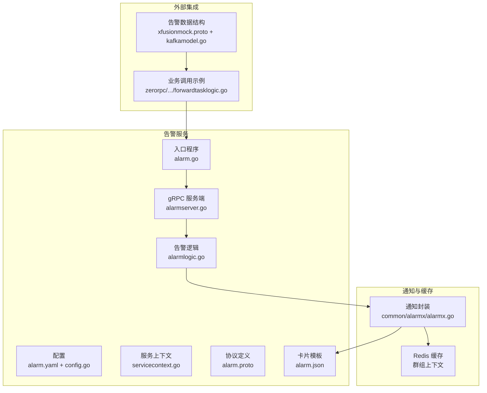
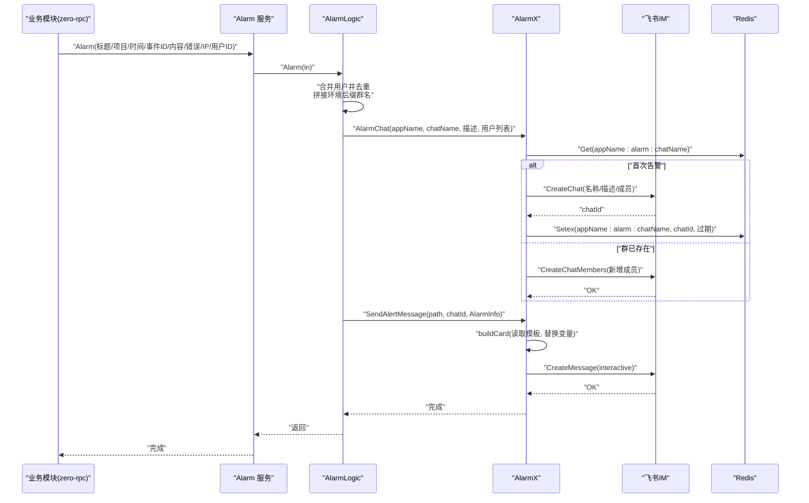
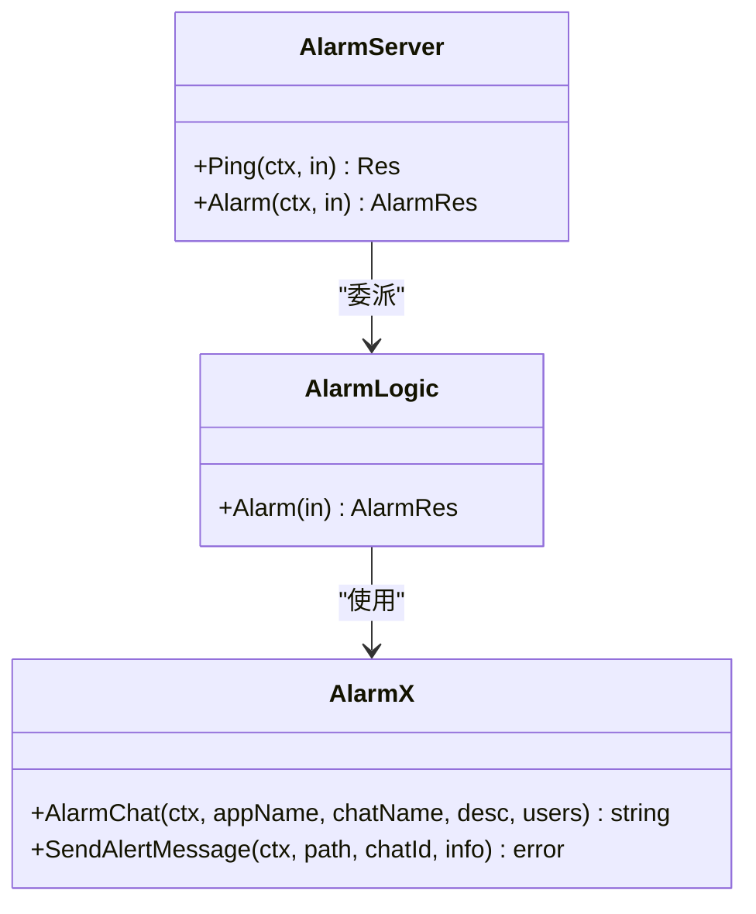
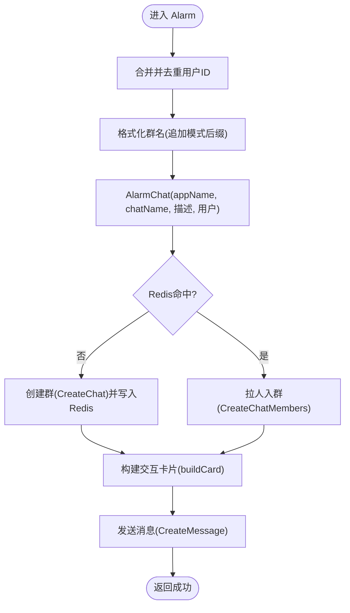
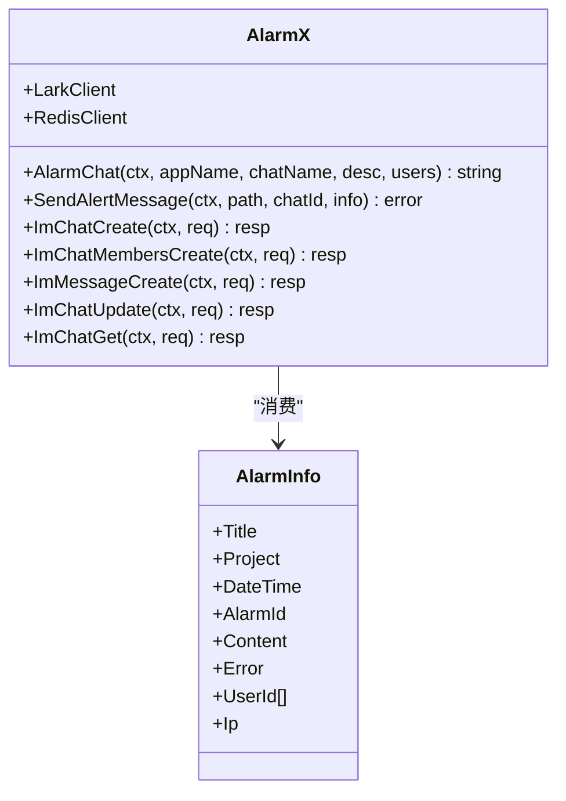
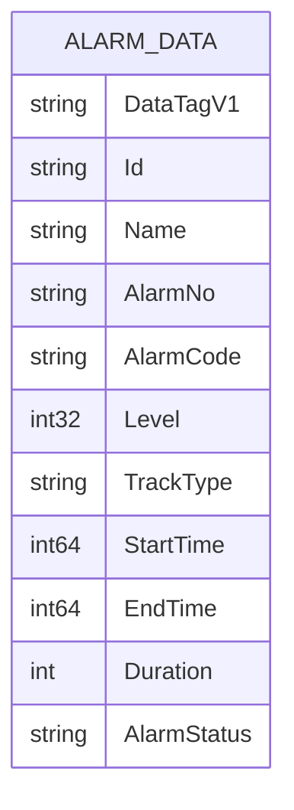
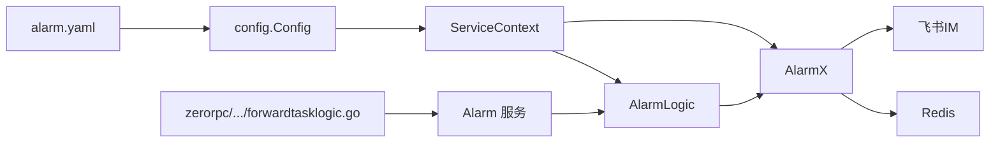

# 告警策略与规则

<cite>
**本文引用的文件**
- [app/alarm/etc/alarm.yaml](file://app/alarm/etc/alarm.yaml)
- [app/alarm/internal/config/config.go](file://app/alarm/internal/config/config.go)
- [app/alarm/internal/svc/servicecontext.go](file://app/alarm/internal/svc/servicecontext.go)
- [app/alarm/internal/logic/alarmlogic.go](file://app/alarm/internal/logic/alarmlogic.go)
- [app/alarm/internal/server/alarmserver.go](file://app/alarm/internal/server/alarmserver.go)
- [app/alarm/alarm.proto](file://app/alarm/alarm.proto)
- [app/alarm/alarm.go](file://app/alarm/alarm.go)
- [app/alarm/alarm.json](file://app/alarm/alarm.json)
- [common/alarmx/alarmx.go](file://common/alarmx/alarmx.go)
- [app/xfusionmock/xfusionmock.proto](file://app/xfusionmock/xfusionmock.proto)
- [model/kafkamodel.go](file://model/kafkamodel.go)
- [zerorpc/internal/logic/forwardtasklogic.go](file://zerorpc/internal/logic/forwardtasklogic.go)
</cite>

## 目录
1. [简介](#简介)
2. [项目结构](#项目结构)
3. [核心组件](#核心组件)
4. [架构总览](#架构总览)
5. [详细组件分析](#详细组件分析)
6. [依赖分析](#依赖分析)
7. [性能考虑](#性能考虑)
8. [故障排查指南](#故障排查指南)
9. [结论](#结论)
10. [附录](#附录)

## 简介
本指南面向 zero-service 的告警策略与规则设计，围绕以下目标展开：
- 告警规则设计原则：阈值设置、时间窗口、告警级别划分
- 告警类型分类：阈值告警、趋势告警、复合告警、智能告警
- 告警策略配置：触发条件、去重策略、静默规则、抑制规则
- 告警通知渠道：飞书/企业微信等即时通讯集成
- 告警优化策略：告警风暴处理、降噪、收敛
- 动态调整与 A/B 测试：持续优化与改进

在本仓库中，告警能力由独立的 alarm 服务提供，通过 gRPC 接口对外暴露；通知通道采用飞书 IM 交互卡片能力，结合 Redis 缓存群组上下文，实现“告警群”复用与成员变更。

## 项目结构
与告警相关的关键模块如下：
- alarm 服务：gRPC 服务、配置、逻辑、服务上下文、入口程序
- common/alarmx：告警通知封装（飞书客户端、Redis 缓存、消息卡片构建）
- alarm.json：交互卡片模板，用于渲染告警详情
- xfusionmock：演示告警数据结构（AlarmData），包含告警等级、类型、时间等字段
- zerorpc：示例业务在异常时调用 alarm 服务进行告警上报

**图表来源**
- [app/alarm/etc/alarm.yaml:1-26](file://app/alarm/etc/alarm.yaml#L1-L26)
- [app/alarm/internal/config/config.go:1-16](file://app/alarm/internal/config/config.go#L1-L16)
- [app/alarm/internal/svc/servicecontext.go:1-33](file://app/alarm/internal/svc/servicecontext.go#L1-L33)
- [app/alarm/internal/logic/alarmlogic.go:1-184](file://app/alarm/internal/logic/alarmlogic.go#L1-L184)
- [app/alarm/internal/server/alarmserver.go:1-35](file://app/alarm/internal/server/alarmserver.go#L1-L35)
- [app/alarm/alarm.go:1-44](file://app/alarm/alarm.go#L1-L44)
- [app/alarm/alarm.proto:1-34](file://app/alarm/alarm.proto#L1-L34)
- [app/alarm/alarm.json:1-75](file://app/alarm/alarm.json#L1-L75)
- [common/alarmx/alarmx.go:1-223](file://common/alarmx/alarmx.go#L1-L223)
- [app/xfusionmock/xfusionmock.proto:153-187](file://app/xfusionmock/xfusionmock.proto#L153-L187)
- [model/kafkamodel.go:60-93](file://model/kafkamodel.go#L60-L93)
- [zerorpc/internal/logic/forwardtasklogic.go:75-89](file://zerorpc/internal/logic/forwardtasklogic.go#L75-L89)

**章节来源**
- [app/alarm/etc/alarm.yaml:1-26](file://app/alarm/etc/alarm.yaml#L1-L26)
- [app/alarm/internal/config/config.go:1-16](file://app/alarm/internal/config/config.go#L1-L16)
- [app/alarm/internal/svc/servicecontext.go:1-33](file://app/alarm/internal/svc/servicecontext.go#L1-L33)
- [app/alarm/internal/logic/alarmlogic.go:1-184](file://app/alarm/internal/logic/alarmlogic.go#L1-L184)
- [app/alarm/internal/server/alarmserver.go:1-35](file://app/alarm/internal/server/alarmserver.go#L1-L35)
- [app/alarm/alarm.go:1-44](file://app/alarm/alarm.go#L1-L44)
- [app/alarm/alarm.proto:1-34](file://app/alarm/alarm.proto#L1-L34)
- [app/alarm/alarm.json:1-75](file://app/alarm/alarm.json#L1-L75)
- [common/alarmx/alarmx.go:1-223](file://common/alarmx/alarmx.go#L1-L223)
- [app/xfusionmock/xfusionmock.proto:153-187](file://app/xfusionmock/xfusionmock.proto#L153-L187)
- [model/kafkamodel.go:60-93](file://model/kafkamodel.go#L60-L93)
- [zerorpc/internal/logic/forwardtasklogic.go:75-89](file://zerorpc/internal/logic/forwardtasklogic.go#L75-L89)

## 核心组件
- 告警 gRPC 服务
  - 协议定义：Alarm.Ping、Alarm.Alarm
  - 服务端实现：AlarmServer 将请求委派给 logic 层
  - 入口程序：加载配置、注册服务、启动 RPC 服务器
- 告警逻辑
  - 合并用户列表、去重
  - 生成“告警群”名称（含环境后缀）
  - 调用 AlarmX 创建或更新群组
  - 构建交互卡片并发送消息
- AlarmX 通知封装
  - 飞书客户端初始化（带超时与自定义 HTTP 客户端）
  - Redis 缓存“应用名:alarm:群名 -> chatId”
  - 构建交互卡片 JSON 模板并替换变量
- 配置
  - alarm.yaml：监听地址、日志、Redis、Alarmx 参数（AppId、AppSecret、EncryptKey、VerificationToken、UserId、Path）
  - config.Config：映射 alarm.yaml 到结构体
  - ServiceContext：初始化 Redis、AlarmX、httpc

**章节来源**
- [app/alarm/alarm.proto:30-34](file://app/alarm/alarm.proto#L30-L34)
- [app/alarm/internal/server/alarmserver.go:26-34](file://app/alarm/internal/server/alarmserver.go#L26-L34)
- [app/alarm/alarm.go:21-42](file://app/alarm/alarm.go#L21-L42)
- [app/alarm/etc/alarm.yaml:1-26](file://app/alarm/etc/alarm.yaml#L1-L26)
- [app/alarm/internal/config/config.go:5-14](file://app/alarm/internal/config/config.go#L5-L14)
- [app/alarm/internal/svc/servicecontext.go:20-32](file://app/alarm/internal/svc/servicecontext.go#L20-L32)
- [app/alarm/internal/logic/alarmlogic.go:31-63](file://app/alarm/internal/logic/alarmlogic.go#L31-L63)
- [common/alarmx/alarmx.go:46-76](file://common/alarmx/alarmx.go#L46-L76)
- [app/alarm/alarm.json:1-75](file://app/alarm/alarm.json#L1-L75)

## 架构总览
下图展示从业务到告警服务再到飞书通知的整体流程。

**图表来源**
- [app/alarm/internal/logic/alarmlogic.go:31-63](file://app/alarm/internal/logic/alarmlogic.go#L31-L63)
- [common/alarmx/alarmx.go:53-140](file://common/alarmx/alarmx.go#L53-L140)
- [app/alarm/alarm.json:1-75](file://app/alarm/alarm.json#L1-L75)
- [app/alarm/etc/alarm.yaml:8-25](file://app/alarm/etc/alarm.yaml#L8-L25)

## 详细组件分析

### 组件一：Alarm 服务与协议
- 协议定义包含 Ping、Alarm 两个 RPC 方法，AlarmReq 包含标题、项目、时间、事件 ID、内容、错误、用户 ID、IP 等字段
- 服务端实现将请求委派给 logic 层处理

**图表来源**
- [app/alarm/alarm.proto:30-34](file://app/alarm/alarm.proto#L30-L34)
- [app/alarm/internal/server/alarmserver.go:15-35](file://app/alarm/internal/server/alarmserver.go#L15-L35)
- [app/alarm/internal/logic/alarmlogic.go:17-29](file://app/alarm/internal/logic/alarmlogic.go#L17-L29)
- [common/alarmx/alarmx.go:29-51](file://common/alarmx/alarmx.go#L29-L51)

**章节来源**
- [app/alarm/alarm.proto:14-33](file://app/alarm/alarm.proto#L14-L33)
- [app/alarm/internal/server/alarmserver.go:26-34](file://app/alarm/internal/server/alarmserver.go#L26-L34)

### 组件二：AlarmLogic 告警处理流程
- 合并配置中的默认用户与请求中的用户，去重
- 格式化群名（追加运行模式后缀）
- 调用 AlarmX.AlarmChat 获取/创建群组
- 构造 AlarmInfo 并调用 AlarmX.SendAlertMessage 发送交互卡片

**图表来源**
- [app/alarm/internal/logic/alarmlogic.go:31-63](file://app/alarm/internal/logic/alarmlogic.go#L31-L63)
- [common/alarmx/alarmx.go:53-140](file://common/alarmx/alarmx.go#L53-L140)
- [app/alarm/alarm.json:1-75](file://app/alarm/alarm.json#L1-L75)

**章节来源**
- [app/alarm/internal/logic/alarmlogic.go:31-63](file://app/alarm/internal/logic/alarmlogic.go#L31-L63)

### 组件三：AlarmX 通知封装与卡片模板
- AlarmX 负责：
  - 通过 Redis 缓存“应用名:alarm:群名 -> chatId”，避免重复创建
  - 使用飞书 SDK 创建群组、添加成员、发送消息
  - 读取 alarm.json 模板，替换变量（标题、项目、时间、事件 ID、内容、错误、IP、按钮名等）
- alarm.yaml 中配置 Alarmx.AppId/AppSecret/EncryptKey/VerificationToken/UserId/Path，用于初始化 AlarmX 与卡片路径

**图表来源**
- [common/alarmx/alarmx.go:18-51](file://common/alarmx/alarmx.go#L18-L51)
- [app/alarm/etc/alarm.yaml:18-25](file://app/alarm/etc/alarm.yaml#L18-L25)
- [app/alarm/alarm.json:1-75](file://app/alarm/alarm.json#L1-L75)

**章节来源**
- [common/alarmx/alarmx.go:53-140](file://common/alarmx/alarmx.go#L53-L140)
- [app/alarm/etc/alarm.yaml:18-25](file://app/alarm/etc/alarm.yaml#L18-L25)
- [app/alarm/alarm.json:1-75](file://app/alarm/alarm.json#L1-L75)

### 组件四：告警数据结构与业务集成
- xfusionmock.proto 与 model/kafkamodel.go 定义了 AlarmData，包含告警等级 Level、告警类型编码 AlarmCode、起止时间、持续时长、状态等
- zerorpc 示例在转发任务失败时构造 AlarmReq 并调用 Alarm 服务进行告警上报

**图表来源**
- [app/xfusionmock/xfusionmock.proto:153-187](file://app/xfusionmock/xfusionmock.proto#L153-L187)
- [model/kafkamodel.go:60-93](file://model/kafkamodel.go#L60-L93)

**章节来源**
- [app/xfusionmock/xfusionmock.proto:153-187](file://app/xfusionmock/xfusionmock.proto#L153-L187)
- [model/kafkamodel.go:60-93](file://model/kafkamodel.go#L60-L93)
- [zerorpc/internal/logic/forwardtasklogic.go:75-89](file://zerorpc/internal/logic/forwardtasklogic.go#L75-L89)

## 依赖分析
- Alarm 服务依赖：
  - 配置：alarm.yaml -> config.Config
  - 服务上下文：ServiceContext 初始化 Redis 与 AlarmX
  - 逻辑层：AlarmLogic 调用 AlarmX
  - 通知：AlarmX 依赖飞书 SDK 与 Redis
- 业务侧依赖：
  - zerorpc 在异常时构造 AlarmReq 并调用 Alarm 服务
  - xfusionmock 提供告警数据结构，便于业务侧填充 AlarmReq 字段

**图表来源**
- [app/alarm/etc/alarm.yaml:1-26](file://app/alarm/etc/alarm.yaml#L1-L26)
- [app/alarm/internal/config/config.go:1-16](file://app/alarm/internal/config/config.go#L1-L16)
- [app/alarm/internal/svc/servicecontext.go:20-32](file://app/alarm/internal/svc/servicecontext.go#L20-L32)
- [app/alarm/internal/logic/alarmlogic.go:31-63](file://app/alarm/internal/logic/alarmlogic.go#L31-L63)
- [common/alarmx/alarmx.go:46-76](file://common/alarmx/alarmx.go#L46-L76)
- [zerorpc/internal/logic/forwardtasklogic.go:75-89](file://zerorpc/internal/logic/forwardtasklogic.go#L75-L89)

**章节来源**
- [app/alarm/etc/alarm.yaml:1-26](file://app/alarm/etc/alarm.yaml#L1-L26)
- [app/alarm/internal/config/config.go:1-16](file://app/alarm/internal/config/config.go#L1-L16)
- [app/alarm/internal/svc/servicecontext.go:1-33](file://app/alarm/internal/svc/servicecontext.go#L1-L33)
- [app/alarm/internal/logic/alarmlogic.go:1-184](file://app/alarm/internal/logic/alarmlogic.go#L1-L184)
- [common/alarmx/alarmx.go:1-223](file://common/alarmx/alarmx.go#L1-L223)
- [zerorpc/internal/logic/forwardtasklogic.go:75-89](file://zerorpc/internal/logic/forwardtasklogic.go#L75-L89)

## 性能考虑
- 群组缓存：AlarmX 使用 Redis 缓存“应用名:alarm:群名 -> chatId”，避免重复创建群组，降低飞书 API 调用频率
- 成员变更：当同一群组再次触发告警时，仅执行“拉人入群”操作，减少不必要的创建开销
- 请求去重：逻辑层对用户 ID 去重，避免重复推送
- 超时与重试：AlarmX 初始化时设置请求超时；建议在上游业务侧对告警调用增加幂等与限流策略
- 卡片构建：模板一次性读取并字符串替换，避免重复 IO

**章节来源**
- [common/alarmx/alarmx.go:53-76](file://common/alarmx/alarmx.go#L53-L76)
- [app/alarm/internal/logic/alarmlogic.go:31-33](file://app/alarm/internal/logic/alarmlogic.go#L31-L33)

## 故障排查指南
- 飞书鉴权与回调
  - 配置中包含 AppId、AppSecret、EncryptKey、VerificationToken，用于初始化飞书客户端与事件/卡片回调
  - 当前 AlarmLogic 未启用事件/卡片回调注册，如需启用可在逻辑中按注释示例开启
- Redis 连接
  - 若 Redis 未就绪或连接失败，AlarmChat 会直接报错；请检查 alarm.yaml 中 Redis 配置与网络连通性
- 卡片模板
  - alarm.json 作为模板，若路径不正确或权限不足会导致构建卡片失败；请确认 alarm.yaml 中 Alarmx.Path 指向有效文件
- 业务侧调用
  - zerorpc 示例在转发任务失败时调用 Alarm 服务；若告警未到达，请检查 Alarm 服务是否正常启动、网络连通性与日志

**章节来源**
- [app/alarm/etc/alarm.yaml:18-25](file://app/alarm/etc/alarm.yaml#L18-L25)
- [app/alarm/internal/logic/alarmlogic.go:47-62](file://app/alarm/internal/logic/alarmlogic.go#L47-L62)
- [common/alarmx/alarmx.go:142-160](file://common/alarmx/alarmx.go#L142-L160)

## 结论
- 本告警体系以 Alarm 服务为核心，通过 AlarmX 封装飞书通知与 Redis 缓存，实现“告警群”的高效复用与交互卡片推送
- 告警数据结构在 xfusionmock 与 model 层均有体现，便于业务侧快速填充 AlarmReq
- 建议在生产环境中完善事件/卡片回调、静默/抑制规则、去重与收敛策略，并结合业务指标设计阈值与时间窗口，持续通过 A/B 测试优化告警质量

## 附录

### 告警规则设计原则
- 阈值设置
  - 明确指标口径与单位，设定合理阈值；对易波动指标采用滑动窗口均值或中位数
  - 对关键链路设置多级阈值（如 P0/P1/P2/P3），区分紧急程度
- 时间窗口
  - 选择合适的采样周期与告警周期，避免瞬时抖动引发误报
  - 对突发性事件采用“熔断式”告警，先短周期探测，再延长周期
- 告警级别划分
  - P0：线上事故，需立即响应
  - P1：线上重大问题，需尽快处理
  - P2：线上一般问题，纳入工作流
  - P3：观察项，无需立即处理

### 告警类型分类
- 阈值告警：基于固定阈值触发
- 趋势告警：基于指标趋势变化（上升/下降速率、偏离均值）
- 复合告警：多指标组合触发（AND/OR/权重）
- 智能告警：基于机器学习/规则引擎识别异常模式

### 告警策略配置
- 触发条件
  - 指标阈值、时间窗口、采样周期、告警次数阈值
- 去重策略
  - 相同维度/相同事件 ID 去重；按群组维度缓存最近一次告警
- 静默规则
  - 指定时间段内屏蔽告警；对特定业务活动期间临时静默
- 抑制规则
  - P0 抑制 P1/P2/P3；同一事件的同类告警相互抑制

### 告警通知渠道
- 飞书/企业微信：通过交互卡片推送，支持一键处理与状态变更
- 邮件/短信：可扩展至其他通知通道（需在 AlarmX 中补充实现）

### 告警优化策略
- 告警风暴处理
  - 限流与熔断；延迟批量发送；引入告警桶/队列
- 告警降噪
  - 去重、静默、抑制、趋势过滤
- 告警收敛
  - 合并相似告警；聚合维度；设置收敛窗口

### 动态调整与 A/B 测试
- 动态调整
  - 通过配置中心热更新阈值、时间窗口、静默规则
- A/B 测试
  - 对新规则进行灰度发布，对比告警命中率、误报率、平均修复时间等指标，逐步扩大范围