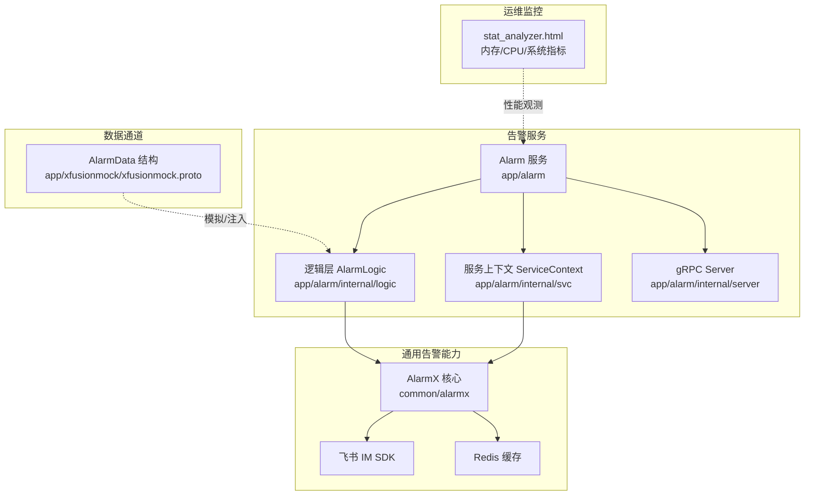
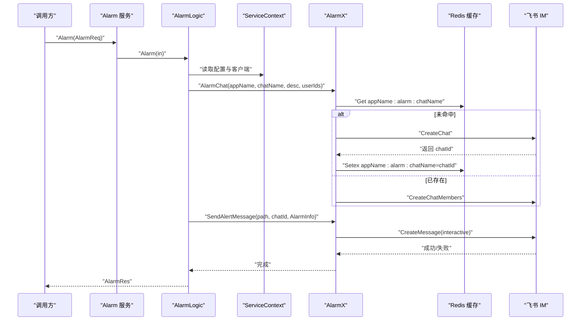
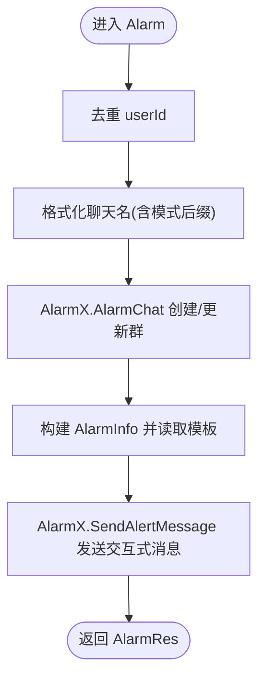
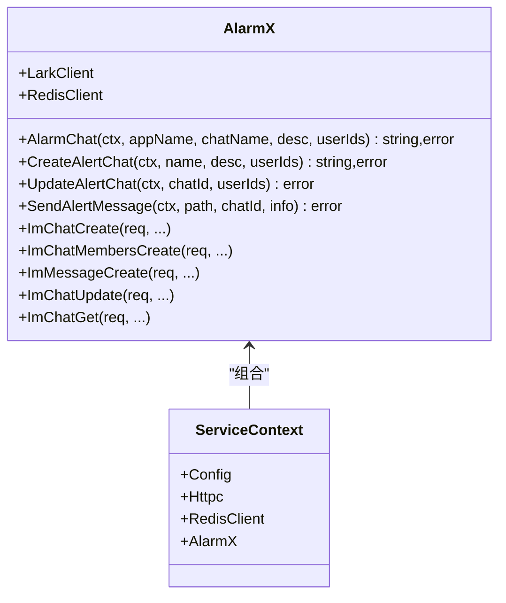
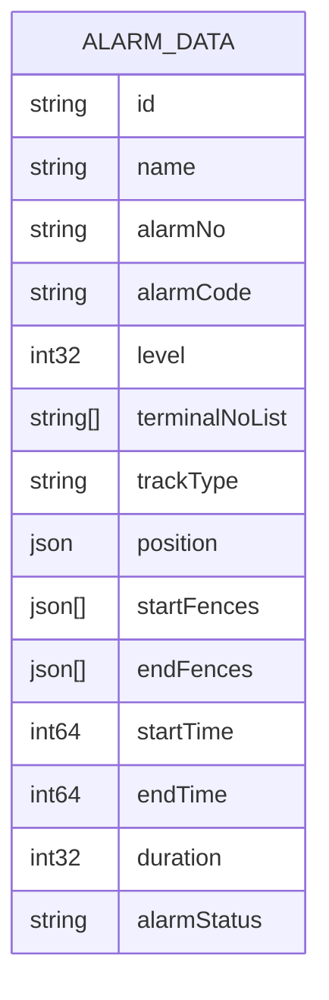
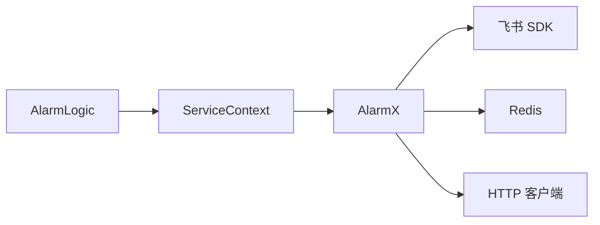

# 告警策略优化

<cite>
**本文引用的文件**   
- [app/alarm/etc/alarm.yaml](file://app/alarm/etc/alarm.yaml)
- [app/alarm/internal/config/config.go](file://app/alarm/internal/config/config.go)
- [app/alarm/internal/logic/alarmlogic.go](file://app/alarm/internal/logic/alarmlogic.go)
- [common/alarmx/alarmx.go](file://common/alarmx/alarmx.go)
- [app/alarm/alarm.proto](file://app/alarm/alarm.proto)
- [app/alarm/alarm.json](file://app/alarm/alarm.json)
- [app/alarm/internal/svc/servicecontext.go](file://app/alarm/internal/svc/servicecontext.go)
- [app/alarm/internal/server/alarmserver.go](file://app/alarm/internal/server/alarmserver.go)
- [app/xfusionmock/xfusionmock.proto](file://app/xfusionmock/xfusionmock.proto)
- [deploy/stat_analyzer.html](file://deploy/stat_analyzer.html)
- [go.mod](file://go.mod)
</cite>

## 目录
1. [简介](#简介)
2. [项目结构](#项目结构)
3. [核心组件](#核心组件)
4. [架构总览](#架构总览)
5. [详细组件分析](#详细组件分析)
6. [依赖分析](#依赖分析)
7. [性能考虑](#性能考虑)
8. [故障排查指南](#故障排查指南)
9. [结论](#结论)
10. [附录](#附录)

## 简介
本指南围绕 zero-service 的告警策略优化展开，结合现有告警子系统与相关数据通道，系统性阐述告警风暴识别与处理（聚合、去重、抑制、静默）、告警降噪（噪声过滤、异常检测、智能降噪）、告警收敛（合并、分级、批量）、动态调整（自适应、人工干预、外部触发）、A/B 测试方法、性能优化（内存/CPU/带宽）以及评估指标（准确率、召回率、F1、误报率）。文档以代码为依据，辅以可视化图示，帮助读者快速落地。

## 项目结构
- 告警服务模块位于 app/alarm，提供 gRPC 服务 Alarm，负责告警聊天群创建与维护、消息卡片构建与发送、用户拉群等能力。
- 告警核心逻辑位于 common/alarmx，封装飞书 IM SDK 调用、Redis 缓存聊天会话、消息卡片模板渲染等。
- 数据通道方面，app/xfusionmock 提供 AlarmData 等结构，可用于模拟告警事件，支撑策略验证与 A/B 测试。
- 运维侧，deploy/stat_analyzer.html 提供内存/CPU/系统指标可视化，便于评估策略对资源的影响。

**图示来源**
- [app/alarm/internal/server/alarmserver.go:15-35](file://app/alarm/internal/server/alarmserver.go#L15-L35)
- [app/alarm/internal/logic/alarmlogic.go:31-63](file://app/alarm/internal/logic/alarmlogic.go#L31-L63)
- [common/alarmx/alarmx.go:29-51](file://common/alarmx/alarmx.go#L29-L51)
- [app/xfusionmock/xfusionmock.proto:153-187](file://app/xfusionmock/xfusionmock.proto#L153-L187)
- [deploy/stat_analyzer.html:297-313](file://deploy/stat_analyzer.html#L297-L313)

**章节来源**
- [app/alarm/etc/alarm.yaml:1-26](file://app/alarm/etc/alarm.yaml#L1-L26)
- [app/alarm/internal/config/config.go:5-15](file://app/alarm/internal/config/config.go#L5-L15)
- [app/alarm/internal/svc/servicecontext.go:13-32](file://app/alarm/internal/svc/servicecontext.go#L13-L32)
- [app/alarm/internal/server/alarmserver.go:15-35](file://app/alarm/internal/server/alarmserver.go#L15-L35)
- [common/alarmx/alarmx.go:29-51](file://common/alarmx/alarmx.go#L29-L51)
- [app/xfusionmock/xfusionmock.proto:153-187](file://app/xfusionmock/xfusionmock.proto#L153-L187)
- [deploy/stat_analyzer.html:297-313](file://deploy/stat_analyzer.html#L297-L313)

## 核心组件
- Alarm 服务：提供 Ping 与 Alarm 两个 RPC 方法，Alarm 用于接收告警请求并执行群聊与消息发送。
- AlarmLogic：实现告警主流程，包括用户去重、聊天名格式化、调用 AlarmX 创建或更新聊天群、发送交互式卡片消息。
- AlarmX：封装飞书 IM 能力与 Redis 缓存，负责聊天群生命周期管理与消息发送；支持从模板文件渲染卡片内容。
- ServiceContext：初始化 Redis、HTTP 客户端与 AlarmX 实例，注入到各逻辑层。
- AlarmData：来自 xfusionmock 的告警数据结构，包含告警级别、起止时间、持续时长、终端列表等，可用于策略输入。

**章节来源**
- [app/alarm/alarm.proto:30-33](file://app/alarm/alarm.proto#L30-L33)
- [app/alarm/internal/logic/alarmlogic.go:31-63](file://app/alarm/internal/logic/alarmlogic.go#L31-L63)
- [common/alarmx/alarmx.go:53-140](file://common/alarmx/alarmx.go#L53-L140)
- [app/alarm/internal/svc/servicecontext.go:20-31](file://app/alarm/internal/svc/servicecontext.go#L20-L31)
- [app/xfusionmock/xfusionmock.proto:153-187](file://app/xfusionmock/xfusionmock.proto#L153-L187)

## 架构总览
下图展示从告警请求到飞书群聊与卡片消息的完整链路，以及与 Redis 缓存的关系。

**图示来源**
- [app/alarm/internal/server/alarmserver.go:31-34](file://app/alarm/internal/server/alarmserver.go#L31-L34)
- [app/alarm/internal/logic/alarmlogic.go:31-63](file://app/alarm/internal/logic/alarmlogic.go#L31-L63)
- [common/alarmx/alarmx.go:53-140](file://common/alarmx/alarmx.go#L53-L140)
- [app/alarm/etc/alarm.yaml:8-11](file://app/alarm/etc/alarm.yaml#L8-L11)

## 详细组件分析

### 组件一：Alarm 服务与逻辑层
- 职责：接收告警请求，去重用户列表，格式化聊天名，调用 AlarmX 完成群聊与消息发送。
- 关键点：
  - 用户去重：使用流式处理对 userId 去重，避免重复拉人。
  - 聊天名后缀：根据运行模式追加后缀，便于区分环境。
  - 卡片模板：通过 alarm.json 渲染交互式卡片，包含标题、项目、时间、事件 ID、内容、错误、IP、按钮等字段。

**图示来源**
- [app/alarm/internal/logic/alarmlogic.go:31-63](file://app/alarm/internal/logic/alarmlogic.go#L31-L63)
- [app/alarm/alarm.json:1-75](file://app/alarm/alarm.json#L1-L75)

**章节来源**
- [app/alarm/internal/logic/alarmlogic.go:31-63](file://app/alarm/internal/logic/alarmlogic.go#L31-L63)
- [app/alarm/alarm.json:1-75](file://app/alarm/alarm.json#L1-L75)

### 组件二：AlarmX 核心能力
- 聊天群管理：优先从 Redis 读取 chatId，不存在则调用飞书创建群并写入缓存；存在则拉人入群。
- 消息发送：读取模板文件，替换占位符，构造交互式卡片消息并发送。
- 飞书集成：封装 CreateChat、CreateChatMembers、CreateMessage、UpdateChat、GetChat 等接口。
- 安全转义：EscapeString 对日志内容进行安全转义，防止控制字符影响日志解析。

**图示来源**
- [common/alarmx/alarmx.go:29-51](file://common/alarmx/alarmx.go#L29-L51)
- [common/alarmx/alarmx.go:53-140](file://common/alarmx/alarmx.go#L53-L140)
- [app/alarm/internal/svc/servicecontext.go:13-31](file://app/alarm/internal/svc/servicecontext.go#L13-L31)

**章节来源**
- [common/alarmx/alarmx.go:53-140](file://common/alarmx/alarmx.go#L53-L140)
- [app/alarm/internal/svc/servicecontext.go:20-31](file://app/alarm/internal/svc/servicecontext.go#L20-L31)

### 组件三：数据通道与策略输入
- AlarmData：包含告警唯一标识、名称、编号、类型编码、等级、终端列表、轨迹信息、位置、起止时间、持续时长、状态等字段，是策略输入的核心载体。
- 可用于：
  - 告警风暴识别：基于终端列表、起止时间、持续时长、等级等特征聚合。
  - 去重与抑制：按告警类型编码、终端列表、位置、时间窗口进行去重与抑制。
  - 分级与收敛：按等级与持续时长进行分级与合并。
  - A/B 测试：注入不同 AlarmData，对比策略效果。

**图示来源**
- [app/xfusionmock/xfusionmock.proto:153-187](file://app/xfusionmock/xfusionmock.proto#L153-L187)

**章节来源**
- [app/xfusionmock/xfusionmock.proto:153-187](file://app/xfusionmock/xfusionmock.proto#L153-L187)

### 组件四：配置与部署
- alarm.yaml：定义服务监听、日志、Redis、飞书应用参数与用户列表、模板路径等。
- config.go：定义 Config 结构，承载 alarm.rpc 的配置项。
- ServiceContext 初始化 Redis、HTTP 客户端与 AlarmX，确保服务可用。

**章节来源**
- [app/alarm/etc/alarm.yaml:1-26](file://app/alarm/etc/alarm.yaml#L1-L26)
- [app/alarm/internal/config/config.go:5-15](file://app/alarm/internal/config/config.go#L5-L15)
- [app/alarm/internal/svc/servicecontext.go:20-31](file://app/alarm/internal/svc/servicecontext.go#L20-L31)

## 依赖分析
- 外部依赖：
  - 飞书 SDK：用于 IM 能力调用。
  - Redis：用于缓存聊天会话 ID，降低重复创建成本。
  - HTTP 客户端：用于 SDK 请求转发。
- 内部依赖：
  - AlarmLogic 依赖 ServiceContext，ServiceContext 组合 AlarmX。
  - AlarmX 依赖 Redis 与 Lark 客户端。

**图示来源**
- [app/alarm/internal/logic/alarmlogic.go:17-29](file://app/alarm/internal/logic/alarmlogic.go#L17-L29)
- [app/alarm/internal/svc/servicecontext.go:20-31](file://app/alarm/internal/svc/servicecontext.go#L20-L31)
- [common/alarmx/alarmx.go:46-51](file://common/alarmx/alarmx.go#L46-L51)

**章节来源**
- [go.mod:28-28](file://go.mod#L28-L28)
- [go.mod:14-14](file://go.mod#L14-L14)
- [go.mod:49-49](file://go.mod#L49-L49)

## 性能考虑
- 内存使用：
  - AlarmX 在构建卡片时读取模板文件，建议缓存模板内容，减少磁盘 IO 与字符串拼接开销。
  - EscapeString 对日志内容进行转义，避免大文本导致的额外内存分配。
- CPU 消耗：
  - 去重与字符串替换操作较多，建议使用更高效的去重算法与批量替换策略。
  - AlarmChat 优先从 Redis 读取，减少飞书 API 调用次数。
- 网络带宽：
  - 批量发送消息时，尽量合并请求，减少 RTT。
  - 控制消息大小，避免超大卡片内容导致带宽占用。
- 运维观测：
  - 使用 deploy/stat_analyzer.html 的内存/CPU/系统指标图表，定期评估策略对资源的影响，及时发现异常波动。

**章节来源**
- [common/alarmx/alarmx.go:163-185](file://common/alarmx/alarmx.go#L163-L185)
- [common/alarmx/alarmx.go:192-222](file://common/alarmx/alarmx.go#L192-L222)
- [deploy/stat_analyzer.html:297-313](file://deploy/stat_analyzer.html#L297-L313)

## 故障排查指南
- 常见问题定位：
  - 群聊创建失败：检查飞书 AppId/AppSecret、VerificationToken、EncryptKey 配置是否正确。
  - 拉人入群失败：确认 userId 列表有效性与权限。
  - 模板渲染失败：检查 alarm.json 文件是否存在、字段占位符是否匹配。
  - Redis 缓存异常：确认 Redis 地址、Key 命名规范与过期时间设置。
- 日志与可观测性：
  - AlarmX 在关键步骤记录错误日志，便于定位具体失败环节。
  - 使用 stat_analyzer.html 的内存/CPU 图表，观察策略执行期间的资源变化。

**章节来源**
- [app/alarm/etc/alarm.yaml:18-25](file://app/alarm/etc/alarm.yaml#L18-L25)
- [common/alarmx/alarmx.go:89-96](file://common/alarmx/alarmx.go#L89-L96)
- [common/alarmx/alarmx.go:109-116](file://common/alarmx/alarmx.go#L109-L116)
- [app/alarm/alarm.json:1-75](file://app/alarm/alarm.json#L1-L75)
- [deploy/stat_analyzer.html:297-313](file://deploy/stat_analyzer.html#L297-L313)

## 结论
通过 Alarm 服务与 AlarmX 的协同，zero-service 已具备告警群聊与消息卡片的基础能力。结合 AlarmData 的结构化输入与 Redis 缓存，可在不改动现有服务的前提下，扩展实现告警风暴识别与处理、降噪、收敛、动态调整与 A/B 测试等高级策略。配合 stat_analyzer.html 的性能观测，可实现策略的闭环优化与稳定运行。

## 附录

### 告警风暴识别与处理
- 聚合：基于时间窗口（如 1 分钟）与告警类型编码、终端列表、位置等维度进行聚合，生成聚合告警。
- 去重：对同一窗口内的重复告警进行去重，保留关键字段。
- 抑制：对“已解决”或“已屏蔽”的告警在后续窗口内抑制新告警。
- 静默：对特定终端或区域在指定时间段内静默告警，避免无效噪音。

### 告警降噪
- 噪声过滤：基于阈值与规则过滤低价值告警（如短时抖动、重复高频）。
- 异常检测：利用统计模型或机器学习检测异常模式（如持续时长异常、等级跃迁）。
- 智能降噪：结合历史数据与上下文，动态调整降噪策略权重。

### 告警收敛
- 合并：将同一窗口内相似告警合并为一条，减少消息数量。
- 分级：按等级与持续时长进行分级，分别采用不同的收敛策略。
- 批量：批量发送聚合后的消息，降低 API 调用频次。

### 动态调整机制
- 自适应：根据告警速率与系统负载，自动调整时间窗口与阈值。
- 人工干预：提供管理界面或 API，允许管理员临时调整策略参数。
- 外部触发：对接外部系统（如运维平台）的事件，触发策略切换。

### A/B 测试方法
- 实验设计：将流量按比例分流至不同策略组，记录关键指标。
- 效果评估：对比准确率、召回率、F1、误报率等指标，评估策略优劣。
- 参数调优：基于评估结果迭代优化阈值、窗口与权重参数。

### 性能优化清单
- 内存：缓存模板与去重集合，减少重复分配。
- CPU：批量处理与合并请求，减少循环与字符串操作。
- 带宽：压缩消息体，限制卡片大小，合并网络请求。

### 评估指标
- 准确率：正确告警占比。
- 召回率：实际告警被召回的比例。
- F1 分数：准确率与召回率的调和平均。
- 误报率：非真实告警占比。