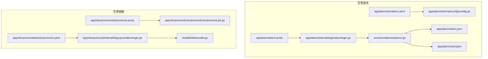
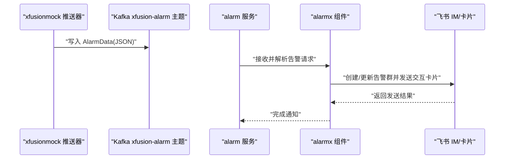
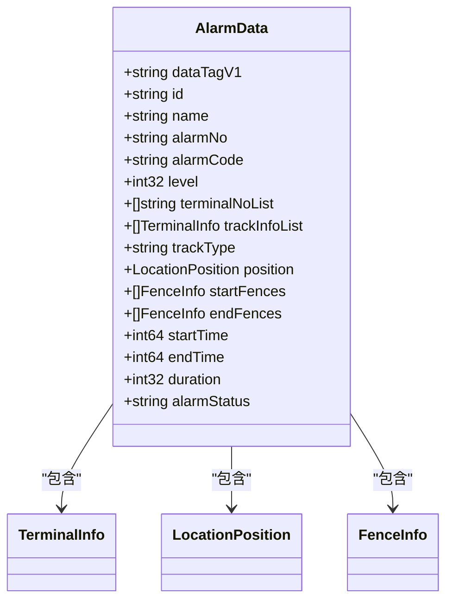
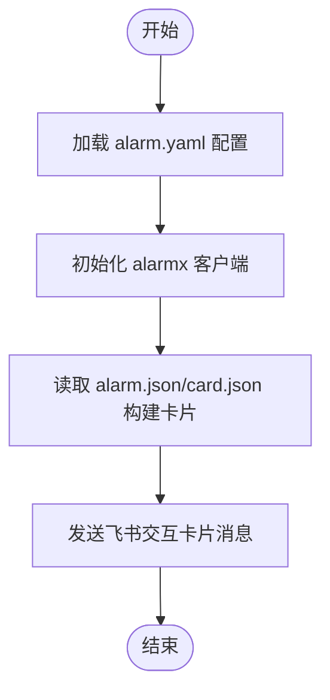
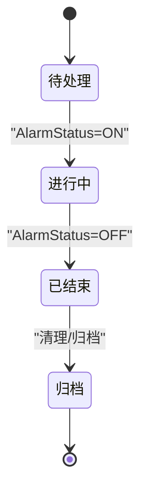
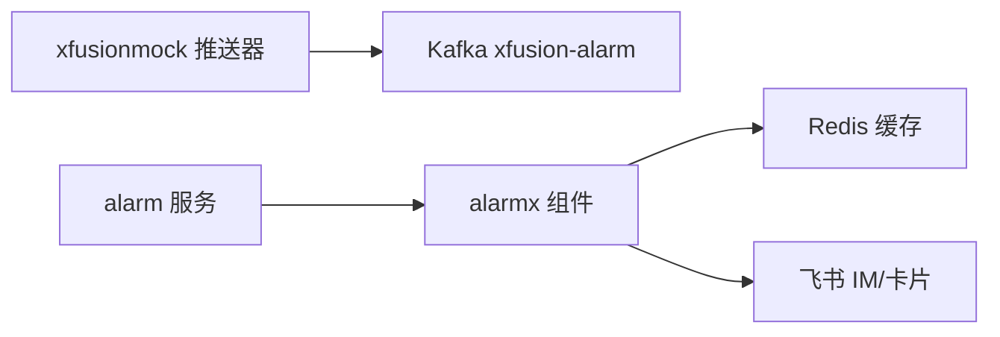

# 告警类型分类

<cite>
**本文引用的文件**
- [app/alarm/alarm.proto](file://app/alarm/alarm.proto)
- [app/alarm/alarm.json](file://app/alarm/alarm.json)
- [app/alarm/card.json](file://app/alarm/card.json)
- [common/alarmx/alarmx.go](file://common/alarmx/alarmx.go)
- [app/alarm/etc/alarm.yaml](file://app/alarm/etc/alarm.yaml)
- [app/alarm/internal/logic/alarmlogic.go](file://app/alarm/internal/logic/alarmlogic.go)
- [app/alarm/internal/config/config.go](file://app/alarm/internal/config/config.go)
- [app/xfusionmock/etc/xfusionmock.yaml](file://app/xfusionmock/etc/xfusionmock.yaml)
- [app/xfusionmock/internal/logic/pushalarmlogic.go](file://app/xfusionmock/internal/logic/pushalarmlogic.go)
- [app/xfusionmock/xfusionmock.proto](file://app/xfusionmock/xfusionmock.proto)
- [app/xfusionmock/xfusionmock/xfusionmock.pb.go](file://app/xfusionmock/xfusionmock/xfusionmock.pb.go)
- [model/kafkamodel.go](file://model/kafkamodel.go)
</cite>

## 目录
1. [简介](#简介)
2. [项目结构](#项目结构)
3. [核心组件](#核心组件)
4. [架构总览](#架构总览)
5. [详细组件分析](#详细组件分析)
6. [依赖分析](#依赖分析)
7. [性能考虑](#性能考虑)
8. [故障排查指南](#故障排查指南)
9. [结论](#结论)
10. [附录](#附录)

## 简介
本指南围绕 zero-service 的告警类型分类体系，结合现有代码实现，系统性梳理告警的分类维度、级别定义、配置方法、组合与继承机制、生命周期管理以及最佳实践。重点基于以下能力：
- 告警数据模型与字段（类型编码、等级、主体、位置、围栏、时间等）
- 告警推送与通知流程（Kafka 推送、飞书交互卡片）
- 告警分组与通知（聊天群组、用户拉群、卡片模板）
- 告警类型枚举与随机生成逻辑（示例）

## 项目结构
与告警类型分类直接相关的模块与文件如下：
- 告警 RPC 服务与配置：app/alarm
- 告警数据模型与推送：app/xfusionmock、model
- 飞书告警通知与卡片：common/alarmx、app/alarm/alarm.json、app/alarm/card.json

**图表来源**
- [app/alarm/alarm.proto:1-34](file://app/alarm/alarm.proto#L1-L34)
- [app/alarm/etc/alarm.yaml:1-26](file://app/alarm/etc/alarm.yaml#L1-L26)
- [app/alarm/internal/logic/alarmlogic.go:1-184](file://app/alarm/internal/logic/alarmlogic.go#L1-L184)
- [app/alarm/internal/config/config.go:1-16](file://app/alarm/internal/config/config.go#L1-L16)
- [common/alarmx/alarmx.go:1-223](file://common/alarmx/alarmx.go#L1-L223)
- [app/alarm/alarm.json:1-75](file://app/alarm/alarm.json#L1-L75)
- [app/alarm/card.json:1-141](file://app/alarm/card.json#L1-L141)
- [app/xfusionmock/xfusionmock.proto:153-187](file://app/xfusionmock/xfusionmock.proto#L153-L187)
- [app/xfusionmock/xfusionmock/xfusionmock.pb.go:882-998](file://app/xfusionmock/xfusionmock/xfusionmock.pb.go#L882-L998)
- [app/xfusionmock/etc/xfusionmock.yaml:1-39](file://app/xfusionmock/etc/xfusionmock.yaml#L1-L39)
- [app/xfusionmock/internal/logic/pushalarmlogic.go:1-157](file://app/xfusionmock/internal/logic/pushalarmlogic.go#L1-L157)
- [model/kafkamodel.go:60-93](file://model/kafkamodel.go#L60-L93)

**章节来源**
- [app/alarm/alarm.proto:1-34](file://app/alarm/alarm.proto#L1-L34)
- [app/alarm/etc/alarm.yaml:1-26](file://app/alarm/etc/alarm.yaml#L1-L26)
- [app/alarm/internal/logic/alarmlogic.go:1-184](file://app/alarm/internal/logic/alarmlogic.go#L1-L184)
- [common/alarmx/alarmx.go:1-223](file://common/alarmx/alarmx.go#L1-L223)
- [app/xfusionmock/etc/xfusionmock.yaml:1-39](file://app/xfusionmock/etc/xfusionmock.yaml#L1-L39)

## 核心组件
- 告警数据模型与字段
  - 类型编码：AlarmCode（如区域闯入、超速、SOS 等）
  - 等级：Level（1-紧急、2-严重、3-警告）
  - 主体与终端：TrackInfoList、TerminalNoList
  - 地理位置与围栏：Position、StartFences、EndFences
  - 时间与状态：StartTime、EndTime、Duration、AlarmStatus
- 告警推送与通知
  - Kafka 推送：xfusionmock 将 AlarmData 推送到 xfusion-alarm 主题
  - 飞书通知：alarm 服务通过 alarmx 组件发送交互卡片消息
- 告警类型枚举与随机生成
  - 示例：pushalarmlogic 中定义了 AlarmCode 列表与名称映射，以及随机等级

**章节来源**
- [app/xfusionmock/xfusionmock.proto:153-187](file://app/xfusionmock/xfusionmock.proto#L153-L187)
- [app/xfusionmock/xfusionmock/xfusionmock.pb.go:882-998](file://app/xfusionmock/xfusionmock/xfusionmock.pb.go#L882-L998)
- [model/kafkamodel.go:60-93](file://model/kafkamodel.go#L60-L93)
- [app/xfusionmock/etc/xfusionmock.yaml:19-26](file://app/xfusionmock/etc/xfusionmock.yaml#L19-L26)
- [app/xfusionmock/internal/logic/pushalarmlogic.go:18-49](file://app/xfusionmock/internal/logic/pushalarmlogic.go#L18-L49)
- [common/alarmx/alarmx.go:18-27](file://common/alarmx/alarmx.go#L18-L27)

## 架构总览
下图展示了从告警生成到飞书卡片通知的整体流程。

**图表来源**
- [app/xfusionmock/etc/xfusionmock.yaml:19-26](file://app/xfusionmock/etc/xfusionmock.yaml#L19-L26)
- [app/xfusionmock/internal/logic/pushalarmlogic.go:69-120](file://app/xfusionmock/internal/logic/pushalarmlogic.go#L69-L120)
- [common/alarmx/alarmx.go:119-140](file://common/alarmx/alarmx.go#L119-L140)
- [app/alarm/internal/logic/alarmlogic.go:31-63](file://app/alarm/internal/logic/alarmlogic.go#L31-L63)

## 详细组件分析

### 告警数据模型与字段
- 字段要点
  - AlarmCode：告警类型编码，用于区分不同业务场景
  - Level：告警等级，用于区分紧急程度
  - TrackInfoList/TerminalNoList：关联主体与终端
  - Position/StartFences/EndFences：地理围栏与位置信息
  - StartTime/EndTime/Duration/AlarmStatus：时间与状态
- 数据来源
  - xfusionmock.proto 定义了 AlarmData 的字段
  - pb.go 与 model/kafkamodel.go 提供运行时结构

**图表来源**
- [app/xfusionmock/xfusionmock.proto:153-187](file://app/xfusionmock/xfusionmock.proto#L153-L187)
- [app/xfusionmock/xfusionmock/xfusionmock.pb.go:882-998](file://app/xfusionmock/xfusionmock/xfusionmock.pb.go#L882-L998)
- [model/kafkamodel.go:60-93](file://model/kafkamodel.go#L60-L93)

**章节来源**
- [app/xfusionmock/xfusionmock.proto:153-187](file://app/xfusionmock/xfusionmock.proto#L153-L187)
- [app/xfusionmock/xfusionmock/xfusionmock.pb.go:882-998](file://app/xfusionmock/xfusionmock/xfusionmock.pb.go#L882-L998)
- [model/kafkamodel.go:60-93](file://model/kafkamodel.go#L60-L93)

### 告警类型分类体系
- 按严重程度（等级 Level）
  - 1：紧急
  - 2：严重
  - 3：警告
  - 映射关系：Level 数值越大，严重程度越低
- 按业务领域（类型编码 AlarmCode）
  - 示例类型：区域闯入、区域离开、人员聚集、车辆超员、人员缺员、设备低电量、车辆超速、人员滞留、SOS、设备静止、车辆停留、车辆碰撞、车辆设备位移等
  - 建议：以 AlarmCode 作为业务域的主键标识，便于后续规则引擎与策略配置
- 按触发方式（建议扩展）
  - 当前未在 AlarmData 中显式字段区分“阈值型/趋势型/异常型/复合型”，可在 AlarmCode 或扩展字段中体现
  - 建议：新增 TriggerType 字段或在 AlarmCode 命名中携带触发方式语义（如 *_THRESHOLD_*、*_TREND_* 等）

说明：以上分类为基于现有 Level 与 AlarmCode 的直接映射；触发方式分类为扩展建议，需在模型与规则层补充。

**章节来源**
- [app/xfusionmock/internal/logic/pushalarmlogic.go:18-49](file://app/xfusionmock/internal/logic/pushalarmlogic.go#L18-L49)
- [app/xfusionmock/xfusionmock/xfusionmock.pb.go:895-896](file://app/xfusionmock/xfusionmock/xfusionmock.pb.go#L895-L896)

### 告警级别与响应级别映射
- 现状：Level 与响应级别未在代码中显式映射
- 建议映射（示例）
  - Level 1 → 响应级别 P0（线上事故处理）
  - Level 2 → 响应级别 P1
  - Level 3 → 响应级别 P2/P3
- 实施要点
  - 在 alarm 请求中增加响应级别字段，或通过 AlarmCode 与 Level 的组合推导
  - 与飞书群组命名结合（例如按响应级别分组）

**章节来源**
- [app/alarm/alarm.proto:14-28](file://app/alarm/alarm.proto#L14-L28)
- [app/alarm/internal/logic/alarmlogic.go:31-63](file://app/alarm/internal/logic/alarmlogic.go#L31-L63)

### 告警类型的组合与继承机制
- 组合
  - AlarmData 可同时包含多个 TrackInfoList 与 TerminalNoList，支持多主体/多终端关联
  - 可通过 AlarmCode 组合表达复合场景（如“超速+SOS”）
- 继承
  - 当前未见显式继承结构；可通过 AlarmCode 命名约定或规则引擎实现“子类型”继承
- 扩展建议
  - 引入 AlarmCategory/AlarmSubtype 字段，或在 AlarmCode 中使用层级分隔符（如 TYPE.SUBTYPE）

**章节来源**
- [app/xfusionmock/xfusionmock/xfusionmock.pb.go:898-900](file://app/xfusionmock/xfusionmock/xfusionmock.pb.go#L898-L900)

### 告警类型配置方法
- Kafka 推送配置
  - xfusionmock.yaml 指定 KafkaBrokers、Topic（xfusion-alarm）等
- 告警服务配置
  - alarm.yaml 指定 Redis、AppId/AppSecret/EncryptKey/VerificationToken、UserId、卡片路径等
- 卡片模板
  - alarm.json 与 card.json 定义飞书交互卡片结构与占位符

**图表来源**
- [app/alarm/etc/alarm.yaml:1-26](file://app/alarm/etc/alarm.yaml#L1-L26)
- [common/alarmx/alarmx.go:163-184](file://common/alarmx/alarmx.go#L163-L184)
- [app/alarm/alarm.json:1-75](file://app/alarm/alarm.json#L1-L75)
- [app/alarm/card.json:1-141](file://app/alarm/card.json#L1-L141)

**章节来源**
- [app/xfusionmock/etc/xfusionmock.yaml:19-26](file://app/xfusionmock/etc/xfusionmock.yaml#L19-L26)
- [app/alarm/etc/alarm.yaml:18-25](file://app/alarm/etc/alarm.yaml#L18-L25)
- [common/alarmx/alarmx.go:119-140](file://common/alarmx/alarmx.go#L119-L140)

### 告警类型的生命周期管理
- 创建
  - 生成 AlarmNo（带日期与序号）、随机 AlarmCode 与 Level
- 修改
  - 可通过 AlarmStatus（ON/OFF）表示进行中/已结束
- 停用/删除
  - 建议：通过 AlarmStatus 标记结束，并在下游清理或归档
- 建议的扩展
  - 引入状态机（待办/处理中/已解决/已忽略/归档）
  - 引入版本字段，支持历史对比与审计

**图表来源**
- [app/xfusionmock/xfusionmock/xfusionmock.pb.go:921-930](file://app/xfusionmock/xfusionmock/xfusionmock.pb.go#L921-L930)
- [model/kafkamodel.go:91-93](file://model/kafkamodel.go#L91-L93)

**章节来源**
- [app/xfusionmock/internal/logic/pushalarmlogic.go:122-133](file://app/xfusionmock/internal/logic/pushalarmlogic.go#L122-L133)
- [app/xfusionmock/xfusionmock/xfusionmock.pb.go:921-930](file://app/xfusionmock/xfusionmock/xfusionmock.pb.go#L921-L930)
- [model/kafkamodel.go:91-93](file://model/kafkamodel.go#L91-L93)

### 最佳实践
- 命名规范
  - AlarmCode 使用大写英文+下划线风格，语义明确（如 OVER_SPEED、SOS）
  - AlarmNo 使用 ALARM-YYYYMMDD-NNNN 格式
- 分类原则
  - 以业务域为主（系统/业务/安全/性能），通过 AlarmCode 命名体现
  - 触发方式建议在 AlarmCode 中隐含（如 *_THRESHOLD_、*_TREND_）
- 扩展方法
  - 新增字段（如 TriggerType、Category/Subtype、Priority）需同步到模型与校验
  - 通过规则引擎对 AlarmCode 与 Level 进行策略化处理
- 配置与部署
  - Kafka 主题与消费者组分离，确保高可用
  - alarm.yaml 中的飞书密钥与卡片路径集中管理

**章节来源**
- [app/xfusionmock/internal/logic/pushalarmlogic.go:18-49](file://app/xfusionmock/internal/logic/pushalarmlogic.go#L18-L49)
- [app/xfusionmock/etc/xfusionmock.yaml:19-26](file://app/xfusionmock/etc/xfusionmock.yaml#L19-L26)
- [app/alarm/etc/alarm.yaml:18-25](file://app/alarm/etc/alarm.yaml#L18-L25)

## 依赖分析
- 组件耦合
  - xfusionmock 仅负责生成 AlarmData 并推送至 Kafka
  - alarm 服务依赖 alarmx 完成飞书通知
  - alarmx 依赖 Redis 缓存群组信息，依赖飞书 SDK 发送卡片
- 外部依赖
  - Kafka：xfusion-alarm 主题
  - 飞书：IM/消息/群组接口
  - Redis：缓存群组 ID

**图表来源**
- [app/xfusionmock/etc/xfusionmock.yaml:19-26](file://app/xfusionmock/etc/xfusionmock.yaml#L19-L26)
- [common/alarmx/alarmx.go:53-76](file://common/alarmx/alarmx.go#L53-L76)
- [app/alarm/etc/alarm.yaml:8-11](file://app/alarm/etc/alarm.yaml#L8-L11)

**章节来源**
- [app/xfusionmock/etc/xfusionmock.yaml:19-26](file://app/xfusionmock/etc/xfusionmock.yaml#L19-L26)
- [common/alarmx/alarmx.go:53-76](file://common/alarmx/alarmx.go#L53-L76)
- [app/alarm/etc/alarm.yaml:8-11](file://app/alarm/etc/alarm.yaml#L8-L11)

## 性能考虑
- Kafka 吞吐
  - 调整分区数与副本，确保 xfusion-alarm 主题具备足够吞吐
- 告警卡片渲染
  - 卡片模板尽量简洁，减少动态图片上传
- 群组缓存
  - Redis 缓存飞书群组 ID，降低重复创建成本

## 故障排查指南
- 飞书消息发送失败
  - 检查 AppId/AppSecret/EncryptKey/VerificationToken 是否正确
  - 查看 alarmx 返回的错误码与日志
- 群组创建/成员拉取失败
  - 核对用户 ID 列表是否有效
  - 检查 Redis 连接与过期时间
- Kafka 推送失败
  - 检查 KafkaBroker 地址、主题是否存在、权限是否正确

**章节来源**
- [common/alarmx/alarmx.go:89-96](file://common/alarmx/alarmx.go#L89-L96)
- [common/alarmx/alarmx.go:108-116](file://common/alarmx/alarmx.go#L108-L116)
- [app/alarm/etc/alarm.yaml:18-25](file://app/alarm/etc/alarm.yaml#L18-L25)

## 结论
- 现有实现以 Level 与 AlarmCode 为核心，分别承担严重程度与业务域的分类职责
- 建议在保持现有字段不变的前提下，引入触发方式与状态机等扩展，完善复杂场景支持
- 通过 AlarmCode 命名约定与规则引擎，可实现告警类型的组合与继承
- 生命周期管理建议以 AlarmStatus 与扩展状态字段配合，支撑完整的运维闭环

## 附录
- 关键字段速览
  - AlarmCode：告警类型编码
  - Level：告警等级（1-紧急、2-严重、3-警告）
  - AlarmStatus：告警状态（ON/OFF）
  - TrackInfoList/TerminalNoList：关联主体与终端
  - Position/StartFences/EndFences：地理围栏与位置
  - StartTime/EndTime/Duration：时间与持续时长