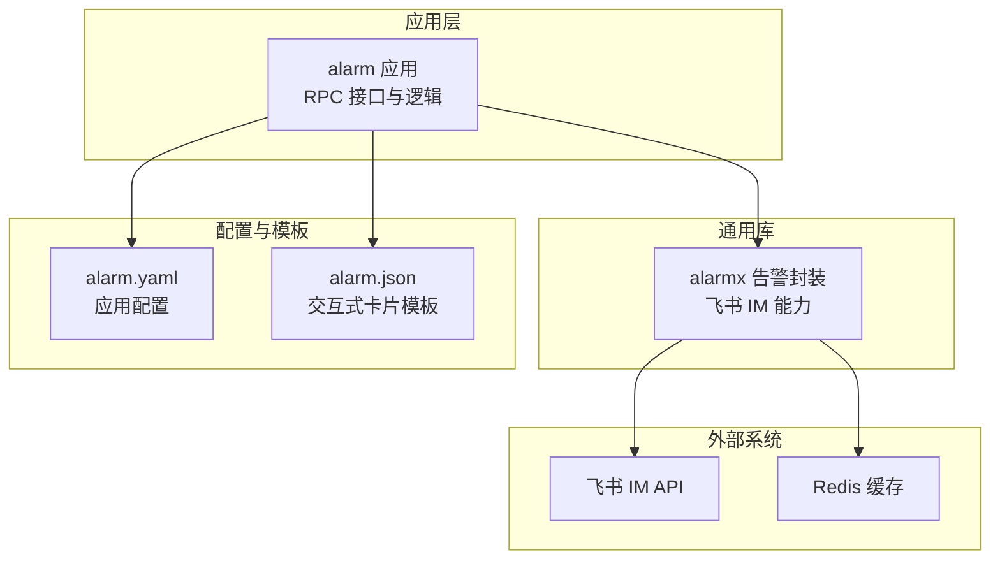
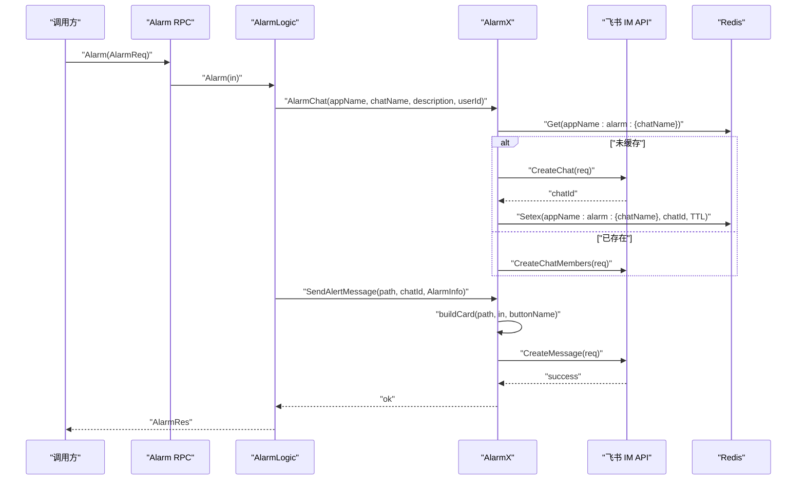
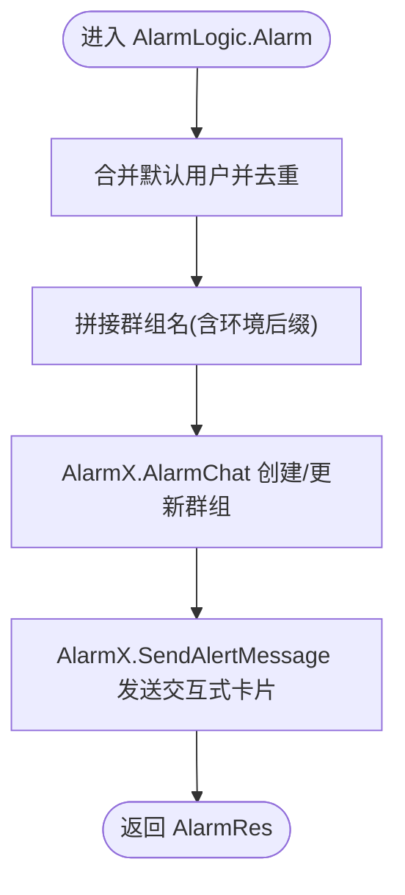
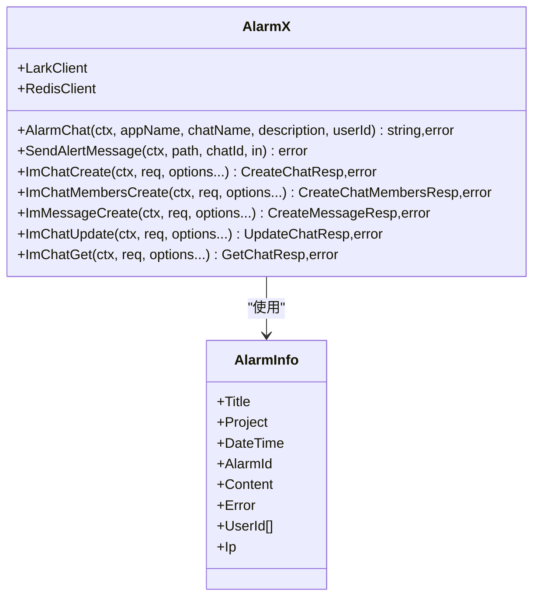
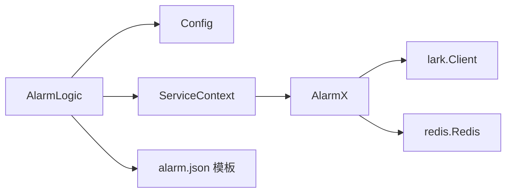

# 告警通知渠道

<cite>
**本文引用的文件**
- [app/alarm/etc/alarm.yaml](file://app/alarm/etc/alarm.yaml)
- [common/alarmx/alarmx.go](file://common/alarmx/alarmx.go)
- [app/alarm/internal/config/config.go](file://app/alarm/internal/config/config.go)
- [app/alarm/internal/svc/servicecontext.go](file://app/alarm/internal/svc/servicecontext.go)
- [app/alarm/internal/logic/alarmlogic.go](file://app/alarm/internal/logic/alarmlogic.go)
- [app/alarm/alarm.json](file://app/alarm/alarm.json)
- [app/alarm/alarm.proto](file://app/alarm/alarm.proto)
- [zerorpc/internal/logic/sendsmsverifycodelogic.go](file://zerorpc/internal/logic/sendsmsverifycodelogic.go)
</cite>

## 目录
1. [简介](#简介)
2. [项目结构](#项目结构)
3. [核心组件](#核心组件)
4. [架构总览](#架构总览)
5. [详细组件分析](#详细组件分析)
6. [依赖分析](#依赖分析)
7. [性能考虑](#性能考虑)
8. [故障排查指南](#故障排查指南)
9. [结论](#结论)
10. [附录](#附录)

## 简介
本指南面向 zero-service 的告警通知渠道，重点覆盖现有实现中的企业微信/飞书通知能力，并基于现有代码结构扩展说明如何接入与扩展其他通知渠道（如邮件、短信、钉钉、Slack 等）。文档从系统架构、组件职责、数据流、配置项、模板设计、监控统计、故障处理到扩展自定义通知方式提供完整说明，帮助在不改变核心流程的前提下安全、可靠地集成多种通知方式。

## 项目结构
与告警通知直接相关的模块与文件如下：
- 应用层：alarm 应用提供告警 RPC 接口与逻辑处理
- 通用库：alarmx 提供统一告警封装（飞书 IM 能力）
- 配置层：alarm.yaml 提供应用配置与告警通道参数
- 模板层：alarm.json 定义交互式卡片模板
- 其他参考：zerorpc 中短信验证码逻辑可作为短信通道的参考实现

图表来源
- [app/alarm/etc/alarm.yaml:1-26](file://app/alarm/etc/alarm.yaml#L1-L26)
- [common/alarmx/alarmx.go:1-223](file://common/alarmx/alarmx.go#L1-L223)
- [app/alarm/alarm.json:1-75](file://app/alarm/alarm.json#L1-L75)

章节来源
- [app/alarm/etc/alarm.yaml:1-26](file://app/alarm/etc/alarm.yaml#L1-L26)
- [app/alarm/internal/config/config.go:1-16](file://app/alarm/internal/config/config.go#L1-L16)
- [app/alarm/internal/svc/servicecontext.go:1-33](file://app/alarm/internal/svc/servicecontext.go#L1-L33)
- [app/alarm/internal/logic/alarmlogic.go:1-184](file://app/alarm/internal/logic/alarmlogic.go#L1-L184)
- [common/alarmx/alarmx.go:1-223](file://common/alarmx/alarmx.go#L1-L223)
- [app/alarm/alarm.json:1-75](file://app/alarm/alarm.json#L1-L75)

## 核心组件
- alarm 应用：提供 Alarm RPC 服务，接收告警请求，调用 alarmx 执行群组创建/维护与消息发送。
- alarmx：封装飞书 IM 能力，负责告警群组生命周期管理（创建/更新成员）、消息发送（交互式卡片）以及与飞书 API 的交互。
- 配置中心：alarm.yaml 中包含 Redis 连接、飞书 AppId/AppSecret/EncryptKey/VerificationToken、默认用户列表、模板路径等。
- 模板引擎：alarm.json 为交互式卡片模板，通过占位符注入告警信息；alarmx 在发送前进行字符串替换与转义。
- 参考短信通道：zerorpc 的短信验证码逻辑展示了如何结合 Redis 实现验证码存储与校验，可作为短信通道的参考模式。

章节来源
- [app/alarm/internal/logic/alarmlogic.go:31-63](file://app/alarm/internal/logic/alarmlogic.go#L31-L63)
- [common/alarmx/alarmx.go:53-140](file://common/alarmx/alarmx.go#L53-L140)
- [app/alarm/etc/alarm.yaml:18-26](file://app/alarm/etc/alarm.yaml#L18-L26)
- [app/alarm/alarm.json:1-75](file://app/alarm/alarm.json#L1-L75)
- [zerorpc/internal/logic/sendsmsverifycodelogic.go:29-42](file://zerorpc/internal/logic/sendsmsverifycodelogic.go#L29-L42)

## 架构总览
下图展示一次告警触发的端到端流程，包括请求进入、群组管理、消息发送与可选的卡片回调处理。

图表来源
- [app/alarm/internal/logic/alarmlogic.go:31-63](file://app/alarm/internal/logic/alarmlogic.go#L31-L63)
- [common/alarmx/alarmx.go:53-140](file://common/alarmx/alarmx.go#L53-L140)
- [app/alarm/etc/alarm.yaml:8-26](file://app/alarm/etc/alarm.yaml#L8-L26)

章节来源
- [app/alarm/internal/logic/alarmlogic.go:31-63](file://app/alarm/internal/logic/alarmlogic.go#L31-L63)
- [common/alarmx/alarmx.go:53-140](file://common/alarmx/alarmx.go#L53-L140)

## 详细组件分析

### 组件一：Alarm 应用与逻辑
- 职责：接收 AlarmReq，合并默认用户列表，去重后创建/更新告警群组，发送交互式卡片消息。
- 关键点：
  - 用户去重使用流式工具进行去重处理。
  - 群组名追加环境后缀以区分不同环境。
  - 调用 alarmx 的 AlarmChat 与 SendAlertMessage 完成通知。

图表来源
- [app/alarm/internal/logic/alarmlogic.go:31-63](file://app/alarm/internal/logic/alarmlogic.go#L31-L63)

章节来源
- [app/alarm/internal/logic/alarmlogic.go:31-63](file://app/alarm/internal/logic/alarmlogic.go#L31-L63)

### 组件二：AlarmX（飞书 IM 封装）
- 职责：封装飞书客户端、Redis 客户端，提供告警群组管理与消息发送能力。
- 关键方法：
  - AlarmChat：根据 appName:alarm:{chatName} 从 Redis 读取群组 ID；不存在则创建并写入缓存；存在则更新成员。
  - SendAlertMessage：读取模板文件，替换占位符，构造交互式消息并发送。
  - ImChatCreate/ImChatMembersCreate/ImMessageCreate/ImChatUpdate/ImChatGet：对飞书 IM API 的薄封装。
- 模板构建：buildCard 读取模板 JSON，按 AlarmInfo 字段进行占位符替换；EscapeString 对内容进行安全转义。

图表来源
- [common/alarmx/alarmx.go:18-160](file://common/alarmx/alarmx.go#L18-L160)

章节来源
- [common/alarmx/alarmx.go:18-160](file://common/alarmx/alarmx.go#L18-L160)

### 组件三：配置与服务上下文
- alarm.yaml：定义应用名、监听地址、日志、Redis、Alarmx 参数（AppId/AppSecret/EncryptKey/VerificationToken/UserId/Path）。
- ServiceContext：初始化 Redis 与 alarmx 客户端，注入到业务逻辑中。
- Config：定义 Alarmx 结构体字段，便于读取配置。

章节来源
- [app/alarm/etc/alarm.yaml:1-26](file://app/alarm/etc/alarm.yaml#L1-L26)
- [app/alarm/internal/svc/servicecontext.go:20-32](file://app/alarm/internal/svc/servicecontext.go#L20-L32)
- [app/alarm/internal/config/config.go:5-14](file://app/alarm/internal/config/config.go#L5-L14)

### 组件四：模板与消息格式
- alarm.json：定义交互式卡片的 header、elements 等结构，支持 Markdown 与占位符。
- 占位符：${title}/${project}/${dateTime}/${alarmId}/${content}/${error}/${ip}/${button_name}。
- 转义：EscapeString 对换行、制表符、引号、反斜杠及控制字符进行安全处理，避免消息异常。

章节来源
- [app/alarm/alarm.json:1-75](file://app/alarm/alarm.json#L1-L75)
- [common/alarmx/alarmx.go:163-222](file://common/alarmx/alarmx.go#L163-L222)

### 组件五：短信通道参考实现
- zerorpc 的短信验证码逻辑展示了验证码生成、Redis 存储与过期控制的模式，可作为短信通道的参考：
  - 验证码生成与缓存键命名规范
  - 非生产环境固定验证码便于测试
  - Redis NX+EX 原子性写入

章节来源
- [zerorpc/internal/logic/sendsmsverifycodelogic.go:29-42](file://zerorpc/internal/logic/sendsmsverifycodelogic.go#L29-L42)

## 依赖分析
- AlarmLogic 依赖 ServiceContext，后者持有 AlarmX 与 Redis 客户端。
- AlarmX 依赖 lark.Client 与 redis.Redis，负责与飞书 IM API 和 Redis 交互。
- 模板依赖 alarm.json 文件路径由配置提供。

图表来源
- [app/alarm/internal/logic/alarmlogic.go:31-63](file://app/alarm/internal/logic/alarmlogic.go#L31-L63)
- [app/alarm/internal/svc/servicecontext.go:20-32](file://app/alarm/internal/svc/servicecontext.go#L20-L32)
- [common/alarmx/alarmx.go:46-51](file://common/alarmx/alarmx.go#L46-L51)

章节来源
- [app/alarm/internal/logic/alarmlogic.go:31-63](file://app/alarm/internal/logic/alarmlogic.go#L31-L63)
- [app/alarm/internal/svc/servicecontext.go:20-32](file://app/alarm/internal/svc/servicecontext.go#L20-L32)
- [common/alarmx/alarmx.go:46-51](file://common/alarmx/alarmx.go#L46-L51)

## 性能考虑
- 群组缓存：AlarmChat 使用 Redis 缓存群组 ID，减少重复创建与成员更新开销。
- 请求超时：lark.Client 初始化时设置了请求超时，避免阻塞。
- 模板读取：模板一次性读取并替换，建议在进程内缓存模板内容以降低磁盘 IO。
- 并发与限流：当前实现未显式限流，建议在上层网关或业务侧增加速率限制，防止突发告警风暴。

章节来源
- [common/alarmx/alarmx.go:54-75](file://common/alarmx/alarmx.go#L54-L75)
- [app/alarm/internal/svc/servicecontext.go:26-30](file://app/alarm/internal/svc/servicecontext.go#L26-L30)

## 故障排查指南
- 飞书 API 失败
  - 现象：创建群组或发送消息返回非成功状态。
  - 排查：检查 AppId/AppSecret/EncryptKey/VerificationToken 是否正确；确认网络可达；查看日志中的错误码。
- Redis 连接失败
  - 现象：无法获取/设置群组缓存。
  - 排查：核对 alarm.yaml 中 Redis 地址与认证；确认 Redis 服务可用。
- 模板加载失败
  - 现象：发送消息时报错提示无法读取模板。
  - 排查：确认 alarm.yaml 中 Path 指向的模板文件存在且可读。
- 卡片按钮回调
  - 逻辑：alarmlogic 中预留了事件与卡片回调注册位置，可按需启用并实现处理逻辑（例如“已解决”状态变更）。

章节来源
- [common/alarmx/alarmx.go:87-96](file://common/alarmx/alarmx.go#L87-L96)
- [app/alarm/etc/alarm.yaml:8-26](file://app/alarm/etc/alarm.yaml#L8-L26)
- [app/alarm/internal/logic/alarmlogic.go:48-60](file://app/alarm/internal/logic/alarmlogic.go#L48-L60)

## 结论
当前实现以飞书 IM 为核心通知渠道，通过 alarmx 将群组管理与消息发送解耦，配置集中于 alarm.yaml，模板通过 alarm.json 管理。该架构具备良好的扩展性：可在保持 AlarmLogic 不变的前提下，新增通知通道（邮件、短信、钉钉、Slack 等），只需实现对应适配器并接入统一调度层即可。

## 附录

### 通知渠道集成步骤（通用模式）
- 新增配置项
  - 在 alarm.yaml 中为新渠道添加配置段，包含必要的鉴权参数与开关。
- 新增适配器
  - 参考 alarmx 的封装思路，抽象出统一接口（如 Send(ctx, channel, payload)）。
- 扩展调度层
  - 在 AlarmLogic 中增加渠道选择与路由逻辑（串行/并行）。
- 模板与变量
  - 为新渠道设计模板与变量映射，确保与 AlarmInfo 字段一致。
- 监控与统计
  - 记录发送成功率、送达率、响应时间等指标，便于评估与优化。
- 降级策略
  - 当上游不可用时，启用本地缓存/重试队列或切换备用渠道。

章节来源
- [app/alarm/etc/alarm.yaml:18-26](file://app/alarm/etc/alarm.yaml#L18-L26)
- [common/alarmx/alarmx.go:163-185](file://common/alarmx/alarmx.go#L163-L185)

### 飞书通知配置要点
- 必填参数：AppId、AppSecret、EncryptKey、VerificationToken
- 默认用户：UserId 列表用于首次创建群组时拉人
- 模板路径：Path 指向 alarm.json
- Redis：用于缓存群组 ID，提升性能

章节来源
- [app/alarm/etc/alarm.yaml:18-26](file://app/alarm/etc/alarm.yaml#L18-L26)

### 模板变量与格式化
- 变量清单：title、project、dateTime、alarmId、content、error、ip、button_name
- 格式化：EscapeString 对内容进行安全转义，避免消息解析异常
- Markdown：模板使用 lark_md 标签渲染富文本

章节来源
- [app/alarm/alarm.json:1-75](file://app/alarm/alarm.json#L1-L75)
- [common/alarmx/alarmx.go:163-222](file://common/alarmx/alarmx.go#L163-L222)

### 短信通道参考（zerorpc）
- 验证码生成与缓存：随机数生成、Redis NX+EX 原子写入、过期控制
- 测试环境：非生产模式固定验证码便于联调
- 可复用点：键命名规范、过期策略、错误处理

章节来源
- [zerorpc/internal/logic/sendsmsverifycodelogic.go:29-42](file://zerorpc/internal/logic/sendsmsverifycodelogic.go#L29-L42)