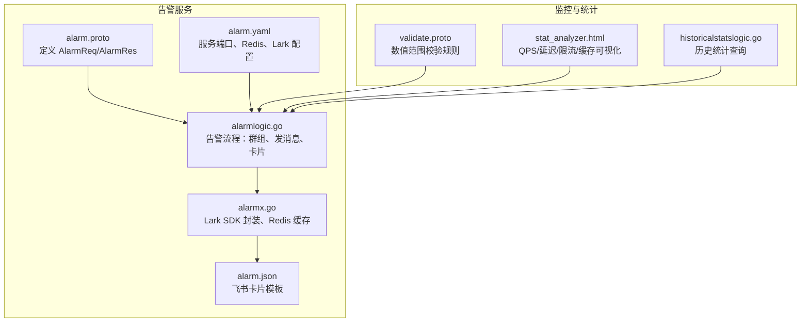
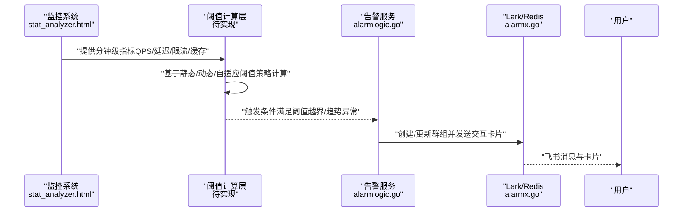
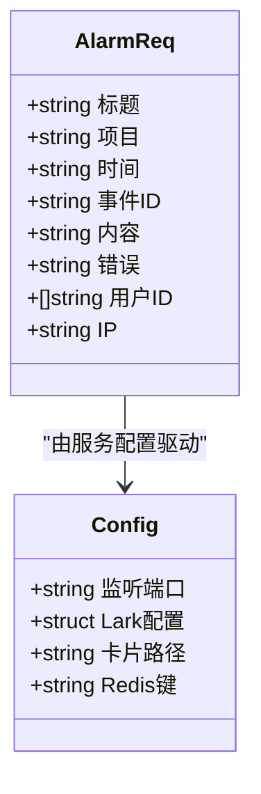
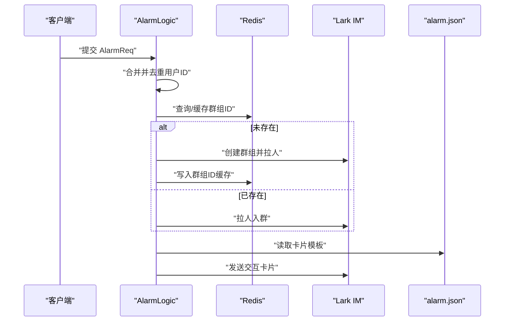
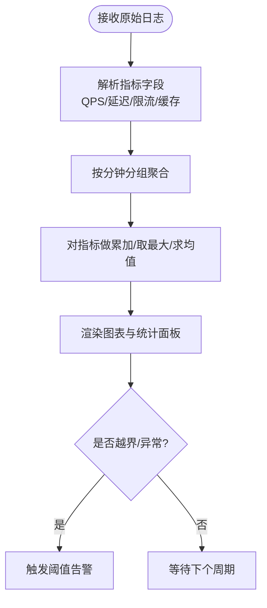
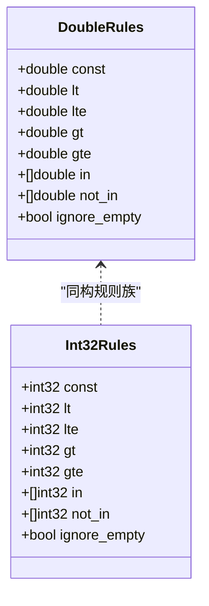
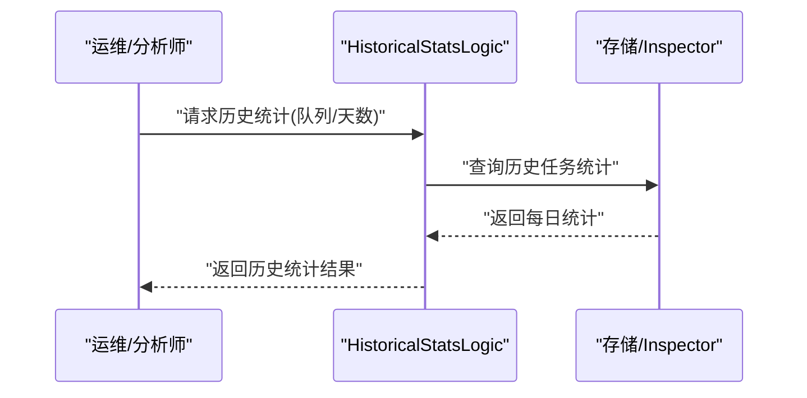
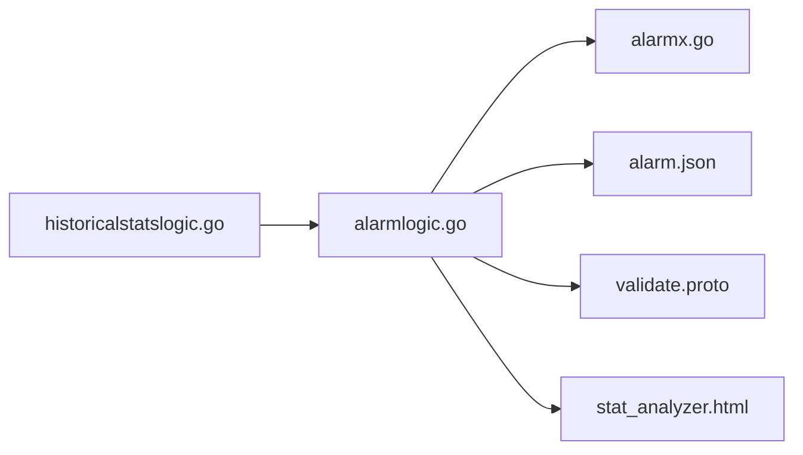

# 告警阈值设计

<cite>
**本文引用的文件**   
- [app/alarm/alarm.proto](file://app/alarm/alarm.proto)
- [app/alarm/etc/alarm.yaml](file://app/alarm/etc/alarm.yaml)
- [common/alarmx/alarmx.go](file://common/alarmx/alarmx.go)
- [app/alarm/alarm.json](file://app/alarm/alarm.json)
- [app/alarm/internal/logic/alarmlogic.go](file://app/alarm/internal/logic/alarmlogic.go)
- [deploy/stat_analyzer.html](file://deploy/stat_analyzer.html)
- [third_party/validate/validate.proto](file://third_party/validate/validate.proto)
- [app/trigger/internal/logic/historicalstatslogic.go](file://app/trigger/internal/logic/historicalstatslogic.go)
</cite>

## 目录
1. [简介](#简介)
2. [项目结构](#项目结构)
3. [核心组件](#核心组件)
4. [架构总览](#架构总览)
5. [详细组件分析](#详细组件分析)
6. [依赖分析](#依赖分析)
7. [性能考虑](#性能考虑)
8. [故障排查指南](#故障排查指南)
9. [结论](#结论)
10. [附录](#附录)

## 简介
本指南围绕 zero-service 的告警阈值设计进行系统化说明，目标是帮助读者在该工程中构建稳定、可维护、可演进的阈值体系。文档覆盖以下主题：
- 阈值类型与设计原则：静态阈值、动态阈值、自适应阈值
- 时间窗口配置：滑动窗口、固定窗口、指数加权移动平均（EWMA）
- 阈值类型分类：绝对阈值、相对阈值、百分比阈值、趋势阈值
- 阈值计算方法：统计学方法、机器学习方法、业务规则方法
- 验证与调优：A/B 测试、历史数据分析、专家经验
- 动态调整机制：自动调参、人工干预、外部因素影响

需要特别说明的是：在当前仓库中，告警服务主要负责“告警推送与卡片交互”，并未直接暴露具体的阈值计算逻辑；但项目提供了丰富的监控可视化与统计能力，可作为阈值设计与验证的重要支撑。

## 项目结构
与告警阈值设计直接相关的模块与文件如下：
- 告警服务：定义告警请求/响应协议、配置、逻辑实现与卡片模板
- 监控可视化：提供 QPS、延迟、限流、缓存命中率等指标的聚合与图表渲染
- 参数校验：通过第三方校验规则对阈值相关输入进行约束
- 历史统计：提供历史任务执行统计接口，可用于阈值调优的历史数据支撑

**图表来源**
- [app/alarm/alarm.proto:150-220](file://app/alarm/alarm.proto#L150-L220)
- [app/alarm/etc/alarm.yaml:1-26](file://app/alarm/etc/alarm.yaml#L1-L26)
- [app/alarm/internal/logic/alarmlogic.go:31-63](file://app/alarm/internal/logic/alarmlogic.go#L31-L63)
- [app/alarm/alarm.json:1-75](file://app/alarm/alarm.json#L1-L75)
- [common/alarmx/alarmx.go:18-51](file://common/alarmx/alarmx.go#L18-L51)
- [third_party/validate/validate.proto:104-138](file://third_party/validate/validate.proto#L104-L138)
- [deploy/stat_analyzer.html:1145-1327](file://deploy/stat_analyzer.html#L1145-L1327)
- [app/trigger/internal/logic/historicalstatslogic.go:28-42](file://app/trigger/internal/logic/historicalstatslogic.go#L28-L42)

**章节来源**
- [app/alarm/etc/alarm.yaml:1-26](file://app/alarm/etc/alarm.yaml#L1-L26)
- [app/alarm/internal/logic/alarmlogic.go:31-63](file://app/alarm/internal/logic/alarmlogic.go#L31-L63)
- [common/alarmx/alarmx.go:18-51](file://common/alarmx/alarmx.go#L18-L51)
- [app/alarm/alarm.json:1-75](file://app/alarm/alarm.json#L1-L75)
- [third_party/validate/validate.proto:104-138](file://third_party/validate/validate.proto#L104-L138)
- [deploy/stat_analyzer.html:1145-1327](file://deploy/stat_analyzer.html#L1145-L1327)
- [app/trigger/internal/logic/historicalstatslogic.go:28-42](file://app/trigger/internal/logic/historicalstatslogic.go#L28-L42)

## 核心组件
- 告警协议与配置
  - 协议定义：AlarmReq/AlarmRes，包含标题、项目、时间、事件 ID、内容、错误、用户 ID、IP 等字段
  - 配置项：监听端口、日志编码、Redis、Lark 应用凭据、卡片路径
- 告警逻辑
  - 聚合用户 ID、去重
  - 基于应用名与模式拼接群聊名，调用 alarmx 创建/更新群组
  - 读取卡片模板，构造交互卡片并发送
- 告警扩展
  - alarmx 提供 Lark IM 与 Redis 封装，便于后续接入更复杂的阈值判定与告警联动
- 监控与统计
  - 提供分钟级聚合的 QPS、延迟分位、限流统计、缓存命中率等指标，可用于阈值验证与调优

**章节来源**
- [app/alarm/alarm.proto:150-220](file://app/alarm/alarm.proto#L150-L220)
- [app/alarm/etc/alarm.yaml:1-26](file://app/alarm/etc/alarm.yaml#L1-L26)
- [app/alarm/internal/logic/alarmlogic.go:31-63](file://app/alarm/internal/logic/alarmlogic.go#L31-L63)
- [common/alarmx/alarmx.go:18-51](file://common/alarmx/alarmx.go#L18-L51)
- [app/alarm/alarm.json:1-75](file://app/alarm/alarm.json#L1-L75)
- [deploy/stat_analyzer.html:1145-1327](file://deploy/stat_analyzer.html#L1145-L1327)

## 架构总览
下图展示了“阈值设计—指标采集—阈值计算—告警触发”的整体流程。其中，阈值计算在当前仓库中未直接实现，但监控可视化与参数校验为阈值设计提供了基础能力。

**图表来源**
- [deploy/stat_analyzer.html:1145-1327](file://deploy/stat_analyzer.html#L1145-L1327)
- [app/alarm/internal/logic/alarmlogic.go:31-63](file://app/alarm/internal/logic/alarmlogic.go#L31-L63)
- [common/alarmx/alarmx.go:18-51](file://common/alarmx/alarmx.go#L18-L51)

## 详细组件分析

### 组件A：告警协议与配置
- 协议字段
  - 标题、项目、时间、事件 ID、内容、错误、用户 ID 列表、IP
- 配置要点
  - 监听端口、日志编码、Redis 键前缀、Lark 应用凭据、卡片模板路径
- 设计建议
  - 用户 ID 支持多用户，便于值班/升级通知
  - 卡片模板可按环境区分（例如通过模式后缀）

**图表来源**
- [app/alarm/alarm.proto:150-220](file://app/alarm/alarm.proto#L150-L220)
- [app/alarm/etc/alarm.yaml:1-26](file://app/alarm/etc/alarm.yaml#L1-L26)

**章节来源**
- [app/alarm/alarm.proto:150-220](file://app/alarm/alarm.proto#L150-L220)
- [app/alarm/etc/alarm.yaml:1-26](file://app/alarm/etc/alarm.yaml#L1-L26)

### 组件B：告警逻辑与卡片交互
- 关键流程
  - 合并并去重用户 ID
  - 拼接群组名并调用 alarmx 创建/更新群组
  - 读取 alarm.json 模板，构造交互卡片并发送
- 可扩展点
  - 在发送前接入阈值计算结果，决定是否触发告警
  - 增加卡片动作回调，支持“跟进/解决”状态流转

**图表来源**
- [app/alarm/internal/logic/alarmlogic.go:31-63](file://app/alarm/internal/logic/alarmlogic.go#L31-L63)
- [common/alarmx/alarmx.go:53-117](file://common/alarmx/alarmx.go#L53-L117)
- [app/alarm/alarm.json:1-75](file://app/alarm/alarm.json#L1-L75)

**章节来源**
- [app/alarm/internal/logic/alarmlogic.go:31-63](file://app/alarm/internal/logic/alarmlogic.go#L31-L63)
- [common/alarmx/alarmx.go:53-117](file://common/alarmx/alarmx.go#L53-L117)
- [app/alarm/alarm.json:1-75](file://app/alarm/alarm.json#L1-L75)

### 组件C：监控可视化与统计
- 数据聚合
  - 按分钟聚合 QPS、延迟分位、限流统计、缓存命中率等
  - 对系统指标采用最大值/均值聚合策略
- 图表能力
  - 支持缩放、滑块、全屏等交互，便于观察阈值边界与波动
- 阈值验证价值
  - 通过可视化对比阈值上下限与实际指标，辅助阈值调优

**图表来源**
- [deploy/stat_analyzer.html:1145-1327](file://deploy/stat_analyzer.html#L1145-L1327)

**章节来源**
- [deploy/stat_analyzer.html:1145-1327](file://deploy/stat_analyzer.html#L1145-L1327)

### 组件D：参数校验与阈值输入约束
- 数值范围校验
  - 支持常量、大于/小于、区间、包含/排除等规则
- 在阈值设计中的作用
  - 保证阈值输入合法，避免越界或非法配置导致误报/漏报

**图表来源**
- [third_party/validate/validate.proto:104-138](file://third_party/validate/validate.proto#L104-L138)

**章节来源**
- [third_party/validate/validate.proto:104-138](file://third_party/validate/validate.proto#L104-L138)

### 组件E：历史统计与阈值调优
- 历史统计接口
  - 提供历史任务执行统计，可用于评估阈值调优效果
- 阈值调优建议
  - 基于历史统计对比不同阈值下的误报/漏报情况，结合业务 SLA 进行权衡

**图表来源**
- [app/trigger/internal/logic/historicalstatslogic.go:28-42](file://app/trigger/internal/logic/historicalstatslogic.go#L28-L42)

**章节来源**
- [app/trigger/internal/logic/historicalstatslogic.go:28-42](file://app/trigger/internal/logic/historicalstatslogic.go#L28-L42)

## 依赖分析
- 告警服务依赖
  - alarmx：封装 Lark IM 与 Redis，提供群组管理与消息发送
  - alarm.json：卡片模板，承载告警内容与交互按钮
- 监控与统计依赖
  - stat_analyzer.html：前端可视化，提供阈值验证所需的观测界面
- 参数校验依赖
  - validate.proto：提供阈值输入的数值范围约束

**图表来源**
- [app/alarm/internal/logic/alarmlogic.go:31-63](file://app/alarm/internal/logic/alarmlogic.go#L31-L63)
- [common/alarmx/alarmx.go:18-51](file://common/alarmx/alarmx.go#L18-L51)
- [app/alarm/alarm.json:1-75](file://app/alarm/alarm.json#L1-L75)
- [third_party/validate/validate.proto:104-138](file://third_party/validate/validate.proto#L104-L138)
- [deploy/stat_analyzer.html:1145-1327](file://deploy/stat_analyzer.html#L1145-L1327)
- [app/trigger/internal/logic/historicalstatslogic.go:28-42](file://app/trigger/internal/logic/historicalstatslogic.go#L28-L42)

**章节来源**
- [app/alarm/internal/logic/alarmlogic.go:31-63](file://app/alarm/internal/logic/alarmlogic.go#L31-L63)
- [common/alarmx/alarmx.go:18-51](file://common/alarmx/alarmx.go#L18-L51)
- [app/alarm/alarm.json:1-75](file://app/alarm/alarm.json#L1-L75)
- [third_party/validate/validate.proto:104-138](file://third_party/validate/validate.proto#L104-L138)
- [deploy/stat_analyzer.html:1145-1327](file://deploy/stat_analyzer.html#L1145-L1327)
- [app/trigger/internal/logic/historicalstatslogic.go:28-42](file://app/trigger/internal/logic/historicalstatslogic.go#L28-L42)

## 性能考虑
- 告警服务
  - Redis 缓存群组 ID，减少重复创建群组的开销
  - 卡片模板本地读取，降低网络依赖
- 监控可视化
  - 分钟级聚合减少图表渲染压力
  - 滑动缩放与分屏交互提升大体量数据的可观测性
- 阈值计算
  - 建议将阈值计算置于独立模块，避免阻塞告警主流程
  - 对高频指标采用采样或降采样策略，平衡精度与性能

## 故障排查指南
- 告警未发送
  - 检查 alarm.yaml 中 Lark 凭据与 Redis 配置
  - 核对 alarm.json 模板字段替换是否正确
- 群组未创建/成员未拉入
  - 查看 alarmx 的群组创建/更新接口返回
  - 确认用户 ID 是否为空或重复
- 阈值误报/漏报
  - 使用 stat_analyzer.html 观察指标波动与阈值边界
  - 通过历史统计接口评估调优效果
  - 使用 validate.proto 约束阈值输入范围，避免非法配置

**章节来源**
- [app/alarm/etc/alarm.yaml:1-26](file://app/alarm/etc/alarm.yaml#L1-L26)
- [common/alarmx/alarmx.go:53-117](file://common/alarmx/alarmx.go#L53-L117)
- [app/alarm/alarm.json:163-184](file://app/alarm/alarm.json#L163-L184)
- [deploy/stat_analyzer.html:1145-1327](file://deploy/stat_analyzer.html#L1145-L1327)
- [third_party/validate/validate.proto:104-138](file://third_party/validate/validate.proto#L104-L138)
- [app/trigger/internal/logic/historicalstatslogic.go:28-42](file://app/trigger/internal/logic/historicalstatslogic.go#L28-L42)

## 结论
- 当前仓库的告警服务聚焦“告警推送与卡片交互”，阈值计算尚未在代码中直接体现
- 通过监控可视化与参数校验，可为阈值设计提供观测与约束能力
- 建议在现有架构上引入独立的阈值计算模块，结合静态/动态/自适应策略与时间窗口算法，形成闭环的阈值设计与验证体系

## 附录

### 阈值类型与设计原则
- 静态阈值
  - 固定数值，适用于稳定指标与明确 SLA 的场景
  - 适合通过 validate.proto 对阈值范围进行约束
- 动态阈值
  - 基于历史均值/方差或分位数，随时间变化
  - 适合通过历史统计接口评估调优效果
- 自适应阈值
  - 结合业务规则与外部因素（如流量峰谷、节假日），自动调整
  - 需要与外部系统集成，实现“外部因素影响”的动态调整

**章节来源**
- [third_party/validate/validate.proto:104-138](file://third_party/validate/validate.proto#L104-L138)
- [app/trigger/internal/logic/historicalstatslogic.go:28-42](file://app/trigger/internal/logic/historicalstatslogic.go#L28-L42)

### 时间窗口配置
- 滑动窗口
  - 以固定长度的时间窗口滚动计算指标，适合捕捉短期波动
- 固定窗口
  - 以自然时间单位（如分钟/小时）统计，适合报表与趋势分析
- 指数加权移动平均（EWMA）
  - 对近期数据赋予更高权重，适合快速响应突发变化

**章节来源**
- [deploy/stat_analyzer.html:1145-1327](file://deploy/stat_analyzer.html#L1145-L1327)

### 阈值类型分类与适用场景
- 绝对阈值
  - 适用于强约束指标（如 CPU 使用率、连接数上限）
- 相对阈值
  - 适用于与基线对比的指标（如与昨日同一时段对比）
- 百分比阈值
  - 适用于比率类指标（如缓存命中率、限流率）
- 趋势阈值
  - 适用于趋势异常检测（如连续上升/下降）

**章节来源**
- [deploy/stat_analyzer.html:2392-2437](file://deploy/stat_analyzer.html#L2392-L2437)

### 阈值计算方法
- 统计学方法
  - 均值±标准差、分位数（P90/P99）、移动均值/中位数
- 机器学习方法
  - 孤立森林、VAE、LSTM 等，适合复杂时序与多变量场景
- 业务规则方法
  - 基于领域知识设定规则（如“高峰时段阈值上浮 20%”）

**章节来源**
- [deploy/stat_analyzer.html:1145-1327](file://deploy/stat_analyzer.html#L1145-L1327)

### 验证与调优
- A/B 测试
  - 对比不同阈值策略下的误报/漏报率与业务影响
- 历史数据分析
  - 使用历史统计接口评估阈值调优效果
- 专家经验
  - 结合值班经验与业务 SLA，持续迭代阈值

**章节来源**
- [app/trigger/internal/logic/historicalstatslogic.go:28-42](file://app/trigger/internal/logic/historicalstatslogic.go#L28-L42)

### 动态调整机制
- 自动调参
  - 基于在线评估指标（如误报率）自动微调阈值
- 人工干预
  - 值班人员根据实时情况临时调整阈值
- 外部因素影响
  - 节假日、促销活动、流量峰谷等，需纳入阈值调整策略

**章节来源**
- [app/alarm/etc/alarm.yaml:1-26](file://app/alarm/etc/alarm.yaml#L1-L26)
- [deploy/stat_analyzer.html:1145-1327](file://deploy/stat_analyzer.html#L1145-L1327)