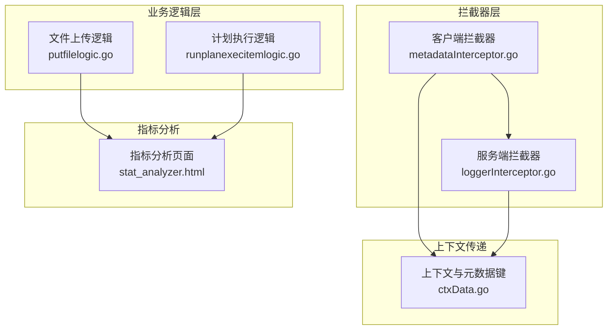
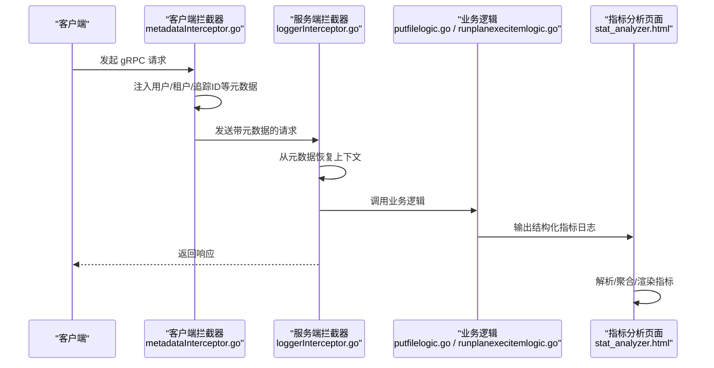
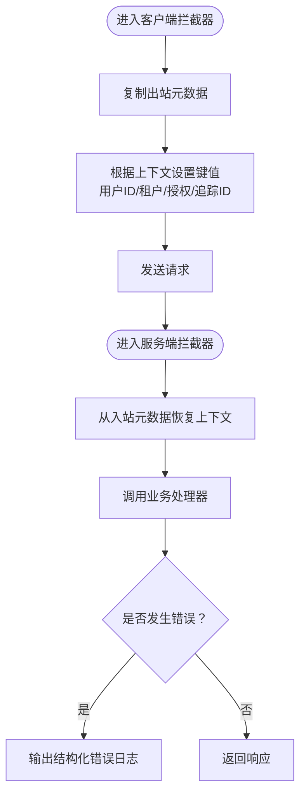
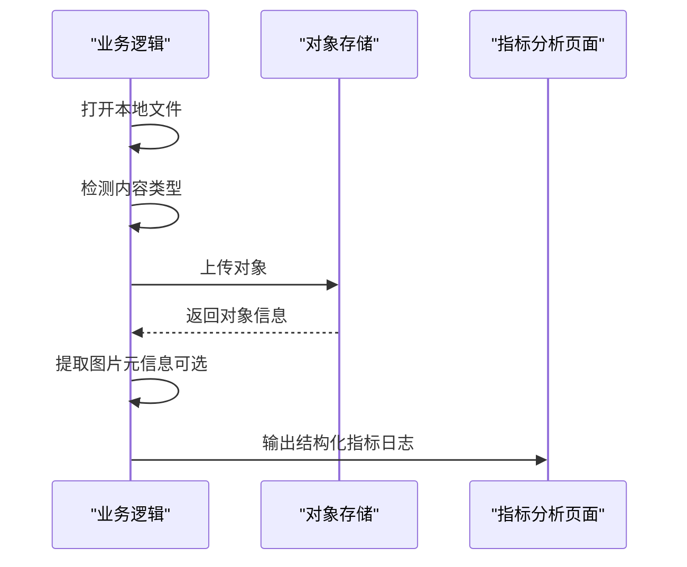
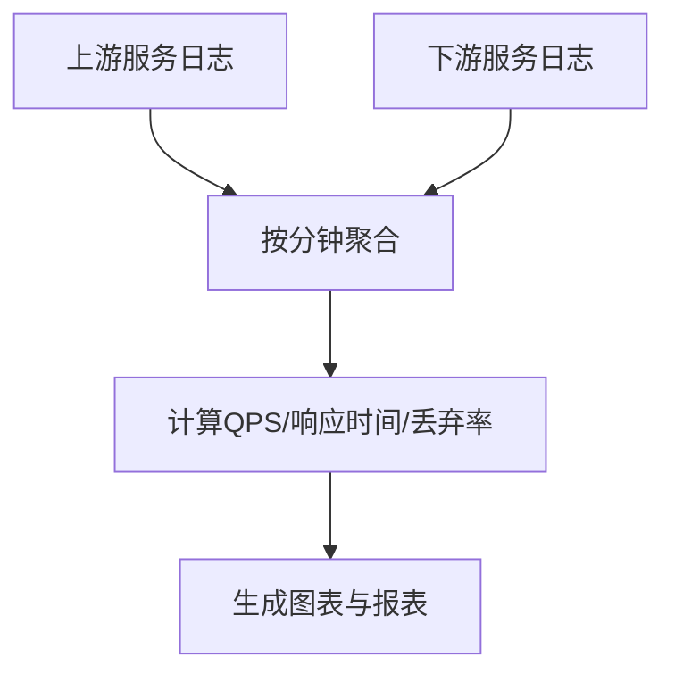
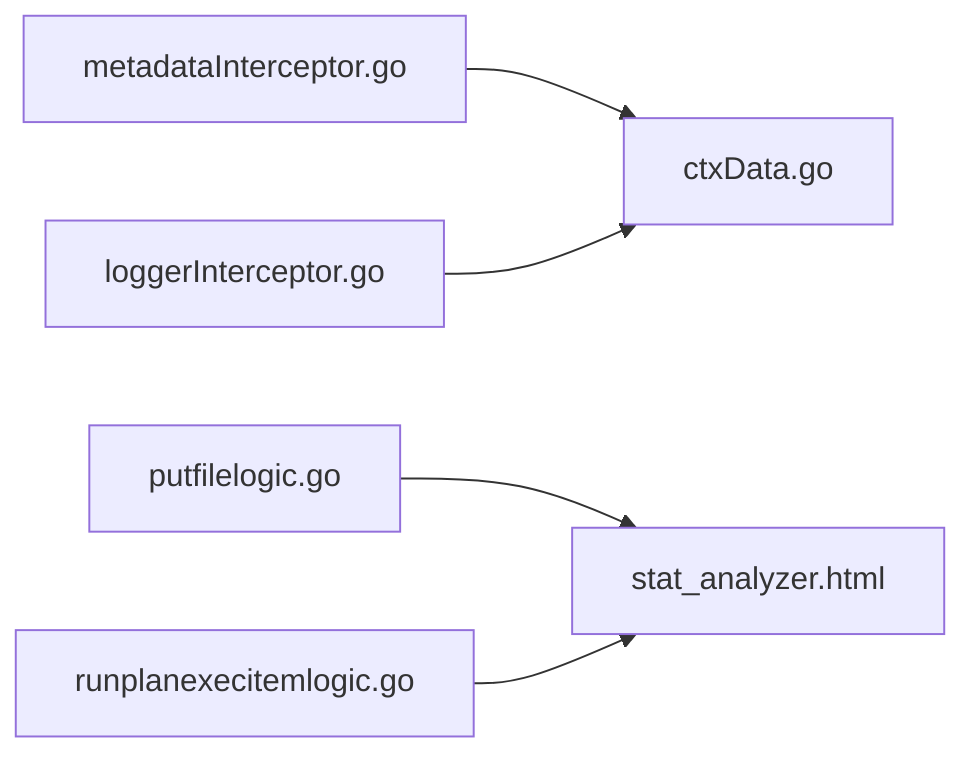

# 业务指标监控

<cite>
**本文引用的文件**
- [loggerInterceptor.go](file://common/Interceptor/rpcserver/loggerInterceptor.go)
- [metadataInterceptor.go](file://common/Interceptor/rpcclient/metadataInterceptor.go)
- [ctxData.go](file://common/ctxdata/ctxData.go)
- [stat_analyzer.html](file://deploy/stat_analyzer.html)
- [servicecontext.go](file://app/trigger/internal/svc/servicecontext.go)
- [putfilelogic.go](file://app/file/internal/logic/putfilelogic.go)
- [runplanexecitemlogic.go](file://app/trigger/internal/logic/runplanexecitemlogic.go)
</cite>

## 目录
1. [简介](#简介)
2. [项目结构](#项目结构)
3. [核心组件](#核心组件)
4. [架构总览](#架构总览)
5. [详细组件分析](#详细组件分析)
6. [依赖分析](#依赖分析)
7. [性能考虑](#性能考虑)
8. [故障排查指南](#故障排查指南)
9. [结论](#结论)
10. [附录](#附录)

## 简介
本文件围绕 zero-service 的业务指标监控进行系统化梳理，聚焦于业务层面的关键指标定义与采集方法，包括请求量（QPS）、响应时间、错误率、吞吐量等。文档同时阐述在微服务架构中如何通过 gRPC 拦截器、业务逻辑埋点与跨服务调用聚合，实现统一的业务指标采集与可视化展示，并给出可落地的实践建议与示例路径。

## 项目结构
- 指标采集与传输
  - gRPC 客户端/服务端拦截器负责在请求链路中注入与透传上下文（如用户、租户、追踪 ID），为后续指标关联与聚合提供基础。
  - 业务逻辑层在关键节点记录日志，形成可被分析工具识别的指标数据格式。
- 指标分析与可视化
  - 通过前端页面对日志进行解析、按分钟聚合、计算各类指标并渲染图表，支撑运维与开发的可观测性需求。

**图表来源**
- [metadataInterceptor.go:11-32](file://common/Interceptor/rpcclient/metadataInterceptor.go#L11-L32)
- [loggerInterceptor.go:12-44](file://common/Interceptor/rpcserver/loggerInterceptor.go#L12-L44)
- [ctxData.go:9-24](file://common/ctxdata/ctxData.go#L9-L24)
- [putfilelogic.go:33-77](file://app/file/internal/logic/putfilelogic.go#L33-L77)
- [runplanexecitemlogic.go:35-92](file://app/trigger/internal/logic/runplanexecitemlogic.go#L35-L92)
- [stat_analyzer.html:1119-1307](file://deploy/stat_analyzer.html#L1119-L1307)

**章节来源**
- [metadataInterceptor.go:11-32](file://common/Interceptor/rpcclient/metadataInterceptor.go#L11-L32)
- [loggerInterceptor.go:12-44](file://common/Interceptor/rpcserver/loggerInterceptor.go#L12-L44)
- [ctxData.go:9-24](file://common/ctxdata/ctxData.go#L9-L24)
- [stat_analyzer.html:1119-1307](file://deploy/stat_analyzer.html#L1119-L1307)

## 核心组件
- gRPC 客户端拦截器
  - 在出站请求中将用户、租户、授权、追踪 ID 等上下文写入 gRPC 元数据，确保跨服务调用时指标可关联。
- gRPC 服务端拦截器
  - 在入站请求中从元数据恢复上下文，并在处理失败时输出结构化错误日志，便于指标采集与定位。
- 上下文与元数据键
  - 定义统一的键名常量，保证拦截器与业务侧的一致性。
- 指标分析页面
  - 对包含 QPS、响应时间、丢弃数、CPU/内存等字段的日志进行解析、聚合与可视化展示。

**章节来源**
- [metadataInterceptor.go:11-32](file://common/Interceptor/rpcclient/metadataInterceptor.go#L11-L32)
- [loggerInterceptor.go:12-44](file://common/Interceptor/rpcserver/loggerInterceptor.go#L12-L44)
- [ctxData.go:9-24](file://common/ctxdata/ctxData.go#L9-L24)
- [stat_analyzer.html:862-882](file://deploy/stat_analyzer.html#L862-L882)

## 架构总览
以下序列图展示了典型业务请求在微服务中的指标采集流程：客户端拦截器注入上下文，服务端拦截器恢复上下文并记录日志；业务逻辑在关键节点输出指标日志；前端分析页面对日志进行解析与聚合。

**图表来源**
- [metadataInterceptor.go:11-32](file://common/Interceptor/rpcclient/metadataInterceptor.go#L11-L32)
- [loggerInterceptor.go:12-44](file://common/Interceptor/rpcserver/loggerInterceptor.go#L12-L44)
- [putfilelogic.go:33-77](file://app/file/internal/logic/putfilelogic.go#L33-L77)
- [runplanexecitemlogic.go:35-92](file://app/trigger/internal/logic/runplanexecitemlogic.go#L35-L92)
- [stat_analyzer.html:1119-1307](file://deploy/stat_analyzer.html#L1119-L1307)

## 详细组件分析

### 指标定义与采集规范
- 请求量（QPS）
  - 通过分析页面按分钟统计每类指标的总量，再计算每秒均值。
  - 关键字段：qps、qpsType。
- 响应时间
  - 支持 avgTime、medTime、p90Time、p99Time、p999Time 等分位指标。
  - 关键字段：avgTime、medTime、p90Time、p99Time、p999Time、qpsType。
- 错误率与丢弃
  - 通过 drops 字段统计丢弃请求数，结合 totalQps 计算丢弃率。
  - 关键字段：drops、totalQps。
- 吞吐量
  - 结合业务场景（如文件上传大小、事件统计时间戳等）进行度量。
  - 关键字段：存储写入字节数、统计时间戳等（参考服务端模型字段）。
- 系统指标
  - CPU 占用、内存分配、GC 次数等，用于辅助定位性能瓶颈。
  - 关键字段：cpu、alloc、sys、numGC。

**章节来源**
- [stat_analyzer.html:1145-1252](file://deploy/stat_analyzer.html#L1145-L1252)
- [stat_analyzer.html:1665-1694](file://deploy/stat_analyzer.html#L1665-L1694)
- [stat_analyzer.html:2354-2383](file://deploy/stat_analyzer.html#L2354-L2383)

### gRPC 拦截器与上下文传递
- 客户端拦截器
  - 将用户 ID、用户名、部门编码、授权令牌、追踪 ID 等写入出站元数据，确保下游服务可见。
- 服务端拦截器
  - 从入站元数据恢复上下文，便于日志与指标关联；异常时输出结构化错误日志。
- 上下文键
  - 统一的键名常量，保证拦截器与业务侧一致。

**图表来源**
- [metadataInterceptor.go:11-32](file://common/Interceptor/rpcclient/metadataInterceptor.go#L11-L32)
- [loggerInterceptor.go:12-44](file://common/Interceptor/rpcserver/loggerInterceptor.go#L12-L44)
- [ctxData.go:9-24](file://common/ctxdata/ctxData.go#L9-L24)

**章节来源**
- [metadataInterceptor.go:11-32](file://common/Interceptor/rpcclient/metadataInterceptor.go#L11-L32)
- [loggerInterceptor.go:12-44](file://common/Interceptor/rpcserver/loggerInterceptor.go#L12-L44)
- [ctxData.go:9-24](file://common/ctxdata/ctxData.go#L9-L24)

### 业务逻辑中的指标埋点
- 文件上传（对象存储）
  - 在关键步骤（打开文件、检测内容类型、上传对象、提取图片元信息）输出结构化日志，便于统计耗时与成功率。
  - 示例路径：[putfilelogic.go:33-77](file://app/file/internal/logic/putfilelogic.go#L33-L77)
- 计划执行（定时任务）
  - 在查询计划/批次、更新触发时间等关键节点输出结构化日志，便于统计成功率与异常原因。
  - 示例路径：[runplanexecitemlogic.go:35-92](file://app/trigger/internal/logic/runplanexecitemlogic.go#L35-L92)

**图表来源**
- [putfilelogic.go:33-77](file://app/file/internal/logic/putfilelogic.go#L33-L77)
- [stat_analyzer.html:862-882](file://deploy/stat_analyzer.html#L862-L882)

**章节来源**
- [putfilelogic.go:33-77](file://app/file/internal/logic/putfilelogic.go#L33-L77)
- [runplanexecitemlogic.go:35-92](file://app/trigger/internal/logic/runplanexecitemlogic.go#L35-L92)
- [stat_analyzer.html:862-882](file://deploy/stat_analyzer.html#L862-L882)

### 跨服务调用的指标聚合
- 通过拦截器在 gRPC 请求头中携带追踪 ID 与用户信息，使不同服务的日志可按会话维度聚合。
- 分析页面按分钟聚合日志，计算每类指标的均值与总量，并生成多维图表（CPU、内存、QPS、丢弃等）。

**图表来源**
- [stat_analyzer.html:1119-1307](file://deploy/stat_analyzer.html#L1119-L1307)
- [stat_analyzer.html:1300-1307](file://deploy/stat_analyzer.html#L1300-L1307)

**章节来源**
- [stat_analyzer.html:1119-1307](file://deploy/stat_analyzer.html#L1119-L1307)

## 依赖分析
- 拦截器依赖
  - 客户端拦截器依赖上下文工具以读取用户与追踪信息。
  - 服务端拦截器依赖上下文工具以恢复用户与追踪信息，并在错误时输出日志。
- 业务逻辑依赖
  - 业务逻辑通过日志输出指标数据，供分析页面解析与聚合。
- 分析页面依赖
  - 通过正则与字段解析，将日志转换为结构化数据并进行聚合计算。

**图表来源**
- [metadataInterceptor.go:11-32](file://common/Interceptor/rpcclient/metadataInterceptor.go#L11-L32)
- [loggerInterceptor.go:12-44](file://common/Interceptor/rpcserver/loggerInterceptor.go#L12-L44)
- [ctxData.go:9-24](file://common/ctxdata/ctxData.go#L9-L24)
- [putfilelogic.go:33-77](file://app/file/internal/logic/putfilelogic.go#L33-L77)
- [runplanexecitemlogic.go:35-92](file://app/trigger/internal/logic/runplanexecitemlogic.go#L35-L92)
- [stat_analyzer.html:1119-1307](file://deploy/stat_analyzer.html#L1119-L1307)

**章节来源**
- [metadataInterceptor.go:11-32](file://common/Interceptor/rpcclient/metadataInterceptor.go#L11-L32)
- [loggerInterceptor.go:12-44](file://common/Interceptor/rpcserver/loggerInterceptor.go#L12-L44)
- [ctxData.go:9-24](file://common/ctxdata/ctxData.go#L9-L24)
- [putfilelogic.go:33-77](file://app/file/internal/logic/putfilelogic.go#L33-L77)
- [runplanexecitemlogic.go:35-92](file://app/trigger/internal/logic/runplanexecitemlogic.go#L35-L92)
- [stat_analyzer.html:1119-1307](file://deploy/stat_analyzer.html#L1119-L1307)

## 性能考虑
- 连接池与缓存
  - 在服务上下文中复用数据库与缓存连接，减少连接创建开销。
- 指标采集频率
  - 采用分钟级聚合降低分析成本，同时保留高分辨率的响应时间分位指标。
- 日志字段设计
  - 统一字段命名与类型，便于前端解析与图表渲染。

**章节来源**
- [servicecontext.go:50-90](file://app/trigger/internal/svc/servicecontext.go#L50-L90)
- [stat_analyzer.html:1119-1307](file://deploy/stat_analyzer.html#L1119-L1307)

## 故障排查指南
- 指标缺失或不准确
  - 检查业务逻辑是否正确输出结构化日志字段（qps、avgTime、drops 等）。
  - 确认拦截器是否成功注入/恢复上下文（用户 ID、追踪 ID）。
- 错误日志未显示
  - 确保服务端拦截器在处理错误时输出结构化错误日志。
- 聚合异常
  - 检查日志时间戳格式与字段解析规则，确保按分钟聚合逻辑生效。

**章节来源**
- [loggerInterceptor.go:40-42](file://common/Interceptor/rpcserver/loggerInterceptor.go#L40-L42)
- [stat_analyzer.html:1119-1307](file://deploy/stat_analyzer.html#L1119-L1307)

## 结论
通过拦截器统一注入与透传上下文、在业务逻辑关键节点进行指标埋点、以及前端页面对日志进行解析与聚合，zero-service 已具备完善的业务指标监控能力。建议在新增服务与业务逻辑时遵循统一的指标字段规范与拦截器使用方式，持续完善可视化与告警体系。

## 附录
- 示例路径
  - 客户端拦截器：[metadataInterceptor.go:11-32](file://common/Interceptor/rpcclient/metadataInterceptor.go#L11-L32)
  - 服务端拦截器：[loggerInterceptor.go:12-44](file://common/Interceptor/rpcserver/loggerInterceptor.go#L12-L44)
  - 上下文键：[ctxData.go:9-24](file://common/ctxdata/ctxData.go#L9-L24)
  - 文件上传逻辑埋点：[putfilelogic.go:33-77](file://app/file/internal/logic/putfilelogic.go#L33-L77)
  - 计划执行逻辑埋点：[runplanexecitemlogic.go:35-92](file://app/trigger/internal/logic/runplanexecitemlogic.go#L35-L92)
  - 指标分析页面：[stat_analyzer.html:1119-1307](file://deploy/stat_analyzer.html#L1119-L1307)