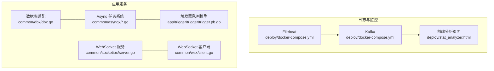
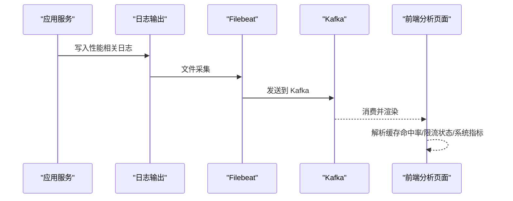
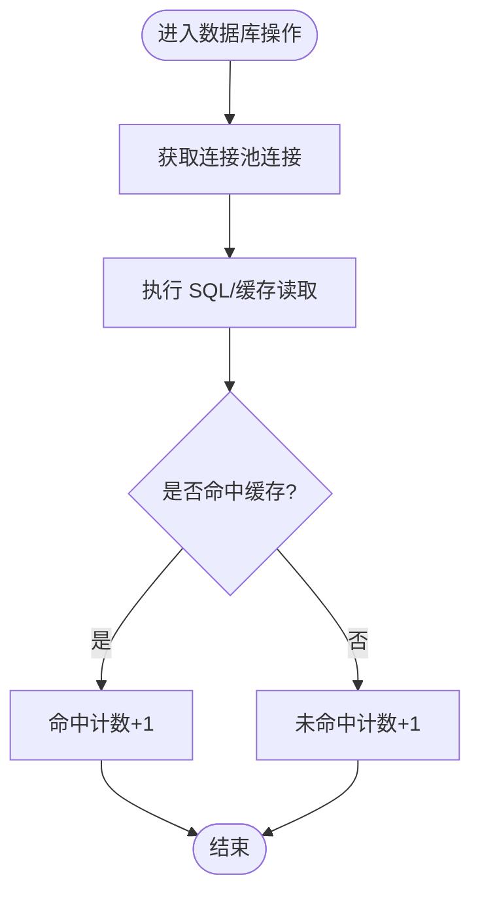
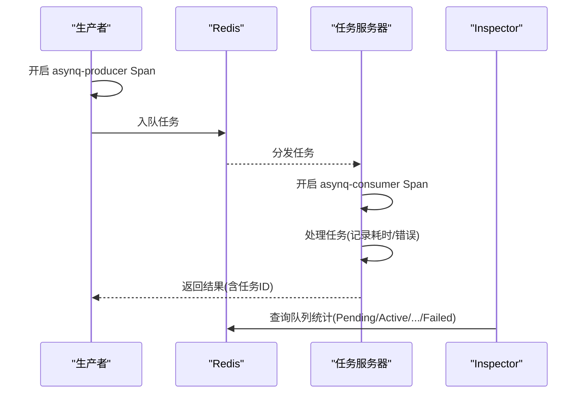
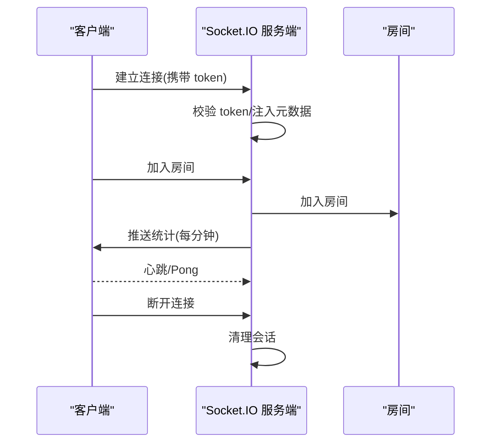
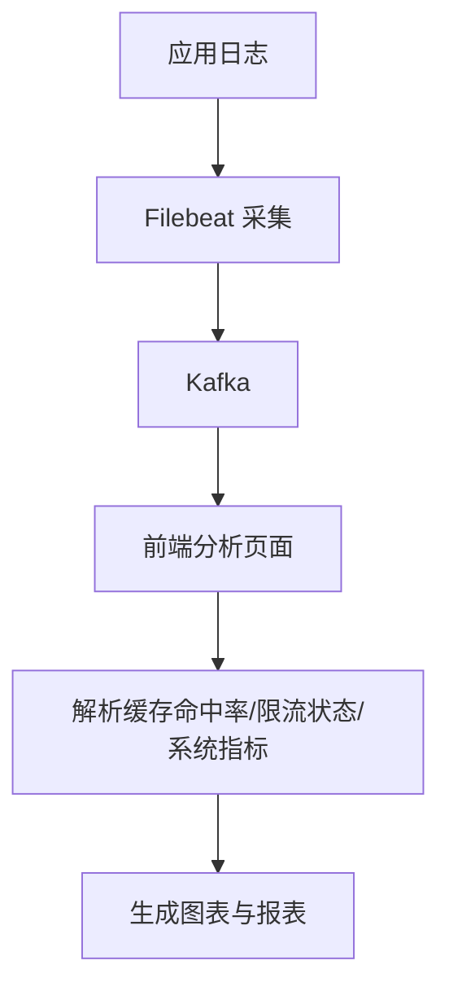

# 应用性能监控

<cite>
**本文引用的文件**
- [deploy/stat_analyzer.html](file://deploy/stat_analyzer.html)
- [common/dbx/dbx.go](file://common/dbx/dbx.go)
- [common/asynqx/asynqClient.go](file://common/asynqx/asynqClient.go)
- [common/asynqx/asynqTaskServer.go](file://common/asynqx/asynqTaskServer.go)
- [common/asynqx/asynqSchedulerServer.go](file://common/asynqx/asynqSchedulerServer.go)
- [common/socketiox/server.go](file://common/socketiox/server.go)
- [common/wsx/client.go](file://common/wsx/client.go)
- [.trae/skills/zero-skills/references/database-patterns.md](file://.trae/skills/zero-skills/references/database-patterns.md)
- [app/trigger/trigger/trigger.pb.go](file://app/trigger/trigger/trigger.pb.go)
- [deploy/docker-compose.yml](file://deploy/docker-compose.yml)
</cite>

## 目录
1. [简介](#简介)
2. [项目结构](#项目结构)
3. [核心组件](#核心组件)
4. [架构总览](#架构总览)
5. [详细组件分析](#详细组件分析)
6. [依赖分析](#依赖分析)
7. [性能考量](#性能考量)
8. [故障排查指南](#故障排查指南)
9. [结论](#结论)
10. [附录](#附录)

## 简介
本文件面向 zero-service 的应用性能监控，聚焦以下目标：
- 指标体系：数据库连接数、缓存命中率、队列长度、线程池状态、WebSocket 连接数与负载、异步任务执行时间与失败率等。
- 异步任务系统监控：任务执行耗时、队列积压、任务失败率、队列维度统计（Pending/Active/Scheduled/Retry/Archived/Completed）。
- 监控埋点实践：数据库操作、WebSocket 连接、缓存使用、异步任务生产与消费链路。
- 瓶颈识别与优化：基于日志与指标的定位方法与优化建议。

## 项目结构
本项目采用多模块微服务架构，围绕 go-zero 与相关中间件（Redis/Asynq/Kafka/Filebeat）构建。与性能监控直接相关的模块与文件如下：
- 日志采集与可视化：Filebeat -> Kafka -> 自定义前端分析页面
- 数据库层：统一适配与连接池配置
- 异步任务：Asynq 生产者/消费者/调度器
- WebSocket：Socket.IO 服务端与客户端
- 队列信息模型：触发器服务中的队列统计字段



图表来源
- [deploy/docker-compose.yml:1-110](file://deploy/docker-compose.yml#L1-L110)
- [deploy/stat_analyzer.html:345-1253](file://deploy/stat_analyzer.html#L345-L1253)
- [common/dbx/dbx.go:1-155](file://common/dbx/dbx.go#L1-L155)
- [common/asynqx/asynqClient.go:1-31](file://common/asynqx/asynqClient.go#L1-L31)
- [common/asynqx/asynqTaskServer.go:1-87](file://common/asynqx/asynqTaskServer.go#L1-L87)
- [common/asynqx/asynqSchedulerServer.go:1-62](file://common/asynqx/asynqSchedulerServer.go#L1-L62)
- [common/socketiox/server.go:1-800](file://common/socketiox/server.go#L1-L800)
- [common/wsx/client.go:489-535](file://common/wsx/client.go#L489-L535)
- [app/trigger/trigger/trigger.pb.go:353-397](file://app/trigger/trigger/trigger.pb.go#L353-L397)

章节来源
- [deploy/docker-compose.yml:1-110](file://deploy/docker-compose.yml#L1-L110)
- [deploy/stat_analyzer.html:345-1253](file://deploy/stat_analyzer.html#L345-L1253)

## 核心组件
- 数据库适配与连接池
  - 统一根据数据源自动识别数据库类型并创建连接，支持 MySQL/Postgres/SQLite/TAOS。
  - 提供连接适配器以获取底层 sql.DB，便于进行连接池参数调优。
- Asynq 异步任务系统
  - 客户端：封装 Redis 客户端，支持 OpenTelemetry 上下文传播。
  - 任务服务器：配置并发度、队列优先级、日志记录与中间件。
  - 调度器：基于 Cron 表达式注册定时任务。
- WebSocket 服务与客户端
  - 服务端：事件绑定、会话管理、房间广播、周期性统计推送。
  - 客户端：连接建立、心跳与 Pong 处理、关闭流程。
- 触发器队列模型
  - 定义队列维度统计字段（Pending/Active/Scheduled/Retry/Archived/Completed/Processed/Failed 等），用于队列健康度观测。

章节来源
- [common/dbx/dbx.go:1-155](file://common/dbx/dbx.go#L1-L155)
- [common/asynqx/asynqClient.go:1-31](file://common/asynqx/asynqClient.go#L1-L31)
- [common/asynqx/asynqTaskServer.go:1-87](file://common/asynqx/asynqTaskServer.go#L1-L87)
- [common/asynqx/asynqSchedulerServer.go:1-62](file://common/asynqx/asynqSchedulerServer.go#L1-L62)
- [common/socketiox/server.go:1-800](file://common/socketiox/server.go#L1-L800)
- [common/wsx/client.go:489-535](file://common/wsx/client.go#L489-L535)
- [app/trigger/trigger/trigger.pb.go:353-397](file://app/trigger/trigger/trigger.pb.go#L353-L397)

## 架构总览
下图展示了性能监控的关键路径：日志采集、指标解析与可视化，以及核心组件的交互。



图表来源
- [deploy/docker-compose.yml:32-53](file://deploy/docker-compose.yml#L32-L53)
- [deploy/stat_analyzer.html:980-1004](file://deploy/stat_analyzer.html#L980-L1004)

## 详细组件分析

### 数据库连接与缓存命中率监控
- 连接池配置
  - 默认连接池参数：最大空闲连接、最大打开连接、连接最大生命周期。
  - 可通过获取底层 sql.DB 并设置自定义连接池参数。
- 缓存命中率
  - 日志中包含缓存命中率指标（qpm、hit_ratio、hit、miss、db_fails），前端解析并聚合展示。
- 监控埋点建议
  - 在数据库查询前后打点，记录耗时与错误码。
  - 对热点键进行采样统计，结合命中率变化定位异常。



图表来源
- [deploy/stat_analyzer.html:995-1004](file://deploy/stat_analyzer.html#L995-L1004)
- [.trae/skills/zero-skills/references/database-patterns.md:448-480](file://.trae/skills/zero-skills/references/database-patterns.md#L448-L480)

章节来源
- [.trae/skills/zero-skills/references/database-patterns.md:448-480](file://.trae/skills/zero-skills/references/database-patterns.md#L448-L480)
- [deploy/stat_analyzer.html:980-1004](file://deploy/stat_analyzer.html#L980-L1004)

### 异步任务系统监控
- 队列维度指标
  - 队列大小、Pending/Active/Scheduled/Retry/Archived/Completed 数量、每日/累计处理与失败计数、暂停状态、内存占用估算。
- 生产与消费链路
  - 生产侧：记录任务类型、耗时、错误；消费侧：记录任务处理耗时、错误。
- 监控埋点建议
  - 在生产任务时开启 Span，标注任务类型；在消费任务时记录处理耗时与结果。
  - 结合队列维度统计，观察 Pending 积压与失败率变化。



图表来源
- [common/asynqx/asynqClient.go:25-30](file://common/asynqx/asynqClient.go#L25-L30)
- [common/asynqx/asynqTaskServer.go:66-87](file://common/asynqx/asynqTaskServer.go#L66-L87)
- [app/trigger/trigger/trigger.pb.go:353-397](file://app/trigger/trigger/trigger.pb.go#L353-L397)

章节来源
- [common/asynqx/asynqClient.go:1-31](file://common/asynqx/asynqClient.go#L1-L31)
- [common/asynqx/asynqTaskServer.go:1-87](file://common/asynqx/asynqTaskServer.go#L1-L87)
- [common/asynqx/asynqSchedulerServer.go:1-62](file://common/asynqx/asynqSchedulerServer.go#L1-L62)
- [app/trigger/trigger/trigger.pb.go:353-397](file://app/trigger/trigger/trigger.pb.go#L353-L397)

### WebSocket 连接监控
- 服务端
  - 会话管理、房间管理、周期性统计推送（每分钟）。
  - 统计字段包含会话数、房间数、每秒消息数（NPS）、元数据与房间加载错误。
- 客户端
  - 心跳与 Pong 处理、连接关闭流程。
- 监控埋点建议
  - 在连接建立/断开、加入/离开房间、事件处理开始/结束处打点。
  - 结合 NPS 与房间数，评估连接负载与广播压力。



图表来源
- [common/socketiox/server.go:337-676](file://common/socketiox/server.go#L337-L676)
- [common/socketiox/server.go:702-740](file://common/socketiox/server.go#L702-L740)
- [common/wsx/client.go:489-535](file://common/wsx/client.go#L489-L535)

章节来源
- [common/socketiox/server.go:1-800](file://common/socketiox/server.go#L1-L800)
- [common/wsx/client.go:489-535](file://common/wsx/client.go#L489-L535)

### 日志采集与指标解析
- Filebeat -> Kafka -> 前端分析页面
  - 前端解析缓存命中率、限流状态、系统指标（CPU/内存/GC/丢弃数）。
  - 聚合统计：按分钟窗口汇总 QPS、响应时间分位、系统指标峰值与累加。
- 监控埋点建议
  - 在关键路径输出结构化日志，包含服务名、QPS 类型、响应时间、丢弃数、缓存命中率等字段。
  - 使用前端分析页面进行趋势观察与异常告警。



图表来源
- [deploy/docker-compose.yml:32-53](file://deploy/docker-compose.yml#L32-L53)
- [deploy/stat_analyzer.html:862-1072](file://deploy/stat_analyzer.html#L862-L1072)
- [deploy/stat_analyzer.html:1145-1253](file://deploy/stat_analyzer.html#L1145-L1253)

章节来源
- [deploy/docker-compose.yml:1-110](file://deploy/docker-compose.yml#L1-L110)
- [deploy/stat_analyzer.html:345-1253](file://deploy/stat_analyzer.html#L345-L1253)

## 依赖分析
- 组件耦合
  - Asynq 与 Redis：生产/消费/调度均依赖 Redis，队列维度统计来自 Redis 中的任务状态。
  - WebSocket 与客户端：服务端负责会话与房间管理，客户端负责心跳与关闭。
  - 数据库适配：统一入口，便于集中配置连接池参数。
- 外部依赖
  - Kafka/Filebeat：日志采集与传输管道。
  - Redis：Asynq 队列存储与任务状态。
- 潜在风险
  - 连接池参数不当导致连接泄漏或抖动。
  - Asynq 队列积压未及时告警，导致延迟放大。
  - WebSocket 房间广播压力过大，影响 NPS。

```mermaid
graph LR
DB["数据库适配"] --> APP["应用服务"]
ASYNQ["Asynq"] --> APP
WS["WebSocket"] --> APP
KAF["Kafka"] <- --> FE["前端分析页面"]
FB["Filebeat"] --> KAF
```

图表来源
- [common/dbx/dbx.go:1-155](file://common/dbx/dbx.go#L1-L155)
- [common/asynqx/asynqTaskServer.go:1-87](file://common/asynqx/asynqTaskServer.go#L1-L87)
- [common/socketiox/server.go:1-800](file://common/socketiox/server.go#L1-L800)
- [deploy/docker-compose.yml:32-53](file://deploy/docker-compose.yml#L32-L53)
- [deploy/stat_analyzer.html:345-1253](file://deploy/stat_analyzer.html#L345-L1253)

## 性能考量
- 数据库
  - 合理设置连接池参数，避免过多空闲连接造成资源浪费；根据业务峰值调整 MaxOpenConns。
  - 对热点查询与写入路径进行索引优化，减少慢查询对连接池的压力。
- 异步任务
  - 根据任务类型划分队列优先级，避免低优先级任务阻塞高优先级。
  - 监控 Pending 与 Retry 指标，及时扩容消费者或优化任务处理逻辑。
- WebSocket
  - 控制单房间消息规模与广播频率，避免 NPS 过高导致延迟上升。
  - 对断线重连与心跳间隔进行调优，降低无效连接数量。
- 日志与可视化
  - 保证日志字段完整与一致，便于前端聚合与分析。
  - 对关键指标设置阈值告警，结合趋势图快速定位异常。

## 故障排查指南
- 缓存命中率骤降
  - 检查缓存键过期策略与热点键分布；核对日志中的 miss/db_fails 指标。
- 限流丢弃增多
  - 查看限流状态日志，确认 CPU/Pass/Drop 指标；检查系统资源与线程池饱和度。
- 队列积压严重
  - 查看队列维度统计（Pending/Retry/Failed），核对消费者并发与处理耗时。
- WebSocket 连接异常
  - 关注断开原因与房间加载错误；检查心跳与 Pong 处理是否正常。

章节来源
- [deploy/stat_analyzer.html:980-1004](file://deploy/stat_analyzer.html#L980-L1004)
- [common/asynqx/asynqTaskServer.go:73-87](file://common/asynqx/asynqTaskServer.go#L73-L87)
- [common/socketiox/server.go:620-642](file://common/socketiox/server.go#L620-L642)
- [common/wsx/client.go:489-535](file://common/wsx/client.go#L489-L535)

## 结论
通过统一的日志采集与前端可视化，配合数据库连接池、Asynq 队列与 WebSocket 的监控埋点，可以全面掌握应用的性能状况。建议持续关注缓存命中率、队列积压与失败率、连接池利用率与系统资源使用情况，并结合告警机制实现快速定位与优化闭环。

## 附录
- 监控埋点清单（示例）
  - 数据库：查询开始/结束、错误码、耗时、缓存命中/未命中。
  - Asynq：生产/消费 Span、任务类型、处理耗时、错误、队列维度统计。
  - WebSocket：连接建立/断开、加入/离开房间、事件处理开始/结束、NPS。
- 参考实现位置
  - 数据库适配与连接池：[common/dbx/dbx.go:1-155](file://common/dbx/dbx.go#L1-L155)
  - Asynq 客户端/任务服务器/调度器：[common/asynqx/asynqClient.go:1-31](file://common/asynqx/asynqClient.go#L1-L31)、[common/asynqx/asynqTaskServer.go:1-87](file://common/asynqx/asynqTaskServer.go#L1-L87)、[common/asynqx/asynqSchedulerServer.go:1-62](file://common/asynqx/asynqSchedulerServer.go#L1-L62)
  - WebSocket 服务端/客户端：[common/socketiox/server.go:1-800](file://common/socketiox/server.go#L1-L800)、[common/wsx/client.go:489-535](file://common/wsx/client.go#L489-L535)
  - 队列统计模型：[app/trigger/trigger/trigger.pb.go:353-397](file://app/trigger/trigger/trigger.pb.go#L353-L397)
  - 日志采集与分析：[deploy/docker-compose.yml:1-110](file://deploy/docker-compose.yml#L1-L110)、[deploy/stat_analyzer.html:345-1253](file://deploy/stat_analyzer.html#L345-L1253)