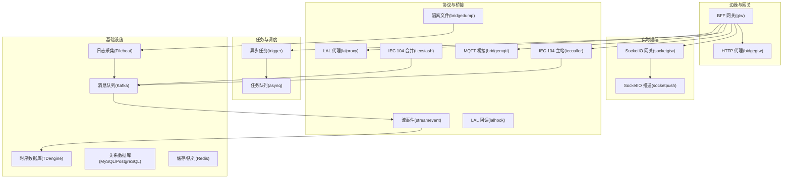
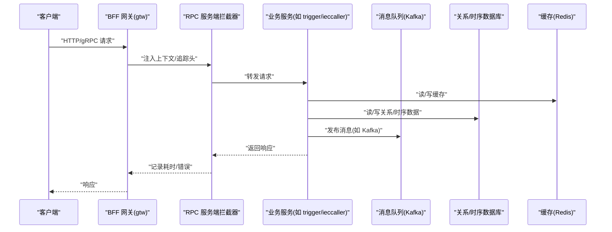
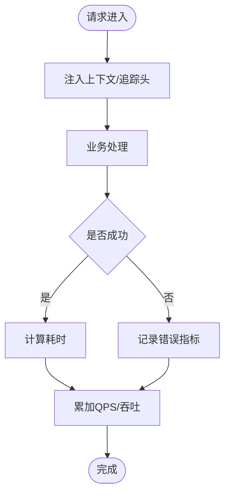
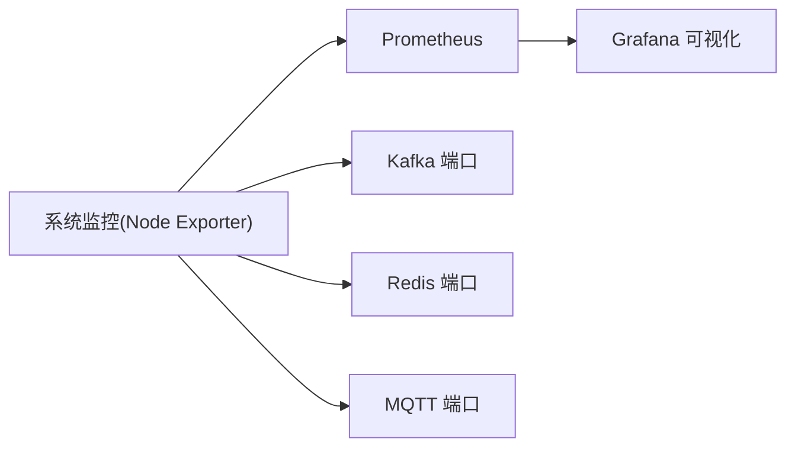
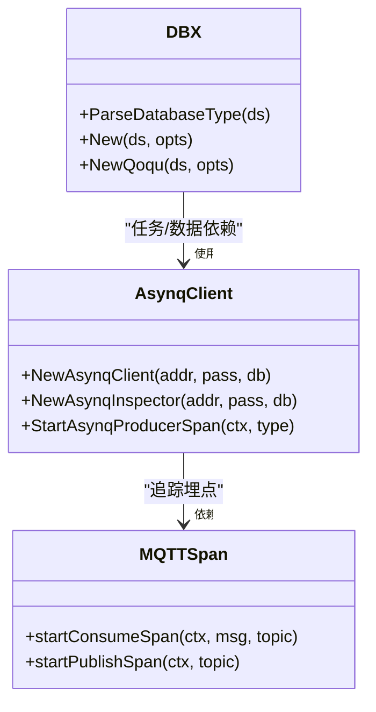
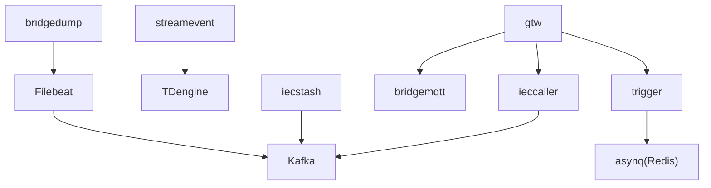

# 指标收集与监控

<cite>
**本文引用的文件**
- [go.mod](file://go.mod)
- [README.md](file://README.md)
- [deploy/docker-compose.yml](file://deploy/docker-compose.yml)
- [deploy/filebeat/conf/filebeat.yml](file://deploy/filebeat/conf/filebeat.yml)
- [app/trigger/etc/trigger.yaml](file://app/trigger/etc/trigger.yaml)
- [app/ieccaller/etc/ieccaller.yaml](file://app/ieccaller/etc/ieccaller.yaml)
- [app/bridgemqtt/etc/bridgemqtt.yaml](file://app/bridgemqtt/etc/bridgemqtt.yaml)
- [common/Interceptor/rpcserver/loggerInterceptor.go](file://common/Interceptor/rpcserver/loggerInterceptor.go)
- [common/Interceptor/rpcclient/metadataInterceptor.go](file://common/Interceptor/rpcclient/metadataInterceptor.go)
- [common/dbx/dbx.go](file://common/dbx/dbx.go)
- [common/asynqx/asynqClient.go](file://common/asynqx/asynqClient.go)
- [common/mqttx/mqttx.go](file://common/mqttx/mqttx.go)
- [deploy/stat_analyzer.html](file://deploy/stat_analyzer.html)
- [.trae/skills/zero-skills/references/resilience-patterns.md](file://.trae/skills/zero-skills/references/resilience-patterns.md)
</cite>

## 目录
1. [简介](#简介)
2. [项目结构](#项目结构)
3. [核心组件](#核心组件)
4. [架构总览](#架构总览)
5. [详细组件分析](#详细组件分析)
6. [依赖分析](#依赖分析)
7. [性能考虑](#性能考虑)
8. [故障排查指南](#故障排查指南)
9. [结论](#结论)
10. [附录](#附录)

## 简介
本指南围绕 zero-service 的指标收集与监控进行系统化说明，涵盖业务指标（请求量、响应时间、错误率、吞吐量）、系统指标（CPU、内存、磁盘IO、网络）、应用指标（数据库连接、缓存命中率、队列长度、线程池状态）、用户体验指标（页面加载、API响应、用户活跃度），并提供 Prometheus、Grafana、Zabbix 等工具的集成方案，以及指标数据存储与查询优化建议。

## 项目结构
- 采用多微服务架构，服务通过 gRPC/HTTP 聚合与互通，消息中间件（Kafka）承担异步数据通道，数据库（MySQL/PostgreSQL/SQLite/TDengine）承载结构化与时序数据。
- 监控链路已内置 OpenTelemetry 与 Prometheus 依赖，便于接入指标采集与可视化。

图表来源
- [README.md:15-51](file://README.md#L15-L51)
- [deploy/docker-compose.yml:1-110](file://deploy/docker-compose.yml#L1-L110)

章节来源
- [README.md:15-51](file://README.md#L15-L51)
- [deploy/docker-compose.yml:1-110](file://deploy/docker-compose.yml#L1-L110)

## 核心组件
- 服务治理与拦截：通过 gRPC 拦截器注入上下文与追踪头，便于端到端链路追踪与指标关联。
- 数据访问：统一数据库适配层，支持 MySQL/PostgreSQL/SQLite/TAOS，便于在不同存储间切换与观测。
- 任务队列：基于 asynq + Redis，提供任务生产、消费、重试、统计等可观测性基础。
- 协议与桥接：IEC 104、MQTT、HTTP 等协议桥接，配合 Kafka/文件采集形成数据闭环。
- 监控依赖：项目已引入 OpenTelemetry 与 Prometheus 客户端，具备可观测性基础。

章节来源
- [common/Interceptor/rpcserver/loggerInterceptor.go:12-44](file://common/Interceptor/rpcserver/loggerInterceptor.go#L12-L44)
- [common/Interceptor/rpcclient/metadataInterceptor.go:11-32](file://common/Interceptor/rpcclient/metadataInterceptor.go#L11-L32)
- [common/dbx/dbx.go:31-64](file://common/dbx/dbx.go#L31-L64)
- [common/asynqx/asynqClient.go:17-30](file://common/asynqx/asynqClient.go#L17-L30)
- [go.mod:52-58](file://go.mod#L52-L58)

## 架构总览
以下序列图展示一次典型请求从网关进入、经由拦截器、服务处理、到下游依赖（Kafka/数据库/Redis）的关键节点与可观测性触点。

图表来源
- [common/Interceptor/rpcserver/loggerInterceptor.go:12-44](file://common/Interceptor/rpcserver/loggerInterceptor.go#L12-L44)
- [common/Interceptor/rpcclient/metadataInterceptor.go:11-32](file://common/Interceptor/rpcclient/metadataInterceptor.go#L11-L32)
- [app/trigger/etc/trigger.yaml:19-28](file://app/trigger/etc/trigger.yaml#L19-L28)
- [app/ieccaller/etc/ieccaller.yaml:35-41](file://app/ieccaller/etc/ieccaller.yaml#L35-L41)
- [app/bridgemqtt/etc/bridgemqtt.yaml:19-28](file://app/bridgemqtt/etc/bridgemqtt.yaml#L19-L28)

## 详细组件分析

### 业务指标：QPS、响应时间、错误率、吞吐量
- QPS（每秒请求数）：可通过服务端拦截器统计每秒处理的请求数，并按服务/方法维度聚合。
- 响应时间：在拦截器中记录请求进入与返回时间，计算 p50/p95/p99。
- 错误率：拦截器捕获错误并按服务/方法/错误码分类统计。
- 吞吐量：结合请求大小与响应大小，按方法/端点统计字节级吞吐。

图表来源
- [common/Interceptor/rpcserver/loggerInterceptor.go:12-44](file://common/Interceptor/rpcserver/loggerInterceptor.go#L12-L44)
- [common/Interceptor/rpcclient/metadataInterceptor.go:11-32](file://common/Interceptor/rpcclient/metadataInterceptor.go#L11-L32)

章节来源
- [common/Interceptor/rpcserver/loggerInterceptor.go:12-44](file://common/Interceptor/rpcserver/loggerInterceptor.go#L12-L44)
- [common/Interceptor/rpcclient/metadataInterceptor.go:11-32](file://common/Interceptor/rpcclient/metadataInterceptor.go#L11-L32)

### 系统指标：CPU、内存、磁盘IO、网络
- CPU/内存：容器编排中设置内存限制，结合系统监控采集器（如 Prometheus Node Exporter）采集。
- 磁盘IO：结合 Kafka/Filebeat 的磁盘写入路径与日志目录，监控 IOUtil/OPS/延迟。
- 网络：采集 Kafka/Redis/MQTT 等端口流量，识别异常峰值。

图表来源
- [deploy/docker-compose.yml:5-30](file://deploy/docker-compose.yml#L5-L30)

章节来源
- [deploy/docker-compose.yml:5-30](file://deploy/docker-compose.yml#L5-L30)

### 应用指标：数据库连接、缓存命中率、队列长度、线程池状态
- 数据库连接：通过统一数据库适配层，可在连接池层面统计活跃连接、等待队列、超时次数。
- 缓存命中率：基于 Redis 客户端统计命中/未命中，结合 QPS 计算命中率。
- 队列长度：asynq Inspector 可查询待处理/重试/失败任务数量；Kafka 分区 lag 反映下游处理能力。
- 线程池状态：容器层面观察 goroutine 数、GC 次数与暂停时间，辅助定位过载风险。

图表来源
- [common/dbx/dbx.go:31-64](file://common/dbx/dbx.go#L31-L64)
- [common/asynqx/asynqClient.go:17-30](file://common/asynqx/asynqClient.go#L17-L30)
- [common/mqttx/mqttx.go:361-388](file://common/mqttx/mqttx.go#L361-L388)

章节来源
- [common/dbx/dbx.go:31-64](file://common/dbx/dbx.go#L31-L64)
- [common/asynqx/asynqClient.go:17-30](file://common/asynqx/asynqClient.go#L17-L30)
- [common/mqttx/mqttx.go:361-388](file://common/mqttx/mqttx.go#L361-L388)

### 用户体验指标：页面加载、API 响应、用户活跃度
- 页面加载时间：前端侧采集，结合 CDN/浏览器性能指标。
- API 响应时间：服务端拦截器记录，按端点/版本/环境区分。
- 用户活跃度：SocketIO 房间在线人数、消息广播/单播速率、MQTT 订阅主题数。

章节来源
- [README.md:156-173](file://README.md#L156-L173)

### 指标采集工具与配置
- Prometheus：采集服务端指标（gRPC/HTTP）、系统指标（Node Exporter）、应用指标（Kafka lag、Redis stats）。
- Grafana：构建仪表盘，聚合业务/系统/应用指标，设置告警规则。
- Zabbix：可选企业级监控，采集系统与应用指标，对接告警通道。
- OpenTelemetry：链路追踪与指标导出，结合 Prometheus Exporter 使用。

章节来源
- [README.md:223-224](file://README.md#L223-L224)
- [go.mod:52-58](file://go.mod#L52-L58)

### 指标数据存储与查询优化
- 时序数据库：TDengine 适合 IEC 104 等高并发时序数据；Prometheus 适合通用时序指标。
- 数据压缩：Kafka 生产端启用压缩（如 gzip），降低网络与存储开销。
- 查询优化：对热点指标建立索引/分区，限制查询窗口，使用降采样与物化视图。

章节来源
- [deploy/filebeat/conf/filebeat.yml:110-119](file://deploy/filebeat/conf/filebeat.yml#L110-L119)
- [README.md:112-131](file://README.md#L112-L131)

## 依赖分析
- 服务间通信：gRPC + grpc-gateway，拦截器贯穿请求链路，便于统一埋点。
- 消息与数据：Kafka 作为异步通道，Filebeat 将文件事件写入 Kafka，streamevent 写入 TDengine。
- 存储与任务：MySQL/PostgreSQL/SQLite/TDengine，asynq + Redis 管理任务生命周期。

图表来源
- [app/trigger/etc/trigger.yaml:19-28](file://app/trigger/etc/trigger.yaml#L19-L28)
- [app/ieccaller/etc/ieccaller.yaml:35-41](file://app/ieccaller/etc/ieccaller.yaml#L35-L41)
- [app/bridgemqtt/etc/bridgemqtt.yaml:19-28](file://app/bridgemqtt/etc/bridgemqtt.yaml#L19-L28)
- [deploy/docker-compose.yml:31-53](file://deploy/docker-compose.yml#L31-L53)

章节来源
- [app/trigger/etc/trigger.yaml:19-28](file://app/trigger/etc/trigger.yaml#L19-L28)
- [app/ieccaller/etc/ieccaller.yaml:35-41](file://app/ieccaller/etc/ieccaller.yaml#L35-L41)
- [app/bridgemqtt/etc/bridgemqtt.yaml:19-28](file://app/bridgemqtt/etc/bridgemqtt.yaml#L19-L28)
- [deploy/docker-compose.yml:31-53](file://deploy/docker-compose.yml#L31-L53)

## 性能考虑
- 资源限制：容器编排中设置内存上限，避免 OOM；CPU 限额防止资源抢占。
- 并发与限流：在网关层实施请求限速与熔断，保护下游服务。
- 缓存策略：热点数据走缓存，合理设置 TTL 与失效策略。
- 数据库优化：连接池大小、慢查询日志、只读副本分流。

## 故障排查指南
- Redis 连接失败：检查主机、端口、密码与集群模式配置，使用 redis-cli 验证连通性。
- API 404：核对路由前缀与注册日志，确保路由正确挂载。
- 日志采集异常：检查 Filebeat 配置与目标 Kafka 地址，确认容器日志目录挂载。

章节来源
- [.trae/skills/zero-skills/troubleshooting/common-issues.md:171-210](file://.trae/skills/zero-skills/troubleshooting/common-issues.md#L171-L210)
- [.trae/skills/zero-skills/troubleshooting/common-issues.md:212-274](file://.trae/skills/zero-skills/troubleshooting/common-issues.md#L212-L274)
- [deploy/filebeat/conf/filebeat.yml:110-119](file://deploy/filebeat/conf/filebeat.yml#L110-L119)

## 结论
通过拦截器统一注入上下文与追踪头、利用 asynq/Redis/Kafka 构建可观测的任务与消息链路、结合 Prometheus/Grafana/Zabbix 实现全栈监控，zero-service 能够稳定支撑工业级物联网场景的指标采集与告警需求。建议优先落地服务端拦截器指标、系统与应用指标，再逐步完善用户体验指标与告警策略。

## 附录
- 残留韧性指标参考：断路器状态变化、限流超额、超时次数、CPU 使用率等，可用于弹性伸缩与负载保护。

章节来源
- [.trae/skills/zero-skills/references/resilience-patterns.md:621-641](file://.trae/skills/zero-skills/references/resilience-patterns.md#L621-L641)