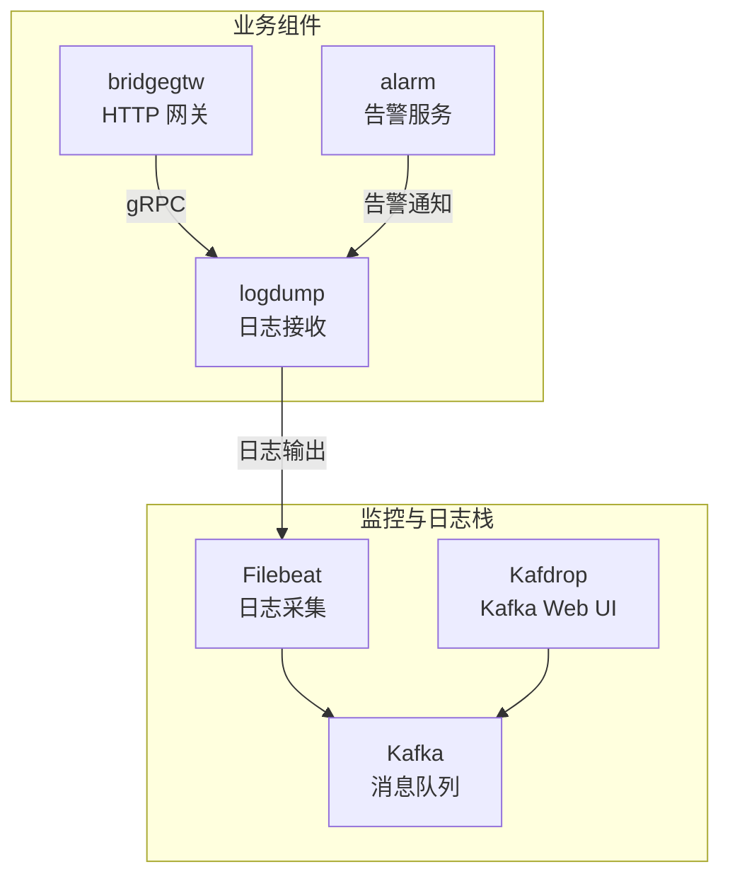
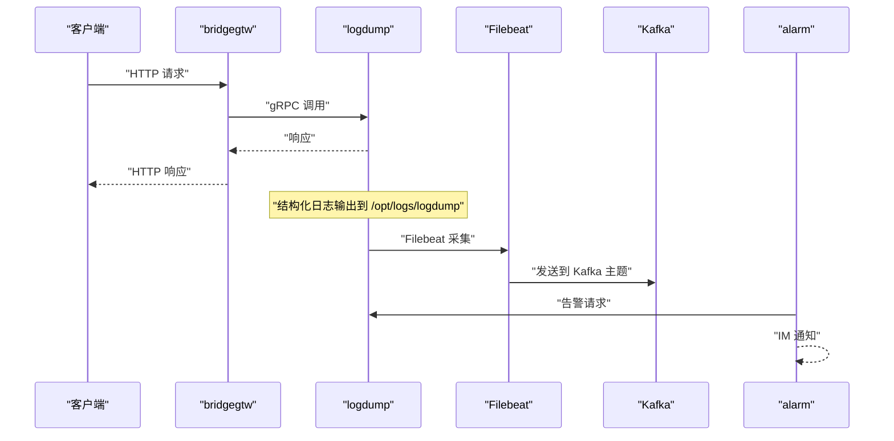
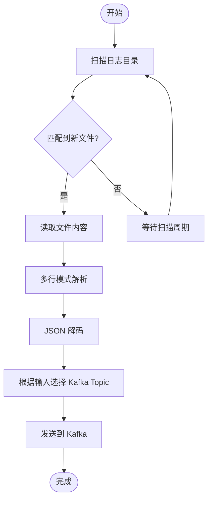
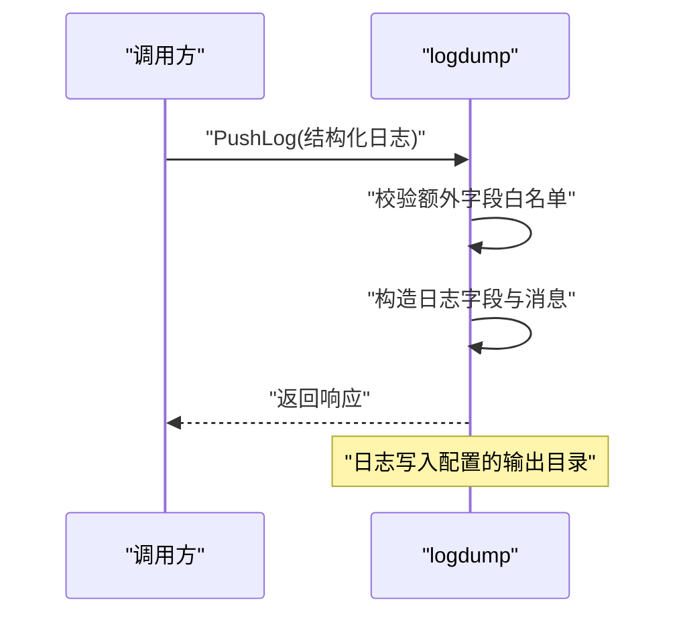
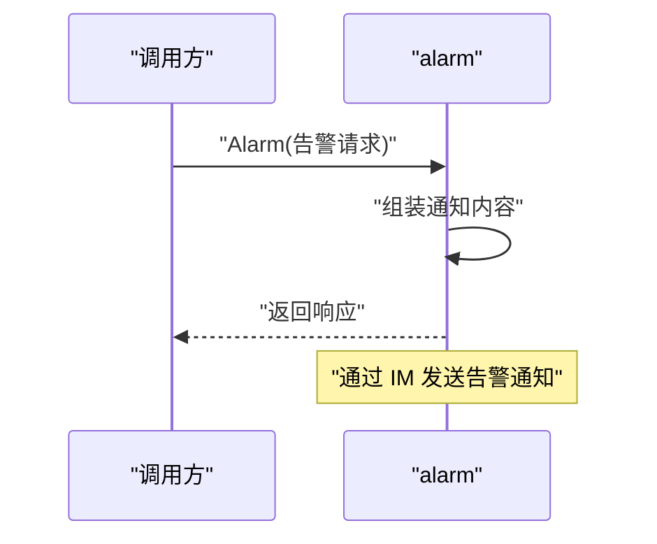
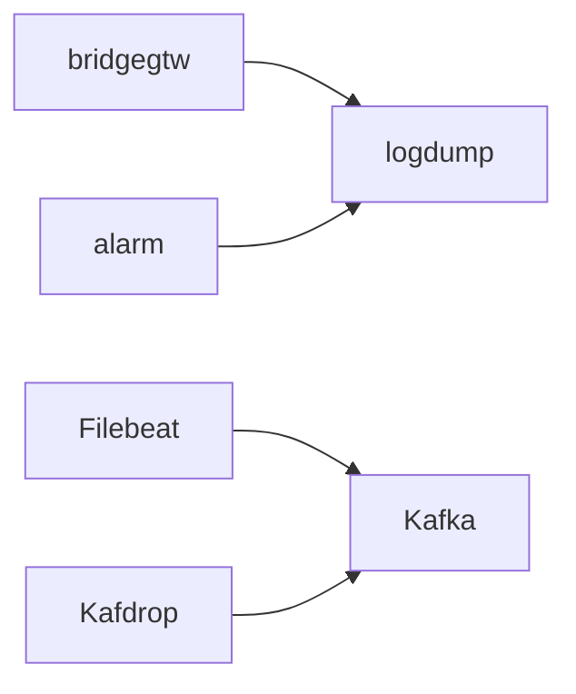

# 监控工具集成

<cite>
**本文引用的文件**
- [docker-compose.yml](file://deploy/docker-compose.yml)
- [filebeat.yml](file://deploy/filebeat/conf/filebeat.yml)
- [stat_analyzer.html](file://deploy/stat_analyzer.html)
- [alarm.yaml](file://app/alarm/etc/alarm.yaml)
- [logdump.yaml](file://app/logdump/etc/logdump.yaml)
- [bridgegtw.yaml](file://app/bridgegtw/etc/bridgegtw.yaml)
- [alarm.proto](file://app/alarm/alarm.proto)
- [alarm_grpc.pb.go](file://app/alarm/alarm/alarm_grpc.pb.go)
- [alarmlogic.go](file://app/alarm/internal/logic/alarmlogic.go)
- [pushloglogic.go](file://app/logdump/internal/logic/pushloglogic.go)
- [dockerx.go](file://common/dockerx/dockerx.go)
</cite>

## 目录
1. [简介](#简介)
2. [项目结构](#项目结构)
3. [核心组件](#核心组件)
4. [架构总览](#架构总览)
5. [详细组件分析](#详细组件分析)
6. [依赖关系分析](#依赖关系分析)
7. [性能考量](#性能考量)
8. [故障排查指南](#故障排查指南)
9. [结论](#结论)
10. [附录](#附录)

## 简介
本文件面向 zero-service 项目的监控与告警体系建设，围绕 Prometheus、Grafana、Zabbix、ELK Stack 等主流监控系统，结合仓库现有日志采集与组件配置，给出可落地的集成方案与最佳实践。重点涵盖：
- Prometheus 抓取与服务发现、指标暴露与告警规则
- Grafana 仪表板创建与常用模板
- ELK 日志采集与分析（基于现有 Filebeat/Kafka 集成）
- Zabbix 的基础接入建议
- 一键部署的 Docker Compose 示例与注意事项

## 项目结构
本项目采用多微服务架构，各组件通过 gRPC/HTTP 提供能力，并具备日志输出与中间件统计能力。日志采集通过 Filebeat 收集并投递至 Kafka，便于后续统一分析。

图示来源
- [docker-compose.yml:1-110](file://deploy/docker-compose.yml#L1-L110)
- [filebeat.yml:1-122](file://deploy/filebeat/conf/filebeat.yml#L1-L122)
- [bridgegtw.yaml:1-40](file://app/bridgegtw/etc/bridgegtw.yaml#L1-L40)
- [logdump.yaml:1-26](file://app/logdump/etc/logdump.yaml#L1-L26)
- [alarm.yaml:1-26](file://app/alarm/etc/alarm.yaml#L1-L26)

章节来源
- [docker-compose.yml:1-110](file://deploy/docker-compose.yml#L1-L110)
- [filebeat.yml:1-122](file://deploy/filebeat/conf/filebeat.yml#L1-L122)
- [bridgegtw.yaml:1-40](file://app/bridgegtw/etc/bridgegtw.yaml#L1-L40)
- [logdump.yaml:1-26](file://app/logdump/etc/logdump.yaml#L1-L26)
- [alarm.yaml:1-26](file://app/alarm/etc/alarm.yaml#L1-L26)

## 核心组件
- 日志采集与传输
  - Filebeat：从桥接组件输出的日志目录采集 JSON 文本，按输入动态选择 Kafka Topic 并发送。
  - Kafka：作为日志/事件缓冲与传输通道。
  - Kafdrop：Kafka Web UI，便于查看主题与消费情况。
- 日志接收与落盘
  - logdump：提供 gRPC 接口接收结构化日志，支持额外字段白名单过滤与日志级别输出。
- 告警服务
  - alarm：提供告警接口与聊天通知能力，可对接企业微信/飞书等 IM。
- 网关与上游
  - bridgegtw：对外提供 HTTP API，内部转发到下游 gRPC 服务（如 logdump）。

章节来源
- [filebeat.yml:1-122](file://deploy/filebeat/conf/filebeat.yml#L1-L122)
- [docker-compose.yml:1-110](file://deploy/docker-compose.yml#L1-L110)
- [logdump.yaml:1-26](file://app/logdump/etc/logdump.yaml#L1-L26)
- [alarm.yaml:1-26](file://app/alarm/etc/alarm.yaml#L1-L26)
- [bridgegtw.yaml:1-40](file://app/bridgegtw/etc/bridgegtw.yaml#L1-L40)

## 架构总览
下图展示了监控与告警的关键交互路径，包括日志采集、传输、存储与告警触发。

图示来源
- [bridgegtw.yaml:1-40](file://app/bridgegtw/etc/bridgegtw.yaml#L1-L40)
- [logdump.yaml:1-26](file://app/logdump/etc/logdump.yaml#L1-L26)
- [filebeat.yml:1-122](file://deploy/filebeat/conf/filebeat.yml#L1-L122)
- [docker-compose.yml:1-110](file://deploy/docker-compose.yml#L1-L110)
- [alarm.proto:1-33](file://app/alarm/alarm.proto#L1-L33)

## 详细组件分析

### 日志采集与传输（Filebeat → Kafka）
- Filebeat 输入
  - 监听桥接组件输出目录中的 JSON 文本文件，按输入配置设置 topic 字段，实现按业务域路由到不同 Kafka 主题。
  - 多行解析与 JSON 解码，清洗后输出到 Kafka。
- Kafka 与 Kafdrop
  - Compose 中包含 Kafka 与 Kafdrop，便于验证消息是否成功投递与消费。

图示来源
- [filebeat.yml:1-122](file://deploy/filebeat/conf/filebeat.yml#L1-L122)
- [docker-compose.yml:1-110](file://deploy/docker-compose.yml#L1-L110)

章节来源
- [filebeat.yml:1-122](file://deploy/filebeat/conf/filebeat.yml#L1-L122)
- [docker-compose.yml:1-110](file://deploy/docker-compose.yml#L1-L110)

### 日志接收与落盘（logdump）
- 结构化日志推送
  - 支持额外字段白名单过滤，仅保留受控字段进入日志结构化上下文。
  - 按日志级别输出，便于后续统一采集与检索。
- 日志路径与保留策略
  - 通过配置指定日志输出目录与保留天数，确保磁盘空间可控。

图示来源
- [pushloglogic.go:1-68](file://app/logdump/internal/logic/pushloglogic.go#L1-L68)
- [logdump.yaml:1-26](file://app/logdump/etc/logdump.yaml#L1-L26)

章节来源
- [pushloglogic.go:1-68](file://app/logdump/internal/logic/pushloglogic.go#L1-L68)
- [logdump.yaml:1-26](file://app/logdump/etc/logdump.yaml#L1-L26)

### 告警服务（alarm）
- 告警接口
  - 提供告警 RPC 接口，支持标题、描述、项目、报警 ID、内容、错误信息、用户 ID、IP 等字段。
- 通知与会话管理
  - 可对接 IM，自动创建或更新聊天会话名称，支持交互式卡片回调（预留）。
- 配置要点
  - Redis、Telemetry（链路追踪）可选；AppId/AppSecret/EncryptKey/VerificationToken 用于 IM 通知。

图示来源
- [alarm.proto:1-33](file://app/alarm/alarm.proto#L1-L33)
- [alarm_grpc.pb.go:1-103](file://app/alarm/alarm/alarm_grpc.pb.go#L1-L103)
- [alarmlogic.go:1-184](file://app/alarm/internal/logic/alarmlogic.go#L1-L184)
- [alarm.yaml:1-26](file://app/alarm/etc/alarm.yaml#L1-L26)

章节来源
- [alarm.proto:1-33](file://app/alarm/alarm.proto#L1-L33)
- [alarm_grpc.pb.go:1-103](file://app/alarm/alarm/alarm_grpc.pb.go#L1-L103)
- [alarmlogic.go:1-184](file://app/alarm/internal/logic/alarmlogic.go#L1-L184)
- [alarm.yaml:1-26](file://app/alarm/etc/alarm.yaml#L1-L26)

### 网关与上游（bridgegtw）
- 对外提供 HTTP API，内部映射到下游 gRPC 服务（如 logdump），便于统一入口与路由。
- 日志统计中间件
  - 通过 StatConf 控制忽略特定方法的统计，减少噪声。

章节来源
- [bridgegtw.yaml:1-40](file://app/bridgegtw/etc/bridgegtw.yaml#L1-L40)

### Docker 与资源信息提取（可选）
- 提供 Docker 客户端封装与容器资源解析工具，可用于监控容器资源使用情况（CPU、内存、卷挂载、端口映射等）。

章节来源
- [dockerx.go:1-59](file://common/dockerx/dockerx.go#L1-L59)

## 依赖关系分析
- 组件耦合
  - bridgegtw 依赖 logdump 进行日志落盘；alarm 依赖 logdump 进行日志输出与 IM 通知。
  - Filebeat 依赖 Kafka 作为传输通道；Kafdrop 依赖 Kafka 进行可视化。
- 外部依赖
  - Kafka 集群、Kafdrop UI、Filebeat、Redis（alarm）、IM 服务（alarm）。

图示来源
- [bridgegtw.yaml:1-40](file://app/bridgegtw/etc/bridgegtw.yaml#L1-L40)
- [logdump.yaml:1-26](file://app/logdump/etc/logdump.yaml#L1-L26)
- [alarm.yaml:1-26](file://app/alarm/etc/alarm.yaml#L1-L26)
- [filebeat.yml:1-122](file://deploy/filebeat/conf/filebeat.yml#L1-L122)
- [docker-compose.yml:1-110](file://deploy/docker-compose.yml#L1-L110)

章节来源
- [bridgegtw.yaml:1-40](file://app/bridgegtw/etc/bridgegtw.yaml#L1-L40)
- [logdump.yaml:1-26](file://app/logdump/etc/logdump.yaml#L1-L26)
- [alarm.yaml:1-26](file://app/alarm/etc/alarm.yaml#L1-L26)
- [filebeat.yml:1-122](file://deploy/filebeat/conf/filebeat.yml#L1-L122)
- [docker-compose.yml:1-110](file://deploy/docker-compose.yml#L1-L110)

## 性能考量
- 日志吞吐
  - Filebeat 的扫描频率、关闭文件时间、忽略过期文件等参数影响采集延迟与资源占用，建议根据实际写入节奏调整。
- Kafka 承载
  - 合理设置分区数量与副本，避免单点瓶颈；生产环境建议开启压缩与合理的 ack 策略。
- 告警风暴
  - alarm 服务应避免重复告警与风暴传播，建议在网关或上游增加去重与节流策略。
- 资源监控
  - 可利用 dockerx 工具采集容器资源信息，辅助容量规划与异常定位。

章节来源
- [filebeat.yml:1-122](file://deploy/filebeat/conf/filebeat.yml#L1-L122)
- [docker-compose.yml:1-110](file://deploy/docker-compose.yml#L1-L110)
- [dockerx.go:1-59](file://common/dockerx/dockerx.go#L1-L59)

## 故障排查指南
- 日志无法采集
  - 检查 Filebeat 配置中的路径与扫描频率；确认容器挂载路径正确；查看 Filebeat 输出到 Kafka 的主题是否一致。
- Kafka 消费异常
  - 使用 Kafdrop 查看主题与消费者组状态；确认 Kafka 服务连通性与分区分配。
- 告警未送达
  - 检查 alarm 服务的 IM 配置（AppId/AppSecret/Token/EncryptKey）；确认用户 ID 列表有效。
- 日志落盘异常
  - 检查 logdump 的日志输出目录权限与磁盘空间；确认 StatConf 是否对特定方法进行了忽略。

章节来源
- [filebeat.yml:1-122](file://deploy/filebeat/conf/filebeat.yml#L1-L122)
- [docker-compose.yml:1-110](file://deploy/docker-compose.yml#L1-L110)
- [alarm.yaml:1-26](file://app/alarm/etc/alarm.yaml#L1-L26)
- [logdump.yaml:1-26](file://app/logdump/etc/logdump.yaml#L1-L26)

## 结论
通过现有 Filebeat/Kafka 集成与组件日志输出能力，zero-service 已具备完善的日志采集与传输基础。结合 alarm 告警服务与 bridgegtw 网关，可快速搭建“日志 → 存储 → 分析 → 告警”的闭环。后续可在该基础上扩展 Prometheus 指标采集、Grafana 仪表板与 Zabbix/ELK 的深度集成，形成统一的可观测性平台。

## 附录

### Prometheus 集成方案（步骤与要点）
- 指标暴露
  - 在各业务组件中引入指标导出库，暴露 HTTP 端点（如 /metrics），默认端口建议在组件配置中集中管理。
- 服务发现
  - 使用静态目标或 Consul/Nacos 服务发现，自动拉取组件实例列表。
- 抓取配置
  - 在 Prometheus 中配置抓取任务，设置抓取间隔、超时与标签。
- 告警规则
  - 基于组件 QPS、错误率、响应时间、GC 次数、CPU/内存使用等指标编写告警规则。
- 通知渠道
  - 将告警路由到 Webhook 或 AlertManager，再分发到企业微信/飞书等 IM。

[本节为通用集成指导，不直接分析具体文件，故无章节来源]

### Grafana 仪表板创建与常用模板
- 数据源
  - 添加 Prometheus 作为数据源，配置查询端点与超时。
- 图表模板
  - QPS/错误率/响应时间/限流/缓存命中率/系统指标（CPU、内存、GC）等常用面板。
- 面板联动
  - 使用变量（服务名、实例、时间范围）实现跨面板联动与筛选。
- 预设仪表板
  - 可参考社区提供的 Go/Go-Zero 指标面板，结合本项目组件进行定制。

[本节为通用操作指导，不直接分析具体文件，故无章节来源]

### ELK 日志收集与分析（基于现有 Filebeat/Kafka）
- Filebeat
  - 使用现有配置，确保按输入动态选择 Kafka 主题；必要时增加字段清理与多行解析。
- Kafka
  - 作为日志缓冲与传输通道，建议开启压缩与副本。
- Logstash/Beats
  - 可选：通过 Logstash 进一步清洗与聚合；或直接使用 Beats 管道。
- Kibana
  - 导入索引模式，创建可视化图表与仪表板，实现日志检索与趋势分析。

章节来源
- [filebeat.yml:1-122](file://deploy/filebeat/conf/filebeat.yml#L1-L122)
- [docker-compose.yml:1-110](file://deploy/docker-compose.yml#L1-L110)

### Zabbix 接入建议
- 主机发现
  - 使用 Zabbix Agent 或外部脚本发现容器与主机实例。
- 指标采集
  - 通过内置模板或自定义项采集 CPU、内存、磁盘、网络与进程状态。
- 触发器
  - 基于阈值与趋势设置触发器，结合告警媒介（邮件/IM/Webhook）联动 alarm 服务。
- 集成
  - 将 Zabbix 的告警通过 Webhook 推送到 alarm，实现统一通知。

[本节为通用集成指导，不直接分析具体文件，故无章节来源]

### 一键部署（Docker Compose）示例与说明
- Kafka
  - 提供持久化数据目录与控制器配置；注意监听与广告地址映射。
- Filebeat
  - 映射容器日志目录与配置文件；设置时区与权限。
- Kafdrop
  - 提供 Web UI 端口映射，连接 Kafka 地址。
- 业务组件
  - bridgegtw/logdump/alarm 等组件通过 Compose 启动，注意网络模式与挂载目录。

章节来源
- [docker-compose.yml:1-110](file://deploy/docker-compose.yml#L1-L110)

### 统计分析与可视化（stat_analyzer.html）
- 作用
  - 对日志中的统计字段进行聚合与可视化，支持按分钟窗口计算 QPS、响应时间分位数、限流统计与缓存命中率等。
- 使用建议
  - 将该页面部署为静态资源，结合日志采集与存储，实现近实时的性能分析与告警联动。

章节来源
- [stat_analyzer.html:862-1307](file://deploy/stat_analyzer.html#L862-L1307)