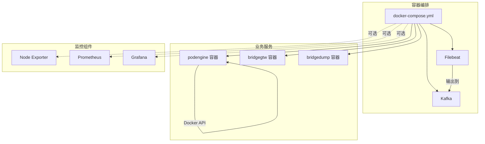
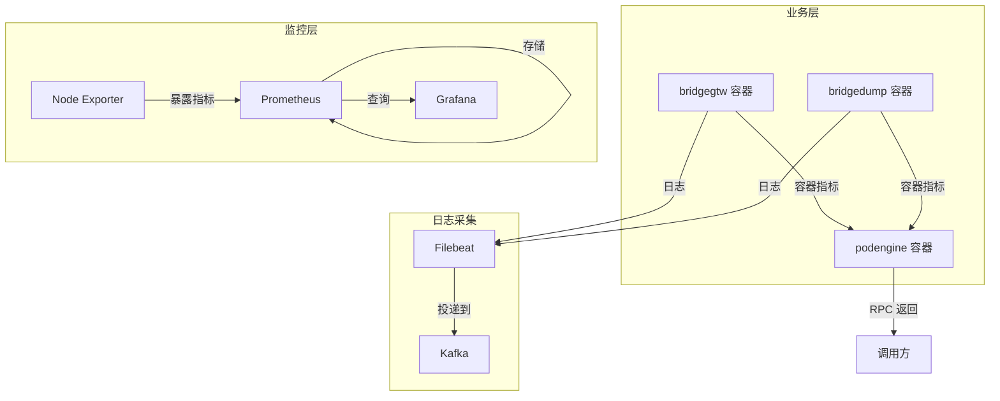
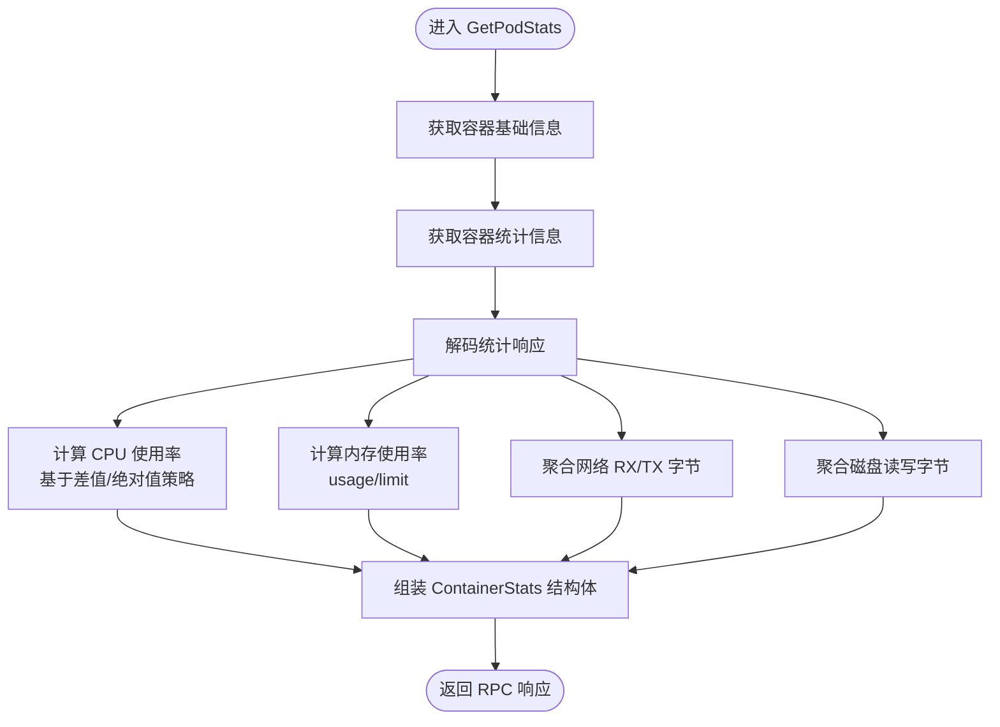
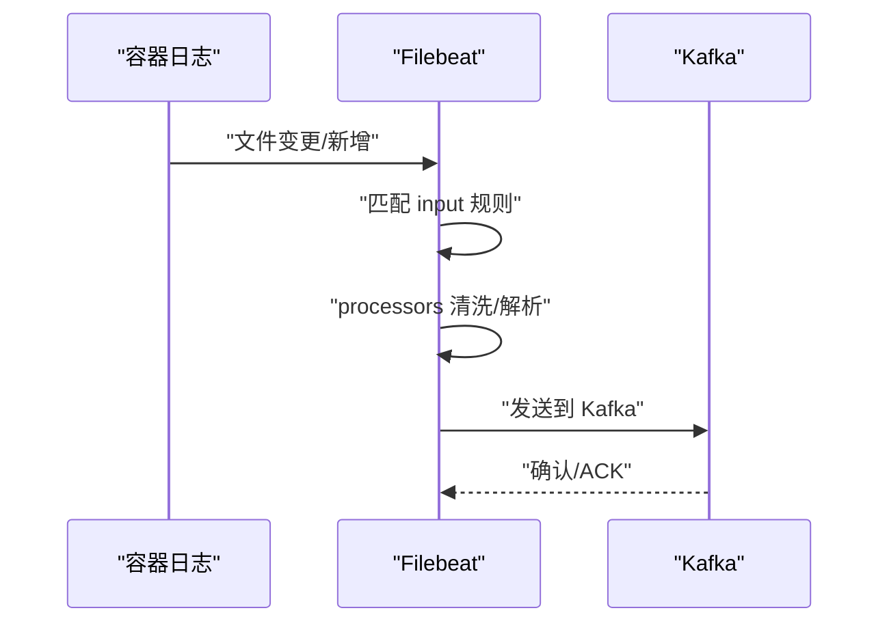
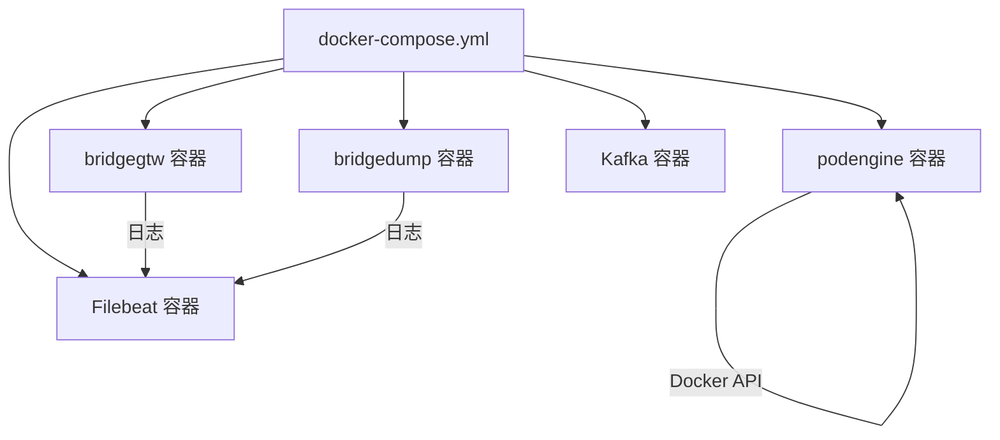
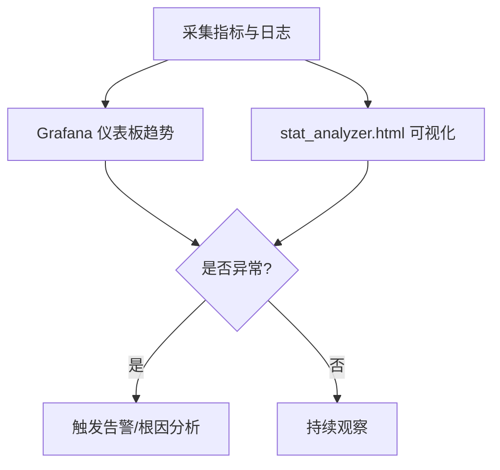
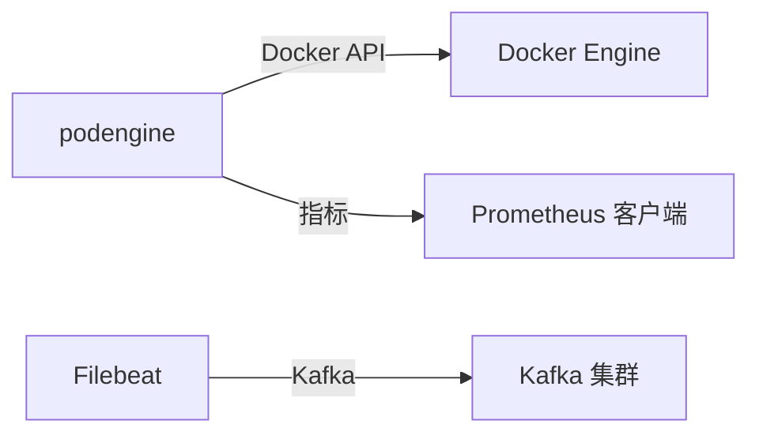

# 系统资源监控

<cite>
**本文引用的文件**
- [docker-compose.yml](file://deploy/docker-compose.yml)
- [filebeat.yml](file://deploy/filebeat/conf/filebeat.yml)
- [podengine.yaml](file://app/podengine/etc/podengine.yaml)
- [getpodstatslogic.go](file://app/podengine/internal/logic/getpodstatslogic.go)
- [podengine.pb.go](file://app/podengine/podengine/podengine.pb.go)
- [Dockerfile（podengine）](file://app/podengine/Dockerfile)
- [Dockerfile（bridgegtw）](file://app/bridgegtw/Dockerfile)
- [Dockerfile（bridgedump）](file://app/bridgedump/Dockerfile)
- [stat_analyzer.html](file://deploy/stat_analyzer.html)
- [go.sum](file://go.sum)
</cite>

## 目录
1. [简介](#简介)
2. [项目结构](#项目结构)
3. [核心组件](#核心组件)
4. [架构总览](#架构总览)
5. [详细组件分析](#详细组件分析)
6. [依赖分析](#依赖分析)
7. [性能考量](#性能考量)
8. [故障排查指南](#故障排查指南)
9. [结论](#结论)
10. [附录](#附录)

## 简介
本文件面向 zero-service 项目的系统资源监控与运维实践，围绕容器与主机层面的资源指标采集、传输与可视化进行系统性梳理。重点覆盖：
- 容器资源指标采集：CPU 使用率、内存占用、网络流量、磁盘 IO
- 日志采集与传输：基于 Filebeat 将业务日志投递至 Kafka
- 监控组件集成：Prometheus、Node Exporter、Grafana 的部署与配置思路
- Docker 与 Kubernetes 环境中的部署与扩缩容建议
- 资源趋势分析与异常检测方法，辅助定位系统瓶颈与资源异常

## 项目结构
本项目采用多服务微架构，每个服务独立打包为容器镜像，并通过 docker-compose 进行本地编排。与资源监控相关的关键位置如下：
- 容器资源监控：podengine 服务通过 Docker Engine API 获取容器实时资源统计
- 日志采集：Filebeat 从容器日志目录采集并发送至 Kafka
- 监控组件：Prometheus、Node Exporter、Grafana 作为外部组件在 docker-compose 中可选加入
- 配置文件：各服务的 YAML 配置与 Dockerfile

**图表来源**
- [docker-compose.yml:1-110](file://deploy/docker-compose.yml#L1-L110)
- [filebeat.yml:1-122](file://deploy/filebeat/conf/filebeat.yml#L1-L122)

**章节来源**
- [docker-compose.yml:1-110](file://deploy/docker-compose.yml#L1-L110)
- [filebeat.yml:1-122](file://deploy/filebeat/conf/filebeat.yml#L1-L122)

## 核心组件
- podengine 服务：负责查询指定节点上容器的资源统计，计算 CPU、内存、网络、磁盘 IO 指标，并以 RPC 返回给调用方
- Filebeat：采集业务日志并投递到 Kafka，便于统一汇聚与后续分析
- docker-compose：统一编排业务服务与可选监控组件
- Prometheus/Node Exporter/Grafana：作为外部监控体系，采集主机与容器指标并可视化

**章节来源**
- [getpodstatslogic.go:32-133](file://app/podengine/internal/logic/getpodstatslogic.go#L32-L133)
- [podengine.pb.go:1758-1769](file://app/podengine/podengine/podengine.pb.go#L1758-L1769)
- [podengine.yaml:1-20](file://app/podengine/etc/podengine.yaml#L1-L20)
- [docker-compose.yml:1-110](file://deploy/docker-compose.yml#L1-L110)
- [filebeat.yml:1-122](file://deploy/filebeat/conf/filebeat.yml#L1-L122)

## 架构总览
下图展示了资源监控的整体链路：业务容器产生资源与日志数据，podengine 采集容器指标，Filebeat 采集日志并投递到 Kafka，Prometheus 抓取指标并持久化，Grafana 展示仪表板。

**图表来源**
- [getpodstatslogic.go:32-133](file://app/podengine/internal/logic/getpodstatslogic.go#L32-L133)
- [filebeat.yml:110-119](file://deploy/filebeat/conf/filebeat.yml#L110-L119)
- [docker-compose.yml:5-30](file://deploy/docker-compose.yml#L5-L30)

## 详细组件分析

### 容器资源指标采集（podengine）
podengine 通过 Docker Engine API 获取容器统计信息，计算 CPU 使用率、内存使用率、网络 RX/TX、磁盘读写字节等指标，并封装为 RPC 响应结构体字段，供上层调用与展示。

- 指标计算逻辑要点
  - CPU 使用率：基于两次采样差值与系统时间差计算，若数据不足则回退到绝对值比例
  - 内存使用率：当前使用量与限制的比值
  - 网络统计：聚合所有网络接口的 RX/TX 字节
  - 磁盘 IO：聚合 blkio 统计中 read/write 字节
- 返回结构体字段：包含容器 ID/名称、CPU 百分比与总量、内存使用/限制与百分比、网络 RX/TX、磁盘读写、时间戳等

**图表来源**
- [getpodstatslogic.go:32-133](file://app/podengine/internal/logic/getpodstatslogic.go#L32-L133)
- [podengine.pb.go:1758-1769](file://app/podengine/podengine/podengine.pb.go#L1758-L1769)

**章节来源**
- [getpodstatslogic.go:32-133](file://app/podengine/internal/logic/getpodstatslogic.go#L32-L133)
- [podengine.pb.go:1758-1769](file://app/podengine/podengine/podengine.pb.go#L1758-L1769)

### 日志采集与传输（Filebeat → Kafka）
Filebeat 从容器日志目录采集业务日志，按输入规则匹配多个主题，解析 JSON 并通过 Kafka 输出插件发送到 Kafka 集群。

- 关键点
  - 多个 input 监听不同目录，分别映射到不同 Kafka 主题
  - 使用 processors 对日志进行清洗、JSON 解析、字段保留与丢弃
  - 输出到 Kafka，topic 名称由 input 的 fields.topic 动态决定

**图表来源**
- [filebeat.yml:4-73](file://deploy/filebeat/conf/filebeat.yml#L4-L73)
- [filebeat.yml:85-106](file://deploy/filebeat/conf/filebeat.yml#L85-L106)
- [filebeat.yml:110-119](file://deploy/filebeat/conf/filebeat.yml#L110-L119)

**章节来源**
- [filebeat.yml:1-122](file://deploy/filebeat/conf/filebeat.yml#L1-L122)

### 监控组件集成（Prometheus、Node Exporter、Grafana）
- Node Exporter：采集主机系统指标（CPU、内存、磁盘、网络），以文本格式暴露 metrics
- Prometheus：定时抓取 Node Exporter 暴露的指标，进行存储与查询
- Grafana：连接 Prometheus 数据源，创建仪表板展示资源趋势

部署建议（概念性说明，不绑定具体文件）：
- 在 docker-compose 中新增服务：node-exporter、prometheus、grafana
- prometheus.yml 配置 targets 为 node-exporter 地址
- grafana 中添加 Prometheus 数据源并导入通用仪表板模板

[本节为概念性说明，不直接分析具体文件，故无“章节来源”]

### Docker 环境部署与监控
- 使用 docker-compose 编排业务服务与可选监控组件
- 业务服务镜像由各自 Dockerfile 构建，CMD 指向服务入口与配置文件
- Filebeat 通过挂载宿主机 /var/lib/docker/containers 目录采集日志

**图表来源**
- [docker-compose.yml:54-109](file://deploy/docker-compose.yml#L54-L109)
- [Dockerfile（podengine）:40-42](file://app/podengine/Dockerfile#L40-L42)
- [Dockerfile（bridgegtw）:39-43](file://app/bridgegtw/Dockerfile#L39-L43)
- [Dockerfile（bridgedump）:39-42](file://app/bridgedump/Dockerfile#L39-L42)

**章节来源**
- [docker-compose.yml:1-110](file://deploy/docker-compose.yml#L1-L110)
- [Dockerfile（podengine）:1-42](file://app/podengine/Dockerfile#L1-L42)
- [Dockerfile（bridgegtw）:1-43](file://app/bridgegtw/Dockerfile#L1-L43)
- [Dockerfile（bridgedump）:1-42](file://app/bridgedump/Dockerfile#L1-L42)

### Kubernetes 环境中的资源监控
- Pod 资源配额：在 Deployment 中设置 requests/limits，结合探针保障健康
- 监控面：在集群中部署 Node Exporter DaemonSet、Prometheus 与 Grafana
- 业务观测：结合服务网格与日志采集（如 Filebeat/Kafka）实现端到端可观测

[本节为概念性说明，不直接分析具体文件，故无“章节来源”]

### 资源使用趋势分析与异常检测
- 趋势分析：利用 Grafana 仪表板对 CPU、内存、网络、磁盘 IO 进行时间序列分析
- 异常检测：基于阈值告警（如 CPU > 90% 持续 5 分钟）、同比/环比突增、资源利用率与 QPS 的关联分析
- 日志联动：结合 stat_analyzer.html 对 Go-Zero 统计日志进行可视化分析，识别内存抖动、GC 次数异常、QPS 波动与丢弃请求

**图表来源**
- [stat_analyzer.html:248-360](file://deploy/stat_analyzer.html#L248-L360)

**章节来源**
- [stat_analyzer.html:1-800](file://deploy/stat_analyzer.html#L1-L800)

## 依赖分析
- 容器资源采集依赖 Docker Engine API，podengine 通过 Docker 客户端连接远端或本地 Docker Socket
- 指标库依赖：项目中包含 Prometheus 生态相关依赖，可用于指标导出或客户端集成
- 日志采集依赖 Kafka，Filebeat 通过输出插件将日志发送到 Kafka 集群

**图表来源**
- [getpodstatslogic.go:37-53](file://app/podengine/internal/logic/getpodstatslogic.go#L37-L53)
- [go.sum:428-440](file://go.sum#L428-L440)
- [filebeat.yml:110-119](file://deploy/filebeat/conf/filebeat.yml#L110-L119)

**章节来源**
- [getpodstatslogic.go:32-133](file://app/podengine/internal/logic/getpodstatslogic.go#L32-L133)
- [go.sum:428-440](file://go.sum#L428-L440)
- [filebeat.yml:1-122](file://deploy/filebeat/conf/filebeat.yml#L1-L122)

## 性能考量
- 容器指标采样频率：合理设置采样间隔，避免频繁 API 调用带来的额外开销
- 日志采集吞吐：根据磁盘与网络带宽调整 Filebeat 的并发与缓冲，避免阻塞
- 监控组件资源：Node Exporter、Prometheus、Grafana 的资源请求与限制需结合数据量与查询复杂度进行评估
- 服务扩缩容：在 Kubernetes 中通过 HPA 与资源配额控制容器资源使用，防止资源争抢

[本节为通用指导，不直接分析具体文件，故无“章节来源”]

## 故障排查指南
- 容器资源指标为空或异常
  - 检查 podengine 配置中的 Docker API 地址与权限
  - 确认容器运行状态与统计可用性
  - 参考指标计算逻辑，关注差值与绝对值两种策略的适用场景
- 日志采集失败
  - 检查 Filebeat 配置的 paths 与字段映射
  - 确认 Kafka 集群连通性与主题权限
- 监控面板无数据
  - 检查 Node Exporter 暴露端口与 Prometheus 抓取配置
  - 校验 Grafana 数据源连接与查询语句

**章节来源**
- [podengine.yaml:19-20](file://app/podengine/etc/podengine.yaml#L19-L20)
- [getpodstatslogic.go:61-80](file://app/podengine/internal/logic/getpodstatslogic.go#L61-L80)
- [filebeat.yml:110-119](file://deploy/filebeat/conf/filebeat.yml#L110-L119)

## 结论
zero-service 在容器资源监控方面已具备完善的容器指标采集能力（podengine）与日志采集链路（Filebeat→Kafka）。结合 Prometheus/Node Exporter/Grafana 可实现主机与容器的全栈监控。建议在生产环境中：
- 明确资源配额与告警阈值
- 建立趋势分析与异常检测机制
- 将日志与指标联动分析，提升根因定位效率

[本节为总结性内容，不直接分析具体文件，故无“章节来源”]

## 附录
- 配置文件与镜像入口参考
  - podengine 配置：[podengine.yaml:1-20](file://app/podengine/etc/podengine.yaml#L1-L20)
  - podengine 镜像 CMD：[Dockerfile（podengine）:40-42](file://app/podengine/Dockerfile#L40-L42)
  - bridgegtw 镜像 CMD：[Dockerfile（bridgegtw）:39-43](file://app/bridgegtw/Dockerfile#L39-L43)
  - bridgedump 镜像 CMD：[Dockerfile（bridgedump）:39-42](file://app/bridgedump/Dockerfile#L39-L42)
- 日志采集配置参考
  - Filebeat 输入与输出：[filebeat.yml:1-122](file://deploy/filebeat/conf/filebeat.yml#L1-L122)
- docker-compose 编排参考
  - 服务编排与端口映射：[docker-compose.yml:1-110](file://deploy/docker-compose.yml#L1-L110)
- 指标结构参考
  - 容器指标字段定义：[podengine.pb.go:1758-1769](file://app/podengine/podengine/podengine.pb.go#L1758-L1769)
- 趋势分析工具参考
  - Go-Zero 统计日志分析页面：[stat_analyzer.html:248-360](file://deploy/stat_analyzer.html#L248-L360)