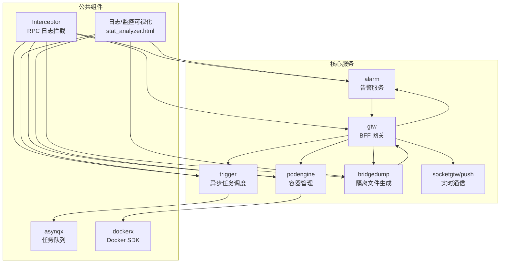
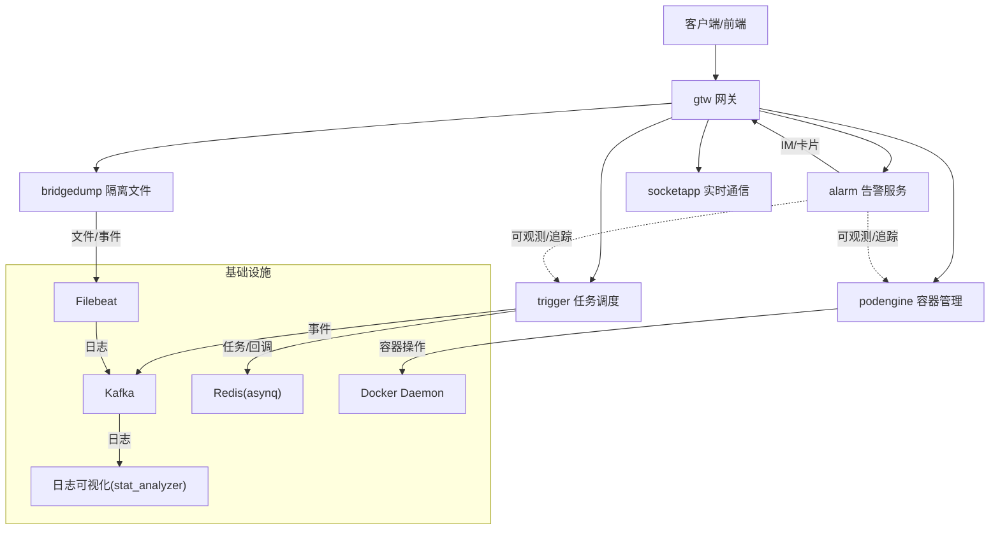
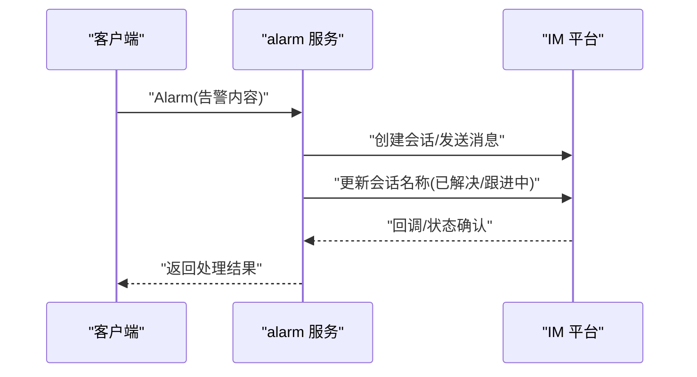
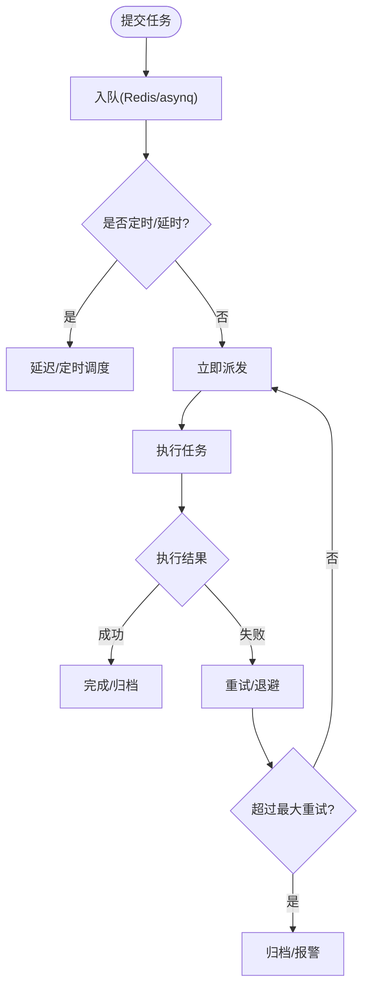
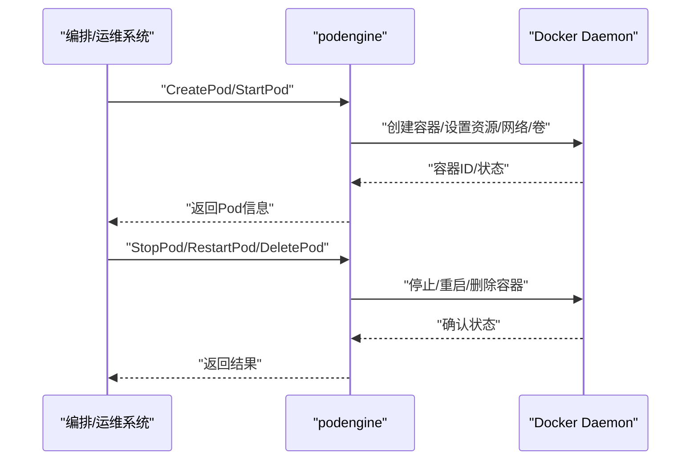
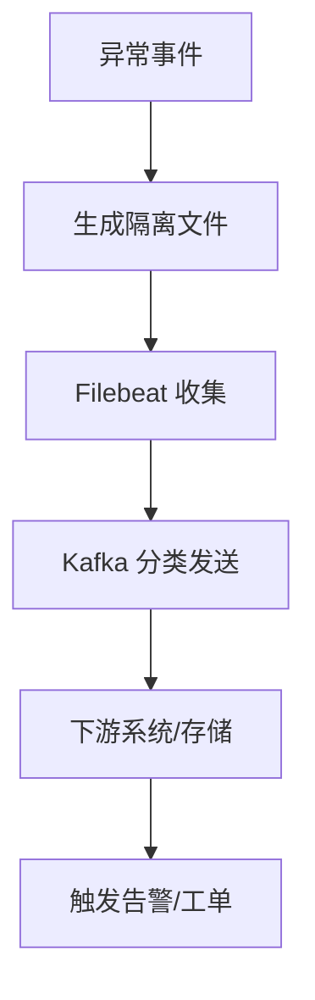
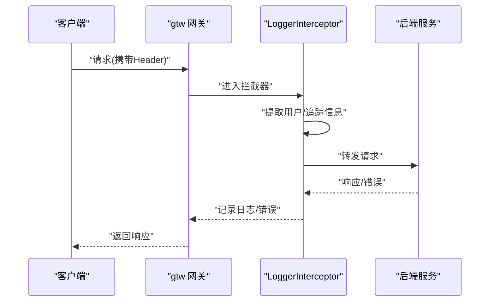
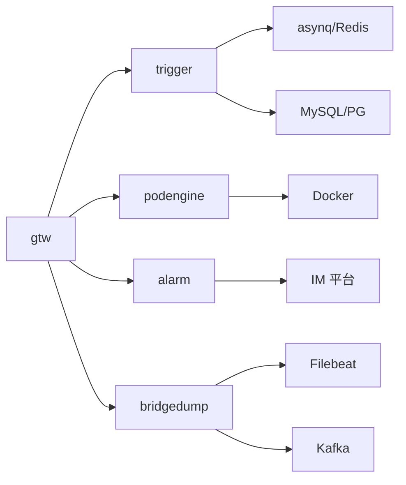
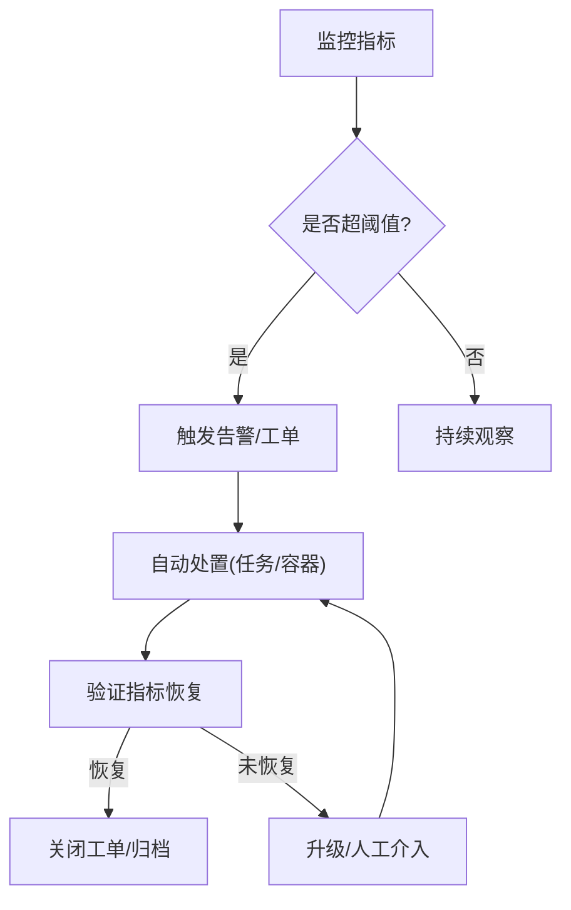

# 故障自愈与自动化运维

<cite>
**本文引用的文件**
- [README.md](file://README.md)
- [alarm.yaml](file://app/alarm/etc/alarm.yaml)
- [trigger.yaml](file://app/trigger/etc/trigger.yaml)
- [podengine.yaml](file://app/podengine/etc/podengine.yaml)
- [dockerx.go](file://common/dockerx/dockerx.go)
- [asynqClient.go](file://common/asynqx/asynqClient.go)
- [loggerInterceptor.go](file://common/Interceptor/rpcserver/loggerInterceptor.go)
- [docker-compose.yml](file://deploy/docker-compose.yml)
- [stat_analyzer.html](file://deploy/stat_analyzer.html)
- [alarm_grpc.pb.go](file://app/alarm/alarm/alarm_grpc.pb.go)
- [trigger.pb.validate.go](file://app/trigger/trigger/trigger.pb.validate.go)
- [bridgedump.pb.go](file://app/bridgedump/bridgedump/bridgedump.pb.go)
- [sse_demo.html](file://aiapp/ssegtw/sse_demo.html)
- [claude-code-guide.md](file://.trae/skills/zero-skills/getting-started/claude-code-guide.md)
- [analyze-project.md](file://.trae/skills/zero-skills/skill-patterns/analyze-project.md)
</cite>

## 目录
1. [引言](#引言)
2. [项目结构](#项目结构)
3. [核心组件](#核心组件)
4. [架构总览](#架构总览)
5. [详细组件分析](#详细组件分析)
6. [依赖分析](#依赖分析)
7. [性能考虑](#性能考虑)
8. [故障自愈与自动化运维实践](#故障自愈与自动化运维实践)
9. [运维机器人与智能化工具](#运维机器人与智能化工具)
10. [运维流程标准化](#运维流程标准化)
11. [监控闭环与质量保证](#监控闭环与质量保证)
12. [结论](#结论)

## 引言
本指南围绕 zero-service 的故障自愈与自动化运维展开，结合项目现有能力（告警、任务调度、容器管理、协议桥接、日志与监控可视化等），系统性地提出“自动检测—自动隔离—自动恢复”的故障自愈机制设计思路；梳理“自动扩缩容、故障切换、重启策略、回滚机制”等自动化运维流程；并探索“异常模式识别、根因分析、修复建议”的AI辅助诊断方向，以及“聊天机器人、自动化脚本、智能问答”的运维机器人应用。最后给出标准化变更与发布流程、应急预案，以及“监控-告警-处置-验证”的闭环质量保障方案。

## 项目结构
项目采用 go-zero 微服务架构，围绕 IEC 104 数采、异步任务调度、实时通信、容器管理、协议桥接、告警与日志导出等能力构建。核心服务包括 trigger（任务调度）、podengine（容器管理）、alarm（告警）、bridgedump（隔离文件生成）、以及 gtw 网关与 socketapp 实时通信模块。公共组件提供 asynq 任务队列、Docker SDK 封装、拦截器与日志、协议扩展等。

图表来源
- [README.md:15-51](file://README.md#L15-L51)
- [docker-compose.yml:1-110](file://deploy/docker-compose.yml#L1-L110)

章节来源
- [README.md:59-108](file://README.md#L59-L108)
- [docker-compose.yml:1-110](file://deploy/docker-compose.yml#L1-L110)

## 核心组件
- 告警服务 alarm：提供告警推送与交互卡片处理，支持 IM 会话状态更新，便于故障工单闭环。
- 异步任务调度 trigger：基于 asynq 的分布式任务队列，支持定时/延时任务、回调、重试与历史统计。
- 容器管理 podengine：基于 Docker SDK 的 Pod 抽象，提供容器生命周期管理与资源限制解析。
- 协议桥接 bridgedump：生成隔离文件，配合 Filebeat/Kafka 实现数据采集与传输。
- BFF 网关 gtw：统一入口，聚合 gRPC 与 HTTP，承载用户认证、文件上传等能力。
- 实时通信 socketapp：SocketIO 网关与推送服务，支持房间管理、MQTT 桥接与统计信息推送。
- 公共组件：asynqx（任务队列）、dockerx（Docker 封装）、Interceptor（RPC 日志拦截）、日志可视化（stat_analyzer.html）。

章节来源
- [README.md:110-188](file://README.md#L110-L188)
- [alarm.yaml:1-26](file://app/alarm/etc/alarm.yaml#L1-L26)
- [trigger.yaml:1-37](file://app/trigger/etc/trigger.yaml#L1-L37)
- [podengine.yaml:1-20](file://app/podengine/etc/podengine.yaml#L1-L20)

## 架构总览
下图展示零信任与自愈导向的运维架构：BFF 网关作为统一入口，触发任务调度与容器管理；告警服务负责异常感知与工单状态更新；协议桥接与隔离文件生成保障数据链路稳定；日志与可视化用于观测与诊断；公共拦截器与任务队列提供可观测与可追踪能力。

图表来源
- [README.md:15-51](file://README.md#L15-L51)
- [docker-compose.yml:1-110](file://deploy/docker-compose.yml#L1-L110)
- [stat_analyzer.html:248-276](file://deploy/stat_analyzer.html#L248-L276)

## 详细组件分析

### 告警服务 alarm（故障感知与工单闭环）
- 能力要点
  - 提供 Ping 与 Alarm RPC 接口，支持 IM 会话状态更新（如“跟进中/已解决”）。
  - 配置文件包含应用 ID、密钥、验证令牌与用户 ID 列表，便于与 IM 平台集成。
- 故障自愈关联
  - 通过 Alarm 接口触发告警与工单状态变更，形成“告警—处置—状态更新”的闭环。
  - 结合 IM 会话命名规则，自动标记问题处理进度，降低人工干预成本。

图表来源
- [alarm_grpc.pb.go:34-76](file://app/alarm/alarm/alarm_grpc.pb.go#L34-L76)
- [alarm.yaml:18-25](file://app/alarm/etc/alarm.yaml#L18-L25)

章节来源
- [alarm_grpc.pb.go:34-103](file://app/alarm/alarm/alarm_grpc.pb.go#L34-L103)
- [alarm.yaml:1-26](file://app/alarm/etc/alarm.yaml#L1-L26)

### 异步任务调度 trigger（任务队列与计划任务）
- 能力要点
  - 基于 asynq 的 Redis 存储，支持定时/延时任务、HTTP/gRPC 回调、自动重试与历史统计。
  - 配置包含 Redis、数据库、Nacos 注册、StreamEvent 端点等，支撑任务生命周期管理。
- 故障自愈关联
  - 通过任务队列承载“自动重试、归档、删除”等自愈动作；计划任务引擎提供巡检与状态聚合，便于故障前置发现。

图表来源
- [asynqClient.go:17-31](file://common/asynqx/asynqClient.go#L17-L31)
- [trigger.yaml:19-37](file://app/trigger/etc/trigger.yaml#L19-L37)

章节来源
- [asynqClient.go:1-31](file://common/asynqx/asynqClient.go#L1-L31)
- [trigger.yaml:1-37](file://app/trigger/etc/trigger.yaml#L1-L37)

### 容器管理 podengine（容器生命周期与自愈）
- 能力要点
  - 基于 Docker SDK 的 Pod 抽象，支持创建、启动、停止、重启、删除等操作。
  - 解析资源限制（CPU/内存/请求）、端口绑定、卷挂载与重启策略，支持 TerminationGracePeriod。
- 故障自愈关联
  - 通过 RestartPolicy 与 TerminationGracePeriod 实现“异常退出—自动重启—平滑退出”的自愈路径。
  - 结合日志与监控可视化，定位容器异常并触发回滚或替换。

图表来源
- [podengine.yaml:19-20](file://app/podengine/etc/podengine.yaml#L19-L20)
- [dockerx.go:11-95](file://common/dockerx/dockerx.go#L11-L95)

章节来源
- [podengine.yaml:1-20](file://app/podengine/etc/podengine.yaml#L1-L20)
- [dockerx.go:1-95](file://common/dockerx/dockerx.go#L1-L95)

### 协议桥接 bridgedump（隔离与数据链路稳定性）
- 能力要点
  - 生成隔离文件，支持与 Filebeat/Kafka 集成，实现数据采集与分类发送。
  - 提供故障相关数据结构（如 FaultData），便于后续分析与告警联动。
- 故障自愈关联
  - 通过隔离文件生成与事件上报，形成“异常事件—隔离—上报—告警”的闭环。

图表来源
- [bridgedump.pb.go:414-526](file://app/bridgedump/bridgedump/bridgedump.pb.go#L414-L526)
- [docker-compose.yml:32-53](file://deploy/docker-compose.yml#L32-L53)

章节来源
- [bridgedump.pb.go:414-526](file://app/bridgedump/bridgedump/bridgedump.pb.go#L414-L526)
- [docker-compose.yml:32-53](file://deploy/docker-compose.yml#L32-L53)

### BFF 网关 gtw（统一入口与可观测）
- 能力要点
  - 聚合 gRPC 与 HTTP，提供用户认证、文件上传、CORS 支持等。
  - 通过拦截器注入上下文与用户信息，并记录错误日志，便于追踪与审计。
- 故障自愈关联
  - 统一入口便于集中式熔断、限流与降级；拦截器日志为故障定位提供线索。

图表来源
- [loggerInterceptor.go:12-45](file://common/Interceptor/rpcserver/loggerInterceptor.go#L12-L45)

章节来源
- [loggerInterceptor.go:1-45](file://common/Interceptor/rpcserver/loggerInterceptor.go#L1-L45)

## 依赖分析
- 组件耦合
  - trigger 依赖 asynq（Redis）与数据库；alarm 依赖 IM 平台；podengine 依赖 Docker；bridgedump 依赖 Filebeat/Kafka。
  - gtw 作为统一入口，向上游服务提供统一协议与可观测能力。
- 外部依赖
  - Kafka、Redis、Docker、Filebeat、IM 平台等，构成可观测、可恢复、可隔离的基础设施。

图表来源
- [trigger.yaml:19-37](file://app/trigger/etc/trigger.yaml#L19-L37)
- [podengine.yaml:19-20](file://app/podengine/etc/podengine.yaml#L19-L20)
- [docker-compose.yml:1-110](file://deploy/docker-compose.yml#L1-L110)

章节来源
- [trigger.yaml:1-37](file://app/trigger/etc/trigger.yaml#L1-L37)
- [podengine.yaml:1-20](file://app/podengine/etc/podengine.yaml#L1-L20)
- [docker-compose.yml:1-110](file://deploy/docker-compose.yml#L1-L110)

## 性能考虑
- 任务队列与资源限制
  - 使用 asynq 的队列与重试策略，避免瞬时峰值导致的雪崩；合理设置 Redis 与数据库连接池。
  - 容器资源限制（CPU/内存/请求）与重启策略，确保在异常情况下快速恢复。
- 观测与可视化
  - 通过 stat_analyzer.html 对日志进行统计分析，关注 QPS、丢弃请求、GC、缓存命中率等指标，及时发现性能瓶颈。

章节来源
- [asynqClient.go:17-31](file://common/asynqx/asynqClient.go#L17-L31)
- [dockerx.go:58-86](file://common/dockerx/dockerx.go#L58-L86)
- [stat_analyzer.html:862-1174](file://deploy/stat_analyzer.html#L862-L1174)

## 故障自愈与自动化运维实践

### 自动检测
- 告警驱动：通过 alarm 的 Alarm 接口接收异常事件，结合 IM 会话状态标记，形成“异常—告警—标记”的自动检测链路。
- 任务驱动：trigger 的计划任务定期巡检关键指标（如队列积压、容器状态、磁盘/内存阈值），异常即触发告警。
- 协议桥接：bridgedump 生成隔离文件并上报，作为异常事件的证据链。

章节来源
- [alarm_grpc.pb.go:34-76](file://app/alarm/alarm/alarm_grpc.pb.go#L34-L76)
- [trigger.yaml:25-28](file://app/trigger/etc/trigger.yaml#L25-L28)
- [bridgedump.pb.go:414-526](file://app/bridgedump/bridgedump/bridgedump.pb.go#L414-L526)

### 自动隔离
- 协议隔离：bridgedump 生成隔离文件，配合 Filebeat/Kafka，将异常流量与正常流量分离，避免影响主链路。
- 网络隔离：gtw 层面可结合限流/熔断策略，对异常来源进行临时隔离，防止扩散。

章节来源
- [bridgedump.pb.go:414-526](file://app/bridgedump/bridgedump/bridgedump.pb.go#L414-L526)
- [docker-compose.yml:32-53](file://deploy/docker-compose.yml#L32-L53)

### 自动恢复
- 容器自愈：podengine 依据 RestartPolicy 与 TerminationGracePeriod，实现异常退出后的自动重启与平滑退出。
- 任务自愈：asynq 的自动重试与归档，确保失败任务不丢失；计划任务引擎的状态聚合，便于快速定位与修复。

章节来源
- [dockerx.go:172-187](file://common/dockerx/dockerx.go#L172-L187)
- [asynqClient.go:17-31](file://common/asynqx/asynqClient.go#L17-L31)

### 自动化运维流程
- 自动扩缩容：结合容器资源限制与监控指标，当 CPU/内存/队列长度超过阈值时，触发 podengine 的扩缩容动作（新增/删除 Pod）。
- 故障切换：gtw 层面对异常服务进行熔断与切换，将流量引导至备用实例或降级接口。
- 重启策略：根据容器健康检查与日志分析，自动执行 Stop/Start 或 Restart，确保服务尽快恢复。
- 回滚机制：当新版本引入问题时，通过 podengine 回滚至上一稳定版本；任务层面通过归档与重放实现回滚验证。

章节来源
- [dockerx.go:58-86](file://common/dockerx/dockerx.go#L58-L86)
- [loggerInterceptor.go:12-45](file://common/Interceptor/rpcserver/loggerInterceptor.go#L12-L45)

## 运维机器人与智能化工具

### 聊天机器人与智能问答
- IM 集成：alarm 服务通过 IM 平台实现告警与工单状态更新，可扩展为“聊天机器人”，自动回答常见故障与处置流程。
- SSE 示例：利用 sse_demo.html 展示服务端事件（SSE）交互，可用于构建智能问答与实时反馈界面。

章节来源
- [alarm_grpc.pb.go:34-76](file://app/alarm/alarm/alarm_grpc.pb.go#L34-L76)
- [sse_demo.html:558-604](file://aiapp/ssegtw/sse_demo.html#L558-L604)

### 自动化脚本与 AI 辅助
- 技能框架：zero-skills 提供 AI 助手技能加载与子代理工作流，支持动态上下文注入与只读分析，便于自动化脚本生成与项目审计。
- 使用场景：通过 Claude Code/ Copilot/Cursor 等工具，结合技能框架，实现“模板生成—参数注入—执行—验证”的自动化运维脚本流水线。

章节来源
- [.trae/skills/zero-skills/getting-started/claude-code-guide.md:114-181](file://.trae/skills/zero-skills/getting-started/claude-code-guide.md#L114-L181)
- [.trae/skills/zero-skills/skill-patterns/analyze-project.md:57-72](file://.trae/skills/zero-skills/skill-patterns/analyze-project.md#L57-L72)

## 运维流程标准化

### 变更管理
- 变更分类：紧急变更（热修复）、标准变更（功能迭代）、基础变更（依赖升级）。
- 流程节点：需求评审、方案设计、代码审查、测试验证、灰度发布、全量上线、回滚预案。
- 工具支撑：利用 AI 技能框架生成变更脚本与验证清单，减少人为差错。

### 发布流程
- 构建与打包：统一 Docker 镜像构建，确保环境一致性。
- 部署策略：蓝绿/金丝雀发布，结合 gtw 的熔断与切换，降低发布风险。
- 回滚策略：基于 podengine 的版本回滚与任务归档重放，确保快速恢复。

### 应急预案
- 故障分级：P0（全站停机）—P3（低影响）；不同级别对应不同的处置时限与升级流程。
- 处置清单：针对常见故障（容器崩溃、任务积压、告警风暴、网络隔离）制定标准处置步骤与责任人。
- 演练机制：定期进行故障演练，验证自动化脚本与回滚流程的有效性。

## 监控闭环与质量保证

### 监控-告警-处置-验证闭环
- 监控：通过 stat_analyzer.html 对日志进行统计分析，关注 QPS、丢弃请求、GC、缓存命中率等关键指标。
- 告警：alarm 服务接收异常事件并触发 IM 工单，标记处理状态。
- 处置：trigger 的计划任务与 podengine 的容器自愈共同执行处置动作。
- 验证：通过日志与可视化指标验证处置效果，形成闭环。

图表来源
- [stat_analyzer.html:248-276](file://deploy/stat_analyzer.html#L248-L276)
- [alarm_grpc.pb.go:34-76](file://app/alarm/alarm/alarm_grpc.pb.go#L34-L76)
- [asynqClient.go:17-31](file://common/asynqx/asynqClient.go#L17-L31)

章节来源
- [stat_analyzer.html:248-276](file://deploy/stat_analyzer.html#L248-L276)
- [stat_analyzer.html:862-1174](file://deploy/stat_analyzer.html#L862-L1174)

## 结论
zero-service 已具备完善的故障自愈与自动化运维基础：告警服务提供异常感知与工单闭环，任务调度提供自动重试与计划巡检，容器管理提供自愈重启与资源控制，协议桥接与日志可视化提供隔离与可观测能力。在此基础上，通过标准化变更与发布流程、应急预案与监控闭环，可进一步提升系统的韧性与可维护性。结合 AI 辅助与运维机器人，将实现更高水平的智能化运维。