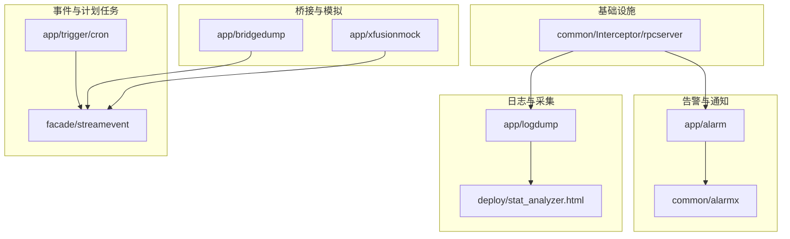
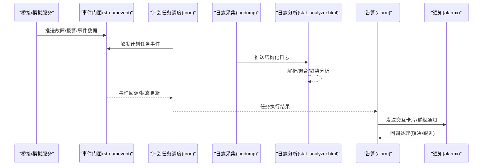
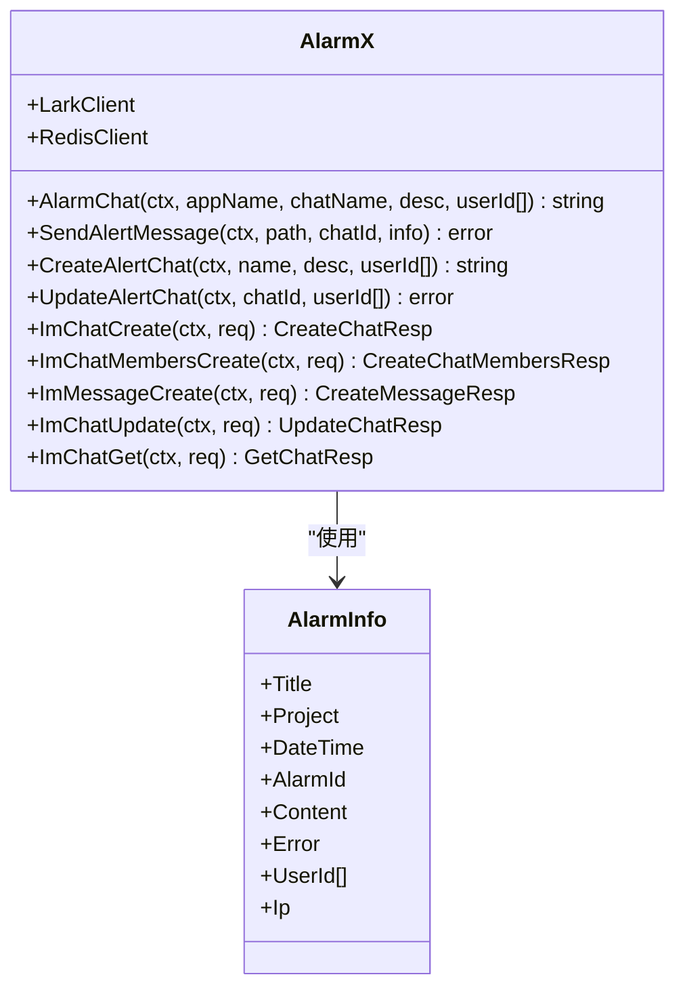
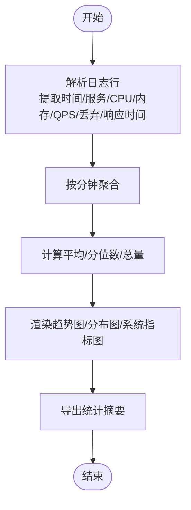
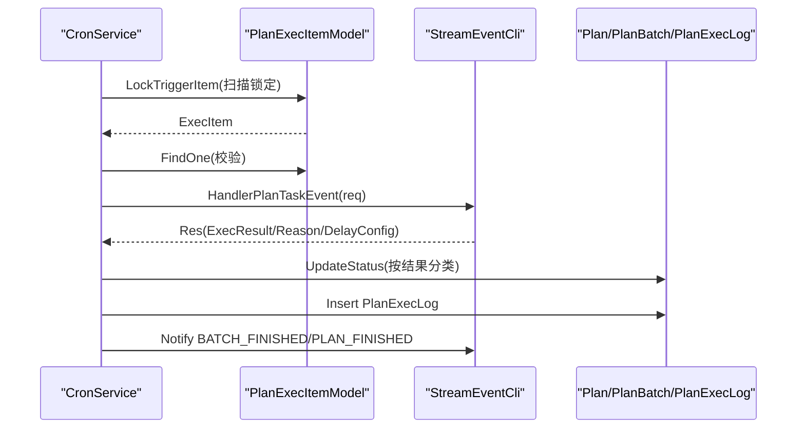
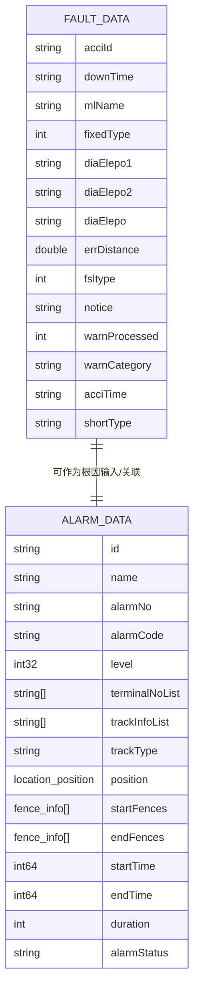
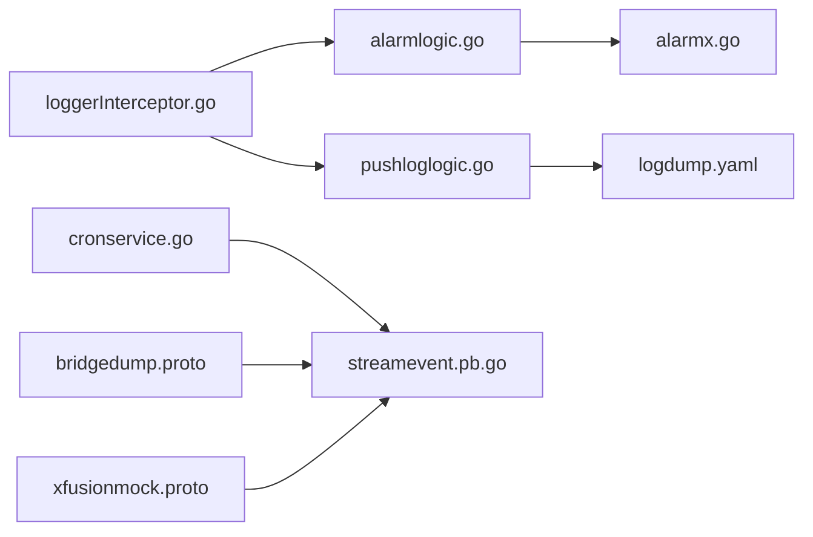

# 智能故障诊断与根因分析

<cite>
**本文档引用的文件**
- [app/alarm/etc/alarm.yaml](file://app/alarm/etc/alarm.yaml)
- [common/alarmx/alarmx.go](file://common/alarmx/alarmx.go)
- [app/alarm/internal/logic/alarmlogic.go](file://app/alarm/internal/logic/alarmlogic.go)
- [app/logdump/etc/logdump.yaml](file://app/logdump/etc/logdump.yaml)
- [app/logdump/internal/logic/pushloglogic.go](file://app/logdump/internal/logic/pushloglogic.go)
- [deploy/stat_analyzer.html](file://deploy/stat_analyzer.html)
- [app/bridgedump/bridgedump.proto](file://app/bridgedump/bridgedump.proto)
- [app/bridgedump/bridgedump/bridgedump.pb.go](file://app/bridgedump/bridgedump/bridgedump.pb.go)
- [app/xfusionmock/xfusionmock.proto](file://app/xfusionmock/xfusionmock.proto)
- [app/xfusionmock/xfusionmock/xfusionmock.pb.go](file://app/xfusionmock/xfusionmock/xfusionmock.pb.go)
- [model/kafkamodel.go](file://model/kafkamodel.go)
- [app/trigger/cron/cronservice.go](file://app/trigger/cron/cronservice.go)
- [facade/streamevent/streamevent/streamevent.pb.go](file://facade/streamevent/streamevent/streamevent.pb.go)
- [common/Interceptor/rpcserver/loggerInterceptor.go](file://common/Interceptor/rpcserver/loggerInterceptor.go)
</cite>

## 目录
1. [简介](#简介)
2. [项目结构](#项目结构)
3. [核心组件](#核心组件)
4. [架构总览](#架构总览)
5. [详细组件分析](#详细组件分析)
6. [依赖分析](#依赖分析)
7. [性能考虑](#性能考虑)
8. [故障排查指南](#故障排查指南)
9. [结论](#结论)
10. [附录](#附录)

## 简介
本项目围绕 zero-service 的微服务架构，提供“智能故障诊断与根因分析”能力，覆盖以下关键方向：
- AI辅助诊断与预警：基于异常模式识别、机器学习算法与智能预警机制，结合日志与事件流进行异常检测与风险提示。
- 根因分析：通过因果关系与依赖关系梳理、影响链路追踪，定位故障传播路径与关键节点。
- 日志智能分析：日志聚合、关键词提取、异常模式匹配、趋势分析与可视化。
- 故障预测模型：基于历史数据与实时指标，构建故障预测、风险评估与预防性维护体系。

本技术文档将从系统架构、组件职责、数据流与处理逻辑、依赖关系、性能与排错等方面，给出完整的技术说明，并提供可操作的实现案例与配置指南。

## 项目结构
本项目采用多模块微服务结构，围绕“告警、日志、事件流、计划任务调度、桥接采集与模拟数据”等子系统协同工作，形成完整的诊断与分析闭环。

**图表来源**
- [app/alarm/etc/alarm.yaml:1-26](file://app/alarm/etc/alarm.yaml#L1-L26)
- [app/logdump/etc/logdump.yaml:1-26](file://app/logdump/etc/logdump.yaml#L1-L26)
- [deploy/stat_analyzer.html:785-821](file://deploy/stat_analyzer.html#L785-L821)
- [app/trigger/cron/cronservice.go:1-469](file://app/trigger/cron/cronservice.go#L1-L469)
- [facade/streamevent/streamevent/streamevent.pb.go:349-470](file://facade/streamevent/streamevent/streamevent.pb.go#L349-L470)
- [common/Interceptor/rpcserver/loggerInterceptor.go:1-45](file://common/Interceptor/rpcserver/loggerInterceptor.go#L1-L45)

**章节来源**
- [app/alarm/etc/alarm.yaml:1-26](file://app/alarm/etc/alarm.yaml#L1-L26)
- [app/logdump/etc/logdump.yaml:1-26](file://app/logdump/etc/logdump.yaml#L1-L26)
- [deploy/stat_analyzer.html:785-821](file://deploy/stat_analyzer.html#L785-L821)
- [app/trigger/cron/cronservice.go:1-469](file://app/trigger/cron/cronservice.go#L1-L469)
- [facade/streamevent/streamevent/streamevent.pb.go:349-470](file://facade/streamevent/streamevent/streamevent.pb.go#L349-L470)
- [common/Interceptor/rpcserver/loggerInterceptor.go:1-45](file://common/Interceptor/rpcserver/loggerInterceptor.go#L1-L45)

## 核心组件
- 告警与通知中心：负责异常告警的生成、群组管理、交互卡片推送与回调处理。
- 日志采集与分析：负责日志接收、结构化、聚合与可视化分析。
- 事件与计划任务：负责定时扫描、任务执行、状态更新与事件通知。
- 桥接与模拟：负责故障数据、报警数据与事件流的桥接与模拟输入。
- 基础拦截器：统一注入用户与追踪上下文，增强可观测性。

**章节来源**
- [common/alarmx/alarmx.go:1-223](file://common/alarmx/alarmx.go#L1-L223)
- [app/alarm/internal/logic/alarmlogic.go:1-184](file://app/alarm/internal/logic/alarmlogic.go#L1-L184)
- [app/logdump/internal/logic/pushloglogic.go:1-68](file://app/logdump/internal/logic/pushloglogic.go#L1-L68)
- [deploy/stat_analyzer.html:248-1036](file://deploy/stat_analyzer.html#L248-L1036)
- [app/trigger/cron/cronservice.go:1-469](file://app/trigger/cron/cronservice.go#L1-L469)
- [app/bridgedump/bridgedump/bridgedump.pb.go:414-447](file://app/bridgedump/bridgedump/bridgedump.pb.go#L414-L447)
- [app/xfusionmock/xfusionmock/xfusionmock.pb.go:882-919](file://app/xfusionmock/xfusionmock/xfusionmock.pb.go#L882-L919)
- [common/Interceptor/rpcserver/loggerInterceptor.go:1-45](file://common/Interceptor/rpcserver/loggerInterceptor.go#L1-L45)

## 架构总览
下图展示了从“数据采集/桥接”到“事件处理/计划任务”，再到“告警通知”的整体流程，以及日志分析与可视化在其中的位置。

**图表来源**
- [app/bridgedump/bridgedump.proto:44-95](file://app/bridgedump/bridgedump.proto#L44-L95)
- [app/xfusionmock/xfusionmock.proto:153-187](file://app/xfusionmock/xfusionmock.proto#L153-L187)
- [facade/streamevent/streamevent/streamevent.pb.go:349-470](file://facade/streamevent/streamevent/streamevent.pb.go#L349-L470)
- [app/trigger/cron/cronservice.go:203-468](file://app/trigger/cron/cronservice.go#L203-L468)
- [app/logdump/etc/logdump.yaml:1-26](file://app/logdump/etc/logdump.yaml#L1-L26)
- [deploy/stat_analyzer.html:785-821](file://deploy/stat_analyzer.html#L785-L821)
- [common/alarmx/alarmx.go:119-140](file://common/alarmx/alarmx.go#L119-L140)

## 详细组件分析

### 告警与通知中心
- 组件职责
  - 群组聊天管理：首次创建或拉人入群，持久化聊天ID。
  - 交互卡片推送：根据模板构建卡片内容并发送至群聊。
  - 回调处理：支持消息与卡片动作回调，实现“已解决/跟进中”状态流转。
- 关键接口
  - 创建/更新群组、发送消息、获取群信息、更新群名。
  - 模板渲染与安全转义，确保内容可读与安全。
- 配置要点
  - 应用ID、密钥、加密参数、用户ID列表、卡片模板路径等。

**图表来源**
- [common/alarmx/alarmx.go:29-160](file://common/alarmx/alarmx.go#L29-L160)
- [common/alarmx/alarmx.go:18-27](file://common/alarmx/alarmx.go#L18-L27)

**章节来源**
- [common/alarmx/alarmx.go:1-223](file://common/alarmx/alarmx.go#L1-L223)
- [app/alarm/etc/alarm.yaml:18-25](file://app/alarm/etc/alarm.yaml#L18-L25)
- [app/alarm/internal/logic/alarmlogic.go:31-63](file://app/alarm/internal/logic/alarmlogic.go#L31-L63)

### 日志采集与智能分析
- 日志采集
  - 支持结构化日志推送，按配置允许的额外字段写入日志上下文。
  - 自动区分级别并输出到统一日志系统。
- 日志分析
  - 前端页面解析日志，提取时间、服务、CPU、内存、QPS、丢弃数、响应时间等指标。
  - 按分钟聚合，生成趋势图与分布图，支持缓存命中率与限流状态分析。
- 配置要点
  - 日志目录、级别、保留天数、额外字段白名单等。

**图表来源**
- [deploy/stat_analyzer.html:842-1015](file://deploy/stat_analyzer.html#L842-L1015)
- [deploy/stat_analyzer.html:1329-1352](file://deploy/stat_analyzer.html#L1329-L1352)

**章节来源**
- [app/logdump/etc/logdump.yaml:1-26](file://app/logdump/etc/logdump.yaml#L1-L26)
- [app/logdump/internal/logic/pushloglogic.go:27-67](file://app/logdump/internal/logic/pushloglogic.go#L27-L67)
- [deploy/stat_analyzer.html:248-1036](file://deploy/stat_analyzer.html#L248-L1036)

### 事件与计划任务调度
- 计划任务扫描循环：周期性扫描待执行项，动态调整休眠时间，避免空转浪费。
- 任务执行：加锁后调用事件门面处理计划任务，根据返回结果更新状态（完成/失败/延迟/进行中/终止）。
- 事件通知：批量/计划完成后向事件门面发送完成事件，驱动后续流程。
- 关键点：超时控制、分布式锁、状态机更新、日志记录与追踪ID注入。

**图表来源**
- [app/trigger/cron/cronservice.go:81-184](file://app/trigger/cron/cronservice.go#L81-L184)
- [app/trigger/cron/cronservice.go:203-468](file://app/trigger/cron/cronservice.go#L203-L468)

**章节来源**
- [app/trigger/cron/cronservice.go:1-469](file://app/trigger/cron/cronservice.go#L1-L469)

### 桥接与模拟数据
- 故障数据桥接
  - 定义故障数据结构，包含故障编号、时间、线路、区间定位、杆塔、距离、相别、描述、处理状态、类型、类别等字段。
- 报警数据模拟
  - 定义报警数据结构，包含报警ID、名称、编号、类型编码、等级、终端列表、轨迹信息、位置、围栏、时间、持续时长、状态等。
- Kafka模型
  - 对应报警数据的Go模型，便于序列化/反序列化与跨服务传输。

**图表来源**
- [app/bridgedump/bridgedump.proto:44-95](file://app/bridgedump/bridgedump.proto#L44-L95)
- [app/xfusionmock/xfusionmock.proto:153-187](file://app/xfusionmock/xfusionmock.proto#L153-L187)
- [model/kafkamodel.go:60-93](file://model/kafkamodel.go#L60-L93)

**章节来源**
- [app/bridgedump/bridgedump/bridgedump.pb.go:414-447](file://app/bridgedump/bridgedump/bridgedump.pb.go#L414-L447)
- [app/xfusionmock/xfusionmock/xfusionmock.pb.go:882-919](file://app/xfusionmock/xfusionmock/xfusionmock.pb.go#L882-L919)
- [model/kafkamodel.go:60-93](file://model/kafkamodel.go#L60-L93)

### 基础拦截器与上下文注入
- 功能：从gRPC元数据中提取用户ID、用户名、部门、授权信息、追踪ID等，注入到上下文，便于日志与链路追踪。
- 影响：统一增强所有RPC服务的可观测性与审计能力。

**章节来源**
- [common/Interceptor/rpcserver/loggerInterceptor.go:1-45](file://common/Interceptor/rpcserver/loggerInterceptor.go#L1-L45)

## 依赖分析
- 组件耦合
  - 告警模块依赖通知SDK与Redis缓存；日志模块依赖日志框架与配置；计划任务依赖数据库与事件门面；桥接/模拟依赖事件门面与协议定义。
- 外部依赖
  - Redis：聊天ID缓存、分布式锁。
  - Lark SDK：IM聊天与消息能力。
  - Go-Zero生态：日志、RPC、定时任务、数据库访问。
- 潜在风险
  - 事件门面接口变更可能影响计划任务与桥接模块。
  - 日志解析规则需随日志格式演进同步更新。

**图表来源**
- [app/alarm/internal/logic/alarmlogic.go:31-63](file://app/alarm/internal/logic/alarmlogic.go#L31-L63)
- [common/alarmx/alarmx.go:119-140](file://common/alarmx/alarmx.go#L119-L140)
- [app/logdump/etc/logdump.yaml:1-26](file://app/logdump/etc/logdump.yaml#L1-L26)
- [app/logdump/internal/logic/pushloglogic.go:27-67](file://app/logdump/internal/logic/pushloglogic.go#L27-L67)
- [app/trigger/cron/cronservice.go:203-468](file://app/trigger/cron/cronservice.go#L203-L468)
- [facade/streamevent/streamevent/streamevent.pb.go:349-470](file://facade/streamevent/streamevent/streamevent.pb.go#L349-L470)
- [app/bridgedump/bridgedump.proto:44-95](file://app/bridgedump/bridgedump.proto#L44-L95)
- [app/xfusionmock/xfusionmock.proto:153-187](file://app/xfusionmock/xfusionmock.proto#L153-L187)
- [common/Interceptor/rpcserver/loggerInterceptor.go:1-45](file://common/Interceptor/rpcserver/loggerInterceptor.go#L1-L45)

**章节来源**
- [app/alarm/internal/logic/alarmlogic.go:1-184](file://app/alarm/internal/logic/alarmlogic.go#L1-L184)
- [common/alarmx/alarmx.go:1-223](file://common/alarmx/alarmx.go#L1-L223)
- [app/logdump/etc/logdump.yaml:1-26](file://app/logdump/etc/logdump.yaml#L1-L26)
- [app/logdump/internal/logic/pushloglogic.go:1-68](file://app/logdump/internal/logic/pushloglogic.go#L1-L68)
- [app/trigger/cron/cronservice.go:1-469](file://app/trigger/cron/cronservice.go#L1-L469)
- [facade/streamevent/streamevent/streamevent.pb.go:349-470](file://facade/streamevent/streamevent/streamevent.pb.go#L349-L470)
- [app/bridgedump/bridgedump.proto:44-95](file://app/bridgedump/bridgedump.proto#L44-L95)
- [app/xfusionmock/xfusionmock.proto:153-187](file://app/xfusionmock/xfusionmock.proto#L153-L187)
- [common/Interceptor/rpcserver/loggerInterceptor.go:1-45](file://common/Interceptor/rpcserver/loggerInterceptor.go#L1-L45)

## 性能考虑
- 扫描循环优化：根据扫描结果动态调整休眠时间，减少空转开销。
- 异步任务执行：使用任务池并发执行回调，提升吞吐。
- 日志解析批量化：前端解析按行处理并分段更新进度，避免阻塞UI。
- 缓存与锁：Redis缓存聊天ID与分布式锁，降低重复创建与竞态风险。
- 指标聚合：按分钟聚合，减少图表渲染压力，提高响应速度。

[本节为通用性能建议，不直接分析具体文件]

## 故障排查指南
- 告警无法推送
  - 检查通知配置与卡片模板路径是否正确。
  - 查看群组创建/成员拉取接口返回码与错误信息。
- 日志未显示或解析失败
  - 确认日志级别与输出路径配置。
  - 检查日志格式是否符合解析规则（时间戳、服务名、指标字段）。
- 计划任务未执行或状态异常
  - 检查扫描锁定是否成功、分布式锁是否释放。
  - 关注回调返回结果与状态更新逻辑。
- 事件门面调用失败
  - 校验事件门面地址与超时设置，查看gRPC错误与追踪ID。

**章节来源**
- [common/alarmx/alarmx.go:53-117](file://common/alarmx/alarmx.go#L53-L117)
- [app/logdump/etc/logdump.yaml:1-26](file://app/logdump/etc/logdump.yaml#L1-L26)
- [app/trigger/cron/cronservice.go:203-468](file://app/trigger/cron/cronservice.go#L203-L468)

## 结论
本系统通过“桥接/模拟数据 + 事件与计划任务 + 日志采集与分析 + 告警通知”的组合，构建了面向故障诊断与根因分析的闭环能力。依托协议定义与事件门面，系统具备良好的扩展性；通过日志解析与可视化，能够快速定位异常趋势与热点服务；通过计划任务与状态机，实现对复杂流程的自动化编排与治理。建议在生产环境中进一步完善异常模式识别与预测模型，以实现更前瞻性的故障预测与预防性维护。

[本节为总结性内容，不直接分析具体文件]

## 附录

### 实现案例与配置指南
- 告警配置
  - 在告警服务配置中设置应用ID、密钥、加密参数、用户ID列表与卡片模板路径。
  - 示例参考：[app/alarm/etc/alarm.yaml:18-25](file://app/alarm/etc/alarm.yaml#L18-L25)
- 日志采集配置
  - 设置日志输出路径、级别、保留天数与额外字段白名单。
  - 示例参考：[app/logdump/etc/logdump.yaml:1-26](file://app/logdump/etc/logdump.yaml#L1-L26)
- 日志分析使用
  - 将日志文件拖入前端页面，等待解析完成，查看概览与图表。
  - 示例参考：[deploy/stat_analyzer.html:785-821](file://deploy/stat_analyzer.html#L785-L821)
- 计划任务执行
  - 启动计划任务服务，观察扫描循环与任务执行日志。
  - 示例参考：[app/trigger/cron/cronservice.go:38-78](file://app/trigger/cron/cronservice.go#L38-L78)
- 事件门面对接
  - 使用事件门面协议定义的数据结构，桥接故障/报警/事件数据。
  - 示例参考：[facade/streamevent/streamevent/streamevent.pb.go:349-470](file://facade/streamevent/streamevent/streamevent.pb.go#L349-L470)

[本节为操作指引，不直接分析具体文件]