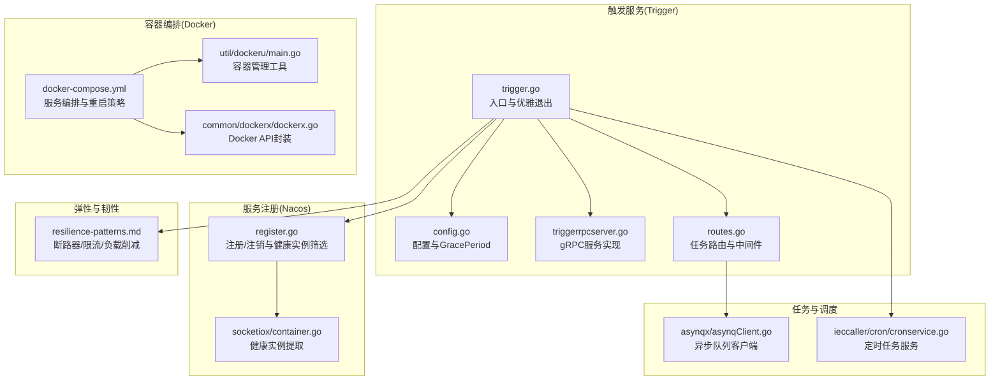
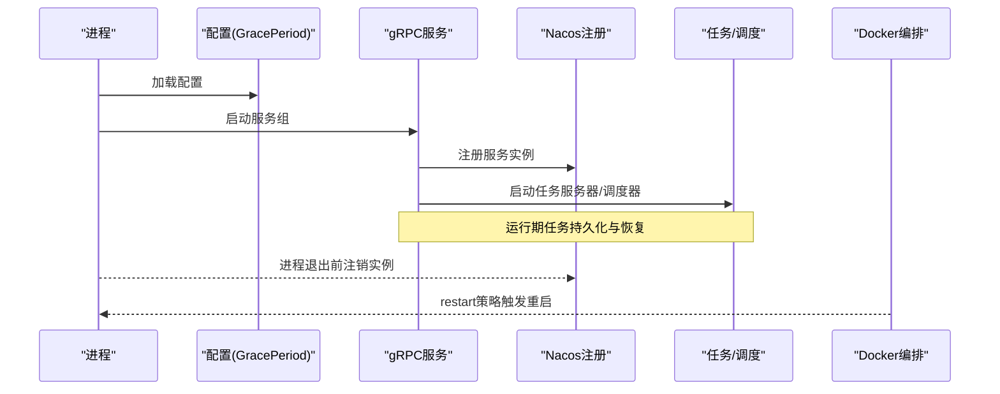
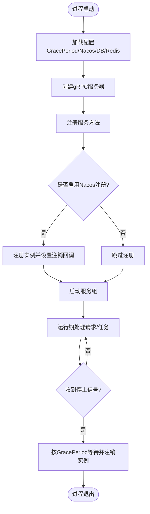
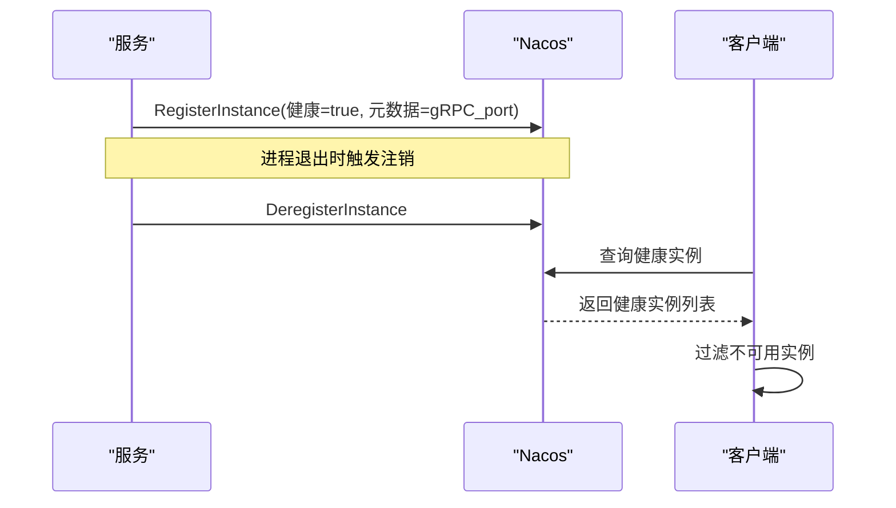
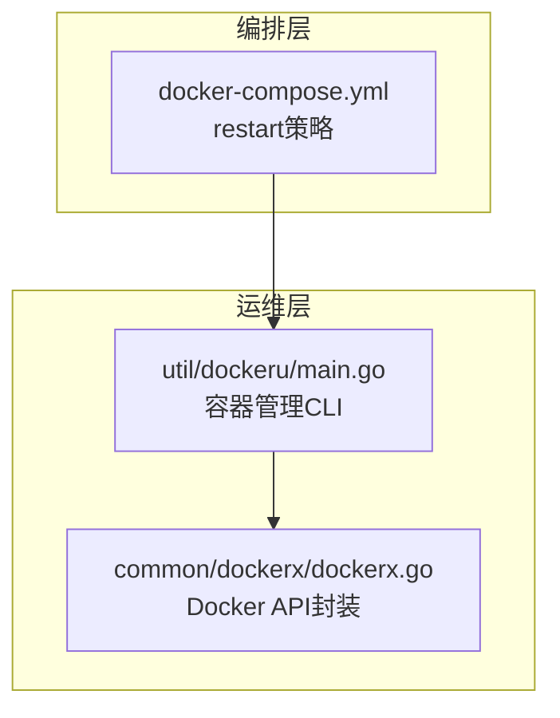
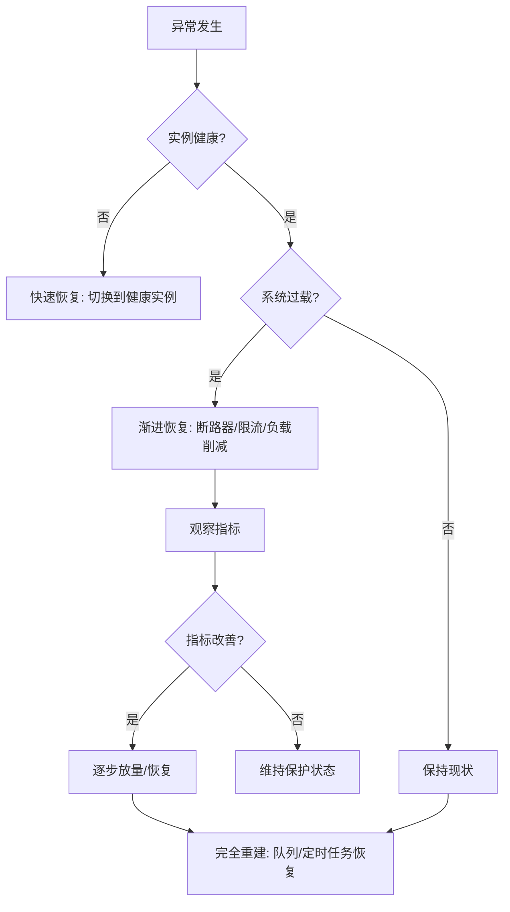
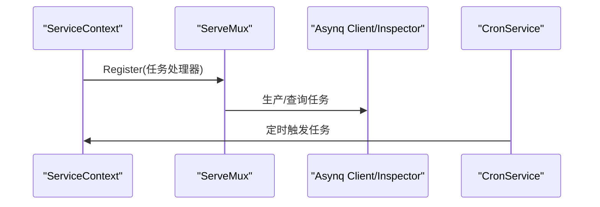
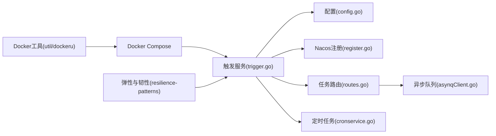

# 自动恢复与重启策略

<cite>
**本文引用的文件**
- [app/trigger/etc/trigger.yaml](file://app/trigger/etc/trigger.yaml)
- [app/trigger/internal/config/config.go](file://app/trigger/internal/config/config.go)
- [app/trigger/trigger.go](file://app/trigger/trigger.go)
- [app/trigger/internal/server/triggerrpcserver.go](file://app/trigger/internal/server/triggerrpcserver.go)
- [common/nacosx/register.go](file://common/nacosx/register.go)
- [common/dockerx/dockerx.go](file://common/dockerx/dockerx.go)
- [deploy/docker-compose.yml](file://deploy/docker-compose.yml)
- [util/dockeru/main.go](file://util/dockeru/main.go)
- [.trae/skills/zero-skills/references/resilience-patterns.md](file://.trae/skills/zero-skills/references/resilience-patterns.md)
- [app/trigger/internal/task/routes.go](file://app/trigger/internal/task/routes.go)
- [common/asynqx/asynqClient.go](file://common/asynqx/asynqClient.go)
- [app/ieccaller/cron/cronservice.go](file://app/ieccaller/cron/cronservice.go)
- [common/socketiox/container.go](file://common/socketiox/container.go)
- [deploy/stat_analyzer.html](file://deploy/stat_analyzer.html)
</cite>

## 目录
1. [引言](#引言)
2. [项目结构](#项目结构)
3. [核心组件](#核心组件)
4. [架构总览](#架构总览)
5. [详细组件分析](#详细组件分析)
6. [依赖分析](#依赖分析)
7. [性能考虑](#性能考虑)
8. [故障排查指南](#故障排查指南)
9. [结论](#结论)
10. [附录](#附录)

## 引言
本指南围绕 zero-service 的自动恢复与重启策略展开，系统性地梳理了进程监控、异常检测、优雅重启、多级恢复策略以及容器化环境下的自愈机制。文档结合仓库中的配置、服务注册、Docker 编排与工具脚本，给出可落地的实现建议与最佳实践，帮助开发者在不同运行环境中构建高可用的服务体系。

## 项目结构
从自动恢复与重启的角度，以下模块与文件最为关键：
- 触发服务（Trigger）：包含优雅退出、服务注册、任务调度与异步队列集成，是实现“优雅重启”的核心载体。
- 服务注册与发现（Nacos）：负责服务上下线与健康实例筛选，支撑“快速恢复”与“渐进恢复”。
- 容器编排与监控（Docker Compose、Docker 工具）：提供进程级自动重启与运维可观测性。
- 弹性与韧性模式（Resilience Patterns）：提供断路器、限流、负载削减等弹性设计参考。
- 任务调度与异步处理（Asynq、Cron）：保障任务持久化与恢复，支撑“完全重建”场景。

**图表来源**
- [app/trigger/trigger.go:34-88](file://app/trigger/trigger.go#L34-L88)
- [app/trigger/internal/config/config.go:9-27](file://app/trigger/internal/config/config.go#L9-L27)
- [app/trigger/internal/server/triggerrpcserver.go:15-271](file://app/trigger/internal/server/triggerrpcserver.go#L15-L271)
- [app/trigger/internal/task/routes.go:21-34](file://app/trigger/internal/task/routes.go#L21-L34)
- [common/nacosx/register.go:21-76](file://common/nacosx/register.go#L21-L76)
- [common/socketiox/container.go:318-356](file://common/socketiox/container.go#L318-L356)
- [deploy/docker-compose.yml:1-110](file://deploy/docker-compose.yml#L1-L110)
- [util/dockeru/main.go:35-272](file://util/dockeru/main.go#L35-L272)
- [common/dockerx/dockerx.go:11-18](file://common/dockerx/dockerx.go#L11-L18)
- [.trae/skills/zero-skills/references/resilience-patterns.md:95-143](file://.trae/skills/zero-skills/references/resilience-patterns.md#L95-L143)
- [common/asynqx/asynqClient.go:17-23](file://common/asynqx/asynqClient.go#L17-L23)
- [app/ieccaller/cron/cronservice.go:48-77](file://app/ieccaller/cron/cronservice.go#L48-L77)

**章节来源**
- [app/trigger/etc/trigger.yaml:1-37](file://app/trigger/etc/trigger.yaml#L1-L37)
- [app/trigger/internal/config/config.go:9-27](file://app/trigger/internal/config/config.go#L9-L27)
- [app/trigger/trigger.go:34-88](file://app/trigger/trigger.go#L34-L88)
- [deploy/docker-compose.yml:1-110](file://deploy/docker-compose.yml#L1-L110)

## 核心组件
- 触发服务（Trigger）：通过配置中的优雅退出周期（GracePeriod）与服务组统一管理，实现“优雅重启”。服务启动时注册到 Nacos，退出时注销，确保服务发现层面的平滑切换。
- 服务注册与发现（Nacos）：在服务启动时注册实例，在进程退出时注销，同时提供健康实例筛选能力，支撑“快速恢复”。
- 容器编排（Docker Compose）：为各服务设置 restart 策略，实现进程级自动恢复；配合 util/dockeru 提供容器生命周期管理。
- 弹性与韧性（Resilience Patterns）：断路器、限流、负载削减等模式可作为“渐进恢复”的技术手段。
- 任务调度与异步处理（Asynq/Cron）：通过异步队列与定时任务，保障任务持久化与恢复，支撑“完全重建”。

**章节来源**
- [app/trigger/trigger.go:39-87](file://app/trigger/trigger.go#L39-L87)
- [common/nacosx/register.go:59-73](file://common/nacosx/register.go#L59-L73)
- [deploy/docker-compose.yml:12-12](file://deploy/docker-compose.yml#L12-L12)
- [.trae/skills/zero-skills/references/resilience-patterns.md:95-143](file://.trae/skills/zero-skills/references/resilience-patterns.md#L95-L143)
- [app/trigger/internal/task/routes.go:21-34](file://app/trigger/internal/task/routes.go#L21-L34)
- [common/asynqx/asynqClient.go:17-23](file://common/asynqx/asynqClient.go#L17-L23)
- [app/ieccaller/cron/cronservice.go:48-77](file://app/ieccaller/cron/cronservice.go#L48-L77)

## 架构总览
下图展示了自动恢复与重启的关键流程：服务启动时加载配置、设置优雅退出周期、注册到 Nacos；在运行期通过任务调度与异步队列保证任务不丢失；容器层通过 restart 策略实现进程级自愈；退出时注销服务，确保服务发现层面的平滑过渡。

**图表来源**
- [app/trigger/trigger.go:39-87](file://app/trigger/trigger.go#L39-L87)
- [common/nacosx/register.go:59-73](file://common/nacosx/register.go#L59-L73)
- [app/trigger/internal/task/routes.go:21-34](file://app/trigger/internal/task/routes.go#L21-L34)
- [deploy/docker-compose.yml:12-12](file://deploy/docker-compose.yml#L12-L12)

## 详细组件分析

### 触发服务的优雅重启与配置
- 优雅退出周期：通过配置中的 GracePeriod 控制强制退出等待时间，确保在停止前完成资源释放与任务收尾。
- 服务组管理：使用服务组统一 Add/Start/Stop，便于在退出时进行有序关闭。
- 服务注册：根据配置决定是否注册到 Nacos，并在退出时自动注销，避免流量指向失效实例。
- gRPC 服务：集中注册各类 RPC 方法，作为对外接口面，承载业务请求与任务回调。

**图表来源**
- [app/trigger/trigger.go:39-87](file://app/trigger/trigger.go#L39-L87)
- [app/trigger/internal/config/config.go:25-25](file://app/trigger/internal/config/config.go#L25-L25)
- [common/nacosx/register.go:59-73](file://common/nacosx/register.go#L59-L73)

**章节来源**
- [app/trigger/etc/trigger.yaml:29-36](file://app/trigger/etc/trigger.yaml#L29-L36)
- [app/trigger/internal/config/config.go:25-25](file://app/trigger/internal/config/config.go#L25-L25)
- [app/trigger/trigger.go:39-87](file://app/trigger/trigger.go#L39-L87)

### 服务注册与发现（Nacos）
- 注册：服务启动时向 Nacos 注册实例，携带元数据（如 gRPC 端口），并设置健康与权重。
- 注销：通过进程退出监听器在退出时注销实例，避免误流量。
- 健康实例筛选：在客户端侧对实例进行健康度与启用状态过滤，仅选择可用实例。

**图表来源**
- [common/nacosx/register.go:41-73](file://common/nacosx/register.go#L41-L73)
- [common/socketiox/container.go:318-356](file://common/socketiox/container.go#L318-L356)

**章节来源**
- [common/nacosx/register.go:41-73](file://common/nacosx/register.go#L41-L73)
- [common/socketiox/container.go:318-356](file://common/socketiox/container.go#L318-L356)

### 容器化环境下的自动恢复
- Docker Compose：为各服务设置 restart: always，实现进程级自动重启。
- Docker 工具：提供容器列表、日志、启动/停止/重启、镜像管理等能力，辅助运维与恢复。
- Docker API 封装：提供环境变量解析、端口映射提取、资源限制解析等工具，便于自动化运维。

**图表来源**
- [deploy/docker-compose.yml:12-12](file://deploy/docker-compose.yml#L12-L12)
- [util/dockeru/main.go:342-421](file://util/dockeru/main.go#L342-L421)
- [common/dockerx/dockerx.go:20-94](file://common/dockerx/dockerx.go#L20-L94)

**章节来源**
- [deploy/docker-compose.yml:12-12](file://deploy/docker-compose.yml#L12-L12)
- [util/dockeru/main.go:342-421](file://util/dockeru/main.go#L342-L421)
- [common/dockerx/dockerx.go:20-94](file://common/dockerx/dockerx.go#L20-L94)

### 多级恢复策略
- 快速恢复：依赖 Nacos 健康实例筛选与 gRPC 客户端重试，优先选择健康实例，降低单点故障影响。
- 渐进恢复：结合断路器、限流与负载削减，逐步放量，避免雪崩效应。
- 完全重建：通过异步队列与定时任务，保障任务持久化与重试，重启后继续处理积压任务。

**图表来源**
- [.trae/skills/zero-skills/references/resilience-patterns.md:95-143](file://.trae/skills/zero-skills/references/resilience-patterns.md#L95-L143)
- [common/socketiox/container.go:318-356](file://common/socketiox/container.go#L318-L356)
- [app/trigger/internal/task/routes.go:21-34](file://app/trigger/internal/task/routes.go#L21-L34)

**章节来源**
- [.trae/skills/zero-skills/references/resilience-patterns.md:95-143](file://.trae/skills/zero-skills/references/resilience-patterns.md#L95-L143)
- [common/socketiox/container.go:318-356](file://common/socketiox/container.go#L318-L356)
- [app/trigger/internal/task/routes.go:21-34](file://app/trigger/internal/task/routes.go#L21-L34)

### 任务调度与异步处理
- 任务路由：定义 ServeMux 并注册任务处理器，统一接入日志中间件。
- 异步队列：通过 Asynq 客户端与 Inspector，实现任务生产与查询。
- 定时任务：通过 CronService 启动定时器，周期性触发任务。

**图表来源**
- [app/trigger/internal/task/routes.go:21-34](file://app/trigger/internal/task/routes.go#L21-L34)
- [common/asynqx/asynqClient.go:17-23](file://common/asynqx/asynqClient.go#L17-L23)
- [app/ieccaller/cron/cronservice.go:48-77](file://app/ieccaller/cron/cronservice.go#L48-L77)

**章节来源**
- [app/trigger/internal/task/routes.go:21-34](file://app/trigger/internal/task/routes.go#L21-L34)
- [common/asynqx/asynqClient.go:17-23](file://common/asynqx/asynqClient.go#L17-L23)
- [app/ieccaller/cron/cronservice.go:48-77](file://app/ieccaller/cron/cronservice.go#L48-L77)

## 依赖分析
- 触发服务依赖配置模块、Nacos 注册模块、任务路由与异步队列模块。
- 容器层依赖 Docker Compose 编排与 Docker 工具脚本。
- 弹性与韧性模式为服务提供断路器、限流与负载削减等策略参考。

**图表来源**
- [app/trigger/trigger.go:39-87](file://app/trigger/trigger.go#L39-L87)
- [app/trigger/internal/config/config.go:9-27](file://app/trigger/internal/config/config.go#L9-L27)
- [common/nacosx/register.go:21-76](file://common/nacosx/register.go#L21-L76)
- [app/trigger/internal/task/routes.go:21-34](file://app/trigger/internal/task/routes.go#L21-L34)
- [common/asynqx/asynqClient.go:17-23](file://common/asynqx/asynqClient.go#L17-L23)
- [app/ieccaller/cron/cronservice.go:48-77](file://app/ieccaller/cron/cronservice.go#L48-L77)
- [deploy/docker-compose.yml:12-12](file://deploy/docker-compose.yml#L12-L12)
- [util/dockeru/main.go:342-421](file://util/dockeru/main.go#L342-L421)
- [.trae/skills/zero-skills/references/resilience-patterns.md:95-143](file://.trae/skills/zero-skills/references/resilience-patterns.md#L95-L143)

**章节来源**
- [app/trigger/trigger.go:39-87](file://app/trigger/trigger.go#L39-L87)
- [deploy/docker-compose.yml:12-12](file://deploy/docker-compose.yml#L12-L12)

## 性能考虑
- 优雅退出周期：合理设置 GracePeriod，平衡停止速度与资源回收时间。
- 任务持久化：通过异步队列与定时任务，避免重启导致的任务丢失。
- 负载削峰：在高负载场景启用负载削减，防止系统过载引发级联故障。
- 观测与分析：利用日志与可视化工具（如 stat_analyzer.html）分析 CPU、GC、QPS、丢弃等指标，指导容量与弹性策略。

**章节来源**
- [.trae/skills/zero-skills/references/resilience-patterns.md:95-143](file://.trae/skills/zero-skills/references/resilience-patterns.md#L95-L143)
- [deploy/stat_analyzer.html:862-1307](file://deploy/stat_analyzer.html#L862-L1307)

## 故障排查指南
- 服务未注册/注销：检查 Nacos 配置与注册流程，确认退出回调是否生效。
- 容器频繁重启：检查 Docker Compose 的 restart 策略与容器日志，定位异常原因。
- 任务堆积：检查异步队列状态与定时任务调度，确认任务处理器是否正常消费。
- 弹性策略生效：通过日志与指标监控断路器、限流与负载削减的状态变化。

**章节来源**
- [common/nacosx/register.go:59-73](file://common/nacosx/register.go#L59-L73)
- [deploy/docker-compose.yml:12-12](file://deploy/docker-compose.yml#L12-L12)
- [app/trigger/internal/task/routes.go:21-34](file://app/trigger/internal/task/routes.go#L21-L34)
- [.trae/skills/zero-skills/references/resilience-patterns.md:621-690](file://.trae/skills/zero-skills/references/resilience-patterns.md#L621-L690)

## 结论
通过配置化的优雅退出、Nacos 服务注册与健康实例筛选、Docker 编排与工具脚本、以及异步队列与定时任务的持久化能力，zero-service 在不同层级实现了自动恢复与重启策略。结合断路器、限流与负载削减等弹性模式，可在复杂环境中实现从“快速恢复”到“完全重建”的多级恢复，提升系统的韧性与可用性。

## 附录
- 配置示例路径
  - [app/trigger/etc/trigger.yaml:1-37](file://app/trigger/etc/trigger.yaml#L1-L37)
- 关键实现路径
  - [app/trigger/trigger.go:39-87](file://app/trigger/trigger.go#L39-L87)
  - [app/trigger/internal/config/config.go:9-27](file://app/trigger/internal/config/config.go#L9-L27)
  - [common/nacosx/register.go:21-76](file://common/nacosx/register.go#L21-L76)
  - [deploy/docker-compose.yml:1-110](file://deploy/docker-compose.yml#L1-L110)
  - [util/dockeru/main.go:342-421](file://util/dockeru/main.go#L342-L421)
  - [app/trigger/internal/task/routes.go:21-34](file://app/trigger/internal/task/routes.go#L21-L34)
  - [common/asynqx/asynqClient.go:17-23](file://common/asynqx/asynqClient.go#L17-L23)
  - [app/ieccaller/cron/cronservice.go:48-77](file://app/ieccaller/cron/cronservice.go#L48-L77)
  - [.trae/skills/zero-skills/references/resilience-patterns.md:95-143](file://.trae/skills/zero-skills/references/resilience-patterns.md#L95-L143)