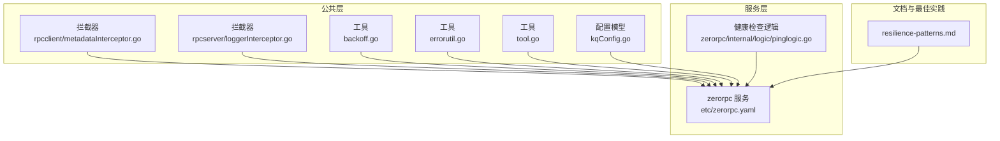
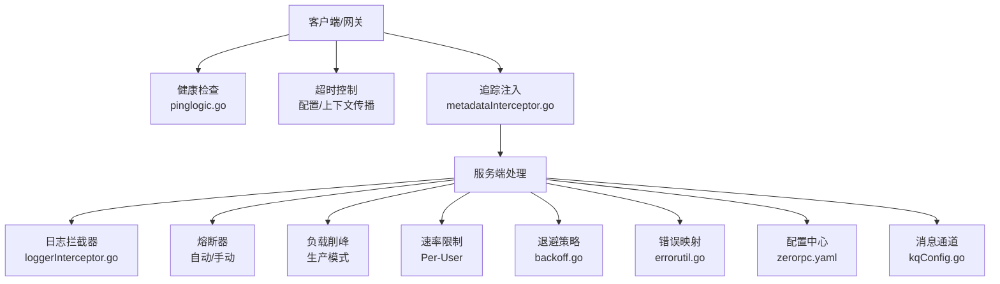
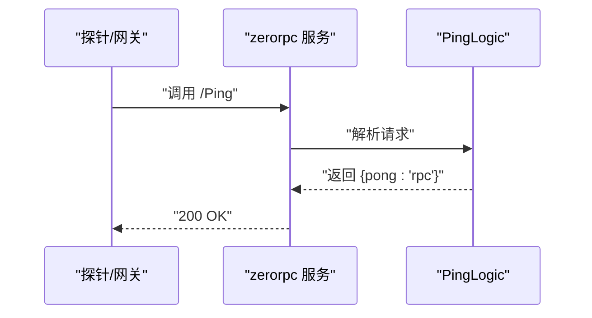
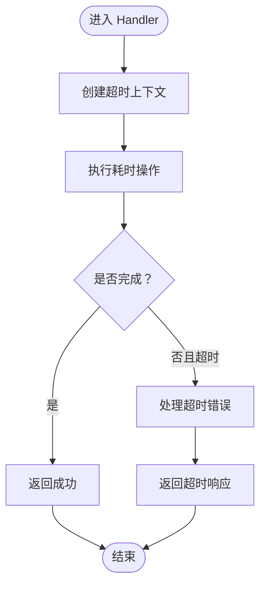
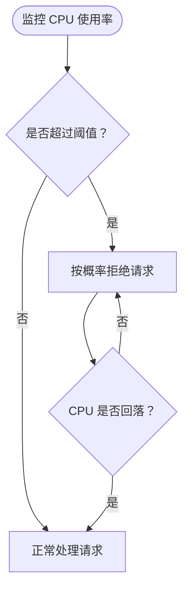
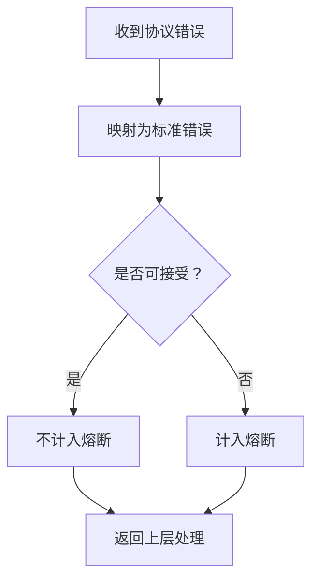
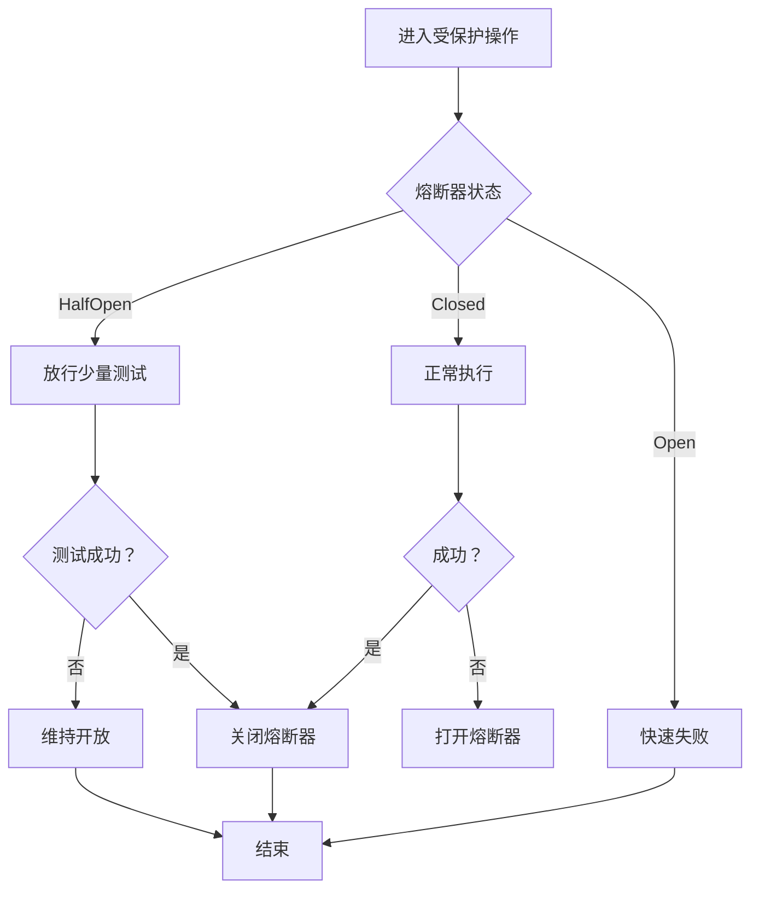
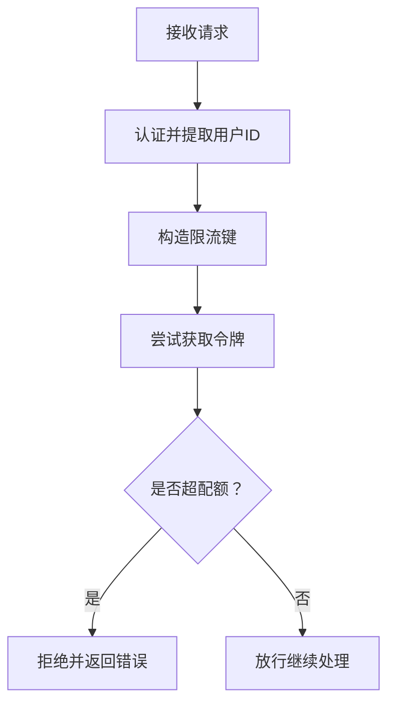
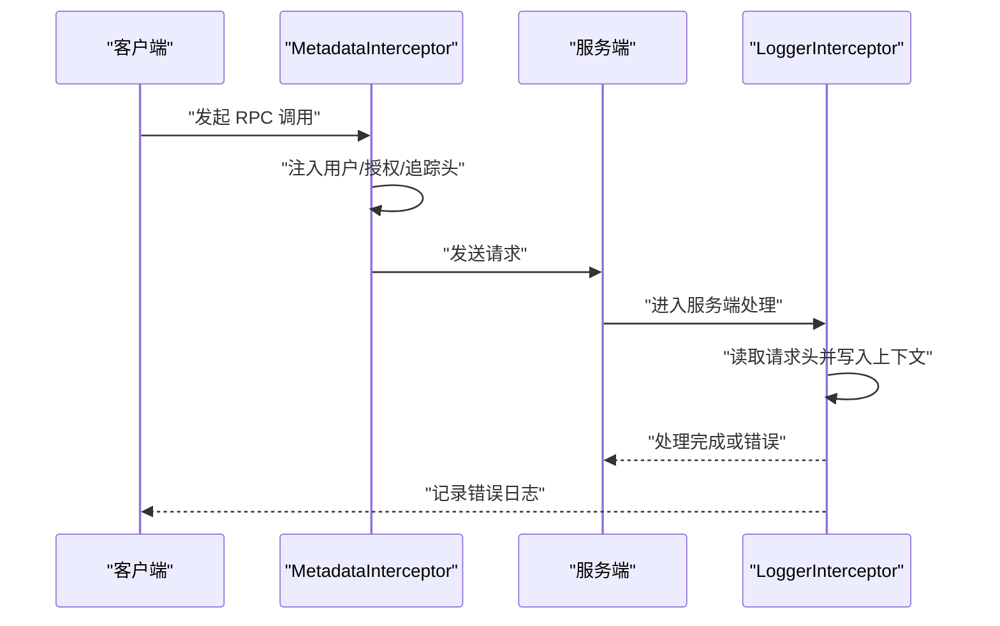
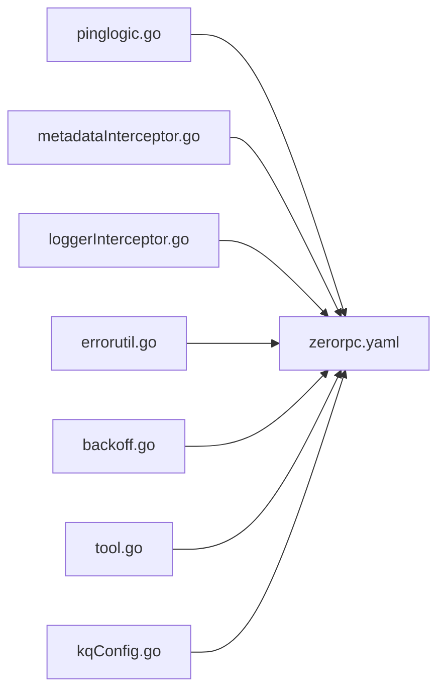

# 自动故障检测与隔离

<cite>
**本文引用的文件**
- [backoff.go](file://common/tool/backoff.go)
- [errorutil.go](file://common/tool/errorutil.go)
- [metadataInterceptor.go](file://common/Interceptor/rpcclient/metadataInterceptor.go)
- [loggerInterceptor.go](file://common/Interceptor/rpcserver/loggerInterceptor.go)
- [pinglogic.go](file://zerorpc/internal/logic/pinglogic.go)
- [zerorpc.yaml](file://zerorpc/etc/zerorpc.yaml)
- [resilience-patterns.md](file://.trae/skills/zero-skills/references/resilience-patterns.md)
- [tool.go](file://common/tool/tool.go)
- [kqConfig.go](file://common/configx/kqConfig.go)
</cite>

## 目录
1. [引言](#引言)
2. [项目结构](#项目结构)
3. [核心组件](#核心组件)
4. [架构总览](#架构总览)
5. [详细组件分析](#详细组件分析)
6. [依赖分析](#依赖分析)
7. [性能考量](#性能考量)
8. [故障排查指南](#故障排查指南)
9. [结论](#结论)
10. [附录](#附录)

## 引言
本技术文档围绕 zero-service 的自动故障检测与隔离机制展开，系统性阐述健康检查、超时检测、资源监控、异常行为识别等故障检测能力，以及熔断器模式、降级策略、流量控制、服务降级等自动隔离策略，并给出故障传播控制（故障域隔离、影响范围限制、快速失败）的实践方法。文档同时提供监控指标设计、告警规则配置思路、故障恢复验证流程，以及在实际项目中的集成示例路径，帮助读者在不直接阅读源码的情况下快速落地。

## 项目结构
从仓库结构可见，项目采用多模块微服务架构，每个业务模块（如 zerorpc、lalproxy、trigger 等）均包含独立的配置、逻辑层、服务端与客户端桩代码。公共能力集中在 common 目录，包括拦截器、工具函数、配置模型等。与故障自愈密切相关的模块与文件如下：
- 故障检测与隔离策略：位于 common 工具与拦截器层，结合 go-zero 内置的熔断、限流、负载均衡与超时机制
- 健康检查与可观测性：通过 pinglogic 提供基础健康探测，结合日志拦截器记录错误
- 配置与运行模式：各服务的 etc/xxx.yaml 中定义运行模式、超时、缓存、数据库、告警等关键参数
- 文档与最佳实践：resilience-patterns.md 提供了熔断、限流、超时、负载均衡的完整配置与监控建议

**图表来源**
- [metadataInterceptor.go:1-56](file://common/Interceptor/rpcclient/metadataInterceptor.go#L1-L56)
- [loggerInterceptor.go:1-45](file://common/Interceptor/rpcserver/loggerInterceptor.go#L1-L45)
- [backoff.go:1-41](file://common/tool/backoff.go#L1-L41)
- [errorutil.go:1-91](file://common/tool/errorutil.go#L1-L91)
- [tool.go:1-469](file://common/tool/tool.go#L1-L469)
- [kqConfig.go:1-7](file://common/configx/kqConfig.go#L1-L7)
- [zerorpc.yaml:1-39](file://zerorpc/etc/zerorpc.yaml#L1-L39)
- [pinglogic.go:1-28](file://zerorpc/internal/logic/pinglogic.go#L1-L28)
- [resilience-patterns.md:1-690](file://.trae/skills/zero-skills/references/resilience-patterns.md#L1-L690)

**章节来源**
- [zerorpc.yaml:1-39](file://zerorpc/etc/zerorpc.yaml#L1-L39)
- [resilience-patterns.md:1-690](file://.trae/skills/zero-skills/references/resilience-patterns.md#L1-L690)

## 核心组件
- 健康检查与探测
  - 通过 pinglogic 提供基础健康探测，作为外部监控与网关探测的入口
  - 参考路径：[pinglogic.go:25-27](file://zerorpc/internal/logic/pinglogic.go#L25-L27)
- 超时检测与传播
  - 服务级超时在配置中统一设置，配合上下文超时传播，确保请求不会无限等待
  - 参考路径：[zerorpc.yaml](file://zerorpc/etc/zerorpc.yaml#L3)
  - 参考路径：[resilience-patterns.md:326-401](file://.trae/skills/zero-skills/references/resilience-patterns.md#L326-L401)
- 资源监控与负载控制
  - 生产模式下自动启用负载削峰（Load Shedding），CPU 使用率过高时拒绝部分请求，防止雪崩
  - 参考路径：[resilience-patterns.md:95-123](file://.trae/skills/zero-skills/references/resilience-patterns.md#L95-L123)
- 异常行为识别与错误映射
  - 通过错误工具将协议枚举映射为标准 HTTP/GRPC 错误，便于统一处理与告警
  - 参考路径：[errorutil.go:12-59](file://common/tool/errorutil.go#L12-L59)
- 熔断与退避策略
  - 自动熔断器对 RPC、数据库、Redis、HTTP 客户端调用生效；手动熔断器可按需扩展
  - 退避策略用于重试间隔控制，避免抖动放大
  - 参考路径：[resilience-patterns.md:13-94](file://.trae/skills/zero-skills/references/resilience-patterns.md#L13-L94)
  - 参考路径：[backoff.go:9-35](file://common/tool/backoff.go#L9-L35)
- 流量控制与速率限制
  - 支持基于用户维度的速率限制中间件，防止个别用户滥用
  - 参考路径：[resilience-patterns.md:296-324](file://.trae/skills/zero-skills/references/resilience-patterns.md#L296-L324)
- 追踪与可观测性
  - gRPC 请求头注入用户、授权、追踪 ID 等上下文信息，便于跨服务定位问题
  - 参考路径：[metadataInterceptor.go:11-32](file://common/Interceptor/rpcclient/metadataInterceptor.go#L11-L32)
  - 日志拦截器将请求头写入上下文并记录错误，辅助排障
  - 参考路径：[loggerInterceptor.go:12-44](file://common/Interceptor/rpcserver/loggerInterceptor.go#L12-L44)

**章节来源**
- [pinglogic.go:1-28](file://zerorpc/internal/logic/pinglogic.go#L1-L28)
- [zerorpc.yaml:1-39](file://zerorpc/etc/zerorpc.yaml#L1-L39)
- [resilience-patterns.md:1-690](file://.trae/skills/zero-skills/references/resilience-patterns.md#L1-L690)
- [errorutil.go:1-91](file://common/tool/errorutil.go#L1-L91)
- [backoff.go:1-41](file://common/tool/backoff.go#L1-L41)
- [metadataInterceptor.go:1-56](file://common/Interceptor/rpcclient/metadataInterceptor.go#L1-L56)
- [loggerInterceptor.go:1-45](file://common/Interceptor/rpcserver/loggerInterceptor.go#L1-L45)

## 架构总览
下图展示了故障检测与隔离在系统中的位置与交互关系：上游通过健康检查与超时控制发起请求；请求经拦截器注入追踪上下文；服务端拦截器记录错误；熔断器与负载削峰在运行期自动生效；错误映射与退避策略保障重试与恢复。

**图表来源**
- [pinglogic.go:25-27](file://zerorpc/internal/logic/pinglogic.go#L25-L27)
- [metadataInterceptor.go:11-32](file://common/Interceptor/rpcclient/metadataInterceptor.go#L11-L32)
- [loggerInterceptor.go:12-44](file://common/Interceptor/rpcserver/loggerInterceptor.go#L12-L44)
- [resilience-patterns.md:13-123](file://.trae/skills/zero-skills/references/resilience-patterns.md#L13-L123)
- [backoff.go:9-35](file://common/tool/backoff.go#L9-L35)
- [errorutil.go:12-59](file://common/tool/errorutil.go#L12-L59)
- [zerorpc.yaml:1-39](file://zerorpc/etc/zerorpc.yaml#L1-L39)
- [kqConfig.go:3-6](file://common/configx/kqConfig.go#L3-L6)

## 详细组件分析

### 健康检查机制
- 设计要点
  - 提供轻量级 Ping 接口，便于外部系统进行存活与就绪探测
  - 与超时配置协同，确保探测本身不会成为瓶颈
- 实现要点
  - 逻辑简单，返回固定响应，适合高频探测
  - 可结合网关或探针定时调用，形成闭环
- 集成示例路径
  - [pinglogic.go:25-27](file://zerorpc/internal/logic/pinglogic.go#L25-L27)
  - [zerorpc.yaml:1-39](file://zerorpc/etc/zerorpc.yaml#L1-L39)

**图表来源**
- [pinglogic.go:25-27](file://zerorpc/internal/logic/pinglogic.go#L25-L27)
- [zerorpc.yaml:1-39](file://zerorpc/etc/zerorpc.yaml#L1-L39)

**章节来源**
- [pinglogic.go:1-28](file://zerorpc/internal/logic/pinglogic.go#L1-L28)
- [zerorpc.yaml:1-39](file://zerorpc/etc/zerorpc.yaml#L1-L39)

### 超时检测与传播
- 设计要点
  - 服务级超时在配置中统一设定，Handler 层可进一步细化到操作级超时
  - 使用 context 传播超时，避免阻塞与级联超时
- 实现要点
  - 服务级超时：在 etc/xxx.yaml 中设置 Timeout
  - Handler 级超时：在处理器内创建较短的超时上下文
  - 操作级超时：对耗时操作使用带超时的 goroutine + channel 模式
- 集成示例路径
  - [zerorpc.yaml](file://zerorpc/etc/zerorpc.yaml#L3)
  - [resilience-patterns.md:326-401](file://.trae/skills/zero-skills/references/resilience-patterns.md#L326-L401)

**图表来源**
- [resilience-patterns.md:326-401](file://.trae/skills/zero-skills/references/resilience-patterns.md#L326-L401)

**章节来源**
- [zerorpc.yaml](file://zerorpc/etc/zerorpc.yaml#L3)
- [resilience-patterns.md:326-401](file://.trae/skills/zero-skills/references/resilience-patterns.md#L326-L401)

### 资源监控与负载削峰
- 设计要点
  - 在生产模式下自动启用负载削峰，当 CPU 使用率超过阈值时按概率拒绝请求
  - 自动恢复：CPU 回落到阈值以下后自动停止拒绝
- 实现要点
  - 通过配置开启生产模式，系统自动监控 CPU 并决策是否拒绝
- 集成示例路径
  - [resilience-patterns.md:95-123](file://.trae/skills/zero-skills/references/resilience-patterns.md#L95-L123)

**图表来源**
- [resilience-patterns.md:95-123](file://.trae/skills/zero-skills/references/resilience-patterns.md#L95-L123)

**章节来源**
- [resilience-patterns.md:95-123](file://.trae/skills/zero-skills/references/resilience-patterns.md#L95-L123)

### 异常行为识别与错误映射
- 设计要点
  - 将协议错误码映射为标准 HTTP/GRPC 错误，便于统一处理与告警
  - 支持根据错误码判断是否应计入熔断统计
- 实现要点
  - 通过错误工具函数将枚举错误转换为可识别的标准错误
  - 提供错误匹配函数，用于判定特定错误码
- 集成示例路径
  - [errorutil.go:12-59](file://common/tool/errorutil.go#L12-L59)
  - [errorutil.go:83-90](file://common/tool/errorutil.go#L83-L90)

**图表来源**
- [errorutil.go:12-59](file://common/tool/errorutil.go#L12-L59)
- [errorutil.go:83-90](file://common/tool/errorutil.go#L83-L90)

**章节来源**
- [errorutil.go:1-91](file://common/tool/errorutil.go#L1-L91)

### 熔断器模式与退避策略
- 设计要点
  - 自动熔断器对 RPC、数据库、Redis、HTTP 客户端调用生效
  - 手动熔断器可针对自定义操作显式保护
  - 退避策略控制重试间隔，避免抖动放大
- 实现要点
  - 自动熔断：无需额外配置，开箱即用
  - 手动熔断：按需创建命名熔断器，包装潜在失败操作
  - 退避：根据失败次数指数回退，设置上限与最大容忍
- 集成示例路径
  - [resilience-patterns.md:13-94](file://.trae/skills/zero-skills/references/resilience-patterns.md#L13-L94)
  - [backoff.go:9-35](file://common/tool/backoff.go#L9-L35)

**图表来源**
- [resilience-patterns.md:13-94](file://.trae/skills/zero-skills/references/resilience-patterns.md#L13-L94)
- [backoff.go:9-35](file://common/tool/backoff.go#L9-L35)

**章节来源**
- [resilience-patterns.md:13-94](file://.trae/skills/zero-skills/references/resilience-patterns.md#L13-L94)
- [backoff.go:1-41](file://common/tool/backoff.go#L1-L41)

### 速率限制与流量控制
- 设计要点
  - 支持基于用户维度的速率限制中间件，防止个别用户滥用
  - 结合负载削峰，形成多层保护
- 实现要点
  - 在认证后提取用户 ID，构造限流键
  - 超配额时返回明确错误，便于上层熔断或降级
- 集成示例路径
  - [resilience-patterns.md:296-324](file://.trae/skills/zero-skills/references/resilience-patterns.md#L296-L324)

**图表来源**
- [resilience-patterns.md:296-324](file://.trae/skills/zero-skills/references/resilience-patterns.md#L296-L324)

**章节来源**
- [resilience-patterns.md:296-324](file://.trae/skills/zero-skills/references/resilience-patterns.md#L296-L324)

### 追踪与可观测性
- 设计要点
  - gRPC 请求头注入用户、授权、追踪 ID 等上下文信息
  - 服务端拦截器将请求头写入上下文并记录错误，便于跨服务定位问题
- 实现要点
  - 客户端拦截器：在 outgoing 上下文中设置追踪头
  - 服务端拦截器：读取请求头并写入上下文，错误时统一记录
- 集成示例路径
  - [metadataInterceptor.go:11-32](file://common/Interceptor/rpcclient/metadataInterceptor.go#L11-L32)
  - [loggerInterceptor.go:12-44](file://common/Interceptor/rpcserver/loggerInterceptor.go#L12-L44)

**图表来源**
- [metadataInterceptor.go:11-32](file://common/Interceptor/rpcclient/metadataInterceptor.go#L11-L32)
- [loggerInterceptor.go:12-44](file://common/Interceptor/rpcserver/loggerInterceptor.go#L12-L44)

**章节来源**
- [metadataInterceptor.go:1-56](file://common/Interceptor/rpcclient/metadataInterceptor.go#L1-L56)
- [loggerInterceptor.go:1-45](file://common/Interceptor/rpcserver/loggerInterceptor.go#L1-L45)

## 依赖分析
- 组件耦合与内聚
  - 健康检查与超时控制相互独立，分别服务于探测与保护
  - 熔断器与负载削峰共同作用于运行期保护，降低级联故障风险
  - 错误映射与退避策略为重试与恢复提供基础
  - 追踪拦截器贯穿请求生命周期，提升可观测性
- 外部依赖与集成点
  - 配置中心：各服务的 etc/xxx.yaml 提供运行模式、超时、缓存、数据库、告警等参数
  - 消息通道：Kafka 配置模型用于异步处理与解耦
- 潜在循环依赖
  - 当前模块间通过配置与接口解耦，未见明显循环依赖

**图表来源**
- [pinglogic.go:25-27](file://zerorpc/internal/logic/pinglogic.go#L25-L27)
- [metadataInterceptor.go:11-32](file://common/Interceptor/rpcclient/metadataInterceptor.go#L11-L32)
- [loggerInterceptor.go:12-44](file://common/Interceptor/rpcserver/loggerInterceptor.go#L12-L44)
- [errorutil.go:12-59](file://common/tool/errorutil.go#L12-L59)
- [backoff.go:9-35](file://common/tool/backoff.go#L9-L35)
- [tool.go:1-469](file://common/tool/tool.go#L1-L469)
- [kqConfig.go:3-6](file://common/configx/kqConfig.go#L3-L6)
- [zerorpc.yaml:1-39](file://zerorpc/etc/zerorpc.yaml#L1-L39)

**章节来源**
- [zerorpc.yaml:1-39](file://zerorpc/etc/zerorpc.yaml#L1-L39)
- [kqConfig.go:1-7](file://common/configx/kqConfig.go#L1-L7)

## 性能考量
- 超时与背压
  - 合理设置服务级与操作级超时，避免请求堆积
  - 在高负载场景启用负载削峰，防止系统过载
- 熔断与退避
  - 自动熔断器减少对故障下游的压力；手动熔断器用于关键路径保护
  - 退避策略避免重试风暴，提高恢复成功率
- 速率限制
  - 基于用户维度的限流可平滑突发流量，降低峰值压力
- 追踪与日志
  - 统一的追踪头注入与错误日志记录有助于快速定位热点与瓶颈

[本节为通用指导，不直接分析具体文件]

## 故障排查指南
- 健康检查
  - 使用 Ping 接口确认服务存活与就绪状态
  - 参考路径：[pinglogic.go:25-27](file://zerorpc/internal/logic/pinglogic.go#L25-L27)
- 超时问题
  - 检查服务级超时配置与 Handler/操作级超时设置
  - 参考路径：[zerorpc.yaml](file://zerorpc/etc/zerorpc.yaml#L3)
  - 参考路径：[resilience-patterns.md:326-401](file://.trae/skills/zero-skills/references/resilience-patterns.md#L326-L401)
- 熔断与退避
  - 观察熔断器状态变化与退避时间计算
  - 参考路径：[resilience-patterns.md:13-94](file://.trae/skills/zero-skills/references/resilience-patterns.md#L13-L94)
  - 参考路径：[backoff.go:9-35](file://common/tool/backoff.go#L9-L35)
- 错误映射
  - 使用错误映射工具将协议错误转换为标准错误，便于统一告警
  - 参考路径：[errorutil.go:12-59](file://common/tool/errorutil.go#L12-L59)
- 追踪与日志
  - 检查请求头是否正确注入与服务端日志是否记录错误
  - 参考路径：[metadataInterceptor.go:11-32](file://common/Interceptor/rpcclient/metadataInterceptor.go#L11-L32)
  - 参考路径：[loggerInterceptor.go:12-44](file://common/Interceptor/rpcserver/loggerInterceptor.go#L12-L44)

**章节来源**
- [pinglogic.go:1-28](file://zerorpc/internal/logic/pinglogic.go#L1-L28)
- [zerorpc.yaml](file://zerorpc/etc/zerorpc.yaml#L3)
- [resilience-patterns.md:13-94](file://.trae/skills/zero-skills/references/resilience-patterns.md#L13-L94)
- [backoff.go:1-41](file://common/tool/backoff.go#L1-L41)
- [errorutil.go:1-91](file://common/tool/errorutil.go#L1-L91)
- [metadataInterceptor.go:1-56](file://common/Interceptor/rpcclient/metadataInterceptor.go#L1-L56)
- [loggerInterceptor.go:1-45](file://common/Interceptor/rpcserver/loggerInterceptor.go#L1-L45)

## 结论
zero-service 通过 go-zero 的内置保护层（熔断、限流、负载削峰、超时）与公共拦截器、工具函数、配置模型，构建了完善的自动故障检测与隔离体系。结合健康检查、错误映射、退避策略与统一追踪，能够在故障发生时快速失败、限制影响范围并加速恢复。建议在生产环境中启用负载削峰与熔断器，并配合合理的超时与速率限制策略，持续优化监控与告警，确保系统稳定运行。

[本节为总结性内容，不直接分析具体文件]

## 附录
- 监控指标设计（建议）
  - 熔断器指标：breaker_requests_total{name, state}、breaker_state_changes{name, from, to}
  - 负载削峰指标：shed_requests_total、cpu_usage_percent
  - 速率限制指标：rate_limit_exceeded_total{endpoint}、rate_limit_allowed_total{endpoint}
  - 超时指标：request_timeout_total{endpoint}、request_duration_seconds{endpoint}
- 告警规则配置思路（建议）
  - CPU 使用率超过阈值持续一段时间触发告警
  - 熔断器打开比例超过阈值触发告警
  - 速率限制超配额次数超过阈值触发告警
  - 超时比例上升触发告警
- 故障恢复验证
  - 逐步降低负载，观察熔断器状态变化与 CPU 回落
  - 验证健康检查接口在恢复后恢复正常
  - 检查错误日志与追踪链路，确认异常已收敛

**章节来源**
- [resilience-patterns.md:621-659](file://.trae/skills/zero-skills/references/resilience-patterns.md#L621-L659)