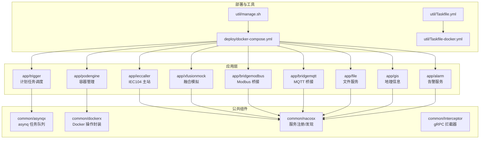
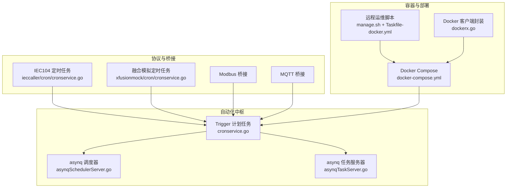
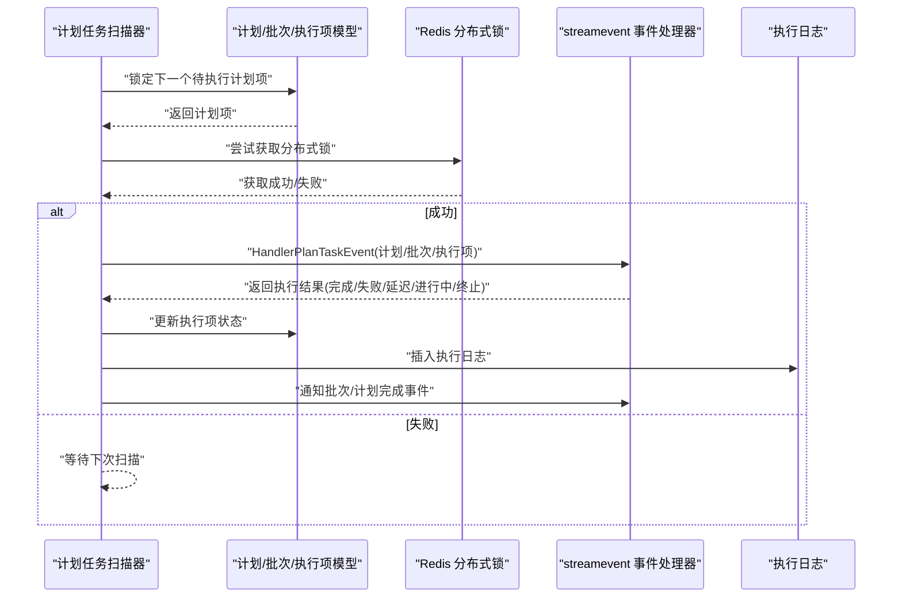
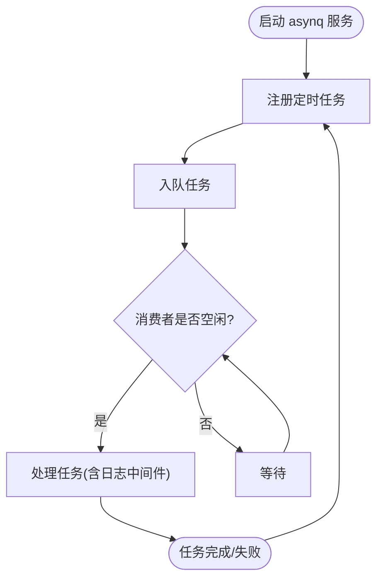
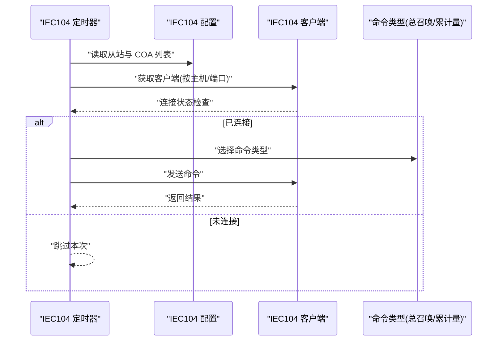
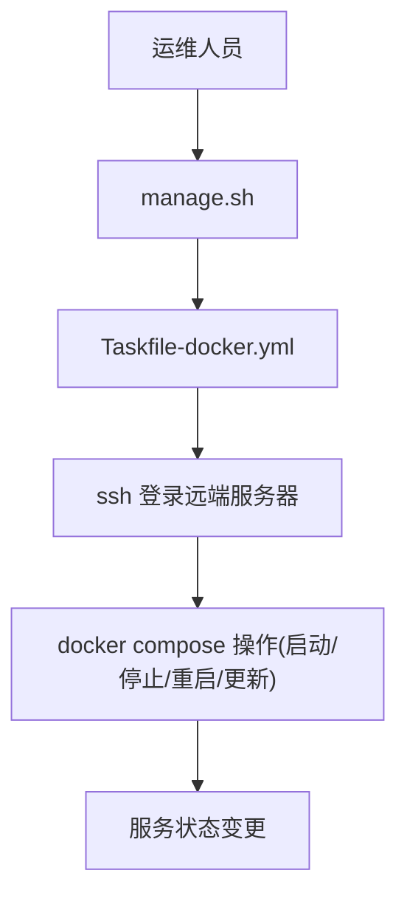
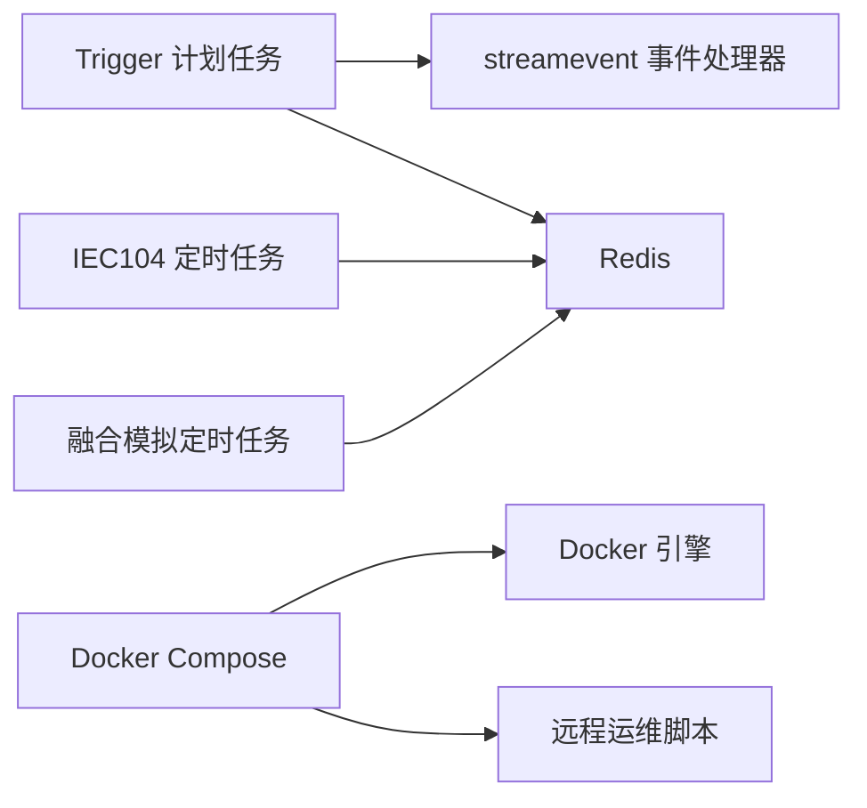

# 运维自动化与机器人技术

<cite>
**本文引用的文件**   
- [README.md](file://README.md)
- [manage.sh](file://util/manage.sh)
- [Taskfile.yml](file://util/Taskfile.yml)
- [Taskfile-docker.yml](file://util/Taskfile-docker.yml)
- [docker-compose.yml](file://deploy/docker-compose.yml)
- [dockerx.go](file://common/dockerx/dockerx.go)
- [cronservice.go（Trigger 计划任务）](file://app/trigger/cron/cronservice.go)
- [asynqSchedulerServer.go](file://common/asynqx/asynqSchedulerServer.go)
- [asynqTaskServer.go](file://common/asynqx/asynqTaskServer.go)
- [cronservice.go（IEC104 定时任务）](file://app/ieccaller/cron/cronservice.go)
- [cronservice.go（融合模拟定时任务）](file://app/xfusionmock/cron/cronservice.go)
</cite>

## 目录
1. [简介](#简介)
2. [项目结构](#项目结构)
3. [核心组件](#核心组件)
4. [架构总览](#架构总览)
5. [详细组件分析](#详细组件分析)
6. [依赖分析](#依赖分析)
7. [性能考虑](#性能考虑)
8. [故障排查指南](#故障排查指南)
9. [结论](#结论)
10. [附录](#附录)

## 简介
本指南围绕 zero-service 的运维自动化与机器人技术展开，目标是帮助读者快速掌握以下内容：
- 运维机器人技术：聊天机器人、自动化脚本、智能问答等智能化运维工具的实现思路与落地方法
- 自动化运维流程：自动部署、自动扩缩容、自动配置更新、自动监控等核心功能的设计与实施
- 运维脚本编写与管理：批量操作、状态检查、故障处理等常用自动化任务的组织与执行
- 智能运维平台集成：与监控系统、告警系统、配置管理系统等的对接方案
- 最佳实践：安全策略、权限控制、审计日志等运维安全措施

在本项目中，自动化能力主要体现在：
- 基于 asynq 的异步任务调度与计划任务引擎
- 基于 cron 的周期性任务（如 IEC104 总召唤、累计量召唤、融合模拟推送）
- 基于 Docker Compose 的一键编排与远程运维脚本
- 基于 gRPC 的服务治理与可观测性（OpenTelemetry、Prometheus）

章节来源
- [README.md:15-51](file://README.md#L15-L51)
- [README.md:133-154](file://README.md#L133-L154)

## 项目结构
本项目采用 go-zero 微服务架构，服务以“app/”为根目录进行组织，每个服务包含 proto 定义、配置、逻辑、服务端与上下文等模块；公共能力集中在“common/”目录；部署与编排在“deploy/”和“util/”中。

图表来源
- [README.md:59-108](file://README.md#L59-L108)
- [docker-compose.yml:1-110](file://deploy/docker-compose.yml#L1-L110)
- [Taskfile.yml:1-33](file://util/Taskfile.yml#L1-L33)
- [Taskfile-docker.yml:1-37](file://util/Taskfile-docker.yml#L1-L37)

章节来源
- [README.md:59-108](file://README.md#L59-L108)
- [docker-compose.yml:1-110](file://deploy/docker-compose.yml#L1-L110)

## 核心组件
- 计划任务与异步任务调度
  - 触发器（trigger）：基于数据库扫描的计划任务引擎，支持状态机与回调执行；同时集成 gRPC 事件通知
  - asynq：分布式任务队列与调度器，支持定时任务注册、消费者并发与中间件日志
- 协议与桥接
  - IEC104、Modbus、MQTT 等协议桥接服务，支持定时命令下发与数据汇聚
- 容器管理
  - Docker 客户端封装，提供环境解析、端口提取、资源解析与环境变量构建等能力
- 部署与运维
  - Docker Compose 编排、远程运维脚本与 Taskfile 任务编排

章节来源
- [README.md:133-154](file://README.md#L133-L154)
- [README.md:174-187](file://README.md#L174-L187)
- [dockerx.go:1-95](file://common/dockerx/dockerx.go#L1-L95)
- [asynqSchedulerServer.go:1-62](file://common/asynqx/asynqSchedulerServer.go#L1-L62)
- [asynqTaskServer.go:1-87](file://common/asynqx/asynqTaskServer.go#L1-L87)

## 架构总览
下图展示了运维自动化与机器人技术在系统中的位置与交互关系：计划任务与异步任务作为“大脑”，协议桥接与容器管理作为“四肢”，Docker Compose 与运维脚本作为“执行器”。

图表来源
- [cronservice.go（Trigger 计划任务）:1-469](file://app/trigger/cron/cronservice.go#L1-L469)
- [asynqSchedulerServer.go:1-62](file://common/asynqx/asynqSchedulerServer.go#L1-L62)
- [asynqTaskServer.go:1-87](file://common/asynqx/asynqTaskServer.go#L1-L87)
- [cronservice.go（IEC104 定时任务）:1-78](file://app/ieccaller/cron/cronservice.go#L1-L78)
- [cronservice.go（融合模拟定时任务）:1-54](file://app/xfusionmock/cron/cronservice.go#L1-L54)
- [docker-compose.yml:1-110](file://deploy/docker-compose.yml#L1-L110)
- [manage.sh:1-35](file://util/manage.sh#L1-L35)
- [Taskfile-docker.yml:1-37](file://util/Taskfile-docker.yml#L1-L37)
- [dockerx.go:1-95](file://common/dockerx/dockerx.go#L1-L95)

## 详细组件分析

### 计划任务与异步任务调度（Trigger）
- 扫描循环与状态机
  - 周期性扫描待执行计划项，加分布式锁后调用 streamevent 事件处理器，并根据返回结果更新状态（完成/失败/延迟/进行中/终止）
  - 支持批量与计划维度的完成时间回填与事件通知
- 并发与超时
  - 使用 TaskRunner 控制并发，结合 Redis 分布式锁避免重复执行
  - 请求超时与 gRPC 调用超时叠加，确保任务不会无限阻塞
- 可观测性
  - 基于 OpenTelemetry 生成 TraceID，贯穿任务执行链路

图表来源
- [cronservice.go（Trigger 计划任务）:81-184](file://app/trigger/cron/cronservice.go#L81-L184)
- [cronservice.go（Trigger 计划任务）:203-468](file://app/trigger/cron/cronservice.go#L203-L468)

章节来源
- [cronservice.go（Trigger 计划任务）:1-469](file://app/trigger/cron/cronservice.go#L1-L469)

### 异步任务调度（asynq）
- 调度器与消费者
  - 调度器负责注册定时任务（如每分钟任务），消费者并发处理不同优先级队列（critical/default/low）
  - 中间件记录任务类型与耗时，便于审计与性能分析
- 运维脚本集成
  - 通过 Taskfile 与远程脚本实现远端 docker compose 的启停与重启，结合 asynq 的任务生命周期管理

图表来源
- [asynqSchedulerServer.go:32-61](file://common/asynqx/asynqSchedulerServer.go#L32-L61)
- [asynqTaskServer.go:39-86](file://common/asynqx/asynqTaskServer.go#L39-L86)

章节来源
- [asynqSchedulerServer.go:1-62](file://common/asynqx/asynqSchedulerServer.go#L1-L62)
- [asynqTaskServer.go:1-87](file://common/asynqx/asynqTaskServer.go#L1-L87)

### 协议与桥接的自动化（IEC104、融合模拟）
- IEC104 定时任务
  - 支持总召唤与累计量召唤的周期性执行，按配置对多个 IEC104 从站进行命令下发
- 融合模拟定时任务
  - 周期性推送测试、点位、告警、事件与终端绑定等数据，便于联调与压测

图表来源
- [cronservice.go（IEC104 定时任务）:24-71](file://app/ieccaller/cron/cronservice.go#L24-L71)

章节来源
- [cronservice.go（IEC104 定时任务）:1-78](file://app/ieccaller/cron/cronservice.go#L1-L78)
- [cronservice.go（融合模拟定时任务）:1-54](file://app/xfusionmock/cron/cronservice.go#L1-L54)

### 容器管理与运维脚本
- Docker 客户端封装
  - 提供环境变量解析、端口与挂载卷提取、资源限制解析与环境变量构建等工具函数
- 远程运维脚本
  - 通过 Taskfile-docker.yml 与 manage.sh 实现远程服务器上的 docker compose 启停/重启/更新
  - 支持按服务名批量或单个服务操作

图表来源
- [manage.sh:1-35](file://util/manage.sh#L1-L35)
- [Taskfile-docker.yml:11-37](file://util/Taskfile-docker.yml#L11-L37)
- [docker-compose.yml:1-110](file://deploy/docker-compose.yml#L1-L110)
- [dockerx.go:20-94](file://common/dockerx/dockerx.go#L20-L94)

章节来源
- [manage.sh:1-35](file://util/manage.sh#L1-L35)
- [Taskfile-docker.yml:1-37](file://util/Taskfile-docker.yml#L1-L37)
- [docker-compose.yml:1-110](file://deploy/docker-compose.yml#L1-L110)
- [dockerx.go:1-95](file://common/dockerx/dockerx.go#L1-L95)

## 依赖分析
- 组件耦合
  - 计划任务与异步任务通过 streamevent 事件处理器解耦，降低服务间直接依赖
  - 协议桥接服务通过配置驱动，便于扩展新协议
- 外部依赖
  - Redis：分布式锁与任务队列
  - Kafka：数据流管道（IEC104 数据汇聚）
  - Docker：容器生命周期管理与远程运维
  - OpenTelemetry/Prometheus：可观测性与监控

图表来源
- [README.md:213-224](file://README.md#L213-L224)
- [docker-compose.yml:1-110](file://deploy/docker-compose.yml#L1-L110)

章节来源
- [README.md:213-224](file://README.md#L213-L224)

## 性能考虑
- 并发与限流
  - asynq 任务服务器通过队列优先级与并发数控制吞吐；计划任务扫描采用随机退避，避免热点竞争
- 资源与容器
  - Docker 客户端封装提供资源限制解析，便于在容器层面进行 CPU/内存约束
- 监控与追踪
  - OpenTelemetry 与 Prometheus 集成，建议在生产环境开启指标采集与告警

章节来源
- [asynqTaskServer.go:55-63](file://common/asynqx/asynqTaskServer.go#L55-L63)
- [cronservice.go（Trigger 计划任务）:62-78](file://app/trigger/cron/cronservice.go#L62-L78)
- [dockerx.go:58-86](file://common/dockerx/dockerx.go#L58-L86)
- [README.md:223-224](file://README.md#L223-L224)

## 故障排查指南
- 计划任务未执行
  - 检查扫描循环是否运行、Redis 分布式锁是否被占用、回调 gRPC 是否可达
  - 查看执行日志与状态更新是否成功
- 异步任务堆积
  - 检查消费者并发与队列优先级配置，确认日志中间件输出的任务耗时
- 协议命令未下发
  - 核对 IEC104 配置与客户端连接状态，确认定时器是否启用
- 远程部署失败
  - 检查 ssh 凭据、docker compose 路径与服务名参数，确认容器网络模式与端口映射

章节来源
- [cronservice.go（Trigger 计划任务）:38-78](file://app/trigger/cron/cronservice.go#L38-L78)
- [asynqTaskServer.go:73-86](file://common/asynqx/asynqTaskServer.go#L73-L86)
- [cronservice.go（IEC104 定时任务）:23-71](file://app/ieccaller/cron/cronservice.go#L23-L71)
- [manage.sh:1-35](file://util/manage.sh#L1-L35)
- [Taskfile-docker.yml:11-37](file://util/Taskfile-docker.yml#L11-L37)

## 结论
本指南从自动化中枢（计划/异步任务）、协议与桥接、容器与部署、可观测性等多个维度梳理了 zero-service 的运维自动化与机器人技术实现路径。通过标准化的脚本与编排工具、可扩展的协议桥接与任务调度机制，能够有效支撑自动部署、自动扩缩容、自动配置更新与自动监控等核心运维场景。

## 附录
- 快速开始与部署
  - 使用 docker-compose 启动核心服务，结合远程运维脚本实现批量启停
- 最佳实践清单
  - 安全策略：最小权限原则、密钥管理、网络隔离
  - 权限控制：服务间鉴权、API 访问控制、容器资源配额
  - 审计日志：任务执行日志、gRPC 调用链路、容器操作审计

章节来源
- [README.md:226-325](file://README.md#L226-L325)
- [docker-compose.yml:1-110](file://deploy/docker-compose.yml#L1-L110)