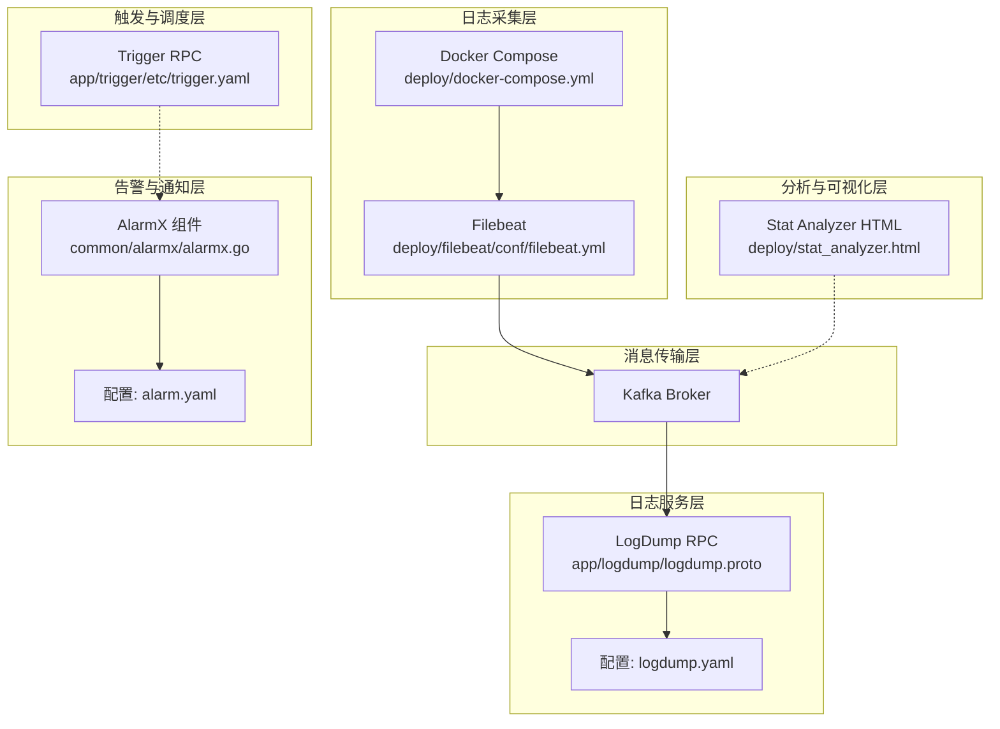
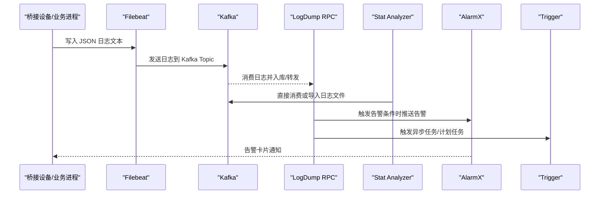
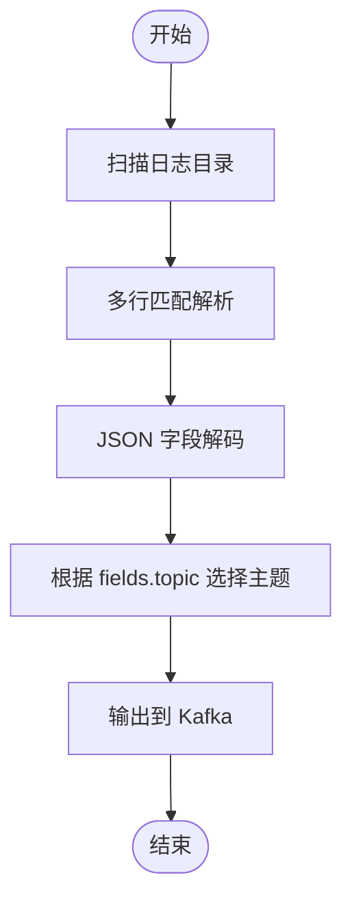
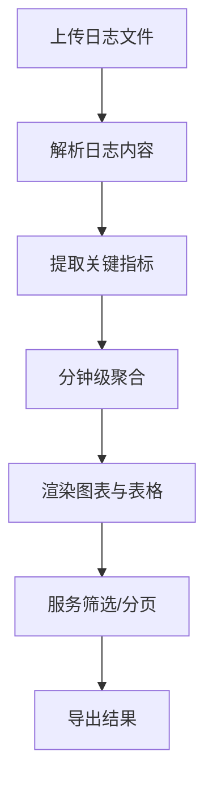
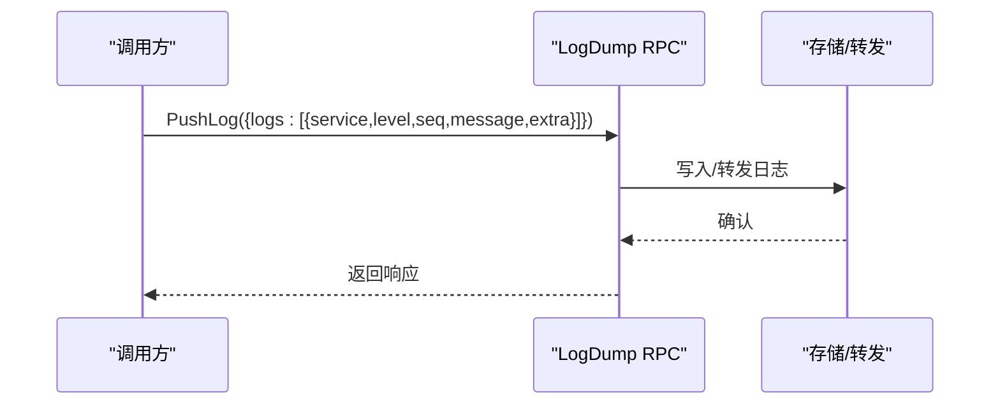
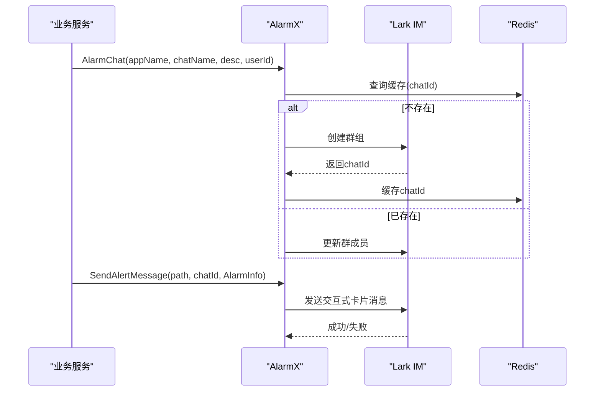
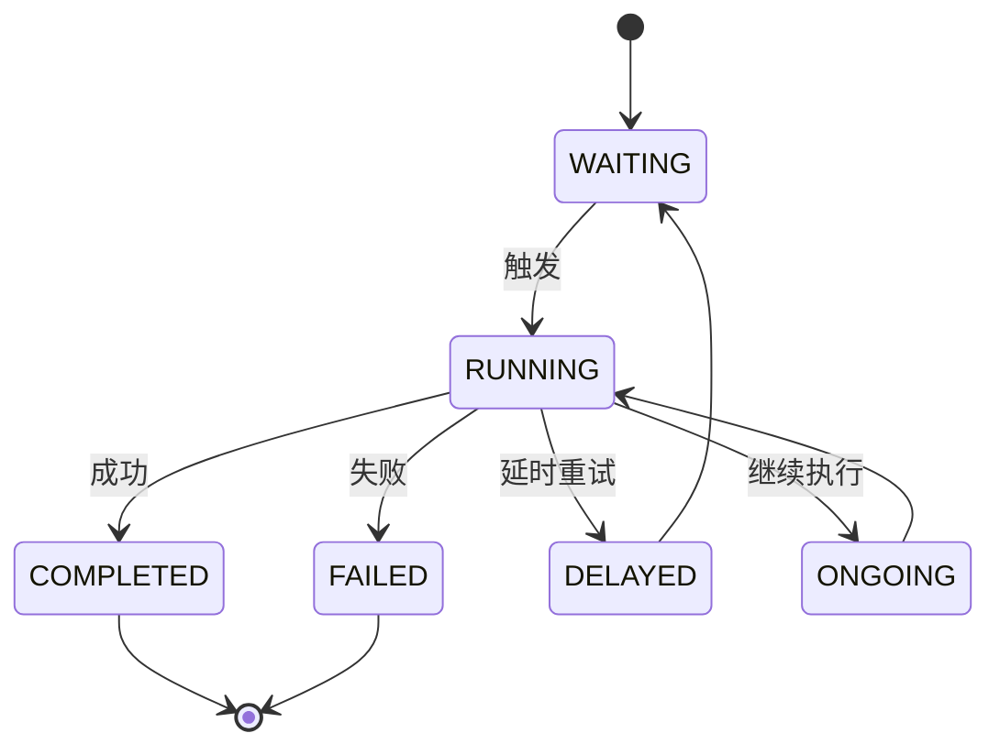
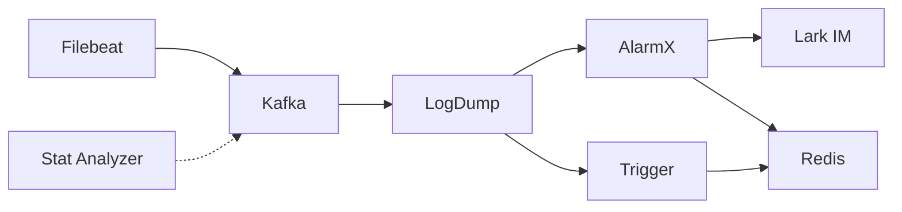

# 日志分析工具集成

<cite>
**本文引用的文件**
- [deploy/filebeat/conf/filebeat.yml](file://deploy/filebeat/conf/filebeat.yml)
- [deploy/docker-compose.yml](file://deploy/docker-compose.yml)
- [deploy/stat_analyzer.html](file://deploy/stat_analyzer.html)
- [app/logdump/logdump.proto](file://app/logdump/logdump.proto)
- [app/logdump/etc/logdump.yaml](file://app/logdump/etc/logdump.yaml)
- [common/alarmx/alarmx.go](file://common/alarmx/alarmx.go)
- [app/alarm/etc/alarm.yaml](file://app/alarm/etc/alarm.yaml)
- [app/trigger/etc/trigger.yaml](file://app/trigger/etc/trigger.yaml)
- [util/manage.sh](file://util/manage.sh)
</cite>

## 目录
1. [简介](#简介)
2. [项目结构](#项目结构)
3. [核心组件](#核心组件)
4. [架构总览](#架构总览)
5. [详细组件分析](#详细组件分析)
6. [依赖分析](#依赖分析)
7. [性能考虑](#性能考虑)
8. [故障排查指南](#故障排查指南)
9. [结论](#结论)
10. [附录](#附录)

## 简介
本文件面向 zero-service 项目的日志分析工具集成，围绕以下目标展开：
- 日志采集与传输：基于 Filebeat 的日志采集、解析与转发至 Kafka 的流水线。
- 日志分析与可视化：内置 Web 工具对 Go-Zero 微服务的 stat 日志进行解析与可视化展示。
- 告警与通知：基于 Lark IM 的告警群组与消息卡片推送，结合 Redis 缓存实现告警通道。
- 触发与调度：基于 asynq 的异步任务与计划任务引擎，支撑日志驱动的触发与回调。
- 扩展与最佳实践：提供工具选择、性能优化与维护策略建议。

## 项目结构
与日志分析相关的关键目录与文件：
- 日志采集与传输：deploy/filebeat/conf/filebeat.yml、deploy/docker-compose.yml
- 日志分析与可视化：deploy/stat_analyzer.html
- 日志推送服务：app/logdump/logdump.proto、app/logdump/etc/logdump.yaml
- 告警与通知：common/alarmx/alarmx.go、app/alarm/etc/alarm.yaml
- 触发与调度：app/trigger/etc/trigger.yaml
- 部署与运维：util/manage.sh

**图表来源**
- [deploy/filebeat/conf/filebeat.yml:1-122](file://deploy/filebeat/conf/filebeat.yml#L1-L122)
- [deploy/docker-compose.yml:1-110](file://deploy/docker-compose.yml#L1-L110)
- [deploy/stat_analyzer.html:1-800](file://deploy/stat_analyzer.html#L1-L800)
- [app/logdump/logdump.proto:1-44](file://app/logdump/logdump.proto#L1-L44)
- [app/logdump/etc/logdump.yaml:1-26](file://app/logdump/etc/logdump.yaml#L1-L26)
- [common/alarmx/alarmx.go:1-223](file://common/alarmx/alarmx.go#L1-L223)
- [app/alarm/etc/alarm.yaml:1-25](file://app/alarm/etc/alarm.yaml#L1-L25)
- [app/trigger/etc/trigger.yaml:1-37](file://app/trigger/etc/trigger.yaml#L1-L37)

**章节来源**
- [deploy/filebeat/conf/filebeat.yml:1-122](file://deploy/filebeat/conf/filebeat.yml#L1-L122)
- [deploy/docker-compose.yml:1-110](file://deploy/docker-compose.yml#L1-L110)
- [deploy/stat_analyzer.html:1-800](file://deploy/stat_analyzer.html#L1-L800)
- [app/logdump/logdump.proto:1-44](file://app/logdump/logdump.proto#L1-L44)
- [app/logdump/etc/logdump.yaml:1-26](file://app/logdump/etc/logdump.yaml#L1-L26)
- [common/alarmx/alarmx.go:1-223](file://common/alarmx/alarmx.go#L1-L223)
- [app/alarm/etc/alarm.yaml:1-25](file://app/alarm/etc/alarm.yaml#L1-L25)
- [app/trigger/etc/trigger.yaml:1-37](file://app/trigger/etc/trigger.yaml#L1-L37)

## 核心组件
- 日志采集与传输
  - Filebeat：按输入规则读取桥接设备产生的 JSON 文本，使用多行解析与 JSON 解码，将日志推送到 Kafka。
  - Docker Compose：编排 Kafka、Filebeat、业务服务，挂载日志目录与配置。
- 日志分析与可视化
  - Stat Analyzer：Web 工具，支持拖拽上传 Go-Zero stat 日志，解析并可视化展示 QPS、内存、CPU、限流等指标。
- 日志推送服务
  - LogDump RPC：提供 PushLog 接口，接收结构化日志条目，支持扩展字段注入。
- 告警与通知
  - AlarmX：封装 Lark IM 的聊天创建、成员管理与消息发送；结合 Redis 缓存聊天 ID，实现告警卡片推送。
- 触发与调度
  - Trigger：基于 asynq 的异步任务与计划任务引擎，支持回调、重试、生命周期管理与统计面板。

**章节来源**
- [deploy/filebeat/conf/filebeat.yml:1-122](file://deploy/filebeat/conf/filebeat.yml#L1-L122)
- [deploy/docker-compose.yml:1-110](file://deploy/docker-compose.yml#L1-L110)
- [deploy/stat_analyzer.html:1-800](file://deploy/stat_analyzer.html#L1-L800)
- [app/logdump/logdump.proto:1-44](file://app/logdump/logdump.proto#L1-L44)
- [app/logdump/etc/logdump.yaml:1-26](file://app/logdump/etc/logdump.yaml#L1-L26)
- [common/alarmx/alarmx.go:1-223](file://common/alarmx/alarmx.go#L1-L223)
- [app/alarm/etc/alarm.yaml:1-25](file://app/alarm/etc/alarm.yaml#L1-L25)
- [app/trigger/etc/trigger.yaml:1-37](file://app/trigger/etc/trigger.yaml#L1-L37)

## 架构总览
下图展示了从日志产生到分析、告警与触发的整体流程：

**图表来源**
- [deploy/filebeat/conf/filebeat.yml:1-122](file://deploy/filebeat/conf/filebeat.yml#L1-L122)
- [app/logdump/logdump.proto:1-44](file://app/logdump/logdump.proto#L1-L44)
- [deploy/stat_analyzer.html:1-800](file://deploy/stat_analyzer.html#L1-L800)
- [common/alarmx/alarmx.go:1-223](file://common/alarmx/alarmx.go#L1-L223)
- [app/trigger/etc/trigger.yaml:1-37](file://app/trigger/etc/trigger.yaml#L1-L37)

## 详细组件分析

### 日志采集与传输（Filebeat + Kafka）
- 输入与解析
  - 监听多个桥接目录下的 JSON 文本，使用多行匹配与 JSON 解码，剥离包裹标签后解析 JSON 字段。
  - 通过 fields.topic 将日志路由到不同 Kafka 主题。
- 输出与可靠性
  - 输出到 Kafka，启用压缩与合理的 ack 设置，保证传输效率与可靠性。
- 运维与编排
  - Docker Compose 启动 Kafka 与 Filebeat，并挂载日志目录与容器元数据，便于跨服务统一采集。

**图表来源**
- [deploy/filebeat/conf/filebeat.yml:1-122](file://deploy/filebeat/conf/filebeat.yml#L1-L122)

**章节来源**
- [deploy/filebeat/conf/filebeat.yml:1-122](file://deploy/filebeat/conf/filebeat.yml#L1-L122)
- [deploy/docker-compose.yml:1-110](file://deploy/docker-compose.yml#L1-L110)

### 日志分析与可视化（Stat Analyzer）
- 功能特性
  - 支持拖拽上传 Go-Zero stat 日志，自动解析内存、CPU、QPS、限流等指标。
  - 提供多维度图表：QPS 趋势、内存趋势、系统指标综合、服务分布、限流状态、缓存命中率等。
  - 支持服务筛选、分页、全屏图表与表格全屏模式。
- 数据处理
  - 解析日志时间戳、服务名、内存与 CPU 指标、GC 次数、QPS、丢弃数、限流状态等字段。
  - 提供分钟级聚合与服务分布统计，辅助定位热点服务与异常时段。

**图表来源**
- [deploy/stat_analyzer.html:1-800](file://deploy/stat_analyzer.html#L1-L800)

**章节来源**
- [deploy/stat_analyzer.html:1-800](file://deploy/stat_analyzer.html#L1-L800)

### 日志推送服务（LogDump RPC）
- 接口与数据模型
  - 提供 PushLog 接口，支持批量推送日志条目，包含服务名、级别、业务序列号、消息与附加字段。
  - 配置支持忽略特定方法的统计埋点，减少噪声。
- 扩展字段
  - 在配置中声明额外的业务字段（如订单号、用户 ID、任务 ID 等），便于后续关联分析。

**图表来源**
- [app/logdump/logdump.proto:1-44](file://app/logdump/logdump.proto#L1-L44)
- [app/logdump/etc/logdump.yaml:1-26](file://app/logdump/etc/logdump.yaml#L1-L26)

**章节来源**
- [app/logdump/logdump.proto:1-44](file://app/logdump/logdump.proto#L1-L44)
- [app/logdump/etc/logdump.yaml:1-26](file://app/logdump/etc/logdump.yaml#L1-L26)

### 告警与通知（AlarmX + Lark IM）
- 告警群组管理
  - 通过 Redis 缓存聊天 ID，首次创建后复用；支持更新群成员。
- 消息卡片推送
  - 读取模板卡片，填充告警标题、项目、时间、ID、内容、错误、IP 等字段，发送交互式卡片消息。
- 配置要点
  - 配置 Lark AppId、AppSecret、EncryptKey、VerificationToken、默认用户列表与卡片模板路径。

**图表来源**
- [common/alarmx/alarmx.go:1-223](file://common/alarmx/alarmx.go#L1-L223)
- [app/alarm/etc/alarm.yaml:1-25](file://app/alarm/etc/alarm.yaml#L1-L25)

**章节来源**
- [common/alarmx/alarmx.go:1-223](file://common/alarmx/alarmx.go#L1-L223)
- [app/alarm/etc/alarm.yaml:1-25](file://app/alarm/etc/alarm.yaml#L1-L25)

### 触发与调度（Trigger）
- 异步任务与计划任务
  - 基于 asynq 的分布式任务队列，支持定时/延时任务、HTTP 回调与 gRPC 回调。
  - 计划任务采用 Plan -> Batch -> ExecItem 三层模型，具备状态机与生命周期管理。
- 配置要点
  - Redis 存储、数据库连接、日志级别与保留天数、回调目标等。

**图表来源**
- [app/trigger/etc/trigger.yaml:1-37](file://app/trigger/etc/trigger.yaml#L1-L37)

**章节来源**
- [app/trigger/etc/trigger.yaml:1-37](file://app/trigger/etc/trigger.yaml#L1-L37)

## 依赖分析
- 组件耦合
  - Filebeat 与 Kafka：采集层与传输层强耦合，Kafka 作为中心枢纽。
  - LogDump 与 AlarmX/Trigger：日志服务可触发告警与任务，形成闭环。
  - Stat Analyzer 与 Kafka：可直接消费或离线导入日志，独立于生产链路。
- 外部依赖
  - Lark IM：用于告警消息卡片推送。
  - Redis：缓存告警群组 ID、任务状态等。
  - Kafka：消息总线，承载日志与触发信号。

**图表来源**
- [deploy/filebeat/conf/filebeat.yml:1-122](file://deploy/filebeat/conf/filebeat.yml#L1-L122)
- [app/logdump/logdump.proto:1-44](file://app/logdump/logdump.proto#L1-L44)
- [common/alarmx/alarmx.go:1-223](file://common/alarmx/alarmx.go#L1-L223)
- [app/trigger/etc/trigger.yaml:1-37](file://app/trigger/etc/trigger.yaml#L1-L37)
- [deploy/stat_analyzer.html:1-800](file://deploy/stat_analyzer.html#L1-L800)

**章节来源**
- [deploy/filebeat/conf/filebeat.yml:1-122](file://deploy/filebeat/conf/filebeat.yml#L1-L122)
- [app/logdump/etc/logdump.yaml:1-26](file://app/logdump/etc/logdump.yaml#L1-L26)
- [common/alarmx/alarmx.go:1-223](file://common/alarmx/alarmx.go#L1-L223)
- [app/trigger/etc/trigger.yaml:1-37](file://app/trigger/etc/trigger.yaml#L1-L37)
- [deploy/stat_analyzer.html:1-800](file://deploy/stat_analyzer.html#L1-L800)

## 性能考虑
- Filebeat
  - 合理设置扫描频率、关闭不活跃文件的时间阈值，避免频繁 IO。
  - 使用多行解析与 JSON 解码时注意字段覆盖策略，避免冗余字段影响吞吐。
- Kafka
  - 控制消息大小与压缩策略，平衡带宽与 CPU 开销。
  - 分区数量与副本策略应满足峰值吞吐与高可用需求。
- LogDump
  - 对 PushLog 请求进行批量写入，减少网络往返。
  - 配置忽略统计埋点的方法，降低日志噪音。
- Stat Analyzer
  - 大文件解析时采用分页与懒加载，避免一次性加载造成内存压力。
  - 图表交互使用节流与去抖，提升用户体验。
- AlarmX
  - 利用 Redis 缓存聊天 ID，减少重复创建群组的开销。
  - 模板卡片预加载，避免每次发送时的磁盘读取。
- Trigger
  - 合理设置重试与超时，避免任务堆积。
  - 使用数据库扫描与分布式锁，确保幂等与一致性。

## 故障排查指南
- Filebeat 无法采集
  - 检查输入路径与权限、多行解析正则是否匹配实际日志格式。
  - 查看 processors 中的丢弃条件，确认是否误删日志。
- Kafka 连接失败
  - 核对 advertised listeners 与客户端连接地址，检查网络连通性。
  - 确认分区与副本配置满足集群状态。
- LogDump 推送失败
  - 检查配置中的忽略统计方法列表，确认 PushLog 是否被排除。
  - 校验日志条目结构与附加字段是否符合预期。
- 告警消息未送达
  - 校验 Lark 配置项与卡片模板路径，确认模板变量替换正确。
  - 检查 Redis 缓存是否存在，必要时清理缓存重建群组。
- Stat Analyzer 解析异常
  - 确认上传文件格式与时间戳解析规则，必要时调整解析逻辑。
  - 检查浏览器控制台与网络面板，定位加载或解析错误。
- Trigger 任务堆积
  - 检查 Redis 与数据库连接，确认任务队列与状态表正常。
  - 调整重试策略与并发度，避免过载。

**章节来源**
- [deploy/filebeat/conf/filebeat.yml:1-122](file://deploy/filebeat/conf/filebeat.yml#L1-L122)
- [app/logdump/etc/logdump.yaml:1-26](file://app/logdump/etc/logdump.yaml#L1-L26)
- [common/alarmx/alarmx.go:1-223](file://common/alarmx/alarmx.go#L1-L223)
- [app/trigger/etc/trigger.yaml:1-37](file://app/trigger/etc/trigger.yaml#L1-L37)
- [deploy/stat_analyzer.html:1-800](file://deploy/stat_analyzer.html#L1-L800)

## 结论
zero-service 的日志分析体系以 Filebeat 为核心采集入口，配合 Kafka 实现高效传输，LogDump 提供结构化日志推送能力，Stat Analyzer 实现可视化分析，AlarmX 与 Trigger 则分别负责告警通知与任务调度。该方案具备良好的扩展性与运维友好性，适合在生产环境中持续演进。

## 附录
- 部署与运维
  - 使用 util/manage.sh 统一管理服务启停与重启，简化运维操作。
  - 通过 docker-compose 编排 Kafka、Filebeat 与业务服务，确保环境一致性。

**章节来源**
- [util/manage.sh:1-35](file://util/manage.sh#L1-L35)
- [deploy/docker-compose.yml:1-110](file://deploy/docker-compose.yml#L1-L110)