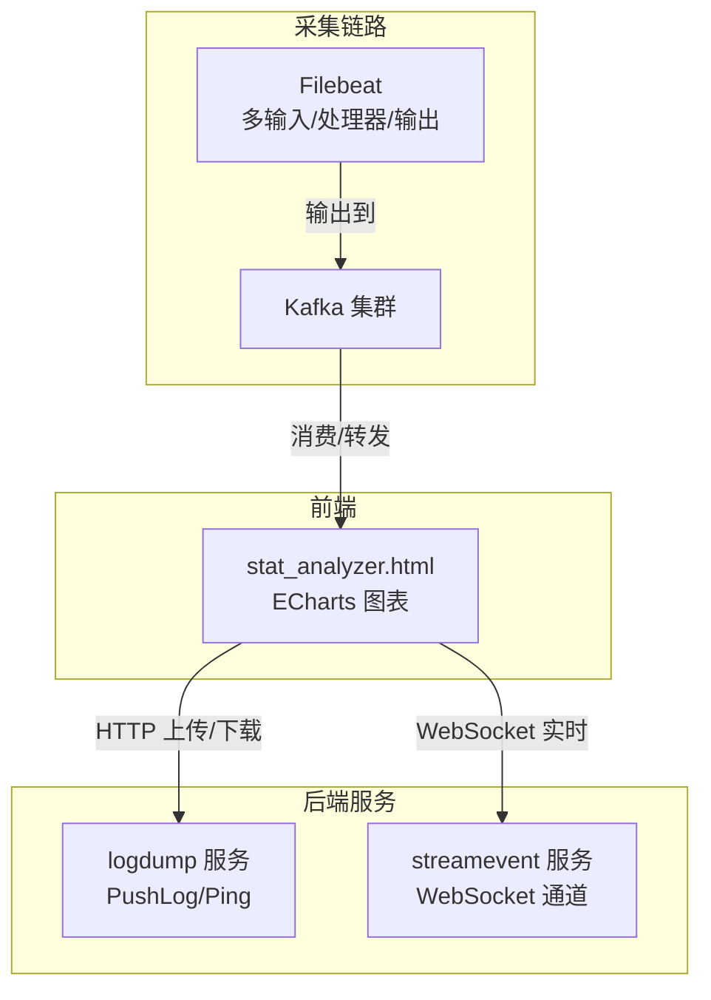
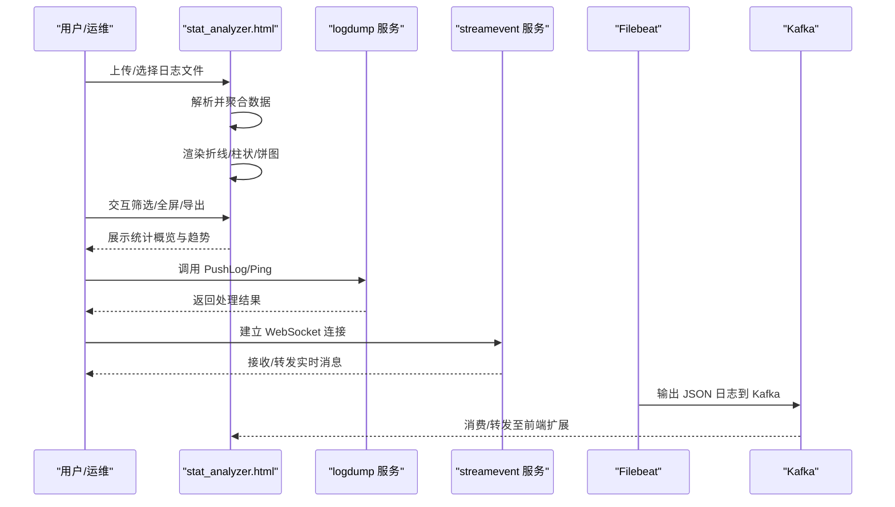
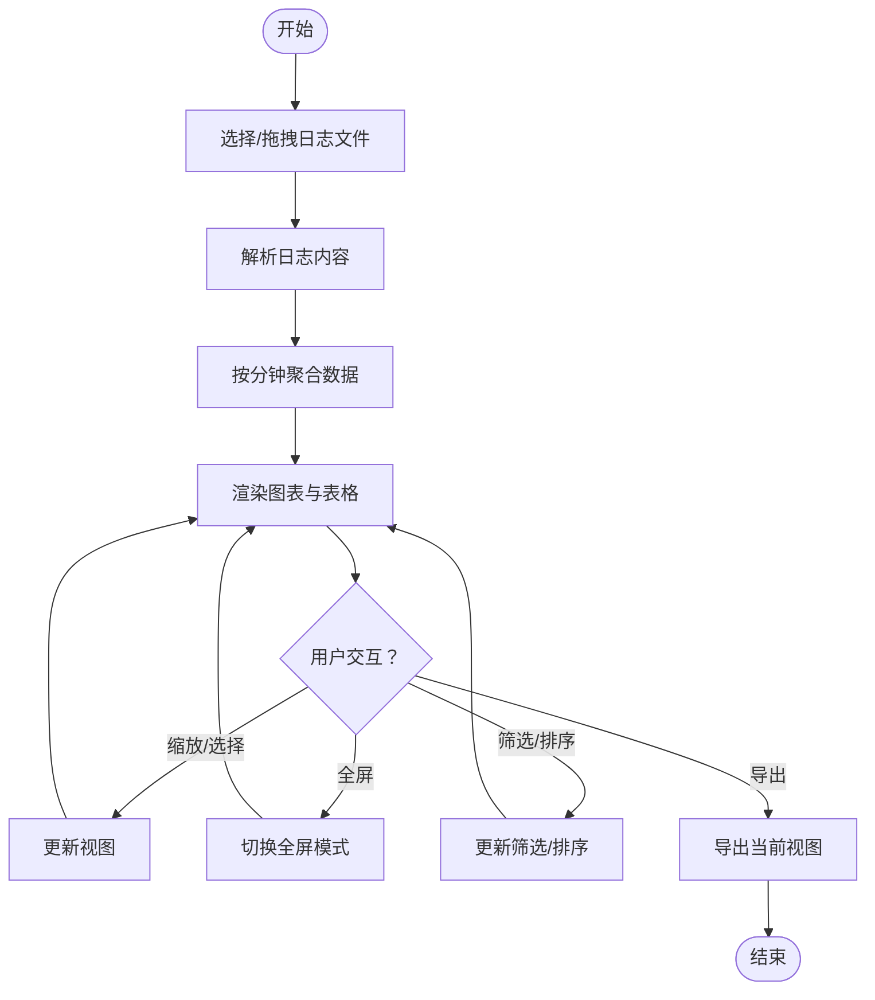
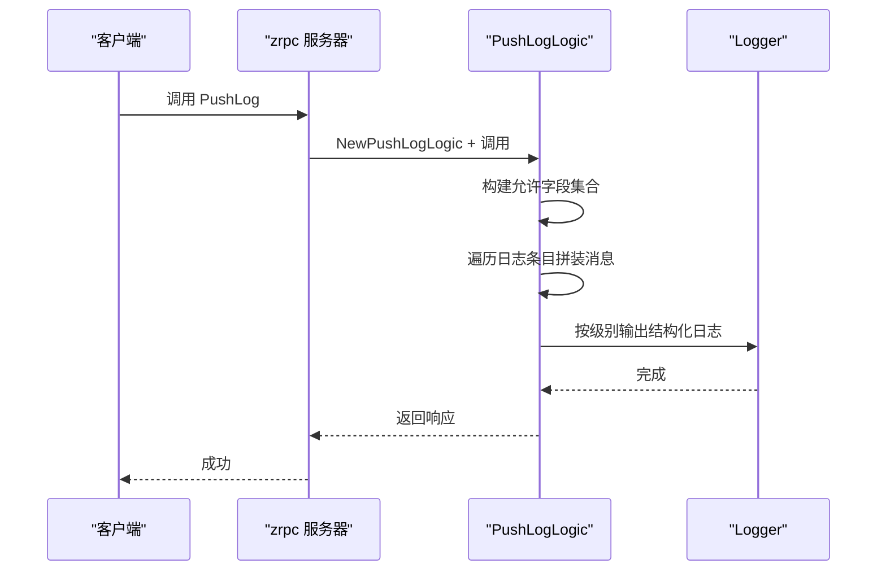
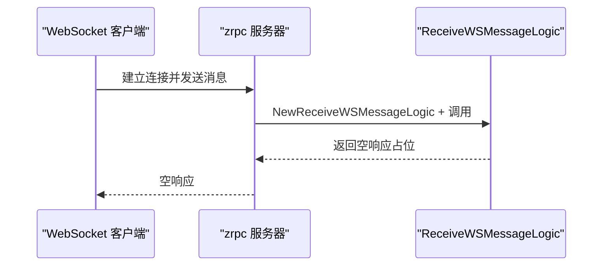
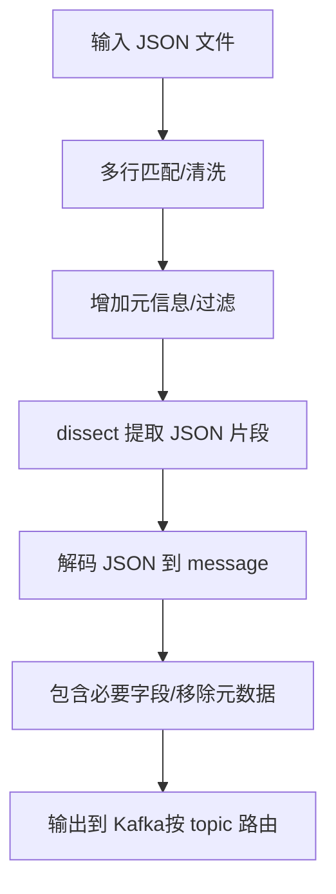
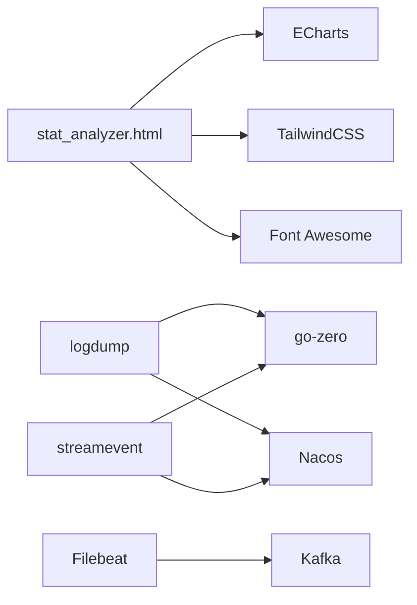

# 日志可视化与仪表板

<cite>
**本文引用的文件**
- [stat_analyzer.html](file://deploy/stat_analyzer.html)
- [logdump.go](file://app/logdump/logdump.go)
- [logdump.yaml](file://app/logdump/etc/logdump.yaml)
- [pushloglogic.go](file://app/logdump/internal/logic/pushloglogic.go)
- [pinglogic.go](file://app/logdump/internal/logic/pinglogic.go)
- [streamevent.go](file://facade/streamevent/streamevent.go)
- [receivewsmessagelogic.go](file://facade/streamevent/internal/logic/receivewsmessagelogic.go)
- [docker-compose.yml](file://deploy/docker-compose.yml)
- [filebeat.yml](file://deploy/filebeat/conf/filebeat.yml)
</cite>

## 目录
1. [简介](#简介)
2. [项目结构](#项目结构)
3. [核心组件](#核心组件)
4. [架构总览](#架构总览)
5. [详细组件分析](#详细组件分析)
6. [依赖分析](#依赖分析)
7. [性能考虑](#性能考虑)
8. [故障排查指南](#故障排查指南)
9. [结论](#结论)
10. [附录](#附录)

## 简介
本文件面向 zero-service 的日志可视化与仪表板能力，围绕以下目标展开：
- 日志图表展示：折线图、柱状图、饼图等的配置与使用
- 统计报表生成：日志统计指标、报表模板、自动报表生成
- 趋势分析可视化：日志量趋势、错误率趋势、性能指标趋势
- 仪表板定制：布局、指标配置、交互式筛选、实时更新
- 可视化性能优化：数据刷新策略、图表渲染优化、大屏展示适配

项目中已内置基于 ECharts 的前端分析页面，可对 Go-Zero 微服务的 stat 日志进行可视化分析；同时提供日志推送服务与 WebSocket 通道，支撑日志采集与实时展示。

## 项目结构
与日志可视化和仪表板相关的关键模块如下：
- 前端分析页面：deploy/stat_analyzer.html，提供拖拽上传、解析、图表渲染与交互
- 日志推送服务：app/logdump，接收并记录结构化日志
- WebSocket 门面：facade/streamevent，承载实时消息通道
- 日志采集链路：deploy/docker-compose.yml + deploy/filebeat/conf/filebeat.yml，将桥接设备产生的 JSON 日志推送到 Kafka

**图表来源**
- [stat_analyzer.html:1-533](file://deploy/stat_analyzer.html#L1-L533)
- [logdump.go:1-71](file://app/logdump/logdump.go#L1-L71)
- [streamevent.go:1-72](file://facade/streamevent/streamevent.go#L1-L72)
- [docker-compose.yml:1-110](file://deploy/docker-compose.yml#L1-L110)
- [filebeat.yml:1-122](file://deploy/filebeat/conf/filebeat.yml#L1-L122)

**章节来源**
- [stat_analyzer.html:1-533](file://deploy/stat_analyzer.html#L1-L533)
- [logdump.go:1-71](file://app/logdump/logdump.go#L1-L71)
- [streamevent.go:1-72](file://facade/streamevent/streamevent.go#L1-L72)
- [docker-compose.yml:1-110](file://deploy/docker-compose.yml#L1-L110)
- [filebeat.yml:1-122](file://deploy/filebeat/conf/filebeat.yml#L1-L122)

## 核心组件
- 前端分析页面（stat_analyzer.html）
  - 支持拖拽上传 Go-Zero stat 日志，解析内存、CPU、QPS、丢弃、限流等指标
  - 提供折线图（QPS、内存、系统指标）、柱状图（缓存命中率）、饼图（服务分布）等
  - 支持图表缩放、区域选择、重置视图、全屏查看、表格排序与分页
- 日志推送服务（logdump）
  - 提供 PushLog 接口，按配置过滤并记录结构化日志
  - 支持 Ping 健康检查
- WebSocket 门面（streamevent）
  - 提供 WebSocket 消息接收接口占位，便于后续接入实时事件流
- 日志采集链路（Filebeat + Kafka）
  - 多输入监听桥接设备 JSON 日志，清洗后输出到 Kafka
  - 通过 docker-compose 统一编排

**章节来源**
- [stat_analyzer.html:248-3314](file://deploy/stat_analyzer.html#L248-L3314)
- [pushloglogic.go:1-68](file://app/logdump/internal/logic/pushloglogic.go#L1-L68)
- [pinglogic.go:1-31](file://app/logdump/internal/logic/pinglogic.go#L1-L31)
- [receivewsmessagelogic.go:1-31](file://facade/streamevent/internal/logic/receivewsmessagelogic.go#L1-L31)
- [filebeat.yml:1-122](file://deploy/filebeat/conf/filebeat.yml#L1-L122)
- [docker-compose.yml:1-110](file://deploy/docker-compose.yml#L1-L110)

## 架构总览
下图展示了从日志产生到前端可视化的完整链路：

**图表来源**
- [stat_analyzer.html:535-711](file://deploy/stat_analyzer.html#L535-L711)
- [logdump.go:27-70](file://app/logdump/logdump.go#L27-L70)
- [streamevent.go:28-71](file://facade/streamevent/streamevent.go#L28-L71)
- [filebeat.yml:110-119](file://deploy/filebeat/conf/filebeat.yml#L110-L119)

## 详细组件分析

### 前端分析页面（stat_analyzer.html）
- 功能要点
  - 文件上传与拖拽：支持 .txt/.log，自动处理 1 天级日志
  - 解析与聚合：按分钟聚合，缺失分钟用上一分钟数据填充
  - 图表类型
    - 折线图：系统 QPS 趋势、内存使用趋势、系统指标综合图
    - 柱状图：缓存命中率趋势
    - 饼图：服务分布
  - 交互能力：缩放、区域选择、重置视图、全屏、表格排序与分页
  - 统计概览：总日志条目、服务数量、平均内存、总丢弃请求
- 性能优化
  - 使用 requestAnimationFrame 优化表格行动画
  - 按需渲染与全屏切换时的样式复原
  - 聚合算法减少渲染点数，提升大屏展示流畅度

**图表来源**
- [stat_analyzer.html:773-800](file://deploy/stat_analyzer.html#L773-L800)
- [stat_analyzer.html:1118-1140](file://deploy/stat_analyzer.html#L1118-L1140)
- [stat_analyzer.html:1994-2113](file://deploy/stat_analyzer.html#L1994-L2113)

**章节来源**
- [stat_analyzer.html:197-533](file://deploy/stat_analyzer.html#L197-L533)
- [stat_analyzer.html:773-800](file://deploy/stat_analyzer.html#L773-L800)
- [stat_analyzer.html:1033-1072](file://deploy/stat_analyzer.html#L1033-L1072)
- [stat_analyzer.html:1118-1140](file://deploy/stat_analyzer.html#L1118-L1140)
- [stat_analyzer.html:1994-2113](file://deploy/stat_analyzer.html#L1994-L2113)
- [stat_analyzer.html:2117-2123](file://deploy/stat_analyzer.html#L2117-L2123)

### 日志推送服务（logdump）
- 服务入口与拦截器
  - 启动 RPC 服务，注册 LogDump 服务
  - 注册 Nacos 注册与反射（开发/测试模式）
  - 添加日志拦截器，全局注入 app 字段
- 日志推送逻辑
  - 仅保留配置允许的 extra 字段
  - 拼接基础消息与 extra 字符串
  - 根据日志级别输出 Info/Error

**图表来源**
- [logdump.go:27-70](file://app/logdump/logdump.go#L27-L70)
- [pushloglogic.go:28-67](file://app/logdump/internal/logic/pushloglogic.go#L28-L67)

**章节来源**
- [logdump.go:1-71](file://app/logdump/logdump.go#L1-L71)
- [logdump.yaml:1-26](file://app/logdump/etc/logdump.yaml#L1-L26)
- [pushloglogic.go:1-68](file://app/logdump/internal/logic/pushloglogic.go#L1-L68)
- [pinglogic.go:1-31](file://app/logdump/internal/logic/pinglogic.go#L1-L31)

### WebSocket 门面（streamevent）
- 服务入口
  - 启动 RPC 服务，注册 StreamEvent 服务
  - 注册 Nacos 注册与反射（开发/测试模式）
  - 添加日志拦截器，全局注入 app 字段
- 逻辑占位
  - ReceiveWSMessage 接口预留，便于后续接入实时事件流

**图表来源**
- [streamevent.go:28-71](file://facade/streamevent/streamevent.go#L28-L71)
- [receivewsmessagelogic.go:26-31](file://facade/streamevent/internal/logic/receivewsmessagelogic.go#L26-L31)

**章节来源**
- [streamevent.go:1-72](file://facade/streamevent/streamevent.go#L1-L72)
- [receivewsmessagelogic.go:1-31](file://facade/streamevent/internal/logic/receivewsmessagelogic.go#L1-L31)

### 日志采集链路（Filebeat + Kafka）
- Filebeat 输入
  - 监听多个桥接设备 JSON 日志目录，按行多行匹配
  - 设置扫描频率、关闭时间、忽略旧文件、清理非活跃状态
- 处理器
  - 增加宿主机/云/Docker 元信息
  - 过滤解析错误与特定起始行
  - 使用 dissect 提取 JSON 片段并解码
  - 仅保留必要字段并移除元数据
- 输出
  - 输出到 Kafka，按 topic 字段动态路由，启用压缩与 ack 控制

**图表来源**
- [filebeat.yml:4-73](file://deploy/filebeat/conf/filebeat.yml#L4-L73)
- [filebeat.yml:85-105](file://deploy/filebeat/conf/filebeat.yml#L85-L105)
- [filebeat.yml:110-119](file://deploy/filebeat/conf/filebeat.yml#L110-L119)

**章节来源**
- [filebeat.yml:1-122](file://deploy/filebeat/conf/filebeat.yml#L1-L122)
- [docker-compose.yml:32-53](file://deploy/docker-compose.yml#L32-L53)

## 依赖分析
- 前端依赖
  - TailwindCSS：UI 样式与响应式布局
  - ECharts：图表渲染（折线、柱状、饼图）
  - Font Awesome：图标库
- 后端依赖
  - go-zero：RPC 服务框架
  - Nacos：服务注册与发现（可选）
  - gRPC/反射：开发调试便利
- 采集链路
  - Filebeat：日志采集与清洗
  - Kafka：消息传输与缓冲

**图表来源**
- [stat_analyzer.html:8-10](file://deploy/stat_analyzer.html#L8-L10)
- [logdump.go:15-22](file://app/logdump/logdump.go#L15-L22)
- [streamevent.go:15-22](file://facade/streamevent/streamevent.go#L15-L22)
- [filebeat.yml:110-119](file://deploy/filebeat/conf/filebeat.yml#L110-L119)

**章节来源**
- [stat_analyzer.html:8-10](file://deploy/stat_analyzer.html#L8-L10)
- [logdump.go:15-22](file://app/logdump/logdump.go#L15-L22)
- [streamevent.go:15-22](file://facade/streamevent/streamevent.go#L15-L22)
- [filebeat.yml:110-119](file://deploy/filebeat/conf/filebeat.yml#L110-L119)

## 性能考虑
- 数据刷新策略
  - 前端按分钟聚合，减少渲染点数；缺失分钟用上一分钟数据填充，保证连续性
  - 表格分页与懒加载，避免一次性渲染大量行
- 图表渲染优化
  - 使用 requestAnimationFrame 优化动画帧
  - 图表实例复用与按需销毁，降低内存占用
  - 全屏模式下临时样式覆盖，退出时恢复
- 大屏展示适配
  - 响应式布局与卡片阴影，提升可读性
  - 图表容器最小高度与滚动条自定义，适配不同分辨率

**章节来源**
- [stat_analyzer.html:1118-1140](file://deploy/stat_analyzer.html#L1118-L1140)
- [stat_analyzer.html:3299-3303](file://deploy/stat_analyzer.html#L3299-L3303)
- [stat_analyzer.html:521-532](file://deploy/stat_analyzer.html#L521-L532)
- [stat_analyzer.html:39-142](file://deploy/stat_analyzer.html#L39-L142)

## 故障排查指南
- 前端问题
  - 无法解析日志：检查文件格式与内容是否符合预期（内存/CPU/QPS/限流等字段）
  - 图表空白：确认聚合数据是否存在，检查时间范围与筛选条件
  - 交互异常：确保浏览器支持 ECharts 与相关事件绑定
- 后端问题
  - logdump 无法启动：检查配置文件路径与 Nacos 注册参数
  - PushLog 不生效：确认 ExtraFields 白名单与日志级别
  - streamevent 无法连接：检查 gRPC 端口与反射注册
- 采集链路问题
  - Filebeat 未输出：检查输入路径、多行匹配规则与 Kafka 输出配置
  - Kafka 无数据：确认 Broker 地址、topic 路由与 ack 设置

**章节来源**
- [logdump.yaml:1-26](file://app/logdump/etc/logdump.yaml#L1-L26)
- [pushloglogic.go:28-67](file://app/logdump/internal/logic/pushloglogic.go#L28-L67)
- [filebeat.yml:110-119](file://deploy/filebeat/conf/filebeat.yml#L110-L119)
- [docker-compose.yml:101-109](file://deploy/docker-compose.yml#L101-L109)

## 结论
zero-service 已具备完善的日志可视化与仪表板能力：
- 前端提供丰富的图表类型与交互体验，满足日常监控与趋势分析需求
- 后端服务通过结构化日志与 WebSocket 通道，支撑实时与离线场景
- 采集链路通过 Filebeat + Kafka，形成稳定的数据通路
建议在生产环境中结合自动报表生成与告警联动，进一步完善可观测性体系。

## 附录
- 配置参考
  - 日志推送服务配置：[logdump.yaml:1-26](file://app/logdump/etc/logdump.yaml#L1-L26)
  - Filebeat 采集配置：[filebeat.yml:1-122](file://deploy/filebeat/conf/filebeat.yml#L1-L122)
  - Docker 编排：[docker-compose.yml:1-110](file://deploy/docker-compose.yml#L1-L110)
- 接口参考
  - 日志推送接口：PushLog（见 [pushloglogic.go:28-67](file://app/logdump/internal/logic/pushloglogic.go#L28-L67)）
  - 健康检查接口：Ping（见 [pinglogic.go:26-30](file://app/logdump/internal/logic/pinglogic.go#L26-L30)）
  - WebSocket 接口：ReceiveWSMessage（见 [receivewsmessagelogic.go:26-31](file://facade/streamevent/internal/logic/receivewsmessagelogic.go#L26-L31)）