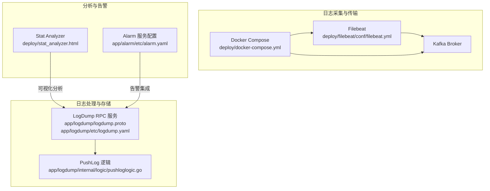
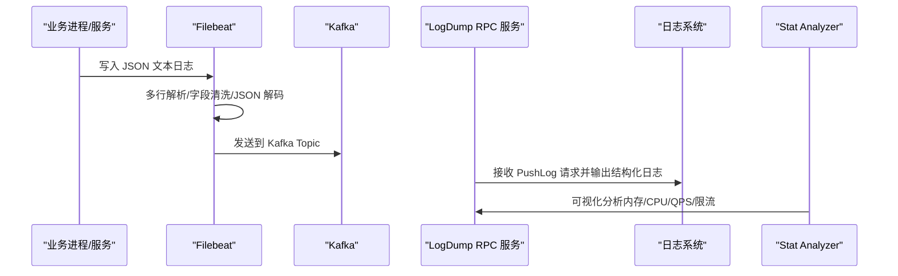
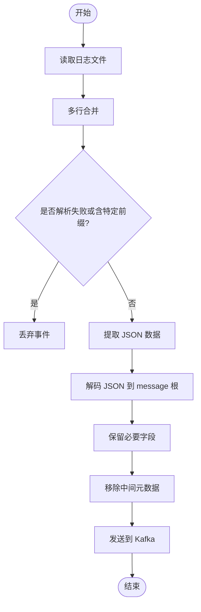
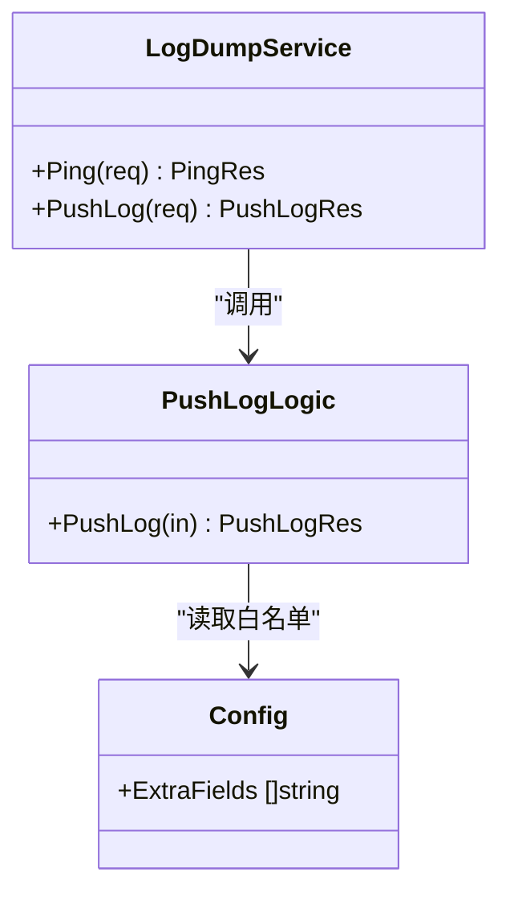
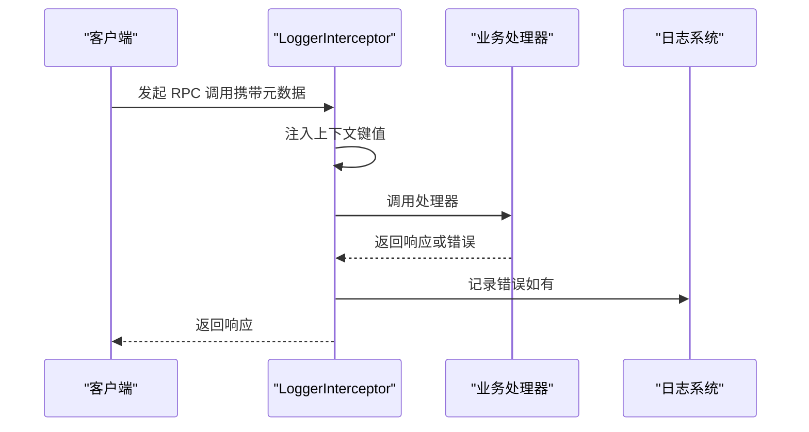
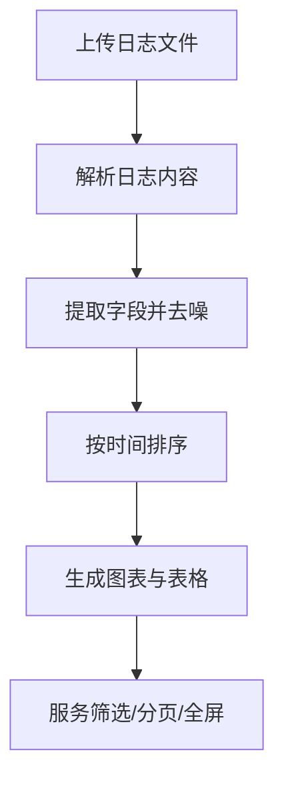
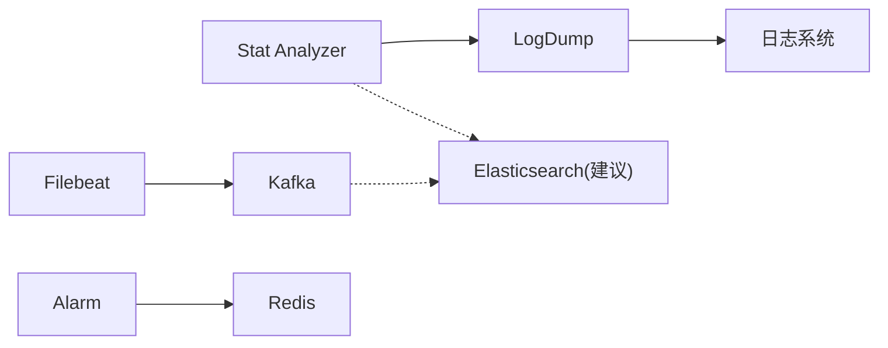

# 日志搜索与分析

<cite>
**本文引用的文件**
- [deploy/filebeat/conf/filebeat.yml](file://deploy/filebeat/conf/filebeat.yml)
- [deploy/docker-compose.yml](file://deploy/docker-compose.yml)
- [app/logdump/logdump.proto](file://app/logdump/logdump.proto)
- [app/logdump/etc/logdump.yaml](file://app/logdump/etc/logdump.yaml)
- [app/logdump/internal/logic/pushloglogic.go](file://app/logdump/internal/logic/pushloglogic.go)
- [common/Interceptor/rpcserver/loggerInterceptor.go](file://common/Interceptor/rpcserver/loggerInterceptor.go)
- [deploy/stat_analyzer.html](file://deploy/stat_analyzer.html)
- [app/alarm/etc/alarm.yaml](file://app/alarm/etc/alarm.yaml)
</cite>

## 目录
1. [简介](#简介)
2. [项目结构](#项目结构)
3. [核心组件](#核心组件)
4. [架构总览](#架构总览)
5. [详细组件分析](#详细组件分析)
6. [依赖分析](#依赖分析)
7. [性能考虑](#性能考虑)
8. [故障排查指南](#故障排查指南)
9. [结论](#结论)
10. [附录](#附录)

## 简介
本指南面向 zero-service 的日志搜索与分析场景，围绕以下目标展开：
- 全文检索：基于 Elasticsearch 查询 DSL、Kibana 查询界面、日志字段搜索的实践方法
- 正则表达式搜索：复杂日志模式匹配、字段提取、条件过滤的高级技巧
- 聚合分析：时间序列分析、日志统计、异常检测、趋势分析的实现思路
- 工具集成：机器学习分析、实时监控告警、日志关联分析等智能化能力
- 性能优化：索引策略、查询优化、缓存机制等技术方案

本仓库已具备日志采集、传输、落库与前端可视化分析的基础能力，并提供了日志推送 RPC 服务与 Filebeat 采集配置，可作为构建全文检索与高级分析能力的起点。

## 项目结构
与日志搜索与分析相关的关键目录与文件如下：
- 日志采集与传输
  - Filebeat 配置：deploy/filebeat/conf/filebeat.yml
  - Docker Compose 编排：deploy/docker-compose.yml（包含 Kafka、Filebeat）
- 日志推送 RPC 服务
  - 协议定义：app/logdump/logdump.proto
  - 服务配置：app/logdump/etc/logdump.yaml
  - 逻辑实现：app/logdump/internal/logic/pushloglogic.go
- 中间件拦截与上下文注入
  - RPC 服务器拦截器：common/Interceptor/rpcserver/loggerInterceptor.go
- 前端日志分析工具
  - 可视化分析页面：deploy/stat_analyzer.html
- 告警服务配置
  - 告警服务配置示例：app/alarm/etc/alarm.yaml

**图表来源**
- [deploy/filebeat/conf/filebeat.yml:1-122](file://deploy/filebeat/conf/filebeat.yml#L1-L122)
- [deploy/docker-compose.yml:1-110](file://deploy/docker-compose.yml#L1-L110)
- [app/logdump/logdump.proto:1-44](file://app/logdump/logdump.proto#L1-L44)
- [app/logdump/etc/logdump.yaml:1-26](file://app/logdump/etc/logdump.yaml#L1-L26)
- [app/logdump/internal/logic/pushloglogic.go:1-68](file://app/logdump/internal/logic/pushloglogic.go#L1-L68)
- [deploy/stat_analyzer.html:1-800](file://deploy/stat_analyzer.html#L1-L800)
- [app/alarm/etc/alarm.yaml:1-26](file://app/alarm/etc/alarm.yaml#L1-L26)

**章节来源**
- [deploy/filebeat/conf/filebeat.yml:1-122](file://deploy/filebeat/conf/filebeat.yml#L1-L122)
- [deploy/docker-compose.yml:1-110](file://deploy/docker-compose.yml#L1-L110)
- [app/logdump/logdump.proto:1-44](file://app/logdump/logdump.proto#L1-L44)
- [app/logdump/etc/logdump.yaml:1-26](file://app/logdump/etc/logdump.yaml#L1-L26)
- [app/logdump/internal/logic/pushloglogic.go:1-68](file://app/logdump/internal/logic/pushloglogic.go#L1-L68)
- [deploy/stat_analyzer.html:1-800](file://deploy/stat_analyzer.html#L1-L800)
- [app/alarm/etc/alarm.yaml:1-26](file://app/alarm/etc/alarm.yaml#L1-L26)

## 核心组件
- 日志采集与传输
  - Filebeat：从桥接 dump 目录读取 JSON 文本，按多行规则解析，进行字段清洗与 JSON 解码，输出到 Kafka
  - Docker Compose：编排 Kafka 与 Filebeat，暴露 Kafka 端口并挂载日志目录
- 日志推送 RPC 服务
  - LogDump 服务：提供 PushLog 接口，接收结构化日志条目，按配置允许的额外字段输出到日志系统
  - 配置项：日志路径、级别、保留天数、额外字段白名单
- 中间件拦截器
  - RPC 服务器拦截器：从 gRPC 元数据注入用户、部门、授权、TraceId 等上下文，统一错误记录
- 前端分析工具
  - Stat Analyzer：解析 Go-Zero 微服务 stat 日志，生成内存、CPU、QPS、限流等指标的可视化图表与表格
- 告警服务
  - Alarm 服务配置：包含 Redis、应用鉴权参数与告警路径等配置项

**章节来源**
- [deploy/filebeat/conf/filebeat.yml:1-122](file://deploy/filebeat/conf/filebeat.yml#L1-L122)
- [deploy/docker-compose.yml:1-110](file://deploy/docker-compose.yml#L1-L110)
- [app/logdump/logdump.proto:1-44](file://app/logdump/logdump.proto#L1-L44)
- [app/logdump/etc/logdump.yaml:1-26](file://app/logdump/etc/logdump.yaml#L1-L26)
- [app/logdump/internal/logic/pushloglogic.go:1-68](file://app/logdump/internal/logic/pushloglogic.go#L1-L68)
- [common/Interceptor/rpcserver/loggerInterceptor.go:1-45](file://common/Interceptor/rpcserver/loggerInterceptor.go#L1-L45)
- [deploy/stat_analyzer.html:1-800](file://deploy/stat_analyzer.html#L1-L800)
- [app/alarm/etc/alarm.yaml:1-26](file://app/alarm/etc/alarm.yaml#L1-L26)

## 架构总览
下图展示了从日志产生到分析与告警的整体流程，强调了采集、传输、存储与可视化的关键节点。

**图表来源**
- [deploy/filebeat/conf/filebeat.yml:1-122](file://deploy/filebeat/conf/filebeat.yml#L1-L122)
- [deploy/docker-compose.yml:1-110](file://deploy/docker-compose.yml#L1-L110)
- [app/logdump/logdump.proto:1-44](file://app/logdump/logdump.proto#L1-L44)
- [app/logdump/etc/logdump.yaml:1-26](file://app/logdump/etc/logdump.yaml#L1-L26)
- [app/logdump/internal/logic/pushloglogic.go:1-68](file://app/logdump/internal/logic/pushloglogic.go#L1-L68)
- [deploy/stat_analyzer.html:1-800](file://deploy/stat_analyzer.html#L1-L800)

## 详细组件分析

### 日志采集与传输（Filebeat + Kafka）
- 输入配置
  - 监控多个桥接 dump 目录，按多行模式匹配起始标记，确保完整事件被读取
  - 设置扫描频率、关闭不活跃文件的时间阈值、忽略过期文件与清理非活动状态
- 处理器链
  - 注入主机/云/Docker 元数据
  - 条件丢弃：当解析失败或包含特定前缀时丢弃事件
  - 使用 disect 解析包裹标签，提取 JSON 字段并解码到 message 根
  - 仅保留必要字段并移除中间元数据
- 输出
  - 发送到 Kafka，按 fields.topic 动态路由到不同主题，启用压缩与 ACK 控制

**图表来源**
- [deploy/filebeat/conf/filebeat.yml:85-105](file://deploy/filebeat/conf/filebeat.yml#L85-L105)

**章节来源**
- [deploy/filebeat/conf/filebeat.yml:1-122](file://deploy/filebeat/conf/filebeat.yml#L1-L122)
- [deploy/docker-compose.yml:1-110](file://deploy/docker-compose.yml#L1-L110)

### 日志推送 RPC 服务（LogDump）
- 协议定义
  - 提供 Ping 与 PushLog 两个接口；日志条目包含服务名、级别、序列号、消息与附加字段
- 服务配置
  - 监听端口、超时、日志编码/路径/级别/保留天数、Nacos 注册开关、额外字段白名单
- 逻辑实现
  - 构造允许的额外字段集合，将日志条目转换为结构化日志消息，按级别输出

**图表来源**
- [app/logdump/logdump.proto:1-44](file://app/logdump/logdump.proto#L1-L44)
- [app/logdump/etc/logdump.yaml:1-26](file://app/logdump/etc/logdump.yaml#L1-L26)
- [app/logdump/internal/logic/pushloglogic.go:1-68](file://app/logdump/internal/logic/pushloglogic.go#L1-L68)

**章节来源**
- [app/logdump/logdump.proto:1-44](file://app/logdump/logdump.proto#L1-L44)
- [app/logdump/etc/logdump.yaml:1-26](file://app/logdump/etc/logdump.yaml#L1-L26)
- [app/logdump/internal/logic/pushloglogic.go:1-68](file://app/logdump/internal/logic/pushloglogic.go#L1-L68)

### RPC 服务器拦截器（上下文注入与错误记录）
- 功能
  - 从 gRPC 元数据注入用户 ID、用户名、部门代码、授权信息、TraceId 等
  - 在处理完成后统一记录错误日志，便于问题定位与审计

**图表来源**
- [common/Interceptor/rpcserver/loggerInterceptor.go:1-45](file://common/Interceptor/rpcserver/loggerInterceptor.go#L1-L45)

**章节来源**
- [common/Interceptor/rpcserver/loggerInterceptor.go:1-45](file://common/Interceptor/rpcserver/loggerInterceptor.go#L1-L45)

### 前端日志分析工具（Stat Analyzer）
- 能力
  - 支持拖拽/选择文件上传，解析 Go-Zero 微服务 stat 日志
  - 生成内存使用、CPU 占用、QPS、限流状态等趋势图与服务分布图
  - 提供服务筛选、分页、全屏表格、图表交互（缩放、区域选择、重置视图）
- 数据处理
  - 从日志中提取时间、服务名、CPU、内存、GC、QPS、丢弃数、限流状态等字段
  - 按时间排序，计算统计指标与聚合结果

**图表来源**
- [deploy/stat_analyzer.html:773-1036](file://deploy/stat_analyzer.html#L773-L1036)

**章节来源**
- [deploy/stat_analyzer.html:1-800](file://deploy/stat_analyzer.html#L1-L800)
- [deploy/stat_analyzer.html:1036-1327](file://deploy/stat_analyzer.html#L1036-L1327)

### 告警服务配置（Alarm）
- 配置要点
  - Redis 连接、键名
  - 应用鉴权参数（AppId、AppSecret、EncryptKey、VerificationToken）
  - 用户 ID 列表
  - 告警数据路径
- 作用
  - 为日志分析与异常检测提供告警通道，结合日志推送与可视化结果触发告警

**章节来源**
- [app/alarm/etc/alarm.yaml:1-26](file://app/alarm/etc/alarm.yaml#L1-L26)

## 依赖分析
- 组件耦合
  - Filebeat 与 Kafka：采集层与传输层的强耦合，Kafka 作为缓冲与分发中心
  - LogDump 与日志系统：结构化日志输出依赖于服务配置与额外字段白名单
  - Stat Analyzer 与 LogDump：前端分析依赖于后端日志输出的稳定性与一致性
- 外部依赖
  - Kafka：消息队列，承载日志事件
  - Redis：告警服务存储与状态管理
  - Elastic Stack（建议）：全文检索与可视化（Kibana）、日志聚合与分析（Elasticsearch）

**图表来源**
- [deploy/filebeat/conf/filebeat.yml:1-122](file://deploy/filebeat/conf/filebeat.yml#L1-L122)
- [deploy/docker-compose.yml:1-110](file://deploy/docker-compose.yml#L1-L110)
- [app/logdump/etc/logdump.yaml:1-26](file://app/logdump/etc/logdump.yaml#L1-L26)
- [app/alarm/etc/alarm.yaml:1-26](file://app/alarm/etc/alarm.yaml#L1-L26)

**章节来源**
- [deploy/filebeat/conf/filebeat.yml:1-122](file://deploy/filebeat/conf/filebeat.yml#L1-L122)
- [deploy/docker-compose.yml:1-110](file://deploy/docker-compose.yml#L1-L110)
- [app/logdump/etc/logdump.yaml:1-26](file://app/logdump/etc/logdump.yaml#L1-L26)
- [app/alarm/etc/alarm.yaml:1-26](file://app/alarm/etc/alarm.yaml#L1-L26)

## 性能考虑
- 索引策略（建议）
  - 为日志字段建立合适的映射，对高频查询字段（如 service、level、@timestamp）启用排序与直方图聚合
  - 启用时间字段别名，便于按天/周/月滚动索引
- 查询优化（建议）
  - 使用范围查询与布尔查询组合，避免通配符前缀匹配
  - 对高基数字段（如 traceId、userId）谨慎使用聚合，必要时限制 size 与切片
- 缓存机制（建议）
  - 对热点查询结果进行短期缓存，降低后端压力
  - 结合 CDN 或边缘缓存，加速 Kibana 仪表盘与查询响应
- 采集与传输（已有）
  - Filebeat 已启用压缩与 ACK 控制，合理设置分区与副本，保证吞吐与可靠性

[本节为通用指导，不直接分析具体文件]

## 故障排查指南
- Filebeat 无法解析日志
  - 检查多行模式与起始标记是否与日志一致
  - 查看丢弃条件（解析失败或包含特定前缀）是否误伤
- Kafka 连接或主题问题
  - 确认 advertised/listeners 配置与网络连通性
  - 检查分区数量与副本因子，避免阻塞
- LogDump 日志输出异常
  - 核对额外字段白名单，确保只输出允许字段
  - 检查日志路径与权限，确认日志文件可写
- 前端分析工具无法加载数据
  - 确认上传文件格式与大小限制
  - 检查浏览器控制台错误与网络请求状态

**章节来源**
- [deploy/filebeat/conf/filebeat.yml:1-122](file://deploy/filebeat/conf/filebeat.yml#L1-L122)
- [deploy/docker-compose.yml:1-110](file://deploy/docker-compose.yml#L1-L110)
- [app/logdump/etc/logdump.yaml:1-26](file://app/logdump/etc/logdump.yaml#L1-L26)
- [deploy/stat_analyzer.html:1-800](file://deploy/stat_analyzer.html#L1-L800)

## 结论
zero-service 已具备完善的日志采集、传输与基础分析能力。在此基础上，可通过引入 Elastic Stack 实现全文检索与高级分析，结合正则表达式与聚合查询满足复杂场景需求，并通过合理的索引与查询优化、缓存策略提升整体性能。同时，将告警服务与日志分析联动，可实现从异常检测到告警通知的闭环。

[本节为总结性内容，不直接分析具体文件]

## 附录

### 全文检索与 Kibana 查询界面（实践建议）
- 字段映射与索引模板
  - 为 message、service、level、extra.* 等字段建立合适映射
  - 对时间字段启用 date 类型与时区设置
- 查询 DSL 示例（概念性说明）
  - match、multi_match、bool、range、aggs 等组合查询
  - terms、cardinality、date_histogram、composite 等聚合
- Kibana 视图
  - 使用 Lens 构建趋势图与分布图
  - 使用 Discover 进行字段搜索与过滤

[本节为概念性说明，不直接分析具体文件]

### 正则表达式搜索与字段提取（实践建议）
- Filebeat 层面
  - 使用 disect 的 tokenizer 提取包裹标签内的 JSON
  - decode_json_fields 将 JSON 解码到 message 根，便于后续字段化
- Elasticsearch 层面
  - 使用 ingest pipeline 的 grok/regex processor 进行字段提取
  - 对提取后的字段建立 keyword/文本映射，支持精确匹配与全文检索

**章节来源**
- [deploy/filebeat/conf/filebeat.yml:94-101](file://deploy/filebeat/conf/filebeat.yml#L94-L101)

### 日志聚合分析（时间序列、统计、异常检测、趋势）
- 时间序列
  - 使用 date_histogram 按分钟/小时聚合，计算 QPS、丢弃数、内存峰值
- 统计
  - 使用 stats、extended_stats 聚合计算均值、中位数、分位数
- 异常检测
  - 基于历史基线与阈值触发告警，结合 Redis 存储状态
- 趋势分析
  - 多维度交叉对比（服务、级别、时间窗口），辅助容量规划

**章节来源**
- [deploy/stat_analyzer.html:297-1327](file://deploy/stat_analyzer.html#L297-L1327)
- [app/alarm/etc/alarm.yaml:1-26](file://app/alarm/etc/alarm.yaml#L1-L26)

### 机器学习分析、实时监控告警、日志关联分析（建议）
- 机器学习分析
  - 使用 Elasticsearch ML 检测异常流量与行为模式
- 实时监控告警
  - 结合告警服务配置，将异常检测结果转化为告警事件
- 日志关联分析
  - 通过 traceId、userId 等上下文字段进行跨服务关联，定位问题根因

**章节来源**
- [common/Interceptor/rpcserver/loggerInterceptor.go:1-45](file://common/Interceptor/rpcserver/loggerInterceptor.go#L1-L45)
- [app/alarm/etc/alarm.yaml:1-26](file://app/alarm/etc/alarm.yaml#L1-L26)