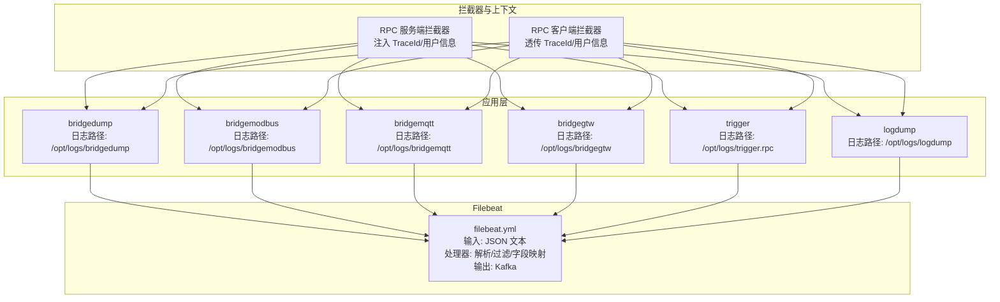
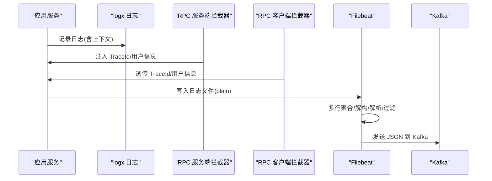
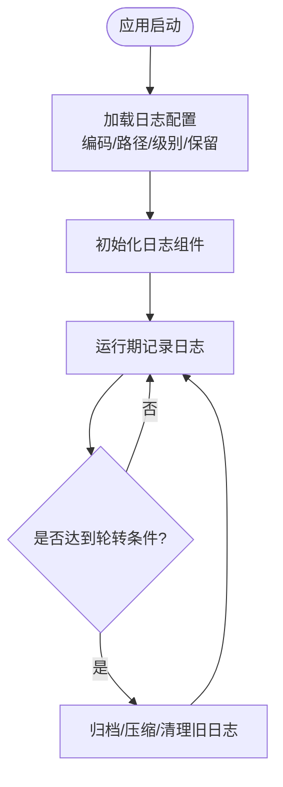
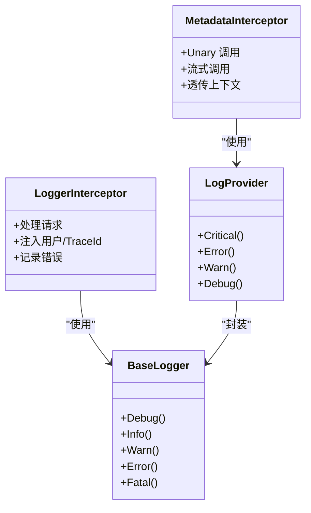
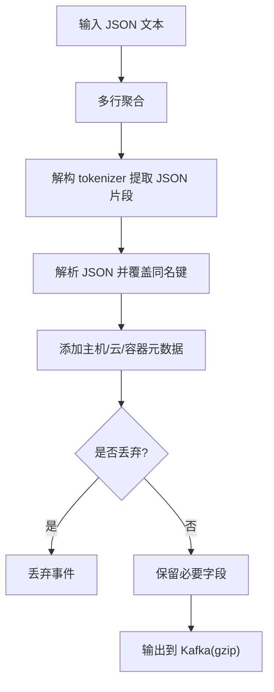
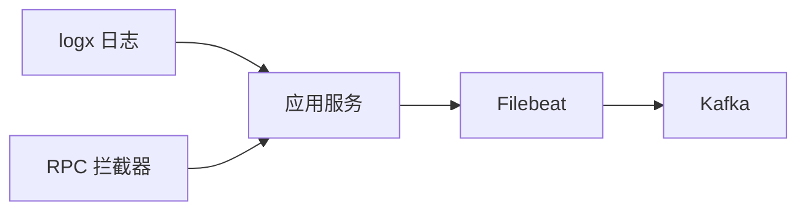

# 日志收集策略

<cite>
**本文引用的文件**
- [deploy/filebeat/conf/filebeat.yml](file://deploy/filebeat/conf/filebeat.yml)
- [common/Interceptor/rpcserver/loggerInterceptor.go](file://common/Interceptor/rpcserver/loggerInterceptor.go)
- [common/Interceptor/rpcclient/metadataInterceptor.go](file://common/Interceptor/rpcclient/metadataInterceptor.go)
- [common/asynqx/log.go](file://common/asynqx/log.go)
- [common/iec104/log.go](file://common/iec104/log.go)
- [app/logdump/etc/logdump.yaml](file://app/logdump/etc/logdump.yaml)
- [app/bridgedump/etc/bridgedump.yaml](file://app/bridgedump/etc/bridgedump.yaml)
- [app/bridgemodbus/etc/bridgemodbus.yaml](file://app/bridgemodbus/etc/bridgemodbus.yaml)
- [app/bridgemqtt/etc/bridgemqtt.yaml](file://app/bridgemqtt/etc/bridgemqtt.yaml)
- [app/bridgegtw/etc/bridgegtw.yaml](file://app/bridgegtw/etc/bridgegtw.yaml)
- [app/trigger/etc/trigger.yaml](file://app/trigger/etc/trigger.yaml)
- [util/dockeru/pod-log-app.sh](file://util/dockeru/pod-log-app.sh)
- [util/dockeru/pod-enter-app.sh](file://util/dockeru/pod-enter-app.sh)
</cite>

## 目录
1. [简介](#简介)
2. [项目结构](#项目结构)
3. [核心组件](#核心组件)
4. [架构总览](#架构总览)
5. [详细组件分析](#详细组件分析)
6. [依赖关系分析](#依赖关系分析)
7. [性能考量](#性能考量)
8. [故障排查指南](#故障排查指南)
9. [结论](#结论)
10. [附录](#附录)

## 简介
本策略文档面向 zero-service 的日志收集体系，覆盖应用日志、系统日志与审计日志三类场景，并给出基于现有配置的落地实施建议。重点包括：
- 应用日志：Go 应用日志输出格式、日志级别配置、结构化日志格式与上下文字段注入。
- 系统日志：Docker 容器日志、Kubernetes Pod 日志、操作系统与内核日志采集方法。
- 审计日志：用户操作日志、安全审计日志、API 调用日志的采集策略。
- 日志收集配置：Filebeat 配置、日志路径设置、过滤规则与 Kafka 传输。
- 最佳实践：日志轮转、压缩存储、传输加密与可观测性增强。

## 项目结构
围绕日志相关的关键位置如下：
- 应用日志配置：各服务的 YAML 配置中包含日志编码、路径、级别、保留天数等。
- 应用日志输出：统一使用 go-zero 的 logx，并通过拦截器注入 TraceId、用户信息等上下文。
- 结构化日志：部分模块提供自定义日志适配器，便于统一级别与输出。
- Filebeat 收集：集中采集桥接模块产生的 JSON 文本并投递至 Kafka。
- Kubernetes 日志：提供便捷脚本用于查看 Pod 日志与进入容器。

图表来源
- [deploy/filebeat/conf/filebeat.yml:4-122](file://deploy/filebeat/conf/filebeat.yml#L4-L122)
- [app/bridgedump/etc/bridgedump.yaml:1-10](file://app/bridgedump/etc/bridgedump.yaml#L1-L10)
- [app/bridgemodbus/etc/bridgemodbus.yaml:1-26](file://app/bridgemodbus/etc/bridgemodbus.yaml#L1-L26)
- [app/bridgemqtt/etc/bridgemqtt.yaml:1-48](file://app/bridgemqtt/etc/bridgemqtt.yaml#L1-L48)
- [app/bridgegtw/etc/bridgegtw.yaml:1-40](file://app/bridgegtw/etc/bridgegtw.yaml#L1-L40)
- [app/trigger/etc/trigger.yaml:1-37](file://app/trigger/etc/trigger.yaml#L1-L37)
- [app/logdump/etc/logdump.yaml:1-26](file://app/logdump/etc/logdump.yaml#L1-L26)
- [common/Interceptor/rpcserver/loggerInterceptor.go:12-44](file://common/Interceptor/rpcserver/loggerInterceptor.go#L12-L44)
- [common/Interceptor/rpcclient/metadataInterceptor.go:11-32](file://common/Interceptor/rpcclient/metadataInterceptor.go#L11-L32)

章节来源
- [deploy/filebeat/conf/filebeat.yml:1-122](file://deploy/filebeat/conf/filebeat.yml#L1-L122)
- [app/bridgedump/etc/bridgedump.yaml:1-10](file://app/bridgedump/etc/bridgedump.yaml#L1-L10)
- [app/bridgemodbus/etc/bridgemodbus.yaml:1-26](file://app/bridgemodbus/etc/bridgemodbus.yaml#L1-L26)
- [app/bridgemqtt/etc/bridgemqtt.yaml:1-48](file://app/bridgemqtt/etc/bridgemqtt.yaml#L1-L48)
- [app/bridgegtw/etc/bridgegtw.yaml:1-40](file://app/bridgegtw/etc/bridgegtw.yaml#L1-L40)
- [app/trigger/etc/trigger.yaml:1-37](file://app/trigger/etc/trigger.yaml#L1-L37)
- [app/logdump/etc/logdump.yaml:1-26](file://app/logdump/etc/logdump.yaml#L1-L26)
- [common/Interceptor/rpcserver/loggerInterceptor.go:1-45](file://common/Interceptor/rpcserver/loggerInterceptor.go#L1-L45)
- [common/Interceptor/rpcclient/metadataInterceptor.go:1-56](file://common/Interceptor/rpcclient/metadataInterceptor.go#L1-L56)

## 核心组件
- 应用日志配置
  - 各服务在配置文件中定义日志编码、输出路径、日志级别、保留天数等。例如：
    - bridgedump：日志路径 /opt/logs/bridgedump，级别 info。
    - bridgemodbus：日志路径 /opt/logs/bridgemodbus，级别 info，保留 300 天。
    - bridgemqtt：日志路径 /opt/logs/bridgemqtt，级别 info，保留 300 天。
    - bridgegtw：日志路径 /opt/logs/bridgegtw，级别 info，保留 30 天。
    - trigger：日志路径 /opt/logs/trigger.rpc，级别 info，保留 300 天。
    - logdump：日志路径 /opt/logs/logdump，级别 info，保留 300 天。
  - 编码统一为 plain（纯文本），便于后续由 Filebeat 进行结构化解析与过滤。

- 拦截器与上下文注入
  - 服务端拦截器：从 gRPC 元数据提取用户标识、授权信息、TraceId，并注入到请求上下文中，供日志记录时携带。
  - 客户端拦截器：在出站请求中将上述上下文信息透传到下游服务，确保跨服务链路可追踪。

- 结构化日志适配
  - asynqx 提供基础日志适配器，统一 Debug/Info/Warn/Error/Fatal 等级别输出。
  - iec104 提供日志提供器，基于 logx.WithContext 构建，支持 Critical/Error/Warn/Debug 等级别。

- Filebeat 收集与转发
  - 输入：监听桥接模块生成的 JSON 文本文件，按多行模式聚合，设置扫描频率、关闭不活跃文件时间、忽略过旧文件、清理非活动状态等。
  - 处理器：添加主机/云/容器元数据；丢弃解析失败或特定前缀的消息；使用解构 tokenizer 提取 JSON 片段；解析 JSON 并覆盖同名键；仅保留必要字段并丢弃中间字段。
  - 输出：发送到 Kafka，开启 gzip 压缩，设置消息大小上限与 ack 策略。

- Kubernetes 日志采集
  - 提供脚本列出并选择运行中的 Pod，支持实时查看日志与进入容器，便于运维排障。

章节来源
- [app/bridgedump/etc/bridgedump.yaml:1-10](file://app/bridgedump/etc/bridgedump.yaml#L1-L10)
- [app/bridgemodbus/etc/bridgemodbus.yaml:1-26](file://app/bridgemodbus/etc/bridgemodbus.yaml#L1-L26)
- [app/bridgemqtt/etc/bridgemqtt.yaml:1-48](file://app/bridgemqtt/etc/bridgemqtt.yaml#L1-L48)
- [app/bridgegtw/etc/bridgegtw.yaml:1-40](file://app/bridgegtw/etc/bridgegtw.yaml#L1-L40)
- [app/trigger/etc/trigger.yaml:1-37](file://app/trigger/etc/trigger.yaml#L1-L37)
- [app/logdump/etc/logdump.yaml:1-26](file://app/logdump/etc/logdump.yaml#L1-L26)
- [common/Interceptor/rpcserver/loggerInterceptor.go:12-44](file://common/Interceptor/rpcserver/loggerInterceptor.go#L12-L44)
- [common/Interceptor/rpcclient/metadataInterceptor.go:11-32](file://common/Interceptor/rpcclient/metadataInterceptor.go#L11-L32)
- [common/asynqx/log.go:1-37](file://common/asynqx/log.go#L1-L37)
- [common/iec104/log.go:1-49](file://common/iec104/log.go#L1-L49)
- [deploy/filebeat/conf/filebeat.yml:4-122](file://deploy/filebeat/conf/filebeat.yml#L4-L122)
- [util/dockeru/pod-log-app.sh:1-23](file://util/dockeru/pod-log-app.sh#L1-L23)
- [util/dockeru/pod-enter-app.sh:1-17](file://util/dockeru/pod-enter-app.sh#L1-L17)

## 架构总览
下图展示从应用到 Filebeat 再到 Kafka 的完整链路，以及拦截器如何在链路上注入上下文信息以支撑审计与追踪。

图表来源
- [common/Interceptor/rpcserver/loggerInterceptor.go:12-44](file://common/Interceptor/rpcserver/loggerInterceptor.go#L12-L44)
- [common/Interceptor/rpcclient/metadataInterceptor.go:11-32](file://common/Interceptor/rpcclient/metadataInterceptor.go#L11-L32)
- [deploy/filebeat/conf/filebeat.yml:85-119](file://deploy/filebeat/conf/filebeat.yml#L85-L119)

## 详细组件分析

### 应用日志输出与级别配置
- 日志编码：统一为 plain，便于后续结构化解析。
- 日志路径：各服务独立目录，便于分服务检索与轮转。
- 日志级别：默认 info，可在生产环境按需调整。
- 保留策略：不同服务保留天数不同，建议结合业务重要性与合规要求统一规划。

图表来源
- [app/bridgedump/etc/bridgedump.yaml:4-10](file://app/bridgedump/etc/bridgedump.yaml#L4-L10)
- [app/bridgemodbus/etc/bridgemodbus.yaml:5-10](file://app/bridgemodbus/etc/bridgemodbus.yaml#L5-L10)
- [app/bridgemqtt/etc/bridgemqtt.yaml:5-10](file://app/bridgemqtt/etc/bridgemqtt.yaml#L5-L10)
- [app/bridgegtw/etc/bridgegtw.yaml:5-10](file://app/bridgegtw/etc/bridgegtw.yaml#L5-L10)
- [app/trigger/etc/trigger.yaml:5-10](file://app/trigger/etc/trigger.yaml#L5-L10)
- [app/logdump/etc/logdump.yaml:7-12](file://app/logdump/etc/logdump.yaml#L7-L12)

章节来源
- [app/bridgedump/etc/bridgedump.yaml:1-10](file://app/bridgedump/etc/bridgedump.yaml#L1-L10)
- [app/bridgemodbus/etc/bridgemodbus.yaml:1-26](file://app/bridgemodbus/etc/bridgemodbus.yaml#L1-L26)
- [app/bridgemqtt/etc/bridgemqtt.yaml:1-48](file://app/bridgemqtt/etc/bridgemqtt.yaml#L1-L48)
- [app/bridgegtw/etc/bridgegtw.yaml:1-40](file://app/bridgegtw/etc/bridgegtw.yaml#L1-L40)
- [app/trigger/etc/trigger.yaml:1-37](file://app/trigger/etc/trigger.yaml#L1-L37)
- [app/logdump/etc/logdump.yaml:1-26](file://app/logdump/etc/logdump.yaml#L1-L26)

### 结构化日志格式与上下文注入
- 上下文字段：TraceId、用户标识、部门编码、授权信息等，通过拦截器在请求生命周期内注入与透传。
- 日志级别：统一使用 logx 的 Debug/Info/Warn/Error/Fatal，保证一致性。
- 日志提供器：iec104 与 asynqx 提供适配器，便于在不同模块中复用统一的日志接口。

图表来源
- [common/Interceptor/rpcserver/loggerInterceptor.go:12-44](file://common/Interceptor/rpcserver/loggerInterceptor.go#L12-L44)
- [common/Interceptor/rpcclient/metadataInterceptor.go:11-32](file://common/Interceptor/rpcclient/metadataInterceptor.go#L11-L32)
- [common/asynqx/log.go:1-37](file://common/asynqx/log.go#L1-L37)
- [common/iec104/log.go:1-49](file://common/iec104/log.go#L1-L49)

章节来源
- [common/Interceptor/rpcserver/loggerInterceptor.go:1-45](file://common/Interceptor/rpcserver/loggerInterceptor.go#L1-L45)
- [common/Interceptor/rpcclient/metadataInterceptor.go:1-56](file://common/Interceptor/rpcclient/metadataInterceptor.go#L1-L56)
- [common/asynqx/log.go:1-37](file://common/asynqx/log.go#L1-L37)
- [common/iec104/log.go:1-49](file://common/iec104/log.go#L1-L49)

### Filebeat 配置与过滤规则
- 输入：监听桥接模块输出的 JSON 文本文件，设置多行匹配模式、扫描频率、关闭不活跃文件、忽略过旧文件、清理非活动状态等。
- 处理器：添加主机/云/容器元数据；丢弃解析失败或特定前缀的消息；使用解构 tokenizer 提取 JSON 片段；解析 JSON 并覆盖同名键；仅保留必要字段并丢弃中间字段。
- 输出：发送到 Kafka，开启 gzip 压缩，设置消息大小上限与 ack 策略。

图表来源
- [deploy/filebeat/conf/filebeat.yml:4-122](file://deploy/filebeat/conf/filebeat.yml#L4-L122)

章节来源
- [deploy/filebeat/conf/filebeat.yml:1-122](file://deploy/filebeat/conf/filebeat.yml#L1-L122)

### 审计日志与 API 调用日志
- 审计维度：用户标识、部门编码、TraceId、授权信息、错误码等，均可通过拦截器注入并在日志中体现。
- API 调用：bridgegtw 将外部 HTTP 请求路由到内部 gRPC 服务，日志中应包含请求路径、RPC 方法、响应状态与耗时等关键信息。
- 日志保留：结合业务合规要求统一规划保留周期，避免过度占用存储。

章节来源
- [common/Interceptor/rpcserver/loggerInterceptor.go:12-44](file://common/Interceptor/rpcserver/loggerInterceptor.go#L12-L44)
- [common/Interceptor/rpcclient/metadataInterceptor.go:11-32](file://common/Interceptor/rpcclient/metadataInterceptor.go#L11-L32)
- [app/bridgegtw/etc/bridgegtw.yaml:1-40](file://app/bridgegtw/etc/bridgegtw.yaml#L1-L40)

### 系统日志与容器日志
- Docker/Kubernetes：通过脚本列出并选择运行中的 Pod，支持实时查看日志与进入容器，便于快速定位问题。
- 操作系统与内核：建议结合系统日志服务（如 journald/rsyslog）与 Filebeat 的系统输入模块进行统一采集。

章节来源
- [util/dockeru/pod-log-app.sh:1-23](file://util/dockeru/pod-log-app.sh#L1-L23)
- [util/dockeru/pod-enter-app.sh:1-17](file://util/dockeru/pod-enter-app.sh#L1-L17)

## 依赖关系分析
- 应用层依赖 go-zero 的 logx 进行日志输出，拦截器负责上下文注入与错误记录。
- Filebeat 依赖应用层的 plain 文本日志，通过处理器实现结构化与过滤。
- Kafka 作为统一传输通道，承载来自多个应用的日志数据。

图表来源
- [common/Interceptor/rpcserver/loggerInterceptor.go:12-44](file://common/Interceptor/rpcserver/loggerInterceptor.go#L12-L44)
- [common/Interceptor/rpcclient/metadataInterceptor.go:11-32](file://common/Interceptor/rpcclient/metadataInterceptor.go#L11-L32)
- [deploy/filebeat/conf/filebeat.yml:85-119](file://deploy/filebeat/conf/filebeat.yml#L85-L119)

章节来源
- [common/Interceptor/rpcserver/loggerInterceptor.go:1-45](file://common/Interceptor/rpcserver/loggerInterceptor.go#L1-L45)
- [common/Interceptor/rpcclient/metadataInterceptor.go:1-56](file://common/Interceptor/rpcclient/metadataInterceptor.go#L1-L56)
- [deploy/filebeat/conf/filebeat.yml:1-122](file://deploy/filebeat/conf/filebeat.yml#L1-L122)

## 性能考量
- Filebeat
  - 多行聚合与解构会增加 CPU 开销，建议根据实际日志体量调整扫描频率与关闭不活跃文件时间。
  - gzip 压缩提升带宽利用率，但会增加 CPU 压力，需在压缩比与性能间权衡。
- 应用日志
  - 建议在高并发场景下降低日志级别或采用采样策略，避免 IO 抖动。
  - 合理设置保留天数，避免磁盘空间被大量日志占满。
- 传输
  - Kafka 分区与 ack 策略影响吞吐与可靠性，建议结合业务 SLA 调优。

## 故障排查指南
- Filebeat 无法解析 JSON
  - 检查 tokenizer 与 JSON 字段映射是否正确，确认消息头尾标记与多行匹配模式一致。
  - 关注解析失败字段与丢弃规则，必要时临时放宽过滤以便定位问题。
- 日志缺失或延迟
  - 检查扫描频率、关闭不活跃文件时间与忽略过旧文件设置，确保不会过早关闭或忽略目标文件。
  - 核对 Kafka 连接与主题权限，确认输出配置生效。
- 容器日志查看
  - 使用提供的脚本列出并选择 Pod，实时查看最近日志，必要时进入容器排查进程状态与文件权限。

章节来源
- [deploy/filebeat/conf/filebeat.yml:85-119](file://deploy/filebeat/conf/filebeat.yml#L85-L119)
- [util/dockeru/pod-log-app.sh:1-23](file://util/dockeru/pod-log-app.sh#L1-L23)

## 结论
本策略文档基于现有配置与代码实现，给出了应用日志、系统日志与审计日志的收集方案，并明确了 Filebeat 的配置要点与最佳实践建议。建议在生产环境中进一步完善：
- 统一日志级别与保留策略；
- 强化传输加密与访问控制；
- 增强结构化字段与标签体系；
- 结合监控告警完善日志可观测性。

## 附录
- 配置项速览
  - 日志编码：plain
  - 日志路径：各服务独立目录
  - 日志级别：info（可按需调整）
  - 保留天数：不同服务差异较大
  - Filebeat 多行匹配、解构、过滤与 Kafka 输出已配置

章节来源
- [app/bridgedump/etc/bridgedump.yaml:4-10](file://app/bridgedump/etc/bridgedump.yaml#L4-L10)
- [app/bridgemodbus/etc/bridgemodbus.yaml:5-10](file://app/bridgemodbus/etc/bridgemodbus.yaml#L5-L10)
- [app/bridgemqtt/etc/bridgemqtt.yaml:5-10](file://app/bridgemqtt/etc/bridgemqtt.yaml#L5-L10)
- [app/bridgegtw/etc/bridgegtw.yaml:5-10](file://app/bridgegtw/etc/bridgegtw.yaml#L5-L10)
- [app/trigger/etc/trigger.yaml:5-10](file://app/trigger/etc/trigger.yaml#L5-L10)
- [app/logdump/etc/logdump.yaml:7-12](file://app/logdump/etc/logdump.yaml#L7-L12)
- [deploy/filebeat/conf/filebeat.yml:4-122](file://deploy/filebeat/conf/filebeat.yml#L4-L122)