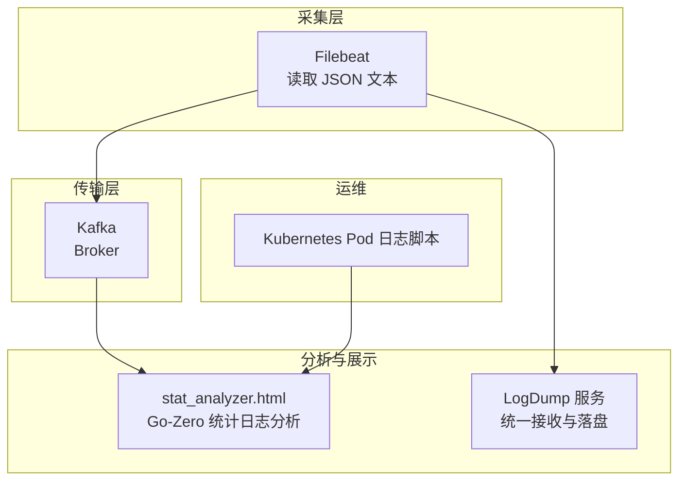
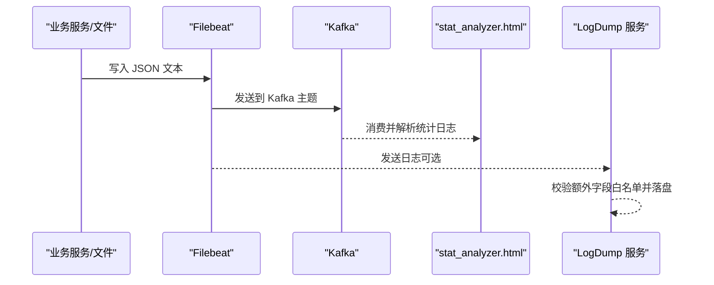
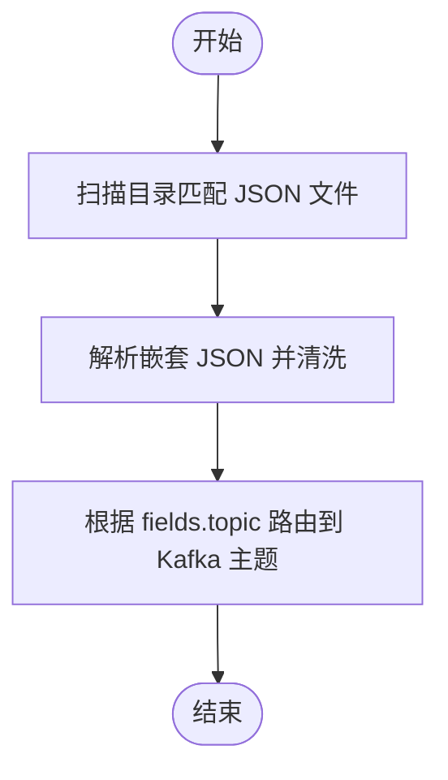
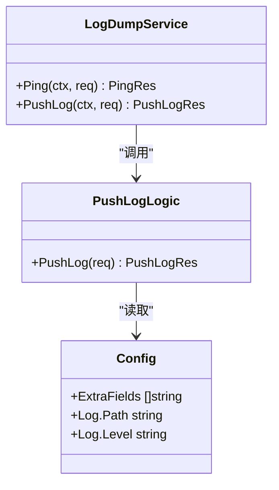
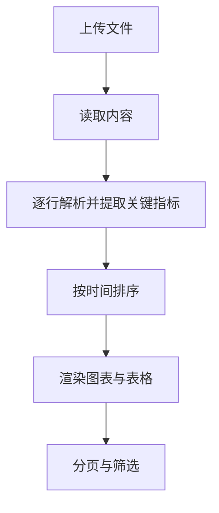
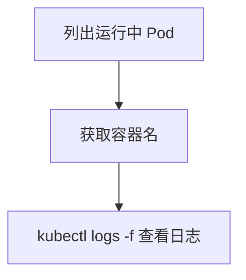
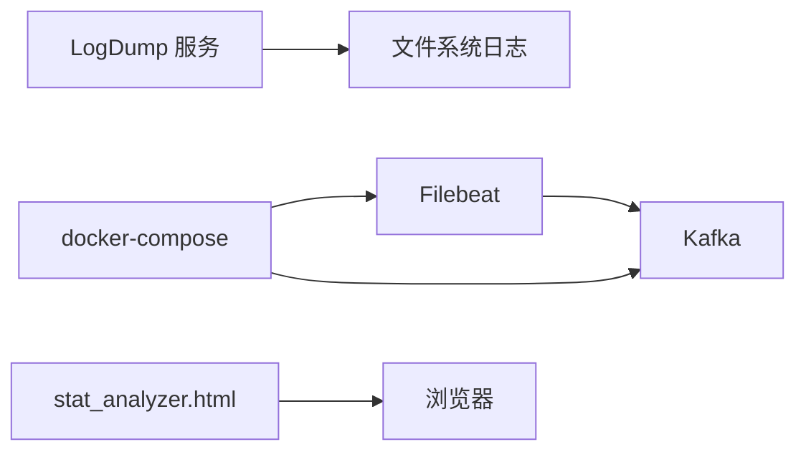

# 日志管理与分析

<cite>
**本文引用的文件**
- [deploy/filebeat/conf/filebeat.yml](file://deploy/filebeat/conf/filebeat.yml)
- [deploy/docker-compose.yml](file://deploy/docker-compose.yml)
- [app/logdump/etc/logdump.yaml](file://app/logdump/etc/logdump.yaml)
- [app/logdump/logdump.proto](file://app/logdump/logdump.proto)
- [app/logdump/logdump/logdump_grpc.pb.go](file://app/logdump/logdump/logdump_grpc.pb.go)
- [app/logdump/logdump/logdump.pb.go](file://app/logdump/logdump/logdump.pb.go)
- [app/logdump/internal/logic/pushloglogic.go](file://app/logdump/internal/logic/pushloglogic.go)
- [common/Interceptor/rpcserver/loggerInterceptor.go](file://common/Interceptor/rpcserver/loggerInterceptor.go)
- [common/ctxdata/ctxData.go](file://common/ctxdata/ctxData.go)
- [util/dockeru/pod-log-app.sh](file://util/dockeru/pod-log-app.sh)
- [deploy/stat_analyzer.html](file://deploy/stat_analyzer.html)
- [app/bridgedump/etc/bridgedump.yaml](file://app/bridgedump/etc/bridgedump.yaml)
</cite>

## 目录
1. [简介](#简介)
2. [项目结构](#项目结构)
3. [核心组件](#核心组件)
4. [架构总览](#架构总览)
5. [详细组件分析](#详细组件分析)
6. [依赖分析](#依赖分析)
7. [性能考虑](#性能考虑)
8. [故障排查指南](#故障排查指南)
9. [结论](#结论)
10. [附录](#附录)

## 简介
本指南面向 zero-service 项目的日志管理与分析，围绕以下目标展开：
- 日志收集策略：应用日志、系统日志、审计日志等多类型日志的采集与传输。
- 日志聚合与存储：基于 Kafka 的流式汇聚与后续分析链路。
- 日志搜索与分析：全文检索、正则表达式搜索、聚合分析等能力。
- 日志可视化展示：趋势图、统计报表、服务分布等可视化实现。
- 日志质量保证：日志格式标准化、敏感信息脱敏、日志轮转策略。
- 日志分析工具集成：内置分析脚本、机器学习分析、实时监控告警。

## 项目结构
与日志相关的关键位置与职责如下：
- 收集与传输
  - Filebeat：负责从桥接 dump 业务目录读取 JSON 文本并发送至 Kafka。
  - docker-compose：编排 Kafka、Filebeat、各业务服务容器。
- 聚合与存储
  - Kafka：作为消息总线，承载日志流。
- 分析与可视化
  - 内置 HTML 分析器：对 Go-Zero 统计类日志进行解析与可视化。
  - 日志服务：统一接收与落盘，便于审计与回溯。
- 运维与可观测性
  - Kubernetes 日志查看脚本：快速定位 Pod 日志。

**图表来源**
- [deploy/filebeat/conf/filebeat.yml:1-122](file://deploy/filebeat/conf/filebeat.yml#L1-L122)
- [deploy/docker-compose.yml:1-110](file://deploy/docker-compose.yml#L1-L110)
- [deploy/stat_analyzer.html:1-800](file://deploy/stat_analyzer.html#L1-L800)
- [app/logdump/etc/logdump.yaml:1-26](file://app/logdump/etc/logdump.yaml#L1-L26)
- [util/dockeru/pod-log-app.sh:1-23](file://util/dockeru/pod-log-app.sh#L1-L23)

**章节来源**
- [deploy/filebeat/conf/filebeat.yml:1-122](file://deploy/filebeat/conf/filebeat.yml#L1-L122)
- [deploy/docker-compose.yml:1-110](file://deploy/docker-compose.yml#L1-L110)

## 核心组件
- Filebeat：按目录扫描 JSON 文本，解析嵌套 JSON，输出到 Kafka。
- Kafka：持久化消息，供下游消费。
- LogDump 服务：接收日志推送，按配置落盘，支持额外字段白名单。
- Go-Zero 统计日志分析器：HTML 工具，解析并可视化 Go-Zero 统计日志。
- 运维脚本：Kubernetes 日志查看脚本，辅助定位问题。

**章节来源**
- [app/logdump/etc/logdump.yaml:1-26](file://app/logdump/etc/logdump.yaml#L1-L26)
- [app/logdump/logdump.proto:1-44](file://app/logdump/logdump.proto#L1-L44)
- [app/logdump/logdump/logdump_grpc.pb.go:39-161](file://app/logdump/logdump/logdump_grpc.pb.go#L39-L161)
- [app/logdump/logdump/logdump.pb.go:206-409](file://app/logdump/logdump/logdump.pb.go#L206-L409)
- [app/logdump/internal/logic/pushloglogic.go:1-68](file://app/logdump/internal/logic/pushloglogic.go#L1-L68)
- [deploy/stat_analyzer.html:1-800](file://deploy/stat_analyzer.html#L1-L800)
- [util/dockeru/pod-log-app.sh:1-23](file://util/dockeru/pod-log-app.sh#L1-L23)

## 架构总览
下图展示了从日志产生到可视化的完整链路：

**图表来源**
- [deploy/filebeat/conf/filebeat.yml:1-122](file://deploy/filebeat/conf/filebeat.yml#L1-L122)
- [deploy/docker-compose.yml:1-110](file://deploy/docker-compose.yml#L1-L110)
- [deploy/stat_analyzer.html:773-840](file://deploy/stat_analyzer.html#L773-L840)
- [app/logdump/etc/logdump.yaml:1-26](file://app/logdump/etc/logdump.yaml#L1-L26)
- [app/logdump/internal/logic/pushloglogic.go:28-67](file://app/logdump/internal/logic/pushloglogic.go#L28-L67)

## 详细组件分析

### Filebeat 日志收集
- 输入源：监听桥接 dump 业务目录下的 JSON 文本文件，按主题动态路由。
- 处理器：注入主机/容器元数据、丢弃解析失败与特定前缀行、拆解嵌套 JSON、仅保留必要字段。
- 输出：发送到 Kafka，按 topic 字段动态选择主题。

**图表来源**
- [deploy/filebeat/conf/filebeat.yml:4-72](file://deploy/filebeat/conf/filebeat.yml#L4-L72)
- [deploy/filebeat/conf/filebeat.yml:85-105](file://deploy/filebeat/conf/filebeat.yml#L85-L105)
- [deploy/filebeat/conf/filebeat.yml:110-118](file://deploy/filebeat/conf/filebeat.yml#L110-L118)

**章节来源**
- [deploy/filebeat/conf/filebeat.yml:1-122](file://deploy/filebeat/conf/filebeat.yml#L1-L122)

### LogDump 服务（统一日志接收与落盘）
- 协议：定义了 Ping 与 PushLog RPC 接口，支持日志级别与额外字段。
- 逻辑：校验额外字段白名单，拼装结构化日志消息，按级别输出到日志文件。
- 配置：日志编码、路径、级别、保留天数、额外字段白名单。

**图表来源**
- [app/logdump/logdump.proto:9-44](file://app/logdump/logdump.proto#L9-L44)
- [app/logdump/logdump/logdump_grpc.pb.go:63-71](file://app/logdump/logdump/logdump_grpc.pb.go#L63-L71)
- [app/logdump/logdump/logdump_grpc.pb.go:107-141](file://app/logdump/logdump/logdump_grpc.pb.go#L107-L141)
- [app/logdump/internal/logic/pushloglogic.go:13-67](file://app/logdump/internal/logic/pushloglogic.go#L13-L67)
- [app/logdump/etc/logdump.yaml:1-26](file://app/logdump/etc/logdump.yaml#L1-L26)

**章节来源**
- [app/logdump/logdump.proto:1-44](file://app/logdump/logdump.proto#L1-L44)
- [app/logdump/logdump/logdump_grpc.pb.go:39-161](file://app/logdump/logdump/logdump_grpc.pb.go#L39-L161)
- [app/logdump/logdump/logdump.pb.go:206-409](file://app/logdump/logdump/logdump.pb.go#L206-L409)
- [app/logdump/internal/logic/pushloglogic.go:1-68](file://app/logdump/internal/logic/pushloglogic.go#L1-L68)
- [app/logdump/etc/logdump.yaml:1-26](file://app/logdump/etc/logdump.yaml#L1-L26)

### Go-Zero 统计日志分析器
- 功能：拖拽上传或选择文件，解析统计日志，生成 QPS、内存、CPU、限流状态等图表。
- 流程：读取文件 -> 解析 -> 排序 -> 统计 -> 渲染图表与表格 -> 分页展示。

**图表来源**
- [deploy/stat_analyzer.html:773-840](file://deploy/stat_analyzer.html#L773-L840)
- [deploy/stat_analyzer.html:1010-1015](file://deploy/stat_analyzer.html#L1010-L1015)
- [deploy/stat_analyzer.html:248-486](file://deploy/stat_analyzer.html#L248-L486)

**章节来源**
- [deploy/stat_analyzer.html:1-800](file://deploy/stat_analyzer.html#L1-L800)

### 运维脚本（Kubernetes 日志查看）
- 功能：列出运行中的 Pod，选择后以尾随模式查看容器日志，便于快速定位问题。

**图表来源**
- [util/dockeru/pod-log-app.sh:5-23](file://util/dockeru/pod-log-app.sh#L5-L23)

**章节来源**
- [util/dockeru/pod-log-app.sh:1-23](file://util/dockeru/pod-log-app.sh#L1-L23)

## 依赖分析
- Filebeat 依赖 Kafka 输出插件；Kafka 依赖 docker-compose 环境变量与卷挂载。
- LogDump 服务依赖 go-zero 日志库与配置中心（如启用）。
- 统计分析器独立于后端，仅依赖浏览器与本地文件。

**图表来源**
- [deploy/docker-compose.yml:1-110](file://deploy/docker-compose.yml#L1-L110)
- [deploy/filebeat/conf/filebeat.yml:1-122](file://deploy/filebeat/conf/filebeat.yml#L1-L122)
- [app/logdump/etc/logdump.yaml:1-26](file://app/logdump/etc/logdump.yaml#L1-L26)

**章节来源**
- [deploy/docker-compose.yml:1-110](file://deploy/docker-compose.yml#L1-L110)

## 性能考虑
- Filebeat
  - 扫描频率与关闭策略：适当调整扫描周期与文件关闭时间，平衡延迟与资源消耗。
  - 多行合并：针对特定前缀进行多行合并，减少事件碎片化。
  - 输出压缩与分区：开启压缩与合理分区，提升吞吐。
- Kafka
  - 分区数量与副本：根据业务峰值与可用性要求设置分区与副本因子。
  - 消费位点：确保消费者组正确提交位点，避免重复消费。
- LogDump
  - 日志级别与路径：生产环境建议 info 级别与合适的保留天数，避免磁盘压力。
  - 白名单字段：严格限制额外字段，降低日志体积与解析成本。
- 统计分析器
  - 大文件分页与懒加载：避免一次性渲染过多数据导致卡顿。

[本节为通用指导，无需具体文件引用]

## 故障排查指南
- Filebeat 无法读取文件
  - 检查路径权限与挂载是否正确，确认容器内路径与宿主机一致。
  - 关注清洗规则，确认被丢弃的行是否影响预期数据。
- Kafka 无法连接或消息丢失
  - 校验 advertised.listeners 与容器网络映射，确认端口可达。
  - 检查分区与副本配置，确保消费者组位点正常提交。
- LogDump 服务异常
  - 检查日志路径是否存在且可写，确认额外字段白名单配置。
  - 关注 RPC 调用链路，结合中间件拦截器输出的错误信息定位。
- 统计分析器解析失败
  - 确认日志格式与时间戳格式，确保能被正则匹配。
  - 检查浏览器控制台错误与加载进度条，逐步定位问题。
- Kubernetes 日志查看
  - 使用脚本列出 Pod，确认选择的容器名与命名空间正确。

**章节来源**
- [deploy/filebeat/conf/filebeat.yml:1-122](file://deploy/filebeat/conf/filebeat.yml#L1-L122)
- [deploy/docker-compose.yml:1-110](file://deploy/docker-compose.yml#L1-L110)
- [app/logdump/etc/logdump.yaml:1-26](file://app/logdump/etc/logdump.yaml#L1-L26)
- [app/logdump/internal/logic/pushloglogic.go:1-68](file://app/logdump/internal/logic/pushloglogic.go#L1-L68)
- [deploy/stat_analyzer.html:773-840](file://deploy/stat_analyzer.html#L773-L840)
- [util/dockeru/pod-log-app.sh:1-23](file://util/dockeru/pod-log-app.sh#L1-L23)

## 结论
本指南基于 zero-service 现有组件，给出了从采集、传输、存储到分析与可视化的完整方案。通过 Filebeat/Kafka 的流式架构与 LogDump 的统一落盘，结合 Go-Zero 统计日志分析器与运维脚本，能够满足多类型日志的收集、聚合、分析与可视化需求。建议在生产环境中进一步完善日志质量控制与告警机制，并根据业务规模调整 Kafka 与 Filebeat 的参数以获得最佳性能。

[本节为总结，无需具体文件引用]

## 附录

### 日志收集策略清单
- 应用日志
  - 使用 Filebeat 监听业务目录 JSON 文本，清洗并输出到 Kafka。
  - 可选：通过 LogDump 服务统一接收并落盘，便于审计。
- 系统日志
  - 通过 Filebeat 收集容器日志目录，结合主机元数据增强可追溯性。
- 审计日志
  - 通过 LogDump 服务集中落盘，严格控制额外字段白名单，确保合规。

**章节来源**
- [deploy/filebeat/conf/filebeat.yml:1-122](file://deploy/filebeat/conf/filebeat.yml#L1-L122)
- [app/logdump/etc/logdump.yaml:1-26](file://app/logdump/etc/logdump.yaml#L1-L26)

### 日志聚合与存储
- Kafka 集群
  - 通过 docker-compose 启动，配置监听与广告地址，确保容器内外通信正常。
- 存储与保留
  - Filebeat 输出到 Kafka；LogDump 服务落盘到本地文件系统，配合保留天数策略。

**章节来源**
- [deploy/docker-compose.yml:1-110](file://deploy/docker-compose.yml#L1-L110)
- [app/logdump/etc/logdump.yaml:1-26](file://app/logdump/etc/logdump.yaml#L1-L26)

### 日志搜索与分析
- 全文检索
  - 在 Kafka 消费端可扩展使用搜索引擎（如 Elasticsearch/Lucene）进行全文检索。
- 正则表达式搜索
  - Filebeat 清洗阶段已包含基于前缀的过滤，可在消费端进一步扩展正则匹配。
- 聚合分析
  - 使用统计分析器对 Go-Zero 统计日志进行聚合与可视化。

**章节来源**
- [deploy/stat_analyzer.html:773-840](file://deploy/stat_analyzer.html#L773-L840)

### 日志可视化展示
- 图表与报表
  - QPS、内存、CPU、限流状态、服务分布等图表由分析器自动生成。
- 交互与筛选
  - 支持分页、筛选、全屏查看与图表缩放。

**章节来源**
- [deploy/stat_analyzer.html:248-486](file://deploy/stat_analyzer.html#L248-L486)

### 日志质量保证
- 格式标准化
  - Filebeat 清洗规则统一字段与层级，避免重复字段覆盖。
- 敏感信息脱敏
  - 通过额外字段白名单控制，避免敏感字段进入日志。
- 日志轮转策略
  - LogDump 服务配置保留天数，结合系统日志轮转工具保障磁盘空间。

**章节来源**
- [app/logdump/etc/logdump.yaml:1-26](file://app/logdump/etc/logdump.yaml#L1-L26)
- [app/logdump/internal/logic/pushloglogic.go:28-67](file://app/logdump/internal/logic/pushloglogic.go#L28-L67)

### 日志分析工具集成
- 分析脚本
  - 使用内置 HTML 分析器解析并可视化 Go-Zero 统计日志。
- 机器学习分析
  - 可在 Kafka 消费端接入 ML 模型，进行异常检测与趋势预测。
- 实时监控告警
  - 基于消费端指标（如延迟、堆积、错误率）建立告警规则。

**章节来源**
- [deploy/stat_analyzer.html:1-800](file://deploy/stat_analyzer.html#L1-L800)