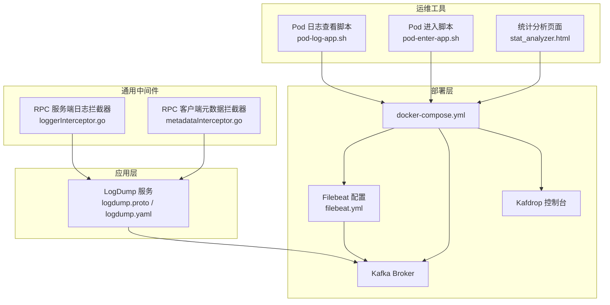
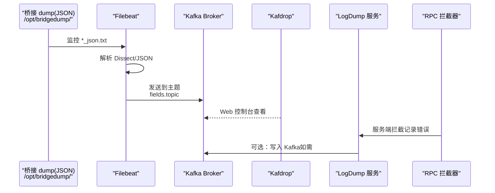
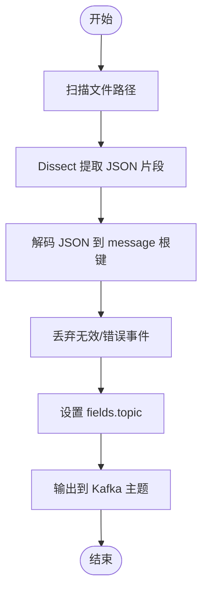
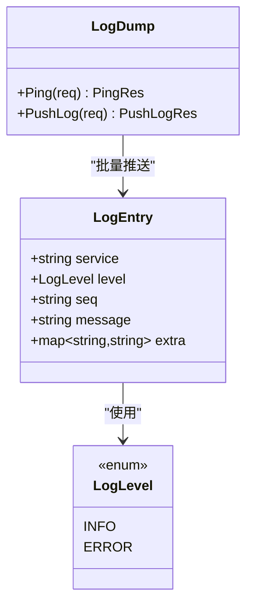
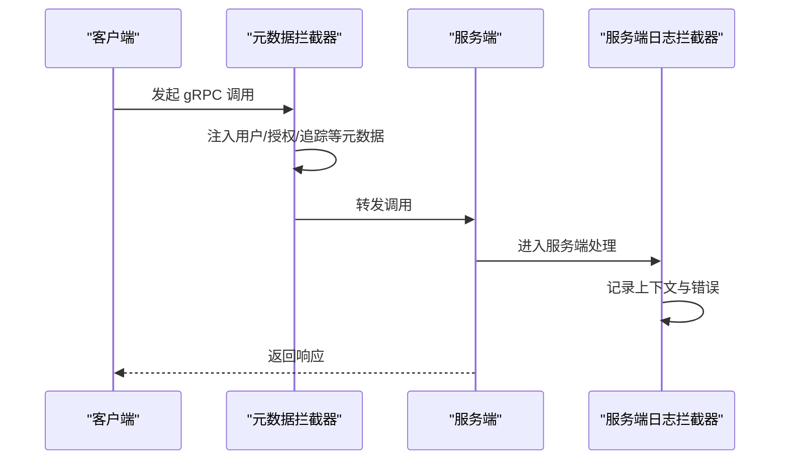
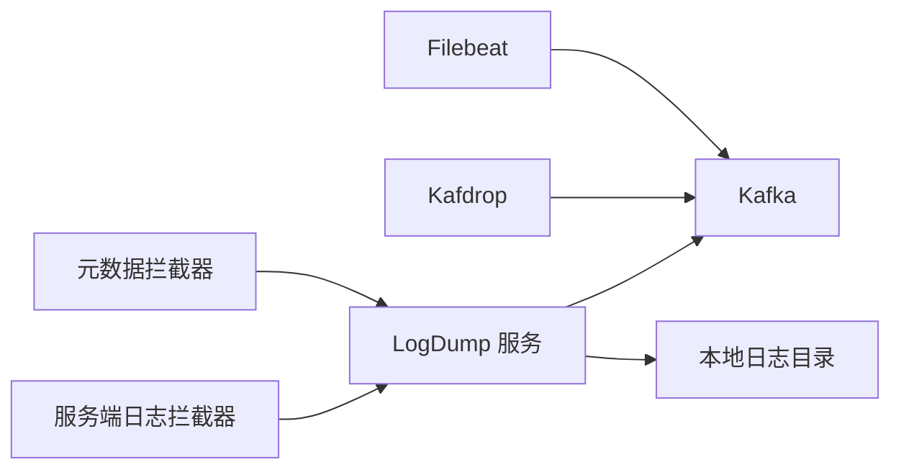

# 日志聚合与存储

<cite>
**本文引用的文件**   
- [docker-compose.yml](file://deploy/docker-compose.yml)
- [filebeat.yml](file://deploy/filebeat/conf/filebeat.yml)
- [logdump.yaml](file://app/logdump/etc/logdump.yaml)
- [logdump.proto](file://app/logdump/logdump.proto)
- [loggerInterceptor.go](file://common/Interceptor/rpcserver/loggerInterceptor.go)
- [metadataInterceptor.go](file://common/Interceptor/rpcclient/metadataInterceptor.go)
- [pod-log-app.sh](file://util/dockeru/pod-log-app.sh)
- [pod-enter-app.sh](file://util/dockeru/pod-enter-app.sh)
- [stat_analyzer.html](file://deploy/stat_analyzer.html)
</cite>

## 目录
1. [简介](#简介)
2. [项目结构](#项目结构)
3. [核心组件](#核心组件)
4. [架构总览](#架构总览)
5. [详细组件分析](#详细组件分析)
6. [依赖分析](#依赖分析)
7. [性能考虑](#性能考虑)
8. [故障排查指南](#故障排查指南)
9. [结论](#结论)
10. [附录](#附录)

## 简介
本文件面向 zero-service 的日志聚合与存储场景，结合仓库中已有的日志采集与传输链路，给出可落地的 ELK Stack 集成方案（Elasticsearch、Logstash、Kibana）、Loki 集成方案（Promtail、Grafana Loki 查询语法与标签管理），以及 Graylog 集成方案（Graylog 服务器、输入源与日志管道）。同时，围绕日志存储策略（保留策略、磁盘空间管理、冷热数据分离）与性能优化（批量处理、压缩算法、索引优化）提供实践建议。

## 项目结构
本项目在部署层提供了基于 Docker Compose 的基础编排，包含 Kafka、Filebeat、Kafdrop 等组件；在应用层提供了 LogDump 服务（gRPC）用于集中接收日志；在通用中间件层提供了 RPC 请求日志拦截器与元数据透传拦截器，便于统一注入上下文与追踪信息。

**图表来源**
- [docker-compose.yml:1-110](file://deploy/docker-compose.yml#L1-L110)
- [filebeat.yml:1-122](file://deploy/filebeat/conf/filebeat.yml#L1-L122)
- [logdump.yaml:1-26](file://app/logdump/etc/logdump.yaml#L1-L26)
- [logdump.proto:1-44](file://app/logdump/logdump.proto#L1-L44)
- [loggerInterceptor.go:1-45](file://common/Interceptor/rpcserver/loggerInterceptor.go#L1-L45)
- [metadataInterceptor.go:1-56](file://common/Interceptor/rpcclient/metadataInterceptor.go#L1-L56)
- [pod-log-app.sh:1-23](file://util/dockeru/pod-log-app.sh#L1-L23)
- [pod-enter-app.sh:1-17](file://util/dockeru/pod-enter-app.sh#L1-L17)
- [stat_analyzer.html:1006-1036](file://deploy/stat_analyzer.html#L1006-L1036)

**章节来源**
- [docker-compose.yml:1-110](file://deploy/docker-compose.yml#L1-L110)
- [filebeat.yml:1-122](file://deploy/filebeat/conf/filebeat.yml#L1-L122)
- [logdump.yaml:1-26](file://app/logdump/etc/logdump.yaml#L1-L26)
- [logdump.proto:1-44](file://app/logdump/logdump.proto#L1-L44)
- [loggerInterceptor.go:1-45](file://common/Interceptor/rpcserver/loggerInterceptor.go#L1-L45)
- [metadataInterceptor.go:1-56](file://common/Interceptor/rpcclient/metadataInterceptor.go#L1-L56)
- [pod-log-app.sh:1-23](file://util/dockeru/pod-log-app.sh#L1-L23)
- [pod-enter-app.sh:1-17](file://util/dockeru/pod-enter-app.sh#L1-L17)
- [stat_analyzer.html:1006-1036](file://deploy/stat_analyzer.html#L1006-L1036)

## 核心组件
- 日志采集与传输
  - Filebeat：从桥接 dump 产生的 JSON 文本文件采集，按主题动态路由至 Kafka。
  - Kafka：作为消息总线承载日志流。
  - Kafdrop：Kafka Web 控制台，便于查看主题与消费情况。
- 日志接收与存储
  - LogDump 服务：提供 gRPC 接口 PushLog，接收结构化日志条目，支持额外字段扩展。
  - 应用日志落盘：LogDump 服务配置了本地日志路径与保留天数。
- 运维与可观测性
  - RPC 日志拦截器：在服务端统一记录请求错误与上下文信息。
  - 元数据拦截器：在客户端透传用户、部门、授权、追踪 ID 等头信息。
  - Pod 日志查看/进入脚本：辅助定位容器内日志与问题排查。
  - 统计分析页面：对日志进行前端解析与统计展示。

**章节来源**
- [filebeat.yml:1-122](file://deploy/filebeat/conf/filebeat.yml#L1-L122)
- [docker-compose.yml:1-110](file://deploy/docker-compose.yml#L1-L110)
- [logdump.yaml:1-26](file://app/logdump/etc/logdump.yaml#L1-L26)
- [logdump.proto:1-44](file://app/logdump/logdump.proto#L1-L44)
- [loggerInterceptor.go:1-45](file://common/Interceptor/rpcserver/loggerInterceptor.go#L1-L45)
- [metadataInterceptor.go:1-56](file://common/Interceptor/rpcclient/metadataInterceptor.go#L1-L56)
- [pod-log-app.sh:1-23](file://util/dockeru/pod-log-app.sh#L1-L23)
- [pod-enter-app.sh:1-17](file://util/dockeru/pod-enter-app.sh#L1-L17)
- [stat_analyzer.html:1006-1036](file://deploy/stat_analyzer.html#L1006-L1036)

## 架构总览
下图展示了零信任日志从采集到传输的关键路径，以及与 Kafka 的集成方式。Filebeat 从桥接 dump 的 JSON 文本目录读取日志，经由 Dissect/JSON 解析后，按 fields.topic 写入对应 Kafka 主题；LogDump 服务同样通过 gRPC 接收日志，可作为补充通道或内部服务间日志汇聚点。

**图表来源**
- [filebeat.yml:1-122](file://deploy/filebeat/conf/filebeat.yml#L1-L122)
- [docker-compose.yml:1-110](file://deploy/docker-compose.yml#L1-L110)
- [logdump.yaml:1-26](file://app/logdump/etc/logdump.yaml#L1-L26)
- [logdump.proto:1-44](file://app/logdump/logdump.proto#L1-L44)
- [loggerInterceptor.go:1-45](file://common/Interceptor/rpcserver/loggerInterceptor.go#L1-L45)

## 详细组件分析

### Filebeat 日志采集与 Kafka 传输
- 输入源
  - 监控多个桥接 dump 的 JSON 文本目录，按多行模式匹配与关闭策略控制采集节奏。
- 处理器
  - 增加宿主机/云/容器元数据；丢弃解析失败或特定前缀的消息；使用 Dissect 提取 JSON 片段并解码为根级字段；仅保留必要字段并剔除中间字段。
- 输出
  - 输出到 Kafka，按 fields.topic 动态路由；启用 gzip 压缩，设置最大消息大小与 ack 策略。

**图表来源**
- [filebeat.yml:1-122](file://deploy/filebeat/conf/filebeat.yml#L1-L122)

**章节来源**
- [filebeat.yml:1-122](file://deploy/filebeat/conf/filebeat.yml#L1-L122)

### LogDump 服务（gRPC）
- 服务接口
  - Ping/PushLog：用于健康检查与批量推送日志条目。
- 数据模型
  - 日志条目包含服务名、级别、序列号、消息体与可选附加字段映射。
- 配置要点
  - 日志编码、路径、级别、保留天数；可扩展额外字段以满足查询与聚合需求。

**图表来源**
- [logdump.proto:1-44](file://app/logdump/logdump.proto#L1-L44)
- [logdump.yaml:1-26](file://app/logdump/etc/logdump.yaml#L1-L26)

**章节来源**
- [logdump.proto:1-44](file://app/logdump/logdump.proto#L1-L44)
- [logdump.yaml:1-26](file://app/logdump/etc/logdump.yaml#L1-L26)

### RPC 日志拦截器与元数据透传
- 服务端拦截器
  - 从 gRPC 元数据读取用户、部门、授权、追踪 ID 等信息注入上下文；异常时统一记录错误日志。
- 客户端拦截器
  - 在出站调用时将上述上下文信息写入 gRPC 元数据，便于下游服务复用。

**图表来源**
- [metadataInterceptor.go:1-56](file://common/Interceptor/rpcclient/metadataInterceptor.go#L1-L56)
- [loggerInterceptor.go:1-45](file://common/Interceptor/rpcserver/loggerInterceptor.go#L1-L45)

**章节来源**
- [metadataInterceptor.go:1-56](file://common/Interceptor/rpcclient/metadataInterceptor.go#L1-L56)
- [loggerInterceptor.go:1-45](file://common/Interceptor/rpcserver/loggerInterceptor.go#L1-L45)

### 运维与调试脚本
- Pod 日志查看脚本：列出命名空间内运行中的 Pod，交互式选择后以尾随方式查看日志。
- Pod 进入脚本：交互式选择 Pod 并进入容器 Bash。
- 统计分析页面：对日志进行前端解析、排序与统计展示，辅助快速定位问题。

**章节来源**
- [pod-log-app.sh:1-23](file://util/dockeru/pod-log-app.sh#L1-L23)
- [pod-enter-app.sh:1-17](file://util/dockeru/pod-enter-app.sh#L1-L17)
- [stat_analyzer.html:1006-1036](file://deploy/stat_analyzer.html#L1006-L1036)

## 依赖分析
- Filebeat 依赖 Kafka 集群；Kafdrop 依赖 Kafka Broker 以提供 Web 查看能力。
- LogDump 服务可直接写入 Kafka，也可作为内部日志汇聚点；其配置包含本地日志落盘路径与保留策略。
- RPC 拦截器贯穿客户端与服务端，形成统一的上下文与日志入口。

**图表来源**
- [docker-compose.yml:1-110](file://deploy/docker-compose.yml#L1-L110)
- [logdump.yaml:1-26](file://app/logdump/etc/logdump.yaml#L1-L26)
- [metadataInterceptor.go:1-56](file://common/Interceptor/rpcclient/metadataInterceptor.go#L1-L56)
- [loggerInterceptor.go:1-45](file://common/Interceptor/rpcserver/loggerInterceptor.go#L1-L45)

**章节来源**
- [docker-compose.yml:1-110](file://deploy/docker-compose.yml#L1-L110)
- [logdump.yaml:1-26](file://app/logdump/etc/logdump.yaml#L1-L26)
- [metadataInterceptor.go:1-56](file://common/Interceptor/rpcclient/metadataInterceptor.go#L1-L56)
- [loggerInterceptor.go:1-45](file://common/Interceptor/rpcserver/loggerInterceptor.go#L1-L45)

## 性能考虑
- 批量处理
  - Filebeat 已通过 Dissect/JSON 解析减少后续处理开销；建议在上游服务中合并小日志为批次再写入 JSON 文件，降低 Filebeat 扫描与解析压力。
- 压缩算法
  - Filebeat 输出已启用 gzip 压缩；建议根据网络带宽与 CPU 负载权衡压缩级别；对于高吞吐场景可评估开启 Kafka 层面的压缩。
- 索引优化
  - 若接入 Elasticsearch，建议按日期滚动索引、设置合理的分片副本数、禁用不必要的字段映射、使用只读模板与别名切换实现平滑滚动更新。
- 缓存与去重
  - 对高频重复日志可采用客户端去重或限流策略，避免 Kafka 拥堵与下游处理压力。
- 存储与保留
  - 结合 LogDump 本地日志保留天数与 Kafka 消费位点，制定统一的生命周期策略；对历史数据进行归档或删除，释放磁盘空间。

[本节为通用性能建议，不直接分析具体文件，故无“章节来源”]

## 故障排查指南
- Filebeat 无法读取 JSON 文件
  - 检查 paths 指向是否正确、权限是否允许、文件是否被频繁重命名导致 inode 变更；适当调整 close_inactive 与 ignore_older。
- 解析失败或字段缺失
  - 关注 processors 中的 drop_event 条件与 dissect tokenizer；确保 JSON 片段格式稳定。
- Kafka 连接与主题
  - 使用 Kafdrop 检查 Broker 地址、主题是否存在、消费者组偏移；确认 hosts 与 advertised listeners 配置一致。
- LogDump 服务日志
  - 查看本地日志目录与保留天数配置；结合服务端日志拦截器定位异常请求。
- Pod 日志与环境
  - 使用 pod-log-app.sh 快速定位最近日志；必要时使用 pod-enter-app.sh 进入容器排查。

**章节来源**
- [filebeat.yml:1-122](file://deploy/filebeat/conf/filebeat.yml#L1-L122)
- [docker-compose.yml:1-110](file://deploy/docker-compose.yml#L1-L110)
- [logdump.yaml:1-26](file://app/logdump/etc/logdump.yaml#L1-L26)
- [loggerInterceptor.go:1-45](file://common/Interceptor/rpcserver/loggerInterceptor.go#L1-L45)
- [pod-log-app.sh:1-23](file://util/dockeru/pod-log-app.sh#L1-L23)
- [pod-enter-app.sh:1-17](file://util/dockeru/pod-enter-app.sh#L1-L17)

## 结论
本项目已具备从桥接 dump 采集 JSON 日志并通过 Filebeat 发送到 Kafka 的完整链路，同时提供 LogDump 服务与 RPC 拦截器支撑统一日志汇聚与上下文追踪。在此基础上，可按本文提供的 ELK、Loki、Graylog 方案进一步完善可视化与查询能力，并结合保留策略与性能优化措施，构建稳定高效的日志聚合与存储体系。

[本节为总结性内容，不直接分析具体文件，故无“章节来源”]

## 附录

### ELK Stack 集成方案（概念性说明）
- Elasticsearch 集群配置
  - 角色分离：master（协调与元数据）、data（存储与查询）、ingest（预处理）、coordinating（路由与聚合）。
  - 分片副本：按容量与并发查询需求规划；启用副本提升可用性。
  - 索引模板：定义字段映射、日期字段、禁用复制域等。
- Logstash 数据处理
  - 输入：从 Kafka 读取日志；输出：写入 Elasticsearch。
  - 过滤：正则提取、条件分支、字段重命名、嵌套展开。
- Kibana 可视化界面
  - 创建仪表板：时间序列、日志表、分布图；设置默认时间范围与刷新周期。
  - Discover：基于 DSL 查询与字段筛选；保存常用视图与搜索。

[本节为概念性说明，不直接分析具体文件，故无“章节来源”]

### Loki 集成方案（概念性说明）
- Promtail 日志收集器
  - 配置文件：指定日志路径、目标、正则抽取、标签注入。
  - 标签管理：将服务名、版本、实例等作为标签，提升查询效率。
- Grafana Loki 查询语法
  - 支持正则、逻辑运算符、时间范围；结合 Promtail 标签进行精确过滤。
- 日志存储策略
  - 与 Loki 同步的保留策略：短期热数据驻留内存/SSD，长期冷数据迁移至 HDD/对象存储。

[本节为概念性说明，不直接分析具体文件，故无“章节来源”]

### Graylog 日志聚合（概念性说明）
- Graylog 服务器部署
  - 配置 EPEL、Java、MongoDB、Elasticsearch；初始化 Graylog。
- 输入源配置
  - GELF UDP/TCP：应用侧以 GELF 格式发送；Syslog：标准协议；File/Directory：文件直采。
- 日志管道处理
  - Pipeline：解析、过滤、重写字段、添加标签；Stream：按规则转发到不同输出（ES、邮件、Webhook）。

[本节为概念性说明，不直接分析具体文件，故无“章节来源”]

### 日志存储策略（概念性说明）
- 日志保留策略
  - 按业务重要性与合规要求设定保留期；定期清理过期数据。
- 磁盘空间管理
  - 监控磁盘使用率，设置阈值告警；自动清理或归档。
- 冷热数据分离
  - 热数据：高频访问，SSD；冷数据：低频访问，HDD/对象存储；跨层迁移策略。

[本节为概念性说明，不直接分析具体文件，故无“章节来源”]