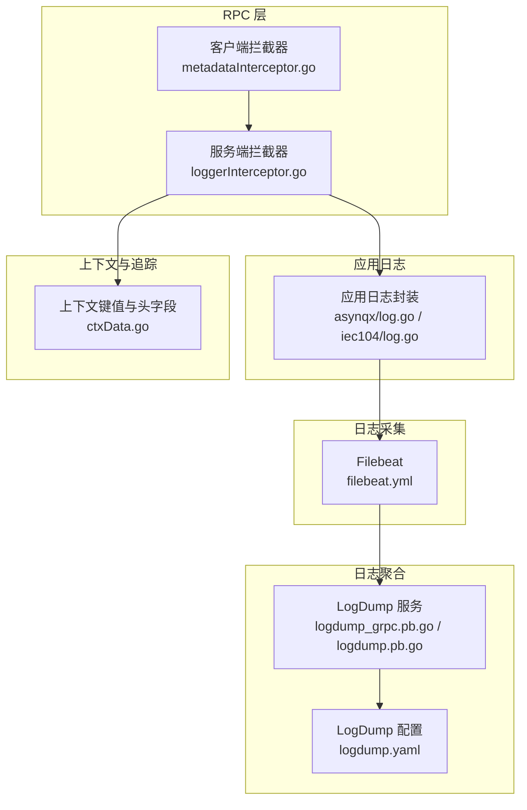
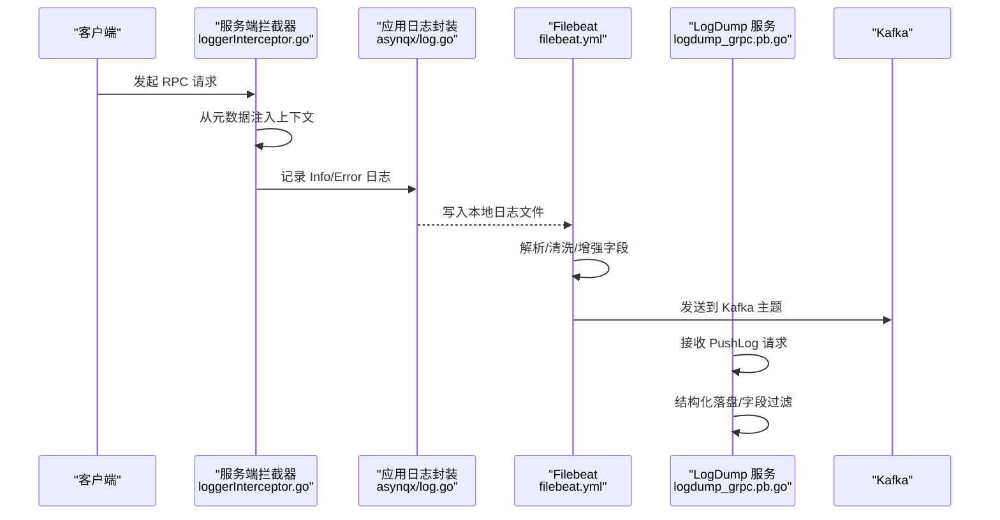
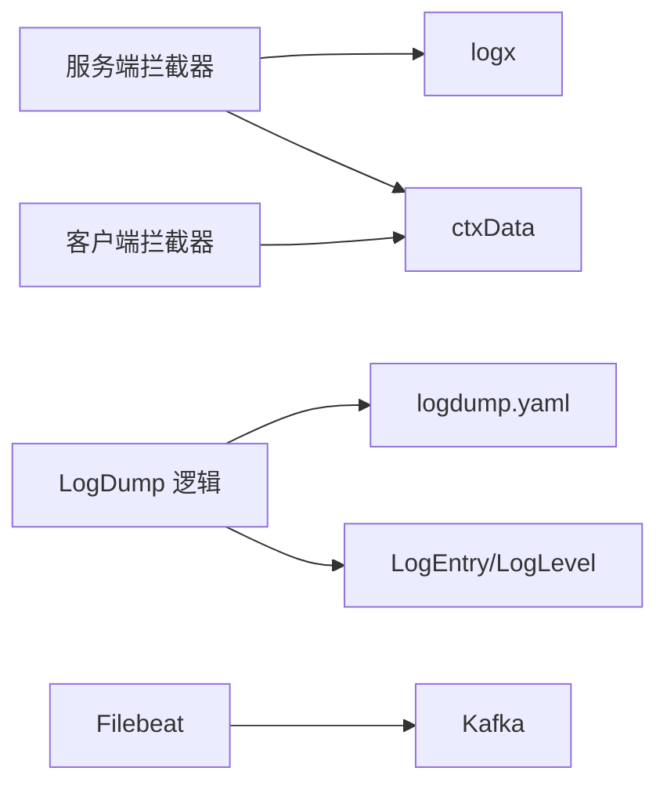

# 日志质量保证

<cite>
**本文引用的文件**
- [loggerInterceptor.go](file://common/Interceptor/rpcserver/loggerInterceptor.go)
- [metadataInterceptor.go](file://common/Interceptor/rpcclient/metadataInterceptor.go)
- [log.go](file://common/asynqx/log.go)
- [log.go](file://common/iec104/log.go)
- [logdump.yaml](file://app/logdump/etc/logdump.yaml)
- [logdump.proto](file://app/logdump/logdump/logdump.pb.go)
- [logdump_grpc.pb.go](file://app/logdump/logdump/logdump_grpc.pb.go)
- [pushloglogic.go](file://app/logdump/internal/logic/pushloglogic.go)
- [pinglogic.go](file://app/logdump/internal/logic/pinglogic.go)
- [filebeat.yml](file://deploy/filebeat/conf/filebeat.yml)
- [ctxData.go](file://common/ctxdata/ctxData.go)
</cite>

## 目录
1. [引言](#引言)
2. [项目结构](#项目结构)
3. [核心组件](#核心组件)
4. [架构总览](#架构总览)
5. [详细组件分析](#详细组件分析)
6. [依赖分析](#依赖分析)
7. [性能考虑](#性能考虑)
8. [故障排查指南](#故障排查指南)
9. [结论](#结论)
10. [附录](#附录)

## 引言
本指南面向 zero-service 的日志质量保证，围绕以下目标展开：统一日志格式与字段规范、敏感信息脱敏策略、日志轮转与归档、日志完整性保障、以及日志质量监控。文档结合仓库中现有的日志采集、传输与存储配置，给出可落地的实践建议与最佳实践。

## 项目结构
与日志质量相关的关键位置如下：
- RPC 日志拦截与上下文透传：rpcserver 与 rpcclient 的拦截器
- 日志输出封装：异步队列与 IEC104 子系统的日志适配
- 日志收集与转发：Filebeat 配置
- 日志聚合服务：LogDump gRPC 服务及其配置
- 上下文与追踪字段：用于日志关联与去敏

图表来源
- [loggerInterceptor.go:12-44](file://common/Interceptor/rpcserver/loggerInterceptor.go#L12-L44)
- [metadataInterceptor.go:11-32](file://common/Interceptor/rpcclient/metadataInterceptor.go#L11-L32)
- [log.go:12-29](file://common/asynqx/log.go#L12-L29)
- [log.go:18-48](file://common/iec104/log.go#L18-L48)
- [filebeat.yml:1-122](file://deploy/filebeat/conf/filebeat.yml#L1-L122)
- [logdump_grpc.pb.go:107-161](file://app/logdump/logdump/logdump_grpc.pb.go#L107-L161)
- [logdump.pb.go:24-62](file://app/logdump/logdump/logdump.pb.go#L24-L62)
- [logdump.yaml:1-26](file://app/logdump/etc/logdump.yaml#L1-L26)
- [ctxData.go:9-24](file://common/ctxdata/ctxData.go#L9-L24)

章节来源
- [loggerInterceptor.go:12-44](file://common/Interceptor/rpcserver/loggerInterceptor.go#L12-L44)
- [metadataInterceptor.go:11-32](file://common/Interceptor/rpcclient/metadataInterceptor.go#L11-L32)
- [log.go:12-29](file://common/asynqx/log.go#L12-L29)
- [log.go:18-48](file://common/iec104/log.go#L18-L48)
- [filebeat.yml:1-122](file://deploy/filebeat/conf/filebeat.yml#L1-L122)
- [logdump_grpc.pb.go:107-161](file://app/logdump/logdump/logdump_grpc.pb.go#L107-L161)
- [logdump.pb.go:24-62](file://app/logdump/logdump/logdump.pb.go#L24-L62)
- [logdump.yaml:1-26](file://app/logdump/etc/logdump.yaml#L1-L26)
- [ctxData.go:9-24](file://common/ctxdata/ctxData.go#L9-L24)

## 核心组件
- RPC 日志拦截器：在服务端捕获错误并输出结构化日志，同时从请求元数据注入用户与追踪上下文，便于跨服务关联
- RPC 元数据拦截器：在客户端将上下文中的用户、授权、追踪 ID 注入到 gRPC 头部，确保链路可追踪
- 应用日志封装：统一使用 go-zero 的 logx，并提供轻量封装以适配不同子系统
- Filebeat：负责从本地日志文件采集、解析、清洗并投递到 Kafka
- LogDump 服务：接收外部推送的日志条目，进行结构化落盘与字段过滤
- 上下文与追踪键：统一的键名与头部字段，保证日志可关联与可去敏

章节来源
- [loggerInterceptor.go:12-44](file://common/Interceptor/rpcserver/loggerInterceptor.go#L12-L44)
- [metadataInterceptor.go:11-32](file://common/Interceptor/rpcclient/metadataInterceptor.go#L11-L32)
- [log.go:12-29](file://common/asynqx/log.go#L12-L29)
- [log.go:18-48](file://common/iec104/log.go#L18-L48)
- [filebeat.yml:1-122](file://deploy/filebeat/conf/filebeat.yml#L1-L122)
- [logdump_grpc.pb.go:107-161](file://app/logdump/logdump/logdump_grpc.pb.go#L107-L161)
- [logdump.pb.go:24-62](file://app/logdump/logdump/logdump.pb.go#L24-L62)
- [logdump.yaml:1-26](file://app/logdump/etc/logdump.yaml#L1-L26)
- [ctxData.go:9-24](file://common/ctxdata/ctxData.go#L9-L24)

## 架构总览
下图展示从应用到采集再到聚合的整体流程，以及关键的去敏与完整性控制点。

图表来源
- [loggerInterceptor.go:12-44](file://common/Interceptor/rpcserver/loggerInterceptor.go#L12-L44)
- [log.go:12-29](file://common/asynqx/log.go#L12-L29)
- [filebeat.yml:85-119](file://deploy/filebeat/conf/filebeat.yml#L85-L119)
- [logdump_grpc.pb.go:125-141](file://app/logdump/logdump/logdump_grpc.pb.go#L125-L141)

## 详细组件分析

### 日志格式标准化
- 统一字段建议
  - 服务名：service
  - 日志序列号：seq
  - 日志级别：level（INFO/ERROR）
  - 消息体：message
  - 扩展字段：extra（结构化键值对）
- 字段命名规范
  - 使用小写下划线或驼峰，保持一致性
  - 扩展字段限定白名单，避免污染
- 时间戳格式
  - 采用标准 ISO8601 或 Unix 时间戳，由日志后端统一解析
- 日志级别定义
  - INFO：常规业务事件
  - ERROR：异常与错误
- 示例参考
  - LogEntry 字段定义与枚举级别：[logdump.pb.go:24-62](file://app/logdump/logdump/logdump.pb.go#L24-L62)
  - 推送逻辑中字段拼装与落盘：[pushloglogic.go:36-64](file://app/logdump/internal/logic/pushloglogic.go#L36-L64)

章节来源
- [logdump.pb.go:24-62](file://app/logdump/logdump/logdump.pb.go#L24-L62)
- [pushloglogic.go:36-64](file://app/logdump/internal/logic/pushloglogic.go#L36-L64)

### 敏感信息脱敏
- 元数据与追踪字段
  - 用户标识、部门编码、授权令牌、追踪 ID 通过 gRPC 头部传递，需在日志中避免直接打印原始值
  - 建议仅记录脱敏后的摘要或唯一标识
- Filebeat 处理
  - 对于 JSON 字段解析，建议在 processors 中显式 drop 掉包含敏感信息的字段，或将其映射到安全字段
- LogDump 白名单
  - 仅允许白名单内的 extra 字段进入结构化字段，其他字段仅拼接到文本消息，不作为结构化字段
  - 白名单配置参考：[logdump.yaml:21-26](file://app/logdump/etc/logdump.yaml#L21-L26)
- 上下文键值
  - 统一键名与头部字段，便于在拦截器与日志中一致处理：[ctxData.go:9-24](file://common/ctxdata/ctxData.go#L9-L24)

章节来源
- [logdump.yaml:21-26](file://app/logdump/etc/logdump.yaml#L21-L26)
- [ctxData.go:9-24](file://common/ctxdata/ctxData.go#L9-L24)

### 日志轮转策略
- LogDump 服务
  - 本地文件落盘路径、保留天数、日志级别、编码方式等配置项见：[logdump.yaml:7-12](file://app/logdump/etc/logdump.yaml#L7-L12)
  - 建议结合系统级 logrotate 或容器日志驱动实现按大小/时间轮转与压缩
- Filebeat
  - 采集侧可设置 close_inactive、ignore_older、clean_inactive 等参数，避免过期文件占用资源
  - 参考：[filebeat.yml:17-24](file://deploy/filebeat/conf/filebeat.yml#L17-L24)

章节来源
- [logdump.yaml:7-12](file://app/logdump/etc/logdump.yaml#L7-L12)
- [filebeat.yml:17-24](file://deploy/filebeat/conf/filebeat.yml#L17-L24)

### 日志完整性保证
- 顺序与去重
  - 在 Kafka 端基于分区键（如 trace-id）保证同一事务内事件顺序
  - 消费端实现幂等写入，利用唯一键去重
- 丢失检测
  - Filebeat 提供 registry 机制跟踪已处理位置；结合消费位点与生产位点对比，发现断层
- 重复处理
  - 消费端对重复消息进行去重（如基于消息 ID 或指纹），避免重复落库
- 顺序保证
  - 同一流水线内使用单分区或相同分区键，确保顺序性

章节来源
- [filebeat.yml:1-122](file://deploy/filebeat/conf/filebeat.yml#L1-L122)

### 日志质量监控
- 日志量监控
  - 通过 Filebeat 与 Kafka 生产/消费速率指标，观察吞吐波动
- 错误日志监控
  - 服务端拦截器统一记录错误日志，便于集中告警：[loggerInterceptor.go:40-42](file://common/Interceptor/rpcserver/loggerInterceptor.go#L40-L42)
- 性能指标监控
  - 结合 RPC 调用耗时、日志写入延迟、Kafka 延迟等指标进行综合评估

章节来源
- [loggerInterceptor.go:40-42](file://common/Interceptor/rpcserver/loggerInterceptor.go#L40-L42)
- [filebeat.yml:110-119](file://deploy/filebeat/conf/filebeat.yml#L110-L119)

## 依赖分析
- 组件耦合
  - 服务端拦截器依赖上下文键值与 logx；客户端拦截器依赖上下文键值与 metadata
  - LogDump 服务依赖配置中的 ExtraFields 白名单进行字段过滤
- 外部依赖
  - Filebeat 依赖 Kafka 输出；LogDump 依赖本地文件系统写入

图表来源
- [loggerInterceptor.go:12-44](file://common/Interceptor/rpcserver/loggerInterceptor.go#L12-L44)
- [metadataInterceptor.go:11-32](file://common/Interceptor/rpcclient/metadataInterceptor.go#L11-L32)
- [ctxData.go:9-24](file://common/ctxdata/ctxData.go#L9-L24)
- [pushloglogic.go:29-33](file://app/logdump/internal/logic/pushloglogic.go#L29-L33)
- [logdump.yaml:21-26](file://app/logdump/etc/logdump.yaml#L21-L26)
- [logdump.pb.go:24-62](file://app/logdump/logdump/logdump.pb.go#L24-L62)
- [filebeat.yml:110-119](file://deploy/filebeat/conf/filebeat.yml#L110-L119)

章节来源
- [loggerInterceptor.go:12-44](file://common/Interceptor/rpcserver/loggerInterceptor.go#L12-L44)
- [metadataInterceptor.go:11-32](file://common/Interceptor/rpcclient/metadataInterceptor.go#L11-L32)
- [ctxData.go:9-24](file://common/ctxdata/ctxData.go#L9-L24)
- [pushloglogic.go:29-33](file://app/logdump/internal/logic/pushloglogic.go#L29-L33)
- [logdump.yaml:21-26](file://app/logdump/etc/logdump.yaml#L21-L26)
- [logdump.pb.go:24-62](file://app/logdump/logdump/logdump.pb.go#L24-L62)
- [filebeat.yml:110-119](file://deploy/filebeat/conf/filebeat.yml#L110-L119)

## 性能考虑
- 日志写入
  - 优先使用结构化日志与批量落盘，减少磁盘随机写
- 传输
  - Filebeat 与 Kafka 的压缩与批大小应根据网络与磁盘能力调优
- 过滤与解析
  - 在采集侧尽早过滤与清洗，降低下游压力

## 故障排查指南
- RPC 错误日志未出现
  - 检查服务端拦截器是否生效：[loggerInterceptor.go:40-42](file://common/Interceptor/rpcserver/loggerInterceptor.go#L40-L42)
- 上下文字段缺失
  - 确认客户端拦截器是否正确注入头部：[metadataInterceptor.go:11-32](file://common/Interceptor/rpcclient/metadataInterceptor.go#L11-L32)
  - 确认服务端拦截器是否正确读取元数据：[loggerInterceptor.go:12-29](file://common/Interceptor/rpcserver/loggerInterceptor.go#L12-L29)
- 日志未被采集
  - 检查 Filebeat 输入路径与多行模式：[filebeat.yml:4-73](file://deploy/filebeat/conf/filebeat.yml#L4-L73)
  - 检查 processors 与字段映射：[filebeat.yml:85-106](file://deploy/filebeat/conf/filebeat.yml#L85-L106)
- LogDump 字段异常
  - 检查 ExtraFields 白名单是否正确：[logdump.yaml:21-26](file://app/logdump/etc/logdump.yaml#L21-L26)
  - 检查日志拼装逻辑：[pushloglogic.go:36-64](file://app/logdump/internal/logic/pushloglogic.go#L36-L64)

章节来源
- [loggerInterceptor.go:40-42](file://common/Interceptor/rpcserver/loggerInterceptor.go#L40-L42)
- [metadataInterceptor.go:11-32](file://common/Interceptor/rpcclient/metadataInterceptor.go#L11-L32)
- [filebeat.yml:4-73](file://deploy/filebeat/conf/filebeat.yml#L4-L73)
- [filebeat.yml:85-106](file://deploy/filebeat/conf/filebeat.yml#L85-L106)
- [logdump.yaml:21-26](file://app/logdump/etc/logdump.yaml#L21-L26)
- [pushloglogic.go:36-64](file://app/logdump/internal/logic/pushloglogic.go#L36-L64)

## 结论
通过统一的日志结构、严格的字段白名单与脱敏策略、合理的轮转与归档、以及完善的采集与聚合链路，zero-service 可实现高质量的日志体系。建议在现有基础上进一步完善：
- 明确日志级别与消息模板
- 在 Filebeat 与消费端增加重复检测与去重
- 增设日志质量指标与告警规则
- 对敏感字段建立自动脱敏与审计机制

## 附录
- 关键配置与协议参考
  - LogDump 服务定义与消息模型：[logdump_grpc.pb.go:146-161](file://app/logdump/logdump/logdump_grpc.pb.go#L146-L161)，[logdump.pb.go:318-358](file://app/logdump/logdump/logdump.pb.go#L318-L358)
  - LogDump 配置：[logdump.yaml:1-26](file://app/logdump/etc/logdump.yaml#L1-L26)
  - Filebeat 配置：[filebeat.yml:1-122](file://deploy/filebeat/conf/filebeat.yml#L1-L122)
  - 上下文键值与头部字段：[ctxData.go:9-24](file://common/ctxdata/ctxData.go#L9-L24)