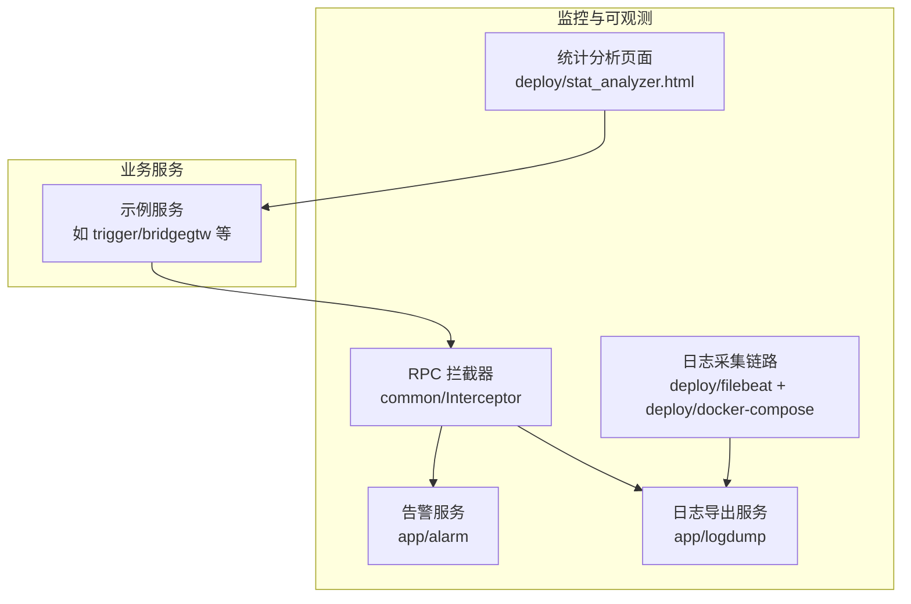
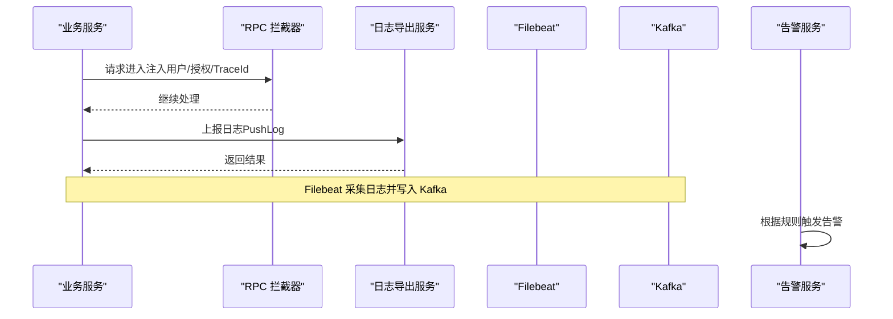
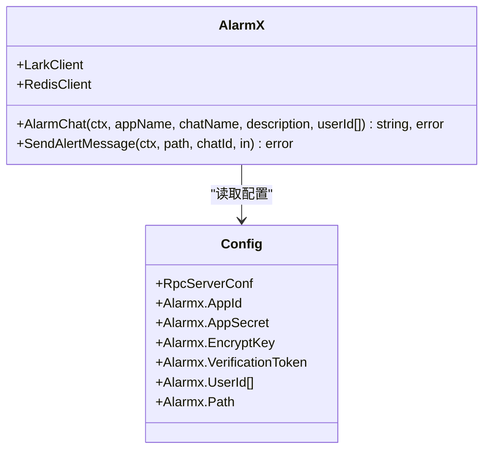
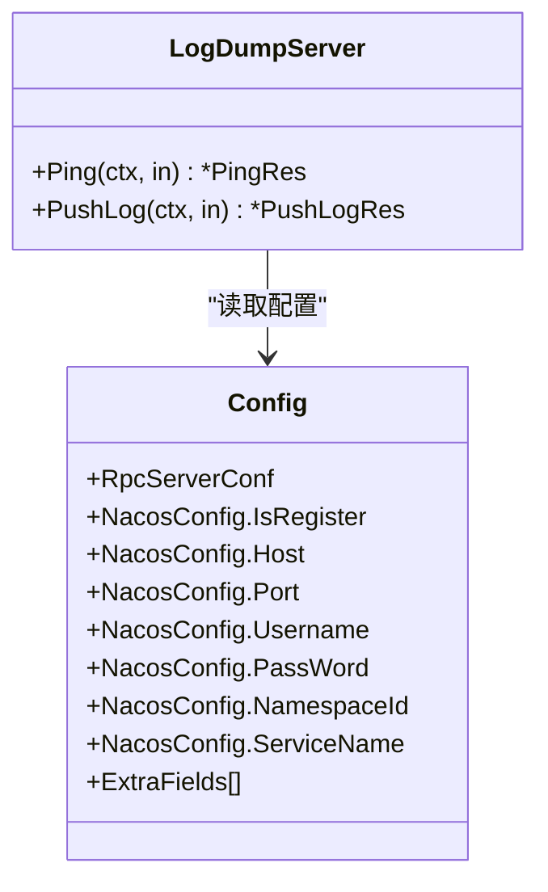
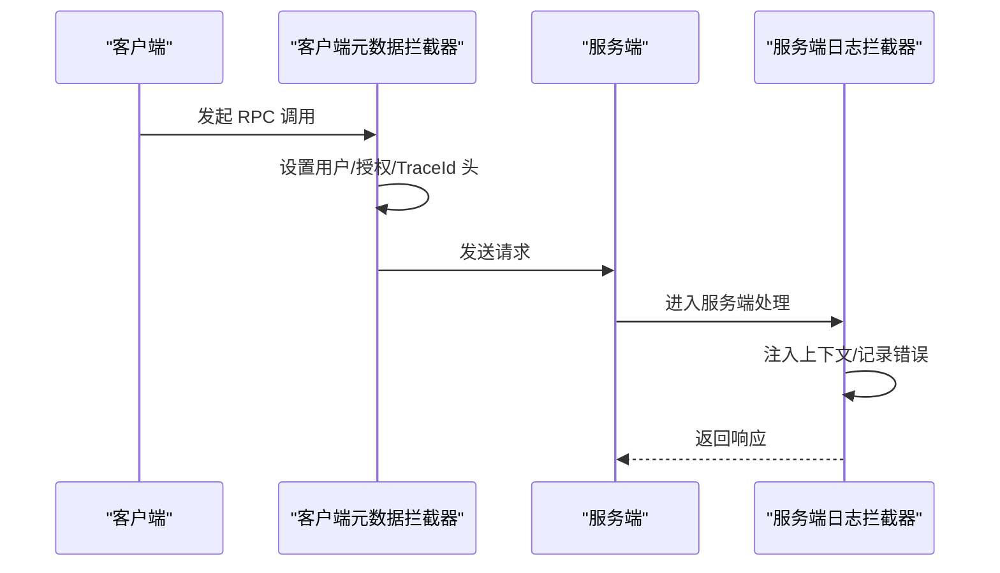
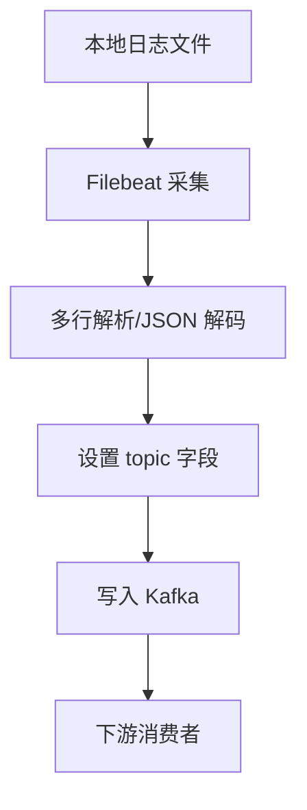
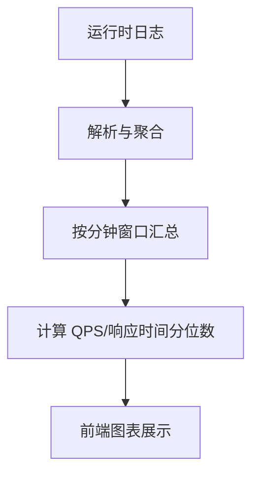
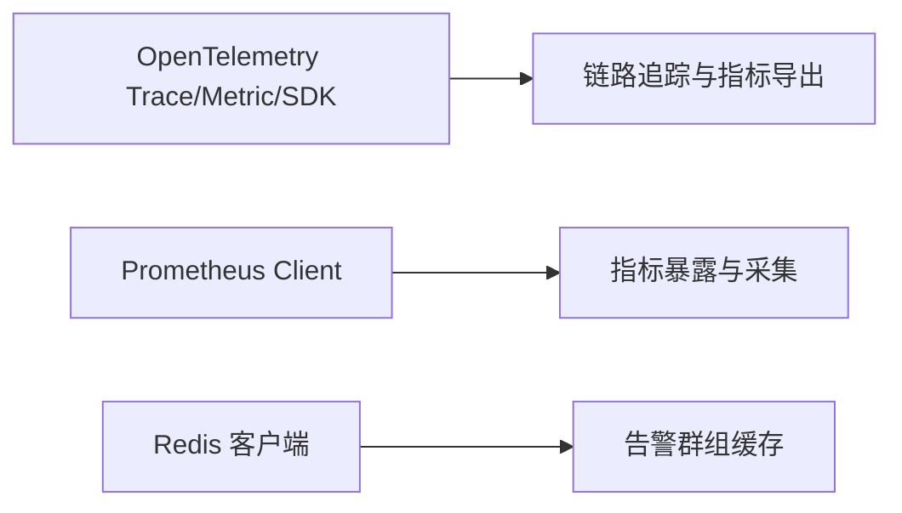

# 监控告警体系

<cite>
**本文引用的文件**
- [alarm.yaml](file://app/alarm/etc/alarm.yaml)
- [config.go](file://app/alarm/internal/config/config.go)
- [alarm.pb.go](file://app/alarm/alarm/alarm.pb.go)
- [alarm_grpc.pb.go](file://app/alarm/alarm/alarm_grpc.pb.go)
- [alarmx.go](file://common/alarmx/alarmx.go)
- [logdump.yaml](file://app/logdump/etc/logdump.yaml)
- [config.go](file://app/logdump/internal/config/config.go)
- [logdump.pb.go](file://app/logdump/logdump/logdump.pb.go)
- [logdump_grpc.pb.go](file://app/logdump/logdump/logdump_grpc.pb.go)
- [loggerInterceptor.go](file://common/Interceptor/rpcserver/loggerInterceptor.go)
- [metadataInterceptor.go](file://common/Interceptor/rpcclient/metadataInterceptor.go)
- [docker-compose.yml](file://deploy/docker-compose.yml)
- [filebeat.yml](file://deploy/filebeat/conf/filebeat.yml)
- [stat_analyzer.html](file://deploy/stat_analyzer.html)
- [resilience-patterns.md](file://.trae/skills/zero-skills/references/resilience-patterns.md)
- [common-issues.md](file://.trae/skills/zero-skills/troubleshooting/common-issues.md)
- [go.sum](file://go.sum)
</cite>

## 目录
1. [简介](#简介)
2. [项目结构](#项目结构)
3. [核心组件](#核心组件)
4. [架构总览](#架构总览)
5. [详细组件分析](#详细组件分析)
6. [依赖分析](#依赖分析)
7. [性能考虑](#性能考虑)
8. [故障排查指南](#故障排查指南)
9. [结论](#结论)
10. [附录](#附录)

## 简介
本指南面向 zero-service 的监控告警体系，围绕指标采集与监控数据定义、分布式追踪与链路监控、告警规则设计与策略配置、可视化与仪表板、故障自愈与自动化运维、日志管理与分析、以及监控系统的部署与维护等方面，给出可落地的最佳实践。文档结合仓库中已有的告警服务、日志导出服务、拦截器、Filebeat/Kafka 日志采集链路、以及 Prometheus OpenTelemetry 生态依赖，帮助团队建立统一、可观测、可恢复的生产级监控体系。

## 项目结构
zero-service 采用微服务架构，监控相关能力主要分布在以下区域：
- 告警服务：提供告警发送、群组管理、与 IM 平台对接等能力
- 日志导出服务：提供日志接收、持久化与上报能力
- RPC 拦截器：统一注入上下文与追踪头，便于链路追踪
- 日志采集链路：Filebeat 将本地日志采集至 Kafka，供下游消费分析
- 统计分析页面：内置前端页面对运行时统计进行可视化展示

**图示来源**
- [docker-compose.yml:1-110](file://deploy/docker-compose.yml#L1-L110)
- [filebeat.yml:1-122](file://deploy/filebeat/conf/filebeat.yml#L1-L122)
- [stat_analyzer.html:862-1307](file://deploy/stat_analyzer.html#L862-L1307)

**章节来源**
- [README.md:59-108](file://README.md#L59-L108)

## 核心组件
- 告警服务（alarm）：提供告警发送、IM 群组管理、与外部平台对接的能力；配置包含 Redis、Telemetry（可选）、IM 凭证等
- 日志导出服务（logdump）：提供日志接收、落盘、统计中间件配置、Nacos 配置中心对接等
- RPC 拦截器：在服务端注入用户、授权、TraceId 等上下文，在客户端透传这些头部，支撑链路追踪
- 日志采集链路：Filebeat 从本地目录采集日志，按 topic 写入 Kafka，形成“日志 -> Filebeat -> Kafka”的采集通道
- 统计分析页面：内置前端页面对运行时统计进行可视化展示，便于快速诊断

**章节来源**
- [alarm.yaml:1-26](file://app/alarm/etc/alarm.yaml#L1-L26)
- [config.go:1-16](file://app/alarm/internal/config/config.go#L1-L16)
- [logdump.yaml:1-26](file://app/logdump/etc/logdump.yaml#L1-L26)
- [config.go:1-18](file://app/logdump/internal/config/config.go#L1-L18)
- [loggerInterceptor.go:1-45](file://common/Interceptor/rpcserver/loggerInterceptor.go#L1-L45)
- [metadataInterceptor.go:1-56](file://common/Interceptor/rpcclient/metadataInterceptor.go#L1-L56)
- [docker-compose.yml:1-110](file://deploy/docker-compose.yml#L1-L110)
- [filebeat.yml:1-122](file://deploy/filebeat/conf/filebeat.yml#L1-L122)
- [stat_analyzer.html:862-1307](file://deploy/stat_analyzer.html#L862-L1307)

## 架构总览
下图展示了监控告警体系的关键交互：业务服务通过 RPC 拦截器注入上下文与追踪头；日志由 Filebeat 采集并写入 Kafka；日志导出服务接收日志并落盘；告警服务负责告警下发与群组管理。

**图示来源**
- [loggerInterceptor.go:12-44](file://common/Interceptor/rpcserver/loggerInterceptor.go#L12-L44)
- [metadataInterceptor.go:11-32](file://common/Interceptor/rpcclient/metadataInterceptor.go#L11-L32)
- [logdump_grpc.pb.go:107-141](file://app/logdump/logdump/logdump_grpc.pb.go#L107-L141)
- [filebeat.yml:110-119](file://deploy/filebeat/conf/filebeat.yml#L110-L119)
- [docker-compose.yml:32-53](file://deploy/docker-compose.yml#L32-L53)

## 详细组件分析

### 告警服务（alarm）
- 配置要点：监听端口、日志编码、Redis、Telemetry（可选）、IM 凭证与用户列表、模板路径
- 关键能力：创建/更新告警群、向群组发送交互卡片、基于模板渲染告警内容
- 适用场景：业务异常、系统过载、SLA 不达标等事件的即时通知

**图示来源**
- [alarmx.go:29-160](file://common/alarmx/alarmx.go#L29-L160)
- [config.go:5-15](file://app/alarm/internal/config/config.go#L5-L15)

**章节来源**
- [alarm.yaml:1-26](file://app/alarm/etc/alarm.yaml#L1-L26)
- [config.go:1-16](file://app/alarm/internal/config/config.go#L1-L16)
- [alarm.pb.go:1-346](file://app/alarm/alarm/alarm.pb.go#L1-L346)
- [alarm_grpc.pb.go:34-76](file://app/alarm/alarm/alarm_grpc.pb.go#L34-L76)
- [alarmx.go:1-223](file://common/alarmx/alarmx.go#L1-L223)

### 日志导出服务（logdump）
- 配置要点：监听端口、超时、统计中间件忽略特定方法、日志编码/级别/保留天数、Nacos 注册与服务名、额外字段
- 关键能力：Ping 健康检查、PushLog 批量写入、落盘与清理策略
- 适用场景：集中式日志收集、日志聚合与检索、与 Kafka 的桥接

**图示来源**
- [logdump_grpc.pb.go:107-161](file://app/logdump/logdump/logdump_grpc.pb.go#L107-L161)
- [config.go:5-18](file://app/logdump/internal/config/config.go#L5-L18)

**章节来源**
- [logdump.yaml:1-26](file://app/logdump/etc/logdump.yaml#L1-L26)
- [config.go:1-18](file://app/logdump/internal/config/config.go#L1-L18)
- [logdump.pb.go:268-409](file://app/logdump/logdump/logdump.pb.go#L268-L409)
- [logdump_grpc.pb.go:80-161](file://app/logdump/logdump/logdump_grpc.pb.go#L80-L161)

### RPC 拦截器（链路追踪与上下文）
- 服务端拦截器：从 gRPC 元数据提取用户、用户名、部门、授权、TraceId，并注入到上下文，错误时记录
- 客户端拦截器：将上述上下文透传到下游调用，确保链路追踪头一致

**图示来源**
- [loggerInterceptor.go:12-44](file://common/Interceptor/rpcserver/loggerInterceptor.go#L12-L44)
- [metadataInterceptor.go:11-32](file://common/Interceptor/rpcclient/metadataInterceptor.go#L11-L32)

**章节来源**
- [loggerInterceptor.go:1-45](file://common/Interceptor/rpcserver/loggerInterceptor.go#L1-L45)
- [metadataInterceptor.go:1-56](file://common/Interceptor/rpcclient/metadataInterceptor.go#L1-L56)

### 日志采集链路（Filebeat -> Kafka）
- Filebeat 从指定目录读取日志，按 topic 写入 Kafka；支持多输入、多行解析、JSON 解码、字段过滤等
- docker-compose 启动 Kafka 与 Filebeat，形成闭环采集链路

**图示来源**
- [filebeat.yml:4-122](file://deploy/filebeat/conf/filebeat.yml#L4-L122)
- [docker-compose.yml:32-53](file://deploy/docker-compose.yml#L32-L53)

**章节来源**
- [filebeat.yml:1-122](file://deploy/filebeat/conf/filebeat.yml#L1-L122)
- [docker-compose.yml:1-110](file://deploy/docker-compose.yml#L1-L110)

### 统计分析页面（运行时指标可视化）
- 内置前端页面对运行时统计进行可视化展示，包含 CPU、内存、GC、QPS、丢弃、限流等指标
- 支持按分钟聚合、类型维度统计、响应时间分位数等

**图示来源**
- [stat_analyzer.html:862-1307](file://deploy/stat_analyzer.html#L862-L1307)

**章节来源**
- [stat_analyzer.html:862-1307](file://deploy/stat_analyzer.html#L862-L1307)

## 依赖分析
- OpenTelemetry 生态：项目引入了 OTLP 导出器、Zipkin 导出器、SDK、Metric SDK、Trace 等依赖，可用于链路追踪与指标导出
- Prometheus 客户端：引入 Prometheus Go 客户端库，可用于自定义指标暴露与采集
- Redis 客户端：用于告警群组缓存等场景

**图示来源**
- [go.sum:573-586](file://go.sum#L573-L586)
- [go.sum:428-440](file://go.sum#L428-L440)

**章节来源**
- [go.sum:573-586](file://go.sum#L573-L586)
- [go.sum:428-440](file://go.sum#L428-L440)

## 性能考虑
- 指标采集与导出
  - 使用 Prometheus 客户端暴露关键业务指标（如 QPS、P95/P99 响应时间、错误率、缓存命中率、限流/丢弃计数），并定期抓取
  - 对于高吞吐日志，建议在 Filebeat 中开启压缩与批量发送，合理设置分区与 ack 策略
- 链路追踪
  - 在 RPC 拦截器中透传 TraceId，确保跨服务链路可串联
  - 对慢调用与异常调用打点采样，避免过度采样导致性能开销
- 日志与存储
  - Filebeat 侧设置合理的扫描频率、关闭时机与清理策略，避免频繁 IO
  - 日志导出服务设置合适的日志级别与保留天数，避免磁盘压力过大
- 资源与弹性
  - 结合统计分析页面观察 CPU/内存/GC 指标，配合自动扩缩容策略进行弹性伸缩

[本节为通用指导，不直接分析具体文件]

## 故障排查指南
- Redis 连接失败
  - 现象：连接被拒绝、需要认证
  - 处理：核对 Redis 主机、密码、集群模式配置；使用 redis-cli 进行连通性测试
- API 404
  - 现象：有效端点返回 404
  - 处理：检查路由前缀与注册，确认路由在启动时被正确打印
- 日志采集异常
  - 现象：日志未写入 Kafka 或解析失败
  - 处理：检查 Filebeat 输入路径、topic 字段、JSON 解码配置、多行解析规则

**章节来源**
- [common-issues.md:171-274](file://.trae/skills/zero-skills/troubleshooting/common-issues.md#L171-L274)

## 结论
通过告警服务、日志导出服务、RPC 拦截器与 Filebeat/Kafka 采集链路的协同，zero-service 已具备可观测性的基础能力。建议在此基础上完善指标体系、强化链路追踪、设计智能告警规则、建设可视化看板，并配套故障自愈与自动化运维流程，持续提升系统的稳定性与可维护性。

[本节为总结性内容，不直接分析具体文件]

## 附录

### 指标收集与监控数据定义（建议）
- 业务指标
  - 请求量（QPS）、成功率、错误率、P95/P99 响应时间、缓存命中率、限流/丢弃计数
- 系统指标
  - CPU 使用率、内存占用、GC 次数与停顿、文件描述符、网络收发包
- 应用指标
  - goroutine 数、堆内存分配、goroutine 等待阻塞、数据库连接池使用
- 用户体验指标
  - 页面首屏时间、接口可用性、移动端卡顿率、用户操作路径耗时

[本节为通用指导，不直接分析具体文件]

### 分布式追踪与链路监控（建议）
- 请求追踪
  - 在 RPC 拦截器中透传 TraceId，确保跨服务链路一致
- 服务依赖分析
  - 基于链路拓扑识别上游依赖与瓶颈节点
- 性能瓶颈定位
  - 结合 P95/P99 响应时间与慢调用分析，定位慢查询或阻塞点
- 错误根因分析
  - 通过错误链路与异常日志关联，快速定位根因

**章节来源**
- [loggerInterceptor.go:12-44](file://common/Interceptor/rpcserver/loggerInterceptor.go#L12-L44)
- [metadataInterceptor.go:11-32](file://common/Interceptor/rpcclient/metadataInterceptor.go#L11-L32)

### 告警规则设计与策略配置（建议）
- 阈值告警：CPU/内存/错误率超过阈值立即告警
- 趋势告警：QPS/错误率呈上升趋势且达到阈值触发
- 复合告警：多个条件同时满足触发，降低误报
- 智能告警：结合机器学习检测异常波动，减少噪声

[本节为通用指导，不直接分析具体文件]

### 可视化与仪表板设计（建议）
- 监控看板：集中展示关键指标与告警状态
- 实时图表：链路拓扑、调用时序、错误分布
- 历史趋势：按天/周/月对比分析
- 报表生成：按 SLA 与合规要求生成报告

[本节为通用指导，不直接分析具体文件]

### 故障自愈与自动化运维（建议）
- 自动扩缩容：基于 CPU/内存/队列长度动态扩容
- 故障切换：主备服务自动切换与流量迁移
- 重启策略：指数退避重启，避免雪崩
- 回滚机制：灰度发布与一键回滚

[本节为通用指导，不直接分析具体文件]

### 日志管理与分析（建议）
- 日志收集：Filebeat 采集、Kafka 缓冲
- 日志聚合：统一字段、结构化解析
- 日志搜索：基于关键词、时间范围、标签检索
- 日志分析：异常检测、根因分析、容量预测

**章节来源**
- [filebeat.yml:1-122](file://deploy/filebeat/conf/filebeat.yml#L1-L122)
- [docker-compose.yml:1-110](file://deploy/docker-compose.yml#L1-L110)

### 监控系统的部署与维护（建议）
- 监控组件安装：Prometheus、Grafana、OTel Collector、Zipkin/Jeager
- 配置管理：集中化配置、版本化管理、变更审计
- 性能优化：采样率、批大小、压缩、资源配额
- 容量规划：基于历史峰值与增长趋势评估资源需求

[本节为通用指导，不直接分析具体文件]