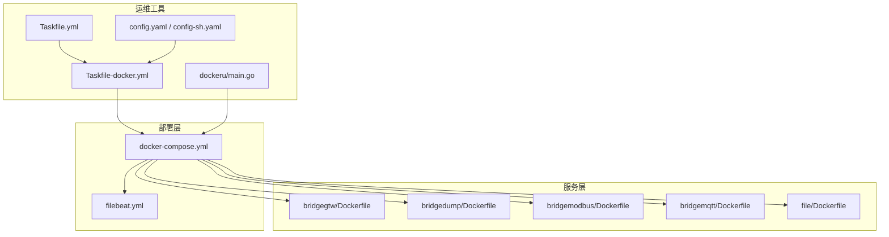
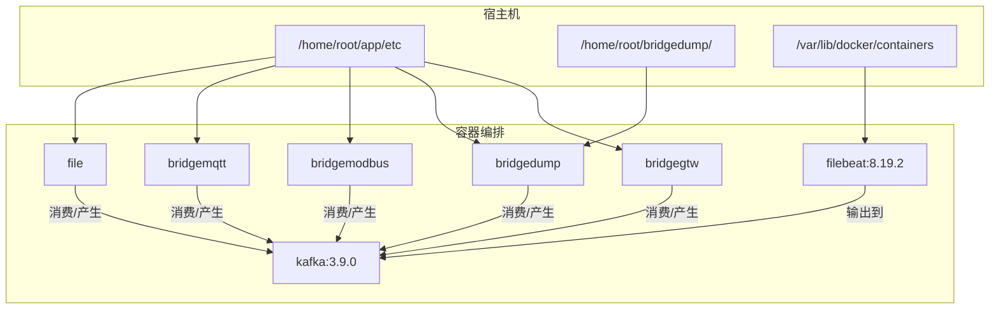
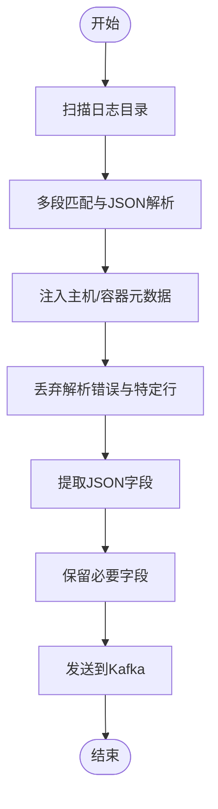
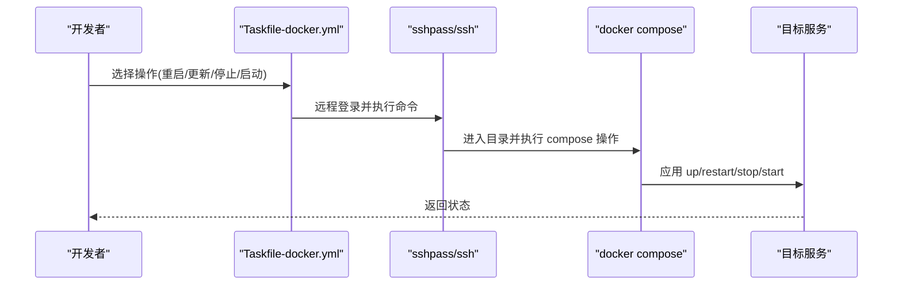
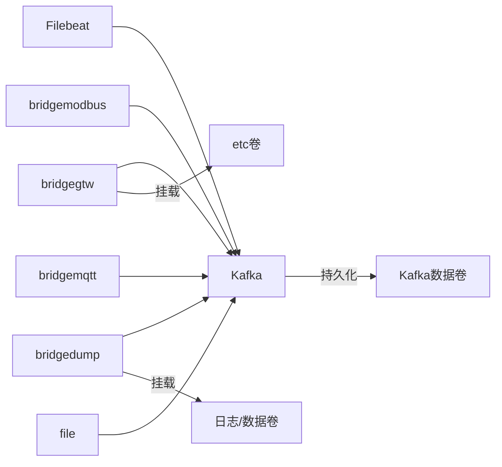

# 基础设施即代码

<cite>
**本文引用的文件**
- [deploy/docker-compose.yml](file://deploy/docker-compose.yml)
- [deploy/filebeat/conf/filebeat.yml](file://deploy/filebeat/conf/filebeat.yml)
- [app/bridgegtw/Dockerfile](file://app/bridgegtw/Dockerfile)
- [app/bridgedump/Dockerfile](file://app/bridgedump/Dockerfile)
- [app/bridgemodbus/Dockerfile](file://app/bridgemodbus/Dockerfile)
- [app/bridgemqtt/Dockerfile](file://app/bridgemqtt/Dockerfile)
- [app/file/Dockerfile](file://app/file/Dockerfile)
- [util/Taskfile-docker.yml](file://util/Taskfile-docker.yml)
- [util/Taskfile.yml](file://util/Taskfile.yml)
- [util/dockeru/main.go](file://util/dockeru/main.go)
- [util/config.yaml](file://util/config.yaml)
- [util/config-sh.yaml](file://util/config-sh.yaml)
</cite>

## 目录
1. [简介](#简介)
2. [项目结构](#项目结构)
3. [核心组件](#核心组件)
4. [架构总览](#架构总览)
5. [详细组件分析](#详细组件分析)
6. [依赖关系分析](#依赖关系分析)
7. [性能考量](#性能考量)
8. [故障排查指南](#故障排查指南)
9. [结论](#结论)
10. [附录](#附录)

## 简介
本指南面向 zero-service 项目的基础设施即代码（IaC）最佳实践，围绕容器化与编排展开，涵盖以下主题：
- Docker 多阶段构建与镜像优化
- Docker Compose 编排与资源限制
- 日志采集与消息队列集成
- CI/CD 流水线建议
- 安全与合规（最小权限、非 root、镜像扫描）
- 监控与日志收集（容器监控、日志聚合、性能优化）

## 项目结构
该项目采用按“微服务”拆分的多模块结构，每个服务均提供独立的 Dockerfile 和配置文件，便于统一打包与发布。部署层提供 docker-compose 编排与 Filebeat 日志采集配置。

图表来源
- [deploy/docker-compose.yml:1-110](file://deploy/docker-compose.yml#L1-L110)
- [deploy/filebeat/conf/filebeat.yml:1-122](file://deploy/filebeat/conf/filebeat.yml#L1-L122)
- [app/bridgegtw/Dockerfile:1-43](file://app/bridgegtw/Dockerfile#L1-L43)
- [app/bridgedump/Dockerfile:1-42](file://app/bridgedump/Dockerfile#L1-L42)
- [app/bridgemodbus/Dockerfile:1-42](file://app/bridgemodbus/Dockerfile#L1-L42)
- [app/bridgemqtt/Dockerfile:1-42](file://app/bridgemqtt/Dockerfile#L1-L42)
- [app/file/Dockerfile:1-42](file://app/file/Dockerfile#L1-L42)
- [util/Taskfile-docker.yml:1-37](file://util/Taskfile-docker.yml#L1-L37)
- [util/Taskfile.yml:1-33](file://util/Taskfile.yml#L1-L33)
- [util/dockeru/main.go:1-448](file://util/dockeru/main.go#L1-L448)
- [util/config.yaml:1-26](file://util/config.yaml#L1-L26)
- [util/config-sh.yaml:1-20](file://util/config-sh.yaml#L1-L20)

章节来源
- [deploy/docker-compose.yml:1-110](file://deploy/docker-compose.yml#L1-L110)
- [deploy/filebeat/conf/filebeat.yml:1-122](file://deploy/filebeat/conf/filebeat.yml#L1-L122)
- [util/Taskfile.yml:1-33](file://util/Taskfile.yml#L1-L33)
- [util/Taskfile-docker.yml:1-37](file://util/Taskfile-docker.yml#L1-L37)
- [util/dockeru/main.go:1-448](file://util/dockeru/main.go#L1-L448)
- [util/config.yaml:1-26](file://util/config.yaml#L1-L26)
- [util/config-sh.yaml:1-20](file://util/config-sh.yaml#L1-L20)

## 核心组件
- Docker Compose 编排：集中定义 Kafka、Filebeat、各业务服务及其网络、卷、环境变量与资源限制。
- 多阶段构建：Go 服务统一使用多阶段构建，基础镜像采用 scratch，仅拷贝必要运行时文件，实现极小镜像体积与安全基线。
- 日志采集：Filebeat 从宿主机目录采集桥接 dump 产生的 JSON 日志，解析后投递至 Kafka。
- 运维工具链：Taskfile 提供远程 docker compose 操作；dockeru 提供本地容器/镜像管理；config 配置远端服务器与服务清单。

章节来源
- [deploy/docker-compose.yml:1-110](file://deploy/docker-compose.yml#L1-L110)
- [deploy/filebeat/conf/filebeat.yml:1-122](file://deploy/filebeat/conf/filebeat.yml#L1-L122)
- [app/bridgegtw/Dockerfile:1-43](file://app/bridgegtw/Dockerfile#L1-L43)
- [util/Taskfile-docker.yml:1-37](file://util/Taskfile-docker.yml#L1-L37)
- [util/dockeru/main.go:1-448](file://util/dockeru/main.go#L1-L448)
- [util/config.yaml:1-26](file://util/config.yaml#L1-L26)
- [util/config-sh.yaml:1-20](file://util/config-sh.yaml#L1-L20)

## 架构总览
下图展示零信任、低耦合的服务编排与日志采集架构：业务服务通过共享卷挂载配置与数据；Filebeat 采集日志并投递到 Kafka；Kafka 提供高吞吐消息通道，支持后续消费与分析。

图表来源
- [deploy/docker-compose.yml:1-110](file://deploy/docker-compose.yml#L1-L110)
- [deploy/filebeat/conf/filebeat.yml:1-122](file://deploy/filebeat/conf/filebeat.yml#L1-L122)

## 详细组件分析

### Docker 多阶段构建与镜像优化
- 构建阶段：使用官方 golang 镜像，设置时区、代理与 CGO 禁用，减少二进制大小与依赖。
- 运行阶段：基于 scratch，仅复制证书与时区文件、可执行文件与配置，显著降低攻击面与镜像体积。
- 最佳实践要点
  - 固定 Go 版本与基础镜像版本，确保可重复构建。
  - 保持运行镜像只读文件系统与最小权限。
  - 在 CI 中缓存依赖层，缩短构建时间。

章节来源
- [app/bridgegtw/Dockerfile:1-43](file://app/bridgegtw/Dockerfile#L1-L43)
- [app/bridgedump/Dockerfile:1-42](file://app/bridgedump/Dockerfile#L1-L42)
- [app/bridgemodbus/Dockerfile:1-42](file://app/bridgemodbus/Dockerfile#L1-L42)
- [app/bridgemqtt/Dockerfile:1-42](file://app/bridgemqtt/Dockerfile#L1-L42)
- [app/file/Dockerfile:1-42](file://app/file/Dockerfile#L1-L42)

### Docker Compose 编排与资源限制
- 服务定义
  - kafka：暴露端口映射，配置控制器与分区参数，持久化数据目录。
  - filebeat：以 root 用户运行，挂载宿主机容器日志目录与配置文件，严格权限关闭，连接 Kafka。
  - 业务服务：bridgegtw、bridgedump、ieccaller、iecstash 等，均通过环境变量设置时区，使用 host 网络模式，挂载 etc 与日志/数据目录。
- 网络与卷
  - host 网络模式简化了服务间通信，但需注意端口冲突与隔离性。
  - 卷挂载集中在 /app/etc、/opt/logs、/opt/bridgedump 等路径，便于统一管理。
- 环境变量与安全
  - 显式设置 TZ，避免时区问题。
  - privileged: true 在部分服务中开启，需结合最小权限原则审慎使用。

章节来源
- [deploy/docker-compose.yml:1-110](file://deploy/docker-compose.yml#L1-L110)

### 日志采集与处理（Filebeat → Kafka）
- Filebeat 输入
  - 监听桥接 dump 生成的多个 JSON 目录，按行多段匹配与 JSON 解析，动态注入 topic 字段。
- 处理器
  - 添加主机/容器元数据、丢弃解析错误事件、提取 JSON 字段、保留必要字段、丢弃冗余字段。
- 输出
  - 发送到 Kafka，使用 gzip 压缩，按 topic 动态路由。

图表来源
- [deploy/filebeat/conf/filebeat.yml:1-122](file://deploy/filebeat/conf/filebeat.yml#L1-L122)

章节来源
- [deploy/filebeat/conf/filebeat.yml:1-122](file://deploy/filebeat/conf/filebeat.yml#L1-L122)

### 运维与远程编排（Taskfile + dockeru + 配置）
- Taskfile-docker.yml
  - 提供远程重启、更新、停止、启动单个服务的能力，依赖 sshpass 与 ssh。
- Taskfile.yml
  - 引入 docker 子任务，便于统一入口。
- dockeru/main.go
  - 交互式容器/镜像管理：列出容器、查看镜像、进入容器、查看日志、保存镜像、清理悬空镜像。
- 配置
  - config.yaml 与 config-sh.yaml 提供多环境服务器与服务清单，支持通配符路径。

图表来源
- [util/Taskfile-docker.yml:1-37](file://util/Taskfile-docker.yml#L1-L37)
- [util/config.yaml:1-26](file://util/config.yaml#L1-L26)
- [util/config-sh.yaml:1-20](file://util/config-sh.yaml#L1-L20)

章节来源
- [util/Taskfile.yml:1-33](file://util/Taskfile.yml#L1-L33)
- [util/Taskfile-docker.yml:1-37](file://util/Taskfile-docker.yml#L1-L37)
- [util/dockeru/main.go:1-448](file://util/dockeru/main.go#L1-L448)
- [util/config.yaml:1-26](file://util/config.yaml#L1-L26)
- [util/config-sh.yaml:1-20](file://util/config-sh.yaml#L1-L20)

## 依赖关系分析
- 组件耦合
  - Filebeat 依赖 Kafka 与宿主机日志目录；业务服务依赖 Kafka 与共享配置卷。
- 外部依赖
  - Kafka 3.9.0、Filebeat 8.19.2、Go 1.23-alpine3.22。
- 潜在风险
  - host 网络模式带来端口冲突与隔离性不足的风险；privileged 使用需最小化范围。

图表来源
- [deploy/docker-compose.yml:1-110](file://deploy/docker-compose.yml#L1-L110)

章节来源
- [deploy/docker-compose.yml:1-110](file://deploy/docker-compose.yml#L1-L110)

## 性能考量
- 镜像体积与启动速度
  - 多阶段构建 + scratch 运行时显著减小镜像体积，提升拉取与启动速度。
- 日志处理
  - Filebeat 增大扫描频率与关闭不活跃文件时间，有助于更快地推送增量日志。
- Kafka 参数
  - 合理设置分区数与副本因子，避免单点瓶颈；生产环境建议禁用 host 网络，使用自定义网络提升隔离性。

[本节为通用指导，无需具体文件分析]

## 故障排查指南
- 容器状态与日志
  - 使用 dockeru 列出容器、查看状态与日志，定位异常容器。
- 远程编排问题
  - 检查 Taskfile 的 SSH 凭据与路径配置，确认 docker compose 命令可用。
- Filebeat 采集异常
  - 校验挂载目录与权限，确认 strict.perms=false 已生效；检查 Kafka 连接与 topic 注入。
- Kafka 运行问题
  - 检查 advertised/listeners 配置与端口映射，确认 controller/quorum 设置正确。

章节来源
- [util/dockeru/main.go:1-448](file://util/dockeru/main.go#L1-L448)
- [util/Taskfile-docker.yml:1-37](file://util/Taskfile-docker.yml#L1-L37)
- [deploy/filebeat/conf/filebeat.yml:1-122](file://deploy/filebeat/conf/filebeat.yml#L1-L122)
- [deploy/docker-compose.yml:1-110](file://deploy/docker-compose.yml#L1-L110)

## 结论
本项目在容器化与编排方面具备良好基础：多阶段构建实现轻量镜像，Compose 统一编排，Filebeat 与 Kafka 形成日志采集闭环。建议在生产环境中进一步强化网络隔离、最小权限与镜像安全扫描，完善 CI/CD 自动化与监控告警体系。

[本节为总结，无需具体文件分析]

## 附录

### 容器安全最佳实践清单
- 运行用户
  - 默认以非 root 用户运行，避免 privileged 权限滥用。
- 权限与隔离
  - 使用自定义网络替代 host 网络，限制端口暴露；启用只读文件系统。
- 镜像安全
  - 在 CI 中集成镜像扫描与漏洞检测；固定基础镜像版本；最小化依赖层。
- 配置与密钥
  - 使用 Secret/ConfigMap 管理敏感配置；避免将密钥硬编码进镜像或 Compose。

[本节为通用指导，无需具体文件分析]

### CI/CD 流水线建议
- 触发条件
  - push 到主分支触发构建；PR 触发单元测试。
- 步骤
  - 依赖缓存 → 构建多阶段镜像 → 镜像扫描 → 推送仓库 → docker compose 部署（本地/远程）。
- 部署策略
  - 蓝绿/金丝雀发布，配合健康检查与回滚机制。

[本节为通用指导，无需具体文件分析]