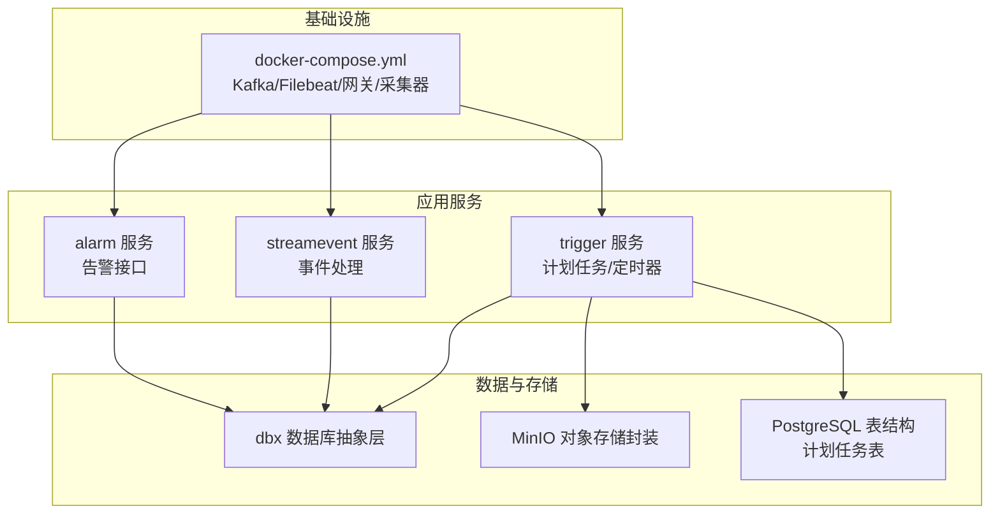
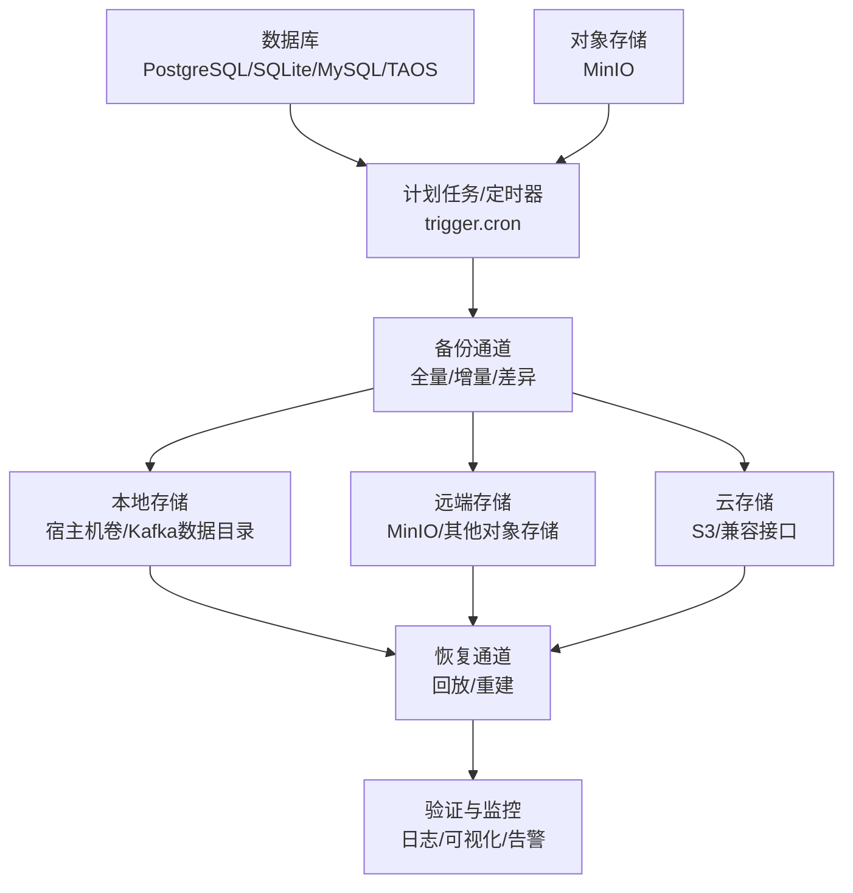
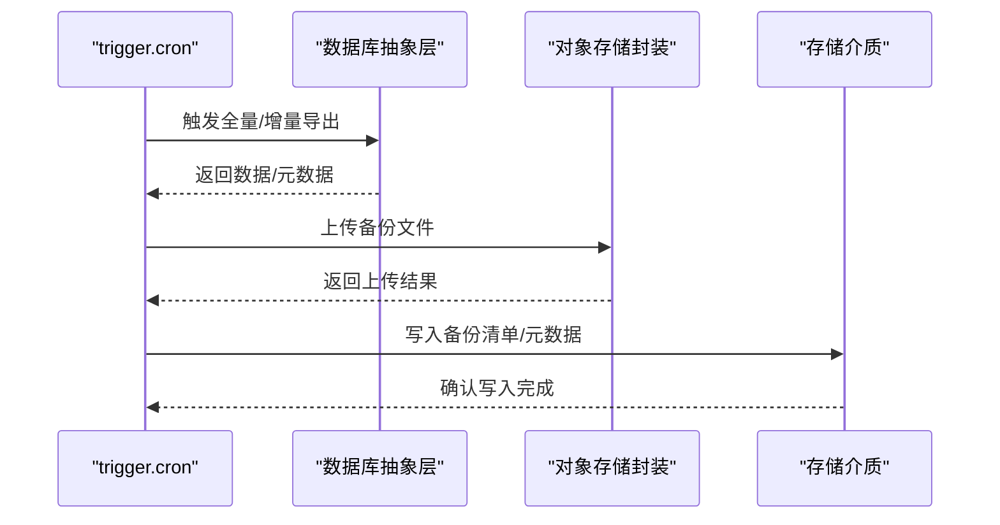
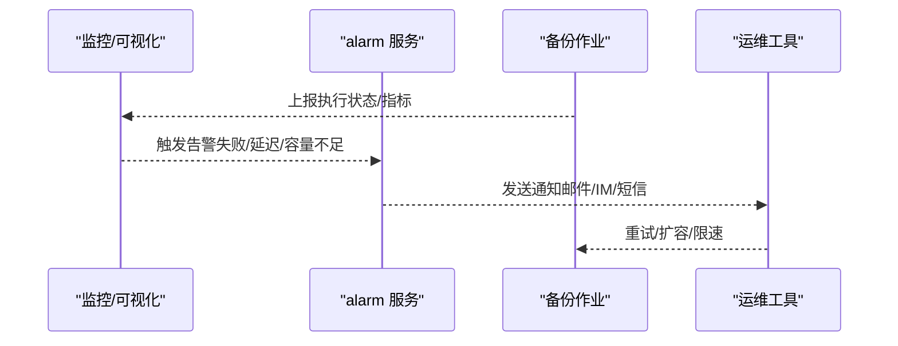
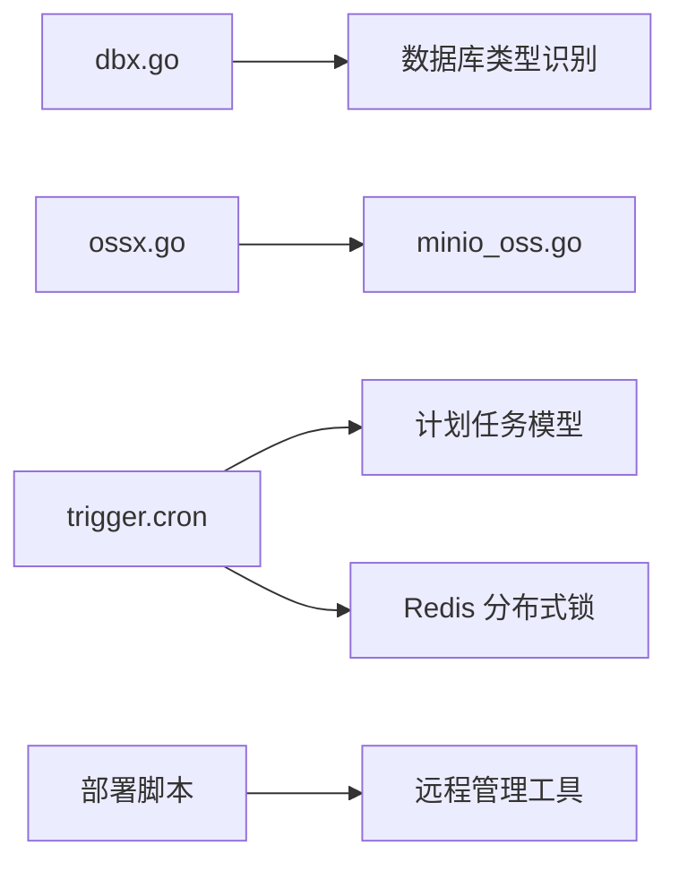

# 备份与灾难恢复

<cite>
**本文引用的文件**
- [deploy/docker-compose.yml](file://deploy/docker-compose.yml)
- [common/dbx/dbx.go](file://common/dbx/dbx.go)
- [common/dbx/sqlitesql.go](file://common/dbx/sqlitesql.go)
- [common/ossx/ossx.go](file://common/ossx/ossx.go)
- [common/ossx/minio_oss.go](file://common/ossx/minio_oss.go)
- [app/trigger/cron/cronservice.go](file://app/trigger/cron/cronservice.go)
- [app/trigger/internal/config/config.go](file://app/trigger/internal/config/config.go)
- [app/trigger/trigger/trigger.pb.validate.go](file://app/trigger/trigger/trigger.pb.validate.go)
- [app/trigger/internal/logic/createplantasklogic.go](file://app/trigger/internal/logic/createplantasklogic.go)
- [model/sql/postgres.sql](file://model/sql/postgres.sql)
- [model/planmodel_gen.go](file://model/planmodel_gen.go)
- [util/main.go](file://util/main.go)
- [deploy/stat_analyzer.html](file://deploy/stat_analyzer.html)
- [.trae/skills/zero-skills/best-practices/overview.md](file://.trae/skills/zero-skills/best-practices/overview.md)
- [.trae/skills/dev-environment/SKILL.md](file://.trae/skills/dev-environment/SKILL.md)
- [app/trigger/deploy.sh](file://app/trigger/deploy.sh)
- [app/file/deploy.sh](file://app/file/deploy.sh)
- [app/gis/deploy.sh](file://app/gis/deploy.sh)
- [app/gtw/deploy.sh](file://app/gtw/deploy.sh)
- [app/xfusionmock/deploy.sh](file://app/xfusionmock/deploy.sh)
- [app/alarm/alarm/alarm_grpc.pb.go](file://app/alarm/alarm/alarm_grpc.pb.go)
- [app/alarm/alarm/alarm.pb.go](file://app/alarm/alarm/alarm.pb.go)
- [common/nacosx/builder.go](file://common/nacosx/builder.go)
- [common/nacosx/target.go](file://common/nacosx/target.go)
- [common/nacosx/options.go](file://common/nacosx/options.go)
- [facade/streamevent/internal/config/config.go](file://facade/streamevent/internal/config/config.go)
- [app/trigger/trigger/trigger.pb.validate.go](file://app/trigger/trigger/trigger.pb.validate.go)
</cite>

## 目录
1. [简介](#简介)
2. [项目结构](#项目结构)
3. [核心组件](#核心组件)
4. [架构总览](#架构总览)
5. [详细组件分析](#详细组件分析)
6. [依赖分析](#依赖分析)
7. [性能考虑](#性能考虑)
8. [故障排查指南](#故障排查指南)
9. [结论](#结论)
10. [附录](#附录)

## 简介
本指南面向 zero-service 项目的备份与灾难恢复（BC/DR），围绕数据备份策略（全量/增量/差异）、备份自动化（定时任务、验证、存储管理）、灾难恢复（RTO/RPO、流程与测试）、多层级备份架构（本地/异地/云）以及恢复最佳实践（恢复点选择、完整性验证、业务连续性）进行系统化设计与落地建议。同时结合仓库现有组件（数据库抽象层、对象存储封装、计划任务与定时器、部署脚本、监控可视化等）给出可操作的实施方案。

## 项目结构
- 数据库层：统一数据库类型识别与连接适配，支持 SQLite、PostgreSQL、MySQL、TDengine 等。
- 对象存储层：统一 OSS 抽象，内置 MinIO 实现，支持桶/文件管理、签名链接等。
- 计划任务与定时器：基于 go-zero 的计划任务模型与 cron 扫描循环，支撑备份调度与执行。
- 部署与运维：多服务部署脚本与远程管理工具，便于打包、导出镜像与批量运维。
- 监控与可观测：日志采集与可视化页面，辅助备份状态与性能观测。

图表来源
- [deploy/docker-compose.yml:1-110](file://deploy/docker-compose.yml#L1-L110)
- [common/dbx/dbx.go:1-155](file://common/dbx/dbx.go#L1-L155)
- [common/ossx/ossx.go:1-152](file://common/ossx/ossx.go#L1-L152)
- [model/sql/postgres.sql:94-128](file://model/sql/postgres.sql#L94-L128)

章节来源
- [deploy/docker-compose.yml:1-110](file://deploy/docker-compose.yml#L1-L110)
- [common/dbx/dbx.go:1-155](file://common/dbx/dbx.go#L1-L155)
- [common/ossx/ossx.go:1-152](file://common/ossx/ossx.go#L1-L152)
- [model/sql/postgres.sql:94-128](file://model/sql/postgres.sql#L94-L128)

## 核心组件
- 数据库抽象与连接
  - 自动识别数据库类型（SQLite/PostgreSQL/MySQL/TAOS），统一创建连接与适配器，支持事务、查询、执行等基础能力。
- 对象存储抽象与 MinIO 实现
  - 统一的 OSS 接口，支持桶管理、文件上传/下载、签名链接、批量删除等；内置 MinIO 客户端封装。
- 计划任务与定时器
  - 基于 go-zero 的计划任务模型与扫描循环，支持锁定执行项、并发调度、状态更新与事件通知。
- 部署与运维工具
  - 多服务部署脚本与远程管理工具，支持镜像导出、批量运维、日志查看等。

章节来源
- [common/dbx/dbx.go:31-64](file://common/dbx/dbx.go#L31-L64)
- [common/dbx/sqlitesql.go:1-12](file://common/dbx/sqlitesql.go#L1-L12)
- [common/ossx/ossx.go:28-39](file://common/ossx/ossx.go#L28-L39)
- [common/ossx/minio_oss.go:20-242](file://common/ossx/minio_oss.go#L20-L242)
- [app/trigger/cron/cronservice.go:25-56](file://app/trigger/cron/cronservice.go#L25-L56)
- [util/main.go:120-136](file://util/main.go#L120-L136)

## 架构总览
备份与灾难恢复体系由“数据源—备份通道—存储介质—恢复通道—验证与监控”构成闭环。数据源包括数据库与对象存储；备份通道通过计划任务与定时器触发；存储介质采用本地卷、远端 MinIO 与云存储组合；恢复通道在故障发生时按 RTO/RPO 目标回放至可用状态；验证与监控贯穿全流程。

图表来源
- [app/trigger/cron/cronservice.go:38-78](file://app/trigger/cron/cronservice.go#L38-L78)
- [common/dbx/dbx.go:52-64](file://common/dbx/dbx.go#L52-L64)
- [common/ossx/minio_oss.go:124-148](file://common/ossx/minio_oss.go#L124-L148)
- [deploy/docker-compose.yml:28-30](file://deploy/docker-compose.yml#L28-L30)
- [deploy/stat_analyzer.html:862-1174](file://deploy/stat_analyzer.html#L862-L1174)

## 详细组件分析

### 数据备份策略与实现
- 全量备份
  - 针对数据库：导出完整 SQL/二进制快照，结合 docker 卷挂载与对象存储上传。
  - 针对对象存储：遍历桶内对象，生成清单并上传到远端存储。
- 增量备份
  - 基于时间戳或变更标记，仅备份新增/修改的数据；结合 Kafka/事件流记录变更。
- 差异备份
  - 基于上次全量后的差异内容进行备份，降低带宽与存储压力。
- 备份验证
  - 通过校验和、元数据比对与抽样读取验证备份完整性。
- 存储管理
  - 采用分层命名与过期策略，定期清理过期备份，控制成本与容量。

章节来源
- [common/dbx/dbx.go:31-64](file://common/dbx/dbx.go#L31-L64)
- [common/ossx/ossx.go:28-39](file://common/ossx/ossx.go#L28-L39)
- [common/ossx/minio_oss.go:124-148](file://common/ossx/minio_oss.go#L124-L148)

### 备份自动化流程
- 定时任务
  - 使用 trigger 服务的计划任务与 cron 扫描循环，按周期触发备份作业。
- 备份作业
  - 调用数据库与对象存储封装，执行导出/上传，并记录元数据。
- 存储管理
  - 通过部署脚本与远程管理工具，实现镜像导出、备份保留策略与批量运维。

图表来源
- [app/trigger/cron/cronservice.go:81-184](file://app/trigger/cron/cronservice.go#L81-L184)
- [common/dbx/dbx.go:52-64](file://common/dbx/dbx.go#L52-L64)
- [common/ossx/minio_oss.go:124-148](file://common/ossx/minio_oss.go#L124-L148)

章节来源
- [app/trigger/cron/cronservice.go:38-78](file://app/trigger/cron/cronservice.go#L38-L78)
- [app/trigger/internal/config/config.go:9-27](file://app/trigger/internal/config/config.go#L9-L27)

### 灾难恢复计划（RTO/RPO）
- RTO（恢复时间目标）
  - 通过多级并行恢复与并行回放缩短恢复时间；优先恢复关键服务与数据。
- RPO（恢复点目标）
  - 通过全量+增量/差异策略与事件流回放，确保数据尽可能接近故障时刻。
- 恢复流程
  - 故障检测 → 评估影响 → 选择恢复点 → 回放数据/重建服务 → 验证与切换 → 监控与优化。
- 测试验证
  - 定期演练不同故障场景，验证 RTO/RPO 指标与业务连续性。

章节来源
- [deploy/stat_analyzer.html:862-1174](file://deploy/stat_analyzer.html#L862-L1174)

### 多层级备份架构
- 本地备份
  - docker 卷挂载与 Kafka 数据目录持久化，满足快速回放与短期恢复。
- 异地备份
  - 通过 MinIO 与其他对象存储，实现跨机房/跨地域复制。
- 云备份
  - 与 S3/兼容接口对接，实现长期归档与合规要求。

章节来源
- [deploy/docker-compose.yml:28-30](file://deploy/docker-compose.yml#L28-L30)
- [common/ossx/minio_oss.go:20-38](file://common/ossx/minio_oss.go#L20-L38)

### 数据恢复最佳实践
- 恢复点选择
  - 结合 RPO 与业务窗口，选择最接近故障时刻且稳定的备份点。
- 数据完整性验证
  - 校验备份清单、对象哈希与抽样读取，确保可恢复性。
- 业务连续性保证
  - 通过服务降级、缓存预热与灰度切换，最小化业务中断。

章节来源
- [common/ossx/ossx.go:28-39](file://common/ossx/ossx.go#L28-L39)
- [common/ossx/minio_oss.go:150-162](file://common/ossx/minio_oss.go#L150-L162)

### 备份监控与告警
- 备份状态监控
  - 通过日志采集与可视化页面，观察备份任务执行情况与资源使用。
- 失败通知
  - 结合 alarm 服务与告警接口，对备份失败、超时、存储异常进行告警。
- 性能优化
  - 调整并发度、压缩策略与网络带宽，提升备份吞吐与稳定性。

图表来源
- [deploy/stat_analyzer.html:862-1174](file://deploy/stat_analyzer.html#L862-L1174)
- [app/alarm/alarm/alarm_grpc.pb.go:34-76](file://app/alarm/alarm/alarm_grpc.pb.go#L34-L76)
- [app/alarm/alarm/alarm.pb.go:207-264](file://app/alarm/alarm/alarm.pb.go#L207-L264)

章节来源
- [deploy/stat_analyzer.html:862-1174](file://deploy/stat_analyzer.html#L862-L1174)
- [app/alarm/alarm/alarm_grpc.pb.go:34-76](file://app/alarm/alarm/alarm_grpc.pb.go#L34-L76)
- [app/alarm/alarm/alarm.pb.go:207-264](file://app/alarm/alarm/alarm.pb.go#L207-L264)

### 灾难场景模拟与演练
- 故障注入
  - 模拟数据库连接中断、对象存储不可用、网络分区等场景。
- 恢复测试
  - 在隔离环境中执行恢复流程，验证数据一致性与业务可用性。
- 改进措施
  - 基于演练结果优化备份策略、告警阈值与切换预案。

章节来源
- [util/main.go:120-136](file://util/main.go#L120-L136)
- [.trae/skills/dev-environment/SKILL.md:142-200](file://.trae/skills/dev-environment/SKILL.md#L142-L200)

## 依赖分析
- 数据库依赖
  - dbx 抽象层根据数据源自动选择连接类型，支持多种数据库方言。
- 存储依赖
  - ossx 抽象层统一接口，minio_oss 实现具体客户端调用。
- 计划任务依赖
  - trigger 服务的 cron 扫描循环依赖数据库模型与 Redis 分布式锁。
- 部署与运维依赖
  - 多服务部署脚本与远程管理工具，支持镜像导出与批量运维。

图表来源
- [common/dbx/dbx.go:31-64](file://common/dbx/dbx.go#L31-L64)
- [common/ossx/ossx.go:109-151](file://common/ossx/ossx.go#L109-L151)
- [common/ossx/minio_oss.go:214-235](file://common/ossx/minio_oss.go#L214-L235)
- [app/trigger/cron/cronservice.go:25-56](file://app/trigger/cron/cronservice.go#L25-L56)
- [app/trigger/internal/config/config.go:9-27](file://app/trigger/internal/config/config.go#L9-L27)
- [util/main.go:120-136](file://util/main.go#L120-L136)

章节来源
- [common/dbx/dbx.go:31-64](file://common/dbx/dbx.go#L31-L64)
- [common/ossx/ossx.go:109-151](file://common/ossx/ossx.go#L109-L151)
- [common/ossx/minio_oss.go:214-235](file://common/ossx/minio_oss.go#L214-L235)
- [app/trigger/cron/cronservice.go:25-56](file://app/trigger/cron/cronservice.go#L25-L56)
- [app/trigger/internal/config/config.go:9-27](file://app/trigger/internal/config/config.go#L9-L27)
- [util/main.go:120-136](file://util/main.go#L120-L136)

## 性能考虑
- 并发与限流
  - 控制备份并发度，避免对生产数据库与对象存储造成过大压力。
- 压缩与分片
  - 对大文件进行压缩与分片，提升传输效率与存储利用率。
- 网络与带宽
  - 优化网络路径与带宽分配，减少跨机房/跨地域传输延迟。
- 资源监控
  - 通过可视化页面与日志采集，持续监控 CPU、内存、磁盘与网络指标。

章节来源
- [deploy/stat_analyzer.html:862-1174](file://deploy/stat_analyzer.html#L862-L1174)
- [.trae/skills/zero-skills/best-practices/overview.md:671-754](file://.trae/skills/zero-skills/best-practices/overview.md#L671-L754)

## 故障排查指南
- 备份失败
  - 检查数据库连接、对象存储凭证与网络连通性；查看日志与告警。
- 恢复异常
  - 校验恢复点完整性与一致性，确认服务依赖与配置正确。
- 运维问题
  - 使用远程管理工具检查服务状态、日志与镜像导出情况。

章节来源
- [util/main.go:244-284](file://util/main.go#L244-L284)
- [app/file/deploy.sh:1-50](file://app/file/deploy.sh#L1-L50)
- [app/gis/deploy.sh:1-46](file://app/gis/deploy.sh#L1-L46)
- [app/gtw/deploy.sh:1-50](file://app/gtw/deploy.sh#L1-L50)
- [app/trigger/deploy.sh:1-50](file://app/trigger/deploy.sh#L1-L50)
- [app/xfusionmock/deploy.sh:1-50](file://app/xfusionmock/deploy.sh#L1-L50)

## 结论
通过统一的数据库与对象存储抽象、完善的计划任务与定时器机制、多层级备份架构与严格的监控告警体系，zero-service 可实现高可靠的数据保护与快速恢复能力。建议在生产环境中持续完善备份策略、定期演练与优化，确保 RTO/RPO 指标满足业务需求。

## 附录
- 关键配置参考
  - trigger 服务配置包含数据库数据源、Nacos 注册、Redis DB、流事件客户端等。
  - streamevent 服务配置包含数据库与 TDengine 数据源。
- 名词解释
  - RTO：恢复时间目标；RPO：恢复点目标；BC/DR：业务连续性与灾难恢复。

章节来源
- [app/trigger/internal/config/config.go:9-27](file://app/trigger/internal/config/config.go#L9-L27)
- [facade/streamevent/internal/config/config.go:17-24](file://facade/streamevent/internal/config/config.go#L17-L24)