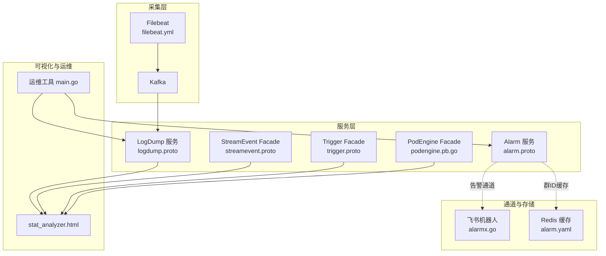
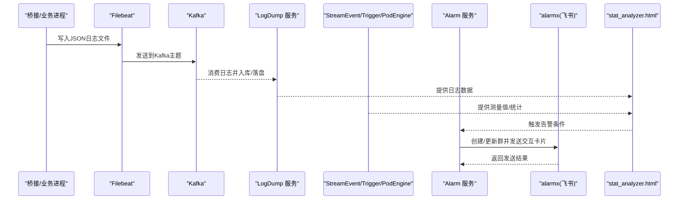
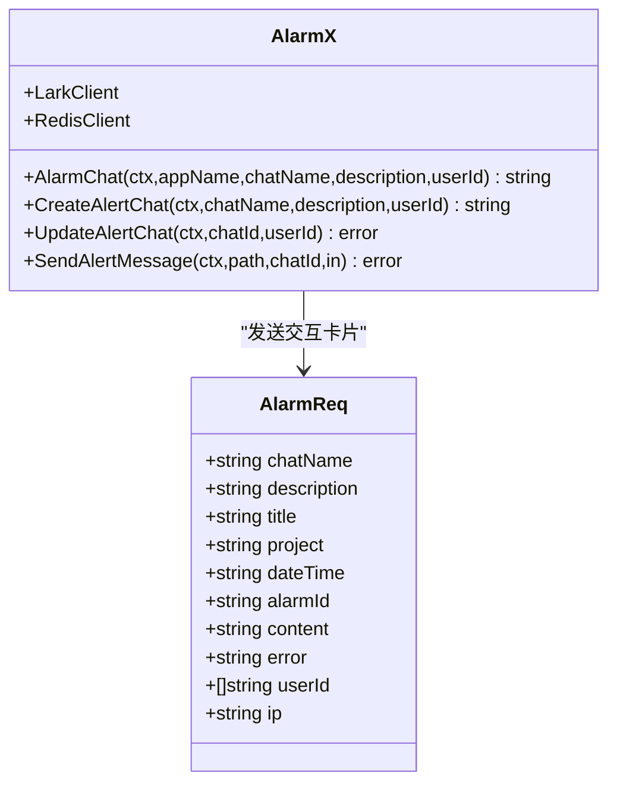
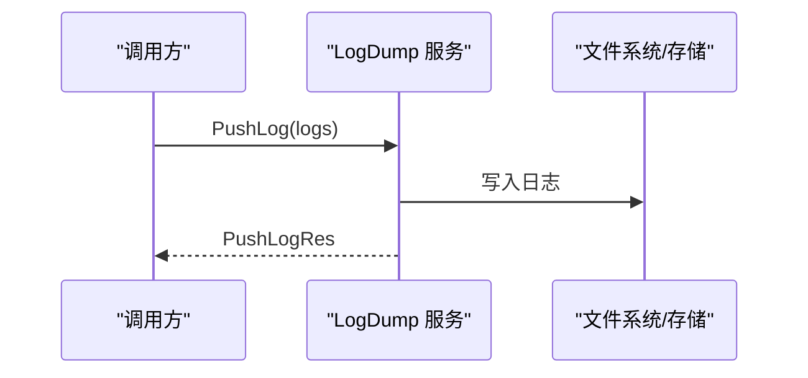
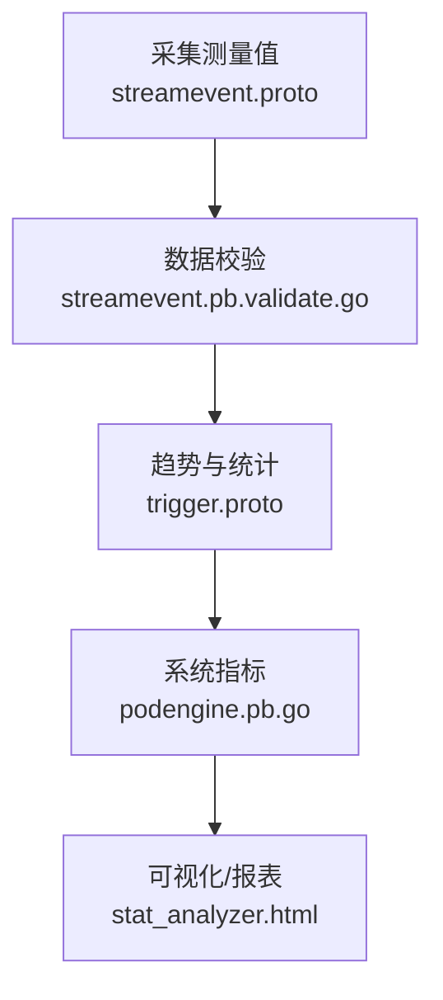
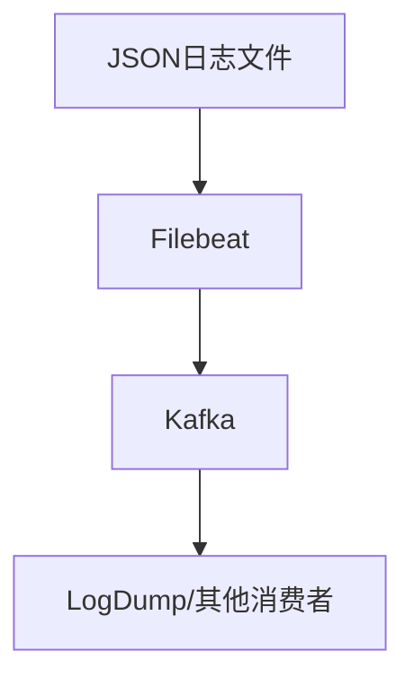
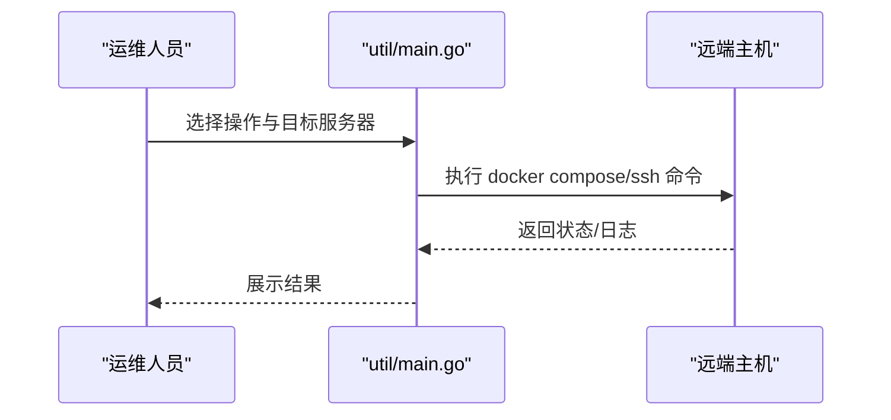
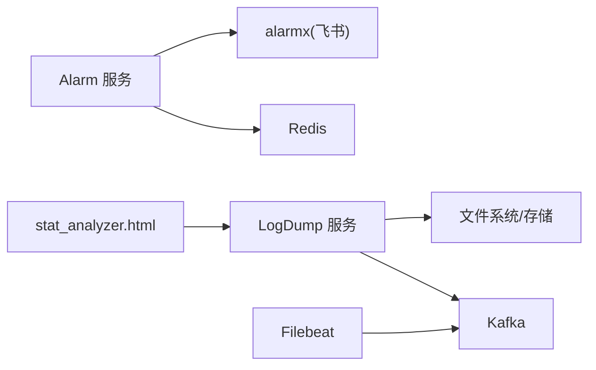

# 监控告警自动化

<cite>
**本文引用的文件**
- [alarm.proto](file://app/alarm/alarm.proto)
- [alarm_grpc.pb.go](file://app/alarm/alarm/alarm_grpc.pb.go)
- [alarmx.go](file://common/alarmx/alarmx.go)
- [alarm.yaml](file://app/alarm/etc/alarm.yaml)
- [logdump.proto](file://app/logdump/logdump.proto)
- [logdump_grpc.pb.go](file://app/logdump/logdump/logdump_grpc.pb.go)
- [logdump.yaml](file://app/logdump/etc/logdump.yaml)
- [filebeat.yml](file://deploy/filebeat/conf/filebeat.yml)
- [docker-compose.yml](file://deploy/docker-compose.yml)
- [stat_analyzer.html](file://deploy/stat_analyzer.html)
- [streamevent.proto](file://facade/streamevent/streamevent.proto)
- [streamevent.pb.validate.go](file://facade/streamevent/streamevent/streamevent.pb.validate.go)
- [podengine.pb.go](file://app/podengine/podengine/podengine.pb.go)
- [trigger.proto](file://app/trigger/trigger.proto)
- [trigger.pb.validate.go](file://app/trigger/trigger/trigger.pb.validate.go)
- [overview.md](file://.trae/skills/zero-skills/best-practices/overview.md)
- [common-issues.md](file://.trae/skills/zero-skills/troubleshooting/common-issues.md)
- [main.go](file://util/main.go)
</cite>

## 目录
1. [简介](#简介)
2. [项目结构](#项目结构)
3. [核心组件](#核心组件)
4. [架构总览](#架构总览)
5. [详细组件分析](#详细组件分析)
6. [依赖分析](#依赖分析)
7. [性能考量](#性能考量)
8. [故障排查指南](#故障排查指南)
9. [结论](#结论)
10. [附录](#附录)

## 简介
本指南面向 zero-service 项目的监控告警自动化建设，围绕“指标体系、告警规则、自动化巡检、智能处理、可视化与工具集成、最佳实践”六大维度，结合现有代码与部署配置，给出可落地的实施路径。项目已具备日志推送、告警通道、消息采集与转发、以及基础的统计分析能力，可在此基础上扩展 Prometheus/Grafana、ELK 等生态，构建统一可观测性平台。

## 项目结构
- 监控相关服务与协议
  - 告警服务：gRPC 协议定义与客户端/服务端桩代码，支持 Ping 与 Alarm 调用；告警通道对接飞书群机器人，支持动态建群与成员管理。
  - 日志推送服务：gRPC 协议定义与客户端/服务端桩代码，支持批量推送日志条目。
  - 事件与度量：facade 层的 streamevent 定义了测量值模型及校验逻辑，可用于业务指标采集。
  - 触发与统计：trigger 定义了历史统计请求/响应模型与校验，便于做趋势分析与容量预警。
  - Pod 引擎：podengine 定义了容器资源统计字段，可用于系统指标采集。
- 日志采集与传输
  - Filebeat 配置：按主题(topic)将桥接产生的 JSON 文本采集并发送至 Kafka。
  - Docker Compose：编排 Kafka、Filebeat、相关服务容器，形成端到端的数据链路。
- 运维与可视化
  - stat_analyzer.html：前端页面对日志进行聚合与统计，输出 CPU、内存、QPS、限流等指标的分组统计与趋势。
  - util/main.go：运维工具，支持远程执行命令、查看日志、进入容器等，辅助巡检与排障。

**图表来源**
- [filebeat.yml:1-122](file://deploy/filebeat/conf/filebeat.yml#L1-L122)
- [docker-compose.yml:1-110](file://deploy/docker-compose.yml#L1-L110)
- [logdump.proto:1-44](file://app/logdump/logdump.proto#L1-L44)
- [alarm.proto:1-34](file://app/alarm/alarm.proto#L1-L34)
- [alarmx.go:1-223](file://common/alarmx/alarmx.go#L1-L223)
- [alarm.yaml:1-26](file://app/alarm/etc/alarm.yaml#L1-L26)
- [streamevent.proto](file://facade/streamevent/streamevent.proto)
- [trigger.proto](file://app/trigger/trigger.proto)
- [podengine.pb.go:1769-1775](file://app/podengine/podengine/podengine.pb.go#L1769-L1775)
- [stat_analyzer.html:862-1307](file://deploy/stat_analyzer.html#L862-L1307)
- [main.go:1-547](file://util/main.go#L1-L547)

**章节来源**
- [filebeat.yml:1-122](file://deploy/filebeat/conf/filebeat.yml#L1-L122)
- [docker-compose.yml:1-110](file://deploy/docker-compose.yml#L1-L110)
- [alarm.proto:1-34](file://app/alarm/alarm.proto#L1-L34)
- [alarmx.go:1-223](file://common/alarmx/alarmx.go#L1-L223)
- [alarm.yaml:1-26](file://app/alarm/etc/alarm.yaml#L1-L26)
- [logdump.proto:1-44](file://app/logdump/logdump.proto#L1-L44)
- [streamevent.proto](file://facade/streamevent/streamevent.proto)
- [trigger.proto](file://app/trigger/trigger.proto)
- [podengine.pb.go:1769-1775](file://app/podengine/podengine/podengine.pb.go#L1769-L1775)
- [stat_analyzer.html:862-1307](file://deploy/stat_analyzer.html#L862-L1307)
- [main.go:1-547](file://util/main.go#L1-L547)

## 核心组件
- 告警服务（Alarm）
  - 协议：提供 Ping、Alarm 两个 RPC，Alarm 请求包含标题、项目、时间、报警ID、内容、错误、用户ID、IP 等字段。
  - 通道：通过 alarmx 封装飞书 IM API，支持创建/更新群聊、拉人入群、发送交互卡片消息。
  - 配置：Redis 缓存群ID，避免重复建群；飞书 AppId/AppSecret/Token/EncryptKey 等参数在配置中声明。
- 日志推送服务（LogDump）
  - 协议：Ping、PushLog，PushLogReq 支持批量日志条目，条目含服务名、等级、序列号、消息与附加字段。
  - 配置：日志落盘路径、保留天数、额外字段白名单等。
- 事件与度量（StreamEvent）
  - 定义了测量值模型（如归一化/缩放值），并配套验证器，便于采集与上报时进行数据校验。
- 触发与统计（Trigger）
  - 定义历史统计请求/响应模型，可用于趋势分析与容量预警。
- Pod 引擎（PodEngine）
  - 定义容器资源统计字段（如存储读写字节、时间戳等），可作为系统指标采集源。
- 日志采集与传输（Filebeat/Kafka）
  - Filebeat 按主题将 JSON 文本采集并发送至 Kafka，Kafka 由 docker-compose 编排。
- 可视化与巡检（stat_analyzer.html/util/main.go）
  - 前端统计分析页面对日志进行聚合，输出 CPU、内存、QPS、限流等指标；运维工具支持远程执行与容器交互。

**章节来源**
- [alarm.proto:1-34](file://app/alarm/alarm.proto#L1-L34)
- [alarm_grpc.pb.go:34-159](file://app/alarm/alarm/alarm_grpc.pb.go#L34-L159)
- [alarmx.go:1-223](file://common/alarmx/alarmx.go#L1-L223)
- [alarm.yaml:1-26](file://app/alarm/etc/alarm.yaml#L1-L26)
- [logdump.proto:1-44](file://app/logdump/logdump.proto#L1-L44)
- [logdump_grpc.pb.go:80-161](file://app/logdump/logdump/logdump_grpc.pb.go#L80-L161)
- [logdump.yaml:1-26](file://app/logdump/etc/logdump.yaml#L1-L26)
- [filebeat.yml:1-122](file://deploy/filebeat/conf/filebeat.yml#L1-L122)
- [docker-compose.yml:1-110](file://deploy/docker-compose.yml#L1-L110)
- [streamevent.pb.validate.go:1726-1922](file://facade/streamevent/streamevent/streamevent.pb.validate.go#L1726-L1922)
- [trigger.pb.validate.go:2700-2904](file://app/trigger/trigger/trigger.pb.validate.go#L2700-L2904)
- [podengine.pb.go:1769-1775](file://app/podengine/podengine/podengine.pb.go#L1769-L1775)
- [stat_analyzer.html:862-1307](file://deploy/stat_analyzer.html#L862-L1307)
- [main.go:1-547](file://util/main.go#L1-L547)

## 架构总览
下图展示了从采集、传输、消费到告警与可视化的整体流程，以及与外部系统的集成点。

**图表来源**
- [filebeat.yml:1-122](file://deploy/filebeat/conf/filebeat.yml#L1-L122)
- [docker-compose.yml:1-110](file://deploy/docker-compose.yml#L1-L110)
- [logdump.proto:1-44](file://app/logdump/logdump.proto#L1-L44)
- [alarm.proto:1-34](file://app/alarm/alarm.proto#L1-L34)
- [alarmx.go:1-223](file://common/alarmx/alarmx.go#L1-L223)
- [stat_analyzer.html:862-1307](file://deploy/stat_analyzer.html#L862-L1307)

## 详细组件分析

### 告警服务（Alarm）与通道（alarmx）
- 协议与调用
  - Ping：健康检查。
  - Alarm：发送告警，包含标题、项目、时间、报警ID、内容、错误、用户ID、IP 等。
- 通道与建群
  - 通过 Redis 缓存群ID，首次创建后复用；支持拉人入群与更新群信息。
  - 通过飞书 IM API 发送交互卡片，卡片内容来自模板文件，变量替换后发送。
- 配置要点
  - 飞书 AppId、AppSecret、EncryptKey、VerificationToken。
  - Redis 地址与键空间。
  - 告警模板路径。

**图表来源**
- [alarm.proto:14-28](file://app/alarm/alarm.proto#L14-L28)
- [alarm_grpc.pb.go:34-159](file://app/alarm/alarm/alarm_grpc.pb.go#L34-L159)
- [alarmx.go:1-223](file://common/alarmx/alarmx.go#L1-L223)
- [alarm.yaml:1-26](file://app/alarm/etc/alarm.yaml#L1-L26)

**章节来源**
- [alarm.proto:1-34](file://app/alarm/alarm.proto#L1-L34)
- [alarm_grpc.pb.go:34-159](file://app/alarm/alarm/alarm_grpc.pb.go#L34-L159)
- [alarmx.go:1-223](file://common/alarmx/alarmx.go#L1-L223)
- [alarm.yaml:1-26](file://app/alarm/etc/alarm.yaml#L1-L26)

### 日志推送服务（LogDump）
- 协议与用途
  - Ping：健康检查。
  - PushLog：批量推送日志条目，条目包含服务名、等级、序列号、消息与附加字段。
- 配置与落盘
  - 日志模式、编码、落盘路径、保留天数、额外字段白名单等。
- 与采集链路的关系
  - Filebeat 将桥接产生的 JSON 文本采集并发送至 Kafka；LogDump 作为消费者之一，接收并持久化。

**图表来源**
- [logdump.proto:1-44](file://app/logdump/logdump.proto#L1-L44)
- [logdump_grpc.pb.go:80-161](file://app/logdump/logdump/logdump_grpc.pb.go#L80-L161)
- [logdump.yaml:1-26](file://app/logdump/etc/logdump.yaml#L1-L26)

**章节来源**
- [logdump.proto:1-44](file://app/logdump/logdump.proto#L1-L44)
- [logdump_grpc.pb.go:80-161](file://app/logdump/logdump/logdump_grpc.pb.go#L80-L161)
- [logdump.yaml:1-26](file://app/logdump/etc/logdump.yaml#L1-L26)

### 事件与度量（StreamEvent）、触发与统计（Trigger）、系统指标（PodEngine）
- StreamEvent
  - 定义测量值模型（如归一化/缩放值）与校验器，确保上报数据符合约束。
- Trigger
  - 定义历史统计请求/响应模型，可用于趋势分析与容量预警。
- PodEngine
  - 定义容器资源统计字段（如存储读写字节、时间戳等），可作为系统指标采集源。

**图表来源**
- [streamevent.proto](file://facade/streamevent/streamevent.proto)
- [streamevent.pb.validate.go:1726-1922](file://facade/streamevent/streamevent/streamevent.pb.validate.go#L1726-L1922)
- [trigger.proto](file://app/trigger/trigger.proto)
- [trigger.pb.validate.go:2700-2904](file://app/trigger/trigger/trigger.pb.validate.go#L2700-L2904)
- [podengine.pb.go:1769-1775](file://app/podengine/podengine/podengine.pb.go#L1769-L1775)
- [stat_analyzer.html:862-1307](file://deploy/stat_analyzer.html#L862-L1307)

**章节来源**
- [streamevent.pb.validate.go:1726-1922](file://facade/streamevent/streamevent/streamevent.pb.validate.go#L1726-L1922)
- [trigger.pb.validate.go:2700-2904](file://app/trigger/trigger/trigger.pb.validate.go#L2700-L2904)
- [podengine.pb.go:1769-1775](file://app/podengine/podengine/podengine.pb.go#L1769-L1775)
- [stat_analyzer.html:862-1307](file://deploy/stat_analyzer.html#L862-L1307)

### 日志采集与传输（Filebeat/Kafka）
- Filebeat
  - 监听桥接输出目录的 JSON 文件，按主题（topic）动态选择 Kafka 主题，进行多行解析与 JSON 字段解码。
- Kafka
  - 由 docker-compose 编排，提供高吞吐的消息传输能力。
- 运维
  - docker-compose 同时启动 Kafdrop，便于查看主题与消息。

**图表来源**
- [filebeat.yml:1-122](file://deploy/filebeat/conf/filebeat.yml#L1-L122)
- [docker-compose.yml:1-110](file://deploy/docker-compose.yml#L1-L110)

**章节来源**
- [filebeat.yml:1-122](file://deploy/filebeat/conf/filebeat.yml#L1-L122)
- [docker-compose.yml:1-110](file://deploy/docker-compose.yml#L1-L110)

### 可视化与自动化巡检（stat_analyzer.html/util/main.go）
- stat_analyzer.html
  - 对日志进行聚合与统计，输出 CPU、内存、QPS、限流等指标的分组统计与趋势。
- util/main.go
  - 远程执行命令、查看日志、进入容器、镜像保存等，支撑自动化巡检与快速排障。

**图表来源**
- [stat_analyzer.html:862-1307](file://deploy/stat_analyzer.html#L862-L1307)
- [main.go:1-547](file://util/main.go#L1-L547)

**章节来源**
- [stat_analyzer.html:862-1307](file://deploy/stat_analyzer.html#L862-L1307)
- [main.go:1-547](file://util/main.go#L1-L547)

## 依赖分析
- 组件耦合
  - Alarm 服务依赖 alarmx（飞书 IM）与 Redis（群ID缓存）。
  - LogDump 服务依赖文件系统/存储，配合 Filebeat/Kafka 形成端到端链路。
  - 可视化依赖 stat_analyzer.html 对日志与指标进行聚合。
- 外部依赖
  - 飞书 SDK：用于 IM 交互与卡片发送。
  - Redis：用于群ID缓存。
  - Kafka：用于日志传输。
- 潜在风险
  - 告警通道依赖飞书 API 的可用性与鉴权配置。
  - Filebeat/Kafka 的稳定性影响日志采集与后续分析。

**图表来源**
- [alarmx.go:1-223](file://common/alarmx/alarmx.go#L1-L223)
- [alarm.yaml:1-26](file://app/alarm/etc/alarm.yaml#L1-L26)
- [logdump.yaml:1-26](file://app/logdump/etc/logdump.yaml#L1-L26)
- [filebeat.yml:1-122](file://deploy/filebeat/conf/filebeat.yml#L1-L122)
- [docker-compose.yml:1-110](file://deploy/docker-compose.yml#L1-L110)
- [stat_analyzer.html:862-1307](file://deploy/stat_analyzer.html#L862-L1307)

**章节来源**
- [alarmx.go:1-223](file://common/alarmx/alarmx.go#L1-L223)
- [alarm.yaml:1-26](file://app/alarm/etc/alarm.yaml#L1-L26)
- [logdump.yaml:1-26](file://app/logdump/etc/logdump.yaml#L1-L26)
- [filebeat.yml:1-122](file://deploy/filebeat/conf/filebeat.yml#L1-L122)
- [docker-compose.yml:1-110](file://deploy/docker-compose.yml#L1-L110)
- [stat_analyzer.html:862-1307](file://deploy/stat_analyzer.html#L862-L1307)

## 性能考量
- 日志采集
  - Filebeat 多行解析与 JSON 解码会带来一定 CPU 开销，建议根据磁盘与 CPU 资源调整扫描频率与关闭策略。
- 消息传输
  - Kafka 分区数量与压缩策略影响吞吐与延迟，需结合业务峰值进行评估。
- 告警通道
  - 飞书 API 调用存在网络抖动与限流风险，建议在 alarmx 中加入重试与退避策略，并对卡片内容进行大小限制。
- 可视化
  - 前端聚合逻辑对大体量日志的计算复杂度较高，建议分页或分时段查询，避免一次性渲染过多数据。

[本节为通用指导，无需特定文件来源]

## 故障排查指南
- 告警通道问题
  - 症状：连接飞书失败、鉴权错误。
  - 排查：核对 AppId/AppSecret/EncryptKey/VerificationToken 配置；检查网络连通性与代理设置。
  - 参考：常见问题文档中的 Redis 连接问题排查方法，可类比定位鉴权与网络问题。
- 日志采集问题
  - 症状：Filebeat 无法读取 JSON 文件或解析失败。
  - 排查：检查 paths 与多行 pattern；确认文件权限与 inode 跟踪；查看 processors 中的 drop_event 条件是否误删。
- 服务不可达
  - 症状：404 或路由不生效。
  - 排查：确认路由前缀与注册；检查中间件与 Stat 配置。
- 运维工具
  - 使用 util/main.go 远程查看日志、进入容器、执行命令，快速定位问题。

**章节来源**
- [common-issues.md:171-274](file://.trae/skills/zero-skills/troubleshooting/common-issues.md#L171-L274)
- [filebeat.yml:1-122](file://deploy/filebeat/conf/filebeat.yml#L1-L122)
- [logdump.yaml:1-26](file://app/logdump/etc/logdump.yaml#L1-L26)
- [main.go:1-547](file://util/main.go#L1-L547)

## 结论
zero-service 已具备日志采集、传输、存储与可视化的基础能力，并通过 Alarm 服务与 alarmx 实现了告警通道的自动化。建议在此基础上引入 Prometheus/Grafana 与 ELK Stack，完善系统指标与日志检索能力，形成统一的可观测性平台，进一步提升监控告警自动化水平与运维效率。

[本节为总结，无需特定文件来源]

## 附录

### 监控指标体系与采集建议
- 系统指标
  - 来源：PodEngine 定义的容器资源统计字段；结合 stat_analyzer.html 的系统指标统计。
  - 建议：采集 CPU、内存、磁盘 IO、网络 IO、GC 次数等，用于健康检查与容量预警。
- 应用指标
  - 来源：LogDump 推送的日志条目；StreamEvent 的测量值模型。
  - 建议：QPS、响应时间（avg/med/p90/p99）、错误率、缓存命中率、限流统计等。
- 业务指标
  - 来源：Trigger 的历史统计模型；facade 层的业务事件模型。
  - 建议：按业务维度（如订单、任务）进行聚合与趋势分析。

**章节来源**
- [podengine.pb.go:1769-1775](file://app/podengine/podengine/podengine.pb.go#L1769-L1775)
- [stat_analyzer.html:862-1307](file://deploy/stat_analyzer.html#L862-L1307)
- [logdump.proto:1-44](file://app/logdump/logdump.proto#L1-L44)
- [streamevent.proto](file://facade/streamevent/streamevent.proto)
- [trigger.proto](file://app/trigger/trigger.proto)

### 告警规则设计建议
- 阈值设置
  - CPU/内存/磁盘使用率：短期峰值与长期均值结合；区分不同环境阈值。
  - QPS/错误率：基于历史基线与 SLA 设定；引入滑动窗口与异常检测。
  - 缓存命中率：设定下限阈值，异常时触发 P1 告警。
- 告警级别
  - P0：线上事故，立即通知值班与相关负责人。
  - P1/P2/P3：按影响范围与恢复难度分级。
- 抑制策略
  - 同一周期内的同类告警合并；根因告警优先，衍生告警抑制。

[本节为通用指导，无需特定文件来源]

### 自动化巡检机制
- 健康检查
  - 定期调用各服务的 Ping 接口，记录响应时间与成功率。
- 性能监控
  - 采集系统与应用指标，结合 stat_analyzer.html 的趋势分析，识别异常波动。
- 容量预警
  - 基于历史统计与增长趋势，提前 N 天发出容量预警。

**章节来源**
- [logdump_grpc.pb.go:80-161](file://app/logdump/logdump/logdump_grpc.pb.go#L80-L161)
- [stat_analyzer.html:862-1307](file://deploy/stat_analyzer.html#L862-L1307)
- [trigger.pb.validate.go:2700-2904](file://app/trigger/trigger/trigger.pb.validate.go#L2700-L2904)

### 智能告警处理
- 告警聚合
  - 同一周期内同类告警合并，减少噪音。
- 根因分析
  - 结合日志、指标与链路追踪，定位异常根因。
- 自动修复建议
  - 基于历史案例与规则库，提供一键修复建议或脚本。

[本节为通用指导，无需特定文件来源]

### 监控数据可视化
- 仪表板设计
  - CPU/内存/IO、QPS/错误率、缓存命中率、限流统计、业务指标趋势。
- 趋势分析
  - 使用 stat_analyzer.html 的聚合逻辑，按分钟/小时粒度生成趋势。
- 报告生成
  - 周报/月报：汇总关键指标与异常事件，形成可读性强的报告。

**章节来源**
- [stat_analyzer.html:862-1307](file://deploy/stat_analyzer.html#L862-L1307)

### 监控工具集成
- Prometheus
  - 导出系统与应用指标，结合 Blackbox Exporter 做健康检查探测。
- Grafana
  - 基于 Prometheus 数据源构建仪表板，接入告警通道。
- ELK Stack
  - Filebeat 采集日志，Elasticsearch 存储，Kibana 可视化检索。
- 飞书告警
  - 通过 alarmx 将告警推送到飞书群，支持交互式卡片与处理按钮。

**章节来源**
- [filebeat.yml:1-122](file://deploy/filebeat/conf/filebeat.yml#L1-L122)
- [alarmx.go:1-223](file://common/alarmx/alarmx.go#L1-L223)
- [alarm.yaml:1-26](file://app/alarm/etc/alarm.yaml#L1-L26)

### 监控最佳实践
- 监控策略制定
  - 明确关键指标与阈值，建立分级告警与抑制策略。
- 告警噪音控制
  - 合理设置静默窗口、告警合并与抑制规则。
- 运维效率提升
  - 使用 util/main.go 进行远程巡检与快速排障；标准化日志格式与字段。

**章节来源**
- [overview.md:214-281](file://.trae/skills/zero-skills/best-practices/overview.md#L214-L281)
- [main.go:1-547](file://util/main.go#L1-L547)