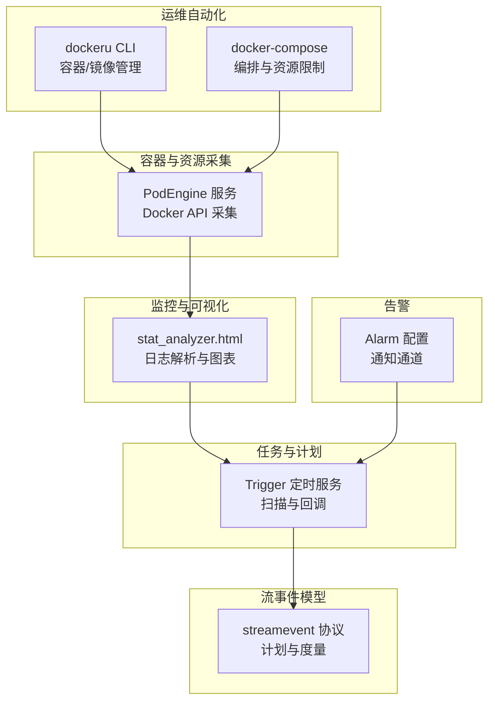
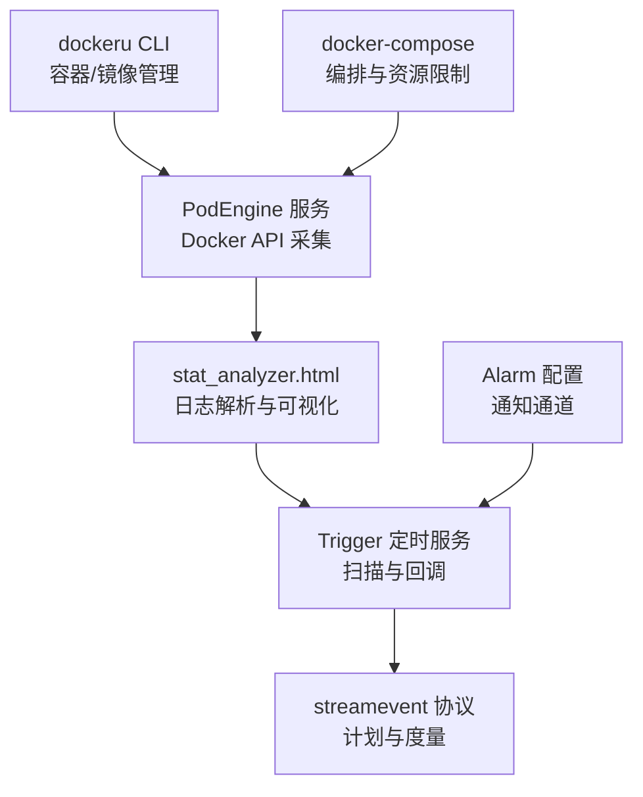
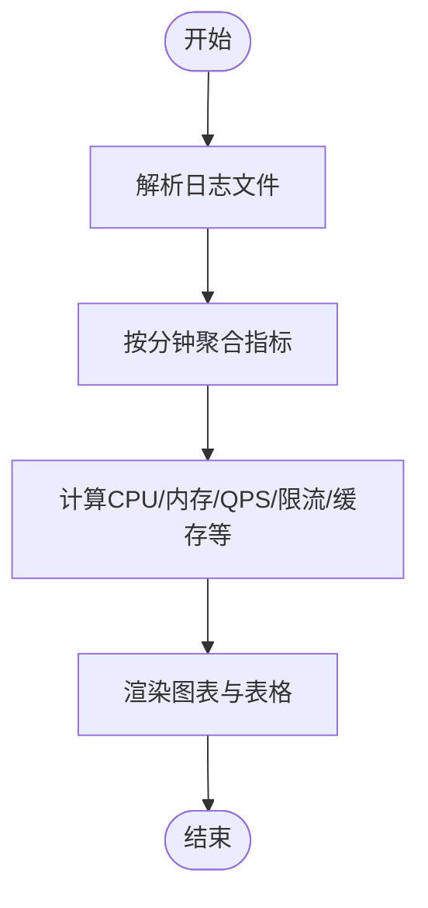
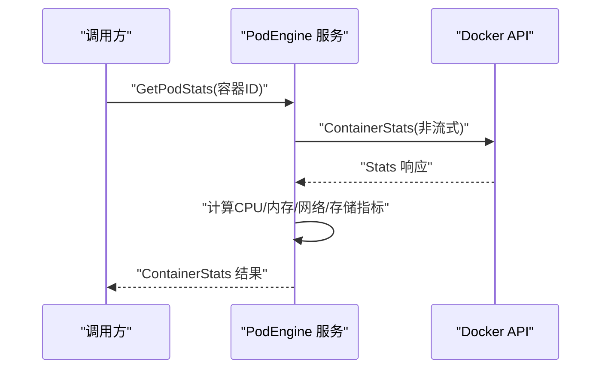
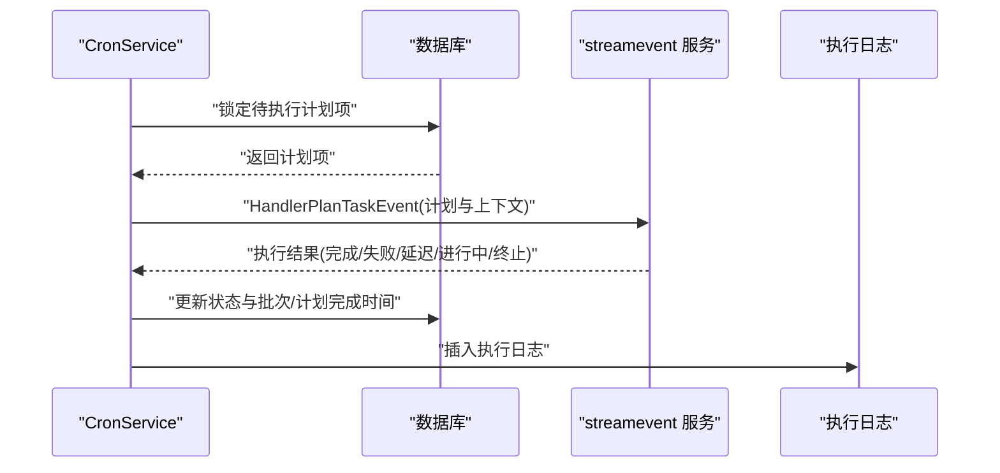
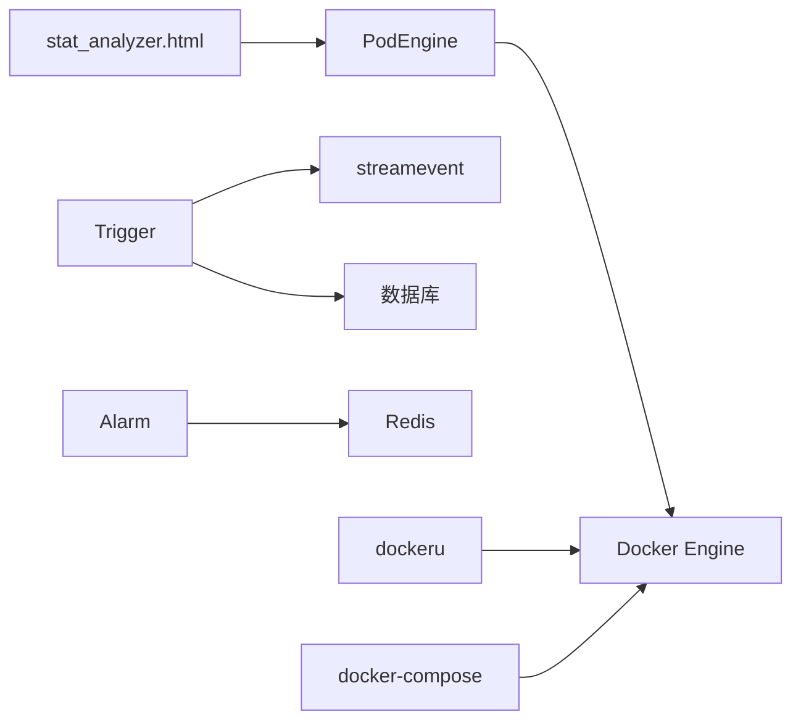

# 资源与成本优化

<cite>
**本文引用的文件**   
- [deploy/stat_analyzer.html](file://deploy/stat_analyzer.html)
- [app/podengine/internal/logic/getpodstatslogic.go](file://app/podengine/internal/logic/getpodstatslogic.go)
- [app/podengine/podengine/podengine.pb.go](file://app/podengine/podengine/podengine.pb.go)
- [app/podengine/podengine/podengine_grpc.pb.go](file://app/podengine/podengine/podengine_grpc.pb.go)
- [app/trigger/cron/cronservice.go](file://app/trigger/cron/cronservice.go)
- [app/alarm/etc/alarm.yaml](file://app/alarm/etc/alarm.yaml)
- [util/dockeru/main.go](file://util/dockeru/main.go)
- [deploy/docker-compose.yml](file://deploy/docker-compose.yml)
- [facade/streamevent/streamevent/streamevent.pb.go](file://facade/streamevent/streamevent/streamevent.pb.go)
- [facade/streamevent/streamevent/streamevent.pb.validate.go](file://facade/streamevent/streamevent/streamevent.pb.validate.go)
- [.trae/skills/dev-environment/SKILL.md](file://.trae/skills/dev-environment/SKILL.md)
- [.trae/skills/zero-skills/best-practices/overview.md](file://.trae/skills/zero-skills/best-practices/overview.md)
</cite>

## 目录
1. [简介](#简介)
2. [项目结构](#项目结构)
3. [核心组件](#核心组件)
4. [架构总览](#架构总览)
5. [详细组件分析](#详细组件分析)
6. [依赖分析](#依赖分析)
7. [性能考虑](#性能考虑)
8. [故障排查指南](#故障排查指南)
9. [结论](#结论)
10. [附录](#附录)

## 简介
本指南面向 zero-service 的资源与成本优化，围绕资源监控与分析、自动伸缩策略、成本分析与优化、资源清理与回收、预算控制与告警、云资源优化以及运维自动化工具展开。文档结合仓库中的实际组件与实现，提供可落地的实践建议与可视化流程。

## 项目结构
- 资源监控与可视化：通过前端页面对 Go-Zero 统计日志进行解析与可视化，涵盖内存、CPU、QPS、限流等关键指标。
- 容器与资源采集：PodEngine 服务通过 Docker API 采集容器的 CPU、内存、网络、存储等指标。
- 任务与计划：Trigger 服务的定时扫描与回调执行，支撑资源调度与批处理。
- 告警与通知：Alarm 服务负责告警配置与通知通道。
- 运维自动化：util/dockeru 提供容器与镜像管理的 CLI 工具；docker-compose 提供本地编排与资源限制。
- 流事件模型：streamevent 提供计划与度量数据的协议定义与校验。

**图表来源**
- [deploy/stat_analyzer.html:278-377](file://deploy/stat_analyzer.html#L278-L377)
- [app/podengine/internal/logic/getpodstatslogic.go:32-133](file://app/podengine/internal/logic/getpodstatslogic.go#L32-L133)
- [app/trigger/cron/cronservice.go:58-184](file://app/trigger/cron/cronservice.go#L58-L184)
- [app/alarm/etc/alarm.yaml:1-26](file://app/alarm/etc/alarm.yaml#L1-L26)
- [util/dockeru/main.go:35-272](file://util/dockeru/main.go#L35-L272)
- [deploy/docker-compose.yml:1-110](file://deploy/docker-compose.yml#L1-L110)
- [facade/streamevent/streamevent/streamevent.pb.go:1132-1331](file://facade/streamevent/streamevent/streamevent.pb.go#L1132-L1331)

**章节来源**
- [deploy/stat_analyzer.html:278-377](file://deploy/stat_analyzer.html#L278-L377)
- [deploy/docker-compose.yml:1-110](file://deploy/docker-compose.yml#L1-L110)

## 核心组件
- 资源监控与分析
  - 前端统计分析工具：解析 Go-Zero stat 日志，生成内存、CPU、QPS、限流、缓存命中率等趋势图与服务分布。
  - 容器指标采集：PodEngine 通过 Docker API 获取 CPU 百分比、内存使用与限制、网络收发字节、存储读写字节等。
- 自动伸缩策略
  - 基于指标阈值的触发：结合 Trigger 的定时扫描与回调，实现基于负载的扩缩容动作。
  - 混合扩展：结合水平扩展（多副本）与垂直扩展（资源配额提升）。
- 成本分析与优化
  - 资源利用率分析：CPU/内存/IO/网络使用率与峰值对比，识别浪费与瓶颈。
  - 成本归集：按服务维度汇总资源消耗，结合预算与告警进行成本控制。
- 资源清理与回收
  - 闲置资源识别：利用 dockeru CLI 列出容器与镜像，结合状态筛选。
  - 自动清理：镜像清理、悬空镜像清理、容器日志清理。
- 预算控制与告警
  - 预算设置：在编排层设置内存/CPU 上限，或在应用层通过配置项限制。
  - 超支提醒：Alarm 服务配置通知通道，结合 Trigger 的扫描逻辑触发告警。
- 云资源优化
  - 实例类型选择：结合历史负载与成本，选择合适规格与计费模式。
  - 存储与网络优化：减少不必要的 IO 与带宽，采用压缩与缓存策略。
- 运维自动化
  - 资源调度：docker-compose 编排与资源限制。
  - 批量操作：dockeru CLI 支持批量启动/停止/重启/进入容器。
  - 批量清理：镜像导出与清理、悬空镜像清理。

**章节来源**
- [deploy/stat_analyzer.html:278-377](file://deploy/stat_analyzer.html#L278-L377)
- [app/podengine/internal/logic/getpodstatslogic.go:32-133](file://app/podengine/internal/logic/getpodstatslogic.go#L32-L133)
- [app/trigger/cron/cronservice.go:58-184](file://app/trigger/cron/cronservice.go#L58-L184)
- [app/alarm/etc/alarm.yaml:1-26](file://app/alarm/etc/alarm.yaml#L1-L26)
- [util/dockeru/main.go:35-272](file://util/dockeru/main.go#L35-L272)
- [deploy/docker-compose.yml:54-99](file://deploy/docker-compose.yml#L54-L99)
- [.trae/skills/zero-skills/best-practices/overview.md:697-754](file://.trae/skills/zero-skills/best-practices/overview.md#L697-L754)

## 架构总览
下图展示了资源监控、容器指标采集、任务调度、告警与运维自动化之间的交互关系。

**图表来源**
- [deploy/stat_analyzer.html:278-377](file://deploy/stat_analyzer.html#L278-L377)
- [app/podengine/internal/logic/getpodstatslogic.go:32-133](file://app/podengine/internal/logic/getpodstatslogic.go#L32-L133)
- [app/trigger/cron/cronservice.go:58-184](file://app/trigger/cron/cronservice.go#L58-L184)
- [app/alarm/etc/alarm.yaml:1-26](file://app/alarm/etc/alarm.yaml#L1-L26)
- [util/dockeru/main.go:35-272](file://util/dockeru/main.go#L35-L272)
- [deploy/docker-compose.yml:1-110](file://deploy/docker-compose.yml#L1-L110)
- [facade/streamevent/streamevent/streamevent.pb.go:1132-1331](file://facade/streamevent/streamevent/streamevent.pb.go#L1132-L1331)

## 详细组件分析

### 组件一：资源监控与分析（stat_analyzer.html）
- 功能要点
  - 支持内存使用、限流状态、性能指标等日志类型的解析与可视化。
  - 提供内存趋势、系统指标综合图、服务分布、限流状态分析、缓存命中率趋势等图表。
  - 支持分页表格、服务筛选、图表全屏查看与交互操作。
- 数据聚合与计算
  - 按分钟粒度聚合日志，计算 CPU 最大值、内存均值、GC 次数、QPS 与丢弃数等。
  - 支持缓存命中率与响应时间分位数统计。
- 优化建议
  - 将日志采集与解析流程标准化，统一字段命名与时间格式。
  - 增加异常检测与离群点标注，辅助定位异常时段。

**图表来源**
- [deploy/stat_analyzer.html:774-800](file://deploy/stat_analyzer.html#L774-L800)
- [deploy/stat_analyzer.html:1145-1327](file://deploy/stat_analyzer.html#L1145-L1327)

**章节来源**
- [deploy/stat_analyzer.html:278-377](file://deploy/stat_analyzer.html#L278-L377)
- [deploy/stat_analyzer.html:1145-1327](file://deploy/stat_analyzer.html#L1145-L1327)

### 组件二：容器指标采集（PodEngine）
- 功能要点
  - 通过 Docker API 获取容器统计信息，计算 CPU 使用百分比、内存使用与限制、网络收发字节、存储读写字节。
  - 返回结构化指标，便于上层监控与告警。
- 数据结构
  - 请求/响应消息体包含容器 ID、名称、CPU/内存/网络/存储指标及时间戳。
- 优化建议
  - 增加重试与降级策略，避免单次采集失败影响整体监控。
  - 对高并发场景增加指标缓存与去抖动处理。

**图表来源**
- [app/podengine/internal/logic/getpodstatslogic.go:32-133](file://app/podengine/internal/logic/getpodstatslogic.go#L32-L133)
- [app/podengine/podengine/podengine_grpc.pb.go:55-275](file://app/podengine/podengine/podengine_grpc.pb.go#L55-L275)
- [app/podengine/podengine/podengine.pb.go:958-1059](file://app/podengine/podengine/podengine.pb.go#L958-L1059)

**章节来源**
- [app/podengine/internal/logic/getpodstatslogic.go:32-133](file://app/podengine/internal/logic/getpodstatslogic.go#L32-L133)
- [app/podengine/podengine/podengine.pb.go:958-1059](file://app/podengine/podengine/podengine.pb.go#L958-L1059)
- [app/podengine/podengine/podengine_grpc.pb.go:55-275](file://app/podengine/podengine/podengine_grpc.pb.go#L55-L275)

### 组件三：任务与计划（Trigger 定时服务）
- 功能要点
  - 周期性扫描计划执行项，加锁后回调 streamevent 服务，根据执行结果更新状态与日志。
  - 支持延迟、进行中、完成、终止等多种状态流转。
- 优化建议
  - 增加重试与幂等设计，避免重复执行。
  - 将状态更新与日志插入解耦，降低阻塞风险。

**图表来源**
- [app/trigger/cron/cronservice.go:58-184](file://app/trigger/cron/cronservice.go#L58-L184)
- [app/trigger/cron/cronservice.go:203-468](file://app/trigger/cron/cronservice.go#L203-L468)
- [facade/streamevent/streamevent/streamevent.pb.go:1132-1331](file://facade/streamevent/streamevent/streamevent.pb.go#L1132-L1331)

**章节来源**
- [app/trigger/cron/cronservice.go:58-184](file://app/trigger/cron/cronservice.go#L58-L184)
- [app/trigger/cron/cronservice.go:203-468](file://app/trigger/cron/cronservice.go#L203-L468)
- [facade/streamevent/streamevent/streamevent.pb.go:1132-1331](file://facade/streamevent/streamevent/streamevent.pb.go#L1132-L1331)

### 组件四：告警与通知（Alarm）
- 功能要点
  - 通过配置文件定义 Redis、Telemetry、AppId/AppSecret/EncryptKey/VerificationToken 等参数。
  - 提供告警通知通道，可与 Trigger 的扫描逻辑联动。
- 优化建议
  - 增加告警分级与抑制策略，避免风暴。
  - 将告警规则与阈值参数化，便于动态调整。

**章节来源**
- [app/alarm/etc/alarm.yaml:1-26](file://app/alarm/etc/alarm.yaml#L1-L26)

### 组件五：运维自动化（dockeru CLI 与 docker-compose）
- 功能要点
  - dockeru CLI 支持容器日志、状态、启动/停止/重启、进入容器、镜像列表、镜像导出、悬空镜像清理等。
  - docker-compose 提供服务编排与资源限制（如内存上限），便于本地与测试环境的成本控制。
- 优化建议
  - 将常用操作封装为脚本，支持批量执行与回滚。
  - 在 CI/CD 中集成镜像导出与加载流程，减少部署时间。

**章节来源**
- [util/dockeru/main.go:35-272](file://util/dockeru/main.go#L35-L272)
- [deploy/docker-compose.yml:54-99](file://deploy/docker-compose.yml#L54-L99)
- [.trae/skills/dev-environment/SKILL.md:142-200](file://.trae/skills/dev-environment/SKILL.md#L142-L200)

## 依赖分析
- 组件耦合
  - stat_analyzer.html 依赖日志格式与字段规范；与 Trigger 的扫描结果存在间接关联。
  - PodEngine 依赖 Docker API，输出指标被 stat_analyzer.html 使用。
  - Trigger 依赖 streamevent 协议与数据库；与 Alarm 配置存在协作关系。
  - dockeru 与 docker-compose 为运维工具，服务于资源调度与清理。
- 外部依赖
  - Docker Engine、Kafka/Filebeat（在 docker-compose 中体现）、Redis（Alarm）、OpenTelemetry（可选）。

**图表来源**
- [deploy/stat_analyzer.html:278-377](file://deploy/stat_analyzer.html#L278-L377)
- [app/podengine/internal/logic/getpodstatslogic.go:32-133](file://app/podengine/internal/logic/getpodstatslogic.go#L32-L133)
- [app/trigger/cron/cronservice.go:58-184](file://app/trigger/cron/cronservice.go#L58-L184)
- [app/alarm/etc/alarm.yaml:1-26](file://app/alarm/etc/alarm.yaml#L1-L26)
- [util/dockeru/main.go:35-272](file://util/dockeru/main.go#L35-L272)
- [deploy/docker-compose.yml:1-110](file://deploy/docker-compose.yml#L1-L110)
- [facade/streamevent/streamevent/streamevent.pb.go:1132-1331](file://facade/streamevent/streamevent/streamevent.pb.go#L1132-L1331)

**章节来源**
- [deploy/stat_analyzer.html:278-377](file://deploy/stat_analyzer.html#L278-L377)
- [app/podengine/internal/logic/getpodstatslogic.go:32-133](file://app/podengine/internal/logic/getpodstatslogic.go#L32-L133)
- [app/trigger/cron/cronservice.go:58-184](file://app/trigger/cron/cronservice.go#L58-L184)
- [app/alarm/etc/alarm.yaml:1-26](file://app/alarm/etc/alarm.yaml#L1-L26)
- [util/dockeru/main.go:35-272](file://util/dockeru/main.go#L35-L272)
- [deploy/docker-compose.yml:1-110](file://deploy/docker-compose.yml#L1-L110)
- [facade/streamevent/streamevent/streamevent.pb.go:1132-1331](file://facade/streamevent/streamevent/streamevent.pb.go#L1132-L1331)

## 性能考虑
- 指标采集频率与窗口
  - 控制 PodEngine 采集间隔，避免频繁调用 Docker API 导致开销增大。
  - stat_analyzer.html 的聚合窗口建议按分钟级，兼顾实时性与性能。
- 数据处理与存储
  - 对高吞吐日志进行采样与降噪，减少前端渲染压力。
  - 将关键指标持久化至时序数据库或指标系统，支持长期趋势分析。
- 扩展性
  - Trigger 的扫描循环应具备自适应休眠策略，避免空转占用 CPU。
  - streamevent 的回调应支持异步与限流，防止下游拥塞。

## 故障排查指南
- 日志解析异常
  - 检查 stat_analyzer.html 的日志字段匹配与时间格式，确保与实际日志一致。
  - 若图表空白，确认文件上传与解析流程未报错。
- 容器指标缺失
  - 确认 PodEngine 能正常连接 Docker API，检查容器状态与权限。
  - 若 CPU/内存为 0，检查采集间隔与 Docker 统计数据可用性。
- 任务执行失败
  - 查看 Trigger 的回调日志与状态更新，确认 streamevent 服务可达。
  - 检查数据库锁与事务一致性，避免死锁与重复执行。
- 告警未触发
  - 核对 Alarm 配置文件中的 AppId/AppSecret/Token 与通知通道。
  - 检查 Trigger 的扫描逻辑是否正确上报执行结果。

**章节来源**
- [deploy/stat_analyzer.html:774-800](file://deploy/stat_analyzer.html#L774-L800)
- [app/podengine/internal/logic/getpodstatslogic.go:32-133](file://app/podengine/internal/logic/getpodstatslogic.go#L32-L133)
- [app/trigger/cron/cronservice.go:203-468](file://app/trigger/cron/cronservice.go#L203-L468)
- [app/alarm/etc/alarm.yaml:1-26](file://app/alarm/etc/alarm.yaml#L1-L26)

## 结论
通过将资源监控（stat_analyzer.html）、容器指标采集（PodEngine）、任务调度（Trigger）、告警（Alarm）与运维自动化（dockeru/docker-compose）有机结合，zero-service 可形成一套闭环的资源与成本优化体系。建议在实践中持续完善指标口径、扩展自动伸缩策略、强化预算与告警联动，并将运维操作标准化与自动化，以实现稳定、高效且低成本的运行。

## 附录
- 云资源优化最佳实践
  - 实例类型选择：参考历史负载与峰值，结合预留实例与 Spot 实例平衡成本与稳定性。
  - 存储优化：采用分层存储与生命周期策略，冷热数据分离。
  - 网络优化：启用压缩与缓存，减少跨区域流量。
- 运维自动化清单
  - 定期清理悬空镜像与无用容器日志。
  - 批量导出镜像以便离线部署与迁移。
  - 在 docker-compose 中设置合理的资源上限，避免资源争用。

**章节来源**
- [.trae/skills/zero-skills/best-practices/overview.md:697-754](file://.trae/skills/zero-skills/best-practices/overview.md#L697-L754)
- [.trae/skills/dev-environment/SKILL.md:142-200](file://.trae/skills/dev-environment/SKILL.md#L142-L200)