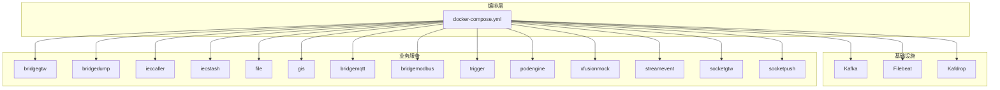
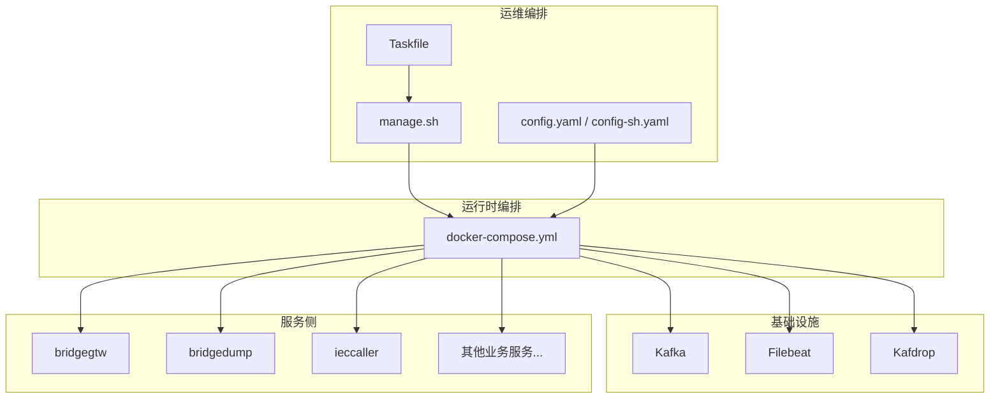
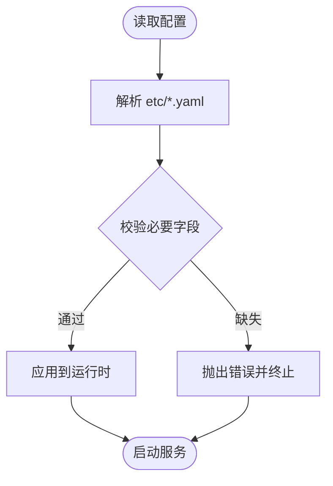
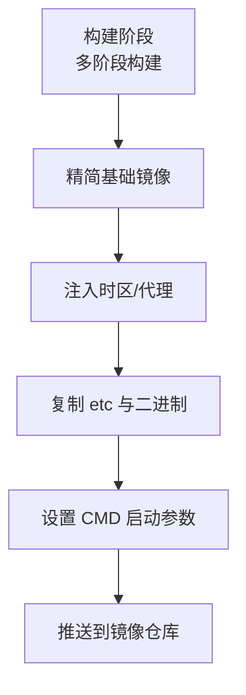
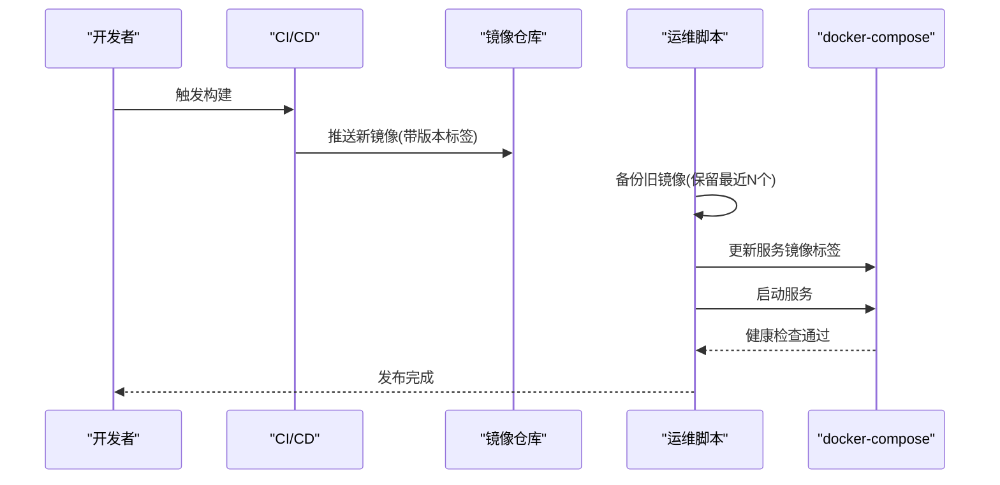
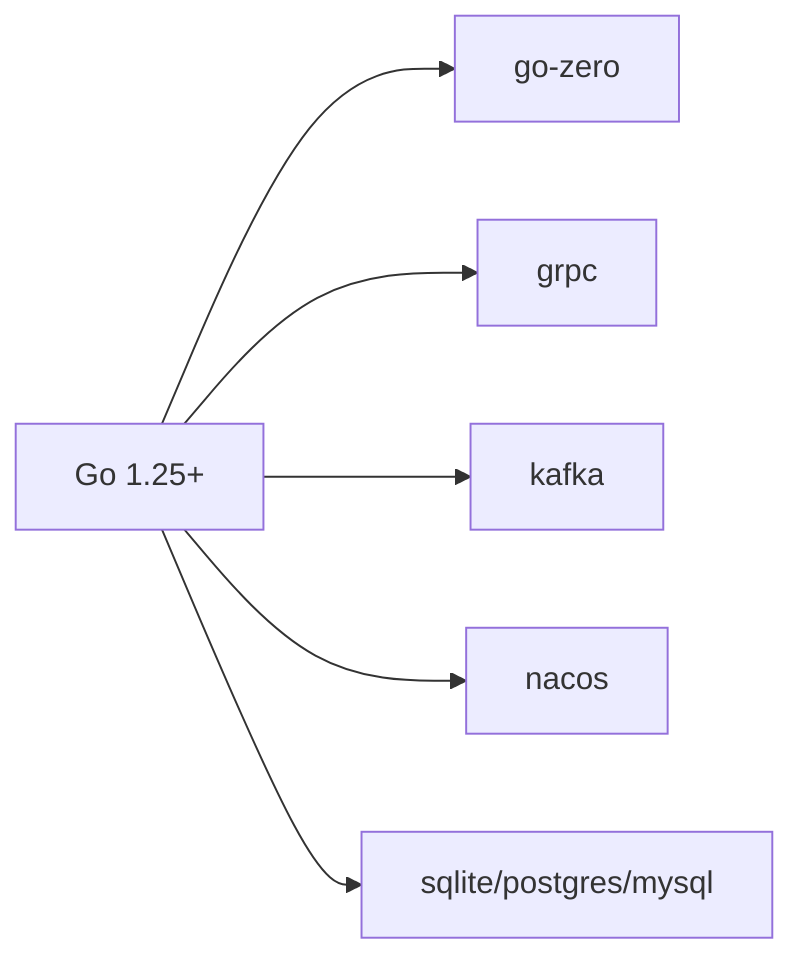
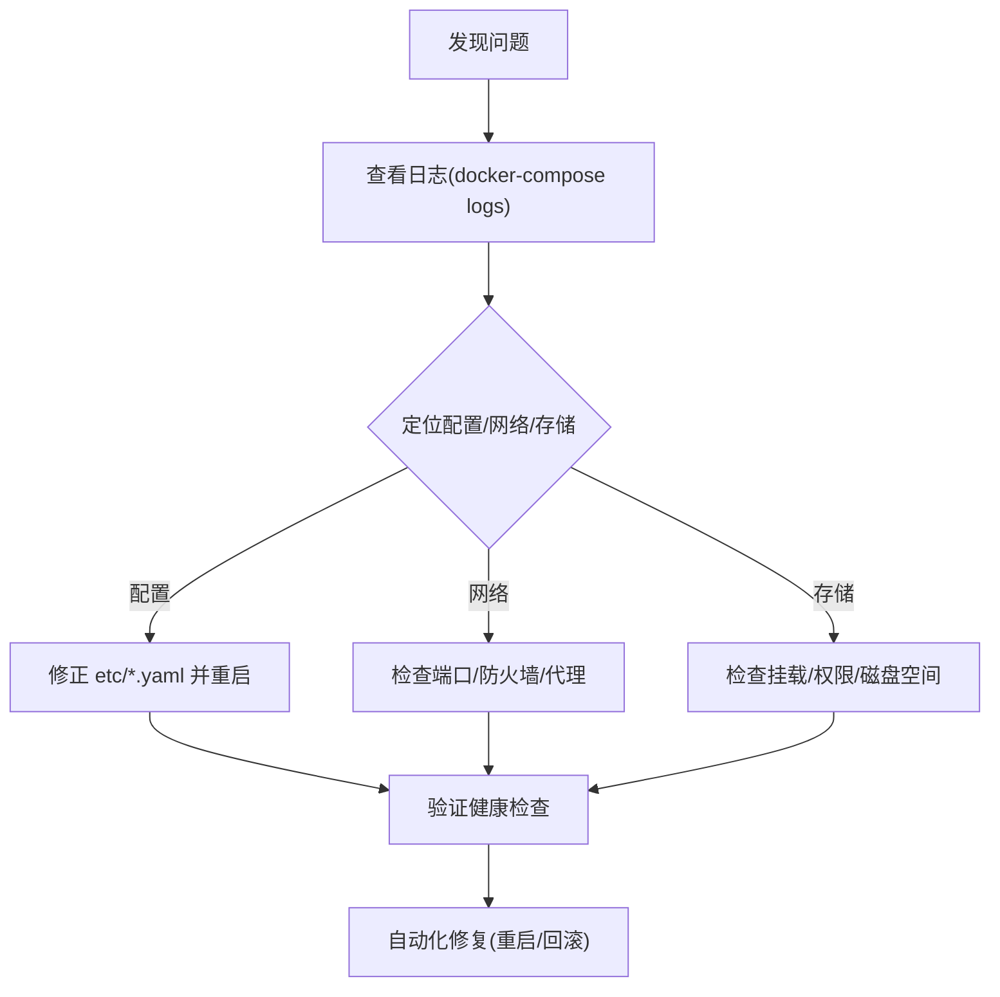

# 运维自动化实践

<cite>
**本文引用的文件**
- [deploy/docker-compose.yml](file://deploy/docker-compose.yml)
- [util/Taskfile.yml](file://util/Taskfile.yml)
- [util/config.yaml](file://util/config.yaml)
- [util/config-sh.yaml](file://util/config-sh.yaml)
- [util/manage.sh](file://util/manage.sh)
- [go.mod](file://go.mod)
- [app/bridgegtw/etc/bridgegtw.yaml](file://app/bridgegtw/etc/bridgegtw.yaml)
- [app/bridgedump/etc/bridgedump.yaml](file://app/bridgedump/etc/bridgedump.yaml)
- [app/ieccaller/etc/ieccaller.yaml](file://app/ieccaller/etc/ieccaller.yaml)
- [common/nacosx/config.go](file://common/nacosx/config.go)
- [app/bridgegtw/Dockerfile](file://app/bridgegtw/Dockerfile)
- [app/bridgedump/Dockerfile](file://app/bridgedump/Dockerfile)
- [app/ieccaller/Dockerfile](file://app/ieccaller/Dockerfile)
- [app/ieccaller/deploy.sh](file://app/ieccaller/deploy.sh)
- [app/bridgemodbus/deploy.sh](file://app/bridgemodbus/deploy.sh)
- [app/bridgemqtt/deploy.sh](file://app/bridgemqtt/deploy.sh)
- [app/file/deploy.sh](file://app/file/deploy.sh)
- [app/gis/deploy.sh](file://app/gis/deploy.sh)
- [app/ieccaller/deploy.sh](file://app/ieccaller/deploy.sh)
- [app/iecstash/deploy.sh](file://app/iecstash/deploy.sh)
- [app/logdump/deploy.sh](file://app/logdump/deploy.sh)
- [app/podengine/deploy.sh](file://app/podengine/deploy.sh)
- [app/trigger/deploy.sh](file://app/trigger/deploy.sh)
- [app/xfusionmock/deploy.sh](file://app/xfusionmock/deploy.sh)
- [socketapp/socketgtw/deploy.sh](file://socketapp/socketgtw/deploy.sh)
- [socketapp/socketpush/deploy.sh](file://socketapp/socketpush/deploy.sh)
- [facade/streamevent/deploy.sh](file://facade/streamevent/deploy.sh)
- [socketapp/socketpush/deploy.sh](file://socketapp/socketpush/deploy.sh)
- [socketapp/socketgtw/deploy.sh](file://socketapp/socketgtw/deploy.sh)
- [facade/streamevent/deploy.sh](file://facade/streamevent/deploy.sh)
</cite>

## 目录
1. [引言](#引言)
2. [项目结构](#项目结构)
3. [核心组件](#核心组件)
4. [架构总览](#架构总览)
5. [详细组件分析](#详细组件分析)
6. [依赖分析](#依赖分析)
7. [性能考虑](#性能考虑)
8. [故障排查指南](#故障排查指南)
9. [结论](#结论)
10. [附录](#附录)

## 引言
本指南面向 zero-service 项目的运维团队与平台工程人员，围绕基础设施即代码（IaC）、容器化与编排、自动化部署与发布、配置管理与服务发现、备份与容灾、监控与告警、资源与成本管理、以及 DevOps 工具链与 GitOps 实践，提供可落地的最佳实践建议与操作路径。文档以仓库现有配置与脚本为基础，结合通用运维模式，帮助读者快速建立稳定、可观测、可扩展、可回滚的自动化运维体系。

## 项目结构
项目采用多模块微服务架构，每个服务独立打包为 Docker 镜像并通过 docker-compose 编排运行。核心结构要点如下：
- 基础设施与编排：使用 docker-compose 统一编排 Kafka、Filebeat、各业务服务等。
- 配置管理：各服务通过 etc 下的 YAML 配置文件进行启动参数与运行时配置管理。
- 容器化：每个服务均提供 Dockerfile，采用多阶段构建与精简基础镜像，确保安全与体积。
- 自动化部署：每个服务提供 deploy.sh，封装构建、镜像打标、备份清理、拉起服务等流程。
- 运维工具链：提供 Taskfile 与 manage.sh，统一执行容器编排命令，支持批量与按服务控制。

图表来源
- [deploy/docker-compose.yml:1-110](file://deploy/docker-compose.yml#L1-L110)

章节来源
- [deploy/docker-compose.yml:1-110](file://deploy/docker-compose.yml#L1-L110)
- [util/Taskfile.yml:1-33](file://util/Taskfile.yml#L1-L33)
- [util/config.yaml:1-26](file://util/config.yaml#L1-L26)
- [util/config-sh.yaml:1-20](file://util/config-sh.yaml#L1-L20)

## 核心组件
- 消息与日志基础设施
  - Kafka：提供高吞吐的消息通道，支持 IECCaller 等服务的数据广播与持久化。
  - Filebeat：采集容器日志与业务日志，统一输出到 Kafka。
  - Kafdrop：可视化管理 Kafka，便于运维观测与问题定位。
- 业务服务
  - bridgegtw：网关服务，负责上游协议映射与 gRPC/HTTP 转发。
  - bridgedump：数据转储服务，接收并落盘业务数据。
  - ieccaller：IEC104 采集与调度服务，对接 Kafka/MQTT。
  - 其他服务：file、gis、bridgemqtt、bridgemodbus、trigger、podengine、xfusionmock、streamevent、socketgtw、socketpush 等，均具备独立配置与部署脚本。
- 配置与注册
  - Nacos 日志与配置：通过 nacosx 组件初始化 Nacos SDK 日志，便于集中化日志与配置管理。
- 容器与镜像
  - 所有服务均提供 Dockerfile，采用多阶段构建与精简基础镜像，减少攻击面与体积。

章节来源
- [app/bridgegtw/etc/bridgegtw.yaml:1-40](file://app/bridgegtw/etc/bridgegtw.yaml#L1-L40)
- [app/bridgedump/etc/bridgedump.yaml:1-10](file://app/bridgedump/etc/bridgedump.yaml#L1-L10)
- [app/ieccaller/etc/ieccaller.yaml:1-79](file://app/ieccaller/etc/ieccaller.yaml#L1-L79)
- [common/nacosx/config.go:1-38](file://common/nacosx/config.go#L1-L38)
- [app/bridgegtw/Dockerfile:1-43](file://app/bridgegtw/Dockerfile#L1-L43)
- [app/bridgedump/Dockerfile:1-42](file://app/bridgedump/Dockerfile#L1-L42)
- [app/ieccaller/Dockerfile:1-42](file://app/ieccaller/Dockerfile#L1-L42)

## 架构总览
下图展示零信任、低耦合的运维自动化架构：以 docker-compose 作为编排入口，Kafka/Filebeat 提供数据通路，各业务服务通过独立配置与部署脚本实现可插拔扩展；Nacos 作为配置与注册中心的前置能力，便于后续接入服务发现与动态配置。

图表来源
- [util/Taskfile.yml:1-33](file://util/Taskfile.yml#L1-L33)
- [util/manage.sh:1-35](file://util/manage.sh#L1-L35)
- [util/config.yaml:1-26](file://util/config.yaml#L1-L26)
- [util/config-sh.yaml:1-20](file://util/config-sh.yaml#L1-L20)
- [deploy/docker-compose.yml:1-110](file://deploy/docker-compose.yml#L1-L110)

## 详细组件分析

### 配置管理与服务发现
- 配置中心与动态配置
  - 通过 Nacos SDK 初始化日志与配置能力，便于集中化管理与动态下发。
- 服务注册与健康检查
  - 当前服务通过本地配置与直连方式运行，建议在接入 Nacos 后启用服务注册与健康检查，结合探针与编排健康检查实现自动摘除与恢复。
- 配置文件示例
  - bridgegtw：定义日志、超时、上游 gRPC 映射与转发规则。
  - bridgedump：定义监听地址、日志与转储路径。
  - ieccaller：定义部署模式、Nacos、IEC104、Kafka、MQTT、流事件等配置。

图表来源
- [app/bridgegtw/etc/bridgegtw.yaml:1-40](file://app/bridgegtw/etc/bridgegtw.yaml#L1-L40)
- [app/bridgedump/etc/bridgedump.yaml:1-10](file://app/bridgedump/etc/bridgedump.yaml#L1-L10)
- [app/ieccaller/etc/ieccaller.yaml:1-79](file://app/ieccaller/etc/ieccaller.yaml#L1-L79)
- [common/nacosx/config.go:1-38](file://common/nacosx/config.go#L1-L38)

章节来源
- [app/bridgegtw/etc/bridgegtw.yaml:1-40](file://app/bridgegtw/etc/bridgegtw.yaml#L1-L40)
- [app/bridgedump/etc/bridgedump.yaml:1-10](file://app/bridgedump/etc/bridgedump.yaml#L1-L10)
- [app/ieccaller/etc/ieccaller.yaml:1-79](file://app/ieccaller/etc/ieccaller.yaml#L1-L79)
- [common/nacosx/config.go:1-38](file://common/nacosx/config.go#L1-L38)

### 容器化与镜像构建
- 构建策略
  - 使用多阶段构建与精简基础镜像，减少体积与攻击面。
  - 通过 Dockerfile 注入时区与代理参数，提升跨环境一致性。
- 镜像分发
  - deploy.sh 中包含镜像打标、备份清理、拉起服务等步骤，建议配合私有仓库与 CI/CD 流水线实现自动化构建与分发。

图表来源
- [app/bridgegtw/Dockerfile:1-43](file://app/bridgegtw/Dockerfile#L1-L43)
- [app/bridgedump/Dockerfile:1-42](file://app/bridgedump/Dockerfile#L1-L42)
- [app/ieccaller/Dockerfile:1-42](file://app/ieccaller/Dockerfile#L1-L42)

章节来源
- [app/bridgegtw/Dockerfile:1-43](file://app/bridgegtw/Dockerfile#L1-L43)
- [app/bridgedump/Dockerfile:1-42](file://app/bridgedump/Dockerfile#L1-L42)
- [app/ieccaller/Dockerfile:1-42](file://app/ieccaller/Dockerfile#L1-L42)

### 自动化部署与发布流程
- 发布流水线
  - 构建镜像 → 打标 → 备份清理 → 拉起服务 → 健康检查 → 回滚保护。
- 回滚策略
  - 通过备份标签保留策略，避免误删当前正在运行的镜像，确保一键回滚。
- 蓝绿/金丝雀/滚动更新
  - 建议在编排层引入多实例与健康检查，结合服务名切换或权重分流实现蓝绿与金丝雀；滚动更新可通过分批重启与就绪探针保障平滑过渡。

图表来源
- [app/ieccaller/deploy.sh:137-175](file://app/ieccaller/deploy.sh#L137-L175)
- [app/bridgemodbus/deploy.sh:137-175](file://app/bridgemodbus/deploy.sh#L137-L175)
- [app/bridgemqtt/deploy.sh:137-175](file://app/bridgemqtt/deploy.sh#L137-L175)
- [app/file/deploy.sh:137-175](file://app/file/deploy.sh#L137-L175)
- [app/gis/deploy.sh:138-176](file://app/gis/deploy.sh#L138-L176)
- [app/iecstash/deploy.sh:137-175](file://app/iecstash/deploy.sh#L137-L175)
- [app/logdump/deploy.sh:137-175](file://app/logdump/deploy.sh#L137-L175)
- [app/podengine/deploy.sh:137-175](file://app/podengine/deploy.sh#L137-L175)
- [app/trigger/deploy.sh:137-175](file://app/trigger/deploy.sh#L137-L175)
- [app/xfusionmock/deploy.sh:137-175](file://app/xfusionmock/deploy.sh#L137-L175)
- [socketapp/socketgtw/deploy.sh:137-175](file://socketapp/socketgtw/deploy.sh#L137-L175)
- [socketapp/socketpush/deploy.sh:137-175](file://socketapp/socketpush/deploy.sh#L137-L175)
- [facade/streamevent/deploy.sh:137-175](file://facade/streamevent/deploy.sh#L137-L175)

章节来源
- [app/ieccaller/deploy.sh:137-175](file://app/ieccaller/deploy.sh#L137-L175)
- [app/bridgemodbus/deploy.sh:137-175](file://app/bridgemodbus/deploy.sh#L137-L175)
- [app/bridgemqtt/deploy.sh:137-175](file://app/bridgemqtt/deploy.sh#L137-L175)
- [app/file/deploy.sh:137-175](file://app/file/deploy.sh#L137-L175)
- [app/gis/deploy.sh:138-176](file://app/gis/deploy.sh#L138-L176)
- [app/iecstash/deploy.sh:137-175](file://app/iecstash/deploy.sh#L137-L175)
- [app/logdump/deploy.sh:137-175](file://app/logdump/deploy.sh#L137-L175)
- [app/podengine/deploy.sh:137-175](file://app/podengine/deploy.sh#L137-L175)
- [app/trigger/deploy.sh:137-175](file://app/trigger/deploy.sh#L137-L175)
- [app/xfusionmock/deploy.sh:137-175](file://app/xfusionmock/deploy.sh#L137-L175)
- [socketapp/socketgtw/deploy.sh:137-175](file://socketapp/socketgtw/deploy.sh#L137-L175)
- [socketapp/socketpush/deploy.sh:137-175](file://socketapp/socketpush/deploy.sh#L137-L175)
- [facade/streamevent/deploy.sh:137-175](file://facade/streamevent/deploy.sh#L137-L175)

### 备份与灾难恢复
- 镜像备份
  - 通过备份标签保留策略，仅清理历史旧镜像，避免误删当前运行镜像。
- 系统快照与异地容灾
  - 建议在宿主机层面定期创建系统快照，并将关键数据与日志归档至异地存储，制定 RPO/RTO 指标与演练计划。
- 业务连续性
  - 对关键服务（如 ieccaller、bridgegtw、streamevent）建立多副本与跨机房部署策略，结合健康检查与自动切换机制。

章节来源
- [app/ieccaller/deploy.sh:137-175](file://app/ieccaller/deploy.sh#L137-L175)
- [app/bridgemodbus/deploy.sh:137-175](file://app/bridgemodbus/deploy.sh#L137-L175)
- [app/bridgemqtt/deploy.sh:137-175](file://app/bridgemqtt/deploy.sh#L137-L175)
- [app/file/deploy.sh:137-175](file://app/file/deploy.sh#L137-L175)
- [app/gis/deploy.sh:138-176](file://app/gis/deploy.sh#L138-L176)
- [app/iecstash/deploy.sh:137-175](file://app/iecstash/deploy.sh#L137-L175)
- [app/logdump/deploy.sh:137-175](file://app/logdump/deploy.sh#L137-L175)
- [app/podengine/deploy.sh:137-175](file://app/podengine/deploy.sh#L137-L175)
- [app/trigger/deploy.sh:137-175](file://app/trigger/deploy.sh#L137-L175)
- [app/xfusionmock/deploy.sh:137-175](file://app/xfusionmock/deploy.sh#L137-L175)
- [socketapp/socketgtw/deploy.sh:137-175](file://socketapp/socketgtw/deploy.sh#L137-L175)
- [socketapp/socketpush/deploy.sh:137-175](file://socketapp/socketpush/deploy.sh#L137-L175)
- [facade/streamevent/deploy.sh:137-175](file://facade/streamevent/deploy.sh#L137-L175)

### 运维监控与告警自动化
- 自动化巡检
  - 结合 docker-compose 健康检查与服务探针，定期巡检关键服务状态。
- 智能告警
  - 建议接入统一告警平台，基于日志与指标阈值触发告警，并联动自动修复（如重启、扩缩容、切换实例）。
- 故障转移
  - 在编排层配置多副本与故障检测，结合负载均衡与健康检查实现自动故障转移。

[本节为通用运维建议，不直接分析具体文件]

### 资源管理与成本优化
- 资源监控
  - 通过容器与宿主机监控指标（CPU、内存、磁盘、网络）识别异常与瓶颈。
- 自动伸缩
  - 在容器编排层结合健康检查与指标阈值，实现服务副本的弹性调整。
- 成本分析与清理
  - 定期清理未使用镜像、卷与日志，降低存储与计算成本。

[本节为通用运维建议，不直接分析具体文件]

### DevOps 工具链与 GitOps 实践
- GitOps
  - 将 docker-compose.yml、Dockerfile、部署脚本纳入版本控制，通过 CI/CD 自动化应用变更。
- 自动化测试
  - 在流水线中集成单元测试、集成测试与端到端验证，确保变更质量。
- 发布管理与变更控制
  - 采用分支策略与变更审批流程，结合回滚标签与灰度发布，降低变更风险。

[本节为通用运维建议，不直接分析具体文件]

## 依赖分析
- 语言与框架
  - 项目基于 Go 生态，广泛使用 go-zero、grpc、kafka、nacos 等组件。
- 外部依赖
  - 通过 go.mod 管理依赖版本，建议定期同步与安全扫描。

图表来源
- [go.mod:1-245](file://go.mod#L1-L245)

章节来源
- [go.mod:1-245](file://go.mod#L1-L245)

## 性能考虑
- 容器镜像
  - 多阶段构建与精简基础镜像有助于缩短拉起时间与降低资源占用。
- 网络与存储
  - Kafka 分区数与副本因子应结合数据量与延迟目标调优；Filebeat 采集路径与权限需明确，避免 I/O 抖动。
- 服务并发
  - 合理设置服务并发与超时参数，避免阻塞与资源耗尽。

[本节为通用性能建议，不直接分析具体文件]

## 故障排查指南
- 常见问题定位
  - 通过 docker-compose logs 查看服务日志；结合各服务 etc 配置确认监听端口、超时与上游地址。
- 自动化修复
  - 在部署脚本中加入健康检查失败后的自动重启与回滚逻辑，减少人工干预。
- 运维脚本
  - 利用 manage.sh 与 Taskfile 统一执行容器编排命令，支持按服务批量控制。

图表来源
- [util/manage.sh:1-35](file://util/manage.sh#L1-L35)
- [util/Taskfile.yml:1-33](file://util/Taskfile.yml#L1-L33)
- [deploy/docker-compose.yml:1-110](file://deploy/docker-compose.yml#L1-L110)

章节来源
- [util/manage.sh:1-35](file://util/manage.sh#L1-L35)
- [util/Taskfile.yml:1-33](file://util/Taskfile.yml#L1-L33)
- [deploy/docker-compose.yml:1-110](file://deploy/docker-compose.yml#L1-L110)

## 结论
通过将 docker-compose 编排、Docker 容器化、统一部署脚本与配置管理相结合，zero-service 已具备良好的运维自动化基础。建议在此基础上进一步引入服务发现与动态配置、蓝绿/金丝雀发布、统一监控与告警、资源弹性与成本治理、以及 GitOps 流程，形成闭环的自动化运维体系，持续提升稳定性、可观测性与交付效率。

## 附录
- 快速上手清单
  - 准备 docker-compose 环境与镜像仓库权限。
  - 修改 config.yaml 与 config-sh.yaml 中的目标服务器信息。
  - 使用 manage.sh 执行 up/start/stop/restart 等命令。
  - 通过各服务 deploy.sh 完成构建、备份与拉起。
- 最佳实践清单
  - 为每个服务维护独立的 Dockerfile 与部署脚本。
  - 在 CI/CD 中集成健康检查与回滚保护。
  - 对关键服务启用多副本与跨机房部署。
  - 建立统一的日志与指标采集、告警与自动修复机制。