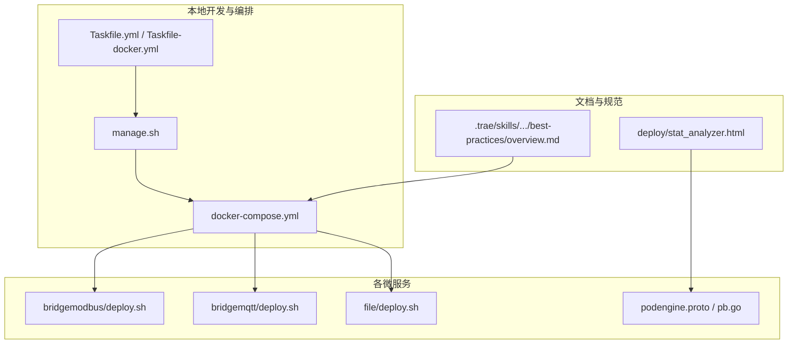
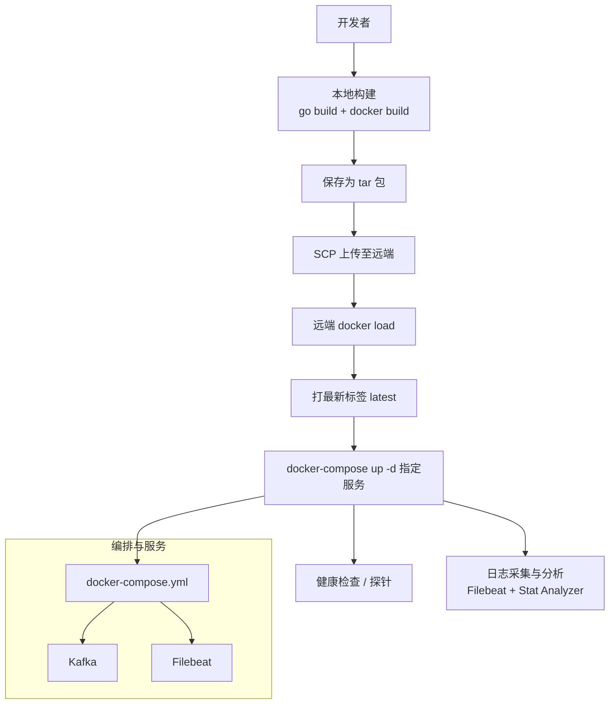
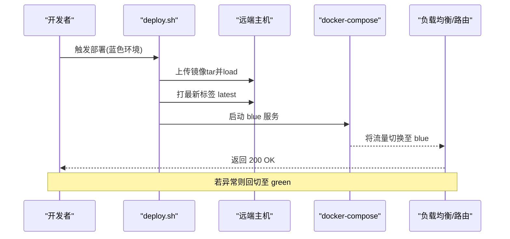
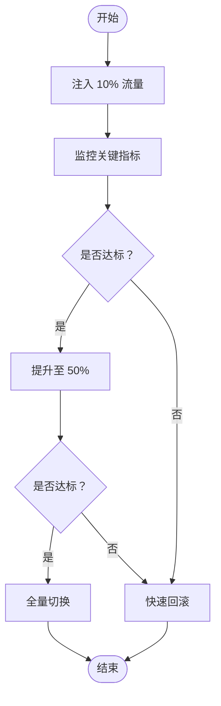
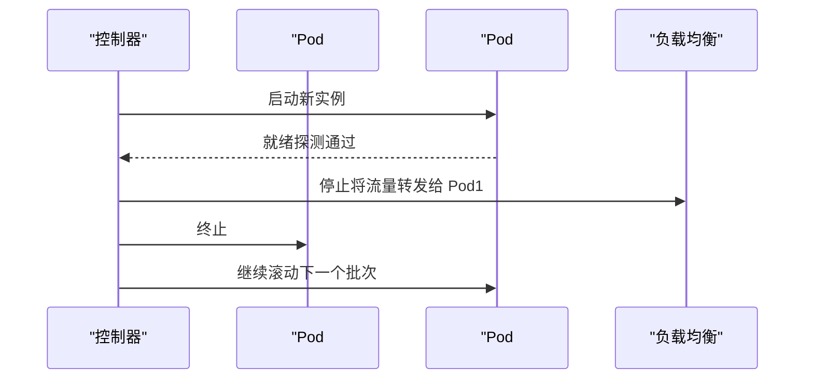
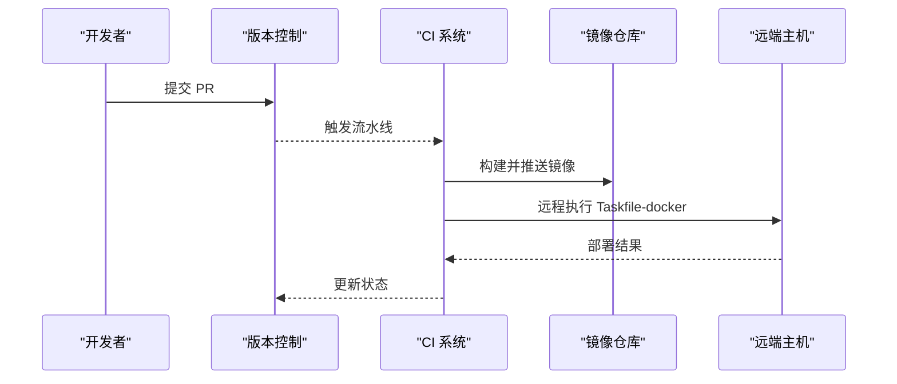
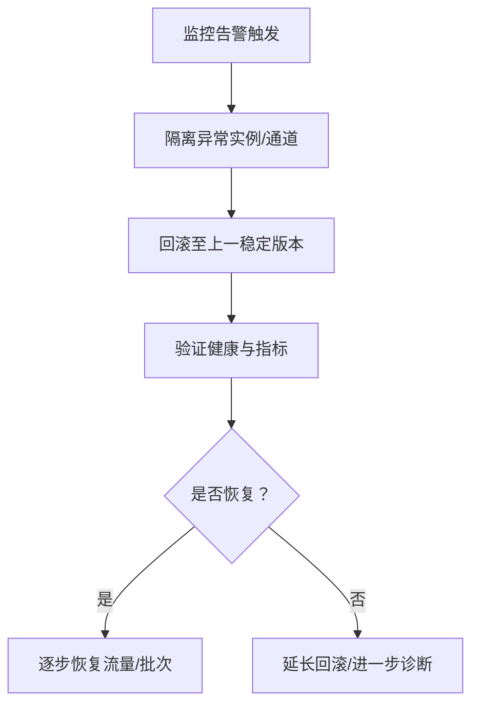
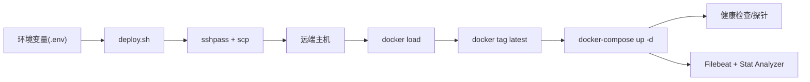

# 部署发布策略

<cite>
**本文引用的文件**
- [deploy/docker-compose.yml](file://deploy/docker-compose.yml)
- [util/Taskfile.yml](file://util/Taskfile.yml)
- [util/Taskfile-docker.yml](file://util/Taskfile-docker.yml)
- [util/manage.sh](file://util/manage.sh)
- [app/bridgemodbus/deploy.sh](file://app/bridgemodbus/deploy.sh)
- [app/bridgemqtt/deploy.sh](file://app/bridgemqtt/deploy.sh)
- [app/file/deploy.sh](file://app/file/deploy.sh)
- [.trae/skills/zero-skills/best-practices/overview.md](file://.trae/skills/zero-skills/best-practices/overview.md)
- [app/podengine/podengine.proto](file://app/podengine/podengine.proto)
- [app/podengine/podengine/podengine.pb.go](file://app/podengine/podengine/podengine.pb.go)
- [app/ieccaller/internal/svc/servicecontext.go](file://app/ieccaller/internal/svc/servicecontext.go)
- [deploy/stat_analyzer.html](file://deploy/stat_analyzer.html)
</cite>

## 目录
1. [简介](#简介)
2. [项目结构](#项目结构)
3. [核心组件](#核心组件)
4. [架构总览](#架构总览)
5. [详细组件分析](#详细组件分析)
6. [依赖关系分析](#依赖关系分析)
7. [性能考量](#性能考量)
8. [故障排查指南](#故障排查指南)
9. [结论](#结论)
10. [附录](#附录)

## 简介
本指南面向 zero-service 项目的部署与发布，围绕蓝绿部署、金丝雀发布、滚动更新与灰度发布的最佳实践，结合仓库中的 Docker Compose、Shell 部署脚本、Kubernetes 示例与健康检查能力，给出可落地的发布策略与自动化流程建议。同时涵盖发布前后验证、监控告警与紧急回滚方案，帮助在生产环境中实现安全、可控、可观测的交付。

## 项目结构
仓库采用多模块微服务结构，每个服务均提供独立的部署脚本与 Dockerfile，并通过 docker-compose 进行本地编排。整体结构如下：

**图表来源**
- [deploy/docker-compose.yml:1-110](file://deploy/docker-compose.yml#L1-L110)
- [util/manage.sh:1-35](file://util/manage.sh#L1-L35)
- [util/Taskfile.yml:1-33](file://util/Taskfile.yml#L1-L33)
- [util/Taskfile-docker.yml:1-37](file://util/Taskfile-docker.yml#L1-L37)
- [app/bridgemodbus/deploy.sh:1-175](file://app/bridgemodbus/deploy.sh#L1-L175)
- [app/bridgemqtt/deploy.sh:1-175](file://app/bridgemqtt/deploy.sh#L1-L175)
- [app/file/deploy.sh:1-175](file://app/file/deploy.sh#L1-L175)
- [.trae/skills/zero-skills/best-practices/overview.md:671-754](file://.trae/skills/zero-skills/best-practices/overview.md#L671-L754)
- [deploy/stat_analyzer.html:1-800](file://deploy/stat_analyzer.html#L1-L800)

**章节来源**
- [deploy/docker-compose.yml:1-110](file://deploy/docker-compose.yml#L1-L110)
- [util/Taskfile.yml:1-33](file://util/Taskfile.yml#L1-L33)
- [util/Taskfile-docker.yml:1-37](file://util/Taskfile-docker.yml#L1-L37)
- [util/manage.sh:1-35](file://util/manage.sh#L1-L35)

## 核心组件
- Docker Compose 编排：集中管理 Kafka、Filebeat、各业务服务等，便于本地联调与演示。
- Shell 部署脚本：每个服务提供 deploy.sh，封装构建、打包、上传、远程部署与镜像清理流程。
- Taskfile/Taskfile-docker：统一远程 docker-compose 操作入口，支持 restart/up/stop/start。
- 环境变量与备份策略：脚本支持从 .env 注入变量、镜像标签与备份保留数量控制。
- 健康检查与探针：Kubernetes 示例包含 livenessProbe/readinessProbe；部分服务具备广播/告警能力，可用于健康状态联动。

**章节来源**
- [deploy/docker-compose.yml:1-110](file://deploy/docker-compose.yml#L1-L110)
- [app/bridgemodbus/deploy.sh:1-175](file://app/bridgemodbus/deploy.sh#L1-L175)
- [app/bridgemqtt/deploy.sh:1-175](file://app/bridgemqtt/deploy.sh#L1-L175)
- [app/file/deploy.sh:1-175](file://app/file/deploy.sh#L1-L175)
- [util/Taskfile-docker.yml:1-37](file://util/Taskfile-docker.yml#L1-L37)
- [.trae/skills/zero-skills/best-practices/overview.md:671-754](file://.trae/skills/zero-skills/best-practices/overview.md#L671-L754)

## 架构总览
下图展示了基于 docker-compose 的本地发布与远程部署路径，以及健康检查与监控工具的协同方式：

**图表来源**
- [app/bridgemodbus/deploy.sh:44-164](file://app/bridgemodbus/deploy.sh#L44-L164)
- [app/bridgemqtt/deploy.sh:44-164](file://app/bridgemqtt/deploy.sh#L44-L164)
- [app/file/deploy.sh:44-164](file://app/file/deploy.sh#L44-L164)
- [deploy/docker-compose.yml:5-109](file://deploy/docker-compose.yml#L5-L109)
- [deploy/stat_analyzer.html:1-800](file://deploy/stat_analyzer.html#L1-L800)

## 详细组件分析

### 蓝绿部署策略
- 目标：零停机、可快速回切。
- 实施要点
  - 两套环境：green（当前稳定版本）、blue（待上线版本），通过不同镜像标签区分。
  - 流量切换：通过 docker-compose 的服务名切换或反向代理路由切换，确保流量只指向当前活动环境。
  - 健康检查：启动后对关键服务进行就绪探测，确认健康后再切换流量。
  - 回滚机制：若异常，立即切回 green 环境并清理 blue 镜像。
- 与仓库的契合点
  - 镜像标签管理与备份保留：脚本支持按时间戳打标签与备份清理，便于蓝绿回滚。
  - 远程部署：通过 sshpass + docker-compose up -d，可快速切换服务版本。
  - 健康检查：Kubernetes 示例提供 livenessProbe/readinessProbe，可类比到容器健康检查。

**图表来源**
- [app/bridgemodbus/deploy.sh:93-164](file://app/bridgemodbus/deploy.sh#L93-L164)
- [app/bridgemqtt/deploy.sh:93-164](file://app/bridgemqtt/deploy.sh#L93-L164)
- [app/file/deploy.sh:93-164](file://app/file/deploy.sh#L93-L164)
- [.trae/skills/zero-skills/best-practices/overview.md:699-741](file://.trae/skills/zero-skills/best-practices/overview.md#L699-L741)

**章节来源**
- [app/bridgemodbus/deploy.sh:33-164](file://app/bridgemodbus/deploy.sh#L33-L164)
- [app/bridgemqtt/deploy.sh:33-164](file://app/bridgemqtt/deploy.sh#L33-L164)
- [app/file/deploy.sh:33-164](file://app/file/deploy.sh#L33-L164)
- [.trae/skills/zero-skills/best-practices/overview.md:699-741](file://.trae/skills/zero-skills/best-practices/overview.md#L699-L741)

### 金丝雀发布策略
- 目标：小范围验证，逐步扩大流量占比。
- 实施要点
  - 渐进式流量：先将 10%-20% 流量导入新版本，观察指标与错误率。
  - 监控指标：QPS、错误率、P95/P99 延迟、内存/CPU 使用、丢弃请求。
  - 风险控制：若异常阈值触发，立即停止扩容并回滚。
- 与仓库的契合点
  - Stat Analyzer 支持解析 Go-Zero stat 日志，可作为金丝雀阶段的观测工具。
  - 健康检查：Kubernetes 示例提供探针，可作为金丝雀健康门禁。

**图表来源**
- [deploy/stat_analyzer.html:1-800](file://deploy/stat_analyzer.html#L1-L800)
- [.trae/skills/zero-skills/best-practices/overview.md:699-741](file://.trae/skills/zero-skills/best-practices/overview.md#L699-L741)

**章节来源**
- [deploy/stat_analyzer.html:1-800](file://deploy/stat_analyzer.html#L1-L800)
- [.trae/skills/zero-skills/best-practices/overview.md:699-741](file://.trae/skills/zero-skills/best-practices/overview.md#L699-L741)

### 滚动更新策略
- 目标：在有限时间内平滑替换实例，尽量减少停机与抖动。
- 实施要点
  - 更新批次：每次替换 20%-40% 的实例，留出健康检查窗口。
  - 停机时间控制：通过就绪探针确保新实例完全就绪再驱逐旧实例。
  - 数据一致性：对有状态服务，提前做快照或采用只读迁移。
- 与仓库的契合点
  - Kubernetes 示例提供副本数与探针配置，可直接映射到滚动更新的批次与健康门禁。

**图表来源**
- [.trae/skills/zero-skills/best-practices/overview.md:699-741](file://.trae/skills/zero-skills/best-practices/overview.md#L699-L741)

**章节来源**
- [.trae/skills/zero-skills/best-practices/overview.md:699-741](file://.trae/skills/zero-skills/best-practices/overview.md#L699-L741)

### 灰度发布最佳实践
- 用户分组：基于用户 ID、地域、设备类型等维度进行分桶。
- A/B 测试：为对照组与实验组分别配置不同特性开关或参数。
- 效果评估：以转化率、留存率、延迟、错误率等指标对比评估。
- 与仓库的契合点
  - 广播/告警能力可用于灰度阶段的状态同步与异常告警联动。

**章节来源**
- [app/ieccaller/internal/svc/servicecontext.go:246-289](file://app/ieccaller/internal/svc/servicecontext.go#L246-L289)

### 自动化部署流程（GitOps、CI/CD、审批）
- GitOps 建议
  - 将 docker-compose 与服务配置纳入版本控制，变更通过 Pull Request 审批。
  - 使用 CI 触发镜像构建与推送，随后通过 Taskfile/Taskfile-docker 执行远程 up/restart。
- CI/CD 管道
  - 构建阶段：go build + docker build + 保存镜像 tar。
  - 发布阶段：SCP 上传 + 远端 docker load + 打标签 + docker-compose up -d。
  - 审批：PR 合并后触发流水线，关键环境需人工批准。
- 与仓库的契合点
  - deploy.sh 已内置构建、打包、上传、部署与清理流程，可直接接入 CI。
  - Taskfile-docker 提供统一的远程 docker-compose 操作命令。

**图表来源**
- [util/Taskfile-docker.yml:10-37](file://util/Taskfile-docker.yml#L10-L37)
- [app/bridgemodbus/deploy.sh:44-164](file://app/bridgemodbus/deploy.sh#L44-L164)
- [util/manage.sh:1-35](file://util/manage.sh#L1-L35)

**章节来源**
- [util/Taskfile.yml:1-33](file://util/Taskfile.yml#L1-L33)
- [util/Taskfile-docker.yml:1-37](file://util/Taskfile-docker.yml#L1-L37)
- [util/manage.sh:1-35](file://util/manage.sh#L1-L35)
- [app/bridgemodbus/deploy.sh:1-175](file://app/bridgemodbus/deploy.sh#L1-L175)

### 发布前准备与发布后验证
- 发布前准备
  - 环境变量校验：确保 .env 中必填项齐全，镜像标签与备份保留数符合预期。
  - 健康检查：在 Kubernetes 或容器层面配置探针，确保就绪与存活检测可用。
  - 监控告警：开启 stat 日志采集与可视化分析，建立阈值告警。
  - 用户通知：对重大变更提前公告，准备回滚预案。
- 发布后验证
  - 健康检查：确认所有实例处于 Ready 状态。
  - 指标验证：核对 QPS、错误率、延迟、内存/CPU 使用与丢弃请求。
  - 业务验证：端到端链路测试，确保核心功能正常。
- 与仓库的契合点
  - deploy.sh 对环境变量与镜像标签进行严格校验与清理。
  - stat_analyzer.html 提供日志解析与可视化，便于发布后验证。

**章节来源**
- [app/bridgemodbus/deploy.sh:14-31](file://app/bridgemodbus/deploy.sh#L14-L31)
- [app/bridgemqtt/deploy.sh:14-31](file://app/bridgemqtt/deploy.sh#L14-L31)
- [app/file/deploy.sh:14-31](file://app/file/deploy.sh#L14-L31)
- [deploy/stat_analyzer.html:1-800](file://deploy/stat_analyzer.html#L1-L800)

### 故障恢复与紧急回滚
- 快速响应流程
  - 触发条件：错误率突增、延迟超阈、探针失败、关键指标异常。
  - 立即动作：停止扩容、隔离异常实例、回滚至上一稳定版本。
- 紧急回滚方案
  - 蓝绿：立即切回 green 环境，清理 blue 镜像。
  - 金丝雀：停止扩容，回滚至稳定版本，关闭灰度通道。
  - 滚动：终止剩余批次，回滚至上一稳定镜像。
- 与仓库的契合点
  - deploy.sh 提供镜像备份与清理逻辑，便于快速回滚。
  - Taskfile-docker 提供 restart/stop/start 命令，便于快速处置。

**图表来源**
- [app/bridgemodbus/deploy.sh:137-169](file://app/bridgemodbus/deploy.sh#L137-L169)
- [util/Taskfile-docker.yml:10-37](file://util/Taskfile-docker.yml#L10-L37)

**章节来源**
- [app/bridgemodbus/deploy.sh:137-169](file://app/bridgemodbus/deploy.sh#L137-L169)
- [util/Taskfile-docker.yml:10-37](file://util/Taskfile-docker.yml#L10-L37)

## 依赖关系分析
- 组件耦合
  - 各服务 deploy.sh 依赖 sshpass、docker、docker-compose 与远端环境。
  - Taskfile-docker 依赖环境变量（SSH_USER/SSH_HOST/SSH_PORT/SSH_PASSWORD/DOCKER_COMPOSE_PATH/SERVICE_NAME）。
  - docker-compose 依赖 Kafka/Filebeat 等基础设施。
- 外部依赖
  - Docker 镜像仓库：用于存储与分发镜像。
  - 监控与日志：Filebeat + Stat Analyzer 用于日志采集与可视化。

**图表来源**
- [app/bridgemodbus/deploy.sh:24-164](file://app/bridgemodbus/deploy.sh#L24-L164)
- [util/Taskfile-docker.yml:10-37](file://util/Taskfile-docker.yml#L10-L37)
- [deploy/docker-compose.yml:5-109](file://deploy/docker-compose.yml#L5-L109)
- [deploy/stat_analyzer.html:1-800](file://deploy/stat_analyzer.html#L1-L800)

**章节来源**
- [app/bridgemodbus/deploy.sh:24-164](file://app/bridgemodbus/deploy.sh#L24-L164)
- [util/Taskfile-docker.yml:10-37](file://util/Taskfile-docker.yml#L10-L37)
- [deploy/docker-compose.yml:5-109](file://deploy/docker-compose.yml#L5-L109)

## 性能考量
- 资源与探针
  - Kubernetes 示例提供 CPU/内存请求与限制，以及 livenessProbe/readinessProbe，有助于滚动更新过程中的稳定性。
- 日志与分析
  - Stat Analyzer 支持解析 Go-Zero stat 日志，可辅助定位性能瓶颈与异常波动。
- 服务模型
  - PodEngine 的 PodSpec/ContainerSpec 定义了容器规格、资源与卷挂载，有助于在发布时评估资源变化对性能的影响。

**章节来源**
- [.trae/skills/zero-skills/best-practices/overview.md:699-741](file://.trae/skills/zero-skills/best-practices/overview.md#L699-L741)
- [deploy/stat_analyzer.html:1-800](file://deploy/stat_analyzer.html#L1-L800)
- [app/podengine/podengine.proto:108-139](file://app/podengine/podengine.proto#L108-L139)
- [app/podengine/podengine/podengine.pb.go:88-126](file://app/podengine/podengine/podengine.pb.go#L88-L126)

## 故障排查指南
- 常见问题
  - 镜像上传失败：检查 sshpass 密码、端口与远端路径权限。
  - docker-compose 启动失败：检查服务日志、端口冲突与依赖服务状态。
  - 健康检查失败：调整探针参数或等待应用初始化。
- 工具与方法
  - 使用 Stat Analyzer 解析日志，关注 QPS、丢弃请求与限流状态。
  - 通过 Taskfile-docker 执行 restart/stop/start 快速处置。
- 与仓库的契合点
  - deploy.sh 提供详细的日志输出与重试机制，便于定位问题。
  - manage.sh 与 Taskfile-docker 提供统一的远程操作入口。

**章节来源**
- [app/bridgemodbus/deploy.sh:70-90](file://app/bridgemodbus/deploy.sh#L70-L90)
- [util/Taskfile-docker.yml:10-37](file://util/Taskfile-docker.yml#L10-L37)
- [util/manage.sh:1-35](file://util/manage.sh#L1-L35)
- [deploy/stat_analyzer.html:1-800](file://deploy/stat_analyzer.html#L1-L800)

## 结论
zero-service 已具备完善的本地编排、远程部署与健康检查基础能力。结合蓝绿、金丝雀、滚动与灰度发布策略，配合 CI/CD 与监控告警，可在保障稳定性的同时提升交付效率。建议在现有 deploy.sh 与 Taskfile 的基础上，进一步标准化 PR 审批、自动化探针与指标阈值，形成可审计、可追溯的发布闭环。

## 附录
- 关键文件索引
  - 编排与部署：[deploy/docker-compose.yml:1-110](file://deploy/docker-compose.yml#L1-L110)
  - 自动化任务：[util/Taskfile.yml:1-33](file://util/Taskfile.yml#L1-L33)、[util/Taskfile-docker.yml:1-37](file://util/Taskfile-docker.yml#L1-L37)
  - 远程管理：[util/manage.sh:1-35](file://util/manage.sh#L1-L35)
  - 服务部署脚本：[app/bridgemodbus/deploy.sh:1-175](file://app/bridgemodbus/deploy.sh#L1-L175)、[app/bridgemqtt/deploy.sh:1-175](file://app/bridgemqtt/deploy.sh#L1-L175)、[app/file/deploy.sh:1-175](file://app/file/deploy.sh#L1-L175)
  - 健康检查示例：[best-practices/overview.md:699-741](file://.trae/skills/zero-skills/best-practices/overview.md#L699-L741)
  - 日志分析工具：[deploy/stat_analyzer.html:1-800](file://deploy/stat_analyzer.html#L1-L800)
  - 服务模型参考：[app/podengine/podengine.proto:108-139](file://app/podengine/podengine.proto#L108-L139)、[app/podengine/podengine/podengine.pb.go:88-126](file://app/podengine/podengine/podengine.pb.go#L88-L126)
  - 广播/告警上下文：[app/ieccaller/internal/svc/servicecontext.go:246-289](file://app/ieccaller/internal/svc/servicecontext.go#L246-L289)