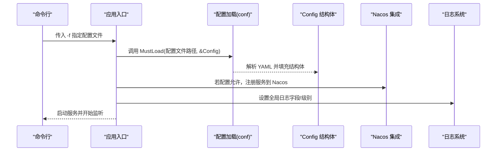

# 配置管理

<cite>
**本文引用的文件**
- [app/file/etc/file.yaml](file://app/file/etc/file.yaml)
- [app/bridgegtw/etc/bridgegtw.yaml](file://app/bridgegtw/etc/bridgegtw.yaml)
- [app/trigger/etc/trigger.yaml](file://app/trigger/etc/trigger.yaml)
- [app/file/internal/config/config.go](file://app/file/internal/config/config.go)
- [app/trigger/internal/config/config.go](file://app/trigger/internal/config/config.go)
- [app/bridgegtw/internal/config/config.go](file://app/bridgegtw/internal/config/config.go)
- [common/nacosx/config.go](file://common/nacosx/config.go)
- [common/configx/kqConfig.go](file://common/configx/kqConfig.go)
- [util/config.yaml](file://util/config.yaml)
- [util/config-sh.yaml](file://util/config-sh.yaml)
- [.trae/skills/zero-skills/best-practices/overview.md](file://.trae/skills/zero-skills/best-practices/overview.md)
- [app/file/file.go](file://app/file/file.go)
- [app/trigger/trigger.go](file://app/trigger/trigger.go)
- [app/bridgegtw/bridgegtw.go](file://app/bridgegtw/bridgegtw.go)
- [common/configx/mockconfig.go](file://common/configx/mockconfig.go)
</cite>

## 目录
1. [简介](#简介)
2. [项目结构](#项目结构)
3. [核心组件](#核心组件)
4. [架构总览](#架构总览)
5. [详细组件分析](#详细组件分析)
6. [依赖分析](#依赖分析)
7. [性能考虑](#性能考虑)
8. [故障排查指南](#故障排查指南)
9. [结论](#结论)
10. [附录](#附录)

## 简介
本指南面向 zero-service 的配置管理，系统性阐述配置文件结构与命名规范（YAML）、环境变量与命令行参数、配置分层与优先级、动态配置更新机制（热加载/监听/变更通知）、配置安全最佳实践（敏感信息加密/访问控制/审计日志）、配置模板与生成器（模板/环境变量注入/校验）、配置版本与变更控制（历史记录/回滚/冲突解决）、以及配置监控与告警（异常检测/自动修复/人工干预）。文档结合仓库中的实际配置文件与代码实现，帮助开发者在不同环境中一致地管理与交付配置。

## 项目结构
- 每个服务均采用“etc/服务名.yaml”作为默认配置文件，位于各应用目录下；入口程序通过命令行参数加载该文件。
- 服务内部通过 internal/config/config.go 定义 Config 结构体，承载服务所需的全部配置项，并由 go-zero 的 conf.MustLoad 加载 YAML 并支持环境变量覆盖。
- 部分服务集成 Nacos 作为注册中心或配置中心，相关日志与客户端配置在 common/nacosx 中集中管理。
- util 下提供运维辅助配置（如服务器列表、SSH 参数等），便于批量部署与运维脚本使用。

```mermaid
graph TB
subgraph "应用层"
F["file 应用<br/>入口: app/file/file.go"]
T["trigger 应用<br/>入口: app/trigger/trigger.go"]
G["bridgegtw 应用<br/>入口: app/bridgegtw/bridgegtw.go"]
end
subgraph "配置层"
Y1["app/file/etc/file.yaml"]
Y2["app/trigger/etc/trigger.yaml"]
Y3["app/bridgegtw/etc/bridgegtw.yaml"]
CFG1["app/file/internal/config/config.go"]
CFG2["app/trigger/internal/config/config.go"]
CFG3["app/bridgegtw/internal/config/config.go"]
end
subgraph "基础设施"
NACOS["common/nacosx/config.go"]
UTIL1["util/config.yaml"]
UTIL2["util/config-sh.yaml"]
end
F --> CFG1
T --> CFG2
G --> CFG3
CFG1 --> Y1
CFG2 --> Y2
CFG3 --> Y3
F -. 使用 .env/Nacos .-> NACOS
T -. 使用 .env/Nacos .-> NACOS
G -. 使用 .env/Nacos .-> NACOS
UTIL1 -. 运维脚本 .-> F
UTIL1 -. 运维脚本 .-> T
UTIL2 -. 运维脚本 .-> F
```

图表来源
- [app/file/file.go:26-32](file://app/file/file.go#L26-L32)
- [app/trigger/trigger.go:37](file://app/trigger/trigger.go#L37)
- [app/bridgegtw/bridgegtw.go:22](file://app/bridgegtw/bridgegtw.go#L22)
- [app/file/etc/file.yaml:1-23](file://app/file/etc/file.yaml#L1-L23)
- [app/trigger/etc/trigger.yaml:1-37](file://app/trigger/etc/trigger.yaml#L1-L37)
- [app/bridgegtw/etc/bridgegtw.yaml:1-40](file://app/bridgegtw/etc/bridgegtw.yaml#L1-L40)
- [app/file/internal/config/config.go:10-31](file://app/file/internal/config/config.go#L10-L31)
- [app/trigger/internal/config/config.go:9-28](file://app/trigger/internal/config/config.go#L9-L28)
- [app/bridgegtw/internal/config/config.go:5-7](file://app/bridgegtw/internal/config/config.go#L5-L7)
- [common/nacosx/config.go:15-37](file://common/nacosx/config.go#L15-L37)
- [util/config.yaml:1-26](file://util/config.yaml#L1-L26)
- [util/config-sh.yaml:1-20](file://util/config-sh.yaml#L1-L20)

章节来源
- [app/file/etc/file.yaml:1-23](file://app/file/etc/file.yaml#L1-L23)
- [app/trigger/etc/trigger.yaml:1-37](file://app/trigger/etc/trigger.yaml#L1-L37)
- [app/bridgegtw/etc/bridgegtw.yaml:1-40](file://app/bridgegtw/etc/bridgegtw.yaml#L1-L40)
- [app/file/internal/config/config.go:10-31](file://app/file/internal/config/config.go#L10-L31)
- [app/trigger/internal/config/config.go:9-28](file://app/trigger/internal/config/config.go#L9-L28)
- [app/bridgegtw/internal/config/config.go:5-7](file://app/bridgegtw/internal/config/config.go#L5-L7)
- [common/nacosx/config.go:15-37](file://common/nacosx/config.go#L15-L37)
- [util/config.yaml:1-26](file://util/config.yaml#L1-L26)
- [util/config-sh.yaml:1-20](file://util/config-sh.yaml#L1-L20)

## 核心组件
- 配置文件（YAML）：每个服务在 etc/ 目录下维护独立的 YAML 配置，包含服务基本信息、日志、超时、数据库、缓存、注册中心（如 Nacos）等。
- 配置结构体（Go）：internal/config/config.go 定义 Config 结构体，字段与 YAML 对应，支持默认值与可选字段标记。
- 命令行参数：入口程序通过 flag 解析 -f 指定配置文件路径，确保不同环境可切换配置。
- 环境变量覆盖：仓库最佳实践文档展示了通过环境变量覆盖配置的方式，适用于端口、数据源等关键参数。
- Nacos 集成：部分服务在启动时根据配置决定是否注册到 Nacos，并通过统一的日志配置模块进行日志输出控制。

章节来源
- [app/file/etc/file.yaml:1-23](file://app/file/etc/file.yaml#L1-L23)
- [app/trigger/etc/trigger.yaml:1-37](file://app/trigger/etc/trigger.yaml#L1-L37)
- [app/bridgegtw/etc/bridgegtw.yaml:1-40](file://app/bridgegtw/etc/bridgegtw.yaml#L1-L40)
- [app/file/internal/config/config.go:10-31](file://app/file/internal/config/config.go#L10-L31)
- [app/trigger/internal/config/config.go:9-28](file://app/trigger/internal/config/config.go#L9-L28)
- [app/bridgegtw/internal/config/config.go:5-7](file://app/bridgegtw/internal/config/config.go#L5-L7)
- [.trae/skills/zero-skills/best-practices/overview.md:60-138](file://.trae/skills/zero-skills/best-practices/overview.md#L60-L138)
- [common/nacosx/config.go:15-37](file://common/nacosx/config.go#L15-L37)

## 架构总览
下图展示从命令行到配置加载、结构体解析、Nacos 注册与日志输出的整体流程。



图表来源
- [app/file/file.go:26-67](file://app/file/file.go#L26-L67)
- [app/trigger/trigger.go:37](file://app/trigger/trigger.go#L37)
- [app/bridgegtw/bridgegtw.go:22](file://app/bridgegtw/bridgegtw.go#L22)
- [common/nacosx/config.go:15-37](file://common/nacosx/config.go#L15-L37)

## 详细组件分析

### 组件一：配置文件结构与命名规范
- 文件命名：etc/<服务名>.yaml，例如 file.yaml、trigger.yaml、bridgegtw.yaml。
- 字段组织：按功能分组（如日志、数据库、缓存、注册中心等），层次清晰，便于维护。
- 典型字段示例：
  - 服务基础：Name、ListenOn/Host:Port、Timeout、Mode、Log。
  - 注册中心：NacosConfig（IsRegister、Host、Port、Username、PassWord、NamespaceId、ServiceName）。
  - 数据存储：DB.DataSource、Redis、Cache 等。
  - 特殊能力：ThumbTaskConcurrency、StreamEventConf 等。

章节来源
- [app/file/etc/file.yaml:1-23](file://app/file/etc/file.yaml#L1-L23)
- [app/trigger/etc/trigger.yaml:1-37](file://app/trigger/etc/trigger.yaml#L1-L37)
- [app/bridgegtw/etc/bridgegtw.yaml:1-40](file://app/bridgegtw/etc/bridgegtw.yaml#L1-L40)

### 组件二：命令行参数与环境变量
- 命令行参数：所有应用入口均通过 flag 定义 -f 参数指向 etc/<服务>.yaml，确保可按需切换配置。
- 环境变量覆盖：最佳实践文档展示了通过环境变量覆盖配置项的方法，适合在容器化或 CI/CD 场景中注入敏感或动态参数（如端口、数据源）。

章节来源
- [app/file/file.go:26](file://app/file/file.go#L26)
- [.trae/skills/zero-skills/best-practices/overview.md:121-138](file://.trae/skills/zero-skills/best-practices/overview.md#L121-L138)

### 组件三：配置分层与优先级
- 分层模型（从低到高）：
  1) 默认配置：结构体字段的默认值与可选标记。
  2) 环境配置：通过环境变量覆盖配置项。
  3) 运行时配置：etc/<服务>.yaml 文件内容。
- 优先级顺序：环境变量 > YAML 文件 > 结构体默认值。该顺序由 go-zero 的 conf.MustLoad 行为保证，确保环境变量可即时覆盖生产配置。

章节来源
- [.trae/skills/zero-skills/best-practices/overview.md:60-138](file://.trae/skills/zero-skills/best-practices/overview.md#L60-L138)
- [app/file/internal/config/config.go:29](file://app/file/internal/config/config.go#L29)
- [app/trigger/internal/config/config.go:20-26](file://app/trigger/internal/config/config.go#L20-L26)

### 组件四：动态配置更新机制
- 热加载：仓库未直接提供基于文件的热重载实现。建议通过以下方式实现：
  - 文件监听：使用 fsnotify 或 inotify 监听 etc/<服务>.yaml 变更，触发重新加载。
  - 配置合并：仅对可变字段进行增量更新，避免重启。
  - 幂等更新：提供回滚策略与一致性检查。
- 配置监听：可在应用内集成 Nacos 客户端监听远程配置，实现远端下发与热更新。
- 变更通知：通过日志与指标上报变更事件，配合告警系统触发人工干预。

（本小节为通用实现建议，非仓库现有代码）

### 组件五：配置安全最佳实践
- 敏感信息加密：
  - 将数据库密码、Redis 密码等放入受控密钥管理系统（如 KMS/HashiCorp Vault），应用启动时解密注入。
  - 避免将明文敏感信息写入 Git。
- 访问控制：
  - 限制对 etc/ 目录与配置文件的读写权限，仅授权运维人员访问。
  - 在容器中使用只读挂载 etc/，并通过环境变量注入必要参数。
- 审计日志：
  - 记录配置加载时间、来源、变更者与变更内容摘要。
  - 对敏感字段变更进行高亮与告警。

（本小节为通用安全建议，非仓库现有代码）

### 组件六：配置模板与生成器
- 配置文件模板：参考各服务的 etc/<服务>.yaml，按需复制并修改关键字段（如 ListenOn、DB.DataSource、NacosConfig）。
- 环境变量注入：通过 .env 文件或容器环境变量注入，实现跨环境差异化。
- 配置验证：
  - 使用结构体标签与默认值约束（如默认值、可选字段）。
  - 引入校验库（如 go-playground/validator）对输入进行二次校验。
  - 生成器：可基于 util/config.yaml 与 util/config-sh.yaml 提供的服务器清单，生成批量部署所需的配置片段。

章节来源
- [util/config.yaml:1-26](file://util/config.yaml#L1-L26)
- [util/config-sh.yaml:1-20](file://util/config-sh.yaml#L1-L20)
- [.trae/skills/zero-skills/best-practices/overview.md:60-138](file://.trae/skills/zero-skills/best-practices/overview.md#L60-L138)

### 组件七：配置版本管理与变更控制
- 版本化：将 etc/<服务>.yaml 纳入 Git 管理，按环境分支（如 dev/test/prd）隔离。
- 历史记录：通过 Git 提交记录追踪每次变更，记录变更原因与影响范围。
- 回滚机制：支持快速回退到上一版本配置；对关键字段变更提供灰度发布策略。
- 冲突解决：多人协作时采用 Pull Request 审批与合并冲突解决流程。

（本小节为通用流程建议，非仓库现有代码）

### 组件八：配置监控与告警
- 异常检测：监控配置加载失败、字段缺失、类型不匹配等错误。
- 自动修复：对常见问题（如端口冲突、不可达的注册中心地址）自动尝试修复或降级。
- 人工干预：对敏感变更（如数据库连接串、注册中心凭据）触发告警并暂停部署，等待人工确认。

（本小节为通用监控建议，非仓库现有代码）

## 依赖分析
- 应用入口依赖配置加载模块（conf.MustLoad）与 Config 结构体。
- 部分应用依赖 Nacos 注册与日志模块。
- 运维工具依赖 util 下的服务器清单配置。

```mermaid
graph LR
FILE["app/file/file.go"] --> CFGF["app/file/internal/config/config.go"]
TRIG["app/trigger/trigger.go"] --> CFGT["app/trigger/internal/config/config.go"]
BRGTW["app/bridgegtw/bridgegtw.go"] --> CFGG["app/bridgegtw/internal/config/config.go"]
CFGF --> YAMLF["app/file/etc/file.yaml"]
CFGT --> YAMLT["app/trigger/etc/trigger.yaml"]
CFGG --> YAMLG["app/bridgegtw/etc/bridgegtw.yaml"]
FILE -. 使用 .env/Nacos .-> NACOS["common/nacosx/config.go"]
TRIG -. 使用 .env/Nacos .-> NACOS
BRGTW -. 使用 .env/Nacos .-> NACOS
UTIL["util/config.yaml"] -. 运维 .-> FILE
UTIL2["util/config-sh.yaml"] -. 运维 .-> FILE
```

图表来源
- [app/file/file.go:26-32](file://app/file/file.go#L26-L32)
- [app/trigger/trigger.go:37](file://app/trigger/trigger.go#L37)
- [app/bridgegtw/bridgegtw.go:22](file://app/bridgegtw/bridgegtw.go#L22)
- [app/file/internal/config/config.go:10-31](file://app/file/internal/config/config.go#L10-L31)
- [app/trigger/internal/config/config.go:9-28](file://app/trigger/internal/config/config.go#L9-L28)
- [app/bridgegtw/internal/config/config.go:5-7](file://app/bridgegtw/internal/config/config.go#L5-L7)
- [common/nacosx/config.go:15-37](file://common/nacosx/config.go#L15-L37)
- [util/config.yaml:1-26](file://util/config.yaml#L1-L26)
- [util/config-sh.yaml:1-20](file://util/config-sh.yaml#L1-L20)

章节来源
- [app/file/file.go:26-32](file://app/file/file.go#L26-L32)
- [app/trigger/trigger.go:37](file://app/trigger/trigger.go#L37)
- [app/bridgegtw/bridgegtw.go:22](file://app/bridgegtw/bridgegtw.go#L22)
- [app/file/internal/config/config.go:10-31](file://app/file/internal/config/config.go#L10-L31)
- [app/trigger/internal/config/config.go:9-28](file://app/trigger/internal/config/config.go#L9-L28)
- [app/bridgegtw/internal/config/config.go:5-7](file://app/bridgegtw/internal/config/config.go#L5-L7)
- [common/nacosx/config.go:15-37](file://common/nacosx/config.go#L15-L37)
- [util/config.yaml:1-26](file://util/config.yaml#L1-L26)
- [util/config-sh.yaml:1-20](file://util/config-sh.yaml#L1-L20)

## 性能考虑
- 配置加载：尽量减少 YAML 层级深度与嵌套数组长度，避免过大配置导致解析开销。
- 环境变量覆盖：仅覆盖必要字段，避免频繁重启。
- 日志与注册：合理设置日志级别与 Nacos 日志目录，避免 IO 抖动。

（本节为通用建议）

## 故障排查指南
- 配置加载失败
  - 检查 -f 指向的 YAML 路径是否存在且可读。
  - 核对字段类型与命名，确保与 Config 结构体一致。
- 端口占用或网络不通
  - 检查 ListenOn/Host:Port 与防火墙规则。
  - 如使用 Nacos，确认 Host/Port 与认证信息正确。
- 环境变量未生效
  - 确认环境变量名称与 YAML 字段映射关系，注意大小写与下划线/驼峰差异。
- 运维脚本无法连接目标主机
  - 校验 util/config.yaml 与 util/config-sh.yaml 中的 SSH 凭据与路径。

章节来源
- [app/file/etc/file.yaml:1-23](file://app/file/etc/file.yaml#L1-L23)
- [app/trigger/etc/trigger.yaml:1-37](file://app/trigger/etc/trigger.yaml#L1-L37)
- [app/bridgegtw/etc/bridgegtw.yaml:1-40](file://app/bridgegtw/etc/bridgegtw.yaml#L1-L40)
- [util/config.yaml:1-26](file://util/config.yaml#L1-L26)
- [util/config-sh.yaml:1-20](file://util/config-sh.yaml#L1-L20)

## 结论
zero-service 的配置管理遵循“YAML 文件 + 结构体 + 命令行参数 + 环境变量覆盖”的标准模式，结合 Nacos 实现服务发现与日志统一。建议在此基础上引入动态配置更新（监听/热加载）、配置安全（密钥管理/访问控制/审计）、版本与变更控制（Git/灰度/回滚）、以及监控与告警（异常检测/自动修复/人工干预），以满足生产级稳定性与可维护性要求。

## 附录
- 配置模板与生成器
  - 可基于各服务的 etc/<服务>.yaml 快速复制并替换关键字段。
  - 利用 util/config.yaml 与 util/config-sh.yaml 生成批量部署配置片段。
- 配置验证
  - 使用结构体标签与可选字段约束默认值。
  - 引入校验库对输入进行二次校验。

章节来源
- [util/config.yaml:1-26](file://util/config.yaml#L1-L26)
- [util/config-sh.yaml:1-20](file://util/config-sh.yaml#L1-L20)
- [.trae/skills/zero-skills/best-practices/overview.md:60-138](file://.trae/skills/zero-skills/best-practices/overview.md#L60-L138)