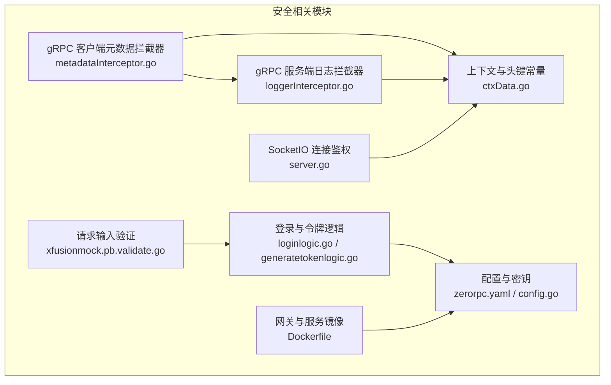
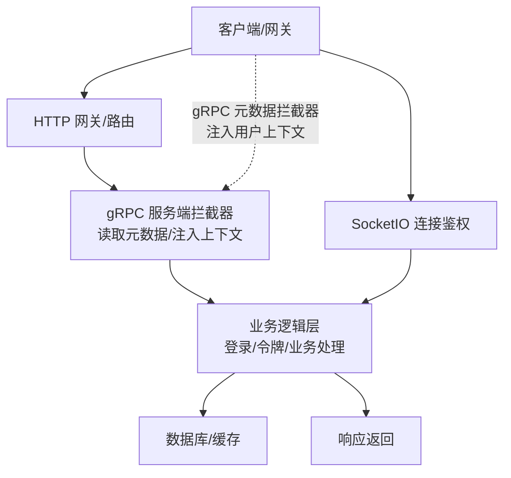
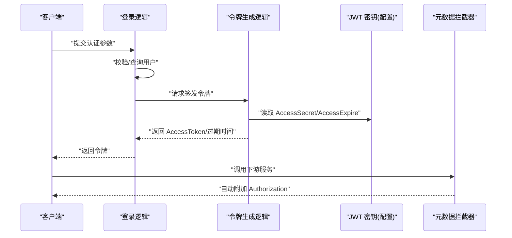
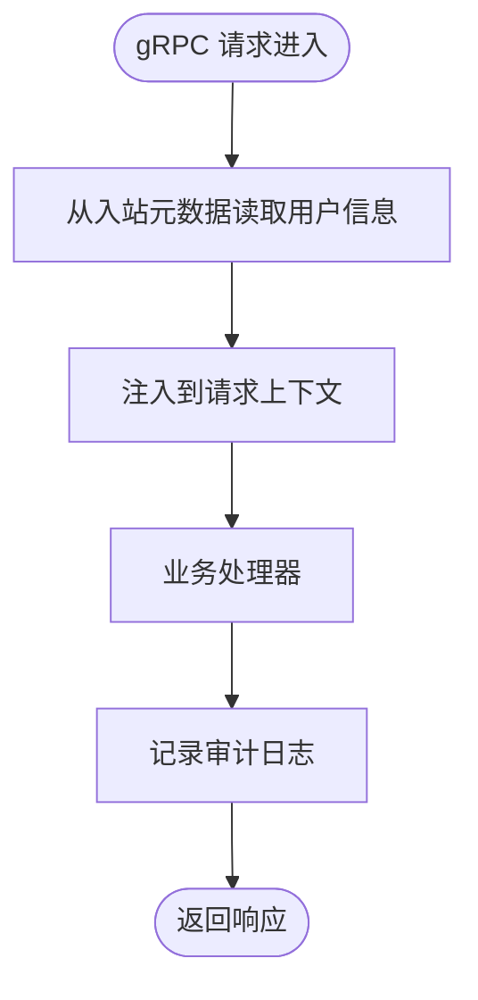
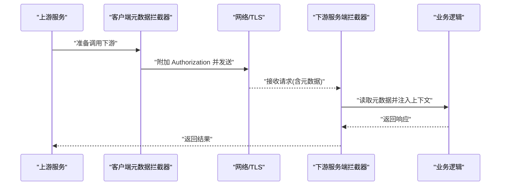
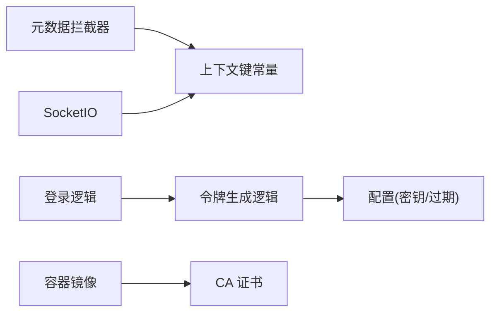

# 安全架构

<cite>
**本文引用的文件**
- [metadataInterceptor.go](file://common/Interceptor/rpcclient/metadataInterceptor.go)
- [loggerInterceptor.go](file://common/Interceptor/rpcserver/loggerInterceptor.go)
- [ctxData.go](file://common/ctxdata/ctxData.go)
- [loginlogic.go](file://zerorpc/internal/logic/loginlogic.go)
- [generatetokenlogic.go](file://zerorpc/internal/logic/generatetokenlogic.go)
- [zerorpc.yaml](file://zerorpc/etc/zerorpc.yaml)
- [servicecontext.go](file://zerorpc/internal/svc/servicecontext.go)
- [config.go](file://zerorpc/internal/config/config.go)
- [config.go](file://common/nacosx/config.go)
- [metadataInterceptor.go](file://common/Interceptor/rpcclient/metadataInterceptor.go)
- [loggerInterceptor.go](file://common/Interceptor/rpcserver/loggerInterceptor.go)
- [ctxData.go](file://common/ctxdata/ctxData.go)
- [loginlogic.go](file://zerorpc/internal/logic/loginlogic.go)
- [generatetokenlogic.go](file://zerorpc/internal/logic/generatetokenlogic.go)
- [zerorpc.yaml](file://zerorpc/etc/zerorpc.yaml)
- [servicecontext.go](file://zerorpc/internal/svc/servicecontext.go)
- [config.go](file://zerorpc/internal/config/config.go)
- [config.go](file://common/nacosx/config.go)
- [server.go](file://common/socketiox/server.go)
- [Dockerfile](file://gtw/Dockerfile)
- [Dockerfile](file://socketapp/socketgtw/Dockerfile)
- [Dockerfile](file://app/bridgegtw/Dockerfile)
- [xfusionmock.pb.validate.go](file://app/xfusionmock/xfusionmock/xfusionmock.pb.validate.go)
- [overview.md](file://.trae/skills/zero-skills/best-practices/overview.md)
- [rest-api-patterns.md](file://.trae/skills/zero-skills/references/rest-api-patterns.md)
- [rpc-patterns.md](file://.trae/skills/zero-skills/references/rpc-patterns.md)
</cite>

## 目录
1. [引言](#引言)
2. [项目结构](#项目结构)
3. [核心组件](#核心组件)
4. [架构总览](#架构总览)
5. [详细组件分析](#详细组件分析)
6. [依赖分析](#依赖分析)
7. [性能考虑](#性能考虑)
8. [故障排查指南](#故障排查指南)
9. [结论](#结论)
10. [附录](#附录)

## 引言
本文件面向 zero-service 的安全架构，系统性阐述身份认证、授权控制、数据加密、网络安全等安全设计原则与实现方案；覆盖 gRPC 与 HTTP 接口的安全机制（元数据拦截器、请求验证、访问控制）、微服务间通信安全保障（服务间认证、TLS 加密、令牌管理）、用户权限与审计日志、安全威胁分析与防护、应急响应机制以及安全配置与最佳实践。

## 项目结构
从安全视角，项目的关键安全相关模块包括：
- gRPC 元数据拦截器：在客户端与服务端统一注入与提取用户上下文信息，支撑鉴权与审计。
- JWT 认证：登录与令牌签发逻辑，配合拦截器在链路中传递用户标识。
- 配置与密钥：JWT 密钥、数据库连接串、外部服务凭据集中于配置文件。
- 网络与容器：网关与服务镜像构建文件中包含证书与运行时环境配置要点。
- 输入校验：基于 protobuf 的验证代码生成，辅助请求输入约束。

图表来源
- [metadataInterceptor.go:11-32](file://common/Interceptor/rpcclient/metadataInterceptor.go#L11-L32)
- [loggerInterceptor.go:12-44](file://common/Interceptor/rpcserver/loggerInterceptor.go#L12-L44)
- [ctxData.go:9-24](file://common/ctxdata/ctxData.go#L9-L24)
- [loginlogic.go:30-109](file://zerorpc/internal/logic/loginlogic.go#L30-L109)
- [generatetokenlogic.go:29-52](file://zerorpc/internal/logic/generatetokenlogic.go#L29-L52)
- [zerorpc.yaml:33-35](file://zerorpc/etc/zerorpc.yaml#L33-L35)
- [config.go:8-24](file://zerorpc/internal/config/config.go#L8-L24)
- [server.go:337-380](file://common/socketiox/server.go#L337-L380)
- [Dockerfile:31-42](file://gtw/Dockerfile#L31-L42)
- [xfusionmock.pb.validate.go:38-75](file://app/xfusionmock/xfusionmock/xfusionmock.pb.validate.go#L38-L75)

章节来源
- [metadataInterceptor.go:11-32](file://common/Interceptor/rpcclient/metadataInterceptor.go#L11-L32)
- [loggerInterceptor.go:12-44](file://common/Interceptor/rpcserver/loggerInterceptor.go#L12-L44)
- [ctxData.go:9-24](file://common/ctxdata/ctxData.go#L9-L24)
- [loginlogic.go:30-109](file://zerorpc/internal/logic/loginlogic.go#L30-L109)
- [generatetokenlogic.go:29-52](file://zerorpc/internal/logic/generatetokenlogic.go#L29-L52)
- [zerorpc.yaml:33-35](file://zerorpc/etc/zerorpc.yaml#L33-L35)
- [config.go:8-24](file://zerorpc/internal/config/config.go#L8-L24)
- [server.go:337-380](file://common/socketiox/server.go#L337-L380)
- [Dockerfile:31-42](file://gtw/Dockerfile#L31-L42)
- [xfusionmock.pb.validate.go:38-75](file://app/xfusionmock/xfusionmock/xfusionmock.pb.validate.go#L38-L75)

## 核心组件
- gRPC 元数据拦截器（客户端/服务端）
  - 客户端拦截器：将用户 ID、用户名、部门编码、Authorization、TraceId 等上下文写入出站 gRPC 元数据。
  - 服务端拦截器：从入站 gRPC 元数据读取并注入到请求上下文，便于后续处理与审计。
- 上下文与头键常量
  - 统一定义 gRPC 头部键名与上下文键名，确保跨进程一致传递。
- JWT 认证
  - 登录逻辑根据多种认证方式获取用户标识后，调用令牌生成逻辑签发 JWT。
  - 配置文件中包含 AccessSecret 与 AccessExpire，决定签名密钥与过期策略。
- SocketIO 连接鉴权
  - 建立连接时对 token 进行校验，并可将声明中的关键字段写入会话元数据。
- 请求输入验证
  - 基于 protobuf 的验证代码生成，对请求消息进行规则约束与错误聚合。
- 配置与密钥
  - JWT 密钥、数据库连接串、外部服务凭据集中于配置文件，需严格保护。

章节来源
- [metadataInterceptor.go:11-32](file://common/Interceptor/rpcclient/metadataInterceptor.go#L11-L32)
- [loggerInterceptor.go:12-44](file://common/Interceptor/rpcserver/loggerInterceptor.go#L12-L44)
- [ctxData.go:9-24](file://common/ctxdata/ctxData.go#L9-L24)
- [loginlogic.go:30-109](file://zerorpc/internal/logic/loginlogic.go#L30-L109)
- [generatetokenlogic.go:29-52](file://zerorpc/internal/logic/generatetokenlogic.go#L29-L52)
- [zerorpc.yaml:33-35](file://zerorpc/etc/zerorpc.yaml#L33-L35)
- [config.go:8-24](file://zerorpc/internal/config/config.go#L8-L24)
- [server.go:337-380](file://common/socketiox/server.go#L337-L380)
- [xfusionmock.pb.validate.go:38-75](file://app/xfusionmock/xfusionmock/xfusionmock.pb.validate.go#L38-L75)

## 架构总览
下图展示零信任风格的链路安全视图：客户端/网关发起请求，经由拦截器注入上下文，服务端拦截器读取上下文并执行业务逻辑；令牌贯穿链路，SocketIO 在握手阶段进行鉴权；输入通过 protobuf 验证，配置集中化且密钥受控。

图表来源
- [loggerInterceptor.go:12-44](file://common/Interceptor/rpcserver/loggerInterceptor.go#L12-L44)
- [metadataInterceptor.go:11-32](file://common/Interceptor/rpcclient/metadataInterceptor.go#L11-L32)
- [loginlogic.go:30-109](file://zerorpc/internal/logic/loginlogic.go#L30-L109)
- [generatetokenlogic.go:29-52](file://zerorpc/internal/logic/generatetokenlogic.go#L29-L52)
- [server.go:337-380](file://common/socketiox/server.go#L337-L380)

## 详细组件分析

### 身份认证与令牌管理
- 登录流程
  - 支持多种认证方式（如小程序、短信验证码等），成功后调用令牌生成逻辑。
- JWT 签发
  - 使用配置中的 AccessSecret 对用户标识进行签名，设置过期时间与刷新窗口。
- 令牌传递
  - 客户端拦截器将 Authorization 写入 gRPC 元数据，服务端拦截器读取并注入上下文。

图表来源
- [loginlogic.go:30-109](file://zerorpc/internal/logic/loginlogic.go#L30-L109)
- [generatetokenlogic.go:29-52](file://zerorpc/internal/logic/generatetokenlogic.go#L29-L52)
- [zerorpc.yaml:33-35](file://zerorpc/etc/zerorpc.yaml#L33-L35)
- [metadataInterceptor.go:11-32](file://common/Interceptor/rpcclient/metadataInterceptor.go#L11-L32)

章节来源
- [loginlogic.go:30-109](file://zerorpc/internal/logic/loginlogic.go#L30-L109)
- [generatetokenlogic.go:29-52](file://zerorpc/internal/logic/generatetokenlogic.go#L29-L52)
- [zerorpc.yaml:33-35](file://zerorpc/etc/zerorpc.yaml#L33-L35)
- [metadataInterceptor.go:11-32](file://common/Interceptor/rpcclient/metadataInterceptor.go#L11-L32)

### 授权控制与访问审计
- gRPC 元数据拦截器
  - 客户端：将用户 ID、用户名、部门编码、Authorization、TraceId 写入出站元数据。
  - 服务端：从入站元数据读取并注入到上下文，便于后续授权与审计。
- SocketIO 连接鉴权
  - 握手阶段校验 token，若通过则将声明中的关键字段写入会话元数据，便于后续事件处理。

图表来源
- [loggerInterceptor.go:12-44](file://common/Interceptor/rpcserver/loggerInterceptor.go#L12-L44)
- [ctxData.go:9-24](file://common/ctxdata/ctxData.go#L9-L24)
- [server.go:337-380](file://common/socketiox/server.go#L337-L380)

章节来源
- [loggerInterceptor.go:12-44](file://common/Interceptor/rpcserver/loggerInterceptor.go#L12-L44)
- [ctxData.go:9-24](file://common/ctxdata/ctxData.go#L9-L24)
- [server.go:337-380](file://common/socketiox/server.go#L337-L380)

### 数据加密与传输安全
- TLS 与证书
  - 网关与服务镜像构建文件中包含 ca-certificates.crt 的拷贝，确保容器运行时具备可信根证书，便于与外部服务建立 TLS 连接。
- 配置与密钥
  - JWT 密钥、数据库连接串、外部服务凭据集中于配置文件，需限制访问权限与启用密钥轮换策略。

章节来源
- [Dockerfile:31-42](file://gtw/Dockerfile#L31-L42)
- [Dockerfile:31-42](file://socketapp/socketgtw/Dockerfile#L31-L42)
- [Dockerfile:31-42](file://app/bridgegtw/Dockerfile#L31-L42)
- [zerorpc.yaml:13-39](file://zerorpc/etc/zerorpc.yaml#L13-L39)

### 请求验证与输入约束
- protobuf 验证
  - 自动生成的验证代码对请求消息进行规则检查，支持单条与全部错误聚合，便于在边界处阻断异常输入。
- 最佳实践
  - 使用验证标签与结构化错误返回，避免将内部错误细节暴露给客户端。

章节来源
- [xfusionmock.pb.validate.go:38-75](file://app/xfusionmock/xfusionmock/xfusionmock.pb.validate.go#L38-L75)
- [xfusionmock.pb.validate.go:77-115](file://app/xfusionmock/xfusionmock/xfusionmock.pb.validate.go#L77-L115)
- [overview.md:546-608](file://.trae/skills/zero-skills/best-practices/overview.md#L546-L608)

### 微服务间通信安全保障
- 服务间认证
  - 通过 gRPC 元数据携带 Authorization 实现服务间鉴权；服务端拦截器读取并注入上下文，便于后续授权。
- TLS 加密
  - 容器镜像内置 CA 证书，确保与下游服务建立 TLS 连接时的信任链有效。
- 令牌管理
  - 客户端拦截器自动附加 Authorization，避免在业务代码中重复处理。

图表来源
- [metadataInterceptor.go:11-32](file://common/Interceptor/rpcclient/metadataInterceptor.go#L11-L32)
- [loggerInterceptor.go:12-44](file://common/Interceptor/rpcserver/loggerInterceptor.go#L12-L44)
- [Dockerfile:31-42](file://gtw/Dockerfile#L31-L42)

章节来源
- [metadataInterceptor.go:11-32](file://common/Interceptor/rpcclient/metadataInterceptor.go#L11-L32)
- [loggerInterceptor.go:12-44](file://common/Interceptor/rpcserver/loggerInterceptor.go#L12-L44)
- [Dockerfile:31-42](file://gtw/Dockerfile#L31-L42)

### 用户权限管理与审计日志
- 权限模型
  - 通过拦截器在上下文中注入用户标识与部门编码，业务层据此进行细粒度授权判断。
- 审计日志
  - 服务端拦截器在处理过程中记录错误与上下文信息，便于审计与问题定位。

章节来源
- [ctxData.go:9-24](file://common/ctxdata/ctxData.go#L9-L24)
- [loggerInterceptor.go:12-44](file://common/Interceptor/rpcserver/loggerInterceptor.go#L12-L44)

## 依赖分析
- 组件耦合
  - 元数据拦截器依赖上下文键常量，确保客户端与服务端键名一致。
  - 登录与令牌逻辑依赖配置文件中的密钥与过期策略。
  - SocketIO 依赖令牌校验回调以完成握手阶段鉴权。
- 外部依赖
  - 容器镜像内置 CA 证书，确保 TLS 通信可信。
  - 配置模块集中管理密钥与凭据，降低泄露风险。

图表来源
- [metadataInterceptor.go:11-32](file://common/Interceptor/rpcclient/metadataInterceptor.go#L11-L32)
- [ctxData.go:9-24](file://common/ctxdata/ctxData.go#L9-L24)
- [loginlogic.go:30-109](file://zerorpc/internal/logic/loginlogic.go#L30-L109)
- [generatetokenlogic.go:29-52](file://zerorpc/internal/logic/generatetokenlogic.go#L29-L52)
- [zerorpc.yaml:33-35](file://zerorpc/etc/zerorpc.yaml#L33-L35)
- [server.go:337-380](file://common/socketiox/server.go#L337-L380)
- [Dockerfile:31-42](file://gtw/Dockerfile#L31-L42)

章节来源
- [metadataInterceptor.go:11-32](file://common/Interceptor/rpcclient/metadataInterceptor.go#L11-L32)
- [ctxData.go:9-24](file://common/ctxdata/ctxData.go#L9-L24)
- [loginlogic.go:30-109](file://zerorpc/internal/logic/loginlogic.go#L30-L109)
- [generatetokenlogic.go:29-52](file://zerorpc/internal/logic/generatetokenlogic.go#L29-L52)
- [zerorpc.yaml:33-35](file://zerorpc/etc/zerorpc.yaml#L33-L35)
- [server.go:337-380](file://common/socketiox/server.go#L337-L380)
- [Dockerfile:31-42](file://gtw/Dockerfile#L31-L42)

## 性能考虑
- 拦截器开销
  - 元数据读写与上下文注入为轻量操作，通常对延迟影响较小；建议在高并发场景下保持拦截器数量精简。
- 令牌大小
  - JWT 应尽量精简载荷，避免过长的自定义字段，减少网络传输与解析成本。
- 验证性能
  - protobuf 验证在编译期生成，运行时开销可控；建议在网关层尽早拦截无效请求，减少后端压力。

## 故障排查指南
- 认证失败
  - 检查客户端是否正确附加 Authorization；确认服务端拦截器已读取元数据并注入上下文。
- 令牌过期或无效
  - 核对配置中的 AccessSecret 与 AccessExpire；确认客户端使用最新令牌。
- SocketIO 连接被拒绝
  - 检查握手参数中的 token 是否有效，以及服务端鉴权回调逻辑。
- 审计日志缺失
  - 确认服务端拦截器错误处理分支是否触发日志记录。

章节来源
- [loggerInterceptor.go:12-44](file://common/Interceptor/rpcserver/loggerInterceptor.go#L12-L44)
- [metadataInterceptor.go:11-32](file://common/Interceptor/rpcclient/metadataInterceptor.go#L11-L32)
- [server.go:337-380](file://common/socketiox/server.go#L337-L380)

## 结论
本安全架构以“零信任”为核心理念，通过 gRPC 元数据拦截器在链路两端统一注入与读取用户上下文，结合 JWT 令牌与 SocketIO 握手鉴权，形成端到端的身份认证与授权闭环；借助 protobuf 验证与容器内置 CA 证书，强化输入约束与传输安全；配置集中化与最小权限原则降低密钥泄露风险。建议持续完善密钥轮换、审计策略与应急响应流程，确保系统长期安全稳定。

## 附录

### 安全威胁与防护
- 威胁
  - 中间人攻击、令牌泄露、越权访问、输入注入。
- 防护
  - 启用 TLS、严格密钥管理、最小权限授权、输入验证与错误脱敏、审计日志。

### 应急响应机制
- 快速处置
  - 发现异常立即冻结受影响的 JWT 密钥，下发新密钥并滚动重启服务。
- 调查取证
  - 通过审计日志定位异常请求与用户行为轨迹，结合 SocketIO 会话信息回溯。

### 安全配置指南与最佳实践
- 配置
  - 将敏感配置放入只读挂载目录，限制文件权限；定期轮换 AccessSecret。
- 开发
  - 使用验证标签与结构化错误返回；避免在日志中输出敏感信息。
- 运维
  - 容器镜像内置 CA 证书；启用健康检查与超时控制；限制服务间直接暴露端口。

章节来源
- [zerorpc.yaml:33-35](file://zerorpc/etc/zerorpc.yaml#L33-L35)
- [overview.md:546-608](file://.trae/skills/zero-skills/best-practices/overview.md#L546-L608)
- [overview.md:610-669](file://.trae/skills/zero-skills/best-practices/overview.md#L610-L669)
- [rest-api-patterns.md:197-262](file://.trae/skills/zero-skills/references/rest-api-patterns.md#L197-L262)
- [rpc-patterns.md:370-415](file://.trae/skills/zero-skills/references/rpc-patterns.md#L370-L415)