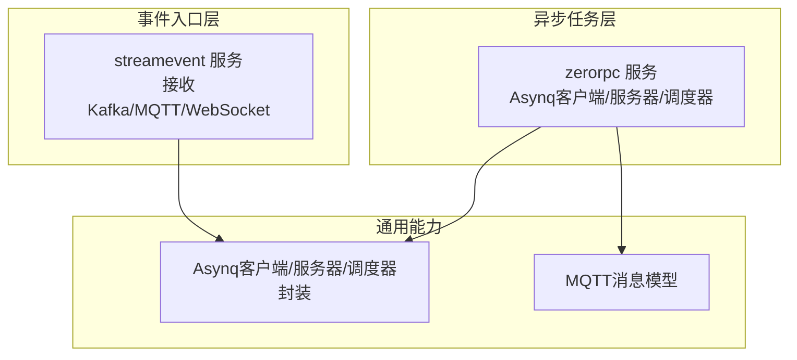
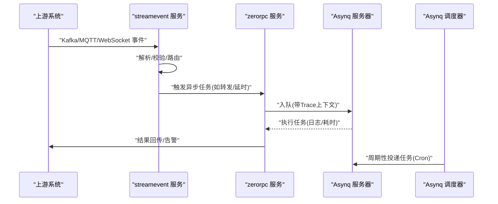
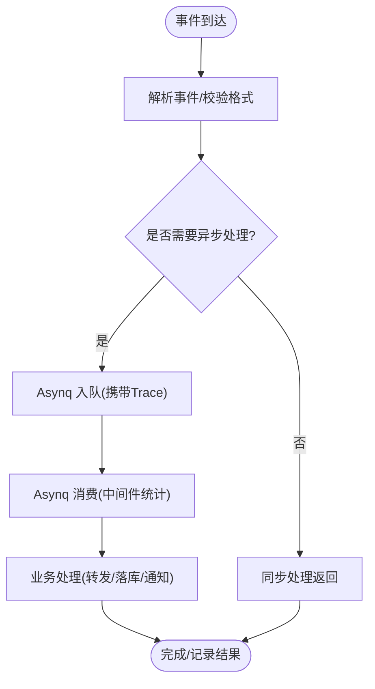
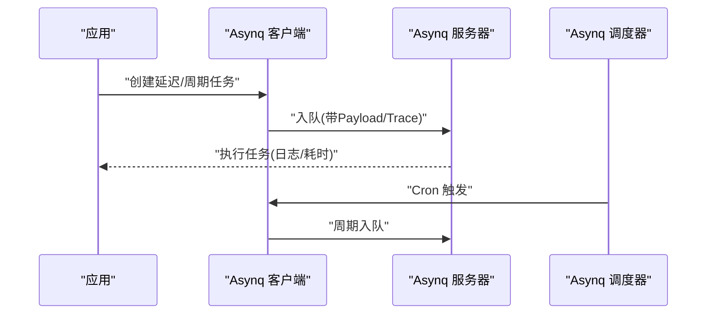
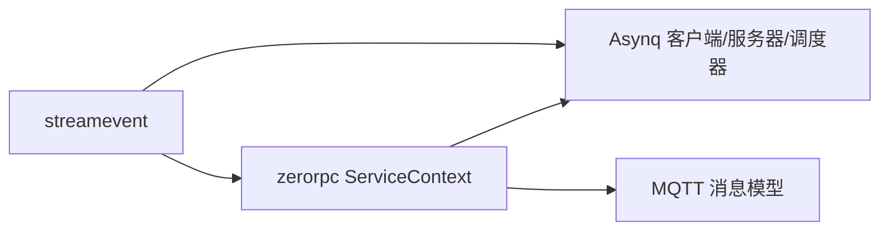

# 事件驱动架构

<cite>
**本文引用的文件**
- [facade/streamevent/streamevent.go](file://facade/streamevent/streamevent.go)
- [facade/streamevent/etc/streamevent.yaml](file://facade/streamevent/etc/streamevent.yaml)
- [facade/streamevent/internal/svc/servicecontext.go](file://facade/streamevent/internal/svc/servicecontext.go)
- [facade/streamevent/internal/logic/receivekafkamessagelogic.go](file://facade/streamevent/internal/logic/receivekafkamessagelogic.go)
- [facade/streamevent/internal/logic/receivemqttmessagelogic.go](file://facade/streamevent/internal/logic/receivemqttmessagelogic.go)
- [facade/streamevent/internal/logic/receivewsmessagelogic.go](file://facade/streamevent/internal/logic/receivewsmessagelogic.go)
- [zerorpc/zerorpc.go](file://zerorpc/zerorpc.go)
- [zerorpc/etc/zerorpc.yaml](file://zerorpc/etc/zerorpc.yaml)
- [zerorpc/internal/svc/servicecontext.go](file://zerorpc/internal/svc/servicecontext.go)
- [zerorpc/internal/task/deferdelaytask.go](file://zerorpc/internal/task/deferdelaytask.go)
- [zerorpc/internal/task/deferforwardtask.go](file://zerorpc/internal/task/deferforwardtask.go)
- [common/asynqx/asynqClient.go](file://common/asynqx/asynqClient.go)
- [common/asynqx/asynqTaskServer.go](file://common/asynqx/asynqTaskServer.go)
- [common/asynqx/asynqSchedulerServer.go](file://common/asynqx/asynqSchedulerServer.go)
- [common/mqttx/message.go](file://common/mqttx/message.go)
</cite>

## 目录
1. [引言](#引言)
2. [项目结构](#项目结构)
3. [核心组件](#核心组件)
4. [架构总览](#架构总览)
5. [详细组件分析](#详细组件分析)
6. [依赖分析](#依赖分析)
7. [性能考虑](#性能考虑)
8. [故障排查指南](#故障排查指南)
9. [结论](#结论)
10. [附录](#附录)

## 引言
本文件面向 zero-service 的事件驱动架构，系统性阐述事件产生、传播与消费的完整闭环；解析 Kafka 在事件驱动中的角色（主题设计、分区策略、消费者组管理）；说明基于 Asynq 的异步任务调度机制（定时、延迟、周期任务）；并讨论事件溯源与命令查询职责分离（CQRS）在本项目中的应用边界与实践建议。同时覆盖事件一致性、事件重放与事件版本管理等高级特性。

## 项目结构
- 事件入口与多协议接入层：facade/streamevent 提供统一 RPC 入口，负责接收来自 Kafka、MQTT、WebSocket 等上游事件，并进行路由与转发。
- 异步任务调度层：zerorpc 内置 Asynq 客户端、任务服务器与调度器，承载延迟任务、转发任务等异步处理。
- 通用能力：common/asynqx 提供 Asynq 客户端、任务服务器、调度器封装与链路追踪埋点；common/mqttx 提供 MQTT 消息模型与头部扩展能力。

图表来源
- [facade/streamevent/streamevent.go:28-71](file://facade/streamevent/streamevent.go#L28-L71)
- [zerorpc/zerorpc.go:26-58](file://zerorpc/zerorpc.go#L26-L58)
- [common/asynqx/asynqClient.go:17-30](file://common/asynqx/asynqClient.go#L17-L30)
- [common/asynqx/asynqTaskServer.go:39-63](file://common/asynqx/asynqTaskServer.go#L39-L63)
- [common/asynqx/asynqSchedulerServer.go:32-51](file://common/asynqx/asynqSchedulerServer.go#L32-L51)
- [common/mqttx/message.go:3-30](file://common/mqttx/message.go#L3-L30)

章节来源
- [facade/streamevent/streamevent.go:28-71](file://facade/streamevent/streamevent.go#L28-L71)
- [zerorpc/zerorpc.go:26-58](file://zerorpc/zerorpc.go#L26-L58)

## 核心组件
- 事件入口服务（streamevent）
  - 负责注册 gRPC 服务、加载配置、可选 Nacos 注册、拦截器注入与日志字段设置。
  - 提供接收 Kafka、MQTT、WebSocket 消息的逻辑入口（当前占位，具体实现待填充）。
- 异步任务服务（zerorpc）
  - 同时启动 RPC 服务、Asynq 任务服务器与调度器，形成“请求即任务”的异步处理闭环。
  - 通过 ServiceContext 统一持有 Asynq 客户端、服务器、调度器、HTTP 客户端、告警客户端与数据库模型。
- Asynq 通用封装
  - 客户端：生产者侧创建任务并携带链路追踪上下文。
  - 任务服务器：定义队列优先级、并发度、日志与中间件（含耗时统计与错误记录）。
  - 调度器：支持 Cron 表达式周期任务，提供注册与回调日志。
- MQTT 消息模型
  - 支持自定义 headers 扩展，便于事件元数据传递与跨系统解耦。

章节来源
- [facade/streamevent/streamevent.go:28-71](file://facade/streamevent/streamevent.go#L28-L71)
- [facade/streamevent/etc/streamevent.yaml:1-28](file://facade/streamevent/etc/streamevent.yaml#L1-L28)
- [facade/streamevent/internal/svc/servicecontext.go:14-32](file://facade/streamevent/internal/svc/servicecontext.go#L14-L32)
- [facade/streamevent/internal/logic/receivekafkamessagelogic.go:27-31](file://facade/streamevent/internal/logic/receivekafkamessagelogic.go#L27-L31)
- [facade/streamevent/internal/logic/receivemqttmessagelogic.go:27-31](file://facade/streamevent/internal/logic/receivemqttmessagelogic.go#L27-L31)
- [facade/streamevent/internal/logic/receivewsmessagelogic.go:27-31](file://facade/streamevent/internal/logic/receivewsmessagelogic.go#L27-L31)
- [zerorpc/zerorpc.go:35-58](file://zerorpc/zerorpc.go#L35-L58)
- [zerorpc/etc/zerorpc.yaml:1-39](file://zerorpc/etc/zerorpc.yaml#L1-L39)
- [zerorpc/internal/svc/servicecontext.go:19-101](file://zerorpc/internal/svc/servicecontext.go#L19-L101)
- [common/asynqx/asynqClient.go:17-30](file://common/asynqx/asynqClient.go#L17-L30)
- [common/asynqx/asynqTaskServer.go:39-63](file://common/asynqx/asynqTaskServer.go#L39-L63)
- [common/asynqx/asynqSchedulerServer.go:32-51](file://common/asynqx/asynqSchedulerServer.go#L32-L51)
- [common/mqttx/message.go:3-30](file://common/mqttx/message.go#L3-L30)

## 架构总览
事件驱动从“多源输入”开始，经由“统一入口”汇聚，再通过“异步任务”完成最终处理。Kafka 作为事件总线承担高吞吐、持久化与横向扩展能力；MQTT/WebSocket 用于实时事件与低延迟交互；Asynq 提供可靠的任务编排与调度。

图表来源
- [facade/streamevent/streamevent.go:28-71](file://facade/streamevent/streamevent.go#L28-L71)
- [zerorpc/zerorpc.go:35-58](file://zerorpc/zerorpc.go#L35-L58)
- [common/asynqx/asynqTaskServer.go:28-37](file://common/asynqx/asynqTaskServer.go#L28-L37)
- [common/asynqx/asynqSchedulerServer.go:21-26](file://common/asynqx/asynqSchedulerServer.go#L21-L26)

## 详细组件分析

### 事件产生与传播
- 事件产生
  - Kafka：作为事件总线，上游系统将业务事件写入指定 Topic，按业务域划分主题，使用设备/区域/业务类型等作为键或分区策略依据。
  - MQTT/WebSocket：实时事件通道，适合低延迟场景，消息体可携带 headers 扩展元信息。
- 事件传播
  - streamevent 作为统一入口，负责将不同来源的事件标准化后，投递到内部任务队列或直接转发给下游服务。
  - 传播过程中携带 Trace 上下文，确保跨服务链路可观测。

章节来源
- [facade/streamevent/internal/logic/receivekafkamessagelogic.go:27-31](file://facade/streamevent/internal/logic/receivekafkamessagelogic.go#L27-L31)
- [facade/streamevent/internal/logic/receivemqttmessagelogic.go:27-31](file://facade/streamevent/internal/logic/receivemqttmessagelogic.go#L27-L31)
- [facade/streamevent/internal/logic/receivewsmessagelogic.go:27-31](file://facade/streamevent/internal/logic/receivewsmessagelogic.go#L27-L31)
- [common/mqttx/message.go:3-30](file://common/mqttx/message.go#L3-L30)

### Kafka 在事件驱动中的角色
- 主题设计
  - 建议按“业务域/事件类型/租户/环境”分层命名，例如：business.event-type.tenant.env。
  - 高频事件与长尾事件可分主题，避免热点倾斜。
- 分区策略
  - 使用业务键（如设备ID、区域ID）作为分区键，保障事件顺序与负载均衡。
  - 分区数应结合并发消费者组规模与吞吐需求评估。
- 消费者组管理
  - 不同消费语义（至少一次、幂等）对应不同的消费者组与偏移量管理策略。
  - 增加消费者组以提升并行度，注意分区与消费者数量匹配，避免空转或争抢。

（本节为概念性说明，未直接分析具体文件）

### 事件消费与任务执行
- streamevent
  - 提供接收 Kafka/MQTT/WebSocket 的逻辑入口，后续可在此实现事件落库、路由与任务下发。
- zerorpc
  - 通过 Asynq 任务服务器执行实际业务逻辑，内置中间件记录耗时与错误，便于问题定位。
  - 任务处理器从 payload 中提取上下文，恢复链路追踪，确保可观测性。

图表来源
- [common/asynqx/asynqTaskServer.go:73-86](file://common/asynqx/asynqTaskServer.go#L73-L86)
- [zerorpc/internal/task/deferdelaytask.go:23-36](file://zerorpc/internal/task/deferdelaytask.go#L23-L36)
- [zerorpc/internal/task/deferforwardtask.go:31-96](file://zerorpc/internal/task/deferforwardtask.go#L31-L96)

章节来源
- [zerorpc/internal/task/deferdelaytask.go:23-36](file://zerorpc/internal/task/deferdelaytask.go#L23-L36)
- [zerorpc/internal/task/deferforwardtask.go:31-96](file://zerorpc/internal/task/deferforwardtask.go#L31-L96)
- [common/asynqx/asynqTaskServer.go:73-86](file://common/asynqx/asynqTaskServer.go#L73-L86)

### 异步任务调度机制
- 延迟任务
  - 通过 Asynq 客户端创建带延迟的任务，适用于“稍后重试/延时通知”等场景。
- 周期任务
  - 使用 Asynq 调度器注册 Cron 表达式，周期性投递任务，适合巡检、报表生成等。
- 定时任务
  - 与周期任务类似，但更强调“固定时间点”的执行，可通过调度器统一管理。

图表来源
- [common/asynqx/asynqClient.go:17-30](file://common/asynqx/asynqClient.go#L17-L30)
- [common/asynqx/asynqTaskServer.go:28-37](file://common/asynqx/asynqTaskServer.go#L28-L37)
- [common/asynqx/asynqSchedulerServer.go:21-26](file://common/asynqx/asynqSchedulerServer.go#L21-L26)

章节来源
- [common/asynqx/asynqClient.go:17-30](file://common/asynqx/asynqClient.go#L17-L30)
- [common/asynqx/asynqTaskServer.go:28-37](file://common/asynqx/asynqTaskServer.go#L28-L37)
- [common/asynqx/asynqSchedulerServer.go:21-26](file://common/asynqx/asynqSchedulerServer.go#L21-L26)

### 事件溯源与 CQRS 应用场景
- 事件溯源
  - 建议对关键业务状态变更仅追加事件，配合读模型重建视图，实现审计与回溯。
  - 在本项目中，可将 Kafka 作为事件存储，结合 streamevent 的事件落库逻辑，逐步沉淀事件流。
- CQRS
  - 命令侧负责写操作与事件发布；查询侧独立维护只读模型，提升查询性能。
  - 通过 Asynq 任务将命令转换为事件并更新查询模型，实现解耦。

（本节为概念性说明，未直接分析具体文件）

### 事件一致性、重放与版本管理
- 一致性
  - 采用“先事件、后状态”的模式，结合幂等键与去重表，保证最终一致。
- 重放
  - 对历史事件进行重放，验证读模型重建与业务规则正确性；建议在灰度环境中执行。
- 版本管理
  - 事件版本号与 Schema Registry 结合，确保向后兼容；处理升级过程中的兼容性问题。

（本节为概念性说明，未直接分析具体文件）

## 依赖分析
- streamevent 依赖 zerorpc 的告警客户端与内部服务上下文（如需转发），以及 Asynq 客户端（如需在入口侧投递任务）。
- zerorpc 依赖 Asynq 客户端、服务器与调度器，统一通过 ServiceContext 注入。
- MQTT 消息模型为事件元数据提供扩展容器，便于跨系统传递。

图表来源
- [facade/streamevent/internal/svc/servicecontext.go:14-32](file://facade/streamevent/internal/svc/servicecontext.go#L14-L32)
- [zerorpc/internal/svc/servicecontext.go:19-101](file://zerorpc/internal/svc/servicecontext.go#L19-L101)
- [common/mqttx/message.go:3-30](file://common/mqttx/message.go#L3-L30)

章节来源
- [facade/streamevent/internal/svc/servicecontext.go:14-32](file://facade/streamevent/internal/svc/servicecontext.go#L14-L32)
- [zerorpc/internal/svc/servicecontext.go:19-101](file://zerorpc/internal/svc/servicecontext.go#L19-L101)
- [common/mqttx/message.go:3-30](file://common/mqttx/message.go#L3-L30)

## 性能考虑
- Kafka
  - 合理设置分区数与副本，避免单分区瓶颈；开启压缩与批处理提升吞吐。
  - 消费端批量拉取与背压控制，避免 OOM。
- Asynq
  - 队列分级（critical/default/low）与并发度调优，结合中间件日志定位慢任务。
  - Redis 连接池大小与超时参数，避免成为瓶颈。
- 链路追踪
  - 在生产者/消费者 Span 中标注任务类型与 ID，便于端到端性能分析。

（本节提供一般性指导，未直接分析具体文件）

## 故障排查指南
- 任务执行失败
  - 查看 Asynq 任务服务器日志，确认错误类型与耗时；检查中间件输出的错误堆栈。
  - 对于转发类任务，关注 HTTP 调用状态码与超时，必要时启用告警上报。
- 事件未到达
  - 检查 streamevent 的事件入口逻辑是否已实现；核对 Kafka/MQTT 订阅与权限。
  - 确认 Asynq 队列与消费者组配置，避免分区与消费者不匹配。
- 配置问题
  - 核对 zerorpc/streamevent 的 YAML 配置项，特别是 Redis、DB、告警与日志路径。

章节来源
- [common/asynqx/asynqTaskServer.go:73-86](file://common/asynqx/asynqTaskServer.go#L73-L86)
- [zerorpc/internal/task/deferforwardtask.go:50-96](file://zerorpc/internal/task/deferforwardtask.go#L50-L96)
- [zerorpc/etc/zerorpc.yaml:13-39](file://zerorpc/etc/zerorpc.yaml#L13-L39)
- [facade/streamevent/etc/streamevent.yaml:14-28](file://facade/streamevent/etc/streamevent.yaml#L14-L28)

## 结论
zero-service 的事件驱动架构以 streamevent 为入口、zerorpc 为中枢，结合 Kafka 与 Asynq 实现高吞吐、可扩展的事件处理体系。通过链路追踪与中间件日志，系统具备良好的可观测性；通过延迟/周期任务满足多样化的异步需求。建议在后续演进中完善事件溯源与 CQRS，强化事件版本与重放能力，持续优化 Kafka 分区与消费者组配置，以支撑更大规模的业务增长。

## 附录
- 关键流程参考路径
  - 事件入口启动与注册：[facade/streamevent/streamevent.go:28-71](file://facade/streamevent/streamevent.go#L28-L71)
  - 异步任务服务启动与调度：[zerorpc/zerorpc.go:35-58](file://zerorpc/zerorpc.go#L35-L58)
  - Asynq 客户端/服务器/调度器封装：[common/asynqx/asynqClient.go:17-30](file://common/asynqx/asynqClient.go#L17-L30)、[common/asynqx/asynqTaskServer.go:39-63](file://common/asynqx/asynqTaskServer.go#L39-L63)、[common/asynqx/asynqSchedulerServer.go:32-51](file://common/asynqx/asynqSchedulerServer.go#L32-L51)
  - 事件入口上下文与数据库连接：[facade/streamevent/internal/svc/servicecontext.go:14-32](file://facade/streamevent/internal/svc/servicecontext.go#L14-L32)
  - 任务上下文与外部依赖注入：[zerorpc/internal/svc/servicecontext.go:19-101](file://zerorpc/internal/svc/servicecontext.go#L19-L101)
  - MQTT 消息模型与头部扩展：[common/mqttx/message.go:3-30](file://common/mqttx/message.go#L3-L30)