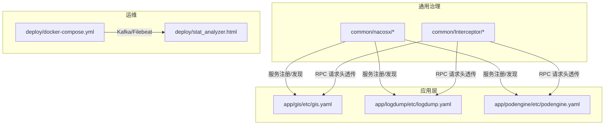
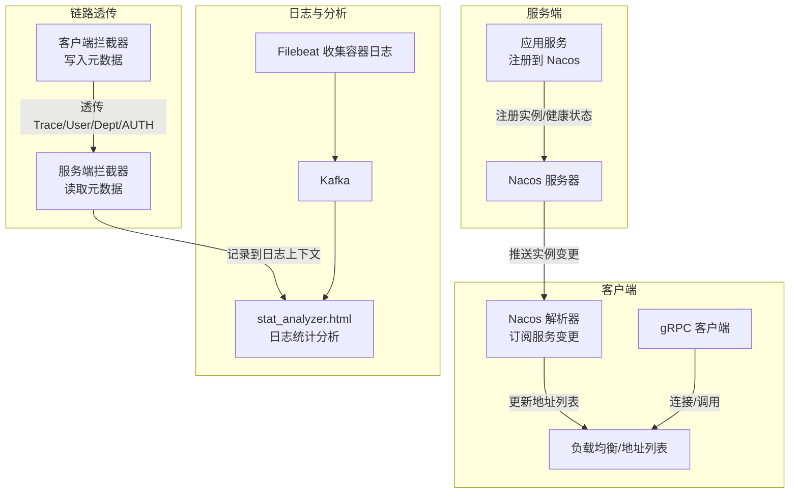
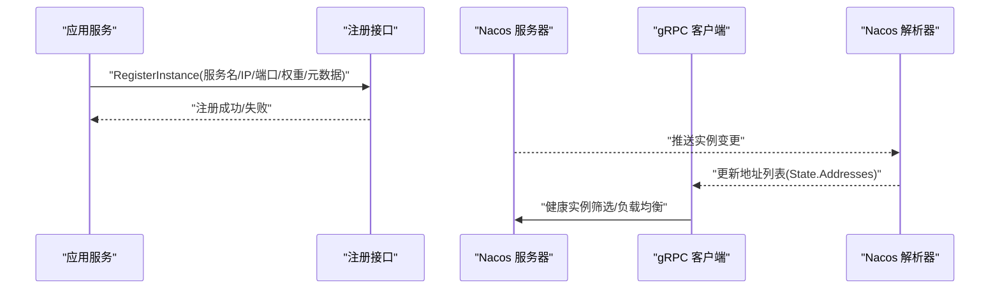
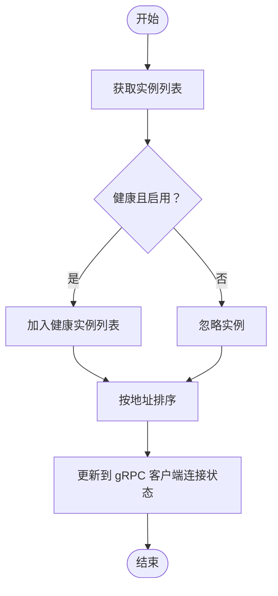
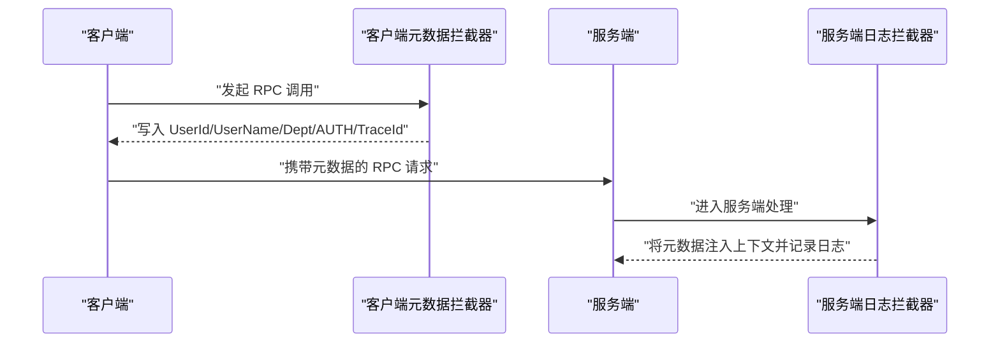
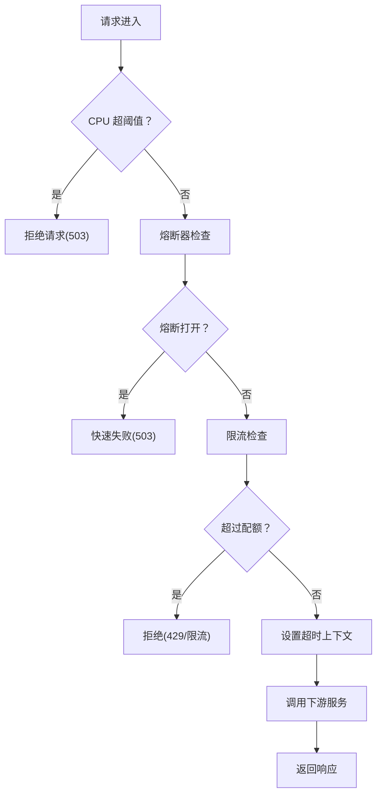
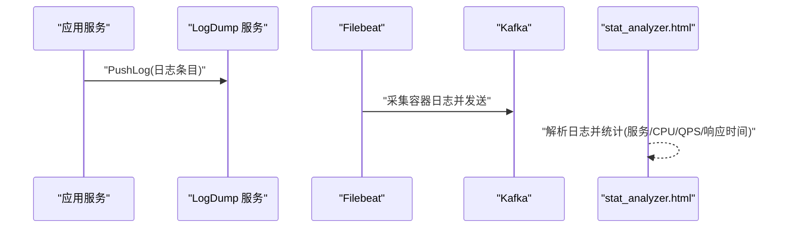
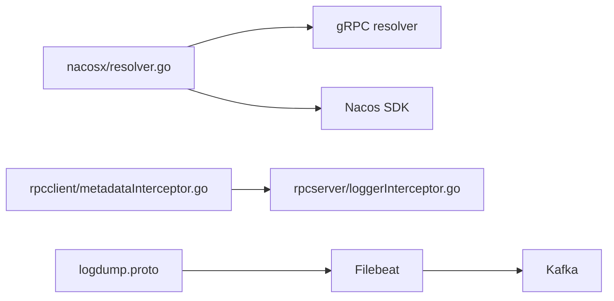

# 微服务治理

<cite>
**本文引用的文件**
- [common/nacosx/register.go](file://common/nacosx/register.go)
- [common/nacosx/resolver.go](file://common/nacosx/resolver.go)
- [common/nacosx/options.go](file://common/nacosx/options.go)
- [common/nacosx/target.go](file://common/nacosx/target.go)
- [common/nacosx/config.go](file://common/nacosx/config.go)
- [common/socketiox/container.go](file://common/socketiox/container.go)
- [common/Interceptor/rpcserver/loggerInterceptor.go](file://common/Interceptor/rpcserver/loggerInterceptor.go)
- [common/Interceptor/rpcclient/metadataInterceptor.go](file://common/Interceptor/rpcclient/metadataInterceptor.go)
- [deploy/docker-compose.yml](file://deploy/docker-compose.yml)
- [deploy/stat_analyzer.html](file://deploy/stat_analyzer.html)
- [.trae/skills/zero-skills/references/resilience-patterns.md](file://.trae/skills/zero-skills/references/resilience-patterns.md)
- [app/logdump/logdump/logdump.pb.go](file://app/logdump/logdump/logdump.pb.go)
- [app/logdump/logdump/logdump_grpc.pb.go](file://app/logdump/logdump/logdump_grpc.pb.go)
- [app/gis/internal/config/config.go](file://app/gis/internal/config/config.go)
- [app/logdump/internal/config/config.go](file://app/logdump/internal/config/config.go)
- [app/podengine/internal/config/config.go](file://app/podengine/internal/config/config.go)
</cite>

## 目录
1. [引言](#引言)
2. [项目结构](#项目结构)
3. [核心组件](#核心组件)
4. [架构总览](#架构总览)
5. [详细组件分析](#详细组件分析)
6. [依赖分析](#依赖分析)
7. [性能考量](#性能考量)
8. [故障排查指南](#故障排查指南)
9. [结论](#结论)
10. [附录](#附录)

## 引言
本文件面向 zero-service 的微服务治理实践，系统阐述服务注册与发现、配置管理、流量控制、熔断降级、限流保护、分布式追踪与日志聚合、监控指标体系以及故障隔离、优雅停机、滚动更新等运维治理策略。重点说明 Nacos 在服务治理中的作用（服务注册、健康检查、动态配置），并结合项目中已有的注册中心集成、拦截器链路透传、负载均衡与健康实例筛选、日志采集与可视化分析等能力，给出可落地的实施建议。

## 项目结构
从微服务治理视角，本仓库的关键组织方式如下：
- 通用治理能力：位于 common/nacosx，提供 Nacos 客户端封装、服务注册、解析器与目标参数解析。
- 通用拦截器：位于 common/Interceptor，统一注入与透传上下文信息（如用户、部门、授权、TraceId）。
- 应用配置：各应用在 etc 下提供 YAML 配置，其中部分应用包含 Nacos 注册开关与参数。
- 运维编排：deploy/docker-compose.yml 提供 Kafka、Filebeat 等基础设施编排；stat_analyzer.html 提供日志统计分析页面。
- 文档与最佳实践：.trae/skills/zero-skills/references/resilience-patterns.md 提供熔断、限流、超时等治理模式。

**图表来源**
- [common/nacosx/register.go:21-76](file://common/nacosx/register.go#L21-L76)
- [common/nacosx/resolver.go:38-66](file://common/nacosx/resolver.go#L38-L66)
- [common/Interceptor/rpcserver/loggerInterceptor.go:12-44](file://common/Interceptor/rpcserver/loggerInterceptor.go#L12-L44)
- [common/Interceptor/rpcclient/metadataInterceptor.go:11-32](file://common/Interceptor/rpcclient/metadataInterceptor.go#L11-L32)
- [deploy/docker-compose.yml:1-110](file://deploy/docker-compose.yml#L1-L110)
- [deploy/stat_analyzer.html:862-888](file://deploy/stat_analyzer.html#L862-L888)

**章节来源**
- [deploy/docker-compose.yml:1-110](file://deploy/docker-compose.yml#L1-L110)

## 核心组件
- Nacos 治理组件（common/nacosx）
  - 服务注册与注销：通过命名客户端注册实例并在进程退出时自动反注册，支持权重、集群、分组、元数据。
  - 解析器与地址更新：订阅服务变更，提取健康 gRPC 实例，排序后更新到 gRPC 客户端连接状态。
  - 目标参数解析：支持从 URL 参数解析用户名、密码、命名空间、日志级别、缓存目录等。
  - 日志初始化：统一设置 Nacos SDK 日志级别与输出路径。
- RPC 拦截器（common/Interceptor）
  - 服务端：从入站元数据读取用户、部门、授权、TraceId 等，注入到请求上下文，便于日志与追踪。
  - 客户端：从上下文读取上述字段，写入出站元数据，实现跨服务链路透传。
- 应用配置（各应用 etc/*.yaml）
  - 部分应用配置了 Nacos 注册开关与参数（如服务名、命名空间、用户名/密码等），用于启用服务注册与发现。
- 日志与可视化（app/logdump、deploy/stat_analyzer.html）
  - logdump 提供 PushLog/Ping 接口，用于接收日志；Filebeat 将容器日志采集至 Kafka；stat_analyzer.html 可对日志进行统计分析。

**章节来源**
- [common/nacosx/register.go:21-76](file://common/nacosx/register.go#L21-L76)
- [common/nacosx/resolver.go:38-66](file://common/nacosx/resolver.go#L38-L66)
- [common/nacosx/target.go:31-79](file://common/nacosx/target.go#L31-L79)
- [common/nacosx/config.go:23-37](file://common/nacosx/config.go#L23-L37)
- [common/Interceptor/rpcserver/loggerInterceptor.go:12-44](file://common/Interceptor/rpcserver/loggerInterceptor.go#L12-L44)
- [common/Interceptor/rpcclient/metadataInterceptor.go:11-32](file://common/Interceptor/rpcclient/metadataInterceptor.go#L11-L32)
- [app/logdump/logdump/logdump.pb.go:320-409](file://app/logdump/logdump/logdump.pb.go#L320-L409)
- [app/logdump/logdump/logdump_grpc.pb.go:107-161](file://app/logdump/logdump/logdump_grpc.pb.go#L107-L161)
- [deploy/stat_analyzer.html:862-888](file://deploy/stat_analyzer.html#L862-L888)

## 架构总览
下图展示了基于 Nacos 的服务注册与发现、健康实例筛选、gRPC 客户端连接更新、RPC 元数据透传与日志采集的整体流程。

**图表来源**
- [common/nacosx/register.go:41-76](file://common/nacosx/register.go#L41-L76)
- [common/nacosx/resolver.go:38-66](file://common/nacosx/resolver.go#L38-L66)
- [common/Interceptor/rpcserver/loggerInterceptor.go:12-44](file://common/Interceptor/rpcserver/loggerInterceptor.go#L12-L44)
- [common/Interceptor/rpcclient/metadataInterceptor.go:11-32](file://common/Interceptor/rpcclient/metadataInterceptor.go#L11-L32)
- [deploy/docker-compose.yml:32-53](file://deploy/docker-compose.yml#L32-L53)
- [deploy/stat_analyzer.html:862-888](file://deploy/stat_analyzer.html#L862-L888)

## 详细组件分析

### Nacos 服务注册与发现
- 服务注册
  - 通过命名客户端注册实例，携带 IP、端口、权重、健康状态、集群、分组与元数据；进程退出时自动反注册，确保资源回收。
- 解析器与地址更新
  - 订阅指定服务名、集群、分组；回调中提取健康且启用的 gRPC 实例，按地址字符串排序后更新到 gRPC 客户端连接状态，避免重复地址列表导致的负载均衡抖动。
- 目标参数解析
  - 从 URL 参数解析用户名、密码、命名空间、日志级别、缓存目录等，并支持环境变量覆盖；默认命名空间为 public。
- 日志初始化
  - 统一设置 Nacos SDK 日志级别、输出目录与是否输出到标准输出。

**图表来源**
- [common/nacosx/register.go:41-76](file://common/nacosx/register.go#L41-L76)
- [common/nacosx/resolver.go:38-66](file://common/nacosx/resolver.go#L38-L66)

**章节来源**
- [common/nacosx/register.go:21-76](file://common/nacosx/register.go#L21-L76)
- [common/nacosx/resolver.go:13-74](file://common/nacosx/resolver.go#L13-L74)
- [common/nacosx/target.go:31-79](file://common/nacosx/target.go#L31-L79)
- [common/nacosx/config.go:23-37](file://common/nacosx/config.go#L23-L37)

### 健康检查与实例筛选
- 健康实例筛选逻辑会过滤掉缺少 gRPC 端口元数据或不健康/未启用的实例，仅保留健康实例并按地址排序后提交给 gRPC 负载均衡器。
- 该机制确保客户端始终连接到可用实例，降低因实例异常导致的调用失败。

**图表来源**
- [common/socketiox/container.go:318-346](file://common/socketiox/container.go#L318-L346)

**章节来源**
- [common/socketiox/container.go:318-346](file://common/socketiox/container.go#L318-L346)

### RPC 元数据透传与分布式追踪
- 客户端拦截器：从上下文读取用户、部门、授权、TraceId 等，写入出站元数据，保证跨服务链路一致。
- 服务端拦截器：从入站元数据读取上述键值，注入到请求上下文，便于日志记录与追踪。
- 建议在网关或入口服务生成 TraceId 并下发，配合下游服务的日志聚合与检索实现端到端追踪。

**图表来源**
- [common/Interceptor/rpcclient/metadataInterceptor.go:11-32](file://common/Interceptor/rpcclient/metadataInterceptor.go#L11-L32)
- [common/Interceptor/rpcserver/loggerInterceptor.go:12-44](file://common/Interceptor/rpcserver/loggerInterceptor.go#L12-L44)

**章节来源**
- [common/Interceptor/rpcclient/metadataInterceptor.go:11-56](file://common/Interceptor/rpcclient/metadataInterceptor.go#L11-L56)
- [common/Interceptor/rpcserver/loggerInterceptor.go:12-44](file://common/Interceptor/rpcserver/loggerInterceptor.go#L12-L44)

### 配置管理与动态配置
- Nacos 目标参数解析支持从 URL 参数与环境变量读取命名空间、日志级别、缓存目录等，便于在不同环境动态调整行为。
- 建议将应用运行时配置（如限流阈值、熔断窗口、日志级别）迁移到 Nacos 动态配置，结合客户端订阅实现热更新。

**章节来源**
- [common/nacosx/target.go:31-79](file://common/nacosx/target.go#L31-L79)
- [common/nacosx/config.go:23-37](file://common/nacosx/config.go#L23-L37)

### 流量控制、熔断降级与限流保护
- 熔断降级：项目内置熔断器算法，自动保护 RPC 调用、数据库与 Redis 操作；支持手动熔断器以自定义可接受错误类型。
- 负载削峰：生产模式下自动启用负载削峰，当 CPU 使用率超过阈值时拒绝请求，防止雪崩。
- 限流保护：可结合令牌桶/漏桶等限流策略对外部接口与公共 API 进行限流，避免瞬时洪峰压垮下游。
- 超时控制：通过服务级、处理器级与操作级超时，配合 context 传播，避免请求悬挂。

**图表来源**
- [.trae/skills/zero-skills/references/resilience-patterns.md:95-123](file://.trae/skills/zero-skills/references/resilience-patterns.md#L95-L123)

**章节来源**
- [.trae/skills/zero-skills/references/resilience-patterns.md:13-113](file://.trae/skills/zero-skills/references/resilience-patterns.md#L13-L113)

### 分布式追踪与日志聚合
- 追踪：通过元数据拦截器在请求头中透传 TraceId，结合日志上下文记录，形成端到端链路。
- 日志：logdump 提供 PushLog 接口接收日志；Filebeat 将容器日志采集到 Kafka；stat_analyzer.html 对日志进行统计分析（如服务、CPU、GC、QPS、响应时间等）。

**图表来源**
- [app/logdump/logdump/logdump.pb.go:320-409](file://app/logdump/logdump/logdump.pb.go#L320-L409)
- [app/logdump/logdump/logdump_grpc.pb.go:107-161](file://app/logdump/logdump/logdump_grpc.pb.go#L107-L161)
- [deploy/docker-compose.yml:32-53](file://deploy/docker-compose.yml#L32-L53)
- [deploy/stat_analyzer.html:862-888](file://deploy/stat_analyzer.html#L862-L888)

**章节来源**
- [app/logdump/logdump/logdump.pb.go:320-409](file://app/logdump/logdump/logdump.pb.go#L320-L409)
- [app/logdump/logdump/logdump_grpc.pb.go:107-161](file://app/logdump/logdump/logdump_grpc.pb.go#L107-L161)
- [deploy/docker-compose.yml:32-53](file://deploy/docker-compose.yml#L32-L53)
- [deploy/stat_analyzer.html:862-888](file://deploy/stat_analyzer.html#L862-L888)

### 监控指标体系
- 关键指标建议
  - 服务可用性：熔断器状态、健康检查成功率、实例存活率。
  - 响应时间：平均/中位/分位延迟（p90/p99/p999）。
  - 吞吐量：QPS、不同类型请求占比（general/特定接口）。
  - 资源使用：CPU 使用率、内存分配、GC 次数与暂停时间。
  - 负载保护：负载削峰触发次数、丢弃请求数。
- 指标来源
  - 日志统计分析页面已包含服务、CPU、GC、QPS、响应时间等字段，可作为观测基线。

**章节来源**
- [deploy/stat_analyzer.html:862-888](file://deploy/stat_analyzer.html#L862-L888)

### 运维治理策略
- 故障隔离
  - 通过熔断器与负载削峰隔离故障影响面；对下游依赖设置独立熔断器与超时。
- 优雅停机
  - 注册时设置临时实例，停机前主动反注册，避免流量打到已停止实例。
- 滚动更新
  - 通过 Nacos 健康检查与实例筛选，逐步替换实例；结合探活探活接口（如 Ping）验证健康后再切流量。

**章节来源**
- [common/nacosx/register.go:58-76](file://common/nacosx/register.go#L58-L76)
- [.trae/skills/zero-skills/references/resilience-patterns.md:95-113](file://.trae/skills/zero-skills/references/resilience-patterns.md#L95-L113)

## 依赖分析
- 组件耦合
  - Nacos 解析器依赖 Nacos SDK 与 gRPC resolver 接口，负责将服务端实例映射为客户端地址列表。
  - RPC 拦截器与上下文数据模块解耦，通过元数据键名约定实现跨服务传递。
- 外部依赖
  - Nacos SDK：服务注册、发现、订阅。
  - gRPC：客户端连接与负载均衡。
  - Kafka/Filebeat：日志采集与传输。
- 潜在风险
  - 实例筛选条件严格可能导致地址列表为空，需结合健康探活与降级策略。
  - 环境变量覆盖参数需统一规范，避免误配。

**图表来源**
- [common/nacosx/resolver.go:38-66](file://common/nacosx/resolver.go#L38-L66)
- [common/Interceptor/rpcclient/metadataInterceptor.go:11-32](file://common/Interceptor/rpcclient/metadataInterceptor.go#L11-L32)
- [common/Interceptor/rpcserver/loggerInterceptor.go:12-44](file://common/Interceptor/rpcserver/loggerInterceptor.go#L12-L44)
- [app/logdump/logdump/logdump.pb.go:320-409](file://app/logdump/logdump/logdump.pb.go#L320-L409)
- [deploy/docker-compose.yml:32-53](file://deploy/docker-compose.yml#L32-L53)

**章节来源**
- [common/nacosx/resolver.go:38-66](file://common/nacosx/resolver.go#L38-L66)
- [common/Interceptor/rpcclient/metadataInterceptor.go:11-32](file://common/Interceptor/rpcclient/metadataInterceptor.go#L11-L32)
- [common/Interceptor/rpcserver/loggerInterceptor.go:12-44](file://common/Interceptor/rpcserver/loggerInterceptor.go#L12-L44)
- [app/logdump/logdump/logdump.pb.go:320-409](file://app/logdump/logdump/logdump.pb.go#L320-L409)
- [deploy/docker-compose.yml:32-53](file://deploy/docker-compose.yml#L32-L53)

## 性能考量
- 实例筛选与排序
  - 健康实例筛选与地址排序为 O(n log n)，建议在大规模实例场景下减少不必要的订阅范围（集群/分组）。
- 负载均衡
  - gRPC 默认轮询策略简单高效；若需更细粒度（如按权重/区域），可在上层接入自定义 LB 或使用支持权重的解析器扩展。
- 日志与分析
  - Filebeat/Kafka/Analyzer 形成链路，注意缓冲区大小与批处理间隔，避免放大延迟。

## 故障排查指南
- 服务无法被发现
  - 检查服务注册参数（服务名、命名空间、集群、分组、元数据 gRPC 端口）是否正确；确认 Nacos 地址与鉴权配置。
- 实例列表为空
  - 检查健康检查与 Enable 标志；确认客户端订阅的服务名/集群/分组与服务端一致。
- 追踪链路缺失
  - 确认客户端拦截器已将 TraceId 写入元数据，服务端拦截器已注入上下文并记录日志。
- 日志未被采集或分析异常
  - 检查 Filebeat 配置与容器日志挂载路径；确认 Kafka 地址可达；查看 stat_analyzer 页面是否正确解析日志字段。

**章节来源**
- [common/nacosx/target.go:31-79](file://common/nacosx/target.go#L31-L79)
- [common/nacosx/resolver.go:38-66](file://common/nacosx/resolver.go#L38-L66)
- [common/Interceptor/rpcclient/metadataInterceptor.go:11-32](file://common/Interceptor/rpcclient/metadataInterceptor.go#L11-L32)
- [common/Interceptor/rpcserver/loggerInterceptor.go:12-44](file://common/Interceptor/rpcserver/loggerInterceptor.go#L12-L44)
- [deploy/docker-compose.yml:32-53](file://deploy/docker-compose.yml#L32-L53)
- [deploy/stat_analyzer.html:862-888](file://deploy/stat_analyzer.html#L862-L888)

## 结论
本项目在微服务治理方面已具备较为完善的基础设施：基于 Nacos 的服务注册与发现、健康实例筛选、gRPC 客户端连接更新；通过 RPC 拦截器实现链路透传与日志上下文注入；借助 Filebeat/Kafka/Analyzer 形成日志采集与可视化闭环。结合内置的熔断、负载削峰、限流与超时机制，可有效提升系统的稳定性与可观测性。后续建议进一步完善动态配置、指标采集与告警联动，以及在生产环境启用健康探活与灰度发布策略。

## 附录
- 应用配置示例（节选）
  - gis 应用配置包含 Nacos 注册开关与参数。
  - logdump 应用配置包含 Nacos 注册开关与额外字段。
  - podengine 应用配置包含 Nacos 注册开关与 Docker 配置项。

**章节来源**
- [app/gis/internal/config/config.go:5-16](file://app/gis/internal/config/config.go#L5-L16)
- [app/logdump/internal/config/config.go:5-17](file://app/logdump/internal/config/config.go#L5-L17)
- [app/podengine/internal/config/config.go:5-17](file://app/podengine/internal/config/config.go#L5-L17)