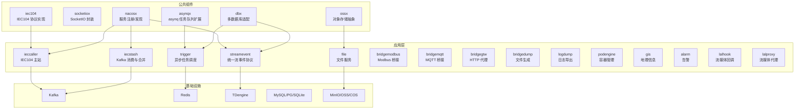
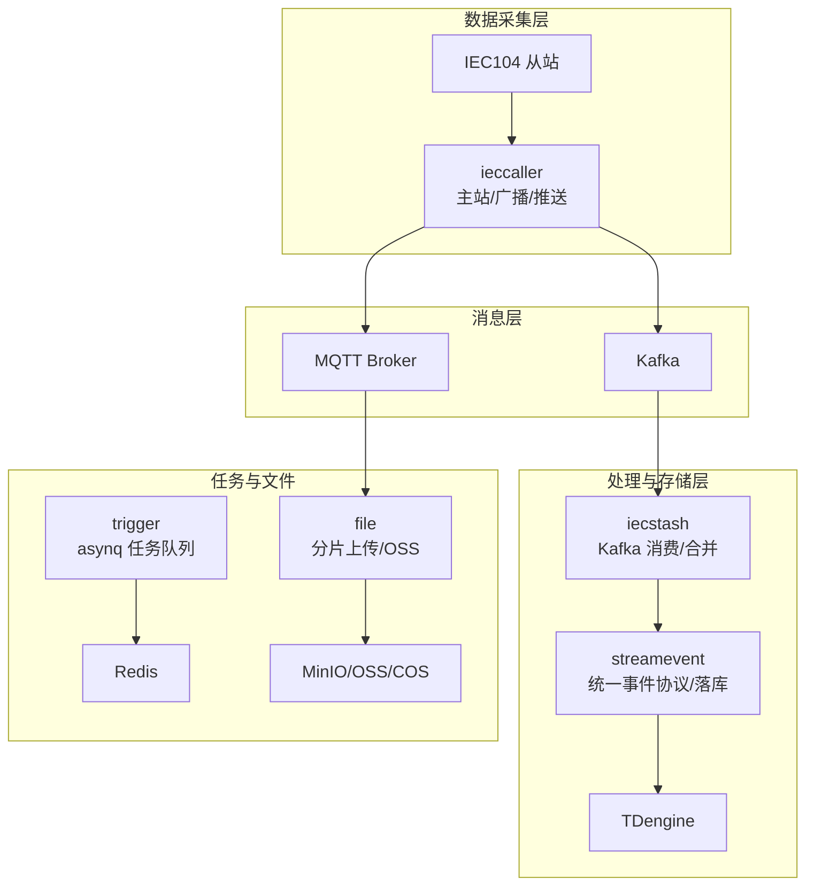
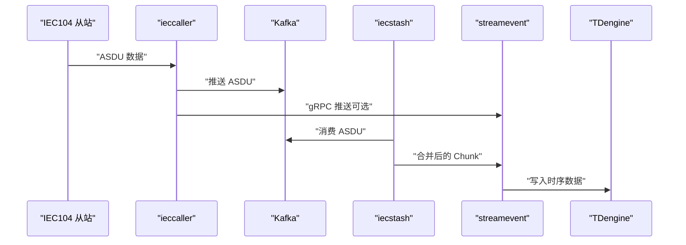
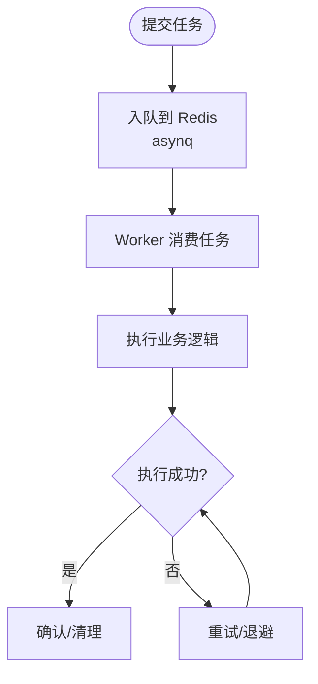
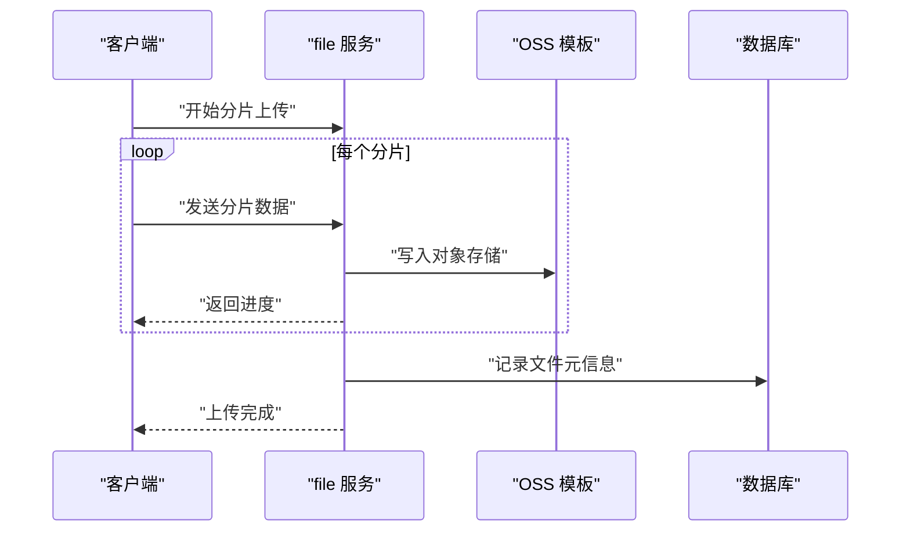
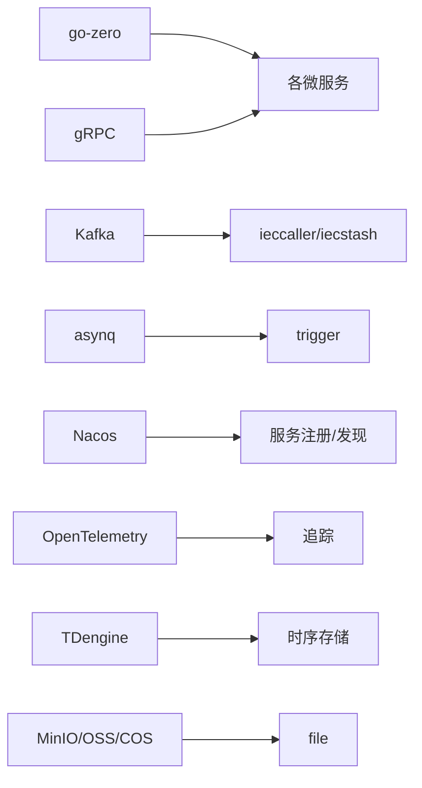

# 微服务设计

<cite>
**本文引用的文件**   
- [README.md](file://README.md)
- [go.mod](file://go.mod)
- [app/ieccaller/etc/ieccaller.yaml](file://app/ieccaller/etc/ieccaller.yaml)
- [app/iecstash/etc/iecstash.yaml](file://app/iecstash/etc/iecstash.yaml)
- [facade/streamevent/etc/streamevent.yaml](file://facade/streamevent/etc/streamevent.yaml)
- [app/trigger/etc/trigger.yaml](file://app/trigger/etc/trigger.yaml)
- [app/file/etc/file.yaml](file://app/file/etc/file.yaml)
- [common/nacosx/config.go](file://common/nacosx/config.go)
- [common/asynqx/asynqClient.go](file://common/asynqx/asynqClient.go)
- [common/ossx/ossx.go](file://common/ossx/ossx.go)
- [app/ieccaller/internal/logic/sendreadcmdlogic.go](file://app/ieccaller/internal/logic/sendreadcmdlogic.go)
- [app/trigger/internal/logic/runplanexecitemlogic.go](file://app/trigger/internal/logic/runplanexecitemlogic.go)
- [app/file/internal/logic/putchunkfilelogic.go](file://app/file/internal/logic/putchunkfilelogic.go)
- [common/iec104/client/clientmanager.go](file://common/iec104/client/clientmanager.go)
- [deploy/docker-compose.yml](file://deploy/docker-compose.yml)
- [common/dbx/dbx.go](file://common/dbx/dbx.go)
</cite>

## 目录
1. [简介](#简介)
2. [项目结构](#项目结构)
3. [核心组件](#核心组件)
4. [架构总览](#架构总览)
5. [详细组件分析](#详细组件分析)
6. [依赖分析](#依赖分析)
7. [性能考量](#性能考量)
8. [故障排查指南](#故障排查指南)
9. [结论](#结论)
10. [附录](#附录)

## 简介
本设计文档围绕 zero-service 的微服务架构展开，重点阐述微服务拆分原则与设计模式（服务边界、单一职责、自治性）、核心微服务设计理念（IEC104 数采平台三层架构、异步任务调度队列、文件服务分片上传）、服务间通信机制（gRPC、消息队列、事件驱动）、服务治理（服务发现、负载均衡、熔断降级）、以及监控与可观测性（日志、指标、追踪）。文档旨在帮助开发者与运维人员快速理解系统设计、落地实施与持续演进。

## 项目结构
项目采用 go-zero 微服务脚手架，按“领域/功能”划分服务模块，公共组件集中于 common，对外统一接口层位于 facade，BFF 网关位于 gtw，部署编排位于 deploy。

图表来源
- [README.md:15-51](file://README.md#L15-L51)
- [README.md:110-188](file://README.md#L110-L188)
- [go.mod:5-62](file://go.mod#L5-L62)

章节来源
- [README.md:59-108](file://README.md#L59-L108)
- [README.md:110-188](file://README.md#L110-L188)

## 核心组件
- IEC104 数采平台：ieccaller（主站）、iecstash（Kafka 消费与合并）、streamevent（统一事件协议与落库）
- 异步任务调度：trigger（基于 asynq 的任务队列 + 计划任务引擎）
- 文件服务：file（gRPC 分片流上传、OSS 集成、视频流捕获）
- 地理信息：gis（H3/GeoHash/围栏/坐标转换）
- 实时通信：socketgtw + socketpush（SocketIO 网关与推送）
- 协议桥接：bridgemodbus、bridgemqtt、bridgegtw、bridgedump、lalhook、lalproxy
- 容器管理：podengine（Docker 容器生命周期）
- 告警：alarm（多级告警与通知）
- 日志：logdump（日志导出）

章节来源
- [README.md:112-188](file://README.md#L112-L188)

## 架构总览
系统采用“gRPC + 消息队列 + 事件驱动”的混合架构。IEC104 从站数据经 ieccaller 推送至 Kafka，iecstash 消费并合并后转发至 streamevent，最终写入 TDengine；trigger 基于 Redis 实现分布式任务队列；file 服务通过 gRPC 流式分片上传并集成 OSS；各服务通过 Nacos 进行服务注册与发现。

图表来源
- [README.md:15-51](file://README.md#L15-L51)
- [README.md:112-131](file://README.md#L112-L131)
- [README.md:133-154](file://README.md#L133-L154)
- [README.md:174-188](file://README.md#L174-L188)

## 详细组件分析

### IEC104 数采平台（三层架构）
- ieccaller：负责 IEC104 主站通信、多从站并发、Kafka/MQTT/gRPC 三协议推送、动态配置与弱校验模式。
- iecstash：消费 Kafka 中的 ASDU，进行压缩合并与批量处理，再转发至 streamevent。
- streamevent：统一跨语言流事件协议，接收来自多源的消息（MQTT/WebSocket/Kafka/IEC104），并写入 TDengine。

图表来源
- [README.md:112-131](file://README.md#L112-L131)
- [app/ieccaller/etc/ieccaller.yaml:35-41](file://app/ieccaller/etc/ieccaller.yaml#L35-L41)
- [app/iecstash/etc/iecstash.yaml:18-35](file://app/iecstash/etc/iecstash.yaml#L18-L35)
- [facade/streamevent/etc/streamevent.yaml:22-27](file://facade/streamevent/etc/streamevent.yaml#L22-L27)

章节来源
- [app/ieccaller/etc/ieccaller.yaml:1-79](file://app/ieccaller/etc/ieccaller.yaml#L1-L79)
- [app/iecstash/etc/iecstash.yaml:1-46](file://app/iecstash/etc/iecstash.yaml#L1-L46)
- [facade/streamevent/etc/streamevent.yaml:1-28](file://facade/streamevent/etc/streamevent.yaml#L1-L28)
- [common/iec104/client/clientmanager.go:11-145](file://common/iec104/client/clientmanager.go#L11-L145)

### 异步任务调度服务（队列设计）
- trigger 服务基于 asynq + Redis 实现分布式任务队列，支持定时/延时任务、HTTP/gRPC 回调、自动重试与生命周期管理，并提供计划任务管理引擎（Plan/Batch/ExecItem 三级模型与状态机）。
- asynqx 提供 OpenTelemetry 集成，便于追踪生产者端任务生命周期。

图表来源
- [README.md:133-154](file://README.md#L133-L154)
- [common/asynqx/asynqClient.go:17-31](file://common/asynqx/asynqClient.go#L17-L31)
- [app/trigger/etc/trigger.yaml:19-37](file://app/trigger/etc/trigger.yaml#L19-L37)

章节来源
- [app/trigger/etc/trigger.yaml:1-38](file://app/trigger/etc/trigger.yaml#L1-L38)
- [common/asynqx/asynqClient.go:1-31](file://common/asynqx/asynqClient.go#L1-L31)
- [app/trigger/internal/logic/runplanexecitemlogic.go:1-93](file://app/trigger/internal/logic/runplanexecitemlogic.go#L1-L93)

### 文件服务（分片上传机制）
- file 服务提供 gRPC 流式分片上传，支持租户模式、OSS 多厂商抽象、内容类型探测、EXIF 元数据提取、缩略图异步生成与上传。
- 上传过程采用 io.Pipe 将流式数据写入 OSS，同时计算 MD5 并返回进度；图片类型支持 EXIF 读取与缩略图异步生成。

图表来源
- [README.md:174-188](file://README.md#L174-L188)
- [common/ossx/ossx.go:28-152](file://common/ossx/ossx.go#L28-L152)
- [app/file/etc/file.yaml:17-23](file://app/file/etc/file.yaml#L17-L23)
- [app/file/internal/logic/putchunkfilelogic.go:38-270](file://app/file/internal/logic/putchunkfilelogic.go#L38-L270)

章节来源
- [app/file/etc/ieccaller.yaml:17-23](file://app/file/etc/file.yaml#L17-L23)
- [common/ossx/ossx.go:1-152](file://common/ossx/ossx.go#L1-L152)
- [app/file/internal/logic/putchunkfilelogic.go:1-270](file://app/file/internal/logic/putchunkfilelogic.go#L1-L270)

### 服务间通信机制
- gRPC：所有服务均通过 Protocol Buffers 定义接口，支持 grpc-gateway 提供 HTTP 访问；统一的拦截器与中间件贯穿服务层。
- 消息队列：Kafka 作为 IEC104 数据的缓冲与分发中心；MQTT 用于桥接与事件推送。
- 事件驱动：streamevent 作为统一事件协议，接收多源消息并驱动下游存储与处理。

章节来源
- [README.md:15-51](file://README.md#L15-L51)
- [README.md:197-206](file://README.md#L197-L206)

### 服务治理策略
- 服务发现与注册：通过 Nacos 实现服务注册与发现，支持动态配置与健康检查。
- 负载均衡：gRPC 内置负载均衡与连接池；Nginx 可用于 HTTP 层流量分发。
- 熔断与降级：结合 Redis/熔断器与限流策略，保障系统稳定性（具体实现可参考 asynq 与 go-zero 的中间件与超时配置）。

章节来源
- [common/nacosx/config.go:15-38](file://common/nacosx/config.go#L15-L38)
- [app/ieccaller/etc/ieccaller.yaml:13-21](file://app/ieccaller/etc/ieccaller.yaml#L13-L21)
- [app/trigger/etc/trigger.yaml:11-18](file://app/trigger/etc/trigger.yaml#L11-L18)

### 监控与可观测性
- 日志：统一日志输出与保留策略，支持文件与控制台输出。
- 指标与追踪：OpenTelemetry 集成（asynq 生产者端追踪），Prometheus 与 Grafana 可视化。
- 配置：各服务通过 etc 下的 YAML 配置文件集中管理日志、注册、数据库、Redis、Kafka 等参数。

章节来源
- [README.md:223-224](file://README.md#L223-L224)
- [common/asynqx/asynqClient.go:25-31](file://common/asynqx/asynqClient.go#L25-L31)
- [app/trigger/etc/trigger.yaml:5-10](file://app/trigger/etc/trigger.yaml#L5-L10)

## 依赖分析
- 技术栈：go-zero、gRPC、Kafka、asynq、SocketIO、IEC104/Modbus/MQTT、TDengine、MinIO/阿里OSS/腾讯COS、Nacos、OpenTelemetry/Prometheus。
- 外部依赖：通过 go.mod 管理，包含数据库驱动、MQTT 客户端、asynq、h3/GeoHash、Docker SDK、OpenTelemetry 等。

图表来源
- [go.mod:5-62](file://go.mod#L5-L62)
- [README.md:207-225](file://README.md#L207-L225)

章节来源
- [go.mod:1-245](file://go.mod#L1-L245)

## 性能考量
- IEC104 并发与批处理：ieccaller/iecstash 通过配置并发与批大小（如 PushAsduChunkBytes）平衡吞吐与延迟。
- Kafka 消费并行：iecstash 的 Conns/Consumers/Processors 参数应与 CPU 核数与分区数匹配，避免过度竞争。
- 任务队列：asynq 的 Worker 数量与 Redis 连接池需与业务峰值一致，配合退避与重试策略。
- 文件上传：分片大小与并发写入需结合网络与存储性能调优；图片缩略图异步生成降低主流程阻塞。
- 数据库适配：dbx 自动识别数据库类型并选择最优方言，减少切换成本。

章节来源
- [app/ieccaller/etc/ieccaller.yaml:77-79](file://app/ieccaller/etc/ieccaller.yaml#L77-L79)
- [app/iecstash/etc/iecstash.yaml:24-29](file://app/iecstash/etc/iecstash.yaml#L24-L29)
- [app/file/internal/logic/putchunkfilelogic.go:38-270](file://app/file/internal/logic/putchunkfilelogic.go#L38-L270)
- [common/dbx/dbx.go:31-64](file://common/dbx/dbx.go#L31-L64)

## 故障排查指南
- IEC104 客户端管理：ClientManager 提供注册、注销、统计与连接状态打印，便于定位连接异常。
- Kafka 消费问题：检查 iecstash 的 Conns/Consumers/Processors 与分区数匹配情况，关注 CommitInOrder 与 Offset 设置。
- 任务队列异常：查看 asynq 生产者/消费者追踪与 Redis 队列堆积情况，结合重试与死信队列策略。
- 文件上传失败：检查 OSS 模板初始化、租户模式与桶命名规则，关注 io.Pipe 写入与关闭时机。
- 服务注册：确认 Nacos 配置正确、服务名与命名空间一致，确保健康检查可达。

章节来源
- [common/iec104/client/clientmanager.go:117-145](file://common/iec104/client/clientmanager.go#L117-L145)
- [app/iecstash/etc/iecstash.yaml:18-35](file://app/iecstash/etc/iecstash.yaml#L18-L35)
- [common/asynqx/asynqClient.go:25-31](file://common/asynqx/asynqClient.go#L25-L31)
- [common/ossx/ossx.go:109-152](file://common/ossx/ossx.go#L109-L152)
- [common/nacosx/config.go:15-38](file://common/nacosx/config.go#L15-L38)

## 结论
zero-service 以 go-zero 为基础，构建了“gRPC + Kafka + 事件驱动”的工业级微服务体系。IEC104 数采平台通过三层协作实现高吞吐、低耦合的数据采集与落库；trigger 以 asynq 为核心实现可靠的异步任务调度；file 服务提供稳健的分片上传与多厂商 OSS 集成。通过 Nacos、OpenTelemetry、Prometheus/Grafana 等基础设施，系统具备良好的可观察性与可维护性。建议在生产环境中结合压测与容量规划，持续优化 Kafka 并行度、asynq Worker 数与文件分片策略。

## 附录
- 部署编排：docker-compose 提供 Kafka、Filebeat、ieccaller、bridgegtw、bridgedump 等服务的快速启动示例。
- 配置要点：各服务的 etc/*.yaml 文件集中管理日志、注册、数据库、Redis、Kafka、MQTT 等参数，便于环境差异化配置。

章节来源
- [deploy/docker-compose.yml:1-110](file://deploy/docker-compose.yml#L1-L110)
- [README.md:254-261](file://README.md#L254-L261)