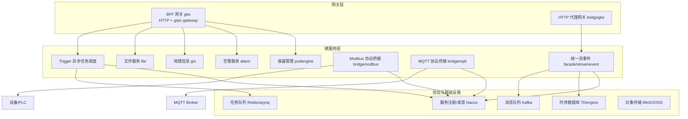
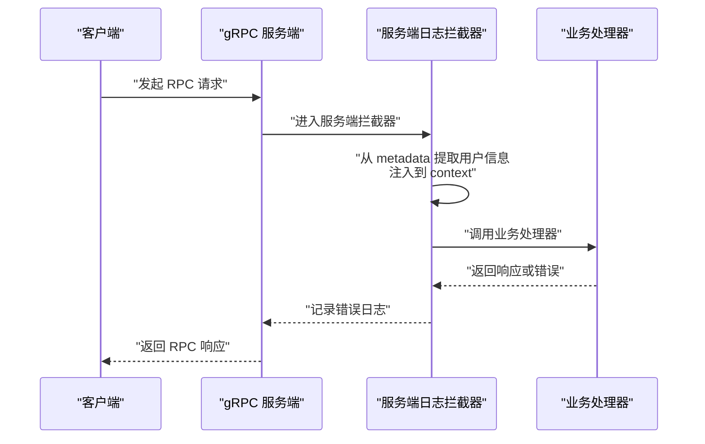
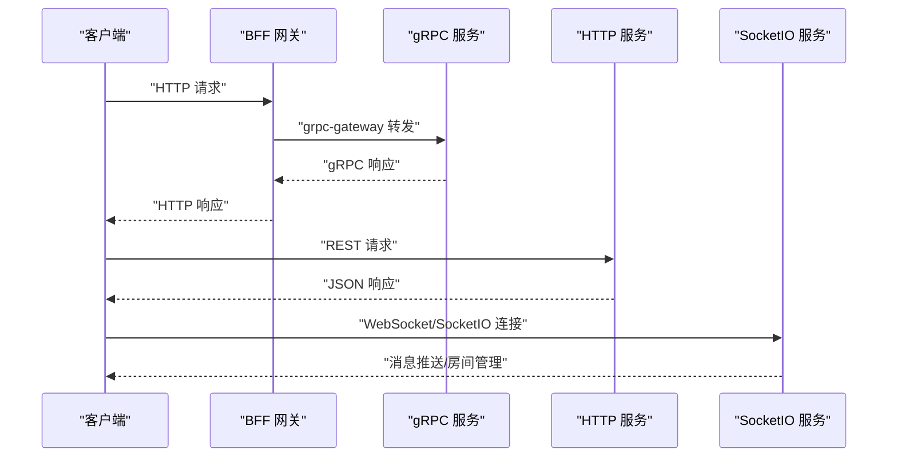
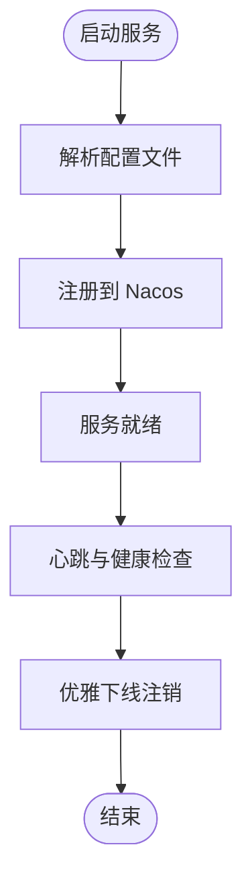
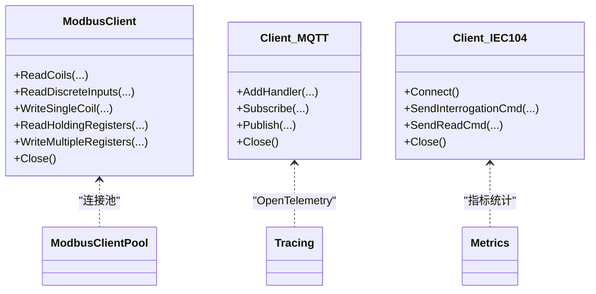
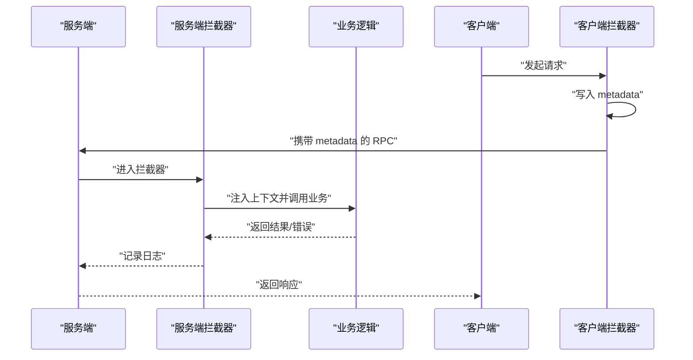
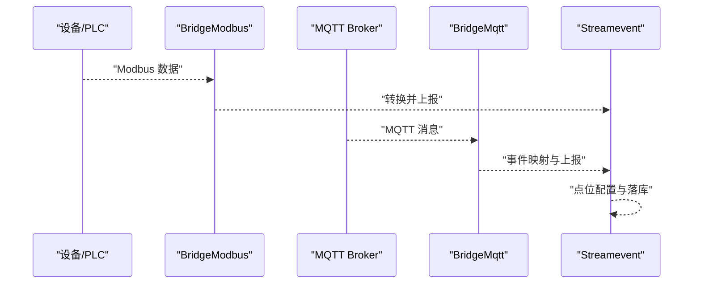
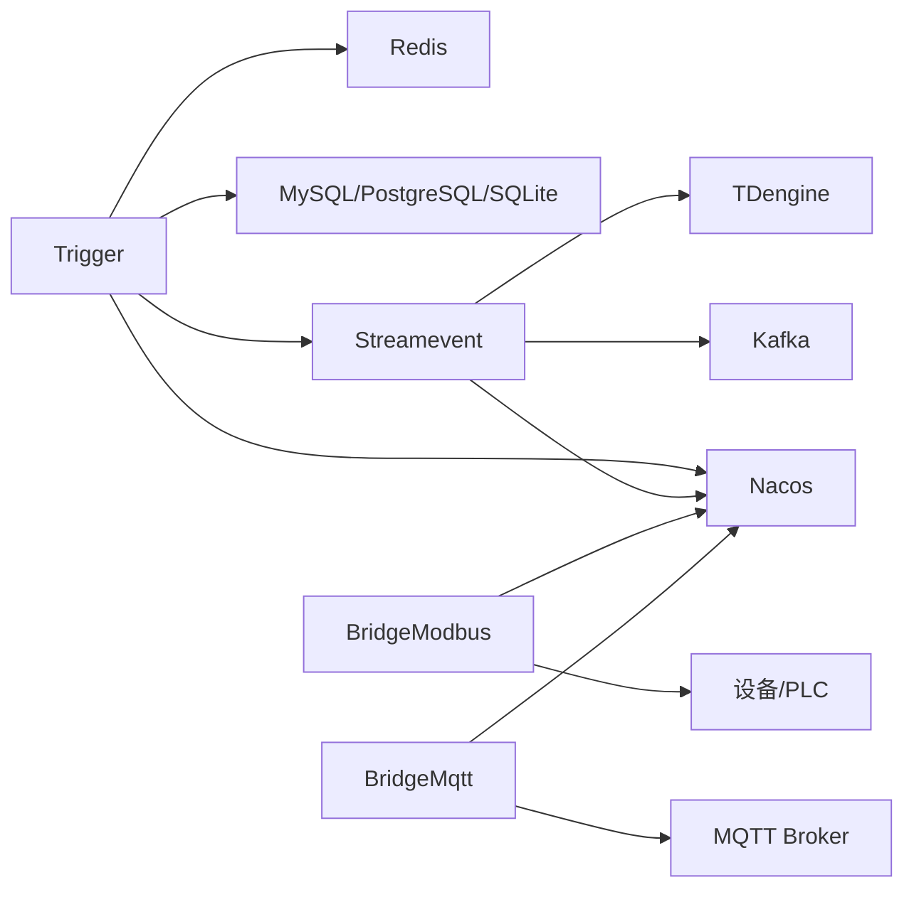

# 服务设计模式

<cite>
**本文引用的文件**
- [README.md](file://README.md)
- [loggerInterceptor.go](file://common/Interceptor/rpcserver/loggerInterceptor.go)
- [metadataInterceptor.go](file://common/Interceptor/rpcclient/metadataInterceptor.go)
- [client.go](file://common/modbusx/client.go)
- [mqttx.go](file://common/mqttx/mqttx.go)
- [core.go](file://common/iec104/client/core.go)
- [register.go](file://common/nacosx/register.go)
- [ctxData.go](file://common/ctxdata/ctxData.go)
- [triggerrpcserver.go](file://app/trigger/internal/server/triggerrpcserver.go)
- [bridgemodbusserver.go](file://app/bridgemodbus/internal/server/bridgemodbusserver.go)
- [bridgemqttserver.go](file://app/bridgemqtt/internal/server/bridgemqttserver.go)
- [routes.go](file://app/bridgegtw/internal/handler/routes.go)
- [trigger.yaml](file://app/trigger/etc/trigger.yaml)
- [bridgemodbus.yaml](file://app/bridgemodbus/etc/bridgemodbus.yaml)
- [bridgemqtt.yaml](file://app/bridgemqtt/etc/bridgemqtt.yaml)
- [bridgegtw.yaml](file://app/bridgegtw/etc/bridgegtw.yaml)
- [servicecontext.go](file://app/trigger/internal/svc/servicecontext.go)
- [types.go](file://common/iec104/types/types.go)
</cite>

## 目录
1. [引言](#引言)
2. [项目结构](#项目结构)
3. [核心组件](#核心组件)
4. [架构总览](#架构总览)
5. [详细组件分析](#详细组件分析)
6. [依赖分析](#依赖分析)
7. [性能考虑](#性能考虑)
8. [故障排查指南](#故障排查指南)
9. [结论](#结论)
10. [附录](#附录)

## 引言
本文件围绕 zero-service 的微服务架构，系统梳理服务端模式、客户端模式、适配器模式与装饰器模式在实际项目中的落地实践。重点涵盖：
- 服务端模式：RPC 服务器、HTTP 服务器、WebSocket/SocketIO 服务器的实现差异与适用场景
- 客户端模式：服务发现客户端、配置客户端、监控客户端的设计与集成
- 适配器模式：协议转换适配（Modbus、MQTT、IEC104），以及消息桥接与事件映射
- 装饰器模式：拦截器与中间件在日志、鉴权、追踪、指标统计中的应用

## 项目结构
zero-service 基于 go-zero 构建，采用“多协议接入 + 微服务网格”的架构，覆盖 IEC104 数采、Modbus/MQTT 协议桥接、异步任务调度、实时通信、容器管理、地理信息、BFF 网关等能力。

图表来源
- [README.md:15-51](file://README.md#L15-L51)
- [bridgegtw.yaml:12-40](file://app/bridgegtw/etc/bridgegtw.yaml#L12-L40)
- [trigger.yaml:11-37](file://app/trigger/etc/trigger.yaml#L11-L37)
- [bridgemodbus.yaml:11-26](file://app/bridgemodbus/etc/bridgemodbus.yaml#L11-L26)
- [bridgemqtt.yaml:11-48](file://app/bridgemqtt/etc/bridgemqtt.yaml#L11-L48)

章节来源
- [README.md:59-108](file://README.md#L59-L108)

## 核心组件
- gRPC 服务端与拦截器：通过 goctl 生成的服务桩与拦截器，实现日志、鉴权、追踪等横切关注点
- 协议适配器：Modbus/TCP、MQTT、IEC104 客户端封装，提供连接池、自动重连、日志与指标
- 服务发现与配置：Nacos 注册/发现与配置中心集成
- 网关与桥接：BFF 网关统一入口；HTTP 代理网关路由至 gRPC；MQTT/SocketIO 桥接
- 异步任务与计划任务：基于 asynq 的任务队列与自研计划任务引擎

章节来源
- [loggerInterceptor.go:12-44](file://common/Interceptor/rpcserver/loggerInterceptor.go#L12-L44)
- [metadataInterceptor.go:11-32](file://common/Interceptor/rpcclient/metadataInterceptor.go#L11-L32)
- [client.go:106-143](file://common/modbusx/client.go#L106-L143)
- [mqttx.go:98-178](file://common/mqttx/mqttx.go#L98-L178)
- [core.go:87-117](file://common/iec104/client/core.go#L87-L117)
- [register.go:21-76](file://common/nacosx/register.go#L21-L76)
- [servicecontext.go:50-90](file://app/trigger/internal/svc/servicecontext.go#L50-L90)

## 架构总览
以下序列图展示 gRPC 服务端与客户端拦截器如何协作，完成用户上下文透传与日志记录：

图表来源
- [loggerInterceptor.go:12-44](file://common/Interceptor/rpcserver/loggerInterceptor.go#L12-L44)
- [metadataInterceptor.go:11-32](file://common/Interceptor/rpcclient/metadataInterceptor.go#L11-L32)
- [ctxData.go:9-24](file://common/ctxdata/ctxData.go#L9-L24)

## 详细组件分析

### 服务端模式：RPC、HTTP、WebSocket/SocketIO
- RPC 服务器（gRPC）
  - 使用 goctl 生成服务桩，集中暴露业务方法
  - 通过拦截器实现日志、鉴权、追踪等横切逻辑
  - 示例：Trigger RPC 服务端方法众多，覆盖任务调度与计划任务管理
- HTTP 服务器（REST）
  - 通过 go-zero rest 路由注册，支持统一前缀与静态路由
  - 示例：bridgegtw 提供 /bridge/v1/ping 路由
- WebSocket/SocketIO 服务器
  - 通过 socketiox 封装，提供房间管理、广播、MQTT 桥接、Token 鉴权等能力
  - 与 socketpush 结合，形成“网关 + 推送”双服务架构

图表来源
- [triggerrpcserver.go:26-271](file://app/trigger/internal/server/triggerrpcserver.go#L26-L271)
- [routes.go:15-27](file://app/bridgegtw/internal/handler/routes.go#L15-L27)

章节来源
- [triggerrpcserver.go:15-24](file://app/trigger/internal/server/triggerrpcserver.go#L15-L24)
- [routes.go:15-27](file://app/bridgegtw/internal/handler/routes.go#L15-L27)

### 客户端模式：服务发现、配置、监控
- 服务发现客户端（Nacos）
  - 注册服务实例、健康检查、优雅下线
  - 支持集群名、分组、元数据配置
- 配置客户端
  - 通过 YAML 配置服务监听、日志、Redis、数据库、Nacos、协议参数等
- 监控客户端
  - OpenTelemetry 集成，MQTT 客户端内置 span 与 metrics

图表来源
- [register.go:21-76](file://common/nacosx/register.go#L21-L76)
- [trigger.yaml:11-37](file://app/trigger/etc/trigger.yaml#L11-L37)
- [bridgemodbus.yaml:11-26](file://app/bridgemodbus/etc/bridgemodbus.yaml#L11-L26)
- [bridgemqtt.yaml:11-48](file://app/bridgemqtt/etc/bridgemqtt.yaml#L11-L48)

章节来源
- [register.go:21-76](file://common/nacosx/register.go#L21-L76)
- [trigger.yaml:11-37](file://app/trigger/etc/trigger.yaml#L11-L37)
- [bridgemodbus.yaml:11-26](file://app/bridgemodbus/etc/bridgemodbus.yaml#L11-L26)
- [bridgemqtt.yaml:11-48](file://app/bridgemqtt/etc/bridgemqtt.yaml#L11-L48)

### 适配器模式：协议转换与桥接
- Modbus 适配器
  - 封装 modbus.Client，提供连接池、TLS、超时、日志与指标
  - 支持线圈/寄存器读写、设备识别、屏蔽写、FIFO 队列等
- MQTT 适配器
  - 提供订阅/发布、事件映射、默认处理器、自动重连、跟踪与指标
- IEC104 适配器
  - 封装 go-iecp5 客户端，支持命令发送、连接事件、日志与指标

图表来源
- [client.go:20-97](file://common/modbusx/client.go#L20-L97)
- [client.go:145-191](file://common/modbusx/client.go#L145-L191)
- [mqttx.go:76-87](file://common/mqttx/mqttx.go#L76-L87)
- [core.go:48-55](file://common/iec104/client/core.go#L48-L55)

章节来源
- [client.go:106-143](file://common/modbusx/client.go#L106-L143)
- [mqttx.go:98-178](file://common/mqttx/mqttx.go#L98-L178)
- [core.go:87-117](file://common/iec104/client/core.go#L87-L117)

### 装饰器模式：拦截器与中间件
- gRPC 服务端拦截器
  - 从 metadata 中提取用户信息注入 context，统一错误日志
- gRPC 客户端拦截器
  - 将用户信息从 context 写入 outgoing metadata，实现链路透传
- HTTP 中间件
  - 通过 REST 路由注册与前缀，结合网关实现统一鉴权、CORS、限流等

图表来源
- [loggerInterceptor.go:12-44](file://common/Interceptor/rpcserver/loggerInterceptor.go#L12-L44)
- [metadataInterceptor.go:11-32](file://common/Interceptor/rpcclient/metadataInterceptor.go#L11-L32)
- [ctxData.go:9-24](file://common/ctxdata/ctxData.go#L9-L24)

章节来源
- [loggerInterceptor.go:12-44](file://common/Interceptor/rpcserver/loggerInterceptor.go#L12-L44)
- [metadataInterceptor.go:11-32](file://common/Interceptor/rpcclient/metadataInterceptor.go#L11-L32)
- [ctxData.go:42-76](file://common/ctxdata/ctxData.go#L42-L76)

### 协议桥接与事件映射
- Modbus 桥接服务
  - 提供读写方法与设备配置管理，支持十进制数值转换为寄存器格式
- MQTT 桥接服务
  - 提供发布、带 traceId 的发布，支持订阅与事件映射
- IEC104 数据桥接
  - 通过 streamevent 统一接收多协议消息，进行点位映射与落库

图表来源
- [bridgemodbusserver.go:26-151](file://app/bridgemodbus/internal/server/bridgemodbusserver.go#L26-L151)
- [bridgemqttserver.go:26-42](file://app/bridgemqtt/internal/server/bridgemqttserver.go#L26-L42)
- [types.go:11-54](file://common/iec104/types/types.go#L11-L54)

章节来源
- [bridgemodbusserver.go:26-151](file://app/bridgemodbus/internal/server/bridgemodbusserver.go#L26-L151)
- [bridgemqttserver.go:26-42](file://app/bridgemqtt/internal/server/bridgemqttserver.go#L26-L42)
- [types.go:11-54](file://common/iec104/types/types.go#L11-L54)

## 依赖分析
- 服务间依赖
  - Trigger 依赖 Redis/asynq、数据库、Nacos、streamevent gRPC 客户端
  - Streamevent 依赖 Kafka、TDengine、Nacos
  - BridgeModbus/BridgeMqtt 依赖各自协议客户端与 Nacos
- 外部依赖
  - go-zero、grpc、paho.mqtt、go-iecp5、Nacos SDK、OpenTelemetry

图表来源
- [servicecontext.go:65-89](file://app/trigger/internal/svc/servicecontext.go#L65-L89)
- [trigger.yaml:19-37](file://app/trigger/etc/trigger.yaml#L19-L37)
- [bridgemodbus.yaml:20-26](file://app/bridgemodbus/etc/bridgemodbus.yaml#L20-L26)
- [bridgemqtt.yaml:19-48](file://app/bridgemqtt/etc/bridgemqtt.yaml#L19-L48)

章节来源
- [servicecontext.go:65-89](file://app/trigger/internal/svc/servicecontext.go#L65-L89)
- [trigger.yaml:19-37](file://app/trigger/etc/trigger.yaml#L19-L37)
- [bridgemodbus.yaml:20-26](file://app/bridgemodbus/etc/bridgemodbus.yaml#L20-L26)
- [bridgemqtt.yaml:19-48](file://app/bridgemqtt/etc/bridgemqtt.yaml#L19-L48)

## 性能考虑
- 连接池与复用
  - Modbus 客户端连接池减少频繁建连开销，设置最大空闲时间自动回收
- 超时与重连
  - Modbus/TCP、MQTT、IEC104 均提供超时、自动重连与恢复订阅机制
- 指标与追踪
  - MQTT 客户端内置 metrics 与 OpenTelemetry span，便于性能观测
- gRPC 最大消息尺寸
  - Trigger 服务端通过 DialOption 设置 MaxCallSendMsgSize，满足大数据传输需求

章节来源
- [client.go:153-178](file://common/modbusx/client.go#L153-L178)
- [mqttx.go:310-333](file://common/mqttx/mqttx.go#L310-L333)
- [servicecontext.go:82-87](file://app/trigger/internal/svc/servicecontext.go#L82-L87)

## 故障排查指南
- gRPC 错误日志
  - 服务端拦截器在错误发生时记录错误日志，便于定位问题
- MQTT 连接丢失与恢复
  - OnConnectionLost 清空订阅集合，OnConnect 恢复订阅；订阅超时与错误均记录日志
- Modbus 日志与错误
  - 自定义 ModbusLogger 将错误与异常信息输出到统一日志系统
- 配置检查
  - 确认各服务 YAML 配置中的监听地址、端口、Nacos、Redis、数据库、协议参数正确

章节来源
- [loggerInterceptor.go:40-42](file://common/Interceptor/rpcserver/loggerInterceptor.go#L40-L42)
- [mqttx.go:161-166](file://common/mqttx/mqttx.go#L161-L166)
- [mqttx.go:235-255](file://common/mqttx/mqttx.go#L235-L255)
- [client.go:199-217](file://common/modbusx/client.go#L199-L217)
- [trigger.yaml:1-37](file://app/trigger/etc/trigger.yaml#L1-L37)
- [bridgemodbus.yaml:1-26](file://app/bridgemodbus/etc/bridgemodbus.yaml#L1-L26)
- [bridgemqtt.yaml:1-48](file://app/bridgemqtt/etc/bridgemqtt.yaml#L1-L48)
- [bridgegtw.yaml:1-40](file://app/bridgegtw/etc/bridgegtw.yaml#L1-L40)

## 结论
zero-service 在微服务实践中系统性地应用了多种设计模式：
- 服务端模式通过 gRPC/HTTP/SocketIO 提供统一接入与差异化能力
- 客户端模式通过 Nacos、配置中心与监控组件实现可观测与可治理
- 适配器模式有效解耦协议差异，提升扩展性与复用性
- 装饰器模式以拦截器与中间件实现横切关注点，保障日志、鉴权、追踪与指标的一致性

这些模式共同支撑了项目在工业协议接入、实时通信与任务调度等复杂场景下的稳定性与可维护性。

## 附录
- 配置文件示例路径
  - Trigger: [trigger.yaml:1-37](file://app/trigger/etc/trigger.yaml#L1-L37)
  - BridgeModbus: [bridgemodbus.yaml:1-26](file://app/bridgemodbus/etc/bridgemodbus.yaml#L1-L26)
  - BridgeMqtt: [bridgemqtt.yaml:1-48](file://app/bridgemqtt/etc/bridgemqtt.yaml#L1-L48)
  - BridgeGtw: [bridgegtw.yaml:1-40](file://app/bridgegtw/etc/bridgegtw.yaml#L1-L40)
- 关键服务上下文
  - Trigger 服务上下文初始化与依赖注入：[servicecontext.go:50-90](file://app/trigger/internal/svc/servicecontext.go#L50-L90)