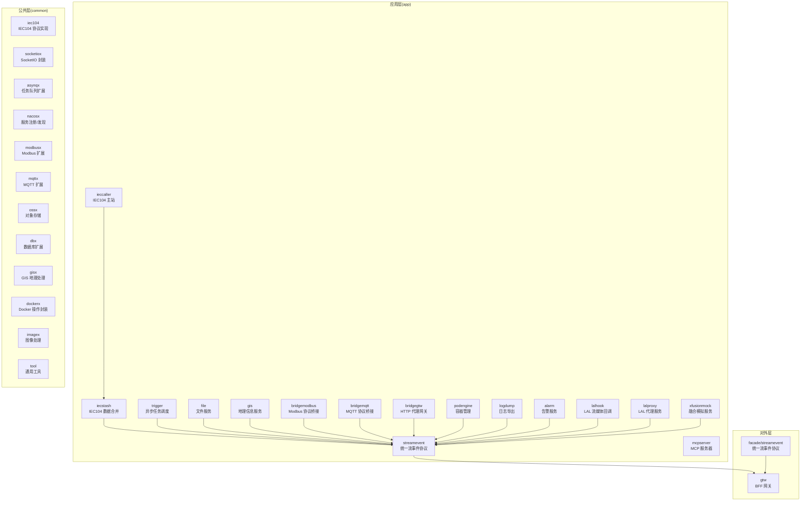
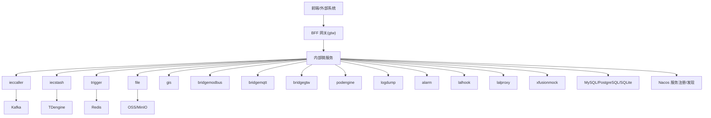
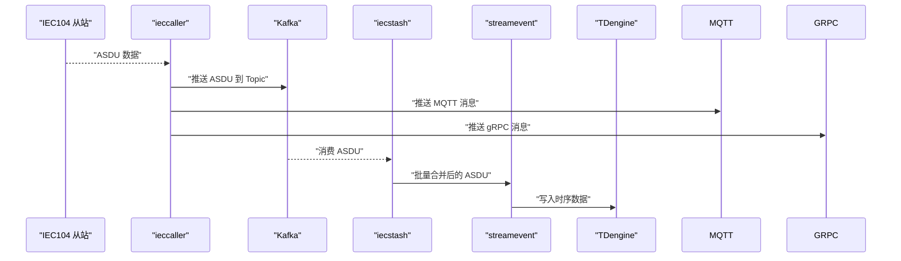
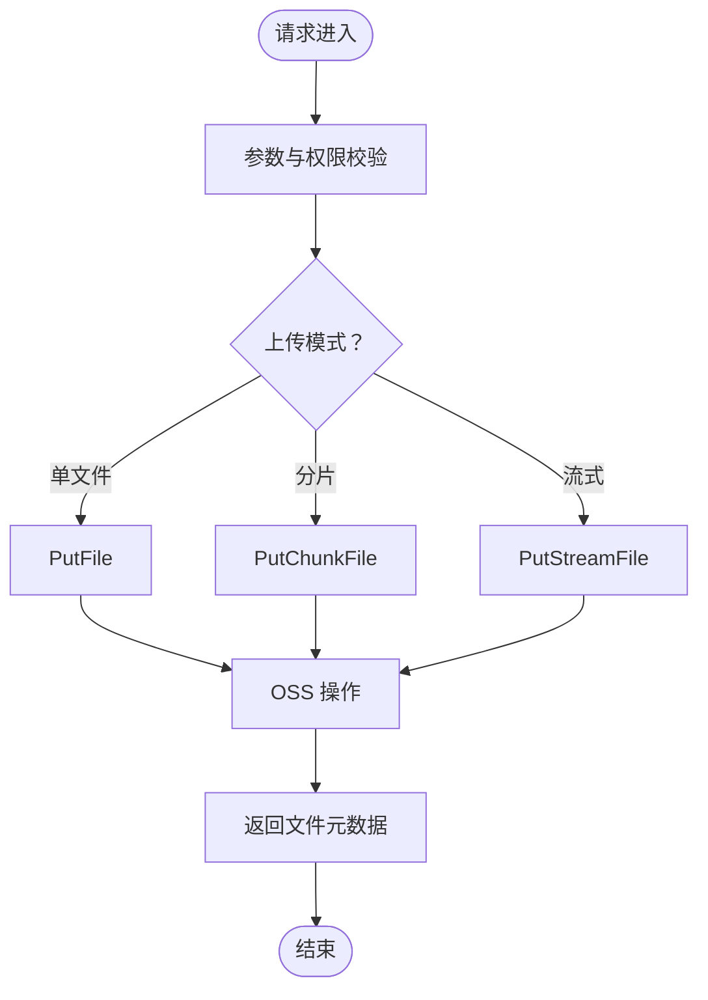
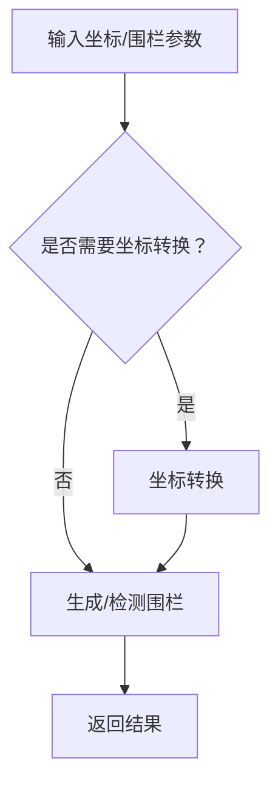
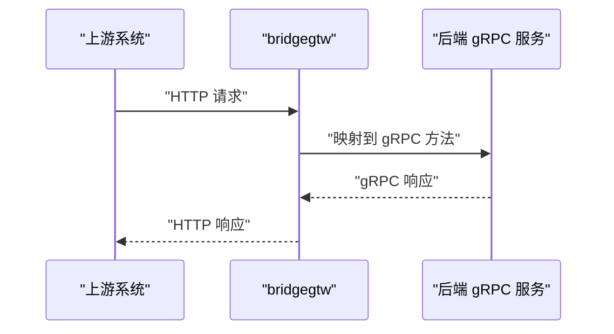
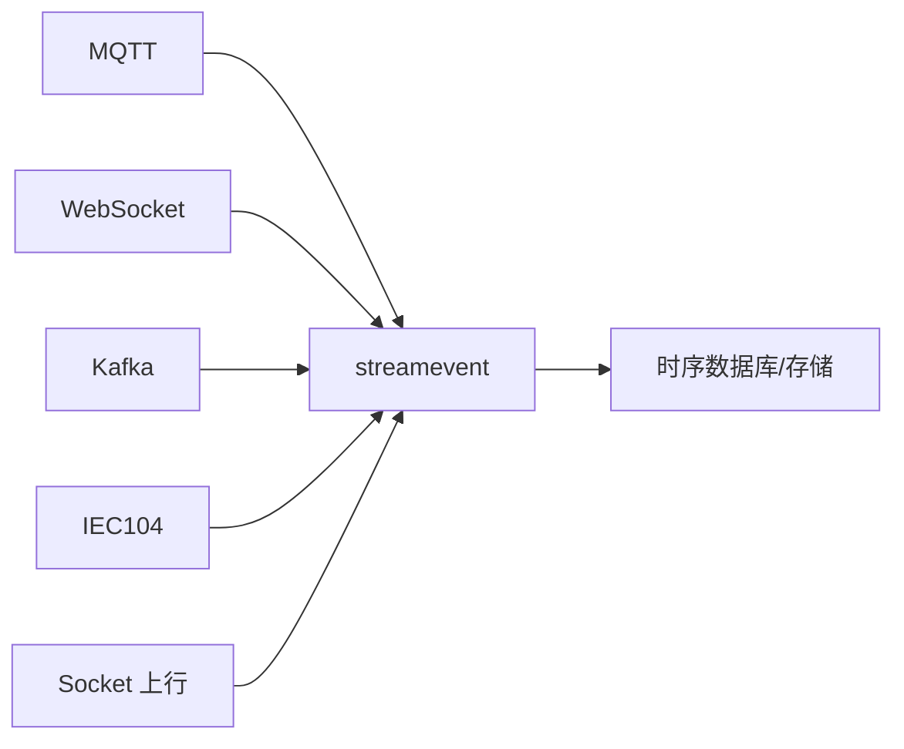
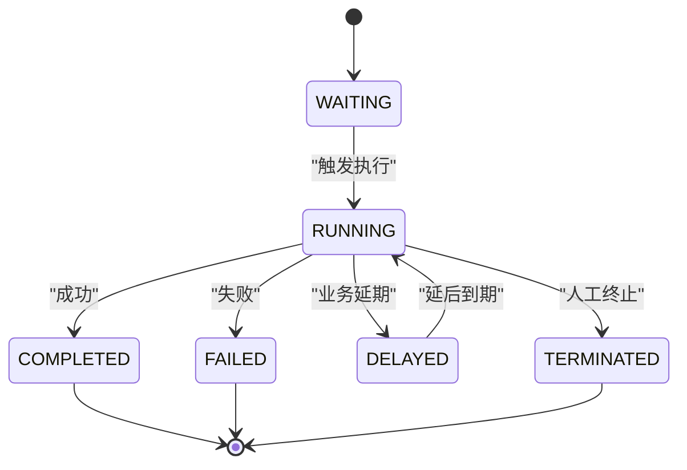
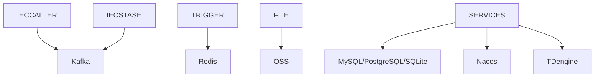

# 服务边界与拆分原则

<cite>
**本文引用的文件**
- [README.md](file://README.md)
- [go.mod](file://go.mod)
- [app/ieccaller/etc/ieccaller.yaml](file://app/ieccaller/etc/ieccaller.yaml)
- [app/trigger/etc/trigger.yaml](file://app/trigger/etc/trigger.yaml)
- [app/file/etc/file.yaml](file://app/file/etc/file.yaml)
- [app/gis/etc/gis.yaml](file://app/gis/etc/gis.yaml)
- [app/bridgegtw/etc/bridgegtw.yaml](file://app/bridgegtw/etc/bridgegtw.yaml)
- [common/iec104/types/types.go](file://common/iec104/types/types.go)
- [app/ieccaller/ieccaller.proto](file://app/ieccaller/ieccaller.proto)
- [app/trigger/trigger.proto](file://app/trigger/trigger.proto)
- [app/file/file.proto](file://app/file/file.proto)
- [app/gis/gis.proto](file://app/gis/gis.proto)
- [facade/streamevent/streamevent.proto](file://facade/streamevent/streamevent.proto)
- [.trae/skills/zero-skills/skill-patterns/plan-architecture.md](file://.trae/skills/zero-skills/skill-patterns/plan-architecture.md)
- [.trae/skills/zero-skills/references/rest-api-patterns.md](file://.trae/skills/zero-skills/references/rest-api-patterns.md)
- [.trae/skills/zero-skills/best-practices/overview.md](file://.trae/skills/zero-skills/best-practices/overview.md)
</cite>

## 目录
1. [引言](#引言)
2. [项目结构](#项目结构)
3. [核心组件](#核心组件)
4. [架构总览](#架构总览)
5. [详细组件分析](#详细组件分析)
6. [依赖分析](#依赖分析)
7. [性能考虑](#性能考虑)
8. [故障排查指南](#故障排查指南)
9. [结论](#结论)
10. [附录](#附录)

## 引言
本文件围绕 zero-service 的微服务拆分与服务边界设计，系统阐述以下内容：
- 服务边界划分原则：单一职责、业务能力边界、数据一致性边界
- 基于业务领域的服务划分：IEC104 数采服务、文件服务、协议处理服务等
- 服务自治性设计：数据自治、技术栈自治、团队自治
- 服务粒度控制：避免过度拆分或合并带来的复杂性
- 边界演进策略与重构指导

zero-service 采用 go-zero 微服务体系，覆盖 IEC104/Modbus/MQTT 等工业协议接入、异步任务调度、实时通信、容器管理、地理信息、BFF 网关等能力，形成“数采平台 + 任务调度 + 实时通信 + 协议桥接 + 文件与地理 + 对外接口层”的整体架构。

## 项目结构
项目采用按功能域划分的多服务组织方式，核心服务集中在 app/ 目录，公共能力集中在 common/，对外统一通过 facade/ 与 gtw/ 提供协议与网关能力。

图表来源
- [README.md:15-108](file://README.md#L15-L108)

章节来源
- [README.md:59-108](file://README.md#L59-L108)

## 核心组件
- IEC104 数采平台：ieccaller（主站）、iecstash（合并）、streamevent（落库与事件聚合）
- 异步任务调度：trigger（基于 asynq 与自研计划引擎）
- 实时通信：socketgtw + socketpush（SocketIO 网关与推送）
- 协议桥接：bridgemodbus、bridgemqtt、bridgegtw
- 文件与地理：file、gis
- 对外接口层：facade/streamevent（统一跨语言流事件协议）
- BFF 网关：gtw（HTTP/gRPC 聚合）

章节来源
- [README.md:110-206](file://README.md#L110-L206)

## 架构总览
下图展示 zero-service 的总体架构与数据流，强调服务边界与自治性：

图表来源
- [README.md:15-51](file://README.md#L15-L51)
- [README.md:112-131](file://README.md#L112-L131)
- [README.md:133-154](file://README.md#L133-L154)
- [README.md:174-188](file://README.md#L174-L188)

## 详细组件分析

### IEC104 数采平台边界与职责
- ieccaller：负责 IEC104 主站与从站通信，支持多从站并发、Kafka/MQTT/gRPC 三协议推送，并维护 SQLite 动态配置。其配置文件集中体现职责边界与外部依赖。
- iecstash：负责 Kafka 消费、ASDU 压缩合并、批量处理与下游 RPC 转发。
- streamevent：统一接收多协议消息，进行点位配置管理与 TDengine 时序存储。

图表来源
- [README.md:122-127](file://README.md#L122-L127)
- [app/ieccaller/etc/ieccaller.yaml:35-79](file://app/ieccaller/etc/ieccaller.yaml#L35-L79)
- [app/trigger/etc/trigger.yaml:19-37](file://app/trigger/etc/trigger.yaml#L19-L37)
- [app/file/etc/file.yaml:17-23](file://app/file/etc/file.yaml#L17-L23)
- [app/gis/etc/gis.yaml:12-19](file://app/gis/etc/gis.yaml#L12-L19)

章节来源
- [README.md:112-131](file://README.md#L112-L131)
- [app/ieccaller/etc/ieccaller.yaml:1-79](file://app/ieccaller/etc/ieccaller.yaml#L1-L79)
- [common/iec104/types/types.go:1-323](file://common/iec104/types/types.go#L1-L323)
- [app/ieccaller/ieccaller.proto:1-151](file://app/ieccaller/ieccaller.proto#L1-L151)

### 文件服务边界与自治
- 职责：提供分片流上传、OSS 集成（MinIO/阿里OSS/腾讯COS）、视频流捕获等能力。
- 自治性：独立的 gRPC 接口、独立配置、独立 Docker 镜像与部署脚本；通过租户模式支持多租户隔离。

图表来源
- [app/file/file.proto:176-287](file://app/file/file.proto#L176-L287)
- [app/file/etc/file.yaml:17-23](file://app/file/etc/file.yaml#L17-L23)

章节来源
- [README.md:178-179](file://README.md#L178-L179)
- [app/file/file.proto:1-287](file://app/file/file.proto#L1-L287)
- [app/file/etc/file.yaml:1-23](file://app/file/etc/file.yaml#L1-L23)

### 地理信息服务边界与自治
- 职责：H3/GeoHash 编解码、电子围栏生成与检测、坐标系转换（WGS84/GCJ02/BD09）。
- 自治性：独立的 gRPC 接口与配置；对坐标转换与围栏计算进行封装，便于上层业务复用。

图表来源
- [app/gis/gis.proto:18-219](file://app/gis/gis.proto#L18-L219)
- [app/gis/etc/gis.yaml:12-19](file://app/gis/etc/gis.yaml#L12-L19)

章节来源
- [README.md:179-180](file://README.md#L179-L180)
- [app/gis/gis.proto:1-219](file://app/gis/gis.proto#L1-L219)
- [app/gis/etc/gis.yaml:1-19](file://app/gis/etc/gis.yaml#L1-L19)

### 协议桥接服务边界与自治
- bridgemodbus：Modbus TCP/RTU 读写、设备配置管理、gRPC 集成。
- bridgemqtt：MQTT 发布/订阅、带追踪的推送、gRPC 集成。
- bridgegtw：HTTP 代理转发网关，支持 gRPC 后端映射与路由。

图表来源
- [app/bridgegtw/etc/bridgegtw.yaml:25-40](file://app/bridgegtw/etc/bridgegtw.yaml#L25-L40)
- [README.md:182-185](file://README.md#L182-L185)

章节来源
- [README.md:182-185](file://README.md#L182-L185)
- [app/bridgegtw/etc/bridgegtw.yaml:1-40](file://app/bridgegtw/etc/bridgegtw.yaml#L1-L40)

### 对外接口层与统一协议边界
- facade/streamevent：统一跨语言流数据事件协议，接收 MQTT/WebSocket/Kafka/IEC104/Socket 上行消息，统一推送与事件处理。
- 优势：屏蔽底层协议差异，简化第三方系统对接成本。

图表来源
- [facade/streamevent/streamevent.proto:10-25](file://facade/streamevent/streamevent.proto#L10-L25)
- [README.md:197-206](file://README.md#L197-L206)

章节来源
- [README.md:197-206](file://README.md#L197-L206)
- [facade/streamevent/streamevent.proto:1-581](file://facade/streamevent/streamevent.proto#L1-L581)

### 异步任务调度边界与自治
- trigger：基于 asynq 的分布式任务队列与自研计划任务引擎，支持 HTTP/gRPC 回调、状态机与生命周期管理。
- 边界：任务创建、调度、重试、归档、统计与计划任务的生命周期管理均在 trigger 内部完成。

图表来源
- [app/trigger/trigger.proto:108-122](file://app/trigger/trigger.proto#L108-L122)
- [README.md:133-154](file://README.md#L133-L154)

章节来源
- [README.md:133-154](file://README.md#L133-L154)
- [app/trigger/trigger.proto:1-1181](file://app/trigger/trigger.proto#L1-L1181)
- [app/trigger/etc/trigger.yaml:1-37](file://app/trigger/etc/trigger.yaml#L1-L37)

## 依赖分析
- 外部依赖：Kafka、Redis、TDengine、MySQL/PostgreSQL/SQLite、MinIO/阿里OSS/腾讯COS、Nacos、OpenTelemetry/Prometheus 等。
- 服务间耦合：通过 gRPC 与消息队列解耦；facade/streamevent 作为统一协议层降低耦合。
- 依赖可视化：

图表来源
- [go.mod:5-62](file://go.mod#L5-L62)
- [README.md:207-225](file://README.md#L207-L225)

章节来源
- [go.mod:1-245](file://go.mod#L1-L245)
- [README.md:207-225](file://README.md#L207-L225)

## 性能考虑
- 连接池与缓存：在服务上下文集中初始化数据库连接与 Redis 客户端，避免在处理器或逻辑层重复创建。
- 缓存策略：对热点数据进行缓存，复杂查询手动缓存，设置合理过期时间。
- 传输与序列化：统一使用 gRPC 与 Protocol Buffers，减少序列化开销；对大数据量场景（如 IEC104 分片推送）采用批量与流式处理。

章节来源
- [.trae/skills/zero-skills/best-practices/overview.md:426-488](file://.trae/skills/zero-skills/best-practices/overview.md#L426-L488)

## 故障排查指南
- 配置检查：核对各服务配置文件中的监听地址、超时、日志级别、外部依赖（Kafka/Redis/OSS/DB/Nacos）等。
- 日志定位：关注服务日志路径与级别，结合错误码映射（google.rpc.Code）快速定位问题。
- 依赖健康：确认 Kafka/Redis/TDengine/数据库/对象存储连通性与可用性。
- 网关路由：bridgegtw 的映射配置需与后端服务方法一一对应，避免 404/405。

章节来源
- [README.md:296-299](file://README.md#L296-L299)
- [app/bridgegtw/etc/bridgegtw.yaml:25-40](file://app/bridgegtw/etc/bridgegtw.yaml#L25-L40)

## 结论
zero-service 的服务边界设计遵循单一职责与业务能力导向，通过 facade/streamevent 统一协议层与 gtw 网关实现外部访问收敛，内部以 ieccaller/iecstash/streamevent 为核心形成数采闭环，辅以 trigger、file、gis、协议桥接与容器管理等服务，满足工业级物联网场景的多协议接入、高性能数据处理与实时通信需求。建议在演进过程中持续以“数据一致性边界”和“团队自治”为准则，避免过度拆分与合并，保持边界稳定与演进可控。

## 附录
- 服务边界演进建议
  - 以业务价值为先：优先拆分跨团队、跨领域的强耦合模块
  - 数据一致性边界：围绕核心数据模型与事务边界划分服务
  - 技术栈自治：每服务独立的配置、依赖与部署单元
  - 团队自治：服务 Owner 对服务全生命周期负责
- 重构指导
  - 采用渐进式迁移：先引入 facade/streamevent 统一协议，再逐步拆分或合并服务
  - 保持 API 稳定：通过版本化与兼容策略降低变更风险
  - 强化监控与可观测性：完善 OpenTelemetry/Prometheus 指标与链路追踪

章节来源
- [.trae/skills/zero-skills/skill-patterns/plan-architecture.md:1-138](file://.trae/skills/zero-skills/skill-patterns/plan-architecture.md#L1-L138)
- [.trae/skills/zero-skills/references/rest-api-patterns.md:80-137](file://.trae/skills/zero-skills/references/rest-api-patterns.md#L80-L137)
- [.trae/skills/zero-skills/references/rest-api-patterns.md:502-523](file://.trae/skills/zero-skills/references/rest-api-patterns.md#L502-L523)