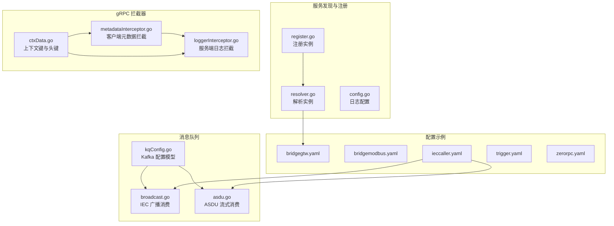
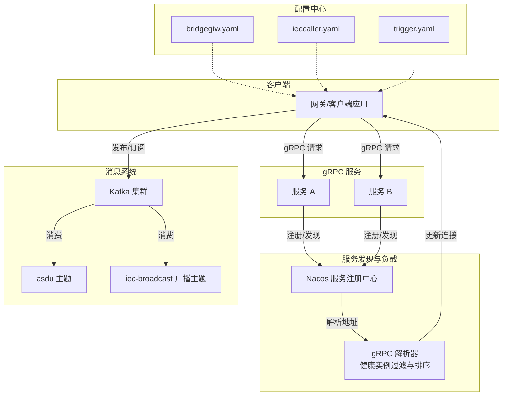
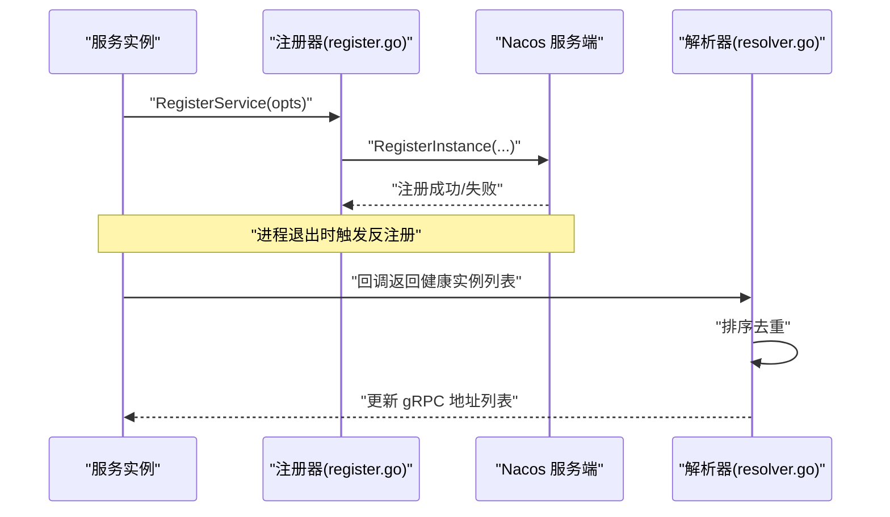
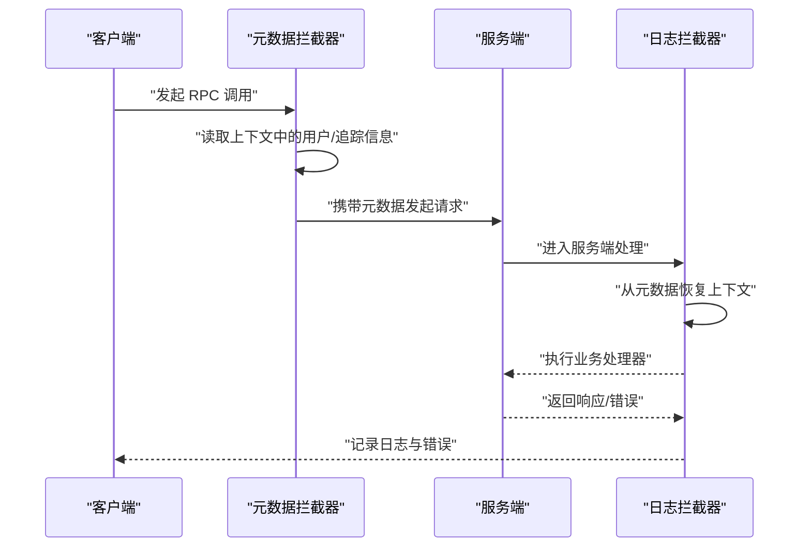
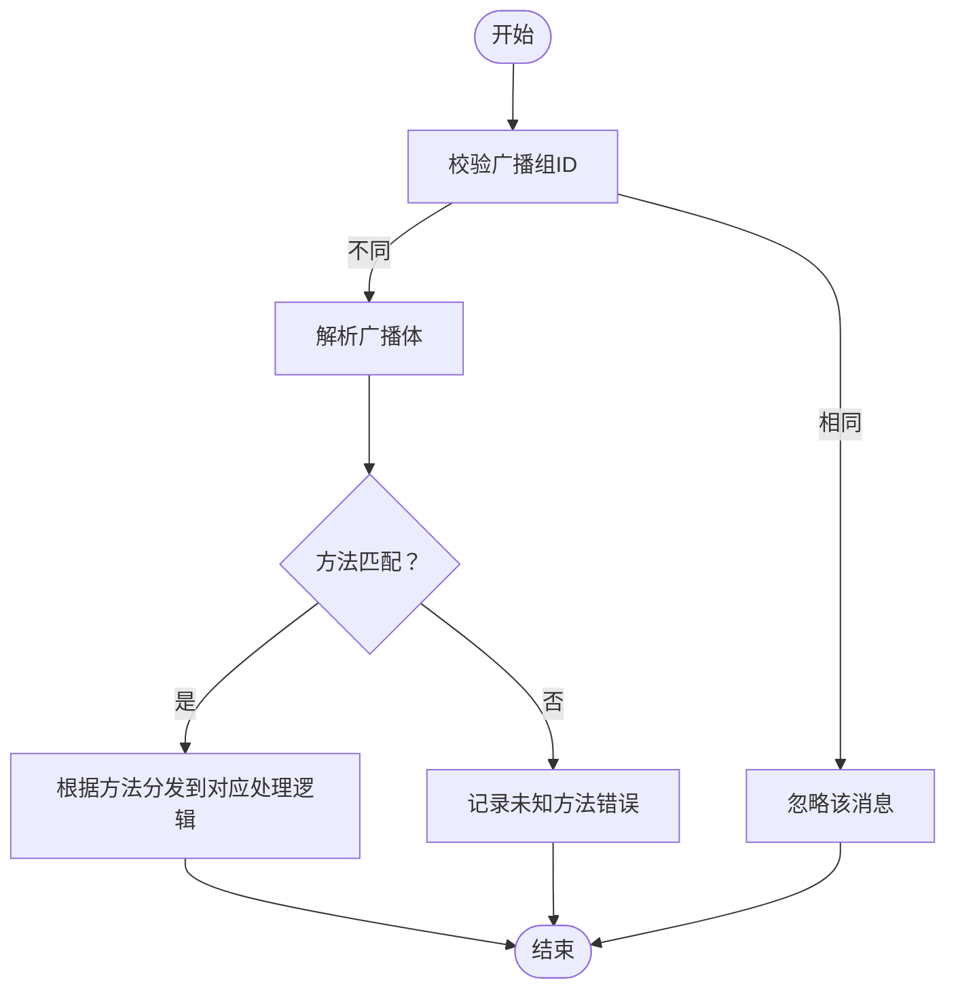
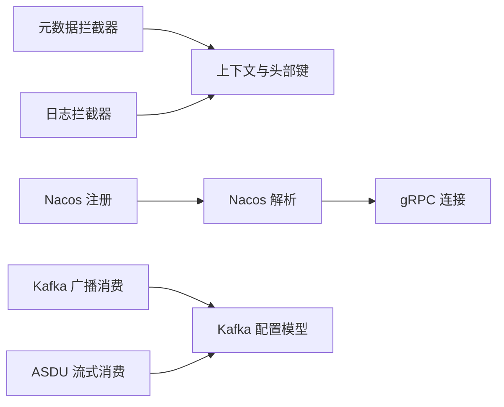

# 服务通信机制

<cite>
**本文引用的文件**
- [common/nacosx/register.go](file://common/nacosx/register.go)
- [common/nacosx/resolver.go](file://common/nacosx/resolver.go)
- [common/nacosx/config.go](file://common/nacosx/config.go)
- [common/Interceptor/rpcclient/metadataInterceptor.go](file://common/Interceptor/rpcclient/metadataInterceptor.go)
- [common/Interceptor/rpcserver/loggerInterceptor.go](file://common/Interceptor/rpcserver/loggerInterceptor.go)
- [common/ctxdata/ctxData.go](file://common/ctxdata/ctxData.go)
- [common/configx/kqConfig.go](file://common/configx/kqConfig.go)
- [app/ieccaller/kafka/broadcast.go](file://app/ieccaller/kafka/broadcast.go)
- [app/iecstash/kafka/asdu.go](file://app/iecstash/kafka/asdu.go)
- [common/tool/backoff.go](file://common/tool/backoff.go)
- [app/bridgegtw/etc/bridgegtw.yaml](file://app/bridgegtw/etc/bridgegtw.yaml)
- [app/bridgemodbus/etc/bridgemodbus.yaml](file://app/bridgemodbus/etc/bridgemodbus.yaml)
- [app/ieccaller/etc/ieccaller.yaml](file://app/ieccaller/etc/ieccaller.yaml)
- [app/trigger/etc/trigger.yaml](file://app/trigger/etc/trigger.yaml)
- [zerorpc/etc/zerorpc.yaml](file://zerorpc/etc/zerorpc.yaml)
</cite>

## 目录
1. [引言](#引言)
2. [项目结构](#项目结构)
3. [核心组件](#核心组件)
4. [架构总览](#架构总览)
5. [详细组件分析](#详细组件分析)
6. [依赖分析](#依赖分析)
7. [性能考虑](#性能考虑)
8. [故障排查指南](#故障排查指南)
9. [结论](#结论)
10. [附录](#附录)

## 引言
本文件面向 zero-service 的服务通信机制，系统性阐述微服务间通信模式（gRPC 同步调用、Kafka 异步消息、事件驱动）、拦截器系统（元数据传递、日志记录、错误处理）、服务发现与注册（Nacos 集成、健康检查、负载均衡）、消息队列使用模式（广播、延迟、死信等），以及通信安全、超时控制、重试机制等可靠性保障措施。内容兼顾技术深度与可读性，帮助读者快速理解并落地实施。

## 项目结构
围绕服务通信的关键目录与文件如下：
- 服务发现与注册：common/nacosx/*（注册、解析、日志配置）
- gRPC 拦截器：common/Interceptor/rpcclient/*、common/Interceptor/rpcserver/*
- 上下文与元数据：common/ctxdata/ctxData.go
- Kafka 消费示例：app/ieccaller/kafka/broadcast.go、app/iecstash/kafka/asdu.go
- 超时与退避策略：common/tool/backoff.go
- 配置样例：各应用 etc/*.yaml（bridgegtw、bridgemodbus、ieccaller、trigger、zerorpc）

图表来源
- [common/nacosx/register.go:1-99](file://common/nacosx/register.go#L1-L99)
- [common/nacosx/resolver.go:1-74](file://common/nacosx/resolver.go#L1-L74)
- [common/nacosx/config.go:1-38](file://common/nacosx/config.go#L1-L38)
- [common/Interceptor/rpcclient/metadataInterceptor.go:1-56](file://common/Interceptor/rpcclient/metadataInterceptor.go#L1-L56)
- [common/Interceptor/rpcserver/loggerInterceptor.go:1-45](file://common/Interceptor/rpcserver/loggerInterceptor.go#L1-L45)
- [common/ctxdata/ctxData.go:1-76](file://common/ctxdata/ctxData.go#L1-L76)
- [common/configx/kqConfig.go:1-7](file://common/configx/kqConfig.go#L1-L7)
- [app/ieccaller/kafka/broadcast.go:1-149](file://app/ieccaller/kafka/broadcast.go#L1-L149)
- [app/iecstash/kafka/asdu.go:1-25](file://app/iecstash/kafka/asdu.go#L1-L25)
- [app/bridgegtw/etc/bridgegtw.yaml:1-40](file://app/bridgegtw/etc/bridgegtw.yaml#L1-L40)
- [app/bridgemodbus/etc/bridgemodbus.yaml:1-26](file://app/bridgemodbus/etc/bridgemodbus.yaml#L1-L26)
- [app/ieccaller/etc/ieccaller.yaml:1-79](file://app/ieccaller/etc/ieccaller.yaml#L1-L79)
- [app/trigger/etc/trigger.yaml:1-37](file://app/trigger/etc/trigger.yaml#L1-L37)
- [zerorpc/etc/zerorpc.yaml:1-39](file://zerorpc/etc/zerorpc.yaml#L1-L39)

章节来源
- [common/nacosx/register.go:1-99](file://common/nacosx/register.go#L1-L99)
- [common/nacosx/resolver.go:1-74](file://common/nacosx/resolver.go#L1-L74)
- [common/nacosx/config.go:1-38](file://common/nacosx/config.go#L1-L38)
- [common/Interceptor/rpcclient/metadataInterceptor.go:1-56](file://common/Interceptor/rpcclient/metadataInterceptor.go#L1-L56)
- [common/Interceptor/rpcserver/loggerInterceptor.go:1-45](file://common/Interceptor/rpcserver/loggerInterceptor.go#L1-L45)
- [common/ctxdata/ctxData.go:1-76](file://common/ctxdata/ctxData.go#L1-L76)
- [common/configx/kqConfig.go:1-7](file://common/configx/kqConfig.go#L1-L7)
- [app/ieccaller/kafka/broadcast.go:1-149](file://app/ieccaller/kafka/broadcast.go#L1-L149)
- [app/iecstash/kafka/asdu.go:1-25](file://app/iecstash/kafka/asdu.go#L1-L25)
- [app/bridgegtw/etc/bridgegtw.yaml:1-40](file://app/bridgegtw/etc/bridgegtw.yaml#L1-L40)
- [app/bridgemodbus/etc/bridgemodbus.yaml:1-26](file://app/bridgemodbus/etc/bridgemodbus.yaml#L1-L26)
- [app/ieccaller/etc/ieccaller.yaml:1-79](file://app/ieccaller/etc/ieccaller.yaml#L1-L79)
- [app/trigger/etc/trigger.yaml:1-37](file://app/trigger/etc/trigger.yaml#L1-L37)
- [zerorpc/etc/zerorpc.yaml:1-39](file://zerorpc/etc/zerorpc.yaml#L1-L39)

## 核心组件
- 服务发现与注册（Nacos）
  - 注册服务实例、健康状态、元数据、集群与分组信息，并在进程退出时自动反注册。
  - 解析 gRPC 地址列表，过滤健康实例，排序后更新连接状态，实现负载均衡。
  - 提供 Nacos 日志配置能力，便于问题定位。
- gRPC 拦截器体系
  - 客户端拦截器：将用户标识、授权令牌、链路追踪 ID 等元数据注入到 gRPC 元数据中，统一透传。
  - 服务端拦截器：从请求元数据提取关键信息注入上下文，统一记录日志与错误。
- 消息队列（Kafka）与事件驱动
  - 广播队列：跨节点广播 IEC 指令，避免重复执行。
  - 流式消费：按批次或字节阈值推送，降低内存峰值。
  - 延迟与退避：结合任务调度与指数退避策略，控制失败重试节奏。
- 配置与可靠性
  - 通过 YAML 配置统一管理 gRPC 网关、上游服务、超时、非阻塞、Nacos 与 Kafka 参数。
  - 统一的超时控制与优雅停机窗口，确保平滑关闭。

章节来源
- [common/nacosx/register.go:21-76](file://common/nacosx/register.go#L21-L76)
- [common/nacosx/resolver.go:13-66](file://common/nacosx/resolver.go#L13-L66)
- [common/nacosx/config.go:15-37](file://common/nacosx/config.go#L15-L37)
- [common/Interceptor/rpcclient/metadataInterceptor.go:11-32](file://common/Interceptor/rpcclient/metadataInterceptor.go#L11-L32)
- [common/Interceptor/rpcserver/loggerInterceptor.go:12-44](file://common/Interceptor/rpcserver/loggerInterceptor.go#L12-L44)
- [common/ctxdata/ctxData.go:9-40](file://common/ctxdata/ctxData.go#L9-L40)
- [app/ieccaller/kafka/broadcast.go:14-149](file://app/ieccaller/kafka/broadcast.go#L14-L149)
- [app/iecstash/kafka/asdu.go:10-25](file://app/iecstash/kafka/asdu.go#L10-L25)
- [common/tool/backoff.go:9-41](file://common/tool/backoff.go#L9-L41)
- [app/bridgegtw/etc/bridgegtw.yaml:12-40](file://app/bridgegtw/etc/bridgegtw.yaml#L12-L40)
- [app/bridgemodbus/etc/bridgemodbus.yaml:12-26](file://app/bridgemodbus/etc/bridgemodbus.yaml#L12-L26)
- [app/ieccaller/etc/ieccaller.yaml:35-79](file://app/ieccaller/etc/ieccaller.yaml#L35-L79)
- [app/trigger/etc/trigger.yaml:11-37](file://app/trigger/etc/trigger.yaml#L11-L37)
- [zerorpc/etc/zerorpc.yaml:1-39](file://zerorpc/etc/zerorpc.yaml#L1-L39)

## 架构总览
下图展示零信任、低耦合的服务通信架构：gRPC 同步调用通过拦截器传递元数据；Nacos 实现服务发现与负载均衡；Kafka 支持事件驱动与广播；配置中心统一管理参数与超时策略。

图表来源
- [common/nacosx/register.go:21-76](file://common/nacosx/register.go#L21-L76)
- [common/nacosx/resolver.go:13-66](file://common/nacosx/resolver.go#L13-L66)
- [app/bridgegtw/etc/bridgegtw.yaml:12-40](file://app/bridgegtw/etc/bridgegtw.yaml#L12-L40)
- [app/ieccaller/etc/ieccaller.yaml:35-79](file://app/ieccaller/etc/ieccaller.yaml#L35-L79)
- [app/trigger/etc/trigger.yaml:11-37](file://app/trigger/etc/trigger.yaml#L11-L37)

## 详细组件分析

### 服务发现与注册（Nacos）
- 注册流程
  - 解析监听地址，支持 Pod IP 自动推断；注册实例时设置权重、健康状态、元数据、集群与分组。
  - 进程退出时触发反注册，保证注册表一致性。
- 解析与负载均衡
  - 回调函数提取健康实例，排序后更新 gRPC 连接状态，避免重复地址列表导致的负载不均。
- 日志配置
  - 提供 Nacos SDK 日志级别、输出目录与标准输出开关，便于生产环境排障。

图表来源
- [common/nacosx/register.go:21-76](file://common/nacosx/register.go#L21-L76)
- [common/nacosx/resolver.go:13-66](file://common/nacosx/resolver.go#L13-L66)

章节来源
- [common/nacosx/register.go:21-76](file://common/nacosx/register.go#L21-L76)
- [common/nacosx/resolver.go:13-66](file://common/nacosx/resolver.go#L13-L66)
- [common/nacosx/config.go:15-37](file://common/nacosx/config.go#L15-L37)

### gRPC 拦截器系统
- 客户端拦截器（元数据）
  - 在每次调用前从上下文读取用户标识、用户名、部门编码、授权令牌、追踪 ID，并写入 gRPC 元数据，确保下游可见。
- 服务端拦截器（日志与错误）
  - 从请求元数据恢复上下文键值；调用完成后记录错误，统一错误格式，便于监控与告警。
- 元数据键规范
  - 使用小写头部键，避免大小写差异导致的丢失；提供统一的上下文键常量，保证读写一致。

图表来源
- [common/Interceptor/rpcclient/metadataInterceptor.go:11-32](file://common/Interceptor/rpcclient/metadataInterceptor.go#L11-L32)
- [common/Interceptor/rpcserver/loggerInterceptor.go:12-44](file://common/Interceptor/rpcserver/loggerInterceptor.go#L12-L44)
- [common/ctxdata/ctxData.go:9-40](file://common/ctxdata/ctxData.go#L9-L40)

章节来源
- [common/Interceptor/rpcclient/metadataInterceptor.go:11-32](file://common/Interceptor/rpcclient/metadataInterceptor.go#L11-L32)
- [common/Interceptor/rpcserver/loggerInterceptor.go:12-44](file://common/Interceptor/rpcserver/loggerInterceptor.go#L12-L44)
- [common/ctxdata/ctxData.go:9-40](file://common/ctxdata/ctxData.go#L9-L40)

### 消息队列使用模式（Kafka）
- 广播队列
  - 通过广播主题接收跨节点指令，避免重复执行；消费端根据广播组 ID 过滤自身。
- 流式消费
  - 按字节阈值推送，降低内存峰值；支持多主题与动态模板化 Topic。
- 延迟与退避
  - 结合任务调度与指数退避策略，限制最大等待时间，防止雪崩。

图表来源
- [app/ieccaller/kafka/broadcast.go:24-149](file://app/ieccaller/kafka/broadcast.go#L24-L149)

章节来源
- [app/ieccaller/kafka/broadcast.go:14-149](file://app/ieccaller/kafka/broadcast.go#L14-L149)
- [app/iecstash/kafka/asdu.go:10-25](file://app/iecstash/kafka/asdu.go#L10-L25)
- [common/tool/backoff.go:9-41](file://common/tool/backoff.go#L9-L41)

### 配置与可靠性保障
- gRPC 网关与上游
  - 网关配置支持 gRPC 上游 Endpoints、非阻塞、超时、ProtoSets 与路由映射，便于外部系统对接内部服务。
- Kafka 配置
  - Brokers、Topic、广播 Topic 与广播组 ID 等集中配置，便于运维与扩展。
- Redis/数据库与优雅停机
  - 触发器服务配置 Redis 与数据库，提供优雅停机窗口，避免任务中断。
- 超时控制
  - 各服务配置 Timeout 字段，统一约束请求生命周期，防止资源泄露。

章节来源
- [app/bridgegtw/etc/bridgegtw.yaml:12-40](file://app/bridgegtw/etc/bridgegtw.yaml#L12-L40)
- [app/bridgemodbus/etc/bridgemodbus.yaml:12-26](file://app/bridgemodbus/etc/bridgemodbus.yaml#L12-L26)
- [app/ieccaller/etc/ieccaller.yaml:35-79](file://app/ieccaller/etc/ieccaller.yaml#L35-L79)
- [app/trigger/etc/trigger.yaml:11-37](file://app/trigger/etc/trigger.yaml#L11-L37)
- [zerorpc/etc/zerorpc.yaml:1-39](file://zerorpc/etc/zerorpc.yaml#L1-L39)

## 依赖分析
- 组件内聚与耦合
  - Nacos 注册与解析解耦具体服务，仅依赖 gRPC 解析接口；拦截器与上下文解耦业务逻辑，仅依赖约定的头部键。
  - Kafka 消费器与业务逻辑解耦，通过方法名与负载结构进行分发。
- 外部依赖
  - gRPC、Nacos SDK、Kafka 客户端、Redis/数据库等，均通过配置文件集中管理版本与参数。
- 循环依赖
  - 当前模块未见循环导入；拦截器与上下文通过常量与函数边界清晰，避免相互引用。

图表来源
- [common/Interceptor/rpcclient/metadataInterceptor.go:11-32](file://common/Interceptor/rpcclient/metadataInterceptor.go#L11-L32)
- [common/Interceptor/rpcserver/loggerInterceptor.go:12-44](file://common/Interceptor/rpcserver/loggerInterceptor.go#L12-L44)
- [common/ctxdata/ctxData.go:9-40](file://common/ctxdata/ctxData.go#L9-L40)
- [common/nacosx/register.go:21-76](file://common/nacosx/register.go#L21-L76)
- [common/nacosx/resolver.go:13-66](file://common/nacosx/resolver.go#L13-L66)
- [app/ieccaller/kafka/broadcast.go:14-149](file://app/ieccaller/kafka/broadcast.go#L14-L149)
- [app/iecstash/kafka/asdu.go:10-25](file://app/iecstash/kafka/asdu.go#L10-L25)
- [common/configx/kqConfig.go:1-7](file://common/configx/kqConfig.go#L1-L7)

## 性能考虑
- 负载均衡与健康检查
  - 通过 Nacos 解析器过滤健康实例并排序，减少连接抖动；建议结合服务端健康探针与熔断策略。
- 超时与背压
  - 统一设置 Timeout，避免长尾请求占用资源；对高吞吐场景启用非阻塞与限流。
- 消息消费批量化
  - 按字节阈值推送与批量处理，降低内存峰值与 GC 压力。
- 指数退避与限流
  - 失败重试采用指数退避，超过阈值进入固定上限，防止级联故障。

## 故障排查指南
- 服务无法发现或连接失败
  - 检查 Nacos 注册是否成功、监听地址是否可达、集群与分组配置是否一致。
  - 关注解析器回调日志，确认健康实例列表是否正确更新。
- gRPC 调用报错
  - 查看服务端日志拦截器输出，定位错误上下文；核对客户端元数据是否正确注入。
- Kafka 消费异常
  - 校验广播组 ID 与 Topic 配置；查看广播消费日志，确认方法名与负载结构匹配。
- 超时与重试
  - 调整 Timeout 与退避策略；对热点任务增加并发或引入缓存。

章节来源
- [common/nacosx/resolver.go:38-45](file://common/nacosx/resolver.go#L38-L45)
- [common/Interceptor/rpcserver/loggerInterceptor.go:39-43](file://common/Interceptor/rpcserver/loggerInterceptor.go#L39-L43)
- [app/ieccaller/kafka/broadcast.go:24-149](file://app/ieccaller/kafka/broadcast.go#L24-L149)
- [common/tool/backoff.go:9-41](file://common/tool/backoff.go#L9-L41)

## 结论
zero-service 的服务通信机制以 Nacos 为核心实现服务发现与负载均衡，以 gRPC 拦截器保障元数据与可观测性，以 Kafka 支撑事件驱动与广播，辅以统一配置与超时控制、退避策略等可靠性手段。整体设计具备良好的扩展性与可维护性，适合在复杂工业与物联网场景中稳定运行。

## 附录
- 配置要点速查
  - gRPC 网关：上游 Endpoints、非阻塞、超时、ProtoSets、路由映射。
  - Nacos：注册开关、主机、端口、命名空间、服务名、集群与分组。
  - Kafka：Brokers、Topic、广播 Topic、广播组 ID。
  - Redis/数据库：连接串、密钥、数据库索引、优雅停机窗口。
- 最佳实践
  - 明确服务边界与接口契约，统一头部键命名规范。
  - 对关键路径开启链路追踪与指标采集。
  - 对高频失败场景启用退避与熔断，避免放大效应。