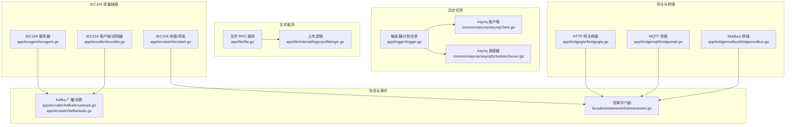
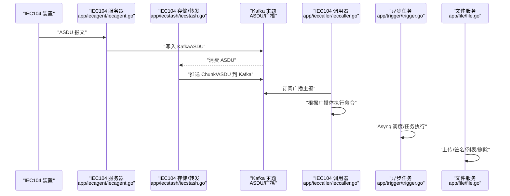
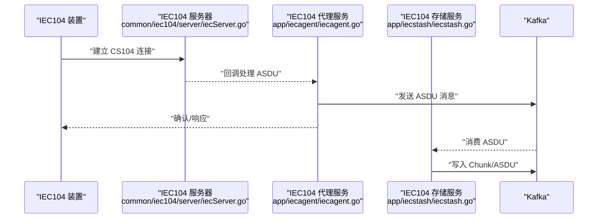
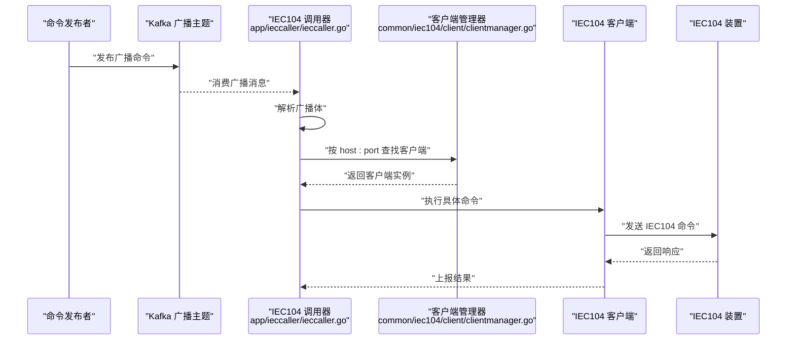
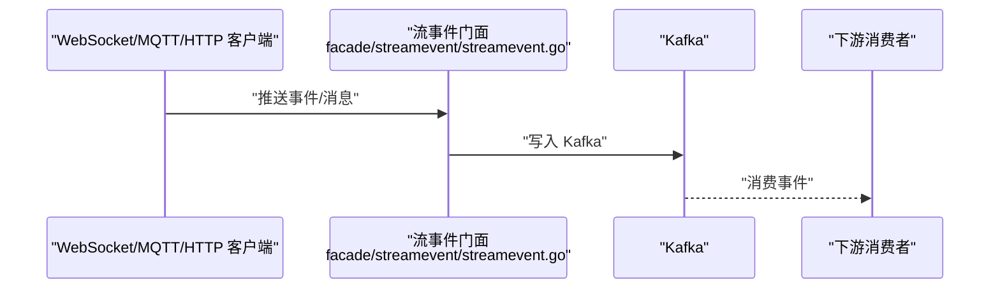
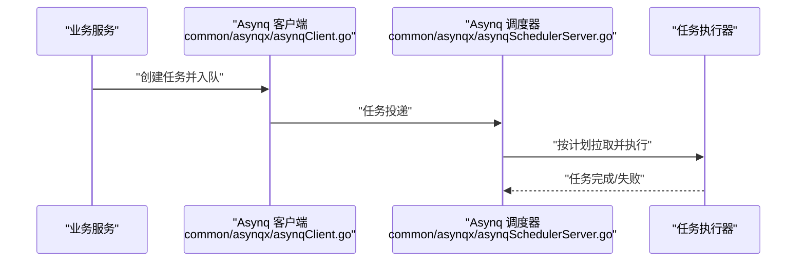
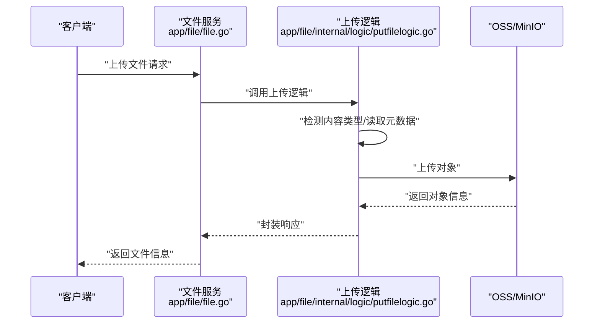
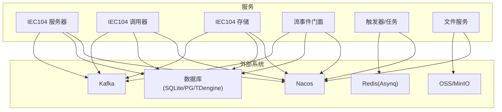

# 数据流设计

<cite>
**本文引用的文件**
- [app/iecagent/iecagent.go](file://app/iecagent/iecagent.go)
- [common/iec104/server/iecServer.go](file://common/iec104/server/iecServer.go)
- [app/ieccaller/ieccaller.go](file://app/ieccaller/ieccaller.go)
- [common/iec104/client/clientmanager.go](file://common/iec104/client/clientmanager.go)
- [app/ieccaller/kafka/broadcast.go](file://app/ieccaller/kafka/broadcast.go)
- [app/iecstash/iecstash.go](file://app/iecstash/iecstash.go)
- [app/iecstash/kafka/asdu.go](file://app/iecstash/kafka/asdu.go)
- [facade/streamevent/streamevent.go](file://facade/streamevent/streamevent.go)
- [app/trigger/trigger.go](file://app/trigger/trigger.go)
- [common/asynqx/asynqClient.go](file://common/asynqx/asynqClient.go)
- [common/asynqx/asynqSchedulerServer.go](file://common/asynqx/asynqSchedulerServer.go)
- [app/file/file.go](file://app/file/file.go)
- [app/file/internal/logic/putfilelogic.go](file://app/file/internal/logic/putfilelogic.go)
- [app/bridgemqtt/bridgemqtt.go](file://app/bridgemqtt/bridgemqtt.go)
- [app/bridgemqtt/internal/logic/publishlogic.go](file://app/bridgemqtt/internal/logic/publishlogic.go)
- [app/bridgemqtt/internal/handler/mqttstreamhandler.go](file://app/bridgemqtt/internal/handler/mqttstreamhandler.go)
- [app/bridgegtw/bridgegtw.go](file://app/bridgegtw/bridgegtw.go)
- [app/bridgegtw/internal/handler/routes.go](file://app/bridgegtw/internal/handler/routes.go)
- [app/bridgegtw/internal/logic/bridgeGtw/pinglogic.go](file://app/bridgegtw/internal/logic/bridgeGtw/pinglogic.go)
- [app/bridgegtw/etc/bridgegtw.yaml](file://app/bridgegtw/etc/bridgegtw.yaml)
- [app/bridgemodbus/bridgemodbus.go](file://app/bridgemodbus/bridgemodbus.go)
- [app/bridgemodbus/internal/logic/readholdingregisterslogic.go](file://app/bridgemodbus/internal/logic/readholdingregisterslogic.go)
- [app/bridgemodbus/internal/logic/writesingleregisterlogic.go](file://app/bridgemodbus/internal/logic/writesingleregisterlogic.go)
- [app/bridgemodbus/etc/bridgemodbus.yaml](file://app/bridgemodbus/etc/bridgemodbus.yaml)
- [common/mqttx/message.go](file://common/mqttx/message.go)
- [common/mqttx/trace.go](file://common/mqttx/trace.go)
- [common/executorx/chunkmessagespusher.go](file://common/executorx/chunkmessagespusher.go)
- [common/dbx/dbx.go](file://common/dbx/dbx.go)
- [common/dbx/sqlitesql.go](file://common/dbx/sqlitesql.go)
- [common/dbx/taossql.go](file://common/dbx/taossql.go)
- [model/devicepointmappingmodel.go](file://model/devicepointmappingmodel.go)
- [model/modbusslaveconfigmodel.go](file://model/modbusslaveconfigmodel.go)
- [model/ossmodel.go](file://model/ossmodel.go)
- [common/ossx/minio_oss.go](file://common/ossx/minio_oss.go)
- [common/ossx/osssconfig/ossconfig.go](file://common/ossx/osssconfig/ossconfig.go)
- [common/nacosx/register.go](file://common/nacosx/register.go)
- [common/nacosx/resolver.go](file://common/nacosx/resolver.go)
- [common/nacosx/target.go](file://common/nacosx/target.go)
- [common/nacosx/options.go](file://common/nacosx/options.go)
- [common/nacosx/config.go](file://common/nacosx/config.go)
- [common/nacosx/README.md](file://common/nacosx/README.md)
- [deploy/docker-compose.yml](file://deploy/docker-compose.yml)
- [deploy/stat_analyzer.html](file://deploy/stat_analyzer.html)
</cite>

## 目录
1. [引言](#引言)
2. [项目结构](#项目结构)
3. [核心组件](#核心组件)
4. [架构总览](#架构总览)
5. [详细组件分析](#详细组件分析)
6. [依赖分析](#依赖分析)
7. [性能考虑](#性能考虑)
8. [故障排查指南](#故障排查指南)
9. [结论](#结论)
10. [附录](#附录)

## 引言
本文件面向 zero-service 的数据流设计，聚焦以下方面：
- IEC104 数采平台的数据采集、传输、处理与存储流程
- 异步任务调度的数据流转机制（基于 Redis 的 Asynq）
- 文件服务的上传下载流程与对象存储集成
- Kafka 消息队列在跨服务广播与数据分发中的作用
- 数据在不同服务间的传递方式与数据格式转换
- 数据一致性、缓存策略、备份与恢复方案
- 数据安全与隐私保护措施

## 项目结构
系统采用多微服务架构，围绕 IEC104、MQTT、Kafka、异步任务与文件服务等模块构建。各服务通过 gRPC 提供接口，并可选注册到 Nacos 进行服务发现。

图表来源
- [app/iecagent/iecagent.go:30-58](file://app/iecagent/iecagent.go#L30-L58)
- [app/ieccaller/ieccaller.go:98-117](file://app/ieccaller/ieccaller.go#L98-L117)
- [app/iecstash/iecstash.go:79-81](file://app/iecstash/iecstash.go#L79-L81)
- [facade/streamevent/streamevent.go:28-71](file://facade/streamevent/streamevent.go#L28-L71)
- [app/trigger/trigger.go:77-84](file://app/trigger/trigger.go#L77-L84)
- [common/asynqx/asynqClient.go:17-19](file://common/asynqx/asynqClient.go#L17-L19)
- [common/asynqx/asynqSchedulerServer.go:32-52](file://common/asynqx/asynqSchedulerServer.go#L32-L52)
- [app/file/file.go:28-71](file://app/file/file.go#L28-L71)
- [app/bridgegtw/bridgegtw.go:1-200](file://app/bridgegtw/bridgegtw.go#L1-L200)
- [app/bridgemqtt/bridgemqtt.go:1-200](file://app/bridgemqtt/bridgemqtt.go#L1-L200)
- [app/bridgemodbus/bridgemodbus.go:1-200](file://app/bridgemodbus/bridgemodbus.go#L1-L200)

章节来源
- [app/iecagent/iecagent.go:30-58](file://app/iecagent/iecagent.go#L30-L58)
- [app/ieccaller/ieccaller.go:98-117](file://app/ieccaller/ieccaller.go#L98-L117)
- [app/iecstash/iecstash.go:79-81](file://app/iecstash/iecstash.go#L79-L81)
- [facade/streamevent/streamevent.go:28-71](file://facade/streamevent/streamevent.go#L28-L71)
- [app/trigger/trigger.go:77-84](file://app/trigger/trigger.go#L77-L84)
- [common/asynqx/asynqClient.go:17-19](file://common/asynqx/asynqClient.go#L17-L19)
- [common/asynqx/asynqSchedulerServer.go:32-52](file://common/asynqx/asynqSchedulerServer.go#L32-L52)
- [app/file/file.go:28-71](file://app/file/file.go#L28-L71)
- [app/bridgegtw/bridgegtw.go:1-200](file://app/bridgegtw/bridgegtw.go#L1-L200)
- [app/bridgemqtt/bridgemqtt.go:1-200](file://app/bridgemqtt/bridgemqtt.go#L1-L200)
- [app/bridgemodbus/bridgemodbus.go:1-200](file://app/bridgemodbus/bridgemodbus.go#L1-L200)

## 核心组件
- IEC104 服务器：提供 IEC61850-5/IEC104 协议接入，监听并处理来自远端装置的 ASDU 报文。
- IEC104 客户端/调用器：主动向远端 IED 发起查询、读写命令，支持客户端管理与广播控制。
- IEC104 存储/转发：将接收到的 ASDU 写入 Kafka，供下游消费与持久化。
- 流事件门面：统一接收 MQTT/WebSocket/HTTP 等事件，转发至 Kafka 或直接处理。
- 异步任务调度：基于 Asynq 的任务生产者与调度器，支持 Cron 调度与延迟任务。
- 文件服务：提供文件上传、签名、列表、删除等能力，对接 OSS/MinIO。
- 网关与桥接：HTTP 网关桥接、MQTT 桥接、Modbus 桥接，统一接入与协议转换。

章节来源
- [common/iec104/server/iecServer.go:17-37](file://common/iec104/server/iecServer.go#L17-L37)
- [common/iec104/client/clientmanager.go:17-144](file://common/iec104/client/clientmanager.go#L17-L144)
- [app/ieccaller/kafka/broadcast.go:24-148](file://app/ieccaller/kafka/broadcast.go#L24-L148)
- [app/iecstash/kafka/asdu.go:20-24](file://app/iecstash/kafka/asdu.go#L20-L24)
- [facade/streamevent/streamevent.go:28-71](file://facade/streamevent/streamevent.go#L28-L71)
- [common/asynqx/asynqClient.go:17-30](file://common/asynqx/asynqClient.go#L17-L30)
- [common/asynqx/asynqSchedulerServer.go:15-52](file://common/asynqx/asynqSchedulerServer.go#L15-L52)
- [app/file/internal/logic/putfilelogic.go:33-77](file://app/file/internal/logic/putfilelogic.go#L33-L77)

## 架构总览
下图展示从 IEC104 装置到 Kafka、再到下游消费与存储的整体数据流。

图表来源
- [app/iecagent/iecagent.go:53-54](file://app/iecagent/iecagent.go#L53-L54)
- [app/iecstash/iecstash.go:80-81](file://app/iecstash/iecstash.go#L80-L81)
- [app/ieccaller/ieccaller.go:98-117](file://app/ieccaller/ieccaller.go#L98-L117)
- [app/trigger/trigger.go:77-84](file://app/trigger/trigger.go#L77-L84)
- [app/file/file.go:28-71](file://app/file/file.go#L28-L71)

## 详细组件分析

### IEC104 数据采集与传输
- IEC104 服务器启动后监听指定地址与端口，接收来自 IED 的 ASDU 报文。
- IEC104 客户端管理器负责维护多个远端连接，支持按 host:port 注册与查询。
- IEC104 存储服务将 ASDU 写入 Kafka，供下游消费；同时通过流事件门面进行统一事件处理。

图表来源
- [common/iec104/server/iecServer.go:17-37](file://common/iec104/server/iecServer.go#L17-L37)
- [app/iecagent/iecagent.go:53-54](file://app/iecagent/iecagent.go#L53-L54)
- [app/iecstash/iecstash.go:80-81](file://app/iecstash/iecstash.go#L80-L81)

章节来源
- [common/iec104/server/iecServer.go:17-37](file://common/iec104/server/iecServer.go#L17-L37)
- [common/iec104/client/clientmanager.go:35-100](file://common/iec104/client/clientmanager.go#L35-L100)
- [app/iecstash/kafka/asdu.go:20-24](file://app/iecstash/kafka/asdu.go#L20-L24)

### IEC104 命令下发与广播
- IEC104 调用器通过 Kafka 广播主题接收命令，解析广播体后选择对应方法（如 interrogation、read、test、command 等），并在本地客户端管理器中查找目标 IEC104 客户端执行。
- 广播机制避免了跨服务直接调用，降低耦合度。

图表来源
- [app/ieccaller/ieccaller.go:98-117](file://app/ieccaller/ieccaller.go#L98-L117)
- [app/ieccaller/kafka/broadcast.go:24-148](file://app/ieccaller/kafka/broadcast.go#L24-L148)
- [common/iec104/client/clientmanager.go:57-68](file://common/iec104/client/clientmanager.go#L57-L68)

章节来源
- [app/ieccaller/kafka/broadcast.go:24-148](file://app/ieccaller/kafka/broadcast.go#L24-L148)
- [common/iec104/client/clientmanager.go:35-100](file://common/iec104/client/clientmanager.go#L35-L100)

### 流事件门面与多协议接入
- 流事件门面统一接收来自 WebSocket、MQTT、HTTP 等事件，将事件转化为内部消息或写入 Kafka，便于后续处理与持久化。
- 支持将 IEC104 的 Chunk/ASDU 推送至 Kafka，形成统一的数据通道。

图表来源
- [facade/streamevent/streamevent.go:28-71](file://facade/streamevent/streamevent.go#L28-L71)
- [app/bridgemqtt/bridgemqtt.go:1-200](file://app/bridgemqtt/bridgemqtt.go#L1-L200)
- [app/bridgegtw/bridgegtw.go:1-200](file://app/bridgegtw/bridgegtw.go#L1-L200)

章节来源
- [facade/streamevent/streamevent.go:28-71](file://facade/streamevent/streamevent.go#L28-L71)
- [app/bridgemqtt/bridgemqtt.go:1-200](file://app/bridgemqtt/bridgemqtt.go#L1-L200)
- [app/bridgegtw/bridgegtw.go:1-200](file://app/bridgegtw/bridgegtw.go#L1-L200)

### 异步任务调度的数据流转
- 触发器服务启动 Asynq 任务服务器与调度器，支持 Cron 表达式与延迟任务。
- 生产者通过 Asynq 客户端将任务入队，调度器按计划执行，实现解耦的后台处理。

图表来源
- [app/trigger/trigger.go:77-84](file://app/trigger/trigger.go#L77-L84)
- [common/asynqx/asynqClient.go:17-30](file://common/asynqx/asynqClient.go#L17-L30)
- [common/asynqx/asynqSchedulerServer.go:15-52](file://common/asynqx/asynqSchedulerServer.go#L15-L52)

章节来源
- [app/trigger/trigger.go:77-84](file://app/trigger/trigger.go#L77-L84)
- [common/asynqx/asynqClient.go:17-30](file://common/asynqx/asynqClient.go#L17-L30)
- [common/asynqx/asynqSchedulerServer.go:15-52](file://common/asynqx/asynqSchedulerServer.go#L15-L52)

### 文件服务上传流程
- 文件服务接收上传请求，根据租户与桶配置选择 OSS 模板，检测内容类型并上传对象存储。
- 对图片文件提取 EXIF 元信息并回传给调用方。

图表来源
- [app/file/file.go:28-71](file://app/file/file.go#L28-L71)
- [app/file/internal/logic/putfilelogic.go:33-77](file://app/file/internal/logic/putfilelogic.go#L33-L77)
- [common/ossx/minio_oss.go:1-200](file://common/ossx/minio_oss.go#L1-L200)

章节来源
- [app/file/internal/logic/putfilelogic.go:33-77](file://app/file/internal/logic/putfilelogic.go#L33-L77)
- [common/ossx/minio_oss.go:1-200](file://common/ossx/minio_oss.go#L1-L200)

### 数据格式与协议转换
- IEC104 报文以 ASDU 形式在 Kafka 中传输，消费端可进一步解析为内部模型或直接透传。
- MQTT/WS/HTTP 事件经门面统一转换为内部消息或直接写入 Kafka。
- 文件上传时根据前缀字节检测 MIME 类型，确保对象存储正确识别媒体类型。

章节来源
- [app/iecstash/kafka/asdu.go:20-24](file://app/iecstash/kafka/asdu.go#L20-L24)
- [facade/streamevent/streamevent.go:28-71](file://facade/streamevent/streamevent.go#L28-L71)
- [app/file/internal/logic/putfilelogic.go:56-60](file://app/file/internal/logic/putfilelogic.go#L56-L60)

## 依赖分析
- 服务发现与注册：各服务可选注册到 Nacos，便于动态发现与负载均衡。
- 配置中心：通过 YAML 配置文件集中管理服务端口、Kafka 地址、Redis 地址、OSS 参数等。
- 外部依赖：Kafka、Redis（Asynq）、对象存储（OSS/MinIO）、数据库（SQLite/PostgreSQL/TDengine）。

图表来源
- [common/nacosx/register.go:1-200](file://common/nacosx/register.go#L1-L200)
- [deploy/docker-compose.yml:1-200](file://deploy/docker-compose.yml#L1-L200)

章节来源
- [common/nacosx/register.go:1-200](file://common/nacosx/register.go#L1-L200)
- [deploy/docker-compose.yml:1-200](file://deploy/docker-compose.yml#L1-L200)

## 性能考虑
- Kafka 批量消费与限流：通过批量大小、最小/最大字节参数平衡吞吐与延迟。
- Asynq 并发与资源池：合理设置并发数与连接池大小，避免阻塞与资源争用。
- IEC104 客户端连接复用：使用客户端管理器统一维护连接，减少重复握手开销。
- 缓存策略：设备点映射缓存按需清理，避免过期数据占用内存。
- IO 优化：文件上传采用流式读取与类型检测，避免一次性加载大文件。

## 故障排查指南
- IEC104 连接异常
  - 检查 IEC104 服务器监听地址与端口配置。
  - 查看客户端管理器统计日志，确认连接状态。
- Kafka 消费堆积
  - 检查消费者组偏移提交策略与并发数。
  - 关注广播与 ASDU 主题分区分布。
- Asynq 任务积压
  - 检查 Redis 可用性与网络延迟。
  - 调整任务并发与重试策略。
- 文件上传失败
  - 核对 OSS 凭证与桶权限。
  - 检查文件路径与类型检测逻辑。

章节来源
- [common/iec104/server/iecServer.go:31-37](file://common/iec104/server/iecServer.go#L31-L37)
- [common/iec104/client/clientmanager.go:117-144](file://common/iec104/client/clientmanager.go#L117-L144)
- [app/ieccaller/kafka/broadcast.go:24-148](file://app/ieccaller/kafka/broadcast.go#L24-L148)
- [app/iecstash/kafka/asdu.go:20-24](file://app/iecstash/kafka/asdu.go#L20-L24)
- [common/asynqx/asynqSchedulerServer.go:21-30](file://common/asynqx/asynqSchedulerServer.go#L21-L30)
- [app/file/internal/logic/putfilelogic.go:33-77](file://app/file/internal/logic/putfilelogic.go#L33-L77)

## 结论
本数据流设计以 Kafka 为核心枢纽，串联 IEC104、MQTT、WebSocket、HTTP 等多源事件，结合 Asynq 实现异步任务编排，配合文件服务与对象存储完成数据的全生命周期管理。通过客户端管理器与广播机制，系统实现了低耦合、高扩展的分布式数据采集与处理体系。

## 附录

### 数据一致性与缓存策略
- 一致性
  - Kafka 顺序写入保障事件顺序性；消费端采用幂等处理与偏移提交策略，降低重复与丢失风险。
  - Asynq 任务具备重试与保留策略，确保关键任务最终成功。
- 缓存
  - 设备点映射缓存在广播清理指令下按键或键信息批量清除，避免脏数据影响。
  - IEC104 客户端连接状态定期统计，便于快速定位异常。

章节来源
- [app/ieccaller/kafka/broadcast.go:111-143](file://app/ieccaller/kafka/broadcast.go#L111-L143)
- [common/iec104/client/clientmanager.go:117-144](file://common/iec104/client/clientmanager.go#L117-L144)

### 数据备份与恢复
- Kafka
  - 启用副本与分区冗余，定期备份主题快照。
- Redis
  - 开启 RDB/AOF 持久化，定期快照与 AOF 重写。
- 对象存储
  - 启用版本控制与生命周期策略，定期校验与归档。
- 数据库
  - SQLite/PG/TDengine 分别制定备份策略与增量备份计划。

### 数据安全与隐私保护
- 传输加密
  - gRPC 与 Kafka 建议启用 TLS，MQTT/WebSocket 支持 WSS。
- 认证与授权
  - 服务间调用建议启用双向认证；文件访问通过签名 URL 控制有效期。
- 敏感数据
  - 日志脱敏与最小化记录；数据库字段加密与访问审计。
- 合规
  - 遵循所在区域的数据保护法规，明确数据留存与删除策略。