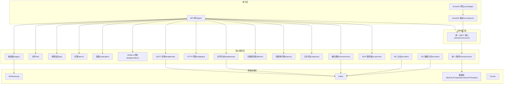
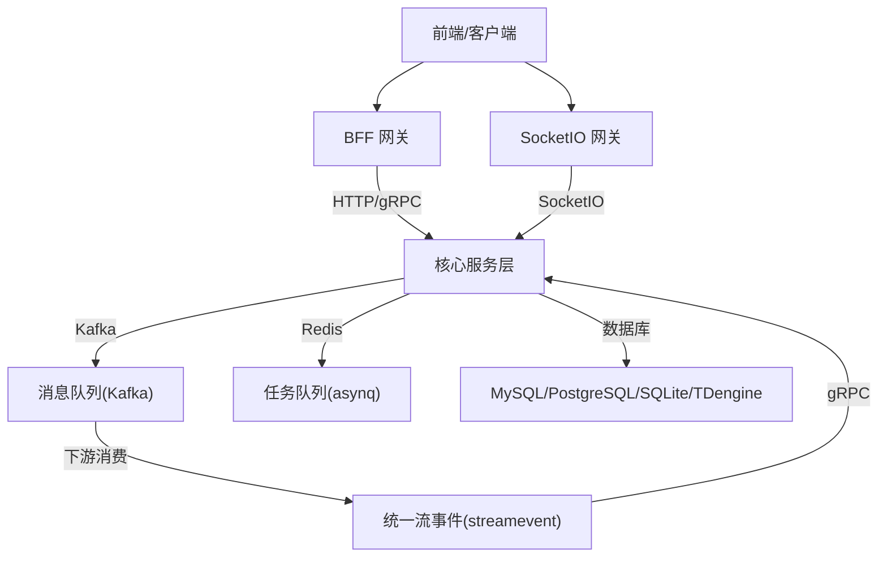
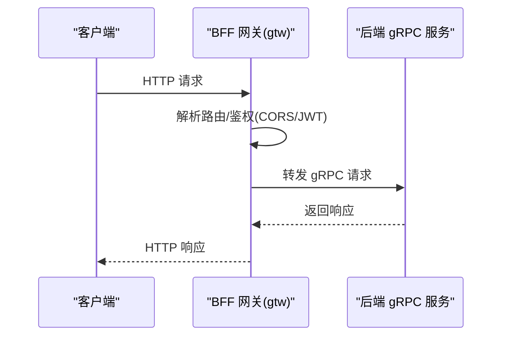
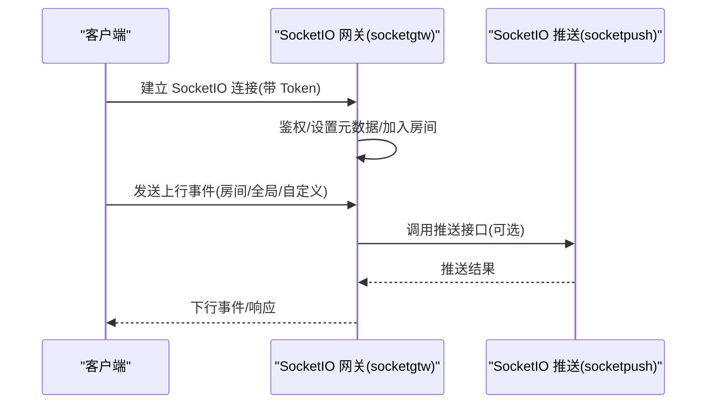
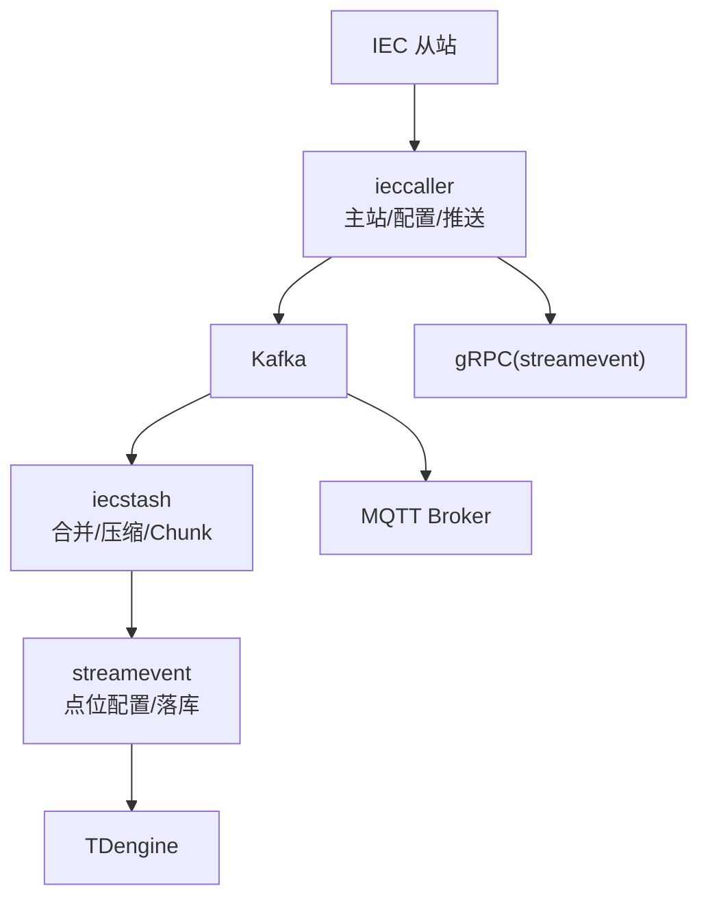
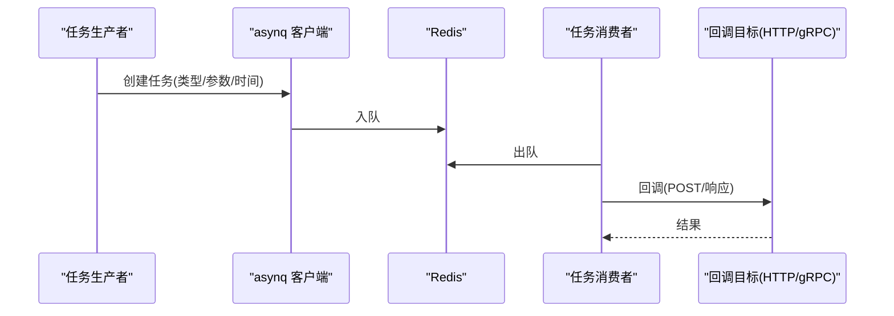
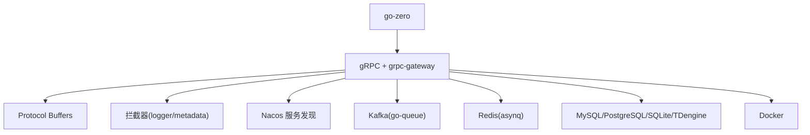

# 整体架构

<cite>
**本文引用的文件**
- [README.md](file://README.md)
- [go.mod](file://go.mod)
- [docker-compose.yml](file://deploy/docker-compose.yml)
- [trigger.yaml](file://app/trigger/etc/trigger.yaml)
- [ieccaller.yaml](file://app/ieccaller/etc/ieccaller.yaml)
- [bridgemqtt.yaml](file://app/bridgemqtt/etc/bridgemqtt.yaml)
- [socketgtw.yaml](file://socketapp/socketgtw/etc/socketgtw.yaml)
- [streamevent.yaml](file://facade/streamevent/etc/streamevent.yaml)
- [server.go](file://common/socketiox/server.go)
- [loggerInterceptor.go](file://common/Interceptor/rpcserver/loggerInterceptor.go)
- [dbx.go](file://common/dbx/dbx.go)
- [asynqClient.go](file://common/asynqx/asynqClient.go)
- [gtw.go](file://gtw/gtw.go)
</cite>

## 目录
1. [简介](#简介)
2. [项目结构](#项目结构)
3. [核心组件](#核心组件)
4. [架构总览](#架构总览)
5. [详细组件分析](#详细组件分析)
6. [依赖分析](#依赖分析)
7. [性能考量](#性能考量)
8. [故障排查指南](#故障排查指南)
9. [结论](#结论)
10. [附录](#附录)

## 简介
本项目基于 go-zero 构建的工业级微服务脚手架，聚焦物联网数据采集、异步任务调度与实时通信等场景，提供多协议接入与高性能数据处理能力。系统采用分层架构设计，包含接入层（BFF 网关与 SocketIO 实时通信）、核心服务层（多个微服务）、对外接口层（统一 gRPC 接口）与基础设施层（Kafka、Redis、数据库、Docker），并通过 Nacos 实现服务注册与发现，结合 asynq 与 Redis 实现分布式任务队列，支撑高并发与可扩展的工业应用。

## 项目结构
项目采用“按功能域分层 + 微服务拆分”的组织方式：
- app/：核心微服务集合，涵盖 IEC 104 数采平台、文件服务、GIS、告警、容器管理、协议桥接、触发器、流媒体等
- socketapp/：SocketIO 实时通信相关服务（socketgtw、socketpush）
- gtw/：BFF 网关，提供 HTTP/gRPC 聚合入口
- facade/：对外统一接口层（streamevent），定义跨语言 gRPC 协议
- common/：公共组件库，包含协议扩展、拦截器、数据库适配、任务队列、SocketIO 封装等
- model/：数据库模型与 SQL 脚本
- deploy/：Docker Compose 编排与部署配置
- swagger/：各服务 Swagger 文档
- third_party/：第三方 proto 定义
- util/：工具集与脚本

图表来源
- [README.md:15-51](file://README.md#L15-L51)
- [README.md:59-108](file://README.md#L59-L108)
- [docker-compose.yml:1-110](file://deploy/docker-compose.yml#L1-L110)

章节来源
- [README.md:15-51](file://README.md#L15-L51)
- [README.md:59-108](file://README.md#L59-L108)
- [docker-compose.yml:1-110](file://deploy/docker-compose.yml#L1-L110)

## 核心组件
- BFF 网关（gtw）：统一 API 入口，聚合 gRPC 后端服务并通过 grpc-gateway 提供 HTTP 访问；支持 JWT 认证、CORS、文件上传下载等
- SocketIO 实时通信：socketgtw 负责连接管理、房间管理、消息路由与 Token 鉴权；socketpush 提供 Token 生成/验证与 gRPC 推送接口
- 对外接口层（facade/streamevent）：统一跨语言流数据事件协议，接收来自 Kafka、MQTT、WebSocket 的消息，并统一推送至 TDengine
- 核心服务层：
  - IEC 104 数采平台：ieccaller（主站）、iecstash（合并）、streamevent（落库）
  - 触发器（trigger）：基于 asynq 的分布式任务队列 + 计划任务引擎
  - 文件（file）、地理信息（gis）、告警（alarm）、容器（podengine）、协议桥接（bridgemodbus、bridgemqtt、bridgegtw、bridgedump）
  - 流媒体（lalhook、lalproxy）、日志（logdump）、融合模拟（xfusionmock）、MCP（mcpserver）

章节来源
- [README.md:189-206](file://README.md#L189-L206)
- [README.md:110-188](file://README.md#L110-L188)
- [README.md:189-206](file://README.md#L189-L206)

## 架构总览
系统采用分层架构与微服务拆分相结合的设计：
- 接入层：BFF 网关与 SocketIO 实时通信，负责统一入口与低延迟双向通信
- 核心服务层：围绕业务域拆分微服务，职责清晰，便于独立演进与扩展
- 对外接口层：统一 gRPC 协议，屏蔽底层差异，支持多语言客户端
- 基础设施层：Kafka 实现异步解耦与数据汇聚，Redis 支撑任务队列与缓存，数据库承载结构化数据，Docker 提供容器化部署

图表来源
- [README.md:15-51](file://README.md#L15-L51)
- [README.md:110-188](file://README.md#L110-L188)
- [README.md:189-206](file://README.md#L189-L206)

## 详细组件分析

### 接入层：BFF 网关（gtw）
- 职责：统一 API 入口，聚合 gRPC 后端服务，提供 grpc-gateway HTTP 访问；支持 JWT、CORS、文件上传下载
- 关键点：动态 CORS 配置、Swagger 文档静态路由、服务注册与发现（Nacos）
- 配置要点：监听地址、日志级别、Swagger 路径、服务注册开关

图表来源
- [gtw.go:51-95](file://gtw/gtw.go#L51-L95)
- [trigger.yaml:11-38](file://app/trigger/etc/trigger.yaml#L11-L38)

章节来源
- [gtw.go:51-95](file://gtw/gtw.go#L51-L95)
- [trigger.yaml:11-38](file://app/trigger/etc/trigger.yaml#L11-L38)

### 接入层：SocketIO 实时通信（socketgtw/socketpush）
- socketgtw：连接管理、房间管理、消息路由、Token 鉴权、统计推送
- socketpush：Token 生成/验证、gRPC 推送接口、后端服务调用入口
- 关键点：事件模型（上行/下行/房间/全局广播）、会话元数据管理、钩子机制（连接/断开/加入房间）

图表来源
- [server.go:337-676](file://common/socketiox/server.go#L337-L676)
- [socketgtw.yaml:18-35](file://socketapp/socketgtw/etc/socketgtw.yaml#L18-L35)

章节来源
- [server.go:337-676](file://common/socketiox/server.go#L337-L676)
- [socketgtw.yaml:18-35](file://socketapp/socketgtw/etc/socketgtw.yaml#L18-L35)

### 核心服务层：IEC 104 数采平台
- ieccaller：IEC 104 主站，多从站并行通信，Kafka/MQTT/gRPC 三协议推送，内嵌 SQLite 动态配置
- iecstash：Kafka 消费、ASDU 压缩合并、Chunk 批量处理、下游 RPC 转发
- streamevent：统一流事件协议，接收多协议消息，点位配置管理，TDengine 时序存储
- 数据流：IEC 从站 → ieccaller → Kafka → iecstash → streamevent → TDengine；MQTT/gRPC 并行推送

图表来源
- [README.md:112-131](file://README.md#L112-L131)
- [ieccaller.yaml:35-79](file://app/ieccaller/etc/ieccaller.yaml#L35-L79)
- [streamevent.yaml:22-28](file://facade/streamevent/etc/streamevent.yaml#L22-L28)

章节来源
- [README.md:112-131](file://README.md#L112-L131)
- [ieccaller.yaml:35-79](file://app/ieccaller/etc/ieccaller.yaml#L35-L79)
- [streamevent.yaml:22-28](file://facade/streamevent/etc/streamevent.yaml#L22-L28)

### 核心服务层：触发器（trigger）与任务队列（asynq）
- 异步任务调度：基于 asynq 的分布式任务队列，Redis 存储；支持定时/延时任务、HTTP/gRPC 回调、自动重试与生命周期管理
- 计划任务引擎：基于数据库扫描的定时调度，Plan/Batch/ExecItem 三级模型，状态机完备，分布式锁防重
- 配置要点：Redis 连接、数据库连接、StreamEvent 目标端点

图表来源
- [asynqClient.go:17-31](file://common/asynqx/asynqClient.go#L17-L31)
- [trigger.yaml:19-38](file://app/trigger/etc/trigger.yaml#L19-L38)

章节来源
- [asynqClient.go:17-31](file://common/asynqx/asynqClient.go#L17-L31)
- [trigger.yaml:19-38](file://app/trigger/etc/trigger.yaml#L19-L38)

### 对外接口层：统一 gRPC 接口（facade/streamevent）
- 职责：统一跨语言流数据事件协议，支持 MQTT/WebSocket/Kafka 消息接收，IEC ASDU 推送，Socket 上行消息处理，计划任务事件处理
- 部署：作为独立服务运行，被其他服务通过 gRPC 调用或作为外部系统对接入口

章节来源
- [README.md:197-206](file://README.md#L197-L206)
- [streamevent.yaml:11-28](file://facade/streamevent/etc/streamevent.yaml#L11-L28)

### 基础设施层：Kafka、Redis、数据库、Docker
- Kafka：消息总线，承载 IEC、MQTT、Kafka、WebSocket 等多源数据汇聚
- Redis：asynq 任务队列存储，支持任务调度与分布式锁
- 数据库：MySQL/PostgreSQL/SQLite/TDengine，分别承担关系型数据与时序数据存储
- Docker：容器化部署，Compose 编排，支持独立服务构建与集群部署

章节来源
- [docker-compose.yml:1-110](file://deploy/docker-compose.yml#L1-L110)
- [dbx.go:22-64](file://common/dbx/dbx.go#L22-L64)
- [go.mod:49-51](file://go.mod#L49-L51)

## 依赖分析
- 技术栈与组件依赖：
  - 微服务框架：go-zero
  - RPC：gRPC + grpc-gateway + Protocol Buffers
  - 消息队列：Kafka（go-queue）
  - 任务队列：asynq + Redis
  - 实时通信：SocketIO（fork of socket.io-golang）
  - 工业协议：IEC 60870-5-104（go-iecp5）、Modbus（grid-x/modbus）、MQTT（paho.mqtt）
  - 关系数据库：MySQL/PostgreSQL/SQLite
  - 时序数据库：TDengine
  - 对象存储：MinIO/阿里 OSS/腾讯 COS
  - 服务发现：Nacos
  - 地理计算：H3（uber/h3-go）、GeoHash、orb、go-geom
  - 容器管理：Docker SDK
  - 监控追踪：OpenTelemetry/Prometheus
  - 容器编排：Docker Compose/Kubernetes（可选）

图表来源
- [go.mod:5-62](file://go.mod#L5-L62)
- [loggerInterceptor.go:12-44](file://common/Interceptor/rpcserver/loggerInterceptor.go#L12-L44)

章节来源
- [go.mod:5-62](file://go.mod#L5-L62)
- [loggerInterceptor.go:12-44](file://common/Interceptor/rpcserver/loggerInterceptor.go#L12-L44)

## 性能考量
- 并发与异步：SocketIO 使用 goroutine 安全处理，事件循环与统计推送周期化执行；触发器基于 asynq 的并发任务处理与限流
- 缓存与持久化：Redis 作为任务队列与缓存，Kafka 实现削峰填谷；数据库适配多库，支持 SQLite/PostgreSQL/MySQL/TAOS
- 网络与序列化：gRPC 二进制协议与 Protocol Buffers，减少序列化开销；BFF 层统一鉴权与 CORS，避免重复处理
- 可观测性：OpenTelemetry 集成，Prometheus 指标导出，便于性能监控与问题定位

## 故障排查指南
- gRPC 拦截器：在服务端拦截器中注入用户上下文与 TraceId，异常时记录错误日志，便于定位问题
- SocketIO：关注连接鉴权、房间加入/离开、广播事件与统计推送；检查会话元数据与钩子执行情况
- Kafka/Redis：确认连接地址、认证信息与分区/队列状态；检查任务积压与回调失败重试
- 数据库：根据数据源自动识别数据库类型，确保连接字符串正确；检查事务与查询日志

章节来源
- [loggerInterceptor.go:12-44](file://common/Interceptor/rpcserver/loggerInterceptor.go#L12-L44)
- [server.go:702-740](file://common/socketiox/server.go#L702-L740)
- [trigger.yaml:19-38](file://app/trigger/etc/trigger.yaml#L19-L38)
- [dbx.go:31-64](file://common/dbx/dbx.go#L31-L64)

## 结论
本项目通过 go-zero 的工程化能力与模块化设计，构建了面向工业场景的微服务架构。接入层提供统一入口与实时通信能力，核心服务层围绕业务域拆分，对外接口层以统一 gRPC 协议屏蔽差异，基础设施层以 Kafka/Redis/数据库/Docker 保障高可用与可扩展。该架构具备良好的可维护性、可扩展性与可观测性，适合在复杂工业环境中持续演进。

## 附录
- 部署拓扑：Docker Compose 默认包含 Kafka、Filebeat、bridgegtw、bridgedump、ieccaller、iecstash 等核心服务，便于快速启动与验证
- 配置管理：各服务配置集中于 etc/ 目录，支持 Nacos 注册与发现、Redis/Kafka/数据库连接、协议特定配置等
- 开发流程：新增服务遵循“proto 定义 → 代码生成 → 业务逻辑实现 → 配置与启动”的标准流程

章节来源
- [README.md:300-325](file://README.md#L300-L325)
- [docker-compose.yml:1-110](file://deploy/docker-compose.yml#L1-L110)